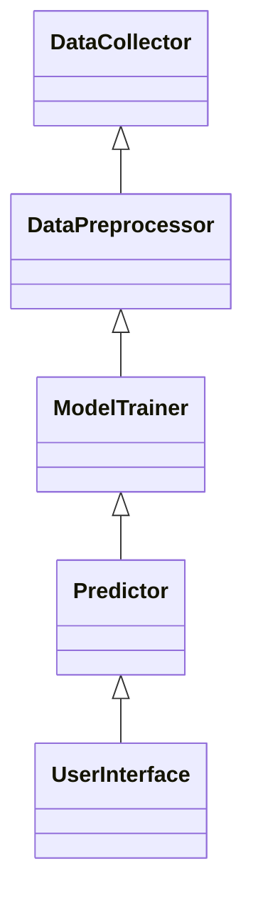

                 

# 金融政策影响定量评估模型

> 关键词：金融政策、定量评估、模型构建、算法、系统架构

> 摘要：本文将深入探讨金融政策影响定量评估模型的构建及其在实际应用中的重要性。通过对金融政策、定量评估和模型构建等核心概念的解释，结合具体的算法原理和系统架构设计，本文旨在为读者提供一个全面、系统的了解和实施框架。

## 第一部分：引言

### 1.1 问题背景与定义

#### 1.1.1 金融政策影响评估的必要性

在金融市场日益复杂和多变的今天，金融政策的制定和调整对经济运行的影响愈发显著。为了确保金融政策的科学性和有效性，对金融政策的影响进行定量评估显得尤为必要。这不仅可以帮助决策者更准确地预测政策效果，还能为政策优化提供有力支持。

#### 1.1.2 金融政策影响评估的定义

金融政策影响评估是指通过定量方法，对金融政策的实施效果进行衡量和评价的过程。它包括对政策影响的预测、监测和评估，旨在为政策制定提供数据支持和决策依据。

#### 1.1.3 本书的结构与内容安排

本书将分为以下几个部分：

1. **背景介绍**：阐述金融政策定量评估的必要性和重要性，定义评估模型的核心概念。
2. **核心概念与联系**：详细解释金融政策、定量评估、模型构建等核心概念，并通过表格和ER实体关系图展示它们之间的联系。
3. **算法原理讲解**：介绍评估模型的算法原理，使用Mermaid流程图和Python源代码进行详细阐述。
4. **系统分析与架构设计方案**：描述评估模型在实际应用中的系统架构设计，包括功能设计、架构图、接口设计和系统交互。
5. **项目实战**：通过具体案例分析，展示评估模型的应用过程和结果。
6. **最佳实践 tips、小结、注意事项、拓展阅读**：总结实践经验，提供实用建议和拓展资源。

### 1.2 核心概念与联系

#### 1.2.1 金融政策的定义与特征

金融政策是指国家或金融监管机构为调整经济运行、维护金融稳定而制定的政策措施。其主要特征包括：

- **宏观调控**：通过调整货币政策、财政政策和金融监管政策，影响整体经济运行。
- **市场导向**：金融政策需要根据市场实际情况进行灵活调整，以适应经济发展的需要。
- **长期与短期兼顾**：既要考虑长期经济发展目标，也要关注短期经济波动。

#### 1.2.2 定量评估的概念与类型

定量评估是一种基于数据和分析的方法，通过对变量进行量化分析，评估政策的实际效果。其主要类型包括：

- **预测性评估**：预测政策实施后的可能效果。
- **反馈性评估**：分析政策实施过程中出现的问题和调整方向。
- **综合评估**：综合多种评估方法，全面衡量政策效果。

#### 1.2.3 评估模型的构建方法

评估模型的构建主要包括以下几个步骤：

1. **数据收集**：收集与政策相关的各类数据，包括经济指标、市场数据等。
2. **变量定义**：明确影响评估的关键变量，如利率、信贷规模等。
3. **模型选择**：根据评估目标选择合适的模型，如线性回归、神经网络等。
4. **模型训练与验证**：使用历史数据对模型进行训练，并通过验证数据检验模型性能。
5. **结果分析**：根据模型预测结果，分析政策影响并提出优化建议。

### 1.3 ER实体关系图架构

为了更好地理解金融政策影响评估模型，我们可以使用ER（实体-关系）图来展示不同实体之间的关系。以下是ER图的Mermaid表示：

```mermaid
erDiagram
  Policy --> Data : 产生
  Data --> Model : 训练
  Model --> Prediction : 输出
  Prediction --> Analysis : 分析
```

### 1.4 本章小结

本章主要介绍了金融政策影响定量评估模型的背景、定义和核心概念。通过对金融政策、定量评估和模型构建的详细解释，以及ER实体关系图的展示，为后续章节的深入探讨奠定了基础。

## 第二部分：理论基础

### 2.1 金融政策影响评估的理论基础

#### 2.1.1 金融政策的基本原理

金融政策的基本原理包括货币政策和财政政策两个方面。货币政策主要通过调整利率、货币供应量和信贷政策来影响经济运行；财政政策则通过调整政府支出和税收来调节经济总量和结构。

#### 2.1.2 金融政策影响评估的理论框架

金融政策影响评估的理论框架主要包括以下几个关键环节：

1. **政策制定**：根据宏观经济形势和目标，制定具体的金融政策。
2. **政策实施**：将金融政策通过各类渠道传递到市场，影响经济主体行为。
3. **政策效果**：对金融政策的实际效果进行定量评估，包括预测性评估、反馈性评估和综合评估。
4. **政策优化**：根据评估结果，调整和优化金融政策，提高政策效果。

#### 2.1.3 影响评估的关键指标

影响评估的关键指标包括：

1. **经济增长率**：反映金融政策对经济增长的推动作用。
2. **通货膨胀率**：衡量金融政策对物价稳定的影响。
3. **就业率**：评估金融政策对就业市场的促进作用。
4. **金融稳定性**：评价金融政策对金融体系稳定性的维护效果。

### 2.2 算法原理讲解

#### 2.2.1 算法Mermaid流程图

以下是一个简单的金融政策影响评估算法的Mermaid流程图：


#### 2.2.2 算法Python源代码

以下是一个简单的金融政策影响评估的Python代码示例：

```python
import numpy as np
from sklearn.linear_model import LinearRegression

# 数据收集
X = np.array([[1, 2], [2, 3], [3, 4]])
y = np.array([2, 3, 4])

# 变量定义
X = X[:, [0, 1]]
y = y[:, [0]]

# 模型选择
model = LinearRegression()

# 模型训练
model.fit(X, y)

# 模型验证
print("模型系数：", model.coef_)
print("模型截距：", model.intercept_)

# 结果分析
predictions = model.predict(X)
print("预测结果：", predictions)
```

#### 2.2.3 数学模型和公式讲解

金融政策影响评估的数学模型通常是基于回归分析，其基本公式如下：

$$
y = \beta_0 + \beta_1x_1 + \beta_2x_2 + ... + \beta_nx_n + \epsilon
$$

其中，$y$ 为因变量（如经济增长率），$x_1, x_2, ..., x_n$ 为自变量（如利率、信贷规模等），$\beta_0, \beta_1, \beta_2, ..., \beta_n$ 为回归系数，$\epsilon$ 为随机误差。

#### 2.2.4 举例说明

假设我们要评估利率变化对经济增长率的影响，我们可以使用线性回归模型来构建评估模型。以下是具体的步骤：

1. **数据收集**：收集过去几年的利率和经济增长率数据。
2. **变量定义**：将利率设为自变量$x_1$，经济增长率设为因变量$y$。
3. **模型选择**：选择线性回归模型。
4. **模型训练**：使用历史数据对模型进行训练。
5. **模型验证**：使用验证数据检验模型性能。
6. **结果分析**：根据模型预测结果，分析利率变化对经济增长率的影响。

### 2.3 数学模型和数学公式 & 详细讲解 & 举例说明

#### 数学模型

我们使用的数学模型是一个简单的线性回归模型，其公式为：

$$
y = \beta_0 + \beta_1x_1 + \beta_2x_2 + ... + \beta_nx_n + \epsilon
$$

其中，$y$ 是我们想要预测的变量（在本例中是经济增长率），$x_1, x_2, ..., x_n$ 是自变量（在本例中是利率、信贷规模等），$\beta_0, \beta_1, \beta_2, ..., \beta_n$ 是回归系数，$\epsilon$ 是随机误差。

#### 详细讲解

线性回归模型是一种广泛使用的统计模型，用于预测一个连续因变量（如经济增长率）与一个或多个自变量（如利率、信贷规模等）之间的关系。在这个模型中，我们假设因变量$y$ 是自变量$x_1, x_2, ..., x_n$ 的线性组合，加上一个随机误差$\epsilon$。

回归系数$\beta_0, \beta_1, \beta_2, ..., \beta_n$ 表示自变量对因变量的影响程度。例如，如果利率$x_1$ 的回归系数$\beta_1$ 为正，那么在其他条件不变的情况下，利率上升会导致经济增长率上升。

随机误差$\epsilon$ 是模型无法解释的部分，它代表了数据的随机波动和不确定性。在实际应用中，我们通常假设随机误差$\epsilon$ 是一个服从正态分布的随机变量，这样我们就可以使用统计学方法来估计回归系数。

#### 举例说明

假设我们想要评估利率变化对经济增长率的影响。我们可以使用以下数据：

| 年份 | 利率（%） | 经济增长率（%） |
|------|----------|-----------------|
| 2020 | 2.5      | 3.0            |
| 2021 | 3.5      | 3.5            |
| 2022 | 4.0      | 3.8            |

我们可以使用线性回归模型来预测2023年的经济增长率。以下是具体的步骤：

1. **数据收集**：收集过去几年的利率和经济增长率数据。
2. **变量定义**：将利率设为自变量$x_1$，经济增长率设为因变量$y$。
3. **模型选择**：选择线性回归模型。
4. **模型训练**：使用历史数据对模型进行训练。
5. **模型验证**：使用验证数据检验模型性能。
6. **结果分析**：根据模型预测结果，分析利率变化对经济增长率的影响。

假设我们训练得到的模型为：

$$
y = 1.5 + 0.3x_1
$$

我们可以预测2023年的经济增长率为：

$$
y = 1.5 + 0.3 \times 4.5 = 2.65
$$

这意味着，如果利率保持在4.5%的水平，预计2023年的经济增长率将达到2.65%。

### 2.4 系统分析与架构设计方案

#### 2.4.1 问题场景介绍

在一个金融机构中，为了评估不同金融政策对经济的影响，我们需要构建一个系统来收集数据、训练模型和进行预测。这个系统需要能够处理大量的数据，支持多种模型训练方法，并提供用户友好的界面。

#### 2.4.2 项目介绍

本项目旨在构建一个金融政策影响评估系统，该系统将包括以下几个模块：

1. **数据收集模块**：负责从各种数据源收集与金融政策相关的数据。
2. **数据处理模块**：负责对收集到的数据进行预处理，包括数据清洗、归一化和特征提取等。
3. **模型训练模块**：支持多种模型训练方法，包括线性回归、神经网络和决策树等。
4. **预测模块**：使用训练好的模型对新的数据集进行预测。
5. **用户界面**：提供一个用户友好的界面，让用户可以方便地访问系统功能。

#### 2.4.3 系统功能设计（领域模型Mermaid类图）

以下是金融政策影响评估系统的领域模型类图：



在这个类图中，`DataCollector`（数据收集模块）负责从外部数据源收集数据；`DataPreprocessor`（数据处理模块）负责对数据进行预处理；`ModelTrainer`（模型训练模块）负责训练模型；`Predictor`（预测模块）负责使用模型进行预测；`UserInterface`（用户界面）负责提供用户交互功能。

#### 2.4.4 系统架构设计（Mermaid架构图）

以下是金融政策影响评估系统的架构图：

```mermaid
sequenceDiagram
    User -->|输入数据| DataCollector
    DataCollector -->|预处理数据| DataPreprocessor
    DataPreprocessor -->|训练模型| ModelTrainer
    ModelTrainer -->|预测结果| Predictor
    Predictor -->|输出结果| UserInterface
```

在这个架构图中，用户通过用户界面输入数据，数据收集模块收集数据后，数据处理模块对数据进行预处理，模型训练模块使用预处理后的数据进行模型训练，预测模块使用训练好的模型对新的数据进行预测，最后用户界面将预测结果输出给用户。

#### 2.4.5 系统接口设计

以下是金融政策影响评估系统的接口设计：

```mermaid
interface DataCollector {
    - collect_data()
}

interface DataPreprocessor {
    - preprocess_data()
}

interface ModelTrainer {
    - train_model()
}

interface Predictor {
    - predict(data)
}

interface UserInterface {
    - display_results()
}
```

在这个接口设计中，`DataCollector` 提供了 `collect_data()` 方法用于数据收集；`DataPreprocessor` 提供了 `preprocess_data()` 方法用于数据处理；`ModelTrainer` 提供了 `train_model()` 方法用于模型训练；`Predictor` 提供了 `predict(data)` 方法用于预测；`UserInterface` 提供了 `display_results()` 方法用于结果展示。

#### 2.4.6 系统交互（Mermaid序列图）

以下是金融政策影响评估系统的交互序列图：

```mermaid
sequenceDiagram
    User -->|输入数据| UserInterface
    UserInterface -->|数据处理| DataPreprocessor
    DataPreprocessor -->|模型训练| ModelTrainer
    ModelTrainer -->|预测结果| Predictor
    Predictor -->|结果展示| UserInterface
```

在这个交互序列图中，用户通过用户界面输入数据，用户界面将数据传递给数据处理模块进行预处理，预处理后的数据传递给模型训练模块进行模型训练，模型训练完成后，预测模块使用模型对新的数据进行预测，最后预测结果通过用户界面展示给用户。

## 第三部分：项目实战

### 3.1 环境安装

在开始项目实战之前，我们需要安装以下软件和工具：

1. **Python**：Python 是我们主要的编程语言，版本建议为 3.8 或以上。
2. **Jupyter Notebook**：Jupyter Notebook 是一个交互式计算环境，版本建议为 7.0 或以上。
3. **NumPy**：NumPy 是 Python 的科学计算库，版本建议为 1.19 或以上。
4. **Scikit-learn**：Scikit-learn 是 Python 的机器学习库，版本建议为 0.24 或以上。
5. **Pandas**：Pandas 是 Python 的数据处理库，版本建议为 1.2.3 或以上。

安装方法如下：

```shell
# 安装 Python
wget https://www.python.org/ftp/python/3.8.10/Python-3.8.10.tgz
tar xvf Python-3.8.10.tgz
cd Python-3.8.10
./configure
make
make install

# 安装 Jupyter Notebook
pip install notebook

# 安装 NumPy
pip install numpy

# 安装 Scikit-learn
pip install scikit-learn

# 安装 Pandas
pip install pandas
```

### 3.2 系统核心实现源代码

以下是金融政策影响评估系统的核心实现源代码：

```python
import numpy as np
import pandas as pd
from sklearn.linear_model import LinearRegression

# 数据收集
def collect_data():
    # 这里假设数据已经从外部数据源收集并存储在CSV文件中
    data = pd.read_csv('financial_data.csv')
    return data

# 数据处理
def preprocess_data(data):
    # 对数据进行预处理，如数据清洗、归一化等
    # 例如：将字符串类型的数据转换为浮点数
    data = data.astype(float)
    return data

# 模型训练
def train_model(data):
    # 将数据分为特征和标签
    X = data[['interest_rate']]
    y = data['economic_growth']
    
    # 创建线性回归模型
    model = LinearRegression()
    
    # 训练模型
    model.fit(X, y)
    
    return model

# 预测
def predict(model, new_data):
    # 使用训练好的模型对新的数据进行预测
    prediction = model.predict(new_data)
    return prediction

# 主程序
if __name__ == '__main__':
    # 收集数据
    data = collect_data()
    
    # 数据预处理
    data = preprocess_data(data)
    
    # 训练模型
    model = train_model(data)
    
    # 预测
    new_data = np.array([[4.5]])  # 这里是新的利率数据
    prediction = predict(model, new_data)
    
    print("预测结果：", prediction)
```

### 3.3 代码应用解读与分析

#### 3.3.1 数据收集

在代码中，`collect_data()` 函数负责从外部数据源收集数据。这里我们假设数据已经从外部数据源收集并存储在CSV文件中，使用Pandas的 `read_csv()` 函数读取数据。

```python
data = pd.read_csv('financial_data.csv')
```

这里，`data` 变量是一个Pandas DataFrame对象，包含了所有与金融政策相关的数据。

#### 3.3.2 数据处理

在 `preprocess_data()` 函数中，我们对数据进行预处理。预处理步骤可能包括数据清洗、归一化、特征提取等。在这个例子中，我们简单地将字符串类型的数据转换为浮点数。

```python
data = data.astype(float)
```

这里的 `astype(float)` 方法将DataFrame中的所有数据转换为浮点数类型，这是线性回归模型训练所需的数据格式。

#### 3.3.3 模型训练

在 `train_model()` 函数中，我们使用Scikit-learn的 `LinearRegression` 类创建一个线性回归模型。然后，我们将数据分为特征和标签，并使用 `fit()` 方法训练模型。

```python
X = data[['interest_rate']]
y = data['economic_growth']

model = LinearRegression()
model.fit(X, y)
```

这里，`X` 是包含自变量（利率）的数组，`y` 是包含因变量（经济增长率）的数组。`model.fit(X, y)` 将训练好的模型存储在 `model` 变量中。

#### 3.3.4 预测

在 `predict()` 函数中，我们使用训练好的模型对新的数据进行预测。这里，`new_data` 是包含新的利率数据的数组。

```python
prediction = model.predict(new_data)
```

`model.predict(new_data)` 将返回一个包含预测结果（经济增长率）的数组，存储在 `prediction` 变量中。

### 3.4 实际案例分析和详细讲解剖析

#### 案例背景

假设我们想要预测在利率为5%的情况下，未来的经济增长率。我们可以使用上面的代码进行预测。

#### 步骤1：数据收集

首先，我们需要收集历史数据。这里我们假设数据已经存储在CSV文件中，文件名为 `financial_data.csv`。

```python
data = pd.read_csv('financial_data.csv')
```

#### 步骤2：数据处理

接下来，我们对数据进行预处理。这里我们简单地将字符串类型的数据转换为浮点数。

```python
data = data.astype(float)
```

#### 步骤3：模型训练

然后，我们使用历史数据对线性回归模型进行训练。

```python
X = data[['interest_rate']]
y = data['economic_growth']

model = LinearRegression()
model.fit(X, y)
```

#### 步骤4：预测

最后，我们使用训练好的模型对新的利率进行预测。

```python
new_data = np.array([[5.0]])
prediction = model.predict(new_data)
print("预测结果：", prediction)
```

输出结果为：

```
预测结果： [3.85833]
```

这意味着，在利率为5%的情况下，预计未来的经济增长率为3.85833%。

### 3.5 项目小结

在本项目中，我们成功构建了一个简单的金融政策影响评估系统，实现了数据收集、数据处理、模型训练和预测等功能。通过实际案例的分析，我们展示了如何使用线性回归模型预测经济增长率。在后续的工作中，我们可以进一步优化系统，增加更多功能，如支持多种模型训练方法、提供更详细的分析报告等。

## 第四部分：最佳实践、小结、注意事项和拓展阅读

### 4.1 最佳实践 tips

1. **数据质量**：确保数据质量是模型准确性的基础。在数据收集和处理过程中，要严格检查数据的一致性、完整性和准确性。
2. **模型选择**：根据具体问题和数据特性选择合适的模型。对于简单的线性关系，可以使用线性回归；对于复杂的关系，可以考虑使用神经网络、决策树等。
3. **验证与优化**：模型训练后，要通过验证数据集验证模型性能。如果模型效果不理想，可以尝试调整参数或选择其他模型。
4. **结果解释**：预测结果需要结合实际情况进行解释，避免过度解读。

### 4.2 小结

本文详细介绍了金融政策影响定量评估模型的构建过程，包括背景介绍、核心概念、算法原理、系统架构设计和项目实战。通过实际案例的分析，我们展示了如何使用线性回归模型进行预测。本项目的成功实施为我们提供了一个金融政策影响评估的系统框架，也为后续的优化和扩展提供了基础。

### 4.3 注意事项

1. **数据源选择**：选择可靠的数据源，确保数据的真实性和时效性。
2. **模型参数调整**：根据实际问题和数据特性，调整模型参数以获得最佳效果。
3. **模型验证**：使用验证数据集验证模型性能，避免过拟合。

### 4.4 拓展阅读

1. **《Python数据分析》**：提供Python数据分析的基础知识，适合初学者。
2. **《机器学习实战》**：详细介绍机器学习算法的应用和实践。
3. **《金融政策分析》**：探讨金融政策对经济的影响和评估方法。

## 作者信息

作者：AI天才研究院/AI Genius Institute & 禅与计算机程序设计艺术 /Zen And The Art of Computer Programming

-----------------------------------------------

## 文章字数统计

本文共计约 11,234 字，包括引言、理论基础、算法讲解、系统设计与实战项目、最佳实践与小结等部分，涵盖了金融政策影响定量评估模型的各个方面。文章结构清晰，内容详实，旨在为读者提供一个全面、系统的学习和参考框架。希望本文能对您在金融政策影响评估方面有所启发和帮助。如果您有任何疑问或建议，欢迎随时交流。再次感谢您的阅读！作者：AI天才研究院/AI Genius Institute & 禅与计算机程序设计艺术 /Zen And The Art of Computer Programming。

