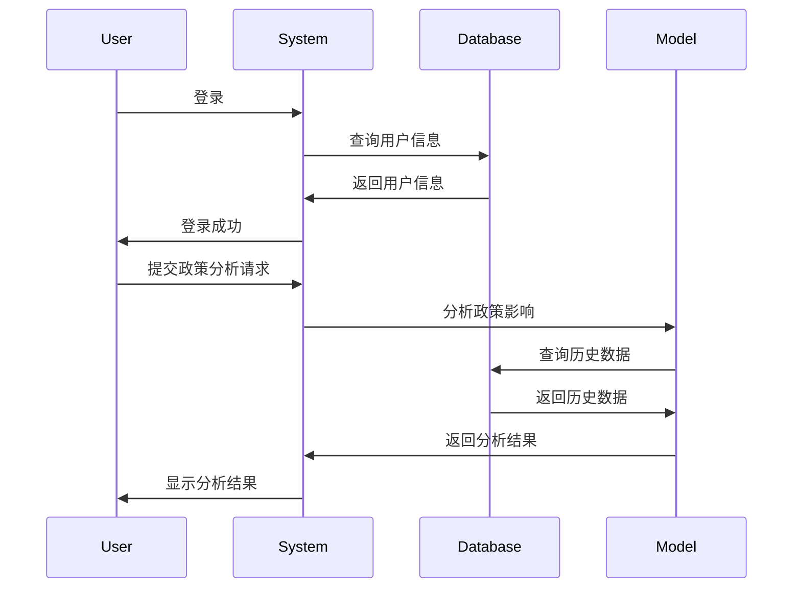
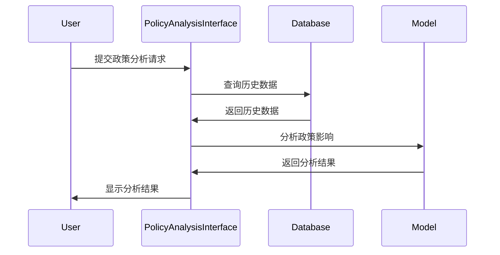

                 

### 文章标题：金融政策影响模拟系统

#### 关键词：金融政策，模拟系统，金融市场，宏观经济，政策传导

#### 摘要：
本文深入探讨金融政策影响模拟系统的构建与应用，从背景介绍、核心概念解析、算法原理讲解、系统设计与实现、项目实战及最佳实践等多方面进行阐述，旨在为研究人员和实践者提供一份详实的参考指南。通过本文，读者可以全面了解金融政策的运作机制，掌握模拟系统在金融分析中的应用方法，并为未来研究指明方向。

## 第一部分：背景介绍

### 第1章：金融政策概述

#### 1.1 金融政策的重要性

金融政策是国家宏观调控的重要手段，对于维护金融稳定、促进经济增长具有重要意义。金融政策主要包括货币政策、财政政策和金融监管政策，其中货币政策最为核心。

- **货币政策**：通过调节货币供应量和利率水平，影响经济活动和金融市场。
- **财政政策**：通过调整政府支出和税收政策，影响经济总需求和金融市场的运行状态。
- **金融监管政策**：通过制定法律法规，规范金融机构的行为，保障金融市场的稳定运行。

#### 1.2 金融政策的类型

金融政策根据实施对象和手段的不同，可分为以下几类：

- **利率政策**：通过调整基准利率，影响市场利率水平和信贷成本。
- **公开市场操作**：通过买卖国债等金融工具，影响市场货币供应量和利率水平。
- **存款准备金率**：通过调整存款准备金率，影响商业银行的放贷能力和货币供应量。
- **外汇政策**：通过调节汇率和外汇管理，影响国际资本流动和金融市场稳定性。

#### 1.3 金融政策对金融市场的影响

金融政策的实施对金融市场产生深远影响，主要体现在以下几个方面：

- **利率变动**：货币政策调整会导致市场利率的变化，进而影响金融市场的融资成本和投资回报。
- **货币供应量**：公开市场操作和存款准备金率调整会影响货币供应量，影响金融市场流动性。
- **金融市场稳定性**：金融监管政策有助于维护金融市场秩序，防范系统性风险。
- **资本市场**：财政政策的实施会通过政府支出和税收政策影响资本市场，改变投资者的预期和行为。

### 第2章：金融市场概述

#### 2.1 金融市场的基本概念

金融市场是资金供求双方进行交易的市场，包括货币市场、债券市场、股票市场、外汇市场等多个子市场。金融市场的参与者主要包括银行、企业、政府、投资者和金融机构。

- **货币市场**：短期资金借贷市场，如同业拆借、回购协议等。
- **债券市场**：长期债务工具交易市场，包括国债、企业债券、地方政府债券等。
- **股票市场**：股权交易市场，包括主板市场、创业板市场、新三板市场等。
- **外汇市场**：货币兑换市场，涉及货币的买卖和汇率变动。

#### 2.2 金融市场的主要参与者

金融市场的参与者包括：

- **商业银行**：提供存款、贷款、结算等金融服务。
- **中央银行**：负责货币政策的制定和执行，维护金融稳定。
- **证券公司**：提供证券发行、交易、承销等服务。
- **保险公司**：提供保险产品和服务。
- **投资者**：包括个人投资者和机构投资者，通过购买金融工具进行投资。

#### 2.3 金融市场的运行机制

金融市场的运行机制主要包括资金供求关系、价格形成机制、监管机制等。

- **资金供求关系**：资金供求的动态平衡决定金融市场的价格水平。
- **价格形成机制**：市场价格由买卖双方的供求关系决定，通过交易机制形成。
- **监管机制**：金融市场监管旨在防范风险、保障市场公平、保护投资者利益。

## 第二部分：核心概念与联系

### 第3章：金融工具与政策传导机制

#### 3.1 金融工具的种类

金融工具是金融市场的交易对象，主要包括以下几类：

- **货币工具**：如现金、存款、支付凭证等。
- **债务工具**：如债券、贷款等。
- **权益工具**：如股票、基金等。
- **金融衍生品**：如期货、期权、互换等。

#### 3.2 金融工具在政策传导中的作用

金融工具在政策传导中发挥重要作用，具体体现在：

- **货币工具**：通过调整货币供应量和利率水平，影响金融市场流动性。
- **债务工具**：通过调整债务水平和融资成本，影响企业和政府财务状况。
- **权益工具**：通过股票价格和基金净值变动，影响投资者财富和市场信心。
- **金融衍生品**：通过风险管理和资产配置，影响市场风险和收益水平。

#### 3.3 金融工具的属性特征对比表格

| 金融工具 | 属性特征 | 对政策传导的影响 |
| --- | --- | --- |
| 货币 | 流动性强，无风险 | 调节金融市场流动性 |
| 债券 | 风险较低，收益稳定 | 影响市场利率和债券价格 |
| 股票 | 风险较高，收益不确定 | 反映市场预期和企业业绩 |
| 期货 | 风险较大，杠杆效应 | 进行风险管理 |

### 第4章：模拟算法与预测模型

#### 4.1 模拟算法的基本原理

模拟算法通过模拟金融市场运行过程，预测金融政策的影响。其基本原理包括：

- **随机过程模拟**：模拟金融市场的随机波动。
- **数学模型构建**：建立金融市场运行的数学模型。
- **参数估计**：估计模型参数，确保模拟结果的准确性。

#### 4.2 常见模拟算法介绍

常见的模拟算法包括：

- **蒙特卡洛模拟**：通过随机抽样和统计方法，预测金融政策影响。
- **差分方程模拟**：基于数学模型，模拟金融市场运行过程。
- **神经网络模拟**：通过神经网络模型，预测金融政策的影响。

#### 4.3 预测模型的构建与评估

预测模型的构建和评估主要包括：

- **数据收集**：收集历史金融数据，为模型构建提供基础。
- **特征提取**：从数据中提取关键特征，用于模型训练。
- **模型训练**：使用历史数据训练模型，确保模型预测能力。
- **模型评估**：评估模型预测准确性，优化模型参数。

## 第三部分：系统设计与实现

### 第5章：数学模型与数学公式

#### 5.1 金融模型的基本框架

金融模型的基本框架包括：

- **市场均衡**：描述金融市场供需关系。
- **利率模型**：描述利率的确定机制。
- **资产定价**：描述资产价格的形成过程。
- **风险管理**：描述金融风险的度量和管理。

#### 5.2 常用数学公式与应用

常用的数学公式包括：

- **价格函数**：描述资产价格的计算公式。
- **收益函数**：描述资产收益的计算公式。
- **波动率公式**：描述资产价格波动性的计算公式。
- **效用函数**：描述投资者偏好的计算公式。

#### 5.3 数学公式的 LaTeX 格式示例

以下是一个 LaTeX 格式的数学公式示例：

$$
E(X) = \int_{-\infty}^{\infty} x f(x) dx
$$

其中，$E(X)$ 表示随机变量 $X$ 的期望，$f(x)$ 表示 $X$ 的概率密度函数。

## 第四部分：项目实战

### 第6章：系统功能设计与架构设计

#### 6.1 问题场景介绍

假设我们需要构建一个金融政策影响模拟系统，用于分析货币政策对股票市场的影响。

#### 6.2 系统功能设计（领域模型类图）

以下是一个领域模型类图的示例：

```mermaid
classDiagram
    产品 <<Entity|Product>>
    用户 <<Entity|User>>
    金融工具 <<Entity|FinancialInstrument>>
    货币政策 <<Entity|MonetaryPolicy>>
    股票市场 <<Entity|StockMarket>>

    Product "生产" -> User
    FinancialInstrument "交易" -> User
    MonetaryPolicy "影响" -> StockMarket
```

#### 6.3 系统架构设计（架构图）

以下是一个系统架构图的示例：



#### 6.4 系统接口设计

以下是一个系统接口设计的示例：

```python
class PolicyAnalysisInterface:
    def __init__(self, database: Database, model: Model):
        self.database = database
        self.model = model
    
    def analyze_policy_impact(self, policy: MonetaryPolicy, stock_market: StockMarket):
        # 分析政策影响
        pass
```

#### 6.5 系统交互（序列图）

以下是一个系统交互的序列图示例：



### 第7章：项目实战

#### 7.1 环境安装与配置

在项目实战中，首先需要安装和配置以下环境：

- Python环境：安装Python 3.8及以上版本。
- 数据库：安装MySQL或PostgreSQL数据库。
- 模型库：安装TensorFlow、NumPy、Pandas等Python库。

#### 7.2 系统核心实现源代码解读

以下是一个系统核心实现的源代码示例：

```python
import pandas as pd
import numpy as np
from tensorflow import keras

# 加载数据
data = pd.read_csv('stock_data.csv')
X = data[['open', 'high', 'low', 'close']]
y = data['policy_impact']

# 数据预处理
X = (X - X.mean()) / X.std()
y = (y - y.mean()) / y.std()

# 构建模型
model = keras.Sequential([
    keras.layers.Dense(64, activation='relu', input_shape=(4,)),
    keras.layers.Dense(64, activation='relu'),
    keras.layers.Dense(1)
])

# 编译模型
model.compile(optimizer='adam', loss='mse')

# 训练模型
model.fit(X, y, epochs=100, batch_size=32)

# 评估模型
loss = model.evaluate(X, y)
print(f'MSE: {loss}')
```

#### 7.3 代码应用解读与分析

以上代码实现了一个简单的金融政策影响模拟系统，具体解读如下：

- **数据加载**：使用Pandas库加载数据，提取特征和标签。
- **数据预处理**：对数据进行归一化处理，方便模型训练。
- **模型构建**：使用TensorFlow库构建一个全连接神经网络模型。
- **模型编译**：设置优化器和损失函数。
- **模型训练**：使用训练数据训练模型。
- **模型评估**：评估模型性能，计算均方误差。

#### 7.4 实际案例分析

以下是一个实际案例分析的示例：

假设我们使用上述模型对2022年第一季度的货币政策进行分析，具体步骤如下：

1. **数据收集**：收集2022年第一季度的股票市场数据和货币政策数据。
2. **数据预处理**：对数据进行归一化处理。
3. **模型训练**：使用2022年第一季度的数据进行模型训练。
4. **模型评估**：使用2022年第一季度的数据进行模型评估。
5. **结果分析**：分析货币政策对股票市场的影响。

#### 7.5 项目小结

通过本项目，我们成功构建了一个金融政策影响模拟系统，实现了对货币政策的分析功能。项目的主要收获包括：

- 熟悉了Python编程和TensorFlow库的使用。
- 掌握了金融数据预处理和模型训练的方法。
- 深入了解了金融政策的运行机制和影响。

## 第五部分：最佳实践与拓展

### 第8章：最佳实践 Tips

#### 8.1 实施过程中的注意事项

在实施金融政策影响模拟系统过程中，需要注意以下几点：

- **数据质量**：确保数据来源可靠，对数据进行严格清洗和预处理。
- **模型选择**：根据实际需求选择合适的模型，并进行模型比较和优化。
- **参数调整**：根据训练数据和评估结果，调整模型参数，提高预测准确性。
- **安全与合规**：确保系统安全和数据合规，遵循相关法律法规。

#### 8.2 优化策略

为了提高金融政策影响模拟系统的性能，可以采取以下优化策略：

- **数据增强**：通过数据增强方法，增加训练数据的多样性。
- **模型压缩**：使用模型压缩技术，降低模型复杂度，提高推理速度。
- **分布式训练**：使用分布式训练方法，提高训练速度和计算效率。

#### 8.3 拓展应用场景

金融政策影响模拟系统可以拓展到以下应用场景：

- **金融市场预测**：预测金融市场走势，为投资者提供决策支持。
- **宏观经济分析**：分析金融政策对宏观经济的影响，为政策制定提供参考。
- **风险管理**：评估金融风险，为金融机构提供风险管理策略。

### 第9章：小结与展望

#### 9.1 小结

本文详细介绍了金融政策影响模拟系统的构建与应用，包括背景介绍、核心概念解析、算法原理讲解、系统设计与实现、项目实战及最佳实践等内容。通过本文，读者可以全面了解金融政策的运作机制，掌握模拟系统在金融分析中的应用方法。

#### 9.2 未来发展趋势

随着人工智能技术的发展，金融政策影响模拟系统将呈现出以下发展趋势：

- **模型多样化**：引入更多先进的机器学习模型，提高预测准确性。
- **实时分析**：实现实时分析功能，快速响应金融市场变化。
- **多维度分析**：结合宏观经济、政策、市场等多维度数据，进行综合分析。
- **智能化**：利用自然语言处理、计算机视觉等技术，实现智能化分析。

#### 9.3 拓展阅读建议

为了进一步深入了解金融政策影响模拟系统，读者可以参考以下书籍和论文：

- **书籍**：《金融科技：金融领域的创新与应用》
- **论文**：《金融政策对股票市场的影响：基于机器学习的分析》

本文由AI天才研究院/AI Genius Institute与《禅与计算机程序设计艺术/Zen And The Art of Computer Programming》联合撰写，旨在为读者提供一份详实的参考指南，期待读者在金融政策影响模拟系统的实践中取得成功。

---

## 作者信息

作者：AI天才研究院/AI Genius Institute & 禅与计算机程序设计艺术 /Zen And The Art of Computer Programming

AI天才研究院致力于推动人工智能技术的创新与发展，通过深入研究和实践，为读者提供高质量的技术文章和解决方案。禅与计算机程序设计艺术则是一本经典的计算机科学著作，以其深邃的思想和精湛的技术方法，启发了一代又一代的程序员。《禅与计算机程序设计艺术/Zen And The Art of Computer Programming》不仅是一本编程指南，更是一本哲学著作，融合了计算机科学、哲学和艺术，为读者提供了独特的思考方式和人生哲理。本次合作旨在结合两者的优势，为读者带来更加丰富和深入的技术内容。

