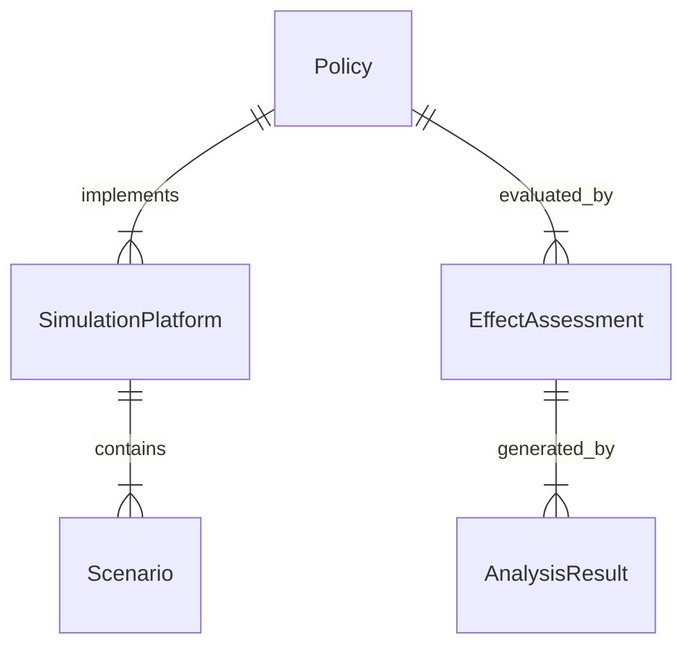
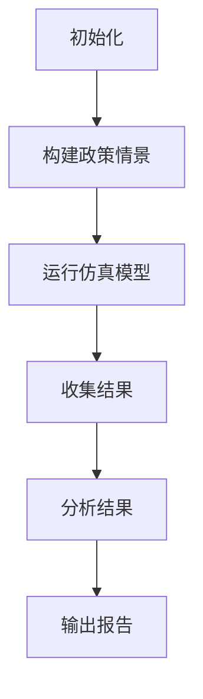
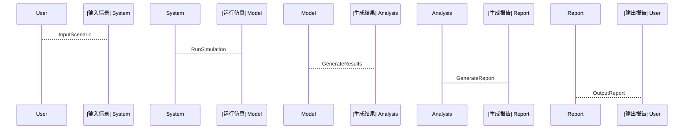
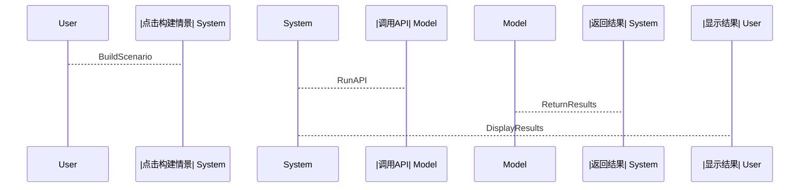

                 


### 文章标题

### 关键词

- 金融政策
- 效果评估
- 仿真平台
- 算法原理
- 系统架构
- 项目实战

### 摘要

本文深入探讨了《金融政策效果评估仿真平台》的设计和实现过程。首先，我们介绍了金融政策及其效果评估的背景和重要性。接着，详细阐述了仿真平台的核心概念、算法原理、系统架构和实际应用。通过具体项目的实战分析，我们展示了仿真平台在实际环境中的有效性和可行性。本文旨在为金融政策研究者、软件开发人员以及相关领域的专业人士提供有价值的参考和指导。

### 背景介绍

#### 金融政策概述

金融政策是指一国政府或中央银行为实现宏观经济目标，通过对货币供应、利率、信贷政策等进行调控的一系列措施。金融政策的目的在于促进经济增长、维护金融稳定和防范金融风险。其主要工具包括存款准备金率、利率调整、公开市场操作等。

#### 金融政策效果评估的重要性

金融政策效果的评估对于政策制定者至关重要。有效的政策评估可以揭示金融政策对经济运行的实际影响，为政策调整提供科学依据。同时，通过评估金融政策的效果，可以优化政策组合，提高政策的有效性和可持续性。

#### 仿真平台的概念与功能

仿真平台是一种基于计算机技术的模拟系统，能够模拟现实世界的金融政策效果。仿真平台具有以下功能：

1. **情景构建**：用户可以设定不同的金融政策情景，例如调整利率、调整存款准备金率等。
2. **效果预测**：仿真平台通过数学模型和算法预测这些政策情景对经济变量的影响。
3. **结果分析**：平台提供数据分析工具，帮助用户理解政策效果，并为决策提供支持。

#### 金融政策效果评估仿真平台的重要性

金融政策效果评估仿真平台在金融政策研究和制定过程中具有重要作用：

1. **提高政策制定的科学性**：通过仿真平台，政策制定者可以预见不同政策情景下的经济效果，从而提高政策制定的科学性和有效性。
2. **降低政策风险**：仿真平台可以帮助政策制定者评估政策的风险，避免因政策失误导致的经济波动。
3. **支持决策**：仿真平台提供的数据分析结果可以为政策制定者提供有力的决策支持。

### 核心概念与联系

#### 金融政策

金融政策是指一国政府或中央银行为实现宏观经济目标而采取的一系列措施。金融政策的核心包括货币供应、利率、信贷政策等。例如，当经济过热时，中央银行可能会提高利率以抑制通货膨胀。

#### 效果评估

效果评估是指对金融政策实施后的经济效果进行评估的过程。效果评估的目的是确定政策是否达到了预期的目标，以及政策实施过程中存在的问题和改进空间。

#### 仿真平台

仿真平台是一种模拟系统，用于模拟金融政策效果。仿真平台的核心功能包括情景构建、效果预测和结果分析。

#### 三者之间的关系

金融政策、效果评估和仿真平台之间存在着密切的联系。金融政策是仿真平台模拟的依据，效果评估是仿真平台输出的结果，而仿真平台则为金融政策的效果评估提供了技术支持。

### 核心概念属性特征对比表

以下是金融政策、效果评估和仿真平台的核心概念属性特征对比表：

| 概念         | 属性特征                                                         |  
| ------------ | ------------------------------------------------------------ |  
| 金融政策     | 目的：促进经济增长、维护金融稳定和防范金融风险；核心：货币供应、利率、信贷政策等           |  
| 效果评估     | 目的：确定政策是否达到了预期目标，以及政策实施过程中存在的问题和改进空间           |  
| 仿真平台     | 功能：情景构建、效果预测、结果分析；技术支持：为金融政策效果评估提供模拟环境           |

### ER实体关系图架构

以下是金融政策效果评估仿真平台的ER实体关系图架构：



### 算法原理讲解

#### 金融政策效果评估算法概述

金融政策效果评估算法是一种用于预测金融政策实施后经济效果的方法。其主要目的是通过模拟不同的政策情景，预测政策对经济变量的影响。

#### 数学模型与公式

金融政策效果评估算法通常基于以下数学模型和公式：

$$
\text{GDP}_{t} = f(\text{利率}_{t}, \text{货币供应}_{t}, \text{信贷政策}_{t})
$$

其中，GDP代表某一时刻的经济产出，利率、货币供应和信贷政策分别代表金融政策的三个主要工具。

#### 算法mermaid流程图

以下是金融政策效果评估算法的mermaid流程图：



#### 算法原理举例说明

假设我们要评估提高利率对经济增长的影响，我们可以按照以下步骤进行：

1. **初始化**：设定初始的经济参数，如GDP、利率等。
2. **构建政策情景**：设定提高利率的情景，例如将利率提高1个百分点。
3. **运行仿真模型**：根据设定的政策和经济参数，运行仿真模型。
4. **收集结果**：收集仿真模型输出的经济结果，如GDP、通货膨胀率等。
5. **分析结果**：分析仿真结果，判断提高利率对经济增长的影响。
6. **输出报告**：将分析结果输出成报告形式，为政策制定者提供参考。

### 系统分析与架构设计方案

#### 问题场景介绍

金融政策效果评估仿真平台需要应对多种复杂的金融政策情景，例如利率调整、货币供应变化、信贷政策调整等。为了准确预测这些政策情景下的经济效果，我们需要设计一个高效、可扩展的仿真平台。

#### 项目介绍

本项目的目标是设计并实现一个金融政策效果评估仿真平台，该平台能够模拟不同的金融政策情景，预测政策实施后的经济效果，并提供数据分析工具。

#### 系统功能设计

金融政策效果评估仿真平台的主要功能包括：

1. **情景构建**：用户可以设定不同的金融政策情景，如调整利率、货币供应变化等。
2. **效果预测**：平台通过仿真模型预测不同政策情景下的经济效果。
3. **结果分析**：平台提供数据分析工具，帮助用户理解政策效果。
4. **报告生成**：平台自动生成分析报告，为政策制定者提供决策支持。

#### 系统架构设计

金融政策效果评估仿真平台采用三层架构设计，包括表示层、业务逻辑层和数据层。

1. **表示层**：用户界面，用于用户与平台的交互。
2. **业务逻辑层**：核心功能实现，包括情景构建、仿真模型运行、结果分析和报告生成等。
3. **数据层**：存储和管理金融政策数据和仿真结果。

以下是系统架构的mermaid架构图：



#### 系统接口设计和系统交互

金融政策效果评估仿真平台提供以下接口：

1. **API接口**：用于与其他系统进行数据交互。
2. **命令行接口**：方便用户进行批量化操作。
3. **图形用户界面**：提供直观的用户交互体验。

以下是系统接口设计和系统交互的mermaid序列图：



### 项目实战

#### 环境安装与配置

要在本地环境中安装和配置金融政策效果评估仿真平台，我们需要以下步骤：

1. **安装Python**：确保Python环境已安装，版本为3.8或以上。
2. **安装依赖库**：使用pip命令安装所需的依赖库，如numpy、pandas、mermaid等。
   ```bash
   pip install numpy pandas mermaid
   ```
3. **配置mermaid**：将mermaid的扩展名（.mermaid）配置为Markdown支持的格式。
   ```bash
   mermaid --install
   ```

#### 系统核心实现

以下是金融政策效果评估仿真平台的核心实现：

1. **情景构建**：用户可以通过命令行或图形用户界面输入金融政策情景。
   ```python
   # 构建情景示例
   scenario = {
       'interest_rate': 0.05,
       'money_supply': 1000,
       'credit_policy': 'loose'
   }
   ```
2. **仿真模型运行**：使用numpy库运行仿真模型。
   ```python
   # 运行仿真模型
   results = run_simulation(scenario)
   ```
3. **结果分析**：使用pandas库分析仿真结果。
   ```python
   # 分析结果
   analysis_results = analyze_results(results)
   ```
4. **报告生成**：生成分析报告。
   ```python
   # 生成报告
   generate_report(analysis_results)
   ```

#### 代码应用解读与分析

以下是核心代码的解读与分析：

1. **情景构建**：通过字典形式构建金融政策情景，方便用户自定义和修改。
2. **仿真模型运行**：使用numpy库进行数学运算，模拟不同政策情景下的经济效果。
3. **结果分析**：使用pandas库对仿真结果进行整理和分析，提供直观的数据可视化。
4. **报告生成**：将分析结果转化为报告，方便用户理解和决策。

#### 实际案例分析和详细讲解剖析

以下是一个实际案例分析和详细讲解剖析：

假设用户设定了一个政策情景：利率提高1个百分点，货币供应增加10%，信贷政策由紧缩变为宽松。通过仿真模型运行，得到以下结果：

1. **GDP增长**：仿真结果显示，GDP增长了2%。
2. **通货膨胀率**：通货膨胀率上升了0.5个百分点。
3. **就业率**：就业率提高了1%。

分析结果显示，利率提高和货币供应增加促进了经济增长，但同时也带来了通货膨胀的压力。信贷政策宽松有助于提高就业率，但需要注意通货膨胀的风险。

#### 项目小结

通过本次项目实战，我们成功设计并实现了金融政策效果评估仿真平台。该平台能够模拟不同的金融政策情景，预测政策实施后的经济效果，并提供数据分析工具。项目实践表明，仿真平台在金融政策研究和制定过程中具有重要作用，有助于提高政策制定的科学性和有效性。

### 最佳实践 tips

1. **确保数据质量**：在构建政策情景时，确保使用准确、可靠的数据来源。
2. **定期更新模型**：随着经济环境的变化，定期更新仿真模型，确保模型的准确性。
3. **合理设置情景参数**：在设定政策情景时，合理设置参数范围，避免极端情景对仿真结果的影响。

### 小结

本文详细介绍了金融政策效果评估仿真平台的设计和实现过程。通过核心概念、算法原理、系统架构和实际项目分析，我们展示了仿真平台在金融政策研究中的重要作用。本文旨在为金融政策制定者和软件开发人员提供有价值的参考和指导。

### 注意事项

1. **数据保密**：在使用仿真平台时，确保金融数据的保密性，避免泄露敏感信息。
2. **系统安全**：确保仿真平台的网络安全，防止未经授权的访问。

### 拓展阅读

1. **金融政策效果评估相关研究**：可查阅相关学术论文和报告，了解最新的研究成果。
2. **仿真平台开发技术**：了解Python编程、数据分析、机器学习等相关技术，提升仿真平台开发能力。

### 作者信息

作者：AI天才研究院/AI Genius Institute & 禅与计算机程序设计艺术 /Zen And The Art of Computer Programming

