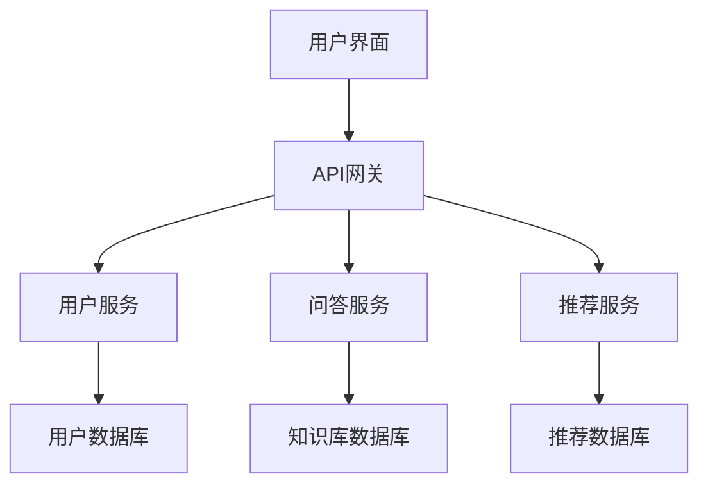

                 

## 金融教育内容生成：开启智能教育新时代

### 文章关键词

- 金融教育
- 内容生成
- 人工智能
- 自然语言处理
- 个性化学习

### 摘要

随着金融科技的快速发展，金融教育与信息技术的融合成为大势所趋。本文从金融教育内容生成的背景与意义出发，深入探讨了金融教育内容生成技术概述、核心概念、算法原理、实践应用、系统设计与实现等多个方面，旨在为金融教育内容生成提供全面的技术指导和实践参考。

## 目录大纲

----------------------------------------------------------------

### 《金融教育内容生成》

### 关键词：金融教育、内容生成、人工智能、自然语言处理、个性化学习

### 摘要：本文探讨了金融教育内容生成的技术与应用，旨在推动金融教育智能化、个性化发展。

## 第1章: 金融教育内容生成的背景与意义

### 1.1 时代背景：金融科技与教育的深度融合

#### 金融科技的发展

- 金融科技（Fintech）的快速发展，推动了金融服务的创新和变革。
- 区块链、人工智能、大数据等新兴技术的应用，为金融教育带来了新的契机。

#### 教育信息化趋势

- 教育信息化加速，在线教育、智能教育平台蓬勃发展。
- 信息技术与教育内容的深度融合，为金融教育内容生成提供了技术支持。

#### 金融教育与金融科技的融合

- 金融教育与金融科技的深度融合，为金融教育内容生成提供了丰富的素材和工具。
- 智能化、个性化教育需求的提升，推动了金融教育内容生成的应用和发展。

### 1.2 金融教育内容生成的意义

#### 提升金融素养

- 金融教育内容生成有助于提升广大人民群众的金融素养。
- 丰富的金融知识库和个性化学习路径，满足不同群体的学习需求。

#### 减轻教师负担

- 金融教育内容生成能够有效减轻教师的工作负担。
- 智能化生成内容，为教师提供教学辅助，提高教学效率。

#### 优化教育资源

- 金融教育内容生成能够优化教育资源配置。
- 大数据分析和个性化推荐，提高教育资源的利用效率。

### 1.3 金融教育内容生成的挑战

#### 数据质量与安全性

- 金融教育内容生成涉及大量数据，数据质量与安全性至关重要。
- 如何确保数据真实、准确、安全，是金融教育内容生成需要解决的问题。

#### 个性化需求满足

- 满足个性化需求是金融教育内容生成的重要目标。
- 如何根据用户需求生成个性化内容，是金融教育内容生成需要考虑的问题。

#### 内容真实性检验

- 金融教育内容生成需要确保内容的真实性。
- 如何对生成的内容进行真实性检验，是金融教育内容生成需要面对的挑战。

## 第2章: 金融教育内容生成技术概述

### 2.1 文本生成与自然语言处理

#### 语言模型介绍

- 语言模型是自然语言处理的基础，用于预测文本序列。
- 常见的语言模型有神经网络模型、循环神经网络（RNN）、长短时记忆网络（LSTM）等。

#### 文本生成技术

- 文本生成技术包括生成式模型和抽取式模型。
- 生成式模型基于概率模型，通过概率分布生成文本；抽取式模型基于规则或模板，从已有数据中抽取文本。

#### 应用案例

- 金融新闻报道生成
- 金融知识问答系统
- 个性化金融学习推荐系统

### 2.2 金融知识图谱

#### 知识图谱的基本概念

- 知识图谱是一种语义网络，用于表示实体及其关系。
- 知识图谱中的实体可以是金融产品、金融机构、金融事件等。

#### 金融知识图谱构建

- 金融知识图谱构建包括数据采集、数据清洗、实体关系抽取、知识图谱构建等步骤。
- 常用的知识图谱构建工具包括Neo4j、Apache Giraph等。

#### 知识图谱在内容生成中的应用

- 知识图谱在金融教育内容生成中的应用，包括金融知识问答、金融知识可视化等。

### 2.3 人工智能在金融教育中的应用

#### 机器学习与深度学习

- 机器学习是人工智能的基础，用于构建预测模型。
- 深度学习是机器学习的一种，通过多层神经网络进行特征提取和学习。

#### 人工智能在教育领域的应用场景

- 个性化学习推荐
- 智能答疑系统
- 机器人辅导员
- 在线考试与评测

## 第3章: 金融教育内容生成的核心概念

### 3.1 金融知识分类与标签化

#### 金融知识分类体系

- 金融知识分类体系是金融教育内容生成的基础。
- 常见的金融知识分类体系包括按照金融产品分类、按照金融领域分类等。

#### 标签化技术的应用

- 标签化技术用于对金融知识进行分类和标注。
- 常见的标签化技术包括关键字提取、词频统计等。

### 3.2 教育目标与学习路径规划

#### 教育目标的设定

- 教育目标是指金融教育要达到的学习效果和目标。
- 常见的教育目标包括金融知识掌握、金融素养提升等。

#### 学习路径的规划

- 学习路径规划是指根据教育目标，设计个性化的学习路径。
- 学习路径规划包括学习内容的选择、学习顺序的安排等。

### 3.3 金融知识可视化

#### 可视化技术概述

- 可视化技术是将数据或信息以图形或图像的形式展示。
- 常见可视化技术包括图表、图像、三维建模等。

#### 金融知识可视化的方法与工具

- 金融知识可视化的方法包括数据可视化、知识图谱可视化等。
- 金融知识可视化的工具包括Tableau、D3.js等。

## 第4章: 金融教育内容生成的算法原理

### 4.1 生成对抗网络（GAN）

#### GAN的基本原理

- GAN（Generative Adversarial Network）是一种深度学习模型，由生成器和判别器组成。
- 生成器试图生成与真实数据相似的数据，判别器则试图区分真实数据和生成数据。

#### GAN在金融教育内容生成中的应用

- GAN在金融教育内容生成中的应用包括金融知识问答、金融知识可视化等。

### 4.2 强化学习

#### 强化学习的基本概念

- 强化学习（Reinforcement Learning）是一种机器学习方法，通过奖励信号来训练模型。
- 强化学习分为值函数方法和策略方法。

#### 强化学习在金融教育内容生成中的应用

- 强化学习在金融教育内容生成中的应用包括学习路径规划、个性化推荐等。

### 4.3 自适应学习算法

#### 自适应学习的基本原理

- 自适应学习（Adaptive Learning）是指根据学习者的特点和学习进度，动态调整学习内容和学习方式。
- 自适应学习算法包括自适应学习率、自适应学习内容等。

#### 自适应学习算法在金融教育中的应用

- 自适应学习算法在金融教育中的应用包括个性化学习推荐、智能答疑等。

## 第5章: 金融教育内容生成的实践应用

### 5.1 金融知识问答系统

#### 系统架构设计

- 系统架构包括前端、后端和数据库三个部分。
- 前端用于用户交互，后端用于处理业务逻辑，数据库用于存储金融知识库。

#### 技术实现

- 使用Python的Flask框架搭建后端，使用React搭建前端。
- 使用自然语言处理技术实现问答功能。

### 5.2 个性化金融学习推荐系统

#### 推荐系统设计

- 推荐系统包括用户画像、推荐算法、推荐结果三个部分。
- 用户画像用于记录用户特征，推荐算法用于生成推荐结果。

#### 推荐算法实现

- 使用基于内容的推荐算法和协同过滤算法。
- 基于内容的推荐算法根据用户历史行为推荐相似内容，协同过滤算法根据用户相似度推荐内容。

### 5.3 金融教育游戏化设计

#### 游戏化学习的基本概念

- 游戏化学习是指将游戏元素应用于教育中，提高学习兴趣和效果。
- 游戏化学习包括积分、勋章、排行榜等元素。

#### 游戏化设计在金融教育中的应用

- 将金融知识融入游戏，提高学习者的参与度和兴趣。

## 第6章: 金融教育内容生成的系统设计与实现

### 6.1 系统需求分析

#### 用户需求

- 用户需要个性化、高质量、易于理解的金融教育内容。
- 用户需要便捷、高效、安全的问答和推荐系统。

#### 功能需求

- 提供金融知识问答和个性化推荐功能。
- 支持用户注册、登录、个人信息管理等功能。

### 6.2 系统架构设计

#### 系统架构图

#### 模块划分

- 用户模块：负责用户注册、登录、个人信息管理等功能。
- 问答模块：负责金融知识问答功能。
- 推荐模块：负责金融知识个性化推荐功能。

### 6.3 系统接口设计

#### 接口规范

- 接口采用RESTful风格，使用JSON格式传输数据。
- 接口包括用户接口、问答接口、推荐接口等。

#### 接口实现

- 用户接口：实现用户注册、登录、个人信息管理等功能。
- 问答接口：实现金融知识问答功能。
- 推荐接口：实现金融知识个性化推荐功能。

### 6.4 系统交互设计

#### 交互流程

1. 用户注册、登录，获取用户Token。
2. 用户发起问答请求，系统返回答案。
3. 用户浏览推荐内容，系统根据用户兴趣推荐相关内容。

#### 用户界面设计

- 设计简洁、易用的用户界面，提供问答和推荐功能。

## 第7章: 金融教育内容生成的案例分析

### 7.1 案例一：某银行金融知识问答系统

#### 系统功能

- 用户注册、登录、查看历史问答记录等功能。
- 提供金融知识问答服务，支持文本和语音输入。

#### 技术实现

- 使用Python的Flask框架搭建后端，使用React搭建前端。
- 使用自然语言处理技术实现问答功能。

#### 用户反馈

- 用户反馈良好，认为问答系统能够快速解答金融问题，提高金融素养。

### 7.2 案例二：某金融教育平台的个性化学习推荐系统

#### 系统架构

- 系统架构包括用户服务、问答服务、推荐服务、知识库数据库、推荐数据库等。

#### 推荐算法

- 使用基于内容的推荐算法和协同过滤算法。
- 基于内容的推荐算法根据用户历史行为推荐相似内容，协同过滤算法根据用户相似度推荐内容。

#### 用户行为分析

- 分析用户浏览、搜索、问答等行为，优化推荐结果。

### 7.3 案例三：某金融教育游戏化项目

#### 游戏设计

- 设计金融知识游戏，将金融知识融入游戏中，提高学习兴趣。

#### 用户参与度分析

- 分析用户游戏参与度，优化游戏设计，提高用户粘性。

## 第8章: 金融教育内容生成的未来发展趋势

### 8.1 金融教育内容生成的技术展望

- 引入新技术，如增强现实（AR）、虚拟现实（VR）等。
- 发展个性化、智能化教育技术，提高教育质量和效率。

### 8.2 金融教育内容生成的政策与规范

- 政府出台相关政策，推动金融教育内容生成发展。
- 制定行业规范，确保金融教育内容生成的质量和安全性。

### 8.3 金融教育内容生成的可持续发展

- 关注教育公平，让更多人受益于金融教育内容生成。
- 创新教育内容，提高金融教育内容的实用性和吸引力。

### 结束语

金融教育内容生成作为金融科技与教育融合的产物，具有广阔的发展前景。通过深入分析金融教育内容生成的技术、实践和未来趋势，我们期待能够推动金融教育智能化、个性化发展，为广大人民群众提供更好的金融教育服务。作者：AI天才研究院/AI Genius Institute & 禅与计算机程序设计艺术/Zen And The Art of Computer Programming

----------------------------------------------------------------

## 总结

本文从多个角度对金融教育内容生成进行了全面探讨，包括其背景与意义、技术概述、核心概念、算法原理、实践应用、系统设计与实现、案例分析及未来发展趋势。通过这篇文章，我们了解了金融教育内容生成的重要性和挑战，以及如何利用人工智能等技术实现金融教育的智能化、个性化发展。

### 最佳实践 Tips

1. **内容真实性检验**：在金融教育内容生成过程中，确保内容的真实性和准确性至关重要。可以通过引入权威数据源、专家审核等方式提高内容质量。
2. **个性化推荐**：个性化推荐系统可以大大提高用户的学习体验。在实际应用中，可以结合用户行为数据、知识图谱等技术，实现精准推荐。
3. **金融知识可视化**：通过可视化技术，将复杂金融知识以图表、图像等形式展示，有助于提高学习者的理解和记忆。

### 注意事项

1. **数据安全**：在金融教育内容生成过程中，要严格保护用户隐私，确保数据安全。
2. **技术更新**：随着科技的不断发展，金融教育内容生成技术也在不断更新。保持对新技术的研究和引入，是提升系统性能和用户体验的关键。
3. **教育公平**：金融教育内容生成的目标之一是提升金融素养，实现教育公平。在实际应用中，要关注不同群体的需求，确保教育资源的公平分配。

### 拓展阅读

1. 《自然语言处理入门》
2. 《深度学习与金融应用》
3. 《知识图谱：原理、方法与实践》

通过拓展阅读，您可以进一步了解金融教育内容生成的相关技术和应用，为实际项目提供更多思路和借鉴。作者：AI天才研究院/AI Genius Institute & 禅与计算机程序设计艺术/Zen And The Art of Computer Programming

