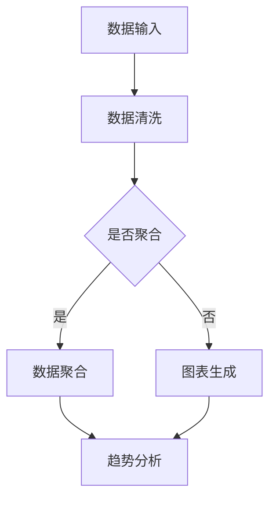
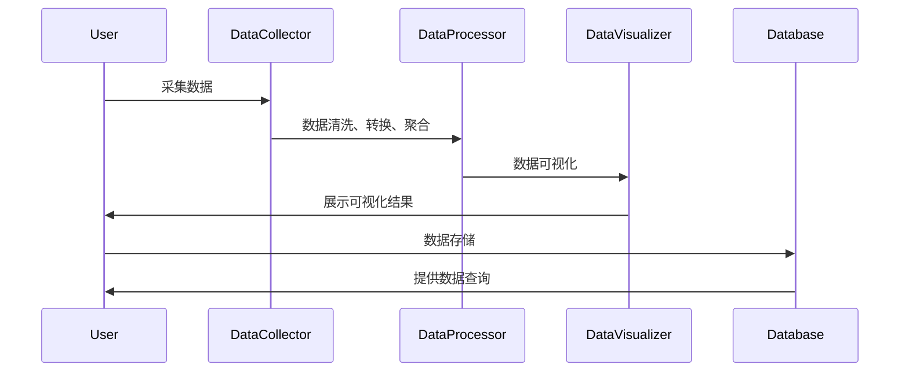
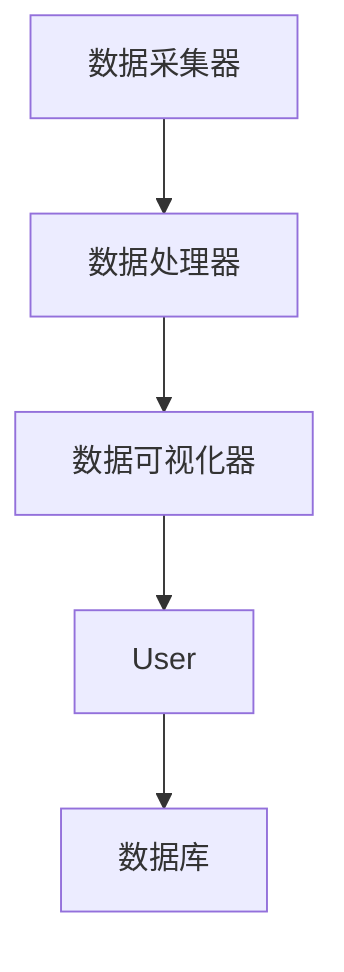

                 


# 《金融数据可视化技术应用》

## 关键词：金融数据可视化、数据可视化算法、数学模型、系统架构、项目实战

## 摘要：
本文深入探讨了金融数据可视化技术的应用，包括其背景、核心概念、算法原理、数学模型、系统架构设计、项目实战和最佳实践。通过系统化的分析，本文旨在为金融数据可视化领域的研究者和从业者提供实用的指导和深刻的见解。

### 目录

----------------------------------------------------------------

## 第一部分：金融数据可视化概述

### 第1章：金融数据可视化背景与问题  
### 第2章：金融数据可视化核心概念与联系

## 第二部分：金融数据可视化算法原理

### 第3章：基础算法原理讲解  
### 第4章：数学模型与公式讲解

## 第三部分：金融数据可视化系统分析与设计

### 第5章：系统架构设计与实现  
### 第6章：项目实战与案例分析

## 第四部分：金融数据可视化最佳实践与总结

### 第7章：最佳实践与注意事项  
### 第8章：拓展阅读与深入研究

----------------------------------------------------------------

## 第1章：金融数据可视化背景与问题

### 1.1 金融数据可视化的发展历程

金融数据可视化是一种利用图形、图表、地图和其他视觉元素展示金融数据的科学技术。随着计算机技术的发展，数据可视化的应用逐渐从学术研究扩展到金融、医疗、零售等多个领域。

在金融领域，数据可视化技术的应用可以追溯到20世纪90年代。最初，金融分析师使用简单的柱状图和折线图来展示股票价格和交易量。随着互联网和大数据技术的兴起，金融数据可视化迎来了快速发展。现代金融数据可视化工具能够处理海量的数据，提供实时更新的图表和分析结果。

### 1.2 金融数据可视化的挑战与机遇

金融数据可视化面临着许多挑战，主要包括数据量大、数据维度高、数据处理速度快、数据类型复杂等。此外，金融数据可视化还需要考虑到用户界面的友好性和易用性。

然而，这些挑战同时也带来了机遇。随着金融技术的进步，例如区块链和机器学习，金融数据可视化的应用场景不断扩展。例如，区块链技术的应用使得金融交易数据更加透明，为数据可视化提供了更多的可能性。

### 1.3 金融数据可视化的重要性

金融数据可视化对于金融决策具有重要意义。通过可视化的方式，金融分析师和投资者可以更直观地理解数据，发现潜在的趋势和模式，从而做出更准确的决策。

此外，金融数据可视化还可以提高数据透明度，帮助监管机构和公众了解金融市场的运行情况。在金融风险管理、投资组合优化、市场预测等方面，数据可视化技术发挥着关键作用。

### 1.4 金融数据可视化的边界与外延

金融数据可视化不仅涉及技术层面的实现，还包括方法论、设计原则和用户体验等多个方面。其边界可以定义为从数据到可视化展示的整个流程。

外延则包括数据采集、数据清洗、数据存储、数据分析和数据展示等多个环节。这些环节相互作用，共同构成了金融数据可视化的生态系统。

### 1.5 金融数据可视化的概念结构与核心要素组成

金融数据可视化的核心概念包括数据源、数据格式、可视化工具、用户界面和交互设计等。数据源是金融数据可视化的基础，包括各种金融数据，如股票价格、交易量、市场指数等。

数据格式决定了数据如何被存储和处理，常见的格式包括CSV、JSON、XML等。可视化工具则是实现数据可视化的核心，如Tableau、Power BI、D3.js等。

用户界面和交互设计则决定了用户如何与可视化工具互动，如何通过交互获得所需信息。这些核心要素共同构成了金融数据可视化的概念结构。

## 第2章：金融数据可视化核心概念与联系

### 2.1 核心概念定义

金融数据可视化中的核心概念包括数据源、数据格式、可视化工具、用户界面和交互设计等。

- **数据源**：指金融数据可视化的数据来源，如股票交易所、金融监管机构、金融机构等。
- **数据格式**：指数据源提供的数据的格式，常见的有CSV、JSON、XML等。
- **可视化工具**：指用于实现数据可视化的软件或库，如Tableau、Power BI、D3.js等。
- **用户界面**：指用户与可视化工具交互的界面，包括图表、菜单、工具栏等。
- **交互设计**：指用户如何与可视化工具互动，如何通过交互获得所需信息。

### 2.2 关键概念属性特征对比

以下是金融数据可视化中几个关键概念的属性特征对比表格：

| 概念       | 属性特征                                               | 举例                    |
|------------|--------------------------------------------------------|-------------------------|
| 数据源     | 实时性、完整性、准确性                                     | 股票交易所、金融监管机构   |
| 数据格式   | 易于处理、易于存储、易于传输                                 | CSV、JSON、XML           |
| 可视化工具 | 功能丰富、易于使用、支持多种数据格式                         | Tableau、Power BI、D3.js |
| 用户界面   | 直观、易用、交互性强                                       | 图表、菜单、工具栏        |
| 交互设计   | 用户友好、响应迅速、信息丰富                                 | 滑动条、过滤选项、动态更新 |

### 2.3 ER实体关系图介绍

ER实体关系图是用于描述金融数据可视化中不同实体及其关系的图形表示方法。以下是金融数据可视化中的ER实体关系图示例：

```mermaid
erDiagram
  数据源 ||--|{ 可视化工具 }|
  数据源 ||--|{ 用户界面 }|
  数据源 ||--|{ 交互设计 }|
  可视化工具 ||--|{ 用户界面 }|
  可视化工具 ||--|{ 交互设计 }|
  用户界面 ||--|{ 交互设计 }|
```

在此ER图中，数据源与可视化工具、用户界面、交互设计之间存在关系，可视化工具与用户界面、交互设计之间也存在关系，用户界面与交互设计之间存在关系。

## 第3章：基础算法原理讲解

### 3.1 数据可视化算法概述

数据可视化算法是指用于将数据转换为视觉表示的方法。在金融数据可视化中，常用的算法包括图表生成算法、数据聚合算法、趋势分析算法等。

图表生成算法用于创建各种图表，如柱状图、折线图、饼图等。数据聚合算法用于将大量数据聚合为更易于理解的格式，如平均值、中位数等。趋势分析算法用于识别数据中的趋势和模式，如移动平均、指数平滑等。

### 3.2 使用mermaid绘制算法流程图

以下是数据可视化算法的一个基本流程图：



在这个流程图中，数据输入经过数据清洗，然后根据是否需要进行聚合进行分支。如果需要聚合，则进行数据聚合；否则，直接进行图表生成。最后，无论是否进行聚合，都会进行趋势分析。

### 3.3 Python源代码与算法原理

以下是一个简单的Python源代码示例，用于生成柱状图：

```python
import pandas as pd
import matplotlib.pyplot as plt

# 数据源
data = {'股票代码': ['AAPL', 'MSFT', 'GOOGL'], '收盘价': [150, 270, 2700]}

# 创建DataFrame
df = pd.DataFrame(data)

# 生成柱状图
plt.bar(df['股票代码'], df['收盘价'])
plt.xlabel('股票代码')
plt.ylabel('收盘价')
plt.title('股票收盘价柱状图')
plt.show()
```

在这个示例中，我们首先导入pandas和matplotlib.pyplot库。然后，我们创建一个包含股票代码和收盘价的数据框（DataFrame）。接下来，我们使用`plt.bar`函数生成柱状图，并设置x轴为股票代码，y轴为收盘价。最后，我们显示图表。

### 3.4 算法原理详细讲解

数据可视化算法的核心原理是将数据转换为视觉元素，使其更容易被人眼识别和理解。以下是对上述Python源代码中的算法原理的详细讲解：

1. **数据输入**：数据源提供股票代码和收盘价的数据。
2. **数据清洗**：在这个简单示例中，数据已经清洗干净，可以直接使用。
3. **图表生成**：使用matplotlib库的`plt.bar`函数生成柱状图。`plt.bar`函数接受两个参数：x轴和y轴的数据。在这个例子中，x轴是股票代码，y轴是收盘价。
4. **图表展示**：使用`plt.show()`函数显示生成的图表。

通过这种方式，我们可以将金融数据以直观的方式展示给用户，帮助他们更好地理解数据。

## 第4章：数学模型与公式讲解

### 4.1 数据可视化中的数学模型

在数据可视化中，数学模型用于描述数据的各种特征和关系。常用的数学模型包括统计模型、回归模型、聚类模型等。

### 4.2 使用LaTeX格式展示数学公式

以下是几个常用的数学公式的LaTeX格式示例：

```latex
$$
y = mx + b
$$

$
1 < 2
$
```

1. **线性回归公式**：
$$
y = mx + b
$$
其中，\(m\) 是斜率，\(b\) 是截距。

2. **条件概率公式**：
$$
P(A|B) = \frac{P(A \cap B)}{P(B)}
$$
其中，\(P(A \cap B)\) 表示事件A和事件B同时发生的概率，\(P(B)\) 表示事件B发生的概率。

3. **标准差公式**：
$$
\sigma = \sqrt{\frac{1}{n-1} \sum_{i=1}^{n} (x_i - \bar{x})^2}
$$
其中，\(\sigma\) 是标准差，\(n\) 是数据点的数量，\(x_i\) 是第\(i\)个数据点，\(\bar{x}\) 是平均值。

### 4.3 公式详细讲解与举例说明

以下是对上述数学公式的详细讲解和举例说明：

1. **线性回归公式**：
线性回归模型用于预测因变量\(y\)与自变量\(x\)之间的关系。公式中的\(m\) 和\(b\) 分别表示斜率和截距。斜率\(m\) 表示因变量\(y\)随自变量\(x\)的变化率，截距\(b\) 表示当自变量\(x\)为0时，因变量\(y\)的值。

举例：假设我们要预测一家公司的股票价格，我们可以使用线性回归模型。我们收集了过去30天的股票价格数据，并使用这些数据拟合出线性回归模型。根据模型，我们可以预测未来某一天的股票价格。

2. **条件概率公式**：
条件概率表示在某个事件\(B\)已经发生的情况下，事件\(A\)发生的概率。条件概率公式可以用来计算两个事件同时发生的概率。

举例：假设有两个事件\(A\)（今天下雨）和\(B\)（我带伞），并且我们知道：
- \(P(A) = 0.3\)（今天下雨的概率是30%）
- \(P(B|A) = 0.8\)（如果今天下雨，我带伞的概率是80%）

我们可以使用条件概率公式计算：
- \(P(B) = P(B|A)P(A) + P(B|\neg A)P(\neg A)\)
- \(P(B|\neg A) = 0.2\)（如果今天不下雨，我带伞的概率是20%）
- \(P(\neg A) = 1 - P(A) = 0.7\)（今天不下雨的概率是70%）

计算得到：\(P(B) = 0.8 \times 0.3 + 0.2 \times 0.7 = 0.46\)，所以带伞的概率是46%。

3. **标准差公式**：
标准差是衡量一组数据离散程度的指标。公式中的\(n\) 是数据点的数量，\(x_i\) 是第\(i\)个数据点，\(\bar{x}\) 是平均值。

举例：假设我们要计算一组数据的平均数和标准差。这组数据是：2, 4, 4, 4, 5, 7, 9。

- 平均值：\(\bar{x} = \frac{2 + 4 + 4 + 4 + 5 + 7 + 9}{7} = 5\)
- 方差：\(s^2 = \frac{(2-5)^2 + (4-5)^2 + (4-5)^2 + (4-5)^2 + (5-5)^2 + (7-5)^2 + (9-5)^2}{7} = 4\)
- 标准差：\(\sigma = \sqrt{4} = 2\)

所以，这组数据的标准差是2。

## 第5章：系统架构设计与实现

### 5.1 问题场景介绍

在金融数据可视化领域，一个典型的问题场景是实时监控和分析金融市场。金融机构和投资者需要快速获取市场动态，以便做出及时的投资决策。

例如，某投资公司希望开发一个系统，用于实时监控股票价格、交易量、市场指数等关键指标。该系统需要能够处理大量数据，支持多种图表展示，并提供用户友好的界面。

### 5.2 系统功能设计

为了实现上述问题场景，系统需要具备以下功能：

1. **数据采集**：从多个数据源（如股票交易所、金融监管机构、金融数据提供商等）采集实时数据。
2. **数据处理**：对采集到的数据进行清洗、转换和聚合，以便用于可视化分析。
3. **数据可视化**：提供多种图表类型（如柱状图、折线图、饼图等），支持实时更新和交互式查询。
4. **用户界面**：设计直观、易用的用户界面，提供丰富的交互功能，如筛选、排序、过滤等。
5. **数据存储**：将处理后的数据存储在数据库中，以便后续分析和查询。

### 5.3 系统架构设计

系统架构设计是系统实现的基础，决定了系统的性能、可扩展性和可维护性。以下是金融数据可视化系统的架构设计：



在这个架构中，用户通过数据采集器从多个数据源采集数据。数据采集器将数据发送给数据处理器，进行数据清洗、转换和聚合。处理后的数据被发送给数据可视化器，生成可视化结果并展示给用户。用户可以将数据存储在数据库中，以便后续分析和查询。

### 5.4 系统接口设计与交互

系统接口设计决定了不同模块之间的交互方式。以下是金融数据可视化系统的接口设计：

1. **数据采集接口**：用于从数据源采集数据，支持RESTful API和WebSocket协议。
2. **数据处理接口**：用于处理采集到的数据，支持数据清洗、转换、聚合等操作。
3. **数据可视化接口**：用于生成和展示可视化结果，支持多种图表类型和交互式查询。
4. **用户界面接口**：用于实现用户与系统之间的交互，支持筛选、排序、过滤等功能。
5. **数据存储接口**：用于将处理后的数据存储在数据库中，支持数据查询和更新。

通过这些接口，系统中的不同模块可以相互协作，实现完整的金融数据可视化功能。

### 5.5 系统架构设计

以下是金融数据可视化系统的架构设计：



在这个架构中，数据采集器负责从多个数据源采集数据，数据处理器对数据进行清洗、转换和聚合，数据可视化器生成和展示可视化结果。用户通过用户界面与系统进行交互，并将数据存储在数据库中。

### 5.6 系统接口设计与系统交互

以下是金融数据可视化系统的接口设计和系统交互：


在这个交互过程中，用户通过用户界面与数据采集器交互，采集数据。数据采集器将数据发送给数据处理器，进行处理。处理后的数据被发送给数据可视化器，生成可视化结果并展示给用户。用户可以将数据存储在数据库中，以便后续分析和查询。

## 第6章：项目实战与案例分析

### 6.1 环境安装与准备

在开始金融数据可视化项目之前，我们需要安装和配置以下软件和工具：

1. **Python**：安装Python 3.8及以上版本。
2. **Pandas**：安装pandas库，用于数据操作和分析。
3. **Matplotlib**：安装matplotlib库，用于数据可视化。
4. **Jupyter Notebook**：安装Jupyter Notebook，用于编写和运行Python代码。

安装步骤如下：

```bash
# 安装Python
curl -O https://www.python.org/ftp/python/3.8.10/python-3.8.10.tar.xz
tar xvf python-3.8.10.tar.xz
cd python-3.8.10
./configure
make
sudo make install

# 安装Pandas
pip install pandas

# 安装Matplotlib
pip install matplotlib

# 安装Jupyter Notebook
pip install notebook
```

### 6.2 系统核心实现源代码

以下是金融数据可视化系统的一个核心实现示例：

```python
import pandas as pd
import matplotlib.pyplot as plt

# 读取数据
data = pd.read_csv('financial_data.csv')

# 数据预处理
data['Date'] = pd.to_datetime(data['Date'])
data.sort_values('Date', inplace=True)

# 数据可视化
plt.figure(figsize=(10, 5))
plt.plot(data['Date'], data['Close'], label='Closing Price')
plt.xlabel('Date')
plt.ylabel('Closing Price')
plt.title('Stock Price Trend')
plt.legend()
plt.show()
```

在这个示例中，我们首先读取金融数据CSV文件，然后对数据进行预处理，包括日期格式转换和排序。最后，我们使用matplotlib库生成股票价格趋势图。

### 6.3 代码应用解读与分析

1. **数据读取**：使用`pandas.read_csv`函数读取金融数据CSV文件。CSV文件通常包含多个列，如日期、开盘价、收盘价、最高价、最低价等。

2. **数据预处理**：日期格式转换和排序是数据预处理的重要步骤。确保日期列格式正确，以便后续分析。使用`sort_values`函数按照日期排序数据。

3. **数据可视化**：使用`matplotlib.pyplot.plot`函数绘制股票价格趋势图。`plt.figure`函数设置图表大小，`plt.xlabel`和`plt.ylabel`设置x轴和y轴标签，`plt.title`设置图表标题，`plt.legend`添加图例。

### 6.4 实际案例分析和详细讲解剖析

以下是一个实际案例分析：

假设我们有一个包含股票收盘价的CSV文件，文件名为`stock_data.csv`。我们需要生成一个折线图，展示过去一年的股票价格走势。

```python
import pandas as pd
import matplotlib.pyplot as plt

# 读取数据
data = pd.read_csv('stock_data.csv')

# 数据预处理
data['Date'] = pd.to_datetime(data['Date'])
data.sort_values('Date', inplace=True)

# 设置时间范围为过去一年
end_date = pd.to_datetime('today')
start_date = end_date - pd.DateOffset(years=1)

filtered_data = data[(data['Date'] >= start_date) & (data['Date'] <= end_date)]

# 数据可视化
plt.figure(figsize=(10, 5))
plt.plot(filtered_data['Date'], filtered_data['Close'], label='Closing Price')
plt.xlabel('Date')
plt.ylabel('Closing Price')
plt.title('Stock Price Trend')
plt.legend()
plt.show()
```

在这个案例中，我们首先读取股票数据CSV文件，并对数据进行预处理，包括日期格式转换和排序。然后，我们设置时间范围为过去一年，并过滤出这一时间段内的数据。最后，我们使用matplotlib库生成股票价格折线图。

### 6.5 案例详细讲解剖析

1. **数据读取**：使用`pandas.read_csv`函数读取CSV文件，生成DataFrame对象。

2. **数据预处理**：将日期列转换为日期格式，并按照日期排序数据。这确保了数据的时序顺序，便于后续分析。

3. **设置时间范围**：使用`pd.to_datetime`函数将字符串日期转换为日期格式，并计算过去一年的开始日期和结束日期。

4. **数据过滤**：使用布尔索引`[(data['Date'] >= start_date) & (data['Date'] <= end_date)]`过滤出时间范围内的数据。

5. **数据可视化**：使用`matplotlib.pyplot.plot`函数绘制股票价格折线图。设置图表大小、x轴和y轴标签、图表标题和图例。

通过这个案例，我们展示了如何读取、预处理和可视化金融数据。这种方法可以应用于各种金融数据的分析，帮助投资者和分析师更好地理解市场动态。

### 6.6 项目小结

在本章中，我们介绍了金融数据可视化项目的基本环境安装和准备，展示了系统核心实现源代码，并对实际案例进行了详细讲解和分析。通过这些步骤，我们了解了金融数据可视化的基本流程和技术实现。

金融数据可视化不仅可以帮助投资者和分析师更好地理解市场动态，还可以为金融机构提供关键决策支持。在实际项目中，我们需要根据具体需求灵活调整数据预处理、可视化方法和系统架构，以满足不同的应用场景。

## 第7章：最佳实践与注意事项

### 7.1 最佳实践建议

1. **数据质量控制**：确保数据来源可靠，进行充分的数据清洗和预处理，避免错误和异常值影响可视化结果。
2. **可视化设计原则**：遵循清晰、简洁、直观的设计原则，避免过度装饰和冗余信息，提高用户对数据的理解和分析能力。
3. **交互式探索**：提供交互式探索功能，如筛选、排序、过滤等，使用户能够灵活地探索数据，发现潜在的趋势和模式。
4. **性能优化**：针对大量数据的处理和展示进行性能优化，使用缓存、异步加载等技术提高系统的响应速度和用户体验。
5. **安全性和隐私保护**：确保数据安全和隐私保护，遵守相关法律法规，对敏感数据进行加密和脱敏处理。

### 7.2 小结与展望

金融数据可视化技术在金融领域发挥着越来越重要的作用。通过可视化的方式，投资者和分析师可以更直观地理解数据，发现潜在的趋势和模式，从而做出更准确的决策。未来，随着大数据、人工智能等技术的不断发展，金融数据可视化技术将继续向更智能化、更个性化的方向演进。

### 7.3 注意事项与常见问题

1. **数据准确性**：确保数据源数据的准确性和完整性，避免数据误差影响分析结果。
2. **用户界面设计**：注重用户界面设计，确保界面清晰、简洁、易用，提高用户对数据的理解和分析能力。
3. **性能优化**：针对大量数据的处理和展示进行性能优化，避免系统崩溃或响应速度过慢。
4. **数据安全和隐私保护**：严格遵守相关法律法规，确保数据安全和隐私保护。

## 第8章：拓展阅读与深入研究

### 8.1 推荐书籍和资源

1. **《数据可视化：使用Python进行数据分析和可视化》**：详细介绍了使用Python进行数据可视化的方法和技术。
2. **《大数据分析：技术、方法与应用》**：介绍了大数据分析的基本原理和实际应用。
3. **《金融数据科学：理论与实践》**：探讨了金融数据科学的基本概念和方法，包括数据预处理、数据可视化和机器学习等。

### 8.2 行业趋势与未来方向

1. **人工智能与数据可视化**：随着人工智能技术的发展，数据可视化将更加智能化、个性化，实现更高级的自动分析和决策支持。
2. **区块链与金融数据可视化**：区块链技术的应用将使金融数据更加透明和可靠，为数据可视化提供更多可能性。
3. **物联网与实时数据可视化**：物联网技术的发展将带来海量的实时数据，实时数据可视化将成为金融数据可视化的重要方向。

### 8.3 拓展研究课题

1. **多模态数据可视化**：结合文本、图像、音频等多种数据类型，实现更全面的数据可视化。
2. **增强现实与虚拟现实数据可视化**：利用增强现实和虚拟现实技术，提供更加沉浸式和互动性的数据可视化体验。
3. **数据隐私保护与数据可视化**：研究如何在保护数据隐私的前提下，实现有效的数据可视化。

