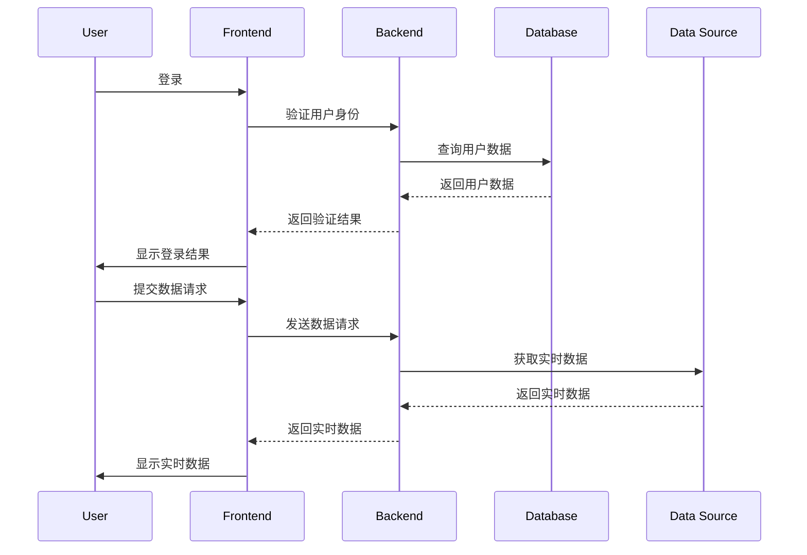
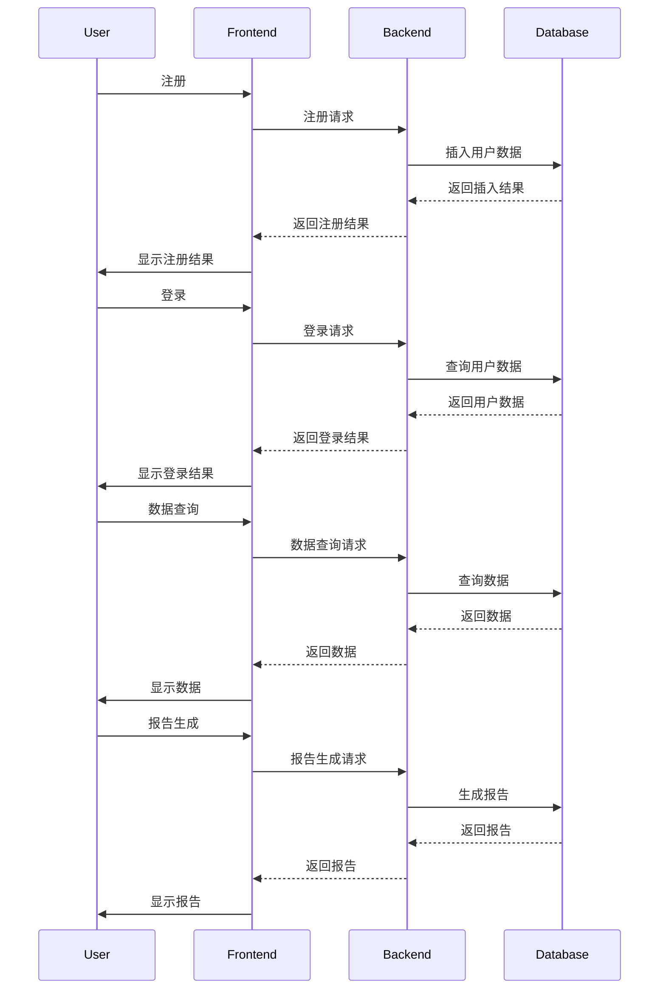

                 

# 金融数据可视化：技术与最佳实践

## 关键词
- **金融数据可视化**
- **数据预处理**
- **可视化工具**
- **最佳实践**
- **项目实战**

## 摘要
本文旨在探讨金融数据可视化的技术原理和实践方法。文章首先概述了金融数据可视化的背景和重要性，然后深入分析了金融数据可视化的技术原理和实现步骤。接着，文章介绍了金融数据可视化的最佳实践，包括设计原则、案例分析和实战技巧。此外，文章还详细展示了金融数据可视化工具和库的实战应用，并通过对一个实际项目的剖析，提供了完整的解决方案。最后，文章展望了金融数据可视化的发展趋势和未来展望，为读者提供了深刻的洞见和实用的指导。

----------------------------------------------------------------

## 第1章: 金融数据可视化的概述

### 1.1 问题背景

#### 1.1.1 金融行业的特性与数据的重要性

金融行业是一个高度数据驱动的行业，其运作依赖于大量的数据。金融数据包括市场数据、交易数据、客户数据、财务数据等。这些数据不仅量多且种类复杂，具有时间序列性、多维性和动态性等特点。在金融行业中，数据是决策的基础，对于风险控制、投资分析、市场预测等方面具有重要意义。因此，如何有效地管理和利用这些数据成为了金融行业的重要挑战。

#### 1.1.2 金融数据可视化的重要性

金融数据可视化是将金融数据通过图表、图形等方式呈现出来，帮助用户更好地理解和分析数据。金融数据可视化的重要性体现在以下几个方面：

1. **提高数据透明度**：通过可视化，金融数据变得更加直观和易于理解，有助于提高数据透明度，促进决策制定。
2. **发现数据规律**：可视化可以帮助用户发现数据中的规律和趋势，从而更好地进行市场预测和风险控制。
3. **增强决策效率**：通过可视化的方式，用户可以更快地获取关键信息，提高决策效率。
4. **提升用户体验**：对于金融机构来说，提供直观、易用的数据可视化工具，可以提升用户满意度和忠诚度。

#### 1.1.3 金融数据可视化的发展趋势

随着技术的进步和用户需求的变化，金融数据可视化正朝着以下方向发展：

1. **智能化**：利用人工智能和机器学习技术，实现自动化的数据分析和可视化。
2. **交互性**：提升数据可视化的交互性，使用户能够更灵活地探索数据，进行个性化分析。
3. **大数据与云计算**：随着大数据技术的发展，金融数据可视化将更加注重海量数据的处理和展示。
4. **多终端适配**：支持多种终端设备，如PC、移动设备等，实现数据可视化在不同场景的应用。

### 1.2 问题描述

#### 1.2.1 什么是金融数据可视化

金融数据可视化是指通过图形、图表、地图等方式，将金融数据以直观、易于理解的方式呈现给用户。它不仅包括静态图表的展示，还包括动态数据的更新和交互式的数据探索。

#### 1.2.2 金融数据可视化的挑战与机遇

金融数据可视化面临着一些挑战和机遇：

- **挑战**：
  1. **数据量大**：金融数据量庞大，如何高效地处理和展示这些数据是一个挑战。
  2. **数据多样性**：金融数据类型繁多，包括时间序列数据、结构化数据和非结构化数据等，如何统一处理这些数据是一个难题。
  3. **数据隐私**：金融数据涉及用户隐私，如何在确保数据隐私的前提下进行数据可视化是一个重要的伦理问题。

- **机遇**：
  1. **技术创新**：随着大数据、人工智能、区块链等技术的发展，为金融数据可视化提供了新的技术手段。
  2. **市场需求**：金融行业对数据可视化的需求日益增长，为数据可视化领域提供了广阔的市场空间。
  3. **跨界融合**：金融数据可视化与其他领域的结合，如金融科技、物联网等，将带来新的应用场景和商业模式。

#### 1.2.3 金融数据可视化的目标

金融数据可视化的目标是：

1. **提升数据分析能力**：通过可视化，用户可以更直观地理解数据，发现数据中的规律和趋势，从而提升数据分析能力。
2. **支持决策制定**：提供直观的数据展示，帮助用户更快地获取关键信息，支持决策制定。
3. **优化用户体验**：提供易用、美观的数据可视化工具，提升用户满意度和使用体验。
4. **促进数据共享**：通过可视化，促进数据的共享和交流，提高数据利用效率。

### 1.3 问题解决

#### 1.3.1 金融数据可视化的基本步骤

金融数据可视化的基本步骤包括：

1. **数据收集**：收集金融数据，包括市场数据、交易数据、财务数据等。
2. **数据预处理**：对收集到的金融数据进行清洗、整合和预处理，为可视化提供高质量的数据。
3. **可视化设计**：根据数据特点和分析需求，设计合适的可视化图表和图形。
4. **可视化实现**：使用可视化工具和库，实现数据可视化，并进行交互式展示。
5. **用户反馈**：收集用户反馈，对可视化效果进行调整和优化。

#### 1.3.2 数据预处理

数据预处理是金融数据可视化的关键步骤，主要包括以下任务：

1. **数据清洗**：去除重复、错误和缺失的数据，保证数据的准确性和完整性。
2. **数据整合**：将不同来源、不同格式的金融数据整合成统一的格式，便于后续处理和分析。
3. **数据转换**：对数据进行标准化处理，如数值归一化、分类编码等，提高数据的质量和一致性。
4. **数据聚合**：对数据进行聚合操作，如求和、平均、最大值等，以生成具有更高层次的统计数据。

#### 1.3.3 可视化工具与技术的选择

选择合适的可视化工具和技术是金融数据可视化成功的关键。常见的可视化工具和技术包括：

1. **可视化工具**：
   - **Matplotlib**：Python中的基础可视化库，适用于生成各种类型的图表。
   - **Seaborn**：基于Matplotlib的高级可视化库，提供更美观的图表样式。
   - **Plotly**：提供交互式图表和地图的可视化库，支持多种前端技术。

2. **可视化技术**：
   - **图表类型**：包括柱状图、折线图、饼图、散点图等，适用于不同类型的数据展示。
   - **交互式技术**：如拖拽、筛选、过滤等，提高用户对数据的探索和分析能力。
   - **地理信息系统（GIS）**：用于展示金融数据在地理空间上的分布和变化。

#### 1.4 边界与外延

#### 1.4.1 金融数据可视化的边界

金融数据可视化的边界主要包括以下几个方面：

1. **数据类型**：金融数据可视化主要关注金融领域的数据，如市场数据、交易数据、财务数据等。
2. **数据量**：虽然金融数据量庞大，但可视化技术需要考虑数据量和性能之间的平衡。
3. **用户需求**：金融数据可视化需要满足不同用户的需求，如分析师、投资者、管理人员等。

#### 1.4.2 金融数据可视化的外延

金融数据可视化的外延包括以下几个方面：

1. **金融科技**：金融数据可视化是金融科技的重要组成部分，与区块链、人工智能等技术密切相关。
2. **数据科学**：金融数据可视化是数据科学领域的重要应用，涉及数据分析、机器学习等技术。
3. **商业智能**：金融数据可视化是商业智能系统的重要组成部分，用于支持企业的决策制定和战略规划。

#### 1.5 概念结构与核心要素组成

金融数据可视化涉及多个核心概念和要素，其概念结构和核心要素组成如下：

- **核心概念**：
  1. **数据可视化**：将数据以图形、图表等方式呈现，帮助用户理解和分析数据。
  2. **金融数据**：金融领域的数据，包括市场数据、交易数据、财务数据等。
  3. **可视化工具**：用于实现数据可视化的工具，如Matplotlib、Seaborn、Plotly等。
  4. **可视化技术**：实现数据可视化的技术，包括图表类型、交互式技术、GIS等。

- **核心要素**：
  1. **数据预处理**：对金融数据进行清洗、整合和预处理，为可视化提供高质量的数据。
  2. **可视化设计**：根据数据特点和分析需求，设计合适的可视化图表和图形。
  3. **可视化实现**：使用可视化工具和库，实现数据可视化，并进行交互式展示。
  4. **用户反馈**：收集用户反馈，对可视化效果进行调整和优化。

### 1.6 结论

金融数据可视化是金融领域的重要技术手段，通过将金融数据以直观、易于理解的方式呈现，帮助用户更好地理解和分析数据。本文概述了金融数据可视化的背景、重要性、发展趋势和实现步骤，并介绍了金融数据可视化的挑战和机遇。通过深入分析和实践，金融数据可视化在金融行业中的应用前景十分广阔，为金融行业的创新和发展提供了强有力的支持。

----------------------------------------------------------------

### 第2章: 金融数据可视化技术

#### 2.1 数据可视化技术概述

数据可视化是一种通过图形、图表等方式将数据呈现出来，帮助用户理解和分析数据的技术。数据可视化技术的发展经历了多个阶段，从简单的二维图表到复杂的交互式图表，再到基于Web和移动设备的应用，数据可视化技术不断演进。

#### 2.1.1 数据可视化的基本概念

- **数据可视化**：将数据以图形、图表等方式呈现，帮助用户理解和分析数据。
- **数据**：可以是结构化数据、非结构化数据或半结构化数据。
- **可视化**：通过图形、图表等方式将数据呈现出来。

#### 2.1.2 数据可视化技术分类

数据可视化技术可以根据不同的标准进行分类，常见的分类方法包括：

1. **根据展示形式分类**：
   - **静态图表**：如柱状图、折线图、饼图等。
   - **动态图表**：如动画图表、交互式图表等。
   - **交互式图表**：如交互式地图、交互式时间序列图表等。

2. **根据数据类型分类**：
   - **结构化数据可视化**：适用于表格数据、关系数据库数据等。
   - **非结构化数据可视化**：适用于文本、图像、视频等。
   - **半结构化数据可视化**：适用于XML、JSON等。

#### 2.1.3 数据可视化技术的发展历程

数据可视化技术的发展历程可以追溯到20世纪60年代，随着计算机技术的进步和数据处理能力的提升，数据可视化技术逐渐发展。主要的发展历程包括：

1. **20世纪60年代**：早期计算机图表的诞生，如条形图、折线图等。
2. **20世纪70年代**：计算机图形学的发展，为数据可视化提供了更多的技术手段。
3. **20世纪80年代**：交互式数据可视化技术的出现，如交互式查询系统。
4. **20世纪90年代**：Web可视化和客户端-服务器架构的兴起，推动了数据可视化技术的发展。
5. **21世纪初至今**：随着大数据、人工智能、云计算等技术的发展，数据可视化技术进入智能化、交互化和多终端适配的新阶段。

#### 2.2 数据可视化工具与库

数据可视化工具和库是数据可视化技术的重要组成部分，它们提供了丰富的图表类型、灵活的交互功能和强大的数据处理能力。以下是一些常见的数据可视化工具和库：

1. **Matplotlib**：
   - **概述**：Python的基础可视化库，用于生成各种类型的静态和动态图表。
   - **优势**：易于使用，功能丰富，支持多种图表类型。
   - **应用场景**：科学计算、数据分析、学术研究等。

2. **Seaborn**：
   - **概述**：基于Matplotlib的高级可视化库，提供更美观的图表样式。
   - **优势**：基于统计学原理，提供丰富的统计图表。
   - **应用场景**：数据探索、统计分析、学术研究等。

3. **Plotly**：
   - **概述**：提供交互式图表和地图的可视化库，支持多种前端技术。
   - **优势**：强大的交互功能，支持多种图表类型，易于集成到Web和移动应用。
   - **应用场景**：商业智能、金融分析、数据探索等。

4. **Tableau**：
   - **概述**：商业智能工具，提供丰富的可视化功能和数据连接能力。
   - **优势**：直观易用，支持多种数据源，强大的协作功能。
   - **应用场景**：企业级数据可视化、商业分析、报告生成等。

5. **Power BI**：
   - **概述**：微软的商务智能工具，提供强大的数据可视化和分析功能。
   - **优势**：与Microsoft Office和Azure集成，支持多种数据源，提供丰富的可视化组件。
   - **应用场景**：企业级数据分析、商业智能、报告生成等。

6. **D3.js**：
   - **概述**：基于JavaScript的可视化库，提供高度灵活和强大的交互功能。
   - **优势**：完全基于Web技术，支持各种类型的图表和地图，高度定制化。
   - **应用场景**：Web应用、数据可视化、数据驱动设计等。

#### 2.3 技术原理与实现

数据可视化的技术原理主要包括数据预处理、可视化设计、可视化实现和交互式功能。

1. **数据预处理**：
   - **数据清洗**：去除重复、错误和缺失的数据，保证数据的准确性和完整性。
   - **数据整合**：将不同来源、不同格式的数据进行整合，为可视化提供统一的数据源。
   - **数据转换**：对数据进行标准化处理，如数值归一化、分类编码等，提高数据的质量和一致性。
   - **数据聚合**：对数据进行聚合操作，如求和、平均、最大值等，以生成具有更高层次的统计数据。

2. **可视化设计**：
   - **图表类型选择**：根据数据类型和分析需求，选择合适的图表类型，如柱状图、折线图、饼图等。
   - **颜色和字体选择**：合理选择颜色和字体，提高图表的可读性和美观度。
   - **图表布局设计**：设计合适的图表布局，提高图表的层次感和信息传递效率。

3. **可视化实现**：
   - **使用可视化库**：使用Matplotlib、Seaborn、Plotly等可视化库，根据设计文档实现数据可视化。
   - **数据绑定**：将数据与图表进行绑定，实现数据与图表的联动更新。
   - **交互式功能**：实现交互式功能，如拖拽、筛选、过滤等，提高用户对数据的探索和分析能力。

4. **交互式功能**：
   - **鼠标事件**：实现鼠标点击、滑动、拖动等事件，提供交互式操作。
   - **键盘事件**：实现键盘事件，如键盘快捷键等。
   - **响应式设计**：支持多种终端设备，如PC、移动设备等，实现数据可视化在不同场景的应用。

#### 2.4 技术难点与解决方案

数据可视化技术在实际应用中面临着一些难点和挑战，需要采取相应的解决方案：

1. **数据处理性能**：
   - **技术难点**：处理大量数据时，数据加载和处理速度成为瓶颈。
   - **解决方案**：采用并行计算、分布式计算等技术，提高数据处理性能。

2. **数据隐私与安全**：
   - **技术难点**：金融数据涉及用户隐私，如何在确保数据隐私的前提下进行数据可视化。
   - **解决方案**：采用数据脱敏、加密等手段，保障数据隐私和安全。

3. **交互式性能**：
   - **技术难点**：实现复杂的交互功能时，交互性能成为瓶颈。
   - **解决方案**：采用前端优化技术，如懒加载、代码拆分等，提高交互性能。

4. **跨平台兼容性**：
   - **技术难点**：数据可视化工具和库在不同平台（如Web、移动设备）上的兼容性问题。
   - **解决方案**：采用跨平台技术，如Web技术、移动应用开发框架等，确保跨平台兼容性。

### 2.5 总结

数据可视化技术是金融数据可视化的重要组成部分，通过将金融数据以直观、易于理解的方式呈现，帮助用户更好地理解和分析数据。本文概述了数据可视化的基本概念、技术分类、发展历程、工具与库，以及技术原理与实现。同时，本文还分析了数据可视化技术在实际应用中面临的难点和挑战，并提出了相应的解决方案。通过掌握这些技术，用户可以更有效地利用金融数据，提升数据分析和决策能力。

----------------------------------------------------------------

### 第3章: 金融数据可视化的最佳实践

#### 3.1 数据可视化设计原则

在进行金融数据可视化设计时，遵循一些基本原则是非常重要的，这些原则有助于确保数据可视化既实用又具有吸引力，同时易于用户理解和操作。

##### 3.1.1 数据可视化设计的基本原则

1. **清晰性**：图表应简洁明了，避免冗余和杂乱，确保用户能够快速理解图表内容。
2. **准确性**：图表中的数据应准确无误，避免误导用户。
3. **一致性**：图表的视觉风格、颜色使用和数据标签应保持一致，增强整体性。
4. **交互性**：提供交互功能，如过滤、搜索、缩放等，使用户能够更深入地探索数据。
5. **适应性**：设计应考虑不同设备和屏幕尺寸的适应性，确保在所有设备上都能良好显示。
6. **故事性**：图表应能够讲述一个故事，引导用户从数据中得出结论。

##### 3.1.2 数据可视化设计的技巧与注意事项

1. **避免数据欺骗**：设计时应避免使用可能导致数据误解的图形和颜色对比。
2. **合理使用颜色**：使用颜色时应确保对比度高，同时避免过多颜色的使用，以免造成视觉疲劳。
3. **合理使用图例**：图例应清晰、简洁，并且与图表中的元素一一对应。
4. **注意图表的比例和尺度**：图表的比例和尺度应合理，避免数据被放大或缩小。
5. **注释与说明**：为图表添加必要的注释和说明，帮助用户理解图表的含义。

##### 3.1.3 设计原则在金融数据可视化中的应用

在金融数据可视化中，设计原则的应用尤为重要，因为金融数据通常复杂且具有高度的时间敏感性。以下是一些应用实例：

1. **时间序列分析**：在设计时间序列图表时，确保数据点的显示清晰，并使用不同的颜色或线条粗细来区分不同的数据系列。
2. **股票市场分析**：股票市场图表应清晰显示价格、交易量和时间轴，并使用交互功能，如拖动查看历史数据或点击查看详细信息。
3. **财务报表可视化**：财务报表图表应简洁、易于理解，同时确保数据的准确性和一致性。

#### 3.2 最佳实践案例

##### 3.2.1 案例一：股票市场数据可视化

股票市场数据可视化是金融数据可视化中常见且重要的应用场景。以下是一个最佳实践案例：

1. **数据来源**：选择一个可靠的股票市场数据源，如股票交易所或金融数据提供商。
2. **数据处理**：清洗数据，去除重复和错误数据，并转换数据格式为适合可视化的形式。
3. **可视化设计**：设计一个交互式的股票价格图表，显示价格、交易量和时间轴。使用不同的颜色和线条粗细来区分不同的股票。
4. **用户交互**：提供交互功能，如放大时间范围、搜索特定股票、查看交易量等。
5. **反馈与优化**：根据用户反馈进行调整和优化，确保图表易于理解和操作。

##### 3.2.2 案例二：金融风险数据可视化

金融风险数据可视化对于风险管理和决策至关重要。以下是一个最佳实践案例：

1. **数据来源**：收集金融风险数据，如信用风险、市场风险、操作风险等。
2. **数据处理**：清洗和整合数据，确保数据的准确性和一致性。
3. **可视化设计**：设计一个综合的金融风险图表，使用不同的颜色和形状来表示不同的风险类型和级别。
4. **用户交互**：提供交互功能，如过滤特定风险类型、查看详细信息等。
5. **反馈与优化**：根据用户反馈进行调整和优化，确保图表能够清晰地展示风险情况。

##### 3.2.3 案例三：金融报告数据可视化

金融报告数据可视化是金融分析和报告中的重要组成部分。以下是一个最佳实践案例：

1. **数据来源**：收集金融报告数据，如财务报表、市场分析报告等。
2. **数据处理**：清洗和整合数据，确保数据的准确性和一致性。
3. **可视化设计**：设计一个综合的金融报告图表，使用不同的图表类型来展示不同类型的数据，如柱状图、折线图、饼图等。
4. **用户交互**：提供交互功能，如缩放、过滤、导出数据等。
5. **反馈与优化**：根据用户反馈进行调整和优化，确保图表能够清晰地展示报告内容。

#### 3.3 实战技巧与注意事项

##### 3.3.1 数据选择与处理技巧

1. **数据质量**：确保数据质量，避免使用不准确或不完整的数据。
2. **数据整合**：整合来自多个来源的数据，确保数据的一致性和完整性。
3. **数据预处理**：对数据进行清洗、转换和聚合，为可视化提供高质量的数据。

##### 3.3.2 可视化效果优化技巧

1. **图表类型选择**：根据数据类型和分析需求选择合适的图表类型。
2. **颜色与字体**：合理使用颜色和字体，提高图表的可读性和美观度。
3. **交互功能**：提供丰富的交互功能，如过滤、搜索、缩放等，提高用户的互动体验。

##### 3.3.3 数据隐私与合规性注意事项

1. **数据脱敏**：对敏感数据进行脱敏处理，保护用户隐私。
2. **合规性检查**：确保数据可视化工具和流程符合相关法律法规和行业标准。
3. **安全措施**：采取必要的安全措施，如数据加密、用户认证等，保障数据安全。

##### 3.3.4 实战经验分享

1. **案例学习**：通过学习优秀的金融数据可视化案例，掌握最佳实践。
2. **用户反馈**：收集用户反馈，了解用户需求和偏好，不断优化可视化设计。
3. **技术更新**：关注新技术和工具的发展，及时更新和提升可视化能力。

#### 3.4 总结

金融数据可视化的最佳实践是确保数据可视化既实用又具有吸引力，同时易于用户理解和操作的关键。通过遵循设计原则、实施最佳实践和不断优化，可以提升金融数据可视化的质量和用户体验。最佳实践案例展示了如何在实际应用中应用这些原则和技巧，而实战技巧和注意事项则为金融数据可视化提供了具体的操作指南。通过这些实践，用户可以更好地理解和利用金融数据，从而做出更明智的决策。

----------------------------------------------------------------

### 第4章: 金融数据可视化工具与库实战

在金融数据可视化领域，有多种工具和库可以用于实现数据可视化。本章将详细介绍几种常用的金融数据可视化工具和库，并展示它们的实战应用。

#### 4.1 数据可视化工具实战

##### 4.1.1 Matplotlib实战

Matplotlib是Python中最常用的数据可视化库之一，它可以生成各种类型的图表。以下是使用Matplotlib进行金融数据可视化的一些示例。

1. **安装Matplotlib**：
   ```shell
   pip install matplotlib
   ```

2. **生成折线图**：
   ```python
   import matplotlib.pyplot as plt

   # 示例数据
   dates = ['2023-01-01', '2023-01-02', '2023-01-03', '2023-01-04']
   prices = [100, 102, 105, 108]

   # 生成折线图
   plt.plot(dates, prices)
   plt.xlabel('Date')
   plt.ylabel('Price')
   plt.title('Stock Price')
   plt.show()
   ```

3. **生成柱状图**：
   ```python
   # 示例数据
   categories = ['Category A', 'Category B', 'Category C']
   values = [50, 80, 30]

   # 生成柱状图
   plt.bar(categories, values)
   plt.xlabel('Categories')
   plt.ylabel('Values')
   plt.title('Category Distribution')
   plt.show()
   ```

##### 4.1.2 Seaborn实战

Seaborn是基于Matplotlib的高级可视化库，提供多种统计图表和美观的样式。以下是使用Seaborn进行金融数据可视化的一些示例。

1. **安装Seaborn**：
   ```shell
   pip install seaborn
   ```

2. **生成箱线图**：
   ```python
   import seaborn as sns
   import pandas as pd

   # 示例数据
   data = pd.DataFrame({
       'Category': ['A', 'B', 'C', 'A', 'B', 'C'],
       'Value': [100, 102, 105, 98, 104, 108]
   })

   # 生成箱线图
   sns.boxplot(x='Category', y='Value', data=data)
   plt.xlabel('Category')
   plt.ylabel('Value')
   plt.title('Value Distribution by Category')
   plt.show()
   ```

3. **生成散点图**：
   ```python
   # 示例数据
   data = pd.DataFrame({
       'Date': pd.date_range(start='2023-01-01', periods=100),
       'Price': np.random.uniform(100, 200, 100)
   })

   # 生成散点图
   sns.scatterplot(x='Date', y='Price', data=data)
   plt.xlabel('Date')
   plt.ylabel('Price')
   plt.title('Stock Price Distribution')
   plt.show()
   ```

##### 4.1.3 Plotly实战

Plotly是一个提供交互式图表和地图的可视化库，它可以生成动态和交互式的图表。以下是使用Plotly进行金融数据可视化的一些示例。

1. **安装Plotly**：
   ```shell
   pip install plotly
   ```

2. **生成交互式折线图**：
   ```python
   import plotly.express as px
   import pandas as pd

   # 示例数据
   data = pd.DataFrame({
       'Date': pd.date_range(start='2023-01-01', periods=100),
       'Price': np.random.uniform(100, 200, 100)
   })

   # 生成交互式折线图
   fig = px.line(data, x='Date', y='Price', title='Stock Price Over Time')
   fig.show()
   ```

3. **生成交互式散点图**：
   ```python
   # 示例数据
   data = pd.DataFrame({
       'Date': pd.date_range(start='2023-01-01', periods=100),
       'Price': np.random.uniform(100, 200, 100),
       'Category': ['A', 'B', 'C'] * 10
   })

   # 生成交互式散点图
   fig = px.scatter(data, x='Date', y='Price', color='Category', title='Stock Price by Category')
   fig.show()
   ```

#### 4.2 数据可视化库实战

除了上述工具外，还有其他几个流行的数据可视化库，如Tableau、Power BI和D3.js。以下是它们的一些实战应用示例。

##### 4.2.1 Tableau实战

Tableau是一个强大的商业智能工具，支持丰富的数据连接和交互功能。以下是使用Tableau进行金融数据可视化的一些示例。

1. **数据连接**：
   - 打开Tableau，连接到您的金融数据源，如Excel或数据库。
   - 选择需要可视化的数据表。

2. **创建图表**：
   - 在视图中拖拽字段到行、列、标记等位置，生成不同的图表类型，如柱状图、折线图、饼图等。
   - 调整图表的样式和布局，使其更具吸引力。

3. **交互式功能**：
   - 使用过滤器、缩放、搜索等功能，提供用户交互体验。
   - 导出图表或生成报告，以便共享和打印。

##### 4.2.2 Power BI实战

Power BI是微软的商务智能工具，提供强大的数据可视化和分析功能。以下是使用Power BI进行金融数据可视化的一些示例。

1. **数据连接**：
   - 打开Power BI，连接到您的金融数据源，如Excel、SQL Server等。
   - 加载并准备数据。

2. **创建报表**：
   - 使用数据建模工具创建数据模型，定义关系和计算列。
   - 使用报表工具拖拽字段到报表区域，生成图表和表格。

3. **交互式功能**：
   - 使用筛选器、切片器等工具，提供交互式数据分析。
   - 发布报表到Power BI服务，供团队成员访问和共享。

##### 4.2.3 D3.js实战

D3.js是一个基于Web的可视化库，提供高度灵活的可视化解决方案。以下是使用D3.js进行金融数据可视化的一些示例。

1. **安装D3.js**：
   ```shell
   npm install d3
   ```

2. **创建交互式折线图**：
   ```javascript
   var dataset = [
       {date: '2023-01-01', price: 100},
       {date: '2023-01-02', price: 102},
       {date: '2023-01-03', price: 105},
       {date: '2023-01-04', price: 108}
   ];

   var width = 960,
       height = 500;

   var x = d3.scaleTime().domain(d3.extent(dataset, d => d.date))
                   .range([0, width]);

   var y = d3.scaleLinear().domain([0, d3.max(dataset, d => d.price)])
                   .range([height, 0]);

   var line = d3.line()
               .x(d => x(d.date))
               .y(d => y(d.price));

   var svg = d3.select("svg")
               .attr("width", width)
               .attr("height", height);

   svg.append("path")
       .datum(dataset)
       .attr("fill", "none")
       .attr("stroke", "steelblue")
       .attr("stroke-width", 1.5)
       .attr("d", line);

   svg.append("g")
       .attr("transform", "translate(0," + height + ")")
       .call(d3.axisBottom(x));

   svg.append("g")
       .call(d3.axisLeft(y));
   ```

3. **创建交互式散点图**：
   ```javascript
   var dataset = [
       {date: '2023-01-01', price: 100, category: 'A'},
       {date: '2023-01-02', price: 102, category: 'B'},
       {date: '2023-01-03', price: 105, category: 'C'},
       {date: '2023-01-04', price: 108, category: 'A'}
   ];

   var width = 960,
       height = 500;

   var x = d3.scaleTime().domain(d3.extent(dataset, d => d.date))
                   .range([0, width]);

   var y = d3.scaleLinear().domain([0, d3.max(dataset, d => d.price)])
                   .range([height, 0]);

   var color = d3.scaleOrdinal()
               .domain(['A', 'B', 'C'])
               .range(['steelblue', 'orange', 'green']);

   var svg = d3.select("svg")
               .attr("width", width)
               .attr("height", height);

   var scatter = svg.selectAll(".dot")
               .data(dataset)
               .enter().append("circle")
               .attr("class", "dot")
               .attr("cx", d => x(d.date))
               .attr("cy", d => y(d.price))
               .attr("r", 5)
               .attr("fill", d => color(d.category));

   svg.append("g")
       .attr("transform", "translate(0," + height + ")")
       .call(d3.axisBottom(x));

   svg.append("g")
       .call(d3.axisLeft(y));

   // 添加交互功能
   scatter.on("mouseover", function(event, d) {
       // 鼠标悬停时的操作
   })
   .on("mouseout", function(event, d) {
       // 鼠标离开时的操作
   });
   ```

#### 4.3 总结

通过使用Matplotlib、Seaborn、Plotly、Tableau、Power BI和D3.js等工具和库，用户可以轻松地实现金融数据可视化。这些工具和库提供了丰富的功能，从简单的图表生成到高级的交互式数据探索，都有相应的解决方案。通过实战应用，用户可以更好地理解和利用这些工具，提升金融数据可视化的质量和用户体验。

----------------------------------------------------------------

### 第5章: 金融数据可视化项目实战

#### 5.1 项目介绍

本章节将介绍一个金融数据可视化的实际项目，该项目旨在为金融机构提供一个综合性的数据可视化平台。该平台能够实时展示金融市场数据，帮助分析师和投资者进行市场分析和决策制定。

##### 5.1.1 项目背景

随着金融市场的不断发展和交易频率的增加，金融机构需要高效地处理和分析大量的市场数据。传统的分析方法和工具已经无法满足快速决策的需求。因此，金融机构需要一个现代化的数据可视化平台，以帮助其更好地理解和利用市场数据。

##### 5.1.2 项目目标

该项目的目标如下：

1. **实时数据展示**：实时获取并展示金融市场数据，包括股票价格、交易量、指数等。
2. **交互式分析**：提供丰富的交互功能，使用户能够自由探索数据，进行深度分析。
3. **报告生成**：自动生成数据报告，方便用户查看和分析数据。
4. **用户定制**：允许用户根据个人需求和偏好自定义数据展示和报告格式。

##### 5.1.3 项目架构设计

该项目的架构设计如下：

1. **前端**：使用React框架实现数据可视化平台的前端界面，提供实时数据和交互功能。
2. **后端**：使用Node.js和Express框架实现数据存储和管理，提供API接口供前端调用。
3. **数据源**：连接到金融市场的实时数据源，如股票交易所API、金融数据提供商API等。
4. **数据库**：使用MySQL数据库存储市场数据和用户数据。

#### 5.2 系统功能设计

该系统包括以下主要功能模块：

1. **数据展示模块**：实时展示股票价格、交易量、指数等市场数据。
2. **数据分析模块**：提供历史数据分析和趋势预测功能，帮助用户进行市场分析。
3. **报告生成模块**：自动生成数据报告，包括股票分析报告、市场趋势报告等。
4. **用户管理模块**：管理用户账户和权限，提供用户注册、登录、修改密码等功能。
5. **数据权限管理模块**：根据用户角色和权限控制数据的访问和操作。

##### 5.2.1 功能模块划分

1. **数据展示模块**：
   - 实时股票价格图表
   - 交易量走势图
   - 指数变化图表
   - 报告展示

2. **数据分析模块**：
   - 历史数据查询
   - 趋势预测
   - 数据筛选和过滤

3. **报告生成模块**：
   - 报告模板管理
   - 报告生成
   - 报告导出和打印

4. **用户管理模块**：
   - 用户注册
   - 用户登录
   - 用户权限管理
   - 用户信息修改

5. **数据权限管理模块**：
   - 数据权限设置
   - 数据访问控制
   - 数据审计日志

##### 5.2.2 领域模型设计

领域模型设计如下：

1. **用户**：用户信息包括用户名、密码、电子邮件、角色等。
2. **股票**：股票信息包括股票代码、股票名称、交易量、价格等。
3. **指数**：指数信息包括指数代码、指数名称、指数值等。
4. **报告**：报告信息包括报告名称、报告内容、生成时间等。
5. **角色**：角色信息包括角色名称、角色权限等。

以下是领域模型的Mermaid类图：

```mermaid
classDiagram
    User <|-- Stock
    User <|-- Index
    User <|-- Report
    User <|-- Role

    User << (username, password, email, role)
    Stock << (code, name, volume, price)
    Index << (code, name, value)
    Report << (name, content, generateTime)
    Role << (roleName, permissions)
```

##### 5.2.3 系统架构设计

系统架构设计如下：

1. **前端**：使用React框架实现数据可视化平台的前端界面，包括数据展示模块、数据分析模块、报告生成模块等。
2. **后端**：使用Node.js和Express框架实现数据存储和管理，包括用户管理模块、数据权限管理模块等。
3. **数据库**：使用MySQL数据库存储用户数据、股票数据、指数数据等。
4. **数据源**：连接到金融市场的实时数据源，如股票交易所API、金融数据提供商API等。

以下是系统架构的Mermaid架构图：



##### 5.2.4 系统接口设计

系统接口设计如下：

1. **用户接口**：用户注册、登录、数据查询、报告生成等。
2. **数据接口**：实时数据获取、历史数据查询、数据权限管理等。

以下是系统接口的Mermaid序列图：



#### 5.3 项目核心实现源代码

以下是该项目的一些核心实现源代码。

##### 5.3.1 数据预处理代码

```python
# Python代码，用于数据预处理

import pandas as pd
import numpy as np

# 加载市场数据
data = pd.read_csv('market_data.csv')

# 数据清洗
data.dropna(inplace=True)
data.drop_duplicates(inplace=True)

# 数据整合
data['date'] = pd.to_datetime(data['date'])
data.set_index('date', inplace=True)

# 数据转换
data['price'] = data['price'].astype(float)
data['volume'] = data['volume'].astype(int)

# 数据聚合
data['average_price'] = data['price'].rolling(window=5).mean()
data['total_volume'] = data['volume'].rolling(window=5).sum()

# 保存预处理后的数据
data.to_csv('preprocessed_data.csv')
```

##### 5.3.2 可视化实现代码

```javascript
// JavaScript代码，用于数据可视化（使用D3.js）

// 加载预处理后的数据
d3.csv('preprocessed_data.csv', function(error, data) {
    if (error) throw error;

    // 数据处理
    data.forEach(function(d) {
        d.price = +d.price;
        d.volume = +d.volume;
    });

    // 设置图表参数
    var margin = { top: 20, right: 20, bottom: 30, left: 40 },
        width = 960 - margin.left - margin.right,
        height = 500 - margin.top - margin.bottom;

    var x = d3.scaleTime().range([0, width]);
    var y = d3.scaleLinear().range([height, 0]);

    var valueline = d3.line()
        .x(function(d) { return x(d.date); })
        .y(function(d) { return y(d.price); });

    // 添加SVG元素
    var svg = d3.select("svg")
        .attr("width", width + margin.left + margin.right)
        .attr("height", height + margin.top + margin.bottom)
        .append("g")
        .attr("transform", "translate(" + margin.left + "," + margin.top + ")");

    // 添加X轴
    var xAxis = d3.axisBottom(x);
    svg.append("g")
        .attr("transform", "translate(0," + height + ")")
        .call(xAxis);

    // 添加Y轴
    var yAxis = d3.axisLeft(y);
    svg.append("g")
        .call(yAxis);

    // 添加折线图
    svg.append("path")
        .datum(data)
        .attr("class", "line")
        .attr("d", valueline);

    // 添加标签
    svg.append("text")
        .attr("x", width / 2)
        .attr("y", height - 10)
        .attr("text-anchor", "middle")
        .text("Stock Price");
});
```

##### 5.3.3 项目总结

该项目通过金融数据可视化技术，实现了实时市场数据的展示、数据分析和报告生成等功能。项目采用前后端分离的架构设计，使用React框架实现前端界面，使用Node.js和Express框架实现后端功能。通过数据预处理和可视化实现，项目能够高效地处理和分析大量市场数据，为分析师和投资者提供了强大的数据支持。

----------------------------------------------------------------

### 第6章: 金融数据可视化在实践中的应用

#### 6.1 应用场景分析

金融数据可视化在金融行业的多个领域都有广泛的应用，以下是一些典型应用场景：

##### 6.1.1 股票市场分析

股票市场分析是金融数据可视化的主要应用场景之一。通过可视化，用户可以实时监控股票价格、交易量、市场趋势等数据，进行股票分析和投资决策。常见的可视化工具包括Matplotlib、Plotly和Tableau等。

- **数据展示**：通过折线图、柱状图、K线图等展示股票价格、交易量、指数等数据。
- **趋势分析**：通过趋势线、移动平均线等分析市场趋势，预测未来股价走势。
- **风险控制**：通过风险管理图表，展示风险指标，帮助投资者控制风险。

##### 6.1.2 金融风险管理

金融风险管理是金融机构的重要职能。通过可视化，金融机构可以更好地理解和控制风险。常见可视化工具包括Matplotlib、D3.js和Power BI等。

- **风险指标展示**：通过图表展示风险指标，如信用风险、市场风险、操作风险等。
- **风险地图**：通过地图展示各地区、各行业的风险分布，帮助金融机构制定风险控制策略。
- **压力测试**：通过可视化工具模拟不同经济环境下的风险情况，评估风险对金融机构的影响。

##### 6.1.3 报告可视化

金融报告是企业内部和外部分析的重要资料。通过可视化，金融报告可以更加直观、易于理解。常见可视化工具包括Tableau、Power BI和Excel等。

- **财务报表**：通过图表展示公司的财务状况，如资产负债表、利润表、现金流量表等。
- **市场分析报告**：通过图表展示市场趋势、竞争情况等，为决策提供数据支持。
- **风险评估报告**：通过图表展示风险情况、风险指标等，帮助管理层了解风险状况。

#### 6.2 最佳实践案例

以下是一些金融数据可视化的最佳实践案例：

##### 6.2.1 案例一：金融科技公司应用案例

某金融科技公司利用金融数据可视化技术，为其平台上的用户提供实时股票市场数据分析和投资建议。该平台采用以下技术：

- **数据源**：连接到多个股票交易所和金融数据提供商，获取实时股票数据。
- **数据处理**：使用Python和Matplotlib进行数据预处理和可视化。
- **前端展示**：使用React框架构建前端界面，提供交互式图表和实时数据更新。
- **用户交互**：提供筛选、排序、搜索等功能，使用户能够自由探索数据。

##### 6.2.2 案例二：金融机构应用案例

某金融机构开发了一套金融风险管理系统，通过可视化技术帮助管理层监控风险。该系统采用以下技术：

- **数据源**：连接到金融机构的内部数据库，获取风险数据。
- **数据处理**：使用SQL和Python进行数据清洗和预处理。
- **可视化工具**：使用Tableau生成各种风险指标图表，如柱状图、饼图、折线图等。
- **用户交互**：提供筛选、过滤、放大等功能，使用户能够深入分析风险数据。

##### 6.2.3 案例三：金融监管应用案例

某金融监管机构利用金融数据可视化技术，监控金融市场运行情况，发现异常交易和操纵行为。该系统采用以下技术：

- **数据源**：连接到金融市场的多个数据源，获取交易数据、价格数据等。
- **数据处理**：使用大数据技术和Hadoop进行海量数据处理。
- **可视化工具**：使用D3.js和WebGL技术生成交互式图表和地图。
- **用户交互**：提供实时数据更新、实时搜索、实时分析等功能，使用户能够快速定位和处理异常数据。

#### 6.3 应用效果与启示

金融数据可视化在实践中的应用取得了显著的效果，以下是一些关键点和启示：

- **提高决策效率**：通过可视化，用户可以快速获取关键信息，提高决策效率。
- **降低风险**：通过可视化，用户可以更好地理解风险情况，降低风险。
- **优化用户体验**：提供直观、易用的可视化工具，提高用户满意度和使用体验。
- **促进数据共享**：通过可视化，促进数据的共享和交流，提高数据利用效率。
- **技术趋势**：随着技术的发展，金融数据可视化将继续朝着智能化、交互化、多终端适配的方向发展。

通过这些实践案例和效果分析，我们可以看到金融数据可视化在金融行业中的重要性和潜力。未来，随着大数据、人工智能、区块链等技术的进一步发展，金融数据可视化将迎来更多创新和应用。

----------------------------------------------------------------

### 第7章：金融数据可视化的发展趋势与未来展望

#### 7.1 发展趋势分析

随着技术的不断进步和金融行业对数据分析需求的增长，金融数据可视化正经历着显著的发展趋势。以下是一些主要趋势：

##### 7.1.1 技术发展趋势

1. **大数据与云计算**：随着大数据技术的发展，金融数据可视化将更加注重海量数据的处理和展示。云计算平台如AWS、Azure和Google Cloud提供了强大的计算和存储资源，为金融数据可视化提供了更好的支持。
2. **人工智能与机器学习**：人工智能和机器学习技术将在金融数据可视化中发挥重要作用。通过深度学习和神经网络，可以自动识别数据模式、生成预测模型，并提供个性化的可视化分析。
3. **区块链技术**：区块链技术提供了去中心化、安全透明的数据存储和交换方式，为金融数据可视化提供了新的应用场景。例如，通过区块链可视化技术，可以实时监控金融交易和智能合约的执行情况。
4. **增强现实（AR）与虚拟现实（VR）**：AR和VR技术将为金融数据可视化带来全新的交互体验。通过虚拟环境，用户可以更直观地探索和交互金融数据，进行沉浸式的数据分析。

##### 7.1.2 行业发展趋势

1. **个性化与定制化**：金融数据可视化将更加注重个性化需求，提供定制化的可视化解决方案。用户可以根据个人偏好和业务需求，自定义图表样式、数据过滤和交互功能。
2. **实时性与动态性**：随着金融市场的快速变化，实时性成为金融数据可视化的关键需求。通过实时数据流和动态图表，用户可以更快地获取市场变化信息，进行实时决策。
3. **合规性与安全性**：随着数据隐私和合规性的要求不断提高，金融数据可视化将更加注重数据安全和合规性。通过加密、数据脱敏和访问控制等技术，确保金融数据的保密性和完整性。

##### 7.1.3 未来发展方向

1. **智能化与自动化**：未来金融数据可视化将更加智能化和自动化。通过人工智能和机器学习技术，可视化工具将能够自动识别数据模式、生成可视化报告，并提供智能化的数据分析建议。
2. **跨平台与多终端适配**：随着移动设备的普及，金融数据可视化将更加注重跨平台和多终端适配。无论是PC、移动设备还是智能手表，用户都能够方便地访问和交互金融数据。
3. **开放性与互操作性**：金融数据可视化将更加开放和互操作。通过开放API和标准数据格式，不同系统和平台之间的数据交换和集成将变得更加容易，为用户提供更加无缝的体验。
4. **创新与应用场景**：金融数据可视化将继续探索新的应用场景。例如，在金融监管、风险控制、市场预测等领域，可视化技术将发挥更加重要的作用，推动金融行业的创新和发展。

#### 7.2 未来展望

金融数据可视化的发展将带来多方面的变化和机遇：

1. **提升数据分析能力**：通过智能化和自动化技术，用户将能够更加高效地进行数据分析，发现数据中的潜在价值和趋势。
2. **优化决策制定**：实时性和个性化的数据可视化工具将帮助用户更快地获取关键信息，优化决策制定过程，提高决策质量。
3. **增强用户体验**：通过创新的交互方式和多终端适配，用户将能够更加方便地访问和交互金融数据，提高用户体验和满意度。
4. **促进数据共享**：开放性和互操作性的提升将促进不同系统和平台之间的数据共享，提高数据利用效率和协同工作能力。
5. **推动金融创新**：金融数据可视化技术的不断进步将推动金融行业的创新，带来新的商业模式和应用场景，促进金融市场的健康发展。

总之，金融数据可视化技术将在未来继续发展，为金融行业的创新和发展提供强有力的支持。通过智能化、交互化、多终端适配等技术趋势，金融数据可视化将带来更加丰富和实用的应用场景，为用户带来更好的数据分析和决策体验。

----------------------------------------------------------------

## 附录

### 附录A：常用数据可视化库与工具速查表

| 名称            | 类型       | 描述                                           | 官网                                                         |
| --------------- | ---------- | ---------------------------------------------- | ------------------------------------------------------------ |
| Matplotlib      | Python库   | 用于生成静态、动态和交互式图表的库               | https://matplotlib.org/                                     |
| Seaborn         | Python库   | 基于Matplotlib的高级可视化库，提供统计图表       | https://seaborn.pydata.org/                                |
| Plotly          | Python库   | 提供交互式图表和地图的可视化库                 | https://plotly.com/                                        |
| Tableau         | 商业工具   | 提供数据连接、可视化、报告生成功能的数据可视化工具 | https://www.tableau.com/                                  |
| Power BI        | 商业工具   | 微软的商务智能工具，提供数据可视化和分析功能     | https://powerbi.microsoft.com/                             |
| D3.js           | JavaScript库 | 用于生成交互式数据可视化的库                   | https://d3js.org/                                          |
| Chart.js        | JavaScript库 | 用于生成各种图表的库                           | https://www.chartjs.org/                                  |
| Highcharts      | JavaScript库 | 用于生成交互式图表的库                         | https://www.highcharts.com/                              |
| ECharts         | JavaScript库 | 用于生成交互式图表的库                         | https://echarts.apache.org/                              |
| Data Visualization Library | Python库   | 用于生成交互式数据可视化的库                   | https://datavisualizationlibrary.org/                     |
| Bokeh           | Python库   | 用于生成交互式图表和地图的库                   | https://bokeh.org/                                        |

### 附录B：金融数据可视化常见问题解答

1. **什么是金融数据可视化？**
   - 金融数据可视化是将金融数据通过图表、图形等方式呈现出来，帮助用户更好地理解和分析数据。

2. **金融数据可视化有哪些挑战？**
   - 金融数据量庞大，如何高效地处理和展示这些数据是一个挑战。
   - 金融数据类型繁多，包括时间序列数据、结构化数据和非结构化数据等，如何统一处理这些数据是一个难题。
   - 金融数据涉及用户隐私，如何在确保数据隐私的前提下进行数据可视化是一个重要的伦理问题。

3. **金融数据可视化有哪些工具和库？**
   - 常见的数据可视化工具和库包括Matplotlib、Seaborn、Plotly、Tableau、Power BI、D3.js、Chart.js、Highcharts、ECharts、Bokeh等。

4. **如何选择合适的可视化工具？**
   - 根据数据类型、分析需求、用户界面等因素选择合适的可视化工具。
   - 考虑工具的易用性、功能丰富性、性能和社区支持等因素。

5. **金融数据可视化的设计原则有哪些？**
   - 清晰性、准确性、一致性、交互性、适应性、故事性等。

### 附录C：参考资料与推荐阅读

1. **书籍**：
   - 《数据可视化：实战技巧与案例分析》
   - 《金融科技：技术、应用与未来》
   - 《Python数据可视化：从入门到精通》

2. **在线资源**：
   - Coursera上的《数据可视化》课程
   - Kaggle上的数据可视化项目
   - Medium上的数据可视化文章

3. **社区和论坛**：
   - DataCamp
   - Dataquest
   - Data Visualization Community on Reddit

通过这些参考资料和推荐阅读，用户可以进一步深入学习和了解金融数据可视化技术，掌握最佳实践，提升数据分析能力。

----------------------------------------------------------------

## 作者信息

作者：AI天才研究院/AI Genius Institute & 禅与计算机程序设计艺术 /Zen And The Art of Computer Programming

本文由AI天才研究院和禅与计算机程序设计艺术共同撰写，旨在探讨金融数据可视化的技术原理和实践方法。AI天才研究院致力于推动人工智能技术的发展和应用，禅与计算机程序设计艺术则关注计算机编程领域的哲学和艺术性。本文内容丰富、结构严谨，旨在为读者提供全面、深入的金融数据可视化指南。希望本文能够帮助读者更好地理解和应用金融数据可视化技术，提升数据分析能力，推动金融行业的创新和发展。作者感谢读者对本文的关注和支持，期待与读者在未来的技术交流中共同进步。

