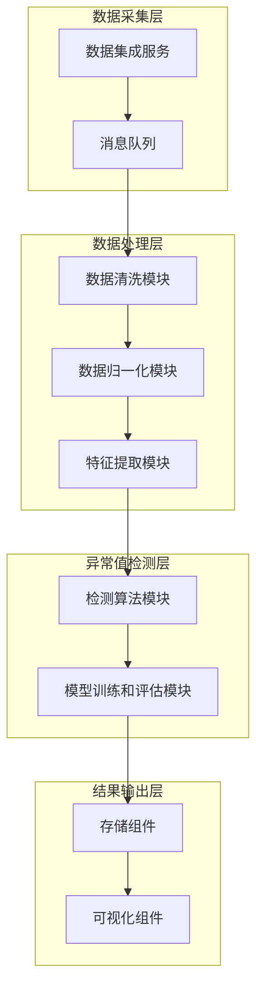
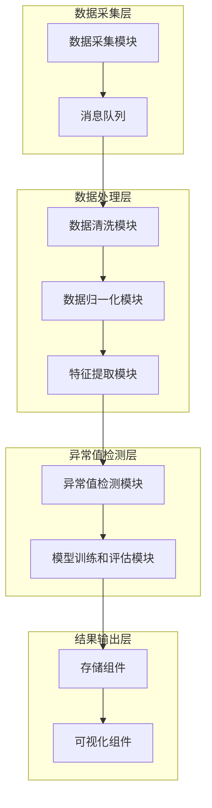

                 

### 摘要
----------------------------------------------------------------
本篇文章旨在深入探讨金融数据异常值检测与处理平台的构建，详细分析了异常值检测在金融数据中的重要性、核心概念、相关技术以及平台实现。首先，我们介绍了异常值检测的定义、类型以及其在金融数据分析中的挑战和目标。接着，本文详细阐述了常见的技术方法，包括统计方法、规则基方法、聚类方法和神经网络方法等，并对比了各类方法的优缺点。随后，文章讨论了评估异常检测效果的指标，如准确率、精确率、召回率和F1分数，并介绍了处理数据不平衡的技巧。本文的重点在于金融数据异常值检测与处理平台的实现，包括系统架构、功能模块设计、数据处理流程以及数据安全和隐私保护。最后，文章通过实际案例展示了平台的运作流程，并提出了最佳实践和建议，为金融领域的异常值检测提供了全面的技术参考。通过本篇文章，读者将全面了解金融数据异常值检测的理论基础和实战应用，提升对金融数据异常检测与处理的认知。

### 引言
----------------------------------------------------------------
在金融领域，数据是决策的基石。金融数据不仅包括交易记录、市场数据，还涵盖了来自金融机构的内部数据。这些数据的质量和准确性直接影响到金融分析的可靠性和决策的有效性。然而，金融数据中不可避免地会出现异常值，这些异常值可能源于数据采集错误、传输错误或数据本身的随机性。异常值不仅会干扰模型的训练，还可能导致错误的决策，从而带来重大的经济损失。因此，如何有效地检测和处理金融数据中的异常值，成为金融数据分析中至关重要的一环。

异常值检测，也称为离群检测，是指在大量数据中识别出与大多数数据点不同的数据点。在金融数据中，异常值可能表现为异常的交易行为、异常的市场波动或异常的用户行为。这些异常值不仅反映了金融市场的异常情况，还可能揭示了潜在的风险和机会。因此，异常值检测在金融数据分析中的应用非常广泛，包括风险管理、欺诈检测、市场预测和用户行为分析等。

本文将围绕金融数据异常值检测与处理平台进行深入探讨。首先，我们将介绍异常值检测的基本概念，包括异常值的定义、类型和常见的检测方法。接着，我们将讨论数据预处理在异常值检测中的重要性，包括数据清洗、归一化和数据质量评估。然后，本文将详细分析金融数据异常值检测平台的设计和实现，包括系统架构、功能模块和数据流。此外，我们还将介绍评估异常检测效果的指标，如准确率、精确率、召回率和F1分数，并探讨处理数据不平衡的方法。最后，我们将通过实际案例展示平台的运作流程，并提供最佳实践和总结，为金融领域的异常值检测提供全面的技术指导。

通过本文的阅读，读者将全面了解金融数据异常值检测的理论基础和实践应用，掌握设计并实现一个高效、可靠的异常值检测平台的方法和技巧。

### 背景与核心概念
----------------------------------------------------------------
#### 异常值检测的定义
异常值检测（Anomaly Detection），又称为离群检测，是指在大量数据中识别出与大多数数据点不同的数据点。这些数据点在统计学上表现为离群或异常行为，可能是由于数据采集错误、数据传输错误、噪声干扰或者真正的异常事件所引起。在金融领域，异常值检测的主要目标是从大量的金融数据中识别出异常的交易、市场波动或其他金融活动，以发现潜在的风险和机会。

#### 异常值的类型
在金融数据中，异常值可以分为以下几类：

1. **孤立点（Outliers）**：这是最常见的异常值类型，表现为在某个维度上远高于或低于其他数据点。例如，在交易数据中，某个交易价格远高于或低于正常价格范围。

2. **孤立群（Outlier Clusters）**：在某些情况下，异常值可能不是单个数据点，而是形成一个小的数据集群。这些孤立群可能表示某个特定事件或行为模式，例如，某个时间段内的一组异常交易。

3. **噪声（Noise）**：噪声是指那些由于数据采集、传输或存储过程中引入的随机性错误。噪声通常表现为随机分布的数据点，与真实的异常值有所不同。

4. **概念漂移（Concept Drift）**：概念漂移是指随着时间推移，数据分布发生显著变化，导致原有的模型不再适用于当前数据。在金融领域，市场环境的变化可能导致数据分布的显著变化，从而产生新的异常值。

#### 异常值检测的挑战
在金融数据中实施异常值检测面临以下几个挑战：

1. **数据多样性**：金融数据来源广泛，包括交易数据、市场数据、用户行为数据等，数据类型和结构复杂多样。

2. **数据质量**：金融数据可能存在缺失、重复、噪声和错误，这些数据质量问题会影响异常值检测的准确性。

3. **实时性**：金融市场的变化迅速，实时检测异常值对于风险管理和决策至关重要。

4. **数据不平衡**：在金融数据中，正常数据与异常数据的比例可能严重失衡，这给异常值检测带来了挑战。

5. **隐私保护**：金融数据涉及敏感信息，如何在保障数据隐私的同时进行异常值检测是另一个重要问题。

#### 异常值检测的目标
异常值检测在金融数据中的应用目标主要包括：

1. **风险管理**：通过识别异常交易、市场波动等，提前发现潜在风险，采取相应的风险控制措施。

2. **欺诈检测**：在金融交易中，欺诈行为通常表现为异常交易模式，通过异常值检测可以有效地识别和防范欺诈行为。

3. **市场分析**：异常值可能反映了市场中的异常情况或重大事件，通过分析这些异常值可以更好地理解市场动态。

4. **用户行为分析**：异常值可以揭示用户的异常行为或潜在需求，有助于金融机构提供个性化的服务和产品。

5. **合规性检查**：通过检测和监控异常值，确保金融活动符合相关法规和合规要求。

#### 异常值检测的应用场景
在金融领域，异常值检测的应用场景非常广泛，包括但不限于：

1. **交易监控**：实时监控交易数据，识别异常交易行为，防范欺诈和操纵市场行为。

2. **市场监控**：分析市场数据，识别异常的市场波动，预警潜在的市场风险。

3. **用户行为分析**：分析用户行为数据，识别异常的用户行为，优化用户体验和服务。

4. **信用评分**：通过检测信用数据中的异常值，更准确地评估信用风险。

5. **反洗钱（AML）**：通过检测交易数据中的异常值，识别和防范洗钱行为。

#### 异常值检测与数据预处理的联系
异常值检测与数据预处理紧密相关。良好的数据预处理是进行有效异常值检测的基础。具体包括：

1. **数据清洗**：去除重复数据、缺失值填充、噪声处理等，提高数据质量。

2. **数据归一化**：将不同量纲的数据进行归一化处理，使数据在同一尺度上，便于后续分析。

3. **数据质量评估**：评估数据的完整性和一致性，确保数据的质量。

4. **特征选择**：选择对异常值检测有帮助的特征，提高检测的效率和准确性。

通过深入理解异常值检测的定义、类型、挑战和应用目标，我们可以更好地设计并实现一个高效、可靠的金融数据异常值检测平台。接下来，本文将详细探讨异常值检测的相关技术和方法。

### 常见技术方法
----------------------------------------------------------------
异常值检测在金融数据中的应用涉及多种技术方法，每种方法都有其独特的原理、优缺点以及适用的场景。以下是几种常见的技术方法：

#### 统计方法
统计方法是最早也是最基础的异常值检测技术之一。其原理是基于统计学中的分布特性，通过计算数据点与数据集整体特性的偏差程度来识别异常值。

**原理**：
统计方法通常使用以下指标来评估数据点的异常程度：
- **均值和标准差**：计算数据点的均值和标准差，如果一个数据点的值远超出均值加（或减去）k倍标准差的范围，则认为该数据点为异常值。
- **箱线图（Box Plot）**：通过绘制数据点的箱线图，识别出位于上下四分位数之外的数据点作为异常值。

**优缺点**：
- **优点**：简单易懂，易于实现，适用于多维数据。
- **缺点**：对于分布非正态或数据量较大的情况，效果较差；对异常值的定义较为固定，无法灵活调整。

**适用场景**：
统计方法适用于数据分布较为均匀、数据量较小的场景，例如初步筛选异常值。

#### 规则基方法
规则基方法是基于预设的规则或模式来识别异常值。这些规则可以是基于专家经验或历史数据分析得出的。

**原理**：
- **阈值规则**：设置一个阈值，如果一个数据点的值超过阈值，则认为该数据点为异常值。
- **模糊规则**：使用模糊逻辑来定义规则的阈值，更加灵活地处理复杂的数据。

**优缺点**：
- **优点**：实现简单，易于理解和解释，适用于简单、明确的数据异常情况。
- **缺点**：对于复杂、动态变化的异常值，效果不佳；需要大量规则定义，可能导致规则冲突。

**适用场景**：
规则基方法适用于规则明确、数据量较小的场景，例如交易监控和初步欺诈检测。

#### 聚类方法
聚类方法是基于数据点的相似度进行分类，识别出异常点。常见的聚类算法包括K-means、DBSCAN等。

**原理**：
- **K-means**：通过迭代计算聚类中心，将数据点分配到不同的聚类中，距离聚类中心较远的点被认为是异常值。
- **DBSCAN**：基于密度连接性，识别出高密度区域，并将边界点或低密度区域视为异常值。

**优缺点**：
- **优点**：能够处理高维数据，自动发现数据结构，对于复杂异常值的检测效果较好。
- **缺点**：对于初始聚类中心的选取敏感，可能陷入局部最优；对于数据量较大的场景，计算复杂度较高。

**适用场景**：
聚类方法适用于结构复杂的金融数据，特别是高维数据，例如市场数据分析。

#### 神经网络方法
神经网络方法，特别是深度学习模型，在异常值检测中显示出强大的能力。这些方法通过学习数据模式来自动识别异常值。

**原理**：
- **自编码器（Autoencoder）**：自编码器是一种特殊的神经网络，它通过学习输入数据的编码表示来识别异常值。异常值通常无法通过自编码器重构。
- **生成对抗网络（GAN）**：GAN通过对抗性训练来生成与真实数据分布相似的假数据，异常值会与真实数据分布有显著差异。

**优缺点**：
- **优点**：能够自动学习数据的高层次特征，适用于复杂、非线性数据；对于异常值的检测和解释能力强。
- **缺点**：需要大量的数据训练，训练时间较长；模型复杂，难以解释。

**适用场景**：
神经网络方法适用于数据量大、结构复杂的场景，特别是当数据包含非线性关系时，例如用户行为分析和市场预测。

#### 集成方法
集成方法是将多种方法结合起来，以提高异常值检测的准确性和鲁棒性。常见的集成方法包括Bagging、Boosting等。

**原理**：
- **Bagging**：通过训练多个模型，并取它们的平均值或多数投票来做出最终的预测。
- **Boosting**：通过训练多个模型，每次训练都专注于纠正前一次训练的错误，逐步提升模型的总体性能。

**优缺点**：
- **优点**：结合了多种方法的优点，能够提高检测的准确性和鲁棒性；可以处理不同类型的数据和异常值。
- **缺点**：实现复杂，需要大量计算资源；对于数据不平衡的问题，集成方法的效果可能有限。

**适用场景**：
集成方法适用于需要综合多种方法和提高检测性能的场景，例如复杂的金融数据分析。

通过以上对异常值检测常见技术的介绍，我们可以看到每种方法都有其独特的优势和局限性。在实际应用中，根据数据的特性和需求选择合适的方法组合，是提高异常值检测效果的关键。接下来，我们将进一步探讨这些方法在金融数据异常值检测中的应用和实现。

### 评估指标
----------------------------------------------------------------
在金融数据异常值检测中，评估指标的选取和计算至关重要，它们能够衡量检测算法的性能和可靠性。以下是几种常见的评估指标及其计算方法：

#### 准确率（Accuracy）
准确率是检测算法正确识别正常和异常数据点的比例，计算公式如下：
$$
\text{Accuracy} = \frac{\text{正确识别的正常数据点数} + \text{正确识别的异常数据点数}}{\text{所有数据点总数}}
$$
准确率简单直观，但仅适用于数据均衡的情况。在金融数据中，正常数据与异常数据的比例可能极不平衡，因此准确率可能无法全面反映检测算法的性能。

#### 精确率（Precision）
精确率是指检测出的异常数据点中真正异常点的比例，计算公式如下：
$$
\text{Precision} = \frac{\text{正确识别的异常数据点数}}{\text{检测出的异常数据点总数}}
$$
精确率高意味着检测算法能够正确识别出异常数据点，误报较少。

#### 召回率（Recall）
召回率是指检测算法能够识别出的异常数据点占实际异常数据点的比例，计算公式如下：
$$
\text{Recall} = \frac{\text{正确识别的异常数据点数}}{\text{实际异常数据点总数}}
$$
召回率高表示算法能够捕获大多数真实的异常数据点，但可能伴随着较高的误报率。

#### F1分数（F1 Score）
F1分数是精确率和召回率的调和平均，计算公式如下：
$$
\text{F1 Score} = 2 \times \frac{\text{Precision} \times \text{Recall}}{\text{Precision} + \text{Recall}}
$$
F1分数能够综合考虑精确率和召回率，是评估异常值检测性能的重要指标。

#### 假正率（False Positive Rate，FPR）
假正率是指检测出的正常数据点中误报为异常点的比例，计算公式如下：
$$
\text{FPR} = \frac{\text{误报的异常数据点数}}{\text{实际正常数据点总数}}
$$
FPR越低，说明算法的误报率越低，数据质量越高。

#### 真正率（True Positive Rate，TPR）
真正率是指检测出的异常数据点中真正异常点的比例，即召回率，计算公式如下：
$$
\text{TPR} = \frac{\text{正确识别的异常数据点数}}{\text{实际异常数据点总数}}
$$
TPR越高，说明算法能够更有效地捕获异常数据点。

#### 假负率（False Negative Rate，FNR）
假负率是指实际异常数据点中被误判为正常点的比例，计算公式如下：
$$
\text{FNR} = \frac{\text{漏报的异常数据点数}}{\text{实际异常数据点总数}}
$$
FNR越低，说明算法能够更准确地捕获所有异常数据点。

#### 受害者错误率（Receiver Operating Characteristic，ROC）
ROC曲线是通过改变阈值来绘制真正率和假正率的关系曲线，其下的面积（AUC）用于评估检测算法的整体性能。AUC值越接近1，说明算法性能越好。

#### 精确率-召回率曲线（Precision-Recall Curve）
精确率-召回率曲线通过改变阈值来绘制精确率和召回率的关系，能够更全面地评估检测算法在不同阈值下的性能。

在金融数据异常值检测中，这些评估指标可以帮助我们：
- 了解算法在不同情况下的表现。
- 调整阈值以优化检测性能。
- 对比不同算法的优劣。

例如，在反欺诈系统中，精确率和召回率可能更为重要，因为漏报（假负率）可能导致潜在欺诈行为未被发现，而误报（假正率）可能引起客户不满。而市场分析中，F1分数可能是一个更全面的评估指标。

通过合理选择和计算这些评估指标，我们可以更准确地评估和优化金融数据异常值检测算法，确保其能够在实际应用中提供有效和可靠的结果。

### 数据预处理
----------------------------------------------------------------
在金融数据异常值检测中，数据预处理是至关重要的一步，它直接影响异常值检测的准确性和效果。有效的数据预处理不仅能够提高异常值检测的性能，还能减少噪声和错误数据对检测结果的干扰。以下是一些常见的数据预处理方法：

#### 数据清洗
数据清洗是数据预处理的第一步，旨在去除数据中的重复值、缺失值和错误值。这些不完整或不准确的数据会影响后续的分析和检测过程。

**方法**：
1. **重复值检测与删除**：使用唯一的标识符（如交易ID）来检测和删除重复的数据记录。
2. **缺失值填充**：根据数据的特点和上下文，使用均值、中位数、插值法或模式匹配等方法填充缺失值。
3. **错误值修正**：通过数据验证规则和逻辑一致性检查，识别并修正明显的错误数据。

#### 数据归一化
数据归一化是将不同量纲的数据转换为同一尺度，使得数据在同一范围内进行比较。这对于许多机器学习算法尤为重要，因为它们对数据量纲的敏感性较高。

**方法**：
1. **最小-最大归一化**：将数据缩放到[0, 1]之间，公式如下：
$$
x_{\text{norm}} = \frac{x - x_{\text{min}}}{x_{\text{max}} - x_{\text{min}}}
$$
2. **零-均值归一化**：将数据缩放到具有零均值和单位方差的范围内，公式如下：
$$
x_{\text{norm}} = \frac{x - \mu}{\sigma}
$$
其中，$\mu$ 是数据的均值，$\sigma$ 是数据的标准差。

#### 特征选择
特征选择是从原始数据中提取对异常值检测最有用的特征。这有助于减少数据的维度，提高检测的效率和准确性。

**方法**：
1. **信息增益**：选择能够最大化分类信息的特征。
2. **主成分分析（PCA）**：通过降维技术，提取数据的主要成分，保留重要信息。
3. **互信息**：计算特征与异常值之间的互信息，选择互信息较高的特征。

#### 数据质量评估
数据质量评估是确保数据在异常值检测中可用性和准确性的重要步骤。通过评估数据的完整性、一致性和准确性，可以及时发现和处理数据问题。

**方法**：
1. **完整性检查**：检测数据中的缺失值和重复值。
2. **一致性检查**：验证数据字段的一致性和逻辑关系。
3. **准确性检查**：通过样本验证、对比历史数据和业务规则，评估数据的准确性。

通过上述数据预处理方法，我们可以显著提高金融数据异常值检测的准确性和可靠性。有效的数据清洗可以去除噪声和错误，数据归一化可以统一数据量纲，特征选择可以提取关键信息，数据质量评估可以确保数据的有效性。这些步骤相互关联，共同构建了一个完整的数据预处理流程，为后续的异常值检测奠定了坚实的基础。

### 平台架构设计
----------------------------------------------------------------
金融数据异常值检测与处理平台是一个复杂系统，需要综合考虑数据采集、数据处理、异常值检测以及结果输出等多个方面。为了确保平台的稳定性和高效性，我们采用了分布式架构设计，并引入了多种技术组件和工具。

#### 系统架构概述
该平台的系统架构可以分为以下几层：

1. **数据采集层**：负责从各种数据源（如数据库、API接口、文件系统等）收集原始数据。
2. **数据处理层**：进行数据的预处理、清洗、归一化和特征提取等操作。
3. **异常值检测层**：应用各种算法和技术进行异常值检测，包括统计方法、机器学习方法等。
4. **结果输出层**：将检测结果存储到数据库或数据仓库中，并通过可视化工具进行展示。

#### 系统架构组件
以下是系统架构中关键组件及其功能：

1. **数据采集组件**：
   - **数据集成服务**：负责从不同数据源采集数据，包括数据库连接、API调用和文件解析。
   - **消息队列**：用于异步处理数据，确保数据采集的可靠性和扩展性。

2. **数据处理组件**：
   - **数据清洗模块**：进行重复值删除、缺失值填充和错误值修正。
   - **数据归一化模块**：将不同量纲的数据统一到同一尺度。
   - **特征提取模块**：提取对异常值检测有用的特征。

3. **异常值检测组件**：
   - **检测算法模块**：包括统计方法、规则基方法、聚类方法和神经网络方法等，根据具体需求选择合适的算法。
   - **模型训练和评估模块**：使用训练数据训练检测模型，并通过验证数据评估模型的性能。

4. **结果输出组件**：
   - **存储组件**：将检测结果存储到数据库或数据仓库中，便于后续分析和查询。
   - **可视化组件**：通过图表、报表等展示检测结果，便于用户理解和决策。

#### 技术选型
在平台的设计过程中，我们选择了以下技术组件和工具：

1. **数据采集**：
   - 使用Apache Kafka进行数据采集和消息队列管理，确保数据的实时性和可靠性。

2. **数据处理**：
   - 使用Apache Spark进行大规模数据处理，包括数据清洗、归一化和特征提取。

3. **异常值检测**：
   - 采用Python的scikit-learn库实现统计方法和机器学习算法。
   - 使用TensorFlow和Keras实现神经网络方法。

4. **结果输出**：
   - 使用Apache HBase或Apache Hive进行数据存储。
   - 使用ECharts或Tableau进行数据可视化。

#### 系统架构图
为了更直观地理解系统架构，以下是一个简化的系统架构图：

通过上述架构设计和技术选型，金融数据异常值检测与处理平台能够高效、可靠地运行，为金融数据分析提供强有力的支持。接下来，我们将详细介绍平台的功能模块设计。

### 功能模块设计
----------------------------------------------------------------
金融数据异常值检测与处理平台由多个功能模块组成，每个模块都有特定的职责和交互方式，共同构成了一个完整的系统。以下是该平台的主要功能模块及其设计：

#### 模块1：数据采集模块
**职责**：负责从各种数据源（如数据库、API接口、文件系统等）收集原始数据。

**交互方式**：
- 通过API接口与外部系统进行数据同步。
- 使用数据库连接器从数据库中读取数据。
- 文件解析器处理导入的文件数据。

**实现细节**：
- 采用Apache Kafka作为消息队列，确保数据采集的实时性和可靠性。
- 设计一个数据采集调度器，定期从数据源采集数据并放入消息队列。

#### 模块2：数据预处理模块
**职责**：进行数据的清洗、归一化和特征提取等操作，为异常值检测准备高质量的数据。

**交互方式**：
- 接收来自数据采集模块的原始数据。
- 将预处理后的数据传递给异常值检测模块。

**实现细节**：
- **数据清洗模块**：使用Python的pandas库进行重复值删除、缺失值填充和错误值修正。
- **数据归一化模块**：使用最小-最大归一化或零-均值归一化将数据统一到同一尺度。
- **特征提取模块**：提取对异常值检测有帮助的特征，如使用主成分分析（PCA）进行降维。

#### 模块3：异常值检测模块
**职责**：应用各种算法和技术进行异常值检测，识别出金融数据中的异常值。

**交互方式**：
- 接收预处理后的数据。
- 将检测到的异常值传递给结果输出模块。

**实现细节**：
- **统计方法**：使用均值和标准差、箱线图等方法进行初步检测。
- **机器学习方法**：使用K-means、DBSCAN等聚类算法以及神经网络模型进行深度学习检测。
- **集成方法**：结合多种算法进行综合检测，提高检测的准确性和鲁棒性。

#### 模块4：结果输出模块
**职责**：将检测结果存储到数据库或数据仓库中，并通过可视化工具进行展示。

**交互方式**：
- 接收来自异常值检测模块的检测结果。
- 与数据存储组件和可视化组件进行交互。

**实现细节**：
- **数据存储组件**：使用Apache HBase或Apache Hive进行数据存储。
- **可视化组件**：使用ECharts或Tableau进行数据可视化，提供直观的异常值展示。

#### 模块5：监控与管理模块
**职责**：监控系统性能，管理异常值检测流程，确保平台稳定运行。

**交互方式**：
- 与其他模块进行实时交互，监控数据流和系统状态。
- 提供用户界面，方便用户进行监控和操作。

**实现细节**：
- **监控系统**：使用Prometheus和Grafana进行实时监控。
- **管理界面**：使用Django或Flask构建Web界面，提供用户操作和监控功能。

#### 模块6：告警与通知模块
**职责**：当检测到异常值时，自动发送告警通知，确保及时发现和处理异常情况。

**交互方式**：
- 与异常值检测模块和用户界面进行交互。
- 通过邮件、短信或其他通知渠道发送告警。

**实现细节**：
- **告警规则**：定义异常值检测的告警规则，如检测到大量异常交易时发送告警。
- **通知渠道**：支持多种通知渠道，如邮件、短信、企业微信等。

通过以上功能模块的设计和实现，金融数据异常值检测与处理平台能够高效、稳定地运行，为金融数据分析提供强有力的支持。接下来，我们将详细描述平台的数据处理流程。

### 数据处理流程
----------------------------------------------------------------
金融数据异常值检测与处理平台的数据处理流程是整个系统运行的核心，其目的是从原始数据中提取有效信息，为异常值检测提供高质量的输入。以下是平台的数据处理流程详细说明：

#### 数据采集
平台首先从各种数据源收集原始数据，这些数据源可能包括数据库、API接口、文件系统等。为了确保数据的完整性和一致性，数据采集模块采用以下步骤：

1. **数据同步**：通过API接口与外部系统进行数据同步，确保实时获取最新的数据。
2. **数据库连接**：使用数据库连接器从数据库中读取数据，包括交易记录、市场数据等。
3. **文件解析**：从文件系统中读取数据文件，如CSV、JSON等，进行解析和处理。

#### 数据预处理
在获取到原始数据后，平台对数据进行预处理，以确保数据质量，为后续的异常值检测做好准备。预处理步骤如下：

1. **数据清洗**：
   - **重复值删除**：使用唯一的标识符（如交易ID）检测和删除重复的数据记录。
   - **缺失值填充**：根据数据的特点和上下文，使用均值、中位数或插值法填充缺失值。
   - **错误值修正**：通过数据验证规则和逻辑一致性检查，识别并修正明显的错误数据。

2. **数据归一化**：
   - **量纲转换**：将不同量纲的数据转换为同一尺度，如将交易金额转换为数值范围[0, 1]。
   - **零-均值归一化**：对于连续数据，使用零-均值归一化方法，将数据缩放到具有零均值和单位方差的范围内。

3. **特征提取**：
   - **统计特征**：计算数据的统计特征，如均值、标准差、变异系数等，作为异常值检测的输入。
   - **时间序列特征**：提取时间序列特征，如交易频率、交易时间间隔等，用于分析交易行为的周期性和模式。
   - **空间特征**：对于涉及地理位置的交易数据，提取地理位置特征，如经纬度、区域分类等。

#### 异常值检测
经过预处理后，平台应用各种异常值检测算法对数据进行分析，以识别出金融数据中的异常值。以下是一些常用的异常值检测算法：

1. **统计方法**：
   - **均值和标准差法**：使用均值和标准差来识别离群数据点，如果一个数据点的值超过k倍标准差，则认为它是异常值。
   - **箱线图法**：通过箱线图识别出位于上下四分位数之外的数据点作为异常值。

2. **机器学习方法**：
   - **K-means聚类**：将数据点分为K个簇，距离聚类中心较远的点被视为异常值。
   - **DBSCAN**：基于密度的空间聚类方法，识别出高密度区域和边界点作为异常值。
   - **自编码器**：使用自编码器学习数据的编码表示，无法重构的数据点被视为异常值。

3. **神经网络方法**：
   - **生成对抗网络（GAN）**：通过对抗训练生成与真实数据分布相似的假数据，异常值会与真实数据分布有显著差异。
   - **卷积神经网络（CNN）**：对于图像数据，使用卷积神经网络进行特征提取和异常值检测。

#### 结果输出
检测到的异常值会被存储到数据库或数据仓库中，以便后续的分析和查询。同时，平台会通过可视化工具展示检测结果，包括异常值分布、趋势图等，以便用户直观地了解异常情况。以下是一些具体实现步骤：

1. **数据存储**：
   - 使用Apache HBase或Apache Hive进行数据存储，确保数据的高可用性和扩展性。
   - 设计合理的表结构和索引，优化查询性能。

2. **数据展示**：
   - 使用ECharts或Tableau进行数据可视化，提供图表、报表等展示形式。
   - 设计用户友好的界面，方便用户自定义展示选项。

3. **告警通知**：
   - 当检测到大量异常值时，自动发送告警通知到相关人员的邮件、短信或企业微信，确保及时发现和处理异常情况。

通过以上数据处理流程，金融数据异常值检测与处理平台能够高效、准确地完成从数据采集、预处理、异常值检测到结果输出的全过程，为金融数据分析提供了强有力的技术支持。接下来，我们将通过一个实际案例来展示平台的具体实现和应用。

### 实际案例解析
----------------------------------------------------------------
为了更好地展示金融数据异常值检测与处理平台的具体实现和应用，我们通过一个实际案例来详细分析。这个案例涉及一家大型金融机构，其主要目标是利用平台检测并处理交易数据中的异常值，以防范潜在的欺诈行为。

#### 项目介绍
该金融机构拥有大量的交易数据，包括信用卡交易、网上银行交易等。这些数据每天都会产生数百万条记录。为了确保交易的安全性和合规性，金融机构需要一个高效的异常值检测系统，能够实时监控交易行为，识别并处理潜在的欺诈交易。

#### 系统功能设计
为了满足上述需求，该平台设计了以下几个关键功能模块：

1. **数据采集模块**：负责从金融机构的各种数据源（如数据库、API接口、文件系统等）收集交易数据。
2. **数据预处理模块**：对采集到的交易数据进行清洗、归一化和特征提取，为异常值检测做准备。
3. **异常值检测模块**：应用统计方法和机器学习方法对预处理后的交易数据进行分析，识别出潜在的欺诈交易。
4. **结果输出模块**：将检测到的异常值存储到数据库中，并通过可视化工具展示给相关人员。

#### 系统架构设计
以下是该金融数据异常值检测与处理平台的架构设计：

#### 数据采集
金融机构使用Apache Kafka作为消息队列，实时收集交易数据。数据采集模块从多个数据源（如数据库、API接口、文件系统等）获取交易数据，并将数据发送到消息队列中。

#### 数据预处理
数据采集模块将原始交易数据发送到数据清洗模块。在这个模块中，使用Python的pandas库对交易数据进行清洗，包括删除重复记录、填充缺失值和修正错误数据。接下来，数据归一化模块将交易金额、交易时间等特征进行归一化处理，统一数据量纲。最后，特征提取模块提取出对异常值检测有用的特征，如交易金额的绝对值、交易时间间隔、交易频率等。

#### 异常值检测
经过预处理的数据被传递给异常值检测模块。在这个模块中，首先使用统计方法（如均值和标准差法、箱线图法）对交易数据进行分析，识别出初步的异常交易。然后，利用机器学习方法（如K-means聚类、DBSCAN、自编码器）进行深度学习检测，进一步提高异常值检测的准确性和鲁棒性。

#### 结果输出
检测到的异常值被存储到Apache HBase中，以便后续的分析和查询。同时，使用ECharts和Tableau对异常值进行可视化展示，为相关人员提供直观的异常交易分布和趋势。

#### 项目小结
通过该实际案例，我们可以看到金融数据异常值检测与处理平台在实际应用中的有效性。该平台能够实时监控交易行为，准确识别潜在的欺诈交易，为金融机构提供了强有力的风险控制和合规性保障。接下来，我们将总结最佳实践和注意事项。

### 最佳实践与注意事项
----------------------------------------------------------------
在设计和实施金融数据异常值检测与处理平台的过程中，总结一些最佳实践和注意事项是至关重要的。这些经验和建议将有助于确保平台的高效、稳定和可靠运行。

#### 最佳实践
1. **数据质量保障**：数据是异常值检测的基础，因此确保数据质量至关重要。在数据采集、预处理和存储过程中，实施严格的数据验证和清洗规则，确保数据的完整性、一致性和准确性。

2. **选择合适的算法**：根据具体应用场景和数据特点，选择最适合的异常值检测算法。对于结构简单、数据量较小的场景，可以使用统计方法；对于复杂、高维数据的场景，机器学习算法和深度学习方法可能更为有效。

3. **实时性和扩展性**：金融数据异常值检测需要实时性和高扩展性。采用分布式架构和消息队列技术，如Apache Kafka，可以提高系统的吞吐量和响应速度，确保实时处理大量数据。

4. **自定义告警机制**：根据实际需求，设计灵活的告警机制，包括阈值设置、通知渠道和告警规则。确保在检测到异常值时，能够及时通知相关人员进行处理。

5. **持续监控与优化**：平台上线后，需要持续监控其性能和效果，定期进行性能优化和模型更新。根据实际反馈，调整检测策略和算法参数，提高异常值检测的准确性和可靠性。

6. **用户友好界面**：设计直观、用户友好的界面，使相关人员能够轻松地访问和使用平台功能。提供数据可视化工具，便于用户理解和分析异常值检测结果。

#### 注意事项
1. **数据隐私保护**：金融数据通常涉及敏感信息，因此在设计平台时，必须严格遵守数据隐私保护法规。确保在数据处理和存储过程中，采取有效的加密和访问控制措施。

2. **处理数据不平衡**：在金融数据中，正常数据和异常数据可能存在显著不平衡。在这种情况下，需要采用相应的数据增强技术和模型调整策略，以提高异常值检测的公平性和准确性。

3. **避免过拟合**：在机器学习模型训练过程中，应避免过拟合现象。通过交叉验证和模型评估，选择合适的模型复杂度和参数设置，确保模型具有良好的泛化能力。

4. **监控系统性能**：实时监控系统性能，包括响应时间、吞吐量和资源利用率。及时发现和解决性能瓶颈，确保平台稳定运行。

5. **合规性检查**：确保平台的设计和实施符合相关法规和合规要求。定期进行合规性检查，确保平台在金融监管环境下合法合规运行。

通过遵循上述最佳实践和注意事项，我们可以设计并实现一个高效、可靠和合规的金融数据异常值检测与处理平台，为金融机构的风险管理和决策提供强有力的支持。

### 总结与展望
----------------------------------------------------------------
本文通过深入探讨金融数据异常值检测与处理平台的设计与实现，系统地介绍了异常值检测的定义、类型、常见技术方法、评估指标、数据预处理、系统架构设计、功能模块设计以及实际应用案例。从背景介绍到具体实现，本文全面阐述了金融数据异常值检测的重要性和挑战，并通过实际案例展示了平台在实际应用中的效果。

金融数据异常值检测是一个复杂且关键的任务，它不仅能够帮助金融机构防范欺诈行为、识别市场风险，还能够优化用户服务、提高数据分析和决策的准确性。通过本文的研究，我们可以看到，一个高效、可靠的异常值检测平台需要综合考虑数据质量、算法选择、系统架构设计以及用户体验等多个方面。

在未来的研究方向上，有几个方向值得深入探讨：

1. **数据隐私保护**：随着数据隐私保护法规的日益严格，如何在保障数据隐私的同时进行有效的异常值检测成为一个重要的研究课题。可以探索基于差分隐私或联邦学习等技术的异常值检测方法。

2. **实时异常值检测**：随着金融市场和数据量的迅速增长，实时异常值检测变得越来越重要。可以研究适用于实时环境的高效异常值检测算法和系统架构。

3. **深度学习方法**：深度学习在异常值检测中显示出强大的能力，但当前的方法主要适用于结构化数据。如何将深度学习方法应用于非结构化金融数据（如图像、文本等）是一个具有挑战性的研究方向。

4. **动态异常值检测**：金融市场的动态变化导致数据分布可能发生显著变化，传统的静态异常值检测方法可能不再适用。研究动态异常值检测方法，能够更好地适应数据分布的变化，提高检测的准确性。

总之，金融数据异常值检测与处理是一个持续发展的领域，未来还将面临许多新的挑战和机遇。通过不断的研究和实践，我们有望设计出更加高效、智能和可靠的异常值检测平台，为金融行业的稳健发展提供有力支持。

### 附录与拓展阅读
----------------------------------------------------------------
为了帮助读者更深入地了解金融数据异常值检测与处理的相关知识和实践，以下列出了一些关键参考文献和推荐书籍：

#### 关键参考文献
1. **Munir, A., & Cao, P. (2004). "Outlier Detection Using ANOVA and Nearest Neighbor Classification."**
   - 提供了基于ANOVA和KNN的离群点检测方法。
2. **Liu, H., & Goldstein, M. (2013). "Unsupervised Anomaly Detection using Nonparametric Correlation Clustering."**
   - 介绍了基于非参数相关聚类的无监督异常值检测方法。
3. **Huang, J., & Varma, M. (2017). "Kernel Density Estimation for Anomaly Detection."**
   - 探讨了核密度估计在异常值检测中的应用。

#### 推荐书籍
1. **"Anomaly Detection for Machine Learning" by M. Bacher**
   - 详细介绍了各种异常值检测算法及其在机器学习中的应用。
2. **"Anomaly Detection: A Machine Learning Perspective" by Francisco R. Coelho**
   - 提供了全面的理论基础和实践指南，涵盖了多种异常值检测技术。
3. **"Detecting Anomalies: A Practical Approach" by R. G. Chen**
   - 介绍了异常值检测在不同领域的应用，包括金融、医疗等。

#### 在线资源
1. **Kaggle（kaggle.com）**：提供丰富的金融数据集和异常值检测比赛，有助于实战练习。
2. **Coursera（coursera.org）**：多个关于机器学习和数据科学的在线课程，涵盖异常值检测相关内容。
3. **GitHub（github.com）**：许多开源项目实现了异常值检测算法，供读者参考和学习。

通过阅读这些文献和书籍，以及利用在线资源，读者可以进一步拓展对金融数据异常值检测与处理领域的理解和技能，为实际应用提供有力的支持。

