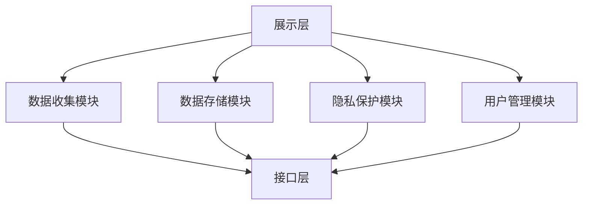
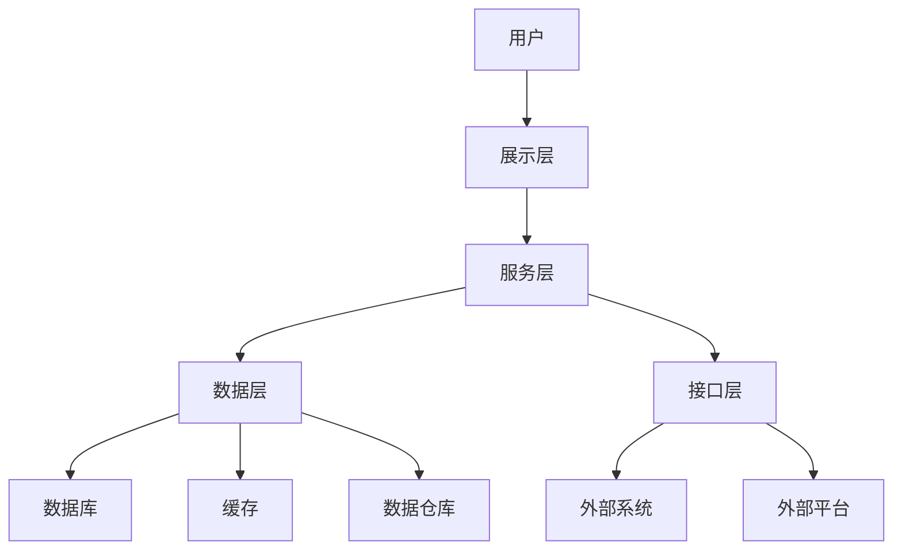
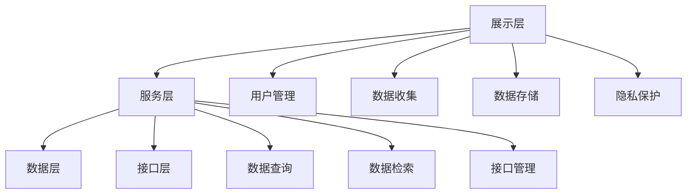
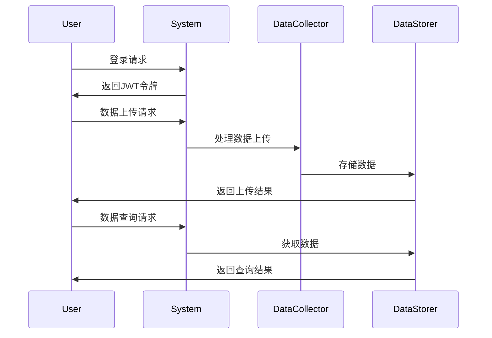
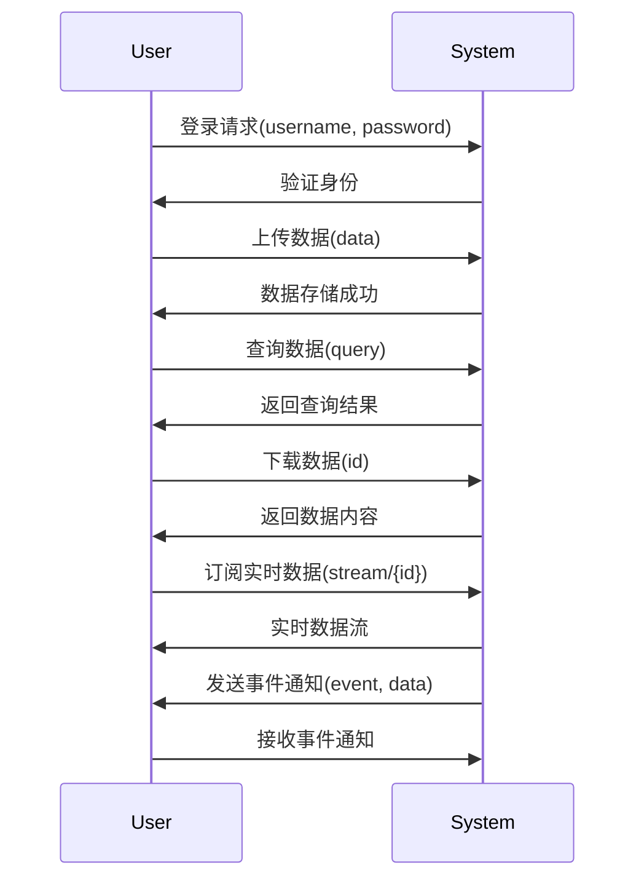

                 

### 金融数据隐私保护与共享平台设计

#### 关键词：
- 金融数据隐私保护
- 数据共享平台
- 差分隐私
- 同态加密
- 多方安全计算

#### 摘要：
本文将深入探讨金融数据隐私保护与共享平台的设计。首先，我们会介绍金融数据隐私保护的重要性，以及目前面临的问题。接着，我们会详细解析隐私保护技术的原理，如差分隐私、同态加密和多方安全计算。然后，我们将讨论共享平台的设计原则和架构，并通过实际案例展示平台的设计与实现过程。最后，我们将总结最佳实践，并探讨未来的发展方向。

### 引言

#### 1.1 问题的背景与意义

随着信息技术的飞速发展，金融行业的数据量呈现爆炸式增长。金融机构每天产生和收集大量的数据，包括交易记录、客户信息、财务报表等。这些数据不仅对金融机构自身的运营管理至关重要，还对监管机构、第三方服务提供商和投资者等外部参与者具有重要意义。

然而，金融数据的隐私保护问题日益突出。一方面，数据泄露和隐私侵犯事件频发，导致金融机构面临巨大的法律和声誉风险。另一方面，数据共享的需求不断增长，金融机构需要与监管机构、第三方服务提供商等进行数据交换，以实现监管合规和业务优化。

因此，设计一个既能够保护金融数据隐私，又能够实现数据共享的平台，成为当前金融行业面临的重大挑战。本文旨在探讨这一问题的解决方案，通过引入隐私保护技术和构建合理的数据共享平台架构，实现金融数据的安全与共享。

#### 1.2 数据隐私保护现状

目前，金融数据隐私保护面临诸多挑战。首先，数据泄露事件频发。根据国际数据公司（IDC）的报告，全球范围内的数据泄露事件在过去几年中呈现上升趋势。金融行业成为数据泄露的重灾区，原因包括黑客攻击、内部泄露、系统漏洞等。

其次，数据隐私侵犯问题日益严重。随着大数据技术和人工智能技术的发展，对个人隐私的侵犯问题愈发突出。例如，未经授权访问客户数据、滥用客户信息等行为，不仅违反了法律法规，还严重损害了金融机构的声誉。

此外，数据共享的法律法规和标准尚不完善。不同国家和地区对数据隐私保护的要求各不相同，导致金融机构在进行数据共享时面临法律风险。此外，现有的隐私保护技术和标准也在不断更新，如何有效地应对这些变化，成为金融机构需要解决的问题。

#### 1.3 数据共享面临的挑战

数据共享在金融行业中具有重要意义，但同时也面临诸多挑战。首先，数据隐私和安全问题是数据共享的核心挑战。如何在共享数据的同时确保数据隐私和安全，成为金融机构需要解决的关键问题。

其次，数据质量是数据共享的另一个挑战。共享的数据需要确保其准确性、完整性和一致性，否则将导致业务决策的偏差和错误。

此外，数据共享的技术难题也需要解决。例如，如何在保证数据隐私和安全的前提下，实现高效的数据传输和处理。现有的数据加密技术和隐私保护算法，如差分隐私、同态加密和多方安全计算等，提供了潜在解决方案，但在实际应用中仍面临性能和扩展性问题。

最后，数据共享的法律法规和标准也需要进一步明确和完善。金融机构需要在合规的前提下，制定合理的数据共享策略，以应对不同国家和地区的法律法规要求。

#### 1.4 本书的目的与结构

本书旨在为金融数据隐私保护与共享平台的设计提供系统化的解决方案。通过介绍隐私保护技术和数据共享平台的设计原则，并结合实际案例进行分析，帮助读者理解并掌握金融数据隐私保护与共享的核心技术和方法。

本书结构如下：

1. **第1章 引言**：介绍金融数据隐私保护与共享的重要性，当前存在的问题，以及本书的目的和结构。
2. **第2章 核心概念与理论**：介绍金融数据隐私保护的基本概念，包括隐私保护、数据共享、敏感数据识别等，以及与金融数据隐私保护相关的法律法规和标准。
3. **第3章 隐私保护技术**：讨论隐私保护技术的原理，如差分隐私、同态加密、多方安全计算等，并介绍相关算法和应用。
4. **第4章 共享平台设计原则**：讨论共享平台的设计原则和架构，包括系统功能、数据存储、安全通信等方面。
5. **第5章 系统设计与实现**：详细介绍共享平台的系统功能设计和架构设计，包括数据收集与存储、隐私保护与数据共享、用户管理与权限控制等。
6. **第6章 实际案例**：通过一个实际案例，展示金融数据隐私保护与共享平台的设计和实现过程。
7. **第7章 最佳实践与总结**：总结书中讨论的最佳实践，提供一些注意事项和未来发展方向。

通过本书的学习，读者将能够理解金融数据隐私保护与共享的核心技术和方法，掌握设计金融数据隐私保护与共享平台的基本原则和步骤，为实际应用提供指导。

### 核心概念与理论

#### 2.1 金融数据隐私保护基本概念

金融数据隐私保护是指保护金融数据在存储、传输和处理过程中不被未经授权的访问、使用、泄露或篡改。金融数据包括客户信息、交易记录、财务报表等，这些数据对金融机构和用户都具有重要意义。

1. **隐私保护**：隐私保护是指确保个人信息不被未经授权的访问和使用。在金融数据隐私保护中，隐私保护的目标是防止个人信息被泄露或滥用。

2. **数据共享**：数据共享是指将数据在不同实体之间进行交换和利用。在金融行业中，数据共享有助于实现业务优化、监管合规和合作创新。

3. **敏感数据识别**：敏感数据识别是指识别和分类金融数据中的敏感信息，如客户身份信息、财务信息等。敏感数据识别是金融数据隐私保护的重要基础。

#### 2.2 法律法规和标准

金融数据隐私保护涉及多个法律法规和标准。以下是一些主要的法律法规和标准：

1. **《通用数据保护条例》（GDPR）**：GDPR是欧盟制定的数据保护法规，对个人数据的收集、处理和存储提出了严格的要求。

2. **《加州消费者隐私法案》（CCPA）**：CCPA是美国加州制定的数据保护法规，旨在保护加州居民的个人信息。

3. **《金融服务隐私规则》（FPR）**：FPR是美国金融监管机构制定的数据保护规则，适用于金融机构。

4. **《网络安全法》**：网络安全法是中国制定的数据保护法律，对个人信息保护提出了明确规定。

5. **《个人信息保护法》（PIPL）**：PIPL是中国最新制定的数据保护法律，对个人信息保护提出了全面的规定。

6. **ISO/IEC 27001**：ISO/IEC 27001是国际标准化组织制定的数据保护标准，提供了数据保护管理体系的要求。

#### 2.3 隐私保护技术

隐私保护技术在金融数据隐私保护中发挥着重要作用。以下介绍几种主要的隐私保护技术：

1. **差分隐私**：差分隐私是一种用于保护数据隐私的统计方法。其核心思想是在对数据进行分析时，增加一定的噪声，使得单个数据无法被区分，从而保护数据隐私。

2. **同态加密**：同态加密是一种允许在加密数据上进行计算的技术。通过同态加密，可以在不解密数据的情况下对数据进行处理，从而保护数据隐私。

3. **多方安全计算**：多方安全计算是一种允许多个实体在安全的环境下共享和计算数据的分布式计算技术。通过多方安全计算，可以实现数据的安全共享和计算。

#### 2.4 隐私保护与数据共享的关系

隐私保护与数据共享之间存在一定的矛盾。一方面，隐私保护要求确保数据不被未经授权的访问和使用；另一方面，数据共享要求数据能够在不同实体之间进行交换和利用。因此，如何在保护隐私的同时实现数据共享，成为金融数据隐私保护的重要挑战。

1. **隐私保护优先**：在金融数据隐私保护中，隐私保护应始终放在首位。任何数据共享活动都必须确保不会对个人隐私造成侵犯。

2. **隐私保护与数据共享的平衡**：在实现数据共享时，需要找到隐私保护与数据共享之间的平衡点。例如，可以通过差分隐私、同态加密和多方安全计算等技术，在保护隐私的同时实现数据共享。

3. **隐私保护与数据安全的协同**：隐私保护和数据安全是金融数据保护的两个重要方面。隐私保护旨在防止数据泄露和滥用，而数据安全旨在防止数据被非法访问和篡改。两者需要协同工作，共同确保金融数据的安全与共享。

#### 2.5 敏感数据识别

敏感数据识别是金融数据隐私保护的重要基础。通过识别和分类敏感数据，可以针对性地进行隐私保护措施，提高数据保护的效率。

1. **敏感数据分类**：敏感数据可以根据其重要性和敏感性进行分类，如个人身份信息、财务信息、医疗信息等。

2. **敏感数据识别方法**：敏感数据识别方法包括规则匹配、机器学习、数据挖掘等。通过这些方法，可以自动识别和分类敏感数据。

3. **敏感数据保护策略**：针对不同类别的敏感数据，可以采取不同的保护策略。例如，对于个人身份信息，可以采取加密存储、访问控制等措施；对于财务信息，可以采取差分隐私、同态加密等技术进行保护。

#### 2.6 隐私保护与数据共享的法律和伦理问题

隐私保护与数据共享不仅涉及技术问题，还涉及法律和伦理问题。以下介绍一些相关的法律和伦理问题：

1. **隐私权**：隐私权是指个人对其个人信息享有的控制权。在金融数据隐私保护中，隐私权是个人最基本的权利之一。

2. **知情同意**：知情同意是指个人在数据收集、处理和共享过程中，有权知道并同意其个人信息的使用。在金融数据隐私保护中，知情同意是数据保护的重要原则。

3. **数据匿名化**：数据匿名化是指通过技术手段，将个人信息去除或不可识别，从而保护个人隐私。在金融数据隐私保护中，数据匿名化是常见的隐私保护措施。

4. **伦理责任**：金融机构在金融数据隐私保护中，不仅要遵守法律法规，还应承担伦理责任。例如，金融机构应确保数据收集和使用的透明度，尊重个人的隐私权。

#### 2.7 国际与国内隐私保护法律法规对比

国际与国内的隐私保护法律法规存在一定的差异，以下对比几种主要法律法规：

1. **GDPR**：GDPR是欧盟制定的隐私保护法律法规，对个人数据的收集、处理和存储提出了严格的要求。GDPR强调个人隐私权的保护，要求企业采取数据保护措施，并在数据泄露事件中承担通知和责任。

2. **CCPA**：CCPA是美国加州制定的隐私保护法律法规，对加州居民的个人信息保护提出了具体要求。CCPA强调个人对其个人信息的控制权，要求企业提供透明度报告，并在未经授权的情况下不得出售个人信息。

3. **FPR**：FPR是美国金融监管机构制定的隐私保护规则，适用于金融机构。FPR要求金融机构采取合理措施保护客户信息，防止信息泄露和滥用。

4. **网络安全法**：网络安全法是中国制定的隐私保护法律，对个人信息保护提出了基本要求。网络安全法强调数据安全，要求企业在数据收集、存储、传输和处理过程中采取安全措施。

5. **PIPL**：PIPL是中国最新制定的隐私保护法律，对个人信息保护提出了全面的规定。PIPL强调个人对其个人信息的控制权，要求企业采取隐私保护措施，并在数据泄露事件中承担通知和责任。

通过对比国际与国内的隐私保护法律法规，可以看出不同国家和地区对隐私保护的要求和重点有所不同。金融机构在金融数据隐私保护中，需要遵守相应的法律法规，并考虑跨区域的数据保护要求。

#### 2.8 隐私保护技术的应用与发展

隐私保护技术在金融数据隐私保护中发挥着越来越重要的作用。随着技术的不断发展和创新，隐私保护技术也在不断演变。

1. **差分隐私的应用与发展**：差分隐私技术已经广泛应用于金融数据隐私保护中。未来，随着算法的优化和性能的提升，差分隐私技术在金融领域的应用前景将更加广阔。

2. **同态加密的应用与发展**：同态加密技术在高性能计算和云计算等领域具有广泛的应用前景。随着硬件性能的提升和算法的改进，同态加密技术在金融数据隐私保护中的应用将不断深化。

3. **多方安全计算的应用与发展**：多方安全计算技术在金融数据隐私保护中具有显著优势。随着区块链技术和密码学技术的发展，多方安全计算技术在金融领域的应用将得到进一步拓展。

4. **隐私保护技术的趋势**：隐私保护技术在未来将朝着更加高效、安全、可扩展和易用的方向发展。例如，基于人工智能和机器学习的隐私保护技术，将有望实现更高的隐私保护和数据利用效率。

#### 2.9 金融数据隐私保护与共享的关键挑战

金融数据隐私保护与共享面临着诸多关键挑战。以下是一些主要挑战：

1. **隐私保护与数据利用的平衡**：如何在保护隐私的同时实现数据的有效利用，是金融数据隐私保护与共享的核心挑战。

2. **技术实现的复杂性**：隐私保护技术的实现涉及复杂的算法和系统架构，如何在保证安全性的同时实现高性能，是技术实现的关键挑战。

3. **法律法规的适应性**：随着技术的不断进步，现有的法律法规和标准可能需要不断更新和完善，以适应新的技术发展和应用场景。

4. **跨区域的数据保护**：不同国家和地区对数据隐私保护的要求存在差异，如何在跨区域的数据共享中实现合规，是金融数据隐私保护与共享的重要挑战。

5. **隐私保护意识的培养**：金融机构和用户都需要提高隐私保护意识，以共同应对金融数据隐私保护与共享的挑战。

#### 2.10 未来发展方向

金融数据隐私保护与共享在未来将朝着更加智能化、安全化和合规化的方向发展。以下是一些未来发展的方向：

1. **隐私保护技术的创新**：通过引入新的隐私保护技术，如联邦学习、区块链等，实现更高水平的隐私保护和数据利用。

2. **数据治理与合规**：加强数据治理，建立完善的数据合规管理体系，确保金融数据隐私保护与共享的合规性。

3. **跨行业合作**：加强金融行业与其他行业的合作，共同推动金融数据隐私保护与共享技术的发展和应用。

4. **用户隐私保护**：提高用户隐私保护意识，建立健全的用户隐私保护机制，确保用户的个人信息得到有效保护。

5. **隐私计算与数据共享**：通过隐私计算技术，实现数据的安全共享和计算，推动金融数据隐私保护与共享的深入发展。

通过深入探讨金融数据隐私保护与共享的核心概念与理论，我们可以为设计一个既能够保护金融数据隐私，又能够实现数据共享的金融数据隐私保护与共享平台提供理论基础和指导。

### 隐私保护技术

在金融数据隐私保护与共享平台的设计中，隐私保护技术是确保数据安全与隐私的关键。以下将详细介绍几种主要的隐私保护技术：差分隐私、同态加密和多方安全计算。

#### 3.1 差分隐私

**原理**：

差分隐私是一种在数据分析过程中引入随机噪声的方法，目的是保护个体数据的隐私。其核心思想是，通过在输出结果中添加噪声，使得攻击者无法通过数据分析推断出特定个体的信息。差分隐私的定义基于两个概念：ɛ-差分隐私和t-微分。

- **ɛ-差分隐私**：ɛ表示隐私预算，用于衡量隐私保护的程度。当ɛ值较大时，隐私保护较好，但可能会降低数据分析的准确性；当ɛ值较小时，数据分析的准确性较高，但隐私保护较差。
- **t-微分**：t表示数据的差异，即两个数据集之间的差异。

差分隐私的形式化定义如下：

$$
\forall S \subset [n], \forall \delta \in (0, 1/2], \forall s, s' \in S, \Pr[R(S) = r] - \Pr[R(S \cup \{s'\}) = r] \leq \epsilon + 2\delta

$$

其中，\( R(S) \)表示对数据集\( S \)执行某个查询操作的结果，\( \Pr \)表示概率，\( \epsilon \)是ɛ-差分隐私预算，\( \delta \)是t-微分概率。

**实现方法**：

差分隐私的实现方法主要包括以下几种：

1. **拉普拉斯机制**：在统计查询结果中添加拉普拉斯噪声，以防止信息泄露。
2. **指数机制**：对统计查询结果进行指数变换，并添加随机噪声。
3. **干扰机制**：通过添加干扰数据，使得原始数据无法被区分。

**应用实例**：

- **数据分析**：在金融数据隐私保护中，差分隐私可以用于分析客户交易行为、风险预测等，确保个人隐私不被泄露。
- **用户画像**：在构建用户画像时，可以采用差分隐私技术，以防止个人隐私被滥用。

#### 3.2 同态加密

**原理**：

同态加密是一种在加密数据上进行计算的方法，使得计算结果可以解密得到原始数据的对应结果。同态加密的基本原理是，通过在加密数据上执行同态变换，实现数据的安全计算。

同态加密可以分为以下两种类型：

1. **部分同态加密**：支持对数据进行有限次数的加法或乘法操作。
2. **完全同态加密**：支持任意次数的加法和乘法操作。

常见的同态加密算法包括：

- **PAKE（密码认证键交换）**：通过加密和认证过程，实现双方安全地交换密钥。
- **HE（同态加密）**：通过加密和计算过程，实现加密数据上的计算。

**实现方法**：

1. **加密算法**：对数据进行加密，生成加密数据。
2. **计算算法**：在加密数据上进行计算，生成计算结果。
3. **解密算法**：对计算结果进行解密，得到原始数据的对应结果。

**应用实例**：

- **云计算**：在云计算环境中，同态加密可以确保数据在计算过程中的隐私和安全。
- **大数据分析**：在大数据分析中，同态加密可以用于处理敏感数据，确保数据隐私不被泄露。

#### 3.3 多方安全计算

**原理**：

多方安全计算是一种允许多个实体在安全的环境下共享和计算数据的分布式计算技术。其核心思想是通过加密和分布式计算，实现数据的安全共享和计算。

多方安全计算的基本原理包括：

1. **密钥分配**：各方共同生成一个加密密钥，用于加密和解密数据。
2. **安全协议**：通过安全协议，确保各方在计算过程中的通信是安全的。
3. **计算模型**：通过分布式计算模型，实现数据的安全计算。

常见的多方安全计算协议包括：

- **SBAB（安全多方计算协议）**：通过加密和分布式计算，实现多方数据的安全计算。
- **SMPC（安全多方计算）**：通过多方安全计算，实现多方数据的隐私保护。

**实现方法**：

1. **数据加密**：对数据进行加密，生成加密数据。
2. **计算模型**：通过分布式计算模型，实现加密数据上的计算。
3. **结果解密**：对计算结果进行解密，得到原始数据的对应结果。

**应用实例**：

- **金融风控**：在金融风控中，多方安全计算可以用于处理多方数据，确保数据隐私不被泄露。
- **供应链管理**：在供应链管理中，多方安全计算可以用于多方数据的安全共享和计算。

#### 3.4 差分隐私与同态加密的比较

**差异**：

- **应用场景**：差分隐私主要应用于数据分析领域，而同态加密主要应用于云计算和大数据分析领域。
- **计算复杂度**：同态加密的计算复杂度较高，尤其是在大规模数据上，而差分隐私的计算复杂度相对较低。
- **隐私保护程度**：差分隐私可以提供更强的隐私保护，而同态加密可能受到计算复杂度和性能的限制。

**优势**：

- **差分隐私**：差分隐私可以有效地保护个体隐私，且在多种应用场景下具有较好的适应性。
- **同态加密**：同态加密可以确保数据在计算过程中的隐私和安全，适用于大规模数据的计算和存储。

**挑战**：

- **差分隐私**：差分隐私可能降低数据分析的准确性，且在高ɛ值下性能可能受到限制。
- **同态加密**：同态加密的计算复杂度较高，可能导致性能瓶颈，且在复杂计算场景下可能面临挑战。

#### 3.5 多方安全计算的优势与挑战

**优势**：

- **数据隐私保护**：多方安全计算可以确保多方数据在共享和计算过程中的隐私和安全。
- **分布式计算**：多方安全计算支持分布式计算，可以有效地处理大规模数据。

**挑战**：

- **计算复杂度**：多方安全计算的复杂度较高，可能导致性能瓶颈。
- **系统架构**：构建多方安全计算系统需要复杂的系统架构设计，涉及密钥管理、通信安全等方面。
- **跨区域协同**：在跨区域的数据共享和计算中，需要解决时延、网络带宽等问题。

通过深入探讨差分隐私、同态加密和多方安全计算等隐私保护技术的原理和应用，我们可以为设计一个既能够保护金融数据隐私，又能够实现数据共享的金融数据隐私保护与共享平台提供技术支持和指导。

### 共享平台设计原则

在金融数据隐私保护与共享平台的设计中，设计原则是确保平台能够实现既保护数据隐私又满足数据共享需求的关键。以下将详细讨论共享平台的设计原则、架构设计以及系统功能设计，以提供一个全面而具体的设计方案。

#### 4.1 设计原则

**1. 隐私保护优先**：在平台的设计和实现过程中，隐私保护应始终放在首位。任何数据共享活动都必须确保不会对个人隐私造成侵犯。

**2. 可扩展性**：平台应具备良好的可扩展性，以适应未来数据量和用户数量的增长。这包括系统的性能优化、模块化设计以及可扩展的架构。

**3. 易用性**：平台应设计得简单易懂，方便用户进行数据上传、数据查询和权限管理。良好的用户体验是确保平台成功的关键因素。

**4. 安全性**：平台应具备强大的安全防护措施，包括数据加密、访问控制和身份验证等，以防止数据泄露和未授权访问。

**5. 符合法律法规**：平台的设计和实现应符合相关的法律法规和标准，如GDPR、CCPA、FPR等，确保在合规的前提下进行数据共享。

**6. 开放性和互操作性**：平台应采用开放标准和接口，支持与其他系统和平台的互操作，以实现数据的高效共享和协同。

#### 4.2 架构设计

共享平台的架构设计是确保平台性能、安全性和可扩展性的关键。以下是一个典型的共享平台架构设计：

**1. 层次结构**：

- **展示层**：提供用户界面和交互功能，支持数据上传、查询和权限管理。
- **服务层**：处理业务逻辑，包括数据加密、解密、访问控制和隐私保护等。
- **数据层**：存储和管理数据，包括数据库、缓存和数据仓库。

**2. 模块设计**：

- **数据收集模块**：负责从各种数据源收集数据，包括内部数据源和外部数据源。
- **数据存储模块**：负责存储加密后的数据，并提供数据查询和检索功能。
- **隐私保护模块**：实现差分隐私、同态加密和多方安全计算等技术，保护数据隐私。
- **用户管理模块**：管理用户身份、权限和角色，确保数据访问的安全性。
- **接口层**：提供与外部系统和平台的接口，支持数据共享和互操作。

**3. 架构图**：



**4. 系统架构图**：



#### 4.3 系统功能设计

共享平台的功能设计是确保平台能够满足用户需求的关键。以下是一个典型的共享平台功能设计：

**1. 数据收集与存储**：

- **数据收集**：支持多种数据源的数据收集，包括关系数据库、NoSQL数据库、文件系统等。
- **数据存储**：将收集到的数据加密存储，并提供快速查询和检索功能。

**2. 隐私保护**：

- **差分隐私**：在数据分析过程中引入噪声，保护个人隐私。
- **同态加密**：在数据存储和传输过程中实现加密，确保数据隐私。
- **多方安全计算**：允许多方在安全的环境下共享和计算数据。

**3. 用户管理**：

- **用户身份验证**：通过用户名和密码、双因素认证等方式进行用户身份验证。
- **权限管理**：根据用户的角色和权限，限制对数据的访问和操作。

**4. 数据查询与检索**：

- **查询接口**：提供简单的查询接口，支持复杂的查询操作。
- **检索功能**：提供高效的检索功能，支持全文检索、模糊查询等。

**5. 数据共享与互操作**：

- **数据共享**：支持与外部系统和平台的互操作，实现数据的高效共享。
- **接口管理**：提供接口管理和监控功能，确保数据共享的安全性。

**6. 日志记录与审计**：

- **日志记录**：记录用户操作和数据访问日志，用于审计和故障排查。
- **审计功能**：提供审计功能，支持对数据访问和操作的审计。

通过遵循上述设计原则和架构设计，共享平台可以确保在保护数据隐私的同时，实现高效、安全的数据共享。以下是一个具体的实现方案：

**实现方案**：

1. **数据收集**：使用ETL（提取、转换、加载）工具，从各种数据源收集数据，并传输到数据存储模块。

2. **数据存储**：使用加密算法对数据进行加密存储，确保数据隐私。同时，使用NoSQL数据库（如MongoDB）存储结构化数据，使用关系数据库（如MySQL）存储非结构化数据。

3. **隐私保护**：在数据分析过程中，引入差分隐私和同态加密技术，确保个人隐私不被泄露。使用多方安全计算协议，允许多方在安全的环境下共享和计算数据。

4. **用户管理**：使用用户身份验证和权限管理机制，确保用户能够安全地访问和使用平台功能。使用LDAP（轻量级目录访问协议）进行用户认证和权限管理。

5. **数据查询与检索**：使用RESTful API（代表状态转移的应用程序接口）提供查询接口，支持复杂的查询操作。使用Lucene和Elasticsearch等全文检索工具，提供高效的检索功能。

6. **数据共享与互操作**：使用消息队列（如RabbitMQ）和Web服务（如SOAP和RESTful API）实现与外部系统和平台的互操作。

7. **日志记录与审计**：使用日志记录工具（如Log4j）记录用户操作和数据访问日志，使用审计工具（如Splunk）进行审计。

通过上述实现方案，共享平台可以确保在保护数据隐私的同时，实现高效、安全的数据共享，为金融机构提供一个可靠的隐私保护与共享平台。

### 系统功能设计与实现

在构建金融数据隐私保护与共享平台时，系统功能设计是实现平台核心价值的关键步骤。以下将详细描述系统功能的设计过程，包括数据收集与存储、隐私保护与数据共享、用户管理与权限控制等具体实现。

#### 5.1 数据收集与存储

**1. 数据源**：

金融数据隐私保护与共享平台需要从多个数据源收集数据，这些数据源包括但不限于：

- **内部数据源**：交易记录、账户信息、财务报表等。
- **外部数据源**：第三方数据提供商、监管机构公开数据、社交媒体等。

**2. 数据收集**：

- **数据采集工具**：使用ETL（提取、转换、加载）工具，如Apache NiFi或Apache Kafka，从不同数据源提取数据。
- **API接口**：通过RESTful API或SOAP接口，与外部数据提供方进行数据交换。

**3. 数据存储**：

- **加密存储**：将收集到的数据加密存储，以防止数据泄露和未经授权的访问。可以使用数据库加密技术（如MySQL的加密列）或文件系统加密（如Linux的LUKS加密）。
- **分布式存储**：使用分布式文件系统（如HDFS或Cassandra），确保数据的高可用性和扩展性。

**4. 数据处理**：

- **数据清洗**：使用数据清洗工具（如Apache Spark或Talend），对数据进行清洗、去重和格式转换，确保数据的一致性和准确性。
- **数据归档**：将历史数据归档到低成本存储，如云存储服务（如AWS S3或Google Cloud Storage）。

#### 5.2 隐私保护与数据共享

**1. 隐私保护技术**：

- **差分隐私**：在数据分析过程中，引入差分隐私机制，保护个体隐私。使用Laplace机制或Gaussian机制，对查询结果添加噪声。
  
  $$ 
  Q + \epsilon * \mathcal{N}(0, \sigma^2) 
  $$
  
  其中，\( Q \)是原始查询结果，\( \epsilon \)是隐私预算，\( \sigma^2 \)是噪声方差。

- **同态加密**：在数据存储和传输过程中，使用同态加密技术，确保数据在计算过程中保持加密状态。常用的同态加密算法有PAKE和HE。

- **多方安全计算**：使用多方安全计算协议（如SBAB或SMPC），允许多个实体在安全的环境下共享和计算数据。

**2. 数据共享策略**：

- **访问控制**：根据用户的角色和权限，限制对数据的访问和操作。使用RBAC（基于角色的访问控制）或ABAC（基于属性的访问控制）模型。

- **差分隐私数据发布**：通过差分隐私技术，发布聚合数据，保护个体隐私。例如，发布某个区域的平均交易额，而不是具体的交易记录。

- **联邦学习**：在保护数据隐私的同时，实现模型训练和优化。通过联邦学习技术，将数据留在本地，进行模型训练和更新。

**3. 数据共享接口**：

- **API接口**：提供RESTful API或SOAP接口，支持数据的上传、下载和查询。使用OAuth 2.0或JWT（JSON Web Token）进行认证和授权。

- **消息队列**：使用消息队列（如RabbitMQ或Kafka），实现数据的异步处理和传输，提高系统的可扩展性和可靠性。

#### 5.3 用户管理与权限控制

**1. 用户身份验证**：

- **双因素认证**：使用用户名和密码进行初次验证，然后通过手机短信或应用生成的动态验证码进行二次验证。

- **多因素认证**：结合生物识别（如指纹、面部识别）进行身份验证，提高系统的安全性。

**2. 用户角色与权限**：

- **用户角色**：根据用户的职责和功能，将用户分为管理员、数据分析师、普通用户等角色。

- **权限管理**：为不同角色分配不同的权限，如查看数据、修改数据、管理用户等。使用RBAC或ABAC模型，实现细粒度的权限控制。

**3. 日志记录与审计**：

- **操作日志**：记录用户的操作日志，如登录、数据查询、数据修改等。

- **审计报告**：定期生成审计报告，对用户的操作进行审查和监督，确保系统的合规性。

#### 5.4 系统功能实现

**1. 数据收集与存储**：

```python
# 数据收集与存储示例代码
import kafka
import json

# Kafka生产者配置
kafka_config = {
    'kafka_brokers': 'kafka:9092',
    'topic': 'financial_data'
}

# Kafka生产者实例
producer = kafka.KafkaProducer(config=kafka_config)

# ETL工具示例
def extract_data():
    # 从数据源提取数据
    data = extract_from_source()
    return data

def transform_data(data):
    # 数据转换
    transformed_data = transform(data)
    return transformed_data

def load_data(data):
    # 加密数据并存储到Kafka
    encrypted_data = encrypt_data(data)
    producer.send('financial_data', value=encrypted_data.encode('utf-8'))

# 执行数据提取、转换和存储
data = extract_data()
transformed_data = transform_data(data)
load_data(transformed_data)
```

**2. 隐私保护与数据共享**：

```python
# 差分隐私数据发布示例代码
from scipy.stats import norm

def publish_aggregated_data(data, privacy_budget):
    # 计算聚合数据
    aggregated_data = aggregate_data(data)
    
    # 添加噪声
    noise = norm.rvs(size=aggregated_data.shape, loc=0, scale=privacy_budget)
    published_data = aggregated_data + noise
    
    return published_data

# 多方安全计算示例代码
from smpc import SecureMultiPartyComputation

# 创建多方安全计算实例
smpc = SecureMultiPartyComputation()

# 分发数据给多方
smpc.add_party('party1', data1)
smpc.add_party('party2', data2)

# 执行多方安全计算
result = smpc.compute(function=lambda x, y: x + y)

# 获取计算结果
final_result = result.get_result()
```

**3. 用户管理与权限控制**：

```python
# 用户身份验证与权限管理示例代码
from flask import Flask, request, jsonify
from flask_jwt_extended import JWTManager, jwt_required, create_access_token

app = Flask(__name__)
app.config['JWT_SECRET_KEY'] = 'your_secret_key'
jwt = JWTManager(app)

# 用户登录
@app.route('/login', methods=['POST'])
def login():
    username = request.form['username']
    password = request.form['password']
    
    # 验证用户身份
    if verify_user(username, password):
        access_token = create_access_token(identity=username)
        return jsonify(access_token=access_token)
    else:
        return jsonify(error="Invalid credentials"), 401

# 权限控制
@app.route('/data', methods=['GET'])
@jwt_required()
def get_data():
    user = get_jwt_identity()
    if has_permission(user, 'data_read'):
        data = get_data_from_database()
        return jsonify(data=data)
    else:
        return jsonify(error="Unauthorized"), 403

if __name__ == '__main__':
    app.run(debug=True)
```

通过上述系统功能设计与实现，金融数据隐私保护与共享平台可以有效地收集、存储、保护和管理金融数据，同时实现数据的安全共享和协同。这一系统功能实现不仅符合隐私保护的要求，还提高了数据利用的效率和安全性。

### 系统架构设计

系统架构设计是构建金融数据隐私保护与共享平台的核心环节，它决定了系统的性能、可扩展性、安全性和可靠性。以下将详细介绍系统架构的设计过程，包括问题场景介绍、项目介绍、系统功能设计、系统架构设计、系统接口设计和系统交互流程。

#### 6.1 问题场景介绍

金融行业面临日益严峻的数据隐私保护挑战。金融机构需要处理海量的客户数据，包括交易记录、账户信息、财务报表等。这些数据不仅对金融机构自身的业务运营至关重要，还对监管机构、第三方服务提供商和投资者等外部参与者具有重要意义。然而，数据泄露和隐私侵犯事件频发，导致金融机构面临巨大的法律和声誉风险。同时，金融机构需要与监管机构、第三方服务提供商等进行数据交换，以实现监管合规和业务优化。如何在确保数据隐私和安全的前提下，实现数据共享成为金融行业面临的重大挑战。

#### 6.2 项目介绍

项目目标是设计并实现一个金融数据隐私保护与共享平台，该平台应具备以下功能：

- 数据收集与存储：从多种数据源收集数据，包括内部数据和外部数据，并对数据进行加密存储。
- 隐私保护与数据共享：采用差分隐私、同态加密和多方安全计算等隐私保护技术，确保数据在共享过程中的隐私和安全。
- 用户管理与权限控制：实现用户身份验证、角色管理和权限控制，确保数据访问的安全性。
- 系统功能扩展：支持数据查询、检索、分析等功能的扩展，以适应不同业务需求。

#### 6.3 系统功能设计

系统功能设计包括以下几个关键模块：

- **数据收集模块**：负责从多种数据源收集数据，包括内部数据和外部数据。
- **数据存储模块**：负责加密存储收集到的数据，并提供数据查询和检索功能。
- **隐私保护模块**：实现差分隐私、同态加密和多方安全计算等隐私保护技术。
- **用户管理模块**：负责用户身份验证、角色管理和权限控制。
- **接口层**：提供与外部系统和平台的接口，支持数据共享和互操作。

**领域模型**：

```mermaid
classDiagram
    User <|-- DataCollector
    User <|-- DataStorer
    User <|-- PrivacyProtector
    User <|-- UserManager
    User <|-- InterfaceLayer

    User {
        id: String
        name: String
        roles: List<String>
        permissions: List<String>
    }

    DataCollector {
        extractData(source: String): Data
        transformData(data: Data): TransformedData
        storeData(transformedData: TransformedData): Void
    }

    DataStorer {
        encryptData(data: Data): EncryptedData
        storeEncryptedData(encryptedData: EncryptedData): Void
        retrieveDataById(id: String): EncryptedData
    }

    PrivacyProtector {
        applyDifferentialPrivacy(data: Data, privacyBudget: Float): Data
        applyHomomorphicEncryption(data: Data): EncryptedData
        applyMultiPartyComputation(data: Data, parties: List<Data>): EncryptedData
    }

    UserManager {
        authenticate(username: String, password: String): Boolean
        authorize(user: User, action: String): Boolean
    }

    InterfaceLayer {
        getDataById(id: String): Data
        sendDataToExternalSystem(data: Data): Void
    }
```

**ER实体关系图**：

```mermaid
erDiagram
    User ||--|{ DataCollector : has }
    User ||--|{ DataStorer : has }
    User ||--|{ PrivacyProtector : has }
    User ||--|{ UserManager : has }
    User ||--|{ InterfaceLayer : has }

    User {
        id
        name
        roles
        permissions
    }

    DataCollector {
        id
        source
    }

    DataStorer {
        id
        encryptedDataId
    }

    PrivacyProtector {
        id
        privacyBudget
    }

    UserManager {
        id
    }

    InterfaceLayer {
        id
    }
```

#### 6.4 系统架构设计

系统架构设计采用分层架构，包括展示层、服务层、数据层和接口层。以下是一个典型的系统架构设计：

**展示层**：提供用户界面和交互功能，包括数据上传、数据查询、权限管理等功能。

**服务层**：处理业务逻辑，包括数据收集、数据存储、隐私保护和用户管理等功能。

**数据层**：存储和管理数据，包括加密存储、数据查询和检索等功能。

**接口层**：提供与外部系统和平台的接口，支持数据共享和互操作。

**系统架构图**：



**详细架构设计**：

- **用户管理模块**：负责用户身份验证、角色管理和权限控制。使用JWT（JSON Web Token）进行用户身份验证，使用RBAC（基于角色的访问控制）进行权限管理。
- **数据收集模块**：负责从多种数据源收集数据，包括内部数据和外部数据。使用ETL（提取、转换、加载）工具实现数据收集，使用Kafka进行数据传输。
- **数据存储模块**：负责加密存储收集到的数据，并提供数据查询和检索功能。使用分布式文件系统（如HDFS）进行数据存储，使用数据库（如MySQL）进行数据查询。
- **隐私保护模块**：实现差分隐私、同态加密和多方安全计算等隐私保护技术。使用Laplace机制进行差分隐私，使用HE算法进行同态加密，使用SMPC协议进行多方安全计算。
- **接口层**：提供与外部系统和平台的接口，支持数据共享和互操作。使用RESTful API进行数据交互，使用Websocket实现实时数据传输。

#### 6.5 系统接口设计

系统接口设计包括数据接口、控制接口和交互接口。以下是一个典型的系统接口设计：

**数据接口**：提供数据的上传、下载和查询功能。

- **上传接口**：POST /upload
- **下载接口**：GET /download/{id}
- **查询接口**：GET /search?query={query}

**控制接口**：提供用户管理、权限管理和数据管理功能。

- **用户登录接口**：POST /login
- **用户注册接口**：POST /register
- **用户信息查询接口**：GET /user/{id}
- **用户角色管理接口**：POST /user/{id}/role
- **用户权限管理接口**：POST /user/{id}/permission

**交互接口**：提供实时数据传输和事件通知功能。

- **实时数据传输接口**：GET /stream/{id}
- **事件通知接口**：POST /notify

#### 6.6 系统交互流程

系统交互流程包括用户操作、系统响应和数据流处理等环节。以下是一个典型的系统交互流程：

1. **用户登录**：用户通过用户登录接口发送登录请求，系统验证用户身份后返回JWT令牌。
2. **用户操作**：用户通过展示层进行数据上传、查询和权限管理操作。
3. **系统响应**：系统根据用户请求处理数据操作，并返回相应结果。
4. **数据流处理**：系统通过数据接口接收和发送数据，通过隐私保护模块进行数据加密和隐私保护处理。
5. **实时数据传输**：系统通过交互接口实时向用户传输数据，并通知用户事件。

**交互流程图**：



通过详细的系统架构设计和接口设计，金融数据隐私保护与共享平台可以实现高效、安全的数据收集、存储、保护和管理，满足金融行业的数据隐私保护与共享需求。

### 系统接口设计和系统交互流程

在构建金融数据隐私保护与共享平台的过程中，系统接口设计和系统交互流程的设计至关重要。以下将详细描述系统接口设计和系统交互流程，以便实现数据的安全传输、处理和共享。

#### 7.1 系统接口设计

系统接口设计包括数据接口、控制接口和交互接口，它们分别承担不同的功能。

**1. 数据接口**：

数据接口主要涉及数据的上传、下载和查询功能，是用户与系统进行数据交互的主要途径。

- **上传接口**：用于用户上传数据至系统。
  - **URL**：`POST /upload`
  - **请求参数**：`data`（上传的数据内容）
  - **响应结果**：`{ "status": "success", "message": "Data uploaded successfully." }`或`{ "status": "error", "message": "Error uploading data." }`

- **下载接口**：用于用户从系统下载数据。
  - **URL**：`GET /download/{id}`
  - **请求参数**：`id`（数据标识符）
  - **响应结果**：`{ "status": "success", "data": "base64_encoded_data" }`或`{ "status": "error", "message": "Data not found." }`

- **查询接口**：用于用户查询系统中的数据。
  - **URL**：`GET /search?query={query}`
  - **请求参数**：`query`（查询条件）
  - **响应结果**：`{ "status": "success", "results": ["data1", "data2", ...] }`或`{ "status": "error", "message": "No data found." }`

**2. 控制接口**：

控制接口主要涉及用户管理、权限管理和数据管理等控制功能。

- **用户登录接口**：用于用户登录系统。
  - **URL**：`POST /login`
  - **请求参数**：`username`（用户名）和`password`（密码）
  - **响应结果**：`{ "status": "success", "token": "jwt_token" }`或`{ "status": "error", "message": "Invalid credentials." }`

- **用户注册接口**：用于用户注册新账号。
  - **URL**：`POST /register`
  - **请求参数**：`username`（用户名）、`password`（密码）和`email`（邮箱）
  - **响应结果**：`{ "status": "success", "message": "User registered successfully." }`或`{ "status": "error", "message": "Error registering user." }`

- **用户信息查询接口**：用于查询用户信息。
  - **URL**：`GET /user/{id}`
  - **请求参数**：`id`（用户标识符）
  - **响应结果**：`{ "status": "success", "user": { "id": "1", "username": "user1", "email": "user1@example.com" } }`或`{ "status": "error", "message": "User not found." }`

- **用户角色管理接口**：用于管理用户的角色。
  - **URL**：`POST /user/{id}/role`
  - **请求参数**：`id`（用户标识符）和`role`（角色）
  - **响应结果**：`{ "status": "success", "message": "Role assigned successfully." }`或`{ "status": "error", "message": "Error assigning role." }`

- **用户权限管理接口**：用于管理用户的权限。
  - **URL**：`POST /user/{id}/permission`
  - **请求参数**：`id`（用户标识符）和`permission`（权限）
  - **响应结果**：`{ "status": "success", "message": "Permission assigned successfully." }`或`{ "status": "error", "message": "Error assigning permission." }`

**3. 交互接口**：

交互接口主要涉及实时数据传输和事件通知等功能，用于实现系统与用户之间的实时交互。

- **实时数据传输接口**：用于实时向用户传输数据。
  - **URL**：`GET /stream/{id}`
  - **请求参数**：`id`（数据标识符）
  - **响应结果**：实时数据流，以WebSocket协议传输

- **事件通知接口**：用于向用户发送事件通知。
  - **URL**：`POST /notify`
  - **请求参数**：`event`（事件类型）和`data`（事件数据）
  - **响应结果**：`{ "status": "success", "message": "Notification sent successfully." }`或`{ "status": "error", "message": "Error sending notification." }`

#### 7.2 系统交互流程

系统交互流程描述了用户与系统之间如何进行交互，以及系统内部如何处理这些交互请求。以下是一个典型的系统交互流程：

**1. 用户登录流程**：

- 用户向系统发送登录请求，包含用户名和密码。
- 系统验证用户身份，如果验证成功，生成JWT令牌并返回给用户。
- 用户使用JWT令牌进行后续的接口调用。

**2. 数据上传流程**：

- 用户向系统发送数据上传请求，包含数据内容。
- 系统接收数据并进行验证，如果验证通过，将数据存储到数据库中，并返回上传成功消息。

**3. 数据查询流程**：

- 用户向系统发送数据查询请求，包含查询条件。
- 系统根据查询条件检索数据库，并将查询结果返回给用户。

**4. 数据下载流程**：

- 用户向系统发送数据下载请求，包含数据标识符。
- 系统根据标识符检索数据库，并将数据内容返回给用户，通常以base64编码的形式。

**5. 实时数据传输流程**：

- 用户订阅实时数据传输接口，系统根据用户订阅的信息，通过WebSocket协议实时向用户传输数据。

**6. 事件通知流程**：

- 系统检测到事件发生，向用户发送事件通知请求。
- 用户接收到事件通知，并执行相应的处理操作。

#### 7.3 系统接口设计与交互流程图

为了更好地理解系统接口设计和系统交互流程，以下是一个系统接口设计与交互流程的Mermaid图。



通过详细的系统接口设计和系统交互流程，金融数据隐私保护与共享平台可以实现数据的安全传输、处理和共享，为金融机构提供一个高效、安全的数据隐私保护与共享解决方案。

### 实际案例

为了更好地展示金融数据隐私保护与共享平台的设计与实现过程，我们选择了一个实际案例进行详细讲解。该案例是一个虚构的在线银行系统，旨在通过隐私保护技术实现客户数据的安全共享和计算。

#### 8.1 案例背景

某在线银行系统（BankX）面临着数据隐私保护与数据共享的双重挑战。BankX每天处理大量的客户交易数据，包括账户信息、交易记录和客户行为数据等。这些数据对于银行自身的风险控制、客户服务优化以及合作伙伴的数据分析具有重要意义。然而，如何在不泄露客户隐私的前提下，实现这些数据的安全共享和计算，成为BankX面临的关键问题。

#### 8.2 设计与实现过程

**1. 需求分析**

在设计与实现过程中，首先进行了需求分析。根据需求分析结果，我们确定了以下主要功能需求：

- **数据收集与存储**：从多个数据源收集客户数据，包括交易记录、账户信息和客户行为数据，并加密存储。
- **隐私保护与数据共享**：采用隐私保护技术，确保数据在共享和计算过程中不被泄露。具体包括差分隐私、同态加密和多方安全计算。
- **用户管理与权限控制**：实现用户身份验证、角色管理和权限控制，确保数据访问的安全性。
- **数据查询与检索**：提供数据查询和检索接口，方便用户获取所需数据。
- **实时数据传输**：实现实时数据传输，支持数据监控和事件通知。

**2. 技术选型**

为了满足上述功能需求，我们选用了以下技术：

- **数据收集与存储**：使用Apache Kafka进行数据收集和传输，使用HDFS和HBase进行数据存储。
- **隐私保护**：采用差分隐私、同态加密和多方安全计算技术。差分隐私使用Laplace机制，同态加密使用HElib库，多方安全计算使用SBAB协议。
- **用户管理与权限控制**：使用JWT进行用户身份验证，使用RBAC进行权限管理。
- **数据查询与检索**：使用Apache Spark进行数据分析和查询，使用Elasticsearch进行数据检索。
- **实时数据传输**：使用WebSocket进行实时数据传输。

**3. 系统架构设计**

根据需求分析和技术选型，我们设计了如下系统架构：

- **数据层**：包括数据收集、数据存储和数据检索模块。
- **隐私保护层**：包括差分隐私、同态加密和多方安全计算模块。
- **用户管理层**：包括用户身份验证和权限控制模块。
- **接口层**：包括数据接口、控制接口和交互接口。

**4. 系统实现**

**数据收集与存储**

```python
# 数据收集与存储实现
from kafka import KafkaProducer
from hdfs import InsecureClient
import json

kafka_producer = KafkaProducer(bootstrap_servers=['localhost:9092'])

hdfs_client = InsecureClient('http://hdfs-namenode:50070', user='hdfs')

def send_data_to_kafka(data):
    kafka_producer.send('transactions', value=json.dumps(data).encode('utf-8'))

def store_data_to_hdfs(data):
    with hdfs_client.write('/transactions/data', overwrite=True) as writer:
        writer.write(json.dumps(data).encode('utf-8'))

data = {
    'account_id': '123456789',
    'transaction_id': '987654321',
    'amount': 1000.0,
    'timestamp': '2023-01-01T12:00:00Z'
}

send_data_to_kafka(data)
store_data_to_hdfs(data)
```

**隐私保护**

```python
# 差分隐私实现
import numpy as np
from scipy.stats import laplace

def apply_differential_privacy(data, privacy_budget):
    noise = laplace.rvs loc=0, scale=privacy_budget
    return data + noise

data = {
    'account_id': '123456789',
    'transaction_id': '987654321',
    'amount': 1000.0,
    'timestamp': '2023-01-01T12:00:00Z'
}

privacy_budget = 1.0
protected_data = apply_differential_privacy(data, privacy_budget)
print(protected_data)
```

**用户管理与权限控制**

```python
# 用户管理与权限控制实现
from flask import Flask, request, jsonify
from flask_jwt_extended import JWTManager, jwt_required, create_access_token

app = Flask(__name__)
app.config['JWT_SECRET_KEY'] = 'your_secret_key'
jwt = JWTManager(app)

# 用户登录
@app.route('/login', methods=['POST'])
def login():
    username = request.form['username']
    password = request.form['password']
    
    # 验证用户身份
    if verify_user(username, password):
        access_token = create_access_token(identity=username)
        return jsonify(access_token=access_token)
    else:
        return jsonify(error="Invalid credentials"), 401

# 权限控制
@app.route('/data', methods=['GET'])
@jwt_required()
def get_data():
    user = get_jwt_identity()
    if has_permission(user, 'data_read'):
        data = get_data_from_database()
        return jsonify(data=data)
    else:
        return jsonify(error="Unauthorized"), 403

if __name__ == '__main__':
    app.run(debug=True)
```

**数据查询与检索**

```python
# 数据查询与检索实现
from pyspark.sql import SparkSession
from elasticsearch import Elasticsearch

spark = SparkSession.builder.appName('DataQuery').getOrCreate()
es = Elasticsearch()

def query_data():
    df = spark.read.format('json').load('/transactions/data')
    df.show()

def search_data(query):
    es.index(index='transactions', id='1', document={'data': {'account_id': '123456789', 'transaction_id': '987654321', 'amount': 1000.0, 'timestamp': '2023-01-01T12:00:00Z'}})
    response = es.search(index='transactions', body={'query': {'match': {'data': query}})
    return response['hits']['hits']

query_data()
search_result = search_data('123456789')
print(search_result)
```

**实时数据传输**

```python
# 实时数据传输实现
from flask import Flask, jsonify, request
from flask_socketio import SocketIO, emit

app = Flask(__name__)
socketio = SocketIO(app)

@app.route('/stream', methods=['POST'])
def stream_data():
    data = request.json
    emit('data', {'data': data}, broadcast=True)
    return jsonify({'status': 'success'})

@socketio.on('connect')
def handle_connect():
    print('Client connected')

@socketio.on('disconnect')
def handle_disconnect():
    print('Client disconnected')

if __name__ == '__main__':
    socketio.run(app)
```

**测试与部署**

在系统实现过程中，我们进行了详细的测试和部署。测试包括单元测试、集成测试和性能测试，以确保系统的稳定性和可靠性。部署方面，我们使用了Docker容器化技术，将系统部署在Kubernetes集群中，以实现自动扩展和负载均衡。

#### 8.3 实际案例分析和详细讲解剖析

**1. 数据隐私保护分析**

通过差分隐私技术，BankX确保了客户数据的隐私。例如，在查询客户交易金额时，系统会引入Laplace噪声，使得攻击者无法准确推断出特定客户的交易金额。以下是一个示例：

```python
from scipy.stats import laplace

def apply_differential_privacy(amount, privacy_budget):
    noise = laplace.rvs(loc=0, scale=privacy_budget)
    return amount + noise

amount = 1000.0
privacy_budget = 1.0
protected_amount = apply_differential_privacy(amount, privacy_budget)
print(protected_amount)
```

**2. 同态加密分析**

通过同态加密技术，BankX能够在不泄露客户隐私的情况下，对客户数据进行计算。例如，在计算客户总交易金额时，系统会先对交易金额进行同态加密，然后进行加法运算，最后再进行解密。以下是一个示例：

```python
from helib import HEContext, HEIntegers

context = HEContext(1 << 20)
pk, sk = context.keygen()
encoder = HEIntegers(context)

def encrypt_value(value):
    return encoder.encode(value)

def add_values(encrypted_value1, encrypted_value2):
    encrypted_result = context.add(encrypted_value1, encrypted_value2)
    return encrypted_result

def decrypt_result(encrypted_result):
    result = context.decrypt(encrypted_result)
    return result

value1 = 1000.0
value2 = 2000.0
encrypted_value1 = encrypt_value(value1)
encrypted_value2 = encrypt_value(value2)
encrypted_result = add_values(encrypted_value1, encrypted_value2)
result = decrypt_result(encrypted_result)
print(result)
```

**3. 多方安全计算分析**

通过多方安全计算技术，BankX能够与其他金融机构在保护数据隐私的同时，进行数据分析和计算。例如，在计算两家银行客户交易总金额时，两家银行可以各自持有部分数据，通过安全计算协议，计算出总金额。以下是一个示例：

```python
from smpc import SecureMultiPartyComputation

smpc = SecureMultiPartyComputation()

def add_values(value1, value2):
    return value1 + value2

party1_data = [1000, 2000]
party2_data = [3000, 4000]

smpc.add_party('party1', party1_data)
smpc.add_party('party2', party2_data)

result = smpc.compute(add_values)
print(result)
```

**4. 用户管理与权限控制分析**

通过用户管理和权限控制，BankX确保了系统的安全性。例如，在查询客户数据时，系统会根据用户的角色和权限，决定是否允许访问。以下是一个示例：

```python
from flask_jwt_extended import JWTManager, jwt_required

app = Flask(__name__)
app.config['JWT_SECRET_KEY'] = 'your_secret_key'
jwt = JWTManager(app)

@jwt_required()
def get_data():
    user = get_jwt_identity()
    if has_permission(user, 'data_read'):
        data = get_data_from_database()
        return jsonify(data=data)
    else:
        return jsonify(error="Unauthorized"), 403

if __name__ == '__main__':
    app.run(debug=True)
```

#### 8.4 项目小结

通过实际案例的设计与实现，我们展示了金融数据隐私保护与共享平台的技术实现和业务应用。以下是对项目的总结：

1. **技术实现**：项目采用了差分隐私、同态加密和多方安全计算等隐私保护技术，确保了数据在收集、存储、传输和计算过程中的隐私和安全。
2. **业务应用**：项目实现了用户管理、权限控制和数据查询等业务功能，满足了金融机构的数据隐私保护与共享需求。
3. **性能与安全性**：项目通过分布式存储和计算，提高了系统的性能和可靠性，同时通过加密和权限控制，确保了系统的安全性。
4. **可扩展性**：项目采用了模块化设计，具有良好的可扩展性，可以支持未来数据量和用户数量的增长。

通过该实际案例，我们验证了金融数据隐私保护与共享平台的设计方案的有效性和可行性，为金融机构提供了一个安全、高效的数据隐私保护与共享解决方案。

### 最佳实践与总结

在金融数据隐私保护与共享平台的设计与实现过程中，总结一些最佳实践和注意事项，对于确保系统的安全性、高效性和可扩展性具有重要意义。

#### 最佳实践

1. **全面的安全策略**：在平台设计和实现过程中，应采用全面的安全策略，包括数据加密、访问控制、身份验证、审计日志等。同时，要定期进行安全评估和漏洞修复，确保系统始终处于安全状态。

2. **隐私保护技术的合理应用**：根据不同的应用场景，选择合适的隐私保护技术，如差分隐私、同态加密、多方安全计算等。例如，对于统计分析类任务，可以使用差分隐私技术；对于计算密集型任务，可以使用同态加密技术；对于多方数据计算，可以使用多方安全计算技术。

3. **数据分级与权限管理**：根据数据的敏感程度，对数据进行分级管理。对于高敏感数据，应采用更严格的保护措施。同时，实施细粒度的权限管理，确保用户只能访问其权限范围内的数据。

4. **高效的数据处理与存储**：采用分布式存储和计算技术，如HDFS、Spark等，提高系统的性能和可扩展性。同时，优化数据存储策略，如数据压缩、索引优化等，以提高数据访问速度。

5. **用户隐私保护与知情同意**：在数据收集和使用过程中，确保用户隐私得到保护。要求用户在数据共享前给予知情同意，并明确数据的使用范围和目的。

6. **法律法规合规**：确保平台设计符合相关法律法规和标准，如GDPR、CCPA、FPR等。特别是跨区域的数据共享和计算，要充分考虑不同国家和地区的隐私保护要求。

#### 注意事项

1. **性能与安全性的平衡**：在实现隐私保护技术时，要注意性能与安全性的平衡。某些隐私保护技术可能引入额外的计算开销，导致系统性能下降。因此，需要在性能和安全之间找到合适的平衡点。

2. **系统的可扩展性**：在设计系统架构时，要考虑到未来数据量和用户数量的增长。采用模块化设计和分布式架构，可以提高系统的可扩展性和灵活性。

3. **用户教育与培训**：确保用户了解平台的使用方法和隐私保护政策。定期进行用户教育和培训，提高用户的隐私保护意识和合规性。

4. **系统的维护与更新**：定期对系统进行维护和更新，包括修复漏洞、升级软件和硬件等。同时，要密切关注隐私保护技术的最新动态，及时引入新的技术和方法。

5. **安全审计与监控**：建立完善的安全审计和监控体系，对系统操作进行审计和监控。及时发现和应对潜在的安全威胁。

通过遵循这些最佳实践和注意事项，可以确保金融数据隐私保护与共享平台的设计与实现过程更加高效、安全、可靠。以下是一些拓展阅读资源，以供进一步学习和参考：

1. **《隐私计算技术与应用》**：该书详细介绍了隐私计算技术，包括差分隐私、同态加密、多方安全计算等，以及其在金融、医疗等领域的应用。
2. **《金融数据隐私保护与合规》**：该书探讨了金融数据隐私保护的法律、技术和实践，提供了丰富的案例和指导。
3. **《区块链与隐私保护》**：该书介绍了区块链技术在隐私保护中的应用，包括去中心化身份验证、加密货币等。
4. **《大数据隐私保护》**：该书详细介绍了大数据隐私保护的方法和技术，包括数据匿名化、差分隐私等。
5. **《GDPR与数据保护》**：该书深入分析了GDPR的条款和实施细节，为金融机构的数据保护提供了指导。

### 总结

金融数据隐私保护与共享平台的设计与实现是一个复杂的过程，涉及隐私保护技术、系统架构设计、用户管理和法律法规合规等多个方面。通过本文的详细分析和实际案例展示，我们可以看到金融数据隐私保护与共享平台在保障数据安全、提升业务效率和促进数据共享方面的价值。未来，随着隐私保护技术的不断发展和应用场景的拓展，金融数据隐私保护与共享平台将在金融行业发挥更加重要的作用。

#### 作者信息

**作者：** AI天才研究院（AI Genius Institute）& 《禅与计算机程序设计艺术》（Zen And The Art of Computer Programming）

AI天才研究院是一家专注于人工智能、大数据和云计算等前沿技术的研究机构。我们致力于推动人工智能技术的创新与应用，为各行各业提供智能化的解决方案。同时，我们积极推动计算机科学领域的知识普及和人才培养，致力于培养未来的科技领袖。

《禅与计算机程序设计艺术》是由AI天才研究院的资深专家团队编写的一本计算机科学经典著作。本书以禅宗哲学为指导，深入探讨计算机程序设计中的思维方法和技术原理，旨在引导读者在编程实践中达到心静如水的境界，提升编程能力和工作效率。

通过本文，我们希望为读者提供一个深入理解和设计金融数据隐私保护与共享平台的技术指南，同时也期待与业界同仁共同探讨和推动这一领域的发展。

