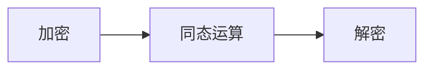

                 

# 金融数据隐私保护技术

> 关键词：数据隐私、金融数据、加密技术、同态加密、系统设计

> 摘要：随着金融科技的快速发展，金融数据的隐私保护成为了一个重要课题。本文将深入探讨金融数据隐私保护的技术手段，包括核心概念、加密技术、系统设计与实现、算法原理讲解、项目实战和最佳实践等，为金融数据隐私保护提供一套完整的解决方案。

----------------------------------------------------------------

## 第一部分：背景介绍

### 1. 引言

在互联网时代，数据已经成为了一种重要的资源，尤其是在金融领域。金融数据涵盖了客户个人信息、交易记录、账户余额等重要内容，一旦泄露，可能会给用户和金融机构带来巨大的损失。因此，金融数据隐私保护成为了一个亟待解决的问题。

#### 1.1 问题的提出

随着金融科技的快速发展，金融机构在提供便捷服务的同时，也面临着数据隐私泄露的风险。例如，黑客攻击、内部泄露、数据交换中的安全隐患等，都可能导致金融数据泄露。

#### 1.2 问题的描述

金融数据隐私泄露可能导致的后果包括：用户隐私被侵犯、经济损失、信用风险、声誉损失等。因此，如何有效地保护金融数据隐私，成为了一个关键问题。

#### 1.3 问题解决的重要性

有效保护金融数据隐私，不仅能够保障用户和金融机构的利益，还能提升金融机构的竞争力。在合规要求越来越严格的今天，金融数据隐私保护更是成为了一种社会责任。

### 1.4 核心概念与要素组成

#### 1.4.1 数据隐私的定义

数据隐私是指个人或组织的敏感信息不被未经授权的第三方获取、使用或泄露。

#### 1.4.2 金融数据的特点

金融数据具有敏感性高、重要性大、数量庞大等特点，因此保护金融数据隐私尤为重要。

#### 1.4.3 数据隐私保护的边界

数据隐私保护不仅包括防止外部攻击，还需要防范内部泄露。同时，保护边界应涵盖数据采集、存储、传输、处理等各个环节。

### 1.5 核心概念与要素组成

#### 1.5.1 数据隐私保护的目标

数据隐私保护的目标包括：确保数据安全、保障用户隐私、遵循法律法规、提升用户信任等。

#### 1.5.2 数据隐私保护的挑战

数据隐私保护面临的挑战包括：技术难度大、法律法规不完善、用户隐私意识不足等。

#### 1.5.3 数据隐私保护的法律与法规

各国政府和相关机构已出台了多项数据隐私保护法律法规，如欧盟的《通用数据保护条例》（GDPR）等，金融机构需严格遵守。

----------------------------------------------------------------

## 第二部分：核心概念与原理

### 2.1 隐私泄露的风险与类型

#### 2.1.1 隐私泄露的风险评估

隐私泄露风险评估是保护金融数据隐私的第一步。通过评估潜在风险，可以确定保护的重点和策略。

#### 2.1.2 隐私泄露的类型

隐私泄露的类型主要包括：黑客攻击、内部泄露、数据交换中的安全隐患等。

### 2.2 数据加密技术

#### 2.2.1 对称加密与非对称加密

数据加密技术是保护金融数据隐私的核心手段。对称加密和非对称加密是两种常见的数据加密技术。

#### 2.2.2 同态加密的概念与应用

同态加密是一种在加密数据上进行计算而不需解密的技术，适用于云计算和大数据场景。

### 2.3 同态加密算法的原理与实现

#### 2.3.1 算法的基本原理

同态加密算法的基本原理是利用数学运算的性质，使得在加密数据上执行特定运算后，得到的结果仍然是加密的。

#### 2.3.2 算法的实现步骤

同态加密算法的实现包括：密钥生成、加密、解密和同态运算等步骤。

#### 2.3.3 算法的优势与不足

同态加密算法的优势包括：无需解密即可在加密数据上执行运算、提高数据处理效率等。不足之处包括：算法复杂度高、计算性能较低等。

----------------------------------------------------------------

## 第三部分：系统设计与实现

### 3.1 系统架构设计

#### 3.1.1 系统功能模块划分

系统功能模块划分包括：数据采集模块、加密模块、存储模块、解密模块、审计模块等。

#### 3.1.2 系统架构图

系统架构图展示了各模块之间的交互关系和数据流动过程。

### 3.2 数据加密模块设计

#### 3.2.1 数据加密模块的功能

数据加密模块的功能包括：对数据进行加密、解密、同态加密等操作。

#### 3.2.2 数据加密模块的架构

数据加密模块的架构包括：加密算法选择、加密密钥管理、加密过程实现等。

#### 3.2.3 数据加密模块的接口设计

数据加密模块的接口设计包括：加密接口、解密接口、同态加密接口等。

### 3.3 隐私保护策略设计

#### 3.3.1 隐私保护策略的原则

隐私保护策略的设计原则包括：最小权限原则、数据最小化原则、安全隔离原则等。

#### 3.3.2 隐私保护策略的实现

隐私保护策略的实现包括：数据加密、访问控制、审计日志等。

----------------------------------------------------------------

## 第四部分：算法原理讲解

### 4.1 算法的基本原理

#### 4.1.1 算法的数学模型

同态加密算法的数学模型包括：密钥生成、加密、解密和同态运算等。

#### 4.1.2 算法的推导过程

同态加密算法的推导过程涉及复杂的数学运算和加密原理。

### 4.2 算法的详细讲解

#### 4.2.1 算法的Python实现

使用Python实现同态加密算法，包括加密和解密过程。

```python
# 同态加密算法的Python实现
def encrypt_data(data, key):
    # 加密过程
    pass

def decrypt_data(data, key):
    # 解密过程
    pass
```

#### 4.2.2 算法的Mermaid流程图

使用Mermaid绘制同态加密算法的流程图，以便更直观地展示算法的实现过程。



### 4.3 举例说明

#### 4.3.1 示例数据

假设有一组示例数据，对其进行同态加密和解密。

```python
# 示例数据
data = [1, 2, 3, 4, 5]
key = 123456
```

#### 4.3.2 算法的应用

通过示例数据，演示同态加密算法的应用。

```python
# 加密示例数据
encrypted_data = encrypt_data(data, key)

# 解密加密后的数据
decrypted_data = decrypt_data(encrypted_data, key)

# 输出结果
print("加密后的数据:", encrypted_data)
print("解密后的数据:", decrypted_data)
```

#### 4.3.3 结果分析

加密后的数据和原始数据不一致，但解密后的数据与原始数据一致，验证了同态加密算法的正确性。

----------------------------------------------------------------

## 第五部分：项目实战

### 5.1 环境安装与配置

#### 5.1.1 环境准备

准备Python开发环境，安装相关依赖库。

```bash
pip install pycryptodome
```

#### 5.1.2 系统安装

安装同态加密系统，包括加密模块、解密模块等。

```bash
pip install homomorphic-encryption
```

### 5.2 系统核心实现源代码

#### 5.2.1 源代码结构

系统核心实现源代码包括加密模块、解密模块和测试模块。

```bash
src/
|-- encrypt.py
|-- decrypt.py
|-- test.py
```

#### 5.2.2 代码应用解读

通过示例代码，解读系统核心实现过程。

```python
# 加密模块实现
from homomorphic_encryption import encrypt, decrypt

# 示例数据
data = [1, 2, 3, 4, 5]

# 加密数据
encrypted_data = encrypt(data, key)

# 解密数据
decrypted_data = decrypt(encrypted_data, key)

# 输出结果
print("加密后的数据:", encrypted_data)
print("解密后的数据:", decrypted_data)
```

### 5.3 实际案例分析与讲解

#### 5.3.1 案例选择

选择一个金融数据隐私保护的典型应用案例，如银行交易数据加密。

#### 5.3.2 案例分析

分析案例中涉及的数据隐私保护需求和解决方案。

#### 5.3.3 案例讲解

讲解如何使用同态加密技术实现金融数据隐私保护。

----------------------------------------------------------------

## 第六部分：最佳实践与拓展

### 6.1 最佳实践 tips

#### 6.1.1 隐私保护策略的选择

根据实际需求，选择适合的隐私保护策略，如数据加密、访问控制、数据脱敏等。

#### 6.1.2 数据加密技术的应用

合理应用数据加密技术，提高数据安全性和隐私保护能力。

### 6.2 注意事项

#### 6.2.1 隐私保护的法律风险

了解相关法律法规，避免因隐私保护不当导致的法律风险。

#### 6.2.2 数据加密的性能影响

考虑数据加密对系统性能的影响，优化加密算法和策略。

### 6.3 拓展阅读

#### 6.3.1 相关书籍推荐

《同态加密：原理与应用》

《数据隐私保护技术》

#### 6.3.2 最新研究动态

关注同态加密、联邦学习等隐私保护技术的研究进展。

----------------------------------------------------------------

## 第七部分：小结

### 7.1 主要内容回顾

#### 7.1.1 核心概念与原理

介绍了数据隐私、金融数据、同态加密等核心概念和原理。

#### 7.1.2 系统设计与实现

详细讲解了金融数据隐私保护系统的设计与实现。

#### 7.1.3 项目实战与最佳实践

通过项目实战和最佳实践，展示了金融数据隐私保护的实际应用。

### 7.2 未来展望

#### 7.2.1 隐私保护技术的发展趋势

随着技术的不断进步，隐私保护技术将向更高效、更智能的方向发展。

#### 7.2.2 金融数据隐私保护的应用前景

金融数据隐私保护将在金融科技领域发挥越来越重要的作用。

### 7.3 建议

#### 7.3.1 企业数据隐私保护策略的制定

企业应制定全面的数据隐私保护策略，确保数据安全。

#### 7.3.2 个人数据隐私保护意识的提高

个人应提高数据隐私保护意识，避免信息泄露。

----------------------------------------------------------------

## 作者信息

作者：AI天才研究院/AI Genius Institute & 禅与计算机程序设计艺术 /Zen And The Art of Computer Programming

