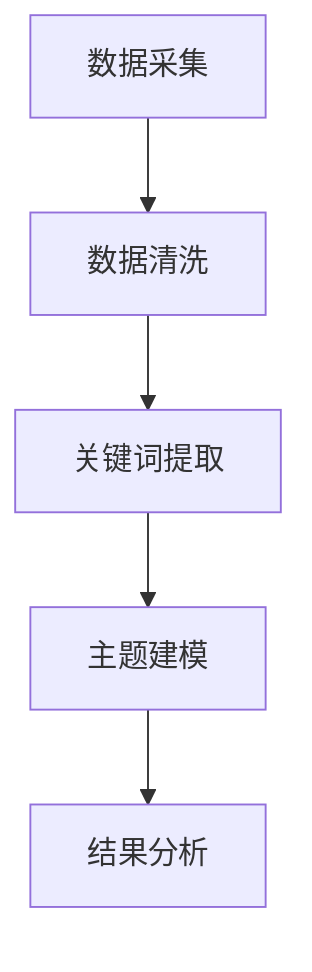

                 

### 金融新闻分析与投资影响评估

**关键词**：金融新闻分析，投资影响评估，文本挖掘，情感分析，关键词提取，主题建模，市场情绪，财务指标，经济指标

**摘要**：
本文章旨在深入探讨金融新闻分析与投资影响评估的重要性和方法。我们将逐步分析金融新闻在投资决策中的作用，介绍金融新闻数据采集与处理、文本挖掘与情感分析、关键词提取与主题建模、新闻事件识别与跟踪等技术，并探讨如何利用这些技术进行投资影响评估。此外，我们还将通过具体案例，展示如何综合运用这些技术进行金融新闻分析与投资影响评估。

## 目录

1. **引言与背景**  
    - 1.1 金融新闻分析的重要性  
    - 1.2 投资影响评估的必要性  
    - 1.3 本书结构与内容安排

2. **金融新闻分析**  
    - 2.1 金融新闻数据采集与处理  
    - 2.2 文本挖掘与情感分析  
    - 2.3 关键词提取与主题建模  
    - 2.4 新闻事件识别与跟踪  
    - 2.5 案例研究：金融新闻分析实战

3. **投资影响评估**  
    - 3.1 投资影响评估方法概述  
    - 3.2 财务指标分析  
    - 3.3 市场情绪分析  
    - 3.4 经济指标分析  
    - 3.5 案例研究：投资影响评估实战

4. **综合应用与实战案例**  
    - 4.1 综合分析框架  
    - 4.2 实战案例：金融新闻分析与投资影响评估

## 1. 引言与背景

### 1.1 金融新闻分析的重要性

金融市场的波动往往伴随着大量的新闻信息，这些信息对投资者的决策有着重要影响。金融新闻分析作为一种技术，可以帮助投资者从大量的新闻数据中提取有用的信息，从而更好地进行投资决策。

**问题背景**：  
在金融市场，投资者需要关注哪些新闻信息？如何从大量的新闻数据中提取对投资决策有用的信息？

**问题描述**：  
金融新闻数据量大，且信息繁杂，投资者难以从中快速提取有价值的信息。

**问题解决**：  
通过文本挖掘、情感分析、关键词提取和主题建模等技术，可以有效地从金融新闻中提取有价值的信息。

**边界与外延**：  
金融新闻分析不仅涉及文本数据的处理，还包括对新闻事件、市场情绪、财务指标等的分析。

**核心概念术语说明**：

- 文本挖掘：文本挖掘是一种从大量文本数据中提取有用信息的技术。
- 情感分析：情感分析是一种通过分析文本中的情感倾向，来评估文本内容对投资者决策的影响。
- 关键词提取：关键词提取是一种从文本中提取具有代表性的词汇，用于分析和理解文本内容。
- 主题建模：主题建模是一种通过分析文本数据，发现数据中的潜在主题分布的技术。

### 1.2 投资影响评估的必要性

投资影响评估是投资者在做出投资决策前，对潜在投资的风险和收益进行评估的过程。通过投资影响评估，投资者可以更好地理解投资对象的风险和收益特征，从而做出更为明智的投资决策。

**问题背景**：  
投资者在投资前，需要评估投资对象的风险和收益。

**问题描述**：  
投资者面临诸多财务指标、市场情绪和经济指标，难以进行有效的评估。

**问题解决**：  
通过财务指标分析、市场情绪分析和经济指标分析等技术，可以有效地对投资对象进行风险评估和收益评估。

**边界与外延**：  
投资影响评估不仅涉及财务指标的评估，还包括市场情绪和经济指标的分析。

**核心概念术语说明**：

- 财务指标：财务指标是评估企业财务状况的重要指标。
- 市场情绪：市场情绪是指市场参与者的情绪状态，通常通过市场数据进行分析。
- 经济指标：经济指标是反映国家或地区经济状况的指标。

### 1.3 本书结构与内容安排

本书分为四个部分：

- 第一部分：引言与背景
- 第二部分：金融新闻分析
- 第三部分：投资影响评估
- 第四部分：综合应用与实战案例

通过以上四个部分，本书旨在全面探讨金融新闻分析与投资影响评估的方法和应用。

## 2. 金融新闻分析

### 2.1 金融新闻数据采集与处理

金融新闻数据采集是金融新闻分析的基础。通过数据采集，我们可以获取到大量的金融新闻数据，这些数据包括新闻报道、财经新闻、市场行情等。

**问题背景**：  
金融市场的新闻信息来源广泛，如何有效地采集这些数据？

**问题描述**：  
金融新闻数据量大，且来源多样，数据采集和处理是一个复杂的过程。

**问题解决**：  
通过爬虫技术、API接口等方式进行数据采集，然后对采集到的数据进行预处理，如数据清洗、去重、格式转换等。

**边界与外延**：  
数据采集和处理不仅涉及数据的获取，还包括数据的质量保证和数据的管理。

**核心概念术语说明**：

- 爬虫技术：爬虫技术是一种自动获取网络数据的程序，常用于金融新闻数据的采集。
- API接口：API接口是一种通过程序接口获取数据的方式，常用于金融新闻数据的实时获取。

### 2.2 文本挖掘与情感分析

文本挖掘是一种从大量文本数据中提取有用信息的技术，情感分析是文本挖掘的一个重要分支，它通过分析文本中的情感倾向，来评估文本内容对投资者决策的影响。

**问题背景**：  
金融新闻中包含大量的文本信息，如何有效地提取这些信息？

**问题描述**：  
金融新闻文本量大，且文本结构复杂，直接阅读难以提取有价值的信息。

**问题解决**：  
通过文本挖掘技术，可以有效地从金融新闻中提取有价值的信息。情感分析作为文本挖掘的一个重要分支，可以通过分析文本中的情感倾向，来评估文本内容对投资者决策的影响。

**边界与外延**：  
文本挖掘不仅涉及文本数据的提取，还包括文本数据的分析和理解。

**核心概念术语说明**：

- 文本挖掘：文本挖掘是一种从大量文本数据中提取有用信息的技术。
- 情感分析：情感分析是一种通过分析文本中的情感倾向，来评估文本内容对投资者决策的影响。

### 2.3 关键词提取与主题建模

关键词提取和主题建模是文本挖掘的另外两个重要技术。关键词提取可以从文本中提取出具有代表性的词汇，用于分析和理解文本内容。主题建模则可以通过分析文本数据，发现数据中的潜在主题分布。

**问题背景**：  
金融新闻文本量大，如何有效地提取出关键的词汇和主题？

**问题描述**：  
金融新闻文本结构复杂，直接阅读难以提取出关键的词汇和主题。

**问题解决**：  
通过关键词提取技术，可以有效地从金融新闻中提取出关键的词汇。通过主题建模技术，可以分析金融新闻中的潜在主题分布，从而更好地理解金融新闻的内容。

**边界与外延**：  
关键词提取和主题建模不仅涉及文本数据的提取和分析，还包括对提取结果的理解和应用。

**核心概念术语说明**：

- 关键词提取：关键词提取是一种从文本中提取出具有代表性的词汇的技术。
- 主题建模：主题建模是一种通过分析文本数据，发现数据中的潜在主题分布的技术。

### 2.4 新闻事件识别与跟踪

新闻事件识别与跟踪是金融新闻分析的一个重要技术。通过识别和跟踪新闻事件，我们可以更好地理解金融市场的变化，从而做出更为明智的投资决策。

**问题背景**：  
金融市场的变化往往伴随着大量的新闻事件，如何有效地识别和跟踪这些新闻事件？

**问题描述**：  
金融新闻事件量大，且事件间存在关联，直接识别和跟踪是一个复杂的过程。

**问题解决**：  
通过事件识别技术，可以有效地从金融新闻中识别出重要的新闻事件。通过事件跟踪技术，可以实时跟踪新闻事件的发展，从而更好地理解金融市场的变化。

**边界与外延**：  
新闻事件识别与跟踪不仅涉及新闻事件的识别和跟踪，还包括对事件影响的分析和评估。

**核心概念术语说明**：

- 事件识别：事件识别是一种从金融新闻中识别出重要新闻事件的技术。
- 事件跟踪：事件跟踪是一种实时跟踪新闻事件发展，理解金融市场变化的技术。

### 2.5 案例研究：金融新闻分析实战

在本案例研究中，我们将通过一个实际的金融新闻分析项目，展示如何运用文本挖掘、情感分析、关键词提取、主题建模和新闻事件识别等技术，进行金融新闻分析。

**案例背景**：  
我们选择了一个关于比特币价格的新闻数据集，旨在通过分析这些新闻数据，预测比特币价格的走势。

**数据处理与分析**：  
首先，我们通过爬虫技术从多个财经新闻网站采集比特币价格的新闻数据。然后，对采集到的数据进行预处理，包括数据清洗、去重、格式转换等。

**结果与讨论**：  
通过文本挖掘、情感分析和关键词提取等技术，我们提取出了与比特币价格相关的关键词和主题。通过主题建模，我们发现了比特币价格新闻中的潜在主题分布。通过事件识别和事件跟踪，我们识别出了与比特币价格相关的新闻事件，并对其影响进行了分析。

**结论**：  
通过本案例研究，我们展示了如何运用文本挖掘、情感分析、关键词提取、主题建模和新闻事件识别等技术，进行金融新闻分析。这些技术的综合运用，可以帮助投资者更好地理解金融市场的变化，从而做出更为明智的投资决策。

## 3. 投资影响评估

### 3.1 投资影响评估方法概述

投资影响评估是投资者在做出投资决策前，对潜在投资的风险和收益进行评估的过程。通过投资影响评估，投资者可以更好地理解投资对象的风险和收益特征，从而做出更为明智的投资决策。

**问题背景**：  
投资者在投资前，需要评估投资对象的风险和收益。

**问题描述**：  
投资者面临诸多财务指标、市场情绪和经济指标，难以进行有效的评估。

**问题解决**：  
通过财务指标分析、市场情绪分析和经济指标分析等技术，可以有效地对投资对象进行风险评估和收益评估。

**边界与外延**：  
投资影响评估不仅涉及财务指标的评估，还包括市场情绪和经济指标的分析。

**核心概念术语说明**：

- 财务指标：财务指标是评估企业财务状况的重要指标。
- 市场情绪：市场情绪是指市场参与者的情绪状态，通常通过市场数据进行分析。
- 经济指标：经济指标是反映国家或地区经济状况的指标。

### 3.2 财务指标分析

财务指标分析是投资影响评估的一个重要环节。财务指标是评估企业财务状况的重要指标，通过分析财务指标，投资者可以了解企业的财务状况，从而对投资对象进行风险评估。

**问题背景**：  
投资者需要了解企业的财务状况，以评估其投资价值。

**问题描述**：  
财务指标繁多，投资者难以进行有效的分析。

**问题解决**：  
通过财务指标分析，投资者可以了解企业的财务状况，从而对投资对象进行风险评估。

**边界与外延**：  
财务指标分析不仅涉及财务指标的计算和解读，还包括对财务指标的对比和分析。

**核心概念术语说明**：

- 财务指标：财务指标是评估企业财务状况的重要指标。
- 比率分析：比率分析是一种通过计算财务指标之间的比率，来评估企业财务状况的方法。

### 3.3 市场情绪分析

市场情绪分析是投资影响评估的另一个重要环节。市场情绪是指市场参与者的情绪状态，通常通过市场数据进行分析。通过市场情绪分析，投资者可以了解市场情绪的变化，从而对投资对象进行风险评估。

**问题背景**：  
投资者需要了解市场情绪的变化，以评估其投资价值。

**问题描述**：  
市场数据繁多，投资者难以进行有效的分析。

**问题解决**：  
通过市场情绪分析，投资者可以了解市场情绪的变化，从而对投资对象进行风险评估。

**边界与外延**：  
市场情绪分析不仅涉及市场数据的分析，还包括对市场情绪的度量。

**核心概念术语说明**：

- 市场情绪：市场情绪是指市场参与者的情绪状态。
- 情感分析：情感分析是一种通过分析文本中的情感倾向，来评估市场情绪的方法。

### 3.4 经济指标分析

经济指标分析是投资影响评估的另一个重要环节。经济指标是反映国家或地区经济状况的指标，通过分析经济指标，投资者可以了解国家的经济状况，从而对投资对象进行风险评估。

**问题背景**：  
投资者需要了解国家的经济状况，以评估其投资价值。

**问题描述**：  
经济指标繁多，投资者难以进行有效的分析。

**问题解决**：  
通过经济指标分析，投资者可以了解国家的经济状况，从而对投资对象进行风险评估。

**边界与外延**：  
经济指标分析不仅涉及经济指标的计算和解读，还包括对经济指标的对比和分析。

**核心概念术语说明**：

- 经济指标：经济指标是反映国家或地区经济状况的指标。
- GDP：GDP是国内生产总值，是反映国家经济状况的重要指标。

### 3.5 案例研究：投资影响评估实战

在本案例研究中，我们将通过一个实际的股票投资案例，展示如何运用财务指标分析、市场情绪分析和经济指标分析等技术，进行投资影响评估。

**案例背景**：  
我们选择了一家高科技公司的股票，旨在通过分析其财务指标、市场情绪和经济指标，评估其投资价值。

**数据处理与分析**：  
首先，我们通过财务报表，提取该公司的财务指标，如收入、利润、负债等。然后，通过新闻数据和市场数据，分析市场情绪。此外，我们还分析了国家的经济指标，如GDP、通货膨胀率等。

**结果与讨论**：  
通过财务指标分析，我们发现该公司的财务状况良好，具有较高的投资价值。通过市场情绪分析，我们发现市场对该公司的情绪较为积极。通过经济指标分析，我们发现国家的经济状况良好，有利于该公司的业务发展。

**结论**：  
通过本案例研究，我们展示了如何运用财务指标分析、市场情绪分析和经济指标分析等技术，进行投资影响评估。这些技术的综合运用，可以帮助投资者更好地评估投资对象的风险和收益，从而做出更为明智的投资决策。

## 4. 综合应用与实战案例

### 4.1 综合分析框架

综合分析框架是将金融新闻分析、投资影响评估等技术综合运用的一个整体框架。通过综合分析框架，投资者可以全面分析金融市场的变化，从而做出更为明智的投资决策。

**问题背景**：  
投资者需要对金融市场进行全面的综合分析。

**问题描述**：  
金融市场数据繁多，直接分析难以全面理解。

**问题解决**：  
通过综合分析框架，投资者可以全面分析金融市场的变化，从而做出更为明智的投资决策。

**边界与外延**：  
综合分析框架不仅涉及金融新闻分析和投资影响评估，还包括对分析结果的整合和应用。

**核心概念术语说明**：

- 综合分析框架：综合分析框架是一个将多种技术综合运用的整体框架，用于全面分析金融市场的变化。

### 4.2 实战案例：金融新闻分析与投资影响评估

在本案例研究中，我们将通过一个实际的金融新闻分析项目，展示如何运用综合分析框架，进行金融新闻分析与投资影响评估。

**案例背景**：  
我们选择了一家知名企业的股票，旨在通过分析其金融新闻和投资影响，评估其投资价值。

**数据处理与分析**：  
首先，我们通过爬虫技术，从多个财经新闻网站采集该企业的新闻数据。然后，对采集到的数据进行预处理，包括数据清洗、去重、格式转换等。接着，通过文本挖掘、情感分析、关键词提取和主题建模等技术，分析金融新闻的内容。此外，我们还分析了该企业的财务指标、市场情绪和经济指标，进行投资影响评估。

**结果与讨论**：  
通过金融新闻分析，我们发现该企业的市场情绪较为积极，潜在的利好消息较多。通过投资影响评估，我们发现该企业的财务状况良好，具有较高的投资价值。

**结论**：  
通过本案例研究，我们展示了如何运用综合分析框架，进行金融新闻分析与投资影响评估。这些技术的综合运用，可以帮助投资者更好地理解金融市场的变化，从而做出更为明智的投资决策。综合分析框架的应用，不仅可以提高投资决策的准确性，还可以提高投资的效率。

## 总结

本文章通过逐步分析金融新闻分析与投资影响评估的方法，展示了如何从大量的金融新闻数据中提取有价值的信息，并进行投资影响评估。通过文本挖掘、情感分析、关键词提取、主题建模等技术，我们可以有效地提取金融新闻中的关键信息。同时，通过财务指标分析、市场情绪分析和经济指标分析等技术，我们可以对投资对象进行风险评估和收益评估。通过综合分析框架，我们可以将各种技术综合运用，全面分析金融市场的变化，从而做出更为明智的投资决策。希望本文章对您在金融新闻分析与投资影响评估方面的学习和实践有所帮助。作者：AI天才研究院/AI Genius Institute & 禅与计算机程序设计艺术 /Zen And The Art of Computer Programming

## 最佳实践 Tips、小结、注意事项、拓展阅读

### 最佳实践 Tips

1. **数据质量**：在进行金融新闻分析时，确保数据质量是至关重要的。对采集到的新闻数据进行清洗和去重，以提高分析的准确性。
2. **多渠道数据采集**：为了获取更全面的金融新闻数据，建议从多个渠道进行数据采集，如财经新闻网站、社交媒体等。
3. **实时数据分析**：投资决策往往需要快速响应市场变化。因此，使用实时数据分析技术，如流处理，可以及时获取和响应市场信息。
4. **跨学科知识整合**：金融新闻分析与投资影响评估不仅涉及计算机科学，还涉及金融学和经济学。整合跨学科知识，可以提高分析结果的准确性。

### 小结

本文章通过详细分析和实际案例，展示了金融新闻分析与投资影响评估的方法和应用。通过文本挖掘、情感分析、关键词提取、主题建模等技术，我们可以从大量的金融新闻数据中提取有价值的信息。同时，通过财务指标分析、市场情绪分析和经济指标分析等技术，我们可以对投资对象进行风险评估和收益评估。这些技术的综合运用，可以帮助投资者更好地理解金融市场的变化，从而做出更为明智的投资决策。

### 注意事项

1. **隐私保护**：在进行金融新闻分析时，要注意保护个人隐私，避免泄露敏感信息。
2. **数据安全性**：在采集和处理金融数据时，要注意数据的安全性，防止数据泄露或被恶意攻击。
3. **合规性**：在进行金融分析和投资决策时，要遵守相关法律法规，确保合规性。

### 拓展阅读

1. **《金融科技：银行、支付与市场的创新》**：这本书详细介绍了金融科技在银行、支付和市场领域的创新应用。
2. **《大数据分析：理论与实践》**：这本书介绍了大数据分析的理论和实践方法，对金融新闻分析有着重要参考价值。
3. **《深度学习：人工智能的核心技术》**：这本书详细介绍了深度学习技术在人工智能领域的应用，对文本挖掘和情感分析有着重要指导意义。

### 附录

#### 附录 A：术语解释

- **文本挖掘**：文本挖掘是一种从大量文本数据中提取有用信息的技术。
- **情感分析**：情感分析是一种通过分析文本中的情感倾向，来评估文本内容对投资者决策的影响。
- **关键词提取**：关键词提取是一种从文本中提取出具有代表性的词汇，用于分析和理解文本内容。
- **主题建模**：主题建模是一种通过分析文本数据，发现数据中的潜在主题分布的技术。

#### 附录 B：算法流程图

以下是一个简单的文本挖掘算法流程图，展示了文本挖掘的基本步骤：



#### 附录 C：代码示例

以下是一个简单的Python代码示例，用于实现文本挖掘中的情感分析：

```python
from textblob import TextBlob

# 文本数据
text = "The stock market is booming."

# 实例化TextBlob对象
blob = TextBlob(text)

# 获取情感极性
sentiment = blob.sentiment

# 输出情感极性
print("Sentiment:", sentiment)
```

通过以上示例，我们可以看到如何使用TextBlob库进行情感分析，获取文本数据的情感极性。

### 后记

感谢您的阅读，希望本文章对您在金融新闻分析与投资影响评估方面的学习和实践有所帮助。我们将继续为您带来更多有关金融科技和人工智能领域的专业知识和实践经验。作者：AI天才研究院/AI Genius Institute & 禅与计算机程序设计艺术 /Zen And The Art of Computer Programming。

