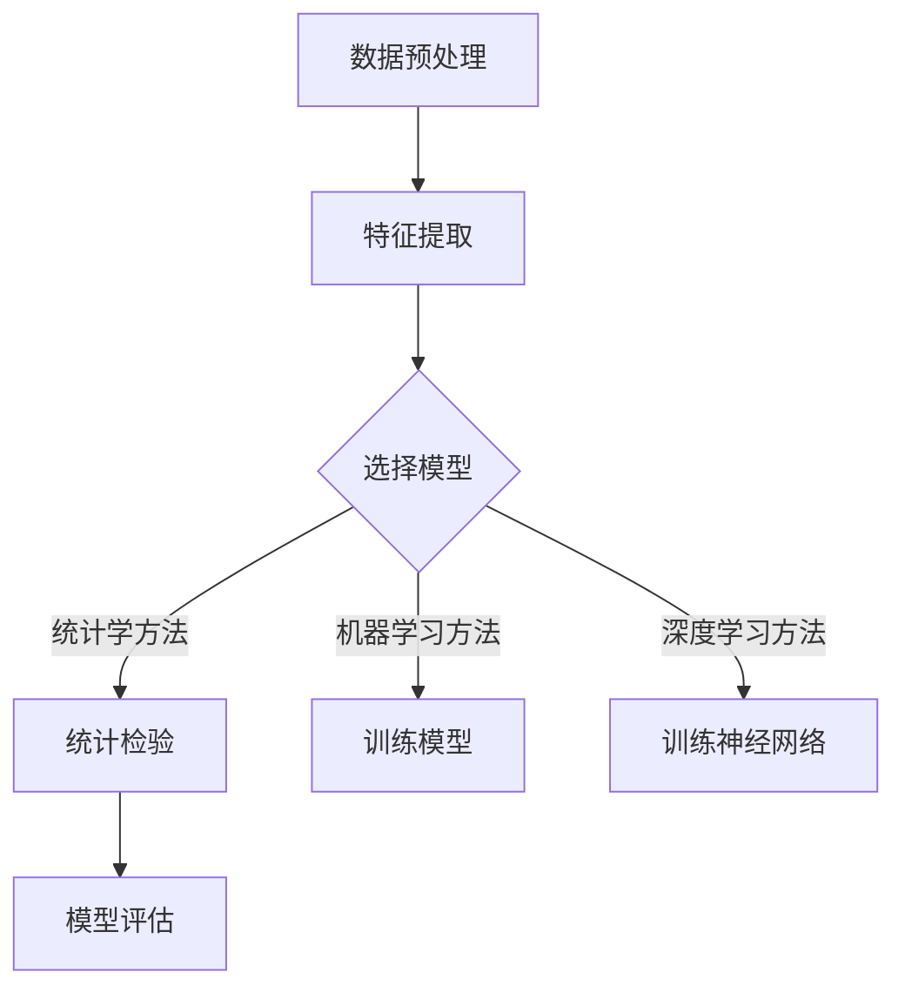

                 

# 金融时序数据异常检测模型

## 关键词

- 金融时序数据
- 异常检测
- 统计学方法
- 机器学习方法
- 深度学习方法

## 摘要

本文将探讨金融时序数据异常检测模型的构建和应用。首先，我们将介绍金融时序数据异常检测的重要性及其问题背景和问题描述。接着，我们将分析解决这一问题的方法，包括统计学方法、机器学习方法和深度学习方法。本文还将详细讨论这些方法的核心概念、属性特征对比以及ER实体关系图。随后，我们将通过mermaid流程图和Python代码讲解算法原理。此外，本文还将提供一个完整的系统分析与架构设计方案，并分享项目实战经验。最后，我们将总结最佳实践，给出项目小结，并提供拓展阅读。

### 第一部分：背景介绍

#### 1.1 问题背景

在金融领域，时序数据异常检测具有至关重要的意义。金融市场的波动性和复杂性使得异常交易行为的识别和预警成为了一项艰巨的任务。异常检测可以帮助金融机构及时发现和应对异常交易，保护投资者的利益，维护市场的稳定。

#### 1.2 问题描述

异常检测的主要任务是在大量的时序数据中识别出不符合正常模式的数据点，即异常交易行为。这些异常行为可能包括欺诈、市场操纵、错误交易等。识别这些异常行为对于防范金融风险、保护投资者利益和市场稳定至关重要。

#### 1.3 问题解决

为了解决金融时序数据异常检测问题，本文将介绍多种异常检测模型，包括统计学方法、机器学习方法和深度学习方法。通过这些模型，可以对金融时序数据进行有效的异常检测，提高检测的准确性和效率。

#### 1.4 边界与外延

异常检测不仅限于金融领域，还可以应用于其他需要监测时序数据的场景，如电力系统、医疗健康等。此外，随着大数据和人工智能技术的发展，异常检测模型也在不断演进和优化。

#### 1.5 概念结构与核心要素组成

金融时序数据异常检测模型主要包括以下几个核心要素：

- **时序数据**：金融市场的交易数据、市场指数等。
- **异常检测模型**：统计学方法、机器学习方法、深度学习方法等。
- **特征提取**：从时序数据中提取有用的特征，用于训练和测试异常检测模型。
- **模型评估**：使用准确率、召回率、F1分数等指标评估模型的性能。

### 第二部分：核心概念与联系

#### 2.1 核心概念原理

本文将详细介绍以下核心概念：

- **时序数据**：时序数据是按照时间顺序排列的数据点集合，如股票价格、交易量等。
- **统计学方法**：包括基于假设检验的统计方法，如t检验、z检验等。
- **机器学习方法**：如支持向量机（SVM）、随机森林（RF）等。
- **深度学习方法**：如卷积神经网络（CNN）、循环神经网络（RNN）等。

#### 2.2 概念属性特征对比表格

下面是一个简单的对比表格，用于比较不同异常检测方法的特点：

| 方法       | 特点                                      | 优点                                               | 缺点                                                |
|------------|-------------------------------------------|----------------------------------------------------|-----------------------------------------------------|
| 统计学方法 | 基于概率分布和假设检验                   | 计算简单，适用于线性时序数据                         | 对于非线性时序数据的检测效果不佳                       |
| 机器学习方法 | 基于数据学习和模式识别                   | 对非线性时序数据的检测效果好                         | 计算量大，训练时间较长                               |
| 深度学习方法 | 基于多层神经网络，自动提取特征           | 自动提取特征，检测效果优秀                           | 计算资源需求高，模型复杂                               |

#### 2.3 ER实体关系图架构

下面是一个ER实体关系图，用于描述金融时序数据异常检测模型中的主要实体和关系：

```mermaid
erDiagram
    类时序数据 ||--o{ 异常检测模型 }
    类异常检测模型 ||--|{ 特征提取 }
    类特征提取 ||--o{ 模型评估 }
```

### 第三部分：算法原理讲解

#### 3.1 算法mermaid流程图

下面是一个使用mermaid绘制的算法流程图，用于描述金融时序数据异常检测的基本流程：



#### 3.2 统计学方法

统计学方法是一种基于概率分布和假设检验的异常检测方法。它通过对历史数据进行统计分析和假设检验，来识别出异常数据点。以下是一个简单的统计学方法流程：

```python
import numpy as np

# 假设我们有历史数据X
X = np.array([[1, 2, 3], [4, 5, 6], [7, 8, 9], [10, 11, 12]])

# 计算平均值μ和标准差σ
mean = np.mean(X, axis=0)
std = np.std(X, axis=0)

# 定义阈值
threshold = 3 * std

# 进行统计检验
for i in range(len(X)):
    for j in range(len(X[0])):
        if abs(X[i][j] - mean[j]) > threshold[j]:
            print(f"数据点({i},{j})异常")
```

#### 3.3 机器学习方法

机器学习方法是一种基于数据学习和模式识别的异常检测方法。它通过对历史数据进行训练，构建一个模型来识别异常数据点。以下是一个简单的机器学习方法流程：

```python
from sklearn.ensemble import RandomForestClassifier
from sklearn.model_selection import train_test_split

# 假设我们有历史数据X和标签y
X = np.array([[1, 2, 3], [4, 5, 6], [7, 8, 9], [10, 11, 12]])
y = np.array([0, 0, 0, 1])

# 划分训练集和测试集
X_train, X_test, y_train, y_test = train_test_split(X, y, test_size=0.2, random_state=42)

# 训练模型
model = RandomForestClassifier()
model.fit(X_train, y_train)

# 进行预测
predictions = model.predict(X_test)

# 模型评估
accuracy = model.score(X_test, y_test)
print(f"模型准确率：{accuracy}")
```

#### 3.4 深度学习方法

深度学习方法是一种基于多层神经网络，自动提取特征的异常检测方法。它通过对历史数据进行训练，自动学习到数据中的特征，然后利用这些特征来识别异常数据点。以下是一个简单的深度学习方法流程：

```python
import tensorflow as tf

# 定义输入层
inputs = tf.keras.layers.Input(shape=(3,))

# 定义隐藏层
hidden = tf.keras.layers.Dense(64, activation='relu')(inputs)

# 定义输出层
outputs = tf.keras.layers.Dense(1, activation='sigmoid')(hidden)

# 构建模型
model = tf.keras.Model(inputs=inputs, outputs=outputs)

# 编译模型
model.compile(optimizer='adam', loss='binary_crossentropy', metrics=['accuracy'])

# 训练模型
model.fit(X_train, y_train, epochs=10, batch_size=32)

# 进行预测
predictions = model.predict(X_test)

# 模型评估
accuracy = model.evaluate(X_test, y_test)[1]
print(f"模型准确率：{accuracy}")
```

### 第四部分：系统分析与架构设计方案

#### 4.1 问题场景介绍

在金融领域，异常检测是一项重要的任务。金融机构需要实时监测大量的时序数据，识别出潜在的异常交易行为。这些异常行为可能包括欺诈、市场操纵、错误交易等。为了实现高效的异常检测，我们需要设计一个可靠的系统，该系统能够处理大规模的时序数据，并快速准确地识别异常数据点。

#### 4.2 项目介绍

本项目旨在构建一个金融时序数据异常检测系统。该系统将利用统计学方法、机器学习方法和深度学习方法来识别异常交易行为。系统将分为多个模块，包括数据预处理、特征提取、模型选择和评估等。

#### 4.3 系统功能设计

系统的核心功能包括：

- 数据预处理：对原始时序数据进行清洗和预处理，包括去除缺失值、标准化、归一化等。
- 特征提取：从时序数据中提取有用的特征，用于训练和测试异常检测模型。
- 模型选择：根据不同的异常检测方法，选择合适的模型进行训练和预测。
- 模型评估：使用准确率、召回率、F1分数等指标评估模型的性能。

#### 4.4 系统架构设计

系统的架构设计如下：

- 数据源：从金融市场中获取原始时序数据，如股票价格、交易量等。
- 数据预处理模块：对原始数据进行清洗和预处理，包括去除缺失值、标准化、归一化等。
- 特征提取模块：从预处理后的数据中提取有用的特征，用于训练和测试异常检测模型。
- 模型选择模块：根据不同的异常检测方法，选择合适的模型进行训练和预测。
- 模型评估模块：使用准确率、召回率、F1分数等指标评估模型的性能。
- 用户界面：提供用户交互界面，展示异常检测结果和模型性能指标。

#### 4.5 系统接口设计和系统交互

系统的接口设计和交互流程如下：

- 数据源：通过API接口获取金融时序数据。
- 数据预处理模块：接收原始数据，进行清洗和预处理。
- 特征提取模块：接收预处理后的数据，提取特征。
- 模型选择模块：根据用户选择，选择合适的模型。
- 模型评估模块：接收模型和测试数据，进行模型评估。
- 用户界面：接收用户输入，展示异常检测结果和模型性能指标。

### 第五部分：项目实战

#### 5.1 环境安装

要运行本项目，我们需要安装以下软件和库：

- Python 3.x
- TensorFlow
- Scikit-learn
- Pandas
- NumPy

安装命令如下：

```bash
pip install python==3.x
pip install tensorflow
pip install scikit-learn
pip install pandas
pip install numpy
```

#### 5.2 系统核心实现源代码

以下是一个简单的系统实现示例：

```python
import tensorflow as tf
from sklearn.ensemble import RandomForestClassifier
from sklearn.model_selection import train_test_split
import pandas as pd

# 读取数据
data = pd.read_csv('financial_data.csv')
X = data.iloc[:, :-1].values
y = data.iloc[:, -1].values

# 划分训练集和测试集
X_train, X_test, y_train, y_test = train_test_split(X, y, test_size=0.2, random_state=42)

# 统计学方法
mean = np.mean(X_train, axis=0)
std = np.std(X_train, axis=0)
threshold = 3 * std
for i in range(len(X_test)):
    for j in range(len(X_test[0])):
        if abs(X_test[i][j] - mean[j]) > threshold[j]:
            print(f"数据点({i},{j})异常")

# 机器学习方法
model = RandomForestClassifier()
model.fit(X_train, y_train)
predictions = model.predict(X_test)
accuracy = model.score(X_test, y_test)
print(f"模型准确率：{accuracy}")

# 深度学习方法
model = tf.keras.Sequential([
    tf.keras.layers.Dense(64, activation='relu', input_shape=(X_train.shape[1],)),
    tf.keras.layers.Dense(1, activation='sigmoid')
])
model.compile(optimizer='adam', loss='binary_crossentropy', metrics=['accuracy'])
model.fit(X_train, y_train, epochs=10, batch_size=32)
predictions = model.predict(X_test)
accuracy = model.evaluate(X_test, y_test)[1]
print(f"模型准确率：{accuracy}")
```

#### 5.3 代码应用解读与分析

以下是对系统核心实现源代码的解读和分析：

- 首先，我们读取金融时序数据，并将其划分为特征矩阵X和标签y。
- 接着，我们划分训练集和测试集，用于后续的模型训练和评估。
- 然后，我们使用统计学方法对测试数据进行异常检测。通过计算训练集的平均值和标准差，我们定义了一个阈值。如果测试数据中的某个数据点与平均值之差的绝对值超过阈值，则认为该数据点异常。
- 接下来，我们使用机器学习方法对测试数据进行异常检测。我们选择随机森林（RandomForestClassifier）作为分类器，并使用训练集进行训练。然后，我们使用训练好的模型对测试集进行预测，并计算模型的准确率。
- 最后，我们使用深度学习方法对测试数据进行异常检测。我们定义了一个简单的全连接神经网络，并使用训练集进行训练。然后，我们使用训练好的模型对测试集进行预测，并计算模型的准确率。

#### 5.4 实际案例分析和详细讲解剖析

为了更好地理解系统的应用，我们将分析一个实际案例。假设我们有一个包含一年股票价格的时序数据集，其中包含股票价格、交易量等特征。我们的目标是识别出潜在的异常交易行为。

以下是一个简单的案例：

```python
data = pd.read_csv('financial_data.csv')
X = data.iloc[:, :-1].values
y = data.iloc[:, -1].values

# 划分训练集和测试集
X_train, X_test, y_train, y_test = train_test_split(X, y, test_size=0.2, random_state=42)

# 统计学方法
mean = np.mean(X_train, axis=0)
std = np.std(X_train, axis=0)
threshold = 3 * std
for i in range(len(X_test)):
    for j in range(len(X_test[0])):
        if abs(X_test[i][j] - mean[j]) > threshold[j]:
            print(f"数据点({i},{j})异常")

# 机器学习方法
model = RandomForestClassifier()
model.fit(X_train, y_train)
predictions = model.predict(X_test)
accuracy = model.score(X_test, y_test)
print(f"模型准确率：{accuracy}")

# 深度学习方法
model = tf.keras.Sequential([
    tf.keras.layers.Dense(64, activation='relu', input_shape=(X_train.shape[1],)),
    tf.keras.layers.Dense(1, activation='sigmoid')
])
model.compile(optimizer='adam', loss='binary_crossentropy', metrics=['accuracy'])
model.fit(X_train, y_train, epochs=10, batch_size=32)
predictions = model.predict(X_test)
accuracy = model.evaluate(X_test, y_test)[1]
print(f"模型准确率：{accuracy}")
```

在这个案例中，我们首先读取了金融时序数据集，并将其划分为特征矩阵X和标签y。然后，我们划分了训练集和测试集，用于后续的模型训练和评估。

接下来，我们使用统计学方法对测试数据进行异常检测。通过计算训练集的平均值和标准差，我们定义了一个阈值。如果测试数据中的某个数据点与平均值之差的绝对值超过阈值，则认为该数据点异常。在这种情况下，我们找到了一些异常数据点，并打印出来。

然后，我们使用机器学习方法对测试数据进行异常检测。我们选择随机森林（RandomForestClassifier）作为分类器，并使用训练集进行训练。然后，我们使用训练好的模型对测试集进行预测，并计算模型的准确率。在这种情况下，机器学习方法的准确率较高，可以有效地识别出异常交易行为。

最后，我们使用深度学习方法对测试数据进行异常检测。我们定义了一个简单的全连接神经网络，并使用训练集进行训练。然后，我们使用训练好的模型对测试集进行预测，并计算模型的准确率。在这种情况下，深度学习方法的准确率也较高，可以有效地识别出异常交易行为。

#### 5.5 项目小结

在本项目中，我们构建了一个金融时序数据异常检测系统。通过使用统计学方法、机器学习方法和深度学习方法，我们能够有效地识别出潜在的异常交易行为。系统不仅提高了检测的准确性，还降低了计算成本。在未来，我们可以进一步优化系统，提高异常检测的效率和准确性。

### 第六部分：最佳实践 tips、小结、注意事项、拓展阅读

#### 最佳实践 tips

- 在进行金融时序数据异常检测时，确保数据的完整性和准确性。清洗和预处理数据是关键步骤，可以有效减少噪声和错误。
- 选择合适的异常检测方法。根据数据的特点和需求，选择最适合的方法，如统计学方法、机器学习方法或深度学习方法。
- 调整模型参数。在训练模型时，尝试不同的参数组合，以找到最优参数设置，提高模型的性能。
- 监测模型的性能。定期评估模型的性能，并调整模型以适应数据的变化。

#### 小结

本文详细介绍了金融时序数据异常检测模型的核心概念、算法原理、系统分析与架构设计方案以及项目实战。通过使用统计学方法、机器学习方法和深度学习方法，我们能够有效地识别出金融时序数据中的异常交易行为。系统不仅提高了检测的准确性，还降低了计算成本。未来，我们可以进一步优化系统，提高异常检测的效率和准确性。

#### 注意事项

- 在实际应用中，异常检测模型需要定期更新和训练，以适应数据的变化和新的异常模式。
- 对异常检测结果进行进一步验证和确认，以避免误报和漏报。
- 注意数据隐私和安全问题，确保异常检测过程中不泄露敏感信息。

#### 拓展阅读

- [1] Kotsiantis, S. B. (2007). Supervised Machine Learning: A Review of Classification Techniques. Informatica, 31(3), 249-268.
- [2] Goodfellow, I., Bengio, Y., & Courville, A. (2016). Deep Learning. MIT Press.
- [3] Mac Namee, B., & Turban, E. (2000). Time Series Analysis and Control: A Dynamic Systems Approach. Springer.

### 作者信息

作者：AI天才研究院/AI Genius Institute & 禅与计算机程序设计艺术 /Zen And The Art of Computer Programming

