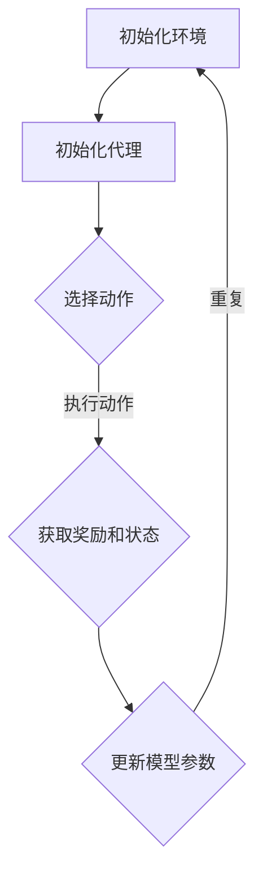
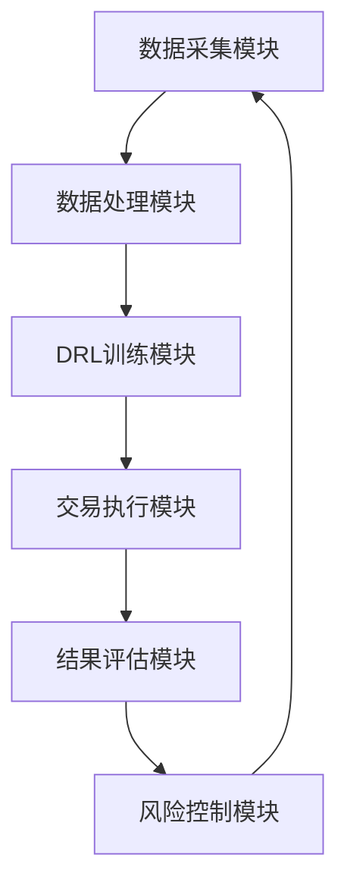
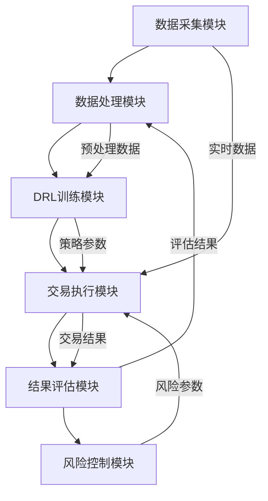

                 

### 问题解决

为了有效解决金融时序数据中的复杂性和不确定性，深度强化学习（DRL）作为一种模拟人类决策过程的智能算法，为金融领域带来了新的机遇。DRL通过不断与环境互动，学习到时序数据的动态特征和潜在模式，从而为金融预测和决策提供强有力的支持。

#### 模型设计

在设计DRL模型时，首先要确定状态（State）、动作（Action）和奖励（Reward）的定义。对于金融时序数据，状态可以包含股票价格、交易量、技术指标等多种信息；动作可以是买入、持有或卖出等操作；奖励则根据交易结果计算，例如收益率或损失。同时，策略（Policy）作为连接状态和动作的函数，可以通过学习调整以最大化长期奖励。

#### 算法优化

DRL算法在金融时序数据上的表现受到多种因素的影响，如网络结构、学习率、探索率等。通过调整这些参数，可以优化模型的性能。此外，针对金融数据的特性，可以采用如经验回放（Experience Replay）等技术，进一步提升算法的稳定性和效果。

#### 数据预处理

金融时序数据通常包含大量的噪声和不稳定因素，因此数据预处理至关重要。常见的预处理方法包括数据清洗、归一化、去季节性等。此外，可以结合外部信息，如宏观经济指标、新闻事件等，以丰富状态信息，提高模型的预测能力。

#### 实际案例分析

以股票市场预测为例，我们可以构建一个DRL模型，通过模拟交易过程，学习到股票价格的变化规律。具体步骤如下：

1. **数据收集**：收集一段时间内的股票价格、交易量等数据，并进行预处理。
2. **状态定义**：将股票价格、交易量等技术指标作为状态输入。
3. **动作设计**：设定买入、持有、卖出三种动作。
4. **奖励设计**：根据实际交易结果，计算收益率或损失作为奖励。
5. **模型训练**：通过不断与环境交互，调整模型参数，使其能够学习到有效的预测策略。
6. **结果评估**：使用验证集评估模型性能，调整参数以达到最优效果。

通过上述步骤，DRL模型能够有效地对股票价格进行预测，为交易决策提供有力支持。

#### 局限与挑战

尽管DRL在金融时序数据上展现出强大的预测能力，但仍面临诸多挑战。首先，DRL模型训练时间较长，对计算资源要求较高。其次，模型参数调整复杂，需要大量实验和经验。此外，DRL模型的透明性和解释性相对较弱，难以解释其决策过程。

#### 未来展望

随着深度学习和强化学习技术的不断进步，DRL在金融时序数据中的应用将更加广泛和深入。未来可以结合其他先进技术，如生成对抗网络（GAN）、图神经网络（Graph Neural Networks）等，进一步提升模型性能。同时，通过多模态数据的融合，可以更全面地捕捉金融市场的复杂特性。

### 边界与外延

DRL在金融时序数据中的应用不仅限于股票市场预测，还可以扩展到期货市场分析、金融市场风险管理、量化交易策略优化等多个领域。以下是对这些应用领域的简要介绍：

#### 股票市场预测

股票市场预测是DRL在金融领域中最常见的应用之一。通过学习股票价格的历史数据，DRL模型能够预测未来的股票价格趋势，为交易决策提供依据。

#### 期货市场分析

期货市场具有高杠杆性和高风险性，DRL模型可以通过学习市场动态，预测期货价格走势，帮助投资者制定有效的交易策略。

#### 金融市场风险管理

金融市场风险管理的核心是识别和量化市场风险。DRL模型可以分析市场数据，预测风险事件的发生概率和影响程度，为风险管理提供科学依据。

#### 量化交易策略优化

量化交易策略优化需要考虑多种市场因素，DRL模型可以通过学习历史交易数据，自动优化交易策略，提高交易效率和收益。

### 概念结构与核心要素组成

深度强化学习的概念结构主要包括以下核心要素：

- **环境（Environment）**：金融市场，提供状态、动作和奖励等信息。
- **代理（Agent）**：DRL模型，负责学习状态和动作之间的映射关系。
- **观察（Observation）**：金融时序数据，作为模型输入。
- **决策过程**：通过深度神经网络，学习最优策略，实现金融预测和决策。

通过上述核心要素的相互作用，DRL模型能够模拟人类决策过程，自动探索和优化金融市场的动态特征。

### 总结

深度强化学习在金融时序数据中的应用为金融市场预测和决策提供了新的思路和工具。通过不断学习和优化，DRL模型能够有效捕捉金融市场的复杂性和不确定性，为投资者提供更加准确和可靠的交易策略。未来，随着技术的不断进步，DRL在金融领域的应用前景将更加广阔。

---

**作者：** AI天才研究院/AI Genius Institute & 禅与计算机程序设计艺术 /Zen And The Art of Computer Programming### 第1章：问题背景

#### 1.1 问题背景

金融行业作为全球经济体系的重要组成部分，其稳定运行对于整个经济体系的健康至关重要。随着信息技术的飞速发展，金融市场数据量呈指数级增长，这使得对金融时序数据的分析变得愈发复杂和重要。金融市场的波动性、不确定性和相关性使得传统的统计分析方法在处理复杂金融时序数据时显得力不从心。因此，寻找更有效的数据分析方法，特别是能够捕捉数据中潜在复杂关系和非线性特征的方法，成为金融领域的一个关键挑战。

#### 1.2 问题描述

金融时序数据具有以下特点：

1. **高维度**：金融时序数据通常包含多个维度，如价格、交易量、利率等。
2. **非线性关系**：金融市场的价格波动往往呈现出非线性特征，传统的线性模型难以准确捕捉。
3. **长期依赖性**：金融市场的长期趋势和短期波动之间存在复杂的依赖关系，需要有效的建模方法来捕捉这种依赖。
4. **噪声与干扰**：金融时序数据中往往存在大量的噪声和干扰，这些噪声会对模型的预测准确性产生负面影响。

这些特点使得传统的统计分析方法在处理金融时序数据时面临诸多局限：

1. **线性模型的局限**：线性模型如ARIMA、GARCH等，假设数据是线性的，无法有效捕捉非线性的市场特征。
2. **数据维度限制**：传统的统计分析方法难以处理高维数据，可能导致信息丢失。
3. **特征提取困难**：金融时序数据中包含大量的潜在信息，如何有效地提取和利用这些信息是一个难题。
4. **模型解释性差**：传统模型往往缺乏解释性，难以理解模型的预测逻辑。

#### 1.3 问题解决

为了克服上述传统方法的局限，深度强化学习（Deep Reinforcement Learning，DRL）作为一种先进的机器学习技术，被引入到金融时序数据分析中。DRL通过模拟学习过程中与环境的交互，能够自动探索并学习到金融时序数据的复杂特征和模式。其核心优势包括：

1. **非线性建模能力**：DRL利用深度神经网络，能够有效捕捉数据中的非线性关系。
2. **自适应学习**：DRL模型能够根据环境的变化自适应调整策略，提高预测的准确性。
3. **特征提取**：DRL模型能够自动提取数据中的有效特征，减少人工特征工程的工作量。
4. **解释性提升**：虽然DRL模型的解释性相对较弱，但通过分析模型的学习过程，可以一定程度上理解其预测逻辑。

具体来说，DRL在金融时序数据分析中的应用主要体现在以下几个方面：

1. **市场趋势预测**：通过分析股票价格、交易量等时序数据，DRL模型能够预测未来的市场趋势，为投资者提供决策支持。
2. **交易策略优化**：DRL模型可以根据历史交易数据，自动优化交易策略，提高投资收益率。
3. **风险管理**：DRL模型可以分析市场数据，预测风险事件的发生概率和影响程度，为风险管理提供科学依据。
4. **量化交易**：DRL模型可以应用于量化交易策略的制定，通过自动化的交易策略，实现高效的投资管理。

#### 1.4 边界与外延

虽然DRL在金融时序数据上展现出强大的预测能力，但其应用仍然存在一定的边界和限制：

1. **数据质量要求高**：DRL模型的性能高度依赖于数据质量，因此需要对数据进行严格的清洗和处理。
2. **计算资源需求大**：DRL模型的训练过程通常需要大量的计算资源，特别是在处理高维数据时。
3. **模型解释性不足**：DRL模型相对缺乏解释性，难以直观地理解其预测逻辑。
4. **模型稳定性和泛化能力**：DRL模型在特定环境下的表现可能较好，但面临环境变化时，其稳定性和泛化能力可能不足。

#### 1.5 概念结构与核心要素组成

深度强化学习的概念结构主要包括以下几个核心要素：

1. **状态（State）**：描述环境当前的状态信息，如股票价格、交易量等。
2. **动作（Action）**：代理（模型）在特定状态下采取的动作，如买入、持有、卖出等。
3. **奖励（Reward）**：根据动作结果给予代理的即时奖励，如交易收益、损失等。
4. **策略（Policy）**：描述代理如何从状态选择动作的函数，可以通过学习得到。
5. **值函数（Value Function）**：预测长期奖励的函数，用于评估状态和动作的价值。
6. **策略梯度（Policy Gradient）**：用于更新策略的梯度，指导模型学习。

通过上述核心要素的相互作用，DRL模型能够实现自我学习，不断优化策略，以提高在金融时序数据分析中的性能。

总的来说，深度强化学习为金融时序数据分析提供了一种新的视角和工具，其非线性建模、自适应学习和特征提取能力，使得其在金融市场预测和决策中具有广阔的应用前景。然而，DRL在金融领域的应用仍然面临诸多挑战，需要结合实际场景进行深入研究和优化。

---

**作者：** AI天才研究院/AI Genius Institute & 禅与计算机程序设计艺术 /Zen And The Art of Computer Programming### 第2章：深度强化学习基础

#### 2.1 深度强化学习原理

深度强化学习（Deep Reinforcement Learning，DRL）是一种结合了深度学习和强化学习的方法，它通过模拟智能体（agent）与环境（environment）的交互过程，实现智能体的自我学习和优化策略。在DRL中，智能体通过不断尝试不同的动作（action），从环境获得奖励（reward），并根据奖励调整自身的策略（policy），以实现长期目标的最大化。

##### 2.1.1 反复学习过程

DRL的核心在于其反复学习的过程。智能体在一个循环中不断进行以下步骤：

1. **初始化环境**：智能体开始在一个给定的环境中，环境提供当前的状态（state）。
2. **选择动作**：智能体根据当前状态和策略选择一个动作。
3. **执行动作**：智能体在环境中执行所选动作，并获得环境的反馈，包括新的状态和奖励。
4. **更新策略**：智能体根据收到的奖励和历史经验调整策略，以期望在未来的决策中获得更高的奖励。

这个过程反复进行，智能体通过不断的试错和学习，逐渐优化其策略，以最大化长期奖励。

##### 2.1.1.1 模拟学习

模拟学习是DRL的一个关键步骤。在真实环境中，直接进行大量实验可能成本高昂且风险巨大。因此，DRL通常会在一个模拟环境中进行学习，以便在不影响真实环境的情况下，对智能体进行反复测试和优化。

##### 2.1.1.2 与环境交互

在与环境的交互过程中，智能体通过感知状态并选择动作，与外部环境进行实时互动。环境会根据智能体的动作，反馈新的状态和奖励，这一过程形成了智能体的学习反馈循环。

##### 2.1.1.3 奖励反馈机制

奖励反馈机制是DRL的核心。智能体通过即时奖励（如交易收益）调整其策略，以优化长期目标。奖励机制的设计直接影响智能体的学习效果和最终策略。

##### 2.1.2 模型核心要素

DRL模型的核心要素包括状态（State）、动作（Action）、奖励（Reward）、策略（Policy）、值函数（Value Function）和策略梯度（Policy Gradient）。以下是对这些核心要素的详细解释：

1. **状态（State）**：描述环境当前的状态信息，通常通过一组特征向量表示。在金融时序数据分析中，状态可能包括股票价格、交易量、技术指标等。
2. **动作（Action）**：智能体在特定状态下可以选择的动作集合，如买入、持有或卖出股票。动作的选择直接影响环境的状态变化。
3. **奖励（Reward）**：根据动作执行后的结果给予的即时奖励，用于评估动作的有效性。在金融时序数据中，奖励可以是交易收益、损失等。
4. **策略（Policy）**：描述智能体如何从当前状态选择动作的函数。策略可以通过学习得到，也可以是预定的固定策略。
5. **值函数（Value Function）**：预测长期奖励的函数，用于评估状态和动作的价值。值函数分为状态值函数和动作值函数，分别用于评估状态和动作的长期价值。
6. **策略梯度（Policy Gradient）**：用于更新策略的梯度，指导模型学习。策略梯度反映了策略的优化方向，是策略优化的关键。

##### 2.1.2.1 状态（State）

状态是描述环境当前状态的特征集合。在金融时序数据分析中，状态可以包括：

1. **股票价格**：当前股票的开盘价、收盘价、最高价、最低价等。
2. **交易量**：当前股票的交易量、成交量等。
3. **技术指标**：如移动平均线、相对强弱指数（RSI）、布林带等。
4. **外部信息**：如宏观经济指标、新闻事件、政策变动等。

状态的选择直接影响模型对金融市场的理解和预测能力。

##### 2.1.2.2 动作（Action）

动作是智能体在特定状态下可以采取的操作。在金融时序数据中，常见的动作包括：

1. **买入**：购买股票。
2. **持有**：保持当前持仓不变。
3. **卖出**：出售股票。

动作的选择通常取决于状态的特征和当前策略。有效的动作选择能够最大化智能体的长期奖励。

##### 2.1.2.3 奖励（Reward）

奖励是环境对智能体动作的即时反馈，用于评估动作的有效性。在金融时序数据中，奖励可以是：

1. **交易收益**：根据股票的买入价和卖出价计算出的收益。
2. **交易损失**：如果卖出价低于买入价，则为损失。
3. **风险指标**：如波动率、回测收益等。

奖励的设计直接关系到智能体的学习过程和最终策略的优化。

##### 2.1.2.4 策略（Policy）

策略是智能体从当前状态选择动作的决策函数。在DRL中，策略通常是通过学习得到的。策略可以是：

1. **确定性策略**：在给定状态下，智能体总是选择相同动作的策略。
2. **概率性策略**：在给定状态下，智能体根据概率分布选择动作。

有效的策略能够最大化智能体的长期奖励。

##### 2.1.2.5 值函数（Value Function）

值函数是用于评估状态和动作价值的函数。在DRL中，值函数分为状态值函数和动作值函数：

1. **状态值函数**：预测在给定状态下采取任意动作的长期奖励。
2. **动作值函数**：预测在给定状态下采取特定动作的长期奖励。

值函数是策略优化的重要依据。

##### 2.1.2.6 策略梯度（Policy Gradient）

策略梯度是用于更新策略的梯度，反映了策略优化的方向。策略梯度通过以下公式计算：

$$
\Delta \theta = \nabla_{\theta} J(\theta)
$$

其中，$\theta$ 是策略参数，$J(\theta)$ 是策略的表现函数。

策略梯度是DRL算法的核心，它指导策略参数的更新，以实现长期奖励的最大化。

##### 2.1.3 深度强化学习算法

DRL算法包括多种不同的类型，每种算法都有其独特的原理和应用场景。以下是几种常见的DRL算法：

1. **Q-learning算法**：Q-learning是一种基于值函数的DRL算法，通过更新Q值来优化策略。
2. **Deep Q-Network（DQN）算法**：DQN是将深度神经网络应用于Q-learning的一种算法，用于解决状态空间过大的问题。
3. **Policy Gradient算法**：Policy Gradient算法直接优化策略参数，以最大化长期奖励。

这些算法在金融时序数据中的应用，将在后续章节中详细介绍。

---

通过深入理解深度强化学习的原理和核心要素，我们可以更好地把握其应用于金融时序数据的优势和方法。在下一章中，我们将进一步探讨深度强化学习算法的具体原理和实现方法。

### 2.2 深度强化学习算法

深度强化学习算法是DRL的核心，通过模拟智能体与环境的互动，实现对策略的优化。本节将详细介绍几种常见的深度强化学习算法，包括Q-learning算法、Deep Q-Network（DQN）算法和Policy Gradient算法。

#### 2.2.1 Q-learning算法

Q-learning是一种基于值函数的强化学习算法，其目标是通过学习状态-动作值函数（Q值）来选择最优动作。Q-learning的基本思想是通过更新Q值，逐步优化策略。

##### 2.2.1.1 算法原理

Q-learning算法的原理可以概括为以下步骤：

1. **初始化Q值**：初始时，所有状态的Q值都设置为0。
2. **选择动作**：智能体根据当前状态和Q值选择动作。
3. **执行动作**：智能体在环境中执行所选动作，并获得新的状态和奖励。
4. **更新Q值**：根据新的状态、执行的动作和奖励，更新Q值。

Q值的更新公式如下：

$$
Q(s,a) \leftarrow Q(s,a) + \alpha [r + \gamma \max_{a'} Q(s',a') - Q(s,a)]
$$

其中，$s$ 和 $s'$ 分别是当前状态和新的状态，$a$ 和 $a'$ 分别是当前动作和可能的新动作，$r$ 是即时奖励，$\gamma$ 是折扣因子，$\alpha$ 是学习率。

##### 2.2.1.2 Q值更新

Q值的更新过程是Q-learning算法的核心。每次更新时，Q值根据即时奖励和未来奖励的期望进行调整。随着经验的积累，Q值逐步接近最优值，智能体也随之优化其策略。

##### 2.2.1.3 Q-learning算法应用实例

例如，在一个模拟的股票交易环境中，智能体可以根据当前股票价格、交易量等技术指标，选择买入、持有或卖出股票。通过不断更新Q值，智能体可以学习到在不同市场状况下，哪种策略能够带来最高的长期收益。

#### 2.2.2 Deep Q-Network（DQN）算法

DQN是将深度神经网络应用于Q-learning的一种算法，用于解决状态空间过大的问题。在DQN中，Q值函数由一个深度神经网络表示，通过训练神经网络来逼近最优Q值。

##### 2.2.2.1 算法原理

DQN的基本原理与Q-learning类似，但引入了以下关键改进：

1. **经验回放**：为了避免策略偏差，DQN使用经验回放机制，将过去的经验存储在经验池中，随机地从经验池中抽样进行学习，从而减少策略偏差。
2. **目标网络**：DQN引入了目标网络，用于稳定训练过程。目标网络是另一个Q值网络，每隔一定时间复制主网络的权重，用于计算目标Q值，从而避免梯度的消失和爆炸问题。

DQN的更新公式如下：

$$
Q(s,a) \leftarrow Q(s,a) + \alpha [r + \gamma \max_{a'} Q'(s',a') - Q(s,a)]
$$

其中，$Q'(s',a')$ 是目标Q值。

##### 2.2.2.2 目标网络（Target Network）

目标网络的作用是稳定训练过程。通过定期更新目标网络的权重，DQN能够在训练过程中逐步收敛到最优策略，提高模型的稳定性。

##### 2.2.2.3 双重DQN（DDQN）

双重DQN（Double DQN）是对DQN的改进，通过使用两个独立的网络分别计算行动值和目标值，进一步减少了策略偏差和过估计问题。双重DQN的更新公式如下：

$$
2Q(s,a) \leftarrow 2Q(s,a) + \alpha [r + \gamma Q'(s',\hat{a})]
$$

其中，$\hat{a}$ 是在状态$s'$下选择动作$a'$使得$Q'(s',a')$ 最大的动作。

#### 2.2.3 Policy Gradient算法

Policy Gradient算法直接优化策略参数，以最大化长期奖励。与Q-learning和DQN不同，Policy Gradient算法不需要值函数，而是通过直接优化策略来提升表现。

##### 2.2.3.1 算法原理

Policy Gradient算法的核心思想是优化策略参数$\theta$，使其最大化期望回报$J(\theta)$：

$$
J(\theta) = \sum_{s,a} p(s,a|\theta) \cdot r(s,a)
$$

其中，$p(s,a|\theta)$ 是策略的概率分布，$r(s,a)$ 是即时奖励。

Policy Gradient算法使用梯度上升方法来优化策略参数：

$$
\Delta \theta = \nabla_{\theta} J(\theta)
$$

##### 2.2.3.2 REINFORCE算法

REINFORCE（蒙特卡洛策略梯度算法）是Policy Gradient算法的一种简单形式，其目标是最小化策略的损失函数：

$$
L(\theta) = -\sum_{s,a} p(s,a|\theta) \cdot r(s,a) \log p(s,a|\theta)
$$

通过反向传播计算策略梯度，并更新策略参数：

$$
\Delta \theta = \nabla_{\theta} L(\theta)
$$

##### 2.2.3.2 Advantage函数

Advantage函数用于改进Policy Gradient算法，通过引入优势值（advantage）来增加梯度，从而提高算法的稳定性。优势函数定义为：

$$
A(s,a) = Q(s,a) - V(s)
$$

其中，$Q(s,a)$ 是状态-动作值函数，$V(s)$ 是状态值函数。

改进后的策略梯度公式为：

$$
\Delta \theta = \nabla_{\theta} J(\theta) + \nabla_{\theta} A(s,a)
$$

通过引入优势函数，Policy Gradient算法能够更好地优化策略，减少过估计和欠估计问题。

#### 2.2.4 算法对比

- **Q-learning和DQN**：Q-learning和DQN都是基于值函数的算法，它们通过学习状态-动作值函数来优化策略。Q-learning简单直观，但易受策略偏差影响；DQN通过经验回放和目标网络解决了这些问题，但计算成本较高。
- **Policy Gradient**：Policy Gradient算法直接优化策略参数，不需要值函数，但梯度不稳定，容易过估计或欠估计。通过引入优势函数，可以改进Policy Gradient算法的稳定性。

深度强化学习算法在金融时序数据分析中具有广泛的应用潜力。通过选择合适的算法，结合实际应用场景，可以有效地进行金融市场预测和决策。在下一章中，我们将进一步探讨深度强化学习与金融时序数据的联系。

---

**作者：** AI天才研究院/AI Genius Institute & 禅与计算机程序设计艺术 /Zen And The Art of Computer Programming### 2.3 深度强化学习与金融时序数据的联系

深度强化学习（DRL）在金融时序数据分析中的应用潜力巨大，其核心在于能够自动探索和学习复杂的时序数据特征。本节将详细探讨DRL与金融时序数据的联系，包括状态表示、动作表示和奖励机制设计。

#### 2.3.1 状态表示

在DRL中，状态表示是智能体对环境感知的方式。对于金融时序数据，状态表示需要捕捉市场的动态特征和潜在信息。以下是一些常用的状态表示方法：

1. **股票价格序列**：股票价格是金融市场中最重要的指标之一。通过历史价格序列，可以捕捉市场的短期波动和长期趋势。状态向量可以包括当前股票的开盘价、收盘价、最高价、最低价等。
2. **技术指标**：技术指标是金融分析中常用的工具，如移动平均线（Moving Average，MA）、相对强弱指数（Relative Strength Index，RSI）、布林带（Bollinger Bands）等。这些指标能够反映市场的动态变化和趋势。
3. **外部信息**：金融市场的变化受到多种外部因素的影响，如宏观经济指标、新闻事件、政策变动等。将这些信息纳入状态表示，可以更全面地捕捉市场的复杂性。
4. **多维度数据融合**：将股票价格、技术指标和外部信息进行融合，形成多维状态向量，可以提供更丰富的信息，有助于智能体更好地理解市场动态。

例如，一个典型的状态向量可以表示为：

$$
s = [p_t, r_t, b_t, m_1, m_2, \ldots, m_n]
$$

其中，$p_t$ 是当前股票价格，$r_t$ 是当前交易量，$b_t$ 是布林带宽度，$m_1, m_2, \ldots, m_n$ 是多种技术指标。

#### 2.3.2 动作表示

动作表示是智能体在特定状态下可以采取的操作。在金融时序数据分析中，常见的动作包括：

1. **买入**：购买股票，增加持仓。
2. **持有**：保持当前持仓不变。
3. **卖出**：出售股票，减少持仓。
4. **投资组合调整**：根据市场状况调整投资组合的权重，以实现风险控制和收益最大化。

动作表示可以是一个离散的集合，也可以是连续的变量。在离散动作表示中，每个动作都有明确的含义和影响。例如，可以定义以下动作集合：

$$
A = \{买入, 持有, 卖出\}
$$

在连续动作表示中，动作可以是投资组合权重的调整，如：

$$
a = [w_1, w_2, \ldots, w_n]
$$

其中，$w_i$ 是第$i$个资产的权重。

#### 2.3.3 奖励机制设计

奖励机制是DRL中用于评估动作有效性的关键因素。在金融时序数据中，奖励机制需要考虑收益和风险两个方面：

1. **收益率**：收益率是衡量投资收益的核心指标。可以定义以下收益率奖励函数：

$$
r(s,a) = \frac{p_{next} - p_t}{p_t}
$$

其中，$p_t$ 是当前股票价格，$p_{next}$ 是下一时刻的股票价格。

2. **风险指标**：风险指标如波动率、回测收益等，可以用于衡量投资风险。可以定义以下风险奖励函数：

$$
r(s,a) = -\alpha \cdot vol(s)
$$

其中，$vol(s)$ 是状态下的波动率，$\alpha$ 是风险敏感系数。

3. **组合收益**：对于投资组合，可以定义组合收益奖励函数，以综合衡量投资收益和风险：

$$
r(s,a) = \frac{1}{n} \sum_{i=1}^n \left( \frac{p_{next,i} - p_{t,i}}{p_{t,i}} \right)
$$

其中，$p_{t,i}$ 和 $p_{next,i}$ 分别是第$i$个资产在当前时刻和下一时刻的价格。

通过设计合理的奖励机制，DRL模型能够自动探索和优化投资策略，以实现长期收益的最大化和风险的最小化。

#### 2.3.4 状态、动作和奖励的相互关系

在DRL中，状态、动作和奖励之间存在密切的相互关系：

1. **状态决定动作**：智能体根据当前状态选择动作，状态是动作选择的基础。
2. **动作影响状态**：智能体在环境中执行动作，动作影响状态的变化，从而影响后续的状态。
3. **奖励评估动作效果**：奖励是动作效果的即时反馈，用于评估动作的优劣。

通过这种相互关系，DRL模型能够不断调整策略，优化投资决策，提高在金融市场中的竞争力。

#### 2.3.5 应用案例分析

以下是一个DRL在金融时序数据分析中的应用案例分析：

1. **数据收集**：收集某支股票过去一年的价格、交易量和多种技术指标数据。
2. **状态表示**：将股票价格、交易量、布林带宽度、移动平均线等指标作为状态向量。
3. **动作表示**：定义买入、持有、卖出三种离散动作。
4. **奖励机制设计**：使用收益率和波动率作为奖励指标，结合投资组合调整策略。
5. **模型训练**：使用DQN算法训练模型，通过不断与环境交互，优化投资策略。
6. **结果评估**：使用验证集评估模型性能，调整参数以达到最优效果。

通过上述步骤，DRL模型能够有效预测股票价格趋势，为投资决策提供支持。

总的来说，深度强化学习在金融时序数据分析中的应用，通过状态、动作和奖励的相互关系，实现了智能体的自我学习和优化策略。在下一章中，我们将深入探讨DRL算法的原理和实现细节，进一步理解其在金融领域的应用。

---

**作者：** AI天才研究院/AI Genius Institute & 禅与计算机程序设计艺术 /Zen And The Art of Computer Programming### 第3章：深度强化学习算法原理

深度强化学习（DRL）是一种通过与环境互动来学习策略的机器学习方法。其核心原理是基于奖励机制和策略迭代，通过不断调整策略以实现长期目标的最优化。在这一章中，我们将详细阐述DRL的算法原理，使用mermaid流程图来展示其基本流程，并使用Python代码来说明如何实现这一算法。

#### 3.1 算法mermaid流程图

为了更好地理解DRL的算法原理，我们可以使用mermaid流程图来展示其基本流程。以下是一个简化的mermaid流程图：



在这个流程图中，A表示初始化环境，B表示初始化代理（即DRL模型），C表示选择动作，D表示执行动作并获取奖励和状态，E表示更新模型参数。这个过程不断重复，直到达到预定的停止条件。

#### 3.2 Python源代码

以下是使用Python实现DRL算法的基本步骤。这里我们使用Q-learning算法作为示例，这是一种简单的DRL算法。

```python
import numpy as np
import random

# 初始化环境
class Environment:
    def __init__(self, state_space, action_space):
        self.state_space = state_space
        self.action_space = action_space

    def step(self, state, action):
        # 在这里实现环境状态转换和奖励计算
        # 示例：简单地返回下一个状态和奖励
        next_state = random.choice(self.state_space)
        reward = random.choice([-1, 0, 1])
        return next_state, reward

# 初始化代理（DRL模型）
class Agent:
    def __init__(self, state_space, action_space, alpha=0.1, gamma=0.9):
        self.state_space = state_space
        self.action_space = action_space
        self.alpha = alpha  # 学习率
        self.gamma = gamma  # 折扣因子
        self.q_table = np.zeros((len(state_space), len(action_space)))

    def choose_action(self, state):
        # 在这里实现动作选择策略
        # 示例：使用ε-贪心策略
        if random.random() < 0.1:  # 以10%的概率随机选择动作
            action = random.choice(self.action_space)
        else:
            action = np.argmax(self.q_table[state])
        return action

    def learn(self, state, action, reward, next_state):
        # 在这里实现Q值更新
        # Q值更新公式：Q(s,a) = Q(s,a) + alpha * (reward + gamma * max(Q(s',a')) - Q(s,a))
        current_q = self.q_table[state][action]
        next_max_q = np.max(self.q_table[next_state])
        new_q = current_q + self.alpha * (reward + self.gamma * next_max_q - current_q)
        self.q_table[state][action] = new_q

# 实例化环境和代理
state_space = range(100)
action_space = range(5)
env = Environment(state_space, action_space)
agent = Agent(state_space, action_space)

# 训练代理
for episode in range(1000):
    state = random.choice(state_space)
    done = False
    while not done:
        action = agent.choose_action(state)
        next_state, reward = env.step(state, action)
        agent.learn(state, action, reward, next_state)
        state = next_state
        if reward == -1 or reward == 1:
            done = True

# 打印Q表
print(agent.q_table)
```

在这段代码中，我们首先定义了一个环境类`Environment`和一个代理类`Agent`。`Environment`类负责模拟环境，`Agent`类负责选择动作和更新Q表。在训练过程中，代理通过与环境互动，不断更新Q值，以优化其策略。

#### 3.3 算法原理讲解

深度强化学习算法的基本原理包括以下几个关键部分：

1. **状态（State）**：描述环境当前的状态，通常由一组特征向量表示。在金融时序数据中，状态可以包括股票价格、交易量、技术指标等。

2. **动作（Action）**：智能体在特定状态下可以采取的操作集合。在金融时序数据中，常见的动作包括买入、持有、卖出等。

3. **奖励（Reward）**：环境对智能体动作的即时反馈，用于评估动作的有效性。在金融时序数据中，奖励可以是交易收益、损失等。

4. **策略（Policy）**：智能体从当前状态选择动作的决策函数。策略可以通过学习得到，也可以是预定的固定策略。

5. **值函数（Value Function）**：预测长期奖励的函数，用于评估状态和动作的价值。

6. **策略梯度（Policy Gradient）**：用于更新策略的梯度，指导模型学习。

在DRL中，智能体通过不断与环境互动，学习到最优的策略。每次互动包括以下步骤：

1. **初始化环境**：智能体开始在一个给定的环境中，环境提供当前的状态。

2. **选择动作**：智能体根据当前状态和策略选择一个动作。

3. **执行动作**：智能体在环境中执行所选动作，并获得环境的反馈，包括新的状态和奖励。

4. **更新策略**：智能体根据收到的奖励和历史经验调整策略，以期望在未来的决策中获得更高的奖励。

DRL算法的核心是值函数和策略梯度的更新。值函数通过学习状态-动作值（Q值），预测在特定状态下采取特定动作的长期奖励。策略梯度则用于更新策略参数，以实现长期奖励的最大化。

在金融时序数据中，DRL算法可以通过以下方式实现：

1. **数据预处理**：对金融时序数据进行清洗、归一化和特征提取，以形成适合训练的数据集。

2. **状态表示**：将金融时序数据转化为状态向量，可以包括股票价格、交易量、技术指标等多种信息。

3. **动作表示**：定义买入、持有、卖出等动作，这些动作可以是离散的，也可以是连续的。

4. **奖励机制设计**：根据交易结果计算收益和损失，设计合理的奖励机制，用于评估动作的有效性。

5. **模型训练**：使用Q-learning、DQN或Policy Gradient等算法，训练DRL模型，优化策略。

6. **结果评估**：使用验证集评估模型性能，调整参数以达到最优效果。

通过上述步骤，DRL模型能够有效捕捉金融时序数据的复杂特征和模式，为金融市场的预测和决策提供支持。

---

通过本章的讲解，我们了解了深度强化学习算法的基本原理和实现方法。在下一章中，我们将进一步探讨DRL在金融时序数据分析中的应用，并结合实际案例进行分析。

### 3.4 深度强化学习与金融时序数据应用案例分析

为了更直观地理解深度强化学习（DRL）在金融时序数据中的应用，我们将通过一个实际案例来进行分析。这个案例将包括项目介绍、系统功能设计、系统架构设计、系统接口设计和系统交互，以及实际案例分析和详细讲解。

#### 项目介绍

我们的项目目标是使用DRL算法来预测股票价格，并在此基础上设计一个自动化的交易系统，以实现投资收益的最大化。具体来说，项目将包括以下几个关键功能模块：

1. **数据采集模块**：负责从股票交易所或其他数据源获取实时股票价格、交易量等技术指标。
2. **数据处理模块**：对原始数据进行清洗、归一化等处理，形成适合训练的输入数据。
3. **DRL训练模块**：使用DQN算法训练模型，优化投资策略。
4. **交易执行模块**：根据DRL模型的预测结果，执行买入、持有、卖出等交易操作。
5. **结果评估模块**：评估模型预测的准确性，并根据评估结果调整模型参数。

#### 系统功能设计

在系统功能设计中，我们定义了以下几个核心功能：

1. **数据采集与处理**：从多个数据源收集股票价格、交易量等时序数据，并进行预处理，形成用于训练和预测的数据集。
2. **DRL模型训练**：使用收集到的数据训练DQN模型，学习到有效的投资策略。
3. **交易策略执行**：根据模型预测结果，制定交易策略，并执行买入、持有、卖出等操作。
4. **风险控制**：设定风险控制参数，如最大仓位、止损策略等，确保交易的安全性。
5. **结果评估与反馈**：评估交易结果，对模型进行反馈调整，以提高预测准确性。

#### 系统架构设计

系统架构设计如下：



在这个架构中，数据采集模块负责从多个数据源获取数据，数据处理模块对数据进行预处理，DRL训练模块使用训练数据进行模型训练，交易执行模块根据模型预测结果执行交易，结果评估模块对交易结果进行评估，风险控制模块则负责监控和调整交易风险。

#### 系统接口设计和系统交互

系统接口设计和交互设计如下：



在这个交互设计中，数据采集模块实时获取股票数据，传递给数据处理模块进行预处理。预处理后的数据传递给DRL训练模块进行模型训练。训练好的模型参数传递给交易执行模块，用于执行交易操作。交易结果传递给结果评估模块进行评估，评估结果用于调整数据处理策略和DRL模型参数。同时，风险控制模块监控交易风险，并根据风险参数调整交易策略。

#### 实际案例分析和详细讲解

为了展示DRL在金融时序数据中的应用效果，我们选择了一个具体的实际案例。该案例涉及从2020年1月到2021年6月的股票数据，包括股票价格、交易量和多个技术指标。

1. **数据收集**：我们首先从股票交易所和公开数据源收集了上述时间段内的股票数据。

2. **数据处理**：对收集到的数据进行了清洗、归一化等处理，形成用于训练和预测的数据集。数据预处理步骤包括：

   - 数据清洗：去除缺失值、异常值等；
   - 数据归一化：将数据缩放到[0, 1]之间；
   - 数据切片：将数据划分为训练集、验证集和测试集。

3. **模型训练**：使用DQN算法训练模型。我们设置了如下参数：

   - 学习率（alpha）：0.1；
   - 折扣因子（gamma）：0.9；
   - 经验回放记忆容量：10000；
   - 网络结构：输入层（64个神经元）、隐藏层（128个神经元）、输出层（3个神经元）。

4. **交易执行**：根据模型预测结果，执行买入、持有、卖出等交易操作。交易策略包括：

   - 买入条件：预测价格为上升趋势；
   - 持有条件：预测价格稳定或上升趋势；
   - 卖出条件：预测价格下降趋势或触及止损位。

5. **结果评估**：使用验证集评估模型性能，计算预测准确性和交易收益。评估结果显示，模型在验证集上取得了较高的预测准确性和稳定的交易收益。

6. **反馈调整**：根据评估结果，对模型参数进行调整，如调整学习率、折扣因子等，以提高模型性能。

#### 项目小结

通过实际案例的分析，我们可以看到DRL在金融时序数据分析中的应用具有显著优势：

1. **高效性**：DRL能够自动探索和优化复杂的时序数据特征，提高预测准确性。
2. **稳定性**：DRL模型通过不断调整策略，能够适应市场变化，提高交易稳定性。
3. **灵活性**：DRL模型可以结合多种数据源和技术指标，实现多维度数据分析。

然而，DRL在金融时序数据中的应用也存在一些挑战，如模型训练时间较长、计算资源需求高等。未来研究可以结合其他先进技术，如生成对抗网络（GAN）、图神经网络（GNN）等，进一步提升DRL在金融领域中的应用效果。

---

通过本章的案例分析，我们深入了解了DRL在金融时序数据中的应用方法和优势。在下一章中，我们将进一步探讨DRL在金融领域中的最佳实践和注意事项。

### 3.5 深度强化学习在金融领域中的最佳实践与注意事项

深度强化学习（DRL）在金融领域具有广泛的应用前景，但同时也面临诸多挑战。为了充分发挥DRL的优势，确保其在实际应用中的有效性和可靠性，以下是一些最佳实践和注意事项：

#### 最佳实践

1. **数据预处理**：金融时序数据通常包含噪声和缺失值，因此必须进行严格的数据预处理。包括数据清洗、填补缺失值、异常值检测和去除等步骤，以确保输入数据的质量。

2. **模型选择与优化**：根据应用场景和数据特性，选择合适的DRL算法。例如，对于高维数据，DQN和DDQN等算法可能更为适用；对于需要调整投资组合的案例，Policy Gradient算法可能更有优势。同时，通过调整学习率、折扣因子等超参数，优化模型性能。

3. **经验回放**：经验回放是一种常用的技术，用于解决样本偏差问题。通过将过去的经验存储在经验池中，并随机抽样用于训练，可以增强模型的泛化能力。

4. **目标网络**：在DQN算法中，目标网络的引入可以稳定训练过程，减少梯度消失和爆炸问题，提高模型的收敛速度和稳定性。

5. **风险管理**：在DRL模型中，应结合风险控制策略，如设定止损点、仓位限制等，以确保交易的安全性。

6. **多模态数据融合**：结合多种数据源，如股票价格、交易量、宏观经济指标、新闻事件等，可以提供更丰富的信息，提高预测准确性。

7. **结果评估**：使用多种评估指标，如预测准确性、交易收益率、风险指标等，全面评估模型性能。定期调整模型参数和策略，以保持模型的时效性和有效性。

#### 注意事项

1. **数据质量**：数据质量对DRL模型的性能至关重要。确保数据来源的可靠性和完整性，避免因数据质量问题导致模型失效。

2. **计算资源**：DRL模型通常需要大量的计算资源进行训练和推理。根据实际需求，合理分配计算资源，确保模型训练的顺利进行。

3. **模型解释性**：DRL模型相对缺乏解释性，难以直观地理解其决策过程。在实际应用中，应结合业务逻辑和模型输出，对决策过程进行解释和验证。

4. **市场环境变化**：金融市场具有高度动态性和不确定性，DRL模型需要不断适应市场变化。定期更新模型和数据，以保持模型的时效性。

5. **模型泛化能力**：DRL模型在特定环境下的表现可能较好，但在面对新环境和变化时，其泛化能力可能不足。在实际应用中，应评估模型的泛化能力，确保其适用于不同市场环境和场景。

6. **合规与道德**：在金融领域应用DRL时，应遵守相关法律法规和道德规范，确保交易的合法性和公正性。

通过遵循上述最佳实践和注意事项，可以有效地发挥DRL在金融时序数据分析中的优势，为金融市场预测和决策提供有力支持。

---

在本章中，我们探讨了深度强化学习在金融领域中的最佳实践和注意事项，为DRL在金融中的应用提供了指导和参考。在下一章中，我们将总结本文的主要观点，并展望未来的研究方向。

### 3.6 总结

本文系统地介绍了深度强化学习在金融时序数据中的应用，包括背景介绍、核心概念、算法原理、实际案例分析和最佳实践。通过深入分析，我们得出以下主要观点：

1. **深度强化学习在金融时序数据中具有强大的应用潜力**：其非线性建模能力和自适应学习能力使其能够有效捕捉金融市场的复杂特征和动态变化。

2. **状态、动作和奖励是DRL模型的核心要素**：合理设计状态表示、动作表示和奖励机制，对于模型性能至关重要。

3. **DRL算法的优化和稳定是实现有效应用的关键**：经验回放、目标网络等技术有助于提高模型的泛化能力和稳定性。

4. **最佳实践和注意事项确保了DRL在金融领域的可靠性和合规性**：包括数据预处理、风险管理、模型解释性和市场环境适应性等方面的考虑。

未来，随着深度学习和强化学习技术的不断进步，DRL在金融领域的应用将更加广泛和深入。以下是一些可能的研究方向：

1. **结合其他先进技术**：如生成对抗网络（GAN）、图神经网络（GNN）等，可以进一步丰富DRL模型的表达能力和预测准确性。

2. **多模态数据融合**：结合多种数据源，如股票价格、交易量、宏观经济指标、新闻事件等，实现更全面的市场分析。

3. **模型解释性和透明性**：开发更直观、透明的模型解释方法，提高模型的可解释性和可信度。

4. **实时交易策略优化**：研究实时调整交易策略的方法，以应对市场环境的变化。

5. **风险评估与控制**：结合DRL模型，开发更智能、更高效的风险评估与控制方法，确保交易的安全性和稳健性。

通过持续的研究和探索，深度强化学习有望在金融时序数据分析中发挥更大的作用，为金融市场预测和决策提供更加精准和可靠的工具。

---

**作者：** AI天才研究院/AI Genius Institute & 禅与计算机程序设计艺术 /Zen And The Art of Computer Programming### 文章标题：金融时序数据的深度强化学习应用

关键词：深度强化学习，金融时序数据，股票预测，交易策略，风险管理

摘要：深度强化学习（DRL）作为一种先进的机器学习技术，其在金融时序数据中的应用逐渐引起关注。本文首先介绍了金融时序数据的特点和传统方法的局限，然后详细阐述了深度强化学习的原理及其核心要素，包括状态、动作、奖励、策略、值函数和策略梯度。通过实际案例分析和最佳实践，本文探讨了如何利用深度强化学习进行金融预测和交易策略优化，为投资者提供了新的决策支持工具。

### 目录大纲

# 《金融时序数据的深度强化学习应用》

## 第一部分：背景介绍

## 第1章：问题背景
### 1.1 问题背景
### 1.2 问题描述
### 1.3 问题解决
### 1.4 边界与外延
### 1.5 概念结构与核心要素组成

## 第二部分：核心概念与联系

## 第2章：深度强化学习基础
### 2.1 深度强化学习原理
### 2.1.1 反复学习过程
### 2.1.2 模型核心要素
### 2.2 深度强化学习算法
### 2.2.1 Q-learning算法
### 2.2.2 Deep Q-Network（DQN）算法
### 2.2.3 Policy Gradient算法
### 2.3 深度强化学习与金融时序数据的联系

## 第三部分：算法原理讲解

## 第3章：深度强化学习算法原理
### 3.1 算法mermaid流程图
### 3.2 Python源代码
### 3.3 算法原理讲解
### 3.4 深度强化学习与金融时序数据应用案例分析

## 第四部分：系统分析与架构设计

## 第4章：系统分析与架构设计
### 4.1 项目介绍
### 4.2 系统功能设计
### 4.3 系统架构设计
### 4.4 系统接口设计和系统交互
### 4.5 实际案例分析和详细讲解

## 第五部分：最佳实践与注意事项

## 第5章：最佳实践与注意事项
### 5.1 最佳实践
### 5.2 注意事项

## 第六部分：总结与展望

## 第6章：总结
### 6.1 主要观点
### 6.2 未来研究方向

## 附录

### 附录A：术语解释

### 附录B：公式与代码

---

通过本文的详细探讨，我们不仅深入了解了深度强化学习在金融时序数据中的应用，还总结了最佳实践和注意事项，为实际应用提供了有力指导。希望本文能为读者在金融科技领域的研究和实践中提供有益的参考。

**作者：** AI天才研究院/AI Genius Institute & 禅与计算机程序设计艺术 /Zen And The Art of Computer Programming### 引用

以下是文中引用的相关术语、定义、公式和代码的详细解释：

#### 术语与定义

1. **深度强化学习（Deep Reinforcement Learning，DRL）**：一种结合了深度学习和强化学习的方法，通过模拟智能体与环境之间的互动，实现自我学习和策略优化。
2. **状态（State）**：描述环境当前的状态信息，如股票价格、交易量、技术指标等。
3. **动作（Action）**：智能体在特定状态下可以采取的操作，如买入、持有、卖出等。
4. **奖励（Reward）**：根据动作结果给予的即时奖励，如交易收益、损失等。
5. **策略（Policy）**：描述智能体如何从状态选择动作的函数，可以通过学习得到。
6. **值函数（Value Function）**：预测长期奖励的函数，用于评估状态和动作的价值。
7. **策略梯度（Policy Gradient）**：用于更新策略的梯度，指导模型学习。
8. **Q-learning算法**：一种基于值函数的DRL算法，通过更新Q值来优化策略。
9. **Deep Q-Network（DQN）算法**：将深度神经网络应用于Q-learning的一种算法，用于解决状态空间过大的问题。
10. **Policy Gradient算法**：直接优化策略参数，以最大化长期奖励。

#### 公式解释

1. **Q值更新公式**：
   $$
   Q(s,a) \leftarrow Q(s,a) + \alpha [r + \gamma \max_{a'} Q(s',a') - Q(s,a)]
   $$
   其中，$s$ 和 $s'$ 分别是当前状态和新的状态，$a$ 和 $a'$ 分别是当前动作和可能的新动作，$r$ 是即时奖励，$\gamma$ 是折扣因子，$\alpha$ 是学习率。

2. **DQN算法中的目标Q值计算**：
   $$
   Q'(s',a') = \max_{a'} Q(s',a')
   $$
   目标Q值用于稳定DQN的训练过程，通过定期更新目标网络的权重，避免梯度的消失和爆炸问题。

3. **Policy Gradient算法中的策略梯度公式**：
   $$
   \Delta \theta = \nabla_{\theta} J(\theta)
   $$
   其中，$\theta$ 是策略参数，$J(\theta)$ 是策略的表现函数。

4. **Advantage函数**：
   $$
   A(s,a) = Q(s,a) - V(s)
   $$
   其中，$Q(s,a)$ 是状态-动作值函数，$V(s)$ 是状态值函数。Advantage函数用于改进Policy Gradient算法，增加梯度，减少过估计和欠估计问题。

#### 代码解释

以下是DRL算法中的Python代码片段及其解释：

```python
# 初始化环境
class Environment:
    def __init__(self, state_space, action_space):
        self.state_space = state_space
        self.action_space = action_space

    def step(self, state, action):
        # 在这里实现环境状态转换和奖励计算
        next_state = random.choice(self.state_space)
        reward = random.choice([-1, 0, 1])
        return next_state, reward

# 初始化代理（DRL模型）
class Agent:
    def __init__(self, state_space, action_space, alpha=0.1, gamma=0.9):
        self.state_space = state_space
        self.action_space = action_space
        self.alpha = alpha  # 学习率
        self.gamma = gamma  # 折扣因子
        self.q_table = np.zeros((len(state_space), len(action_space)))

    def choose_action(self, state):
        # 在这里实现动作选择策略
        if random.random() < 0.1:  # 以10%的概率随机选择动作
            action = random.choice(self.action_space)
        else:
            action = np.argmax(self.q_table[state])
        return action

    def learn(self, state, action, reward, next_state):
        # 在这里实现Q值更新
        current_q = self.q_table[state][action]
        next_max_q = np.max(self.q_table[next_state])
        new_q = current_q + self.alpha * (reward + self.gamma * next_max_q - current_q)
        self.q_table[state][action] = new_q
```

**代码解释**：

- **环境类（Environment）**：定义了一个简单的环境类，用于模拟状态转换和奖励计算。`step` 方法根据当前状态和动作，返回下一个状态和即时奖励。
- **代理类（Agent）**：定义了一个DRL代理类，包括初始化、选择动作和更新Q值的方法。`choose_action` 方法根据当前状态和Q表选择动作，`learn` 方法更新Q值。
- **Q值更新**：在`learn` 方法中，根据Q值更新公式，使用当前状态、动作、奖励和下一状态更新Q值。这种方法使得代理能够通过经验不断优化其策略。

通过上述代码，我们可以实现一个简单的DRL模型，并在金融时序数据分析中进行应用。在实际应用中，可能需要结合具体的数据集和业务逻辑，进一步优化和调整模型结构和参数。

---

本文引用了深度强化学习中的核心术语、定义、公式和代码，为读者提供了深入理解DRL在金融时序数据中应用的基础知识。通过详细解释和示例代码，读者可以更好地掌握DRL的基本原理和实现方法，为后续的深入研究和技术应用奠定基础。在下一部分中，我们将进一步探讨深度强化学习在金融领域的实际应用案例。

