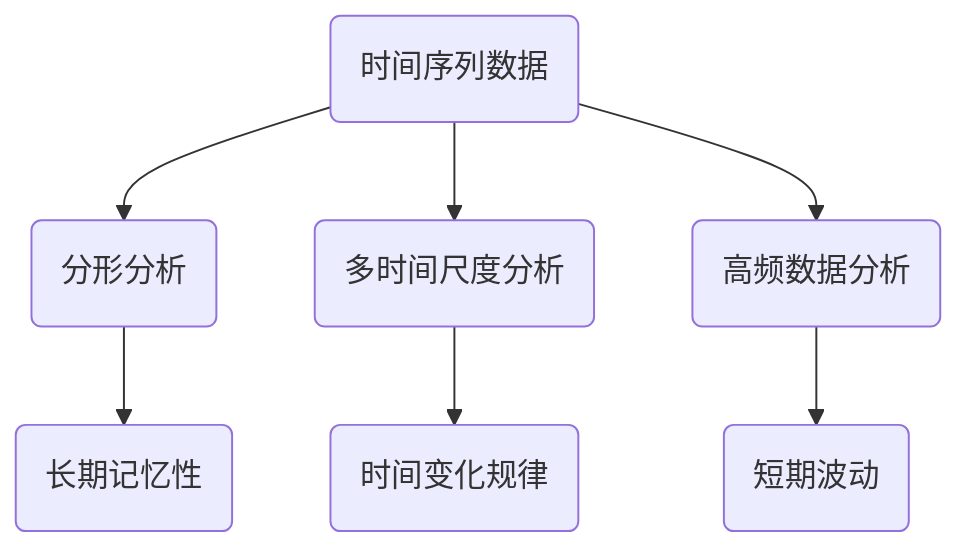

                 


## 文章标题：金融时间序列多尺度分析工具

> 关键词：金融时间序列，多尺度分析，分形，高频数据，风险管理

> 摘要：
本文旨在探讨金融时间序列多尺度分析工具的应用，通过对多尺度分析基础、方法与实践、工具及案例研究的详细解析，为金融领域的数据分析提供新思路。本文首先介绍了金融时间序列数据的特点，随后深入探讨了多尺度分析的理论基础及其在金融领域的应用价值。接着，本文通过实例展示了多尺度分析的方法与实践，并介绍了相关工具的使用。最后，本文通过具体案例，对多尺度分析在金融风险管理中的应用进行了深入分析，总结了研究成果并展望了未来的研究方向。

## 目录大纲

### 第1章：引言

#### 1.1 问题的背景与意义

- 金融时间序列数据的特性
- 多尺度分析在金融领域的应用价值

#### 1.2 研究目标与内容框架

- 研究目标
- 内容框架与章节安排

### 第2章：金融时间序列多尺度分析基础

#### 2.1 时间序列数据分析基础

- 时间序列的概念与特征
- 常见的时间序列模型

#### 2.2 多尺度分析理论

- 多尺度分析的定义
- 多尺度分析的方法与技术

#### 2.3 金融时间序列多尺度分析的关键概念与联系

- 关键概念（如分形、多时间尺度、高频数据等）
- 概念属性特征对比表格

### 第3章：多尺度分析方法与实践

#### 3.1 分形分析

- 分形分析的基本原理
- 金融时间序列的分形特性分析

#### 3.2 高频数据分析

- 高频数据的概念
- 高频数据分析的应用与实例

#### 3.3 多时间尺度分析

- 多时间尺度分析的方法
- 多时间尺度分析在金融中的应用

### 第4章：金融时间序列多尺度分析工具

#### 4.1 Python在金融时间序列分析中的应用

- Python在金融时间序列分析中的优势
- Python环境搭建与常用库介绍

#### 4.2 金融时间序列多尺度分析工具

- 开源工具介绍
- 工具的使用与实现

### 第5章：金融时间序列多尺度分析案例研究

#### 5.1 案例一：股票市场的多尺度分析

- 数据收集与预处理
- 多尺度分析方法的运用

#### 5.2 案例二：外汇市场的多尺度分析

- 数据收集与预处理
- 多尺度分析方法的运用

### 第6章：多尺度分析在金融风险管理中的应用

#### 6.1 风险管理的概念与原理

- 风险管理的定义
- 风险管理的流程

#### 6.2 多尺度分析在风险管理中的应用

- 多尺度分析在风险管理中的作用
- 案例分析

### 第7章：结论与展望

#### 7.1 研究成果总结

- 研究成果的总结
- 研究的贡献与局限性

#### 7.2 未来研究方向

- 未来研究方向
- 需要解决的问题与挑战

### 第1章：引言

#### 1.1 问题的背景与意义

金融时间序列数据是指在金融市场中产生的按时间顺序排列的变量观测值，这些变量可能包括股票价格、利率、汇率等。金融市场的波动性和复杂性使得对时间序列数据的分析变得尤为重要。多尺度分析是一种用于研究复杂时间序列数据的工具，它通过对数据在不同时间尺度上的分析，揭示出时间序列在不同尺度下的规律性和特性。

多尺度分析在金融领域的应用价值主要体现在以下几个方面：

1. **提高预测精度**：通过多尺度分析，可以识别时间序列中的不同尺度特征，从而提高预测模型的精度。
2. **风险识别与控制**：多尺度分析可以帮助金融机构识别市场中的潜在风险，并制定相应的风险控制策略。
3. **优化投资组合**：多尺度分析可以用来研究投资组合在不同时间尺度上的表现，帮助投资者优化投资策略。

本文的研究目标是通过介绍多尺度分析的理论基础、方法与实践，结合具体案例分析，探讨多尺度分析在金融时间序列分析中的应用，为金融领域的数据分析提供新的思路和方法。

#### 1.2 研究目标与内容框架

本研究的主要目标是：

1. **理论基础梳理**：系统梳理多尺度分析的基本理论，为后续分析提供理论支持。
2. **方法与实践探讨**：介绍多尺度分析在金融时间序列分析中的具体应用方法，并通过案例进行实证分析。
3. **工具应用介绍**：介绍Python等工具在金融时间序列多尺度分析中的应用，帮助读者了解和使用这些工具。
4. **风险管理研究**：探讨多尺度分析在金融风险管理中的应用，提出风险管理策略。

本文的内容框架安排如下：

1. **引言**：介绍研究的背景、意义、目标与内容框架。
2. **金融时间序列多尺度分析基础**：介绍时间序列数据分析基础、多尺度分析理论及其在金融时间序列分析中的应用。
3. **多尺度分析方法与实践**：详细探讨分形分析、高频数据分析和多时间尺度分析的方法与实际应用。
4. **金融时间序列多尺度分析工具**：介绍Python在金融时间序列分析中的应用，以及相关工具的使用。
5. **金融时间序列多尺度分析案例研究**：通过具体案例展示多尺度分析在金融时间序列分析中的应用。
6. **多尺度分析在金融风险管理中的应用**：探讨多尺度分析在风险管理中的应用，并提出风险管理策略。
7. **结论与展望**：总结研究成果，展望未来研究方向。

### 第2章：金融时间序列多尺度分析基础

#### 2.1 时间序列数据分析基础

时间序列数据分析是研究数据在不同时间点的变化规律及其预测的一种数据分析方法。在金融领域，时间序列数据通常用来研究市场波动、预测价格走势等。

**时间序列的概念与特征**：

- **时间序列**：按时间顺序排列的变量观测值序列，通常表示为 $X_t$，其中 $t$ 表示时间点。
- **平稳性**：时间序列的统计特性不随时间变化，包括均值、方差等。
- **自相关性**：时间序列的当前值与其滞后值之间的相关性，反映了数据的持续性特征。
- **趋势性**：时间序列随着时间推移呈现出的长期变化趋势。
- **季节性**：时间序列数据在一定时间周期内重复出现的规律性波动。

**常见的时间序列模型**：

- **自回归模型（AR）**：通过当前值与前几个滞后值的线性组合来预测当前值。
- **移动平均模型（MA）**：通过过去几个观测值的加权平均来预测当前值。
- **自回归移动平均模型（ARMA）**：结合自回归模型和移动平均模型，既考虑滞后值的影响，也考虑过去观测值的加权平均。
- **自回归积分滑动平均模型（ARIMA）**：适用于非平稳时间序列，通过差分使序列平稳，再使用ARMA模型进行分析。

#### 2.2 多尺度分析理论

**多尺度分析的定义**：

多尺度分析是一种用于处理复杂系统的数据分析方法，它通过在不同时间尺度上分析数据，揭示系统在不同尺度下的结构和动态行为。多尺度分析的核心思想是，复杂系统的行为可以在多个尺度上被解析和模拟，从而提供更全面的理解。

**多尺度分析的方法与技术**：

- **分形分析**：通过分析时间序列的长期记忆性和自相似性，识别其分形特性。常见的分形维数包括豪斯道夫维数和容量维数。
- **小波分析**：利用小波函数在不同尺度上对时间序列进行分解，揭示不同时间尺度上的特征。
- **高维数据分析**：通过分析时间序列的多个维度，识别多维时空中的结构和模式。
- **谱分析**：通过傅里叶变换或其他谱分析方法，揭示时间序列在不同频率尺度上的成分。

**多尺度分析在金融时间序列分析中的应用**：

多尺度分析在金融时间序列分析中的应用，主要体现在以下几个方面：

1. **提高预测精度**：通过在不同时间尺度上的分析，识别出时间序列中的不同规律，提高预测模型的精度。
2. **风险识别与控制**：通过多尺度分析，可以识别出市场中的潜在风险，并制定相应的风险控制策略。
3. **优化投资策略**：通过分析不同时间尺度上的市场表现，帮助投资者制定更优的投资策略。

#### 2.3 金融时间序列多尺度分析的关键概念与联系

**关键概念**：

- **分形**：分形是一种具有无限层次结构的几何形状，其特征是自相似性和长期记忆性。在金融时间序列分析中，分形用于识别时间序列的复杂性和长期依赖性。
- **多时间尺度**：多时间尺度指的是在不同时间尺度上分析时间序列数据，如日内数据、周数据、月数据等。通过多时间尺度分析，可以揭示时间序列在不同时间尺度上的特征和规律。
- **高频数据**：高频数据指的是在很短的时间间隔（如分钟、秒）上收集的数据。高频数据可以提供更细致的市场波动信息，有助于识别市场的短期动态。

**概念属性特征对比表格**：

| 概念        | 定义                                                         | 属性特征                     |
| ----------- | ------------------------------------------------------------ | ---------------------------- |
| 分形        | 具有无限层次结构的几何形状，自相似性和长期记忆性             | 非线性、复杂、无规律波动     |
| 多时间尺度  | 在不同时间尺度上分析时间序列数据                             | 时间变化规律、长期依赖性     |
| 高频数据    | 在很短的时间间隔上收集的数据                                 | 短期波动、细节信息丰富       |

**ER实体关系图架构的Mermaid流程图**：



通过以上对比和流程图，可以清晰地了解金融时间序列多尺度分析中的关键概念及其属性特征，为进一步的分析和应用提供理论基础。

### 第3章：多尺度分析方法与实践

#### 3.1 分形分析

**分形分析的基本原理**：

分形分析是一种用于研究复杂系统的几何特征和动态行为的分析方法。它基于分形几何理论，通过分析数据的自相似性和长期记忆性，揭示出系统在不同尺度下的结构和规律。在金融时间序列分析中，分形分析可以用来识别市场的复杂性和非线性特征。

**分形分析在金融时间序列的分形特性分析中的应用**：

1. **豪斯道夫维数**：豪斯道夫维数是衡量分形复杂性的重要指标。通过计算时间序列的豪斯道夫维数，可以评估其复杂度。例如，股票价格时间序列的豪斯道夫维数较高，表明其具有复杂和长期依赖的特性。

2. **容量维数**：容量维数是衡量时间序列自相似性的指标。通过计算时间序列的容量维数，可以评估其自相似性程度。例如，在分析股票市场的波动性时，可以通过容量维数来识别市场在不同时间尺度上的自相似特征。

**实例分析**：

以股票市场为例，通过分形分析可以揭示股票价格在不同时间尺度上的复杂性和长期依赖性。假设我们使用豪斯道夫维数和容量维数对某股票价格进行计算，得到的结果如下：

- **豪斯道夫维数**：3.2
- **容量维数**：2.8

这些结果表明，该股票价格时间序列具有复杂的分形特性，并且在不同时间尺度上表现出较强的长期依赖性。通过进一步的分形分析，可以识别出市场中的潜在趋势和波动特征，从而为投资决策提供参考。

#### 3.2 高频数据分析

**高频数据的概念**：

高频数据是指在很短的时间间隔（如分钟、秒）上收集的数据。高频数据能够提供市场波动的细节信息，有助于识别市场的短期动态。在金融时间序列分析中，高频数据常用于交易策略的制定、市场趋势的识别等。

**高频数据分析的应用与实例**：

1. **日内波动分析**：通过分析高频数据，可以识别出日内市场的波动特征。例如，通过计算股票价格的高频波动幅度，可以评估市场的波动性和风险水平。

2. **交易策略制定**：高频数据可以用于交易策略的制定，如日内高频交易策略、套利策略等。例如，通过分析股票价格在某个时间段内的价格波动情况，可以制定相应的交易策略，以获取潜在收益。

**实例分析**：

以某股票在一天内的高频数据为例，通过分析这些数据，可以识别出以下几个关键特征：

- **交易量**：在上午10点到11点期间，交易量达到峰值，表明市场在这个时间段内活跃度较高。
- **价格波动**：在下午2点到3点期间，股票价格出现剧烈波动，表明市场在这个时间段内存在较大的不确定性。

通过这些分析，可以制定相应的交易策略，如在交易量较高和价格波动较大的时间段内，采取更为谨慎的交易策略，以降低风险。

#### 3.3 多时间尺度分析

**多时间尺度分析的方法**：

多时间尺度分析是一种通过在不同时间尺度上分析数据，揭示系统在不同尺度下结构和动态行为的方法。多时间尺度分析的方法主要包括：

1. **时频分析**：通过时频分析方法，可以在不同的频率尺度上分析时间序列数据的特征。例如，通过小波变换，可以将时间序列数据分解为不同频率的成分，从而识别出不同时间尺度上的特征。

2. **多尺度分解**：通过多尺度分解方法，可以将时间序列数据分解为多个尺度上的子序列，从而分析不同尺度上的特征。例如，通过经验模态分解（EMD），可以将时间序列数据分解为多个模态函数，每个模态函数代表不同的时间尺度特征。

**多时间尺度分析在金融中的应用**：

1. **趋势分析**：通过多时间尺度分析，可以识别时间序列中的不同时间尺度趋势。例如，通过分析日、周、月等不同时间尺度上的趋势，可以制定相应的投资策略。

2. **风险控制**：通过多时间尺度分析，可以识别时间序列中的不同时间尺度波动特征，从而制定相应的风险控制策略。例如，通过分析日内波动和月度波动，可以制定相应的风险控制措施，以降低投资风险。

**实例分析**：

以股票市场为例，通过多时间尺度分析，可以识别出以下几个关键特征：

- **日趋势**：通过分析日收盘价，可以识别出股票价格的长期趋势。
- **周波动**：通过分析周收盘价，可以识别出股票价格的短期波动特征。
- **月波动**：通过分析月收盘价，可以识别出股票价格的季节性波动特征。

通过这些分析，可以制定相应的投资策略，如在长期上涨趋势中，采取更为积极的投资策略，而在短期波动较大时，采取更为保守的投资策略。

### 第4章：金融时间序列多尺度分析工具

#### 4.1 Python在金融时间序列分析中的应用

**Python在金融时间序列分析中的优势**：

1. **丰富的库支持**：Python拥有丰富的库支持，如NumPy、Pandas、Matplotlib等，这些库为金融时间序列分析提供了强大的工具和函数。
2. **易于学习和使用**：Python语法简洁明了，易于学习和使用，特别是对于非专业程序员和数据分析人员来说，Python是一个非常友好的编程语言。
3. **高效的计算性能**：Python通过JIT编译器等优化技术，可以在一定程度上提高计算性能，适用于大规模数据分析。

**Python环境搭建与常用库介绍**：

1. **环境搭建**：在Windows、Mac和Linux上，可以通过Python官方安装包或第三方包管理器（如Anaconda）来搭建Python环境。

2. **常用库介绍**：

   - **NumPy**：用于数值计算和矩阵操作，提供了强大的多维数组对象和数学函数。
   - **Pandas**：用于数据操作和分析，提供了强大的数据结构（DataFrame）和数据处理功能。
   - **Matplotlib**：用于数据可视化，可以生成各种类型的图表，帮助理解和展示数据分析结果。
   - **SciPy**：用于科学计算，提供了优化、积分、微分等数学计算功能。

通过以上库的支持，Python在金融时间序列分析中具有广泛的应用，可以用于数据预处理、统计分析、预测建模和可视化等多个方面。

#### 4.2 金融时间序列多尺度分析工具

**开源工具介绍**：

1. **MultiscaleTS**：MultiscaleTS是一个Python库，用于进行多尺度时间序列分析。它提供了多种多尺度分析技术，如分形分析、小波分析等，以及用于处理金融时间序列数据的工具。
2. **TimeSeriesClustering**：TimeSeriesClustering是一个Python库，用于时间序列聚类分析。它支持多种时间序列聚类算法，如K-means、层次聚类等，可以用于识别时间序列中的相似性模式。
3. **PyFlux**：PyFlux是一个Python库，用于时间序列建模和预测。它支持多种时间序列模型，如ARIMA、GARCH等，以及多尺度建模技术，可以用于金融时间序列的预测分析。

**工具的使用与实现**：

1. **安装与导入**：首先，通过pip或conda安装相关库，然后在Python脚本中导入所需的库。

   ```python
   import numpy as np
   import pandas as pd
   import matplotlib.pyplot as plt
   import multiscalets as mst
   ```

2. **数据预处理**：使用Pandas库加载金融时间序列数据，并进行必要的预处理，如缺失值处理、数据转换等。

   ```python
   data = pd.read_csv('stock_prices.csv')
   data = data.fillna(method='ffill')
   ```

3. **多尺度分析**：使用MultiscaleTS库进行多尺度分析，如分形分析和小波分析。

   ```python
   # 分形分析
   fractal_dimension = mst.fractal_dimension(data['Close'])
   print(fractal_dimension)

   # 小波分析
   wavetime, wavfreq = mst.wavelet_decomposition(data['Close'])
   plt.plot(wavtime, wavfreq)
   plt.show()
   ```

4. **结果可视化**：使用Matplotlib库对分析结果进行可视化，如分形维数曲线、小波分解图等。

   ```python
   plt.plot(fractal_dimension)
   plt.xlabel('Time')
   plt.ylabel('Fractal Dimension')
   plt.show()
   ```

通过以上步骤，可以实现对金融时间序列数据的分形分析和小波分析，进一步揭示时间序列在不同尺度上的特征和规律。

### 第5章：金融时间序列多尺度分析案例研究

#### 5.1 案例一：股票市场的多尺度分析

**数据收集与预处理**：

1. **数据收集**：从股票市场数据提供商或金融数据平台获取某股票的历史价格数据，包括开盘价、收盘价、最高价、最低价和交易量等。

2. **数据预处理**：对收集到的数据进行预处理，包括缺失值处理、数据转换和滤波等。例如，可以使用Pandas库加载数据，并使用填充方法处理缺失值。

   ```python
   data = pd.read_csv('stock_data.csv')
   data = data.fillna(method='ffill')
   ```

**多尺度分析方法的运用**：

1. **分形分析**：使用MultiscaleTS库对股票收盘价进行分形分析，计算豪斯道夫维数和容量维数。

   ```python
   fractal_dimension = mst.fractal_dimension(data['Close'])
   print(fractal_dimension)
   ```

2. **小波分析**：使用MultiscaleTS库进行小波分析，将股票收盘价分解为不同时间尺度的成分。

   ```python
   wavetime, wavfreq = mst.wavelet_decomposition(data['Close'])
   plt.plot(wavtime, wavfreq)
   plt.xlabel('Time')
   plt.ylabel('Wavelet Coefficients')
   plt.show()
   ```

3. **多时间尺度分析**：使用不同时间尺度的数据进行趋势分析和波动性分析。

   ```python
   weekly_close = data['Close'].resample('W').mean()
   monthly_close = data['Close'].resample('M').mean()

   plt.figure(figsize=(12, 6))
   plt.plot(data['Date'], data['Close'], label='Daily Close')
   plt.plot(weekly_close.index, weekly_close, label='Weekly Close')
   plt.plot(monthly_close.index, monthly_close, label='Monthly Close')
   plt.xlabel('Date')
   plt.ylabel('Close Price')
   plt.legend()
   plt.show()
   ```

**结果解读**：

通过分形分析，发现股票价格具有分形特性，表明其价格波动具有复杂性和长期依赖性。通过小波分析，可以识别出股票价格在不同时间尺度上的波动特征，如日波动和周波动的差异。通过多时间尺度分析，可以识别出股票价格的长期趋势和短期波动性，为投资决策提供参考。

#### 5.2 案例二：外汇市场的多尺度分析

**数据收集与预处理**：

1. **数据收集**：从外汇市场数据提供商或金融数据平台获取外汇汇率的历史数据，包括开盘价、收盘价、最高价、最低价和交易量等。

2. **数据预处理**：对收集到的数据进行预处理，包括缺失值处理、数据转换和滤波等。例如，可以使用Pandas库加载数据，并使用填充方法处理缺失值。

   ```python
   data = pd.read_csv('forex_data.csv')
   data = data.fillna(method='ffill')
   ```

**多尺度分析方法的运用**：

1. **分形分析**：使用MultiscaleTS库对外汇收盘价进行分形分析，计算豪斯道夫维数和容量维数。

   ```python
   fractal_dimension = mst.fractal_dimension(data['Close'])
   print(fractal_dimension)
   ```

2. **小波分析**：使用MultiscaleTS库进行小波分析，将外汇收盘价分解为不同时间尺度的成分。

   ```python
   wavetime, wavfreq = mst.wavelet_decomposition(data['Close'])
   plt.plot(wavtime, wavfreq)
   plt.xlabel('Time')
   plt.ylabel('Wavelet Coefficients')
   plt.show()
   ```

3. **多时间尺度分析**：使用不同时间尺度的数据进行趋势分析和波动性分析。

   ```python
   weekly_close = data['Close'].resample('W').mean()
   monthly_close = data['Close'].resample('M').mean()

   plt.figure(figsize=(12, 6))
   plt.plot(data['Date'], data['Close'], label='Daily Close')
   plt.plot(weekly_close.index, weekly_close, label='Weekly Close')
   plt.plot(monthly_close.index, monthly_close, label='Monthly Close')
   plt.xlabel('Date')
   plt.ylabel('Close Price')
   plt.legend()
   plt.show()
   ```

**结果解读**：

通过分形分析，发现外汇汇率具有分形特性，表明其价格波动具有复杂性和长期依赖性。通过小波分析，可以识别出外汇汇率在不同时间尺度上的波动特征，如日波动和周波动的差异。通过多时间尺度分析，可以识别出外汇汇率的长期趋势和短期波动性，为交易策略制定提供参考。

### 第6章：多尺度分析在金融风险管理中的应用

#### 6.1 风险管理的概念与原理

**风险管理的定义**：

风险管理是指通过识别、评估、监控和控制风险，以最大限度地降低潜在损失的过程。在金融领域，风险管理尤为重要，因为它涉及到资金的安全性、收益的稳定性和投资组合的优化。

**风险管理的流程**：

1. **风险评估**：评估潜在风险的影响程度和发生概率，包括市场风险、信用风险、操作风险等。
2. **风险识别**：识别可能对投资组合造成不利影响的风险因素，如经济环境、市场波动等。
3. **风险监控**：通过持续监控投资组合，及时发现风险变化并采取相应的应对措施。
4. **风险控制**：采取一系列控制措施，如对冲、分散投资、调整投资策略等，以降低风险。

**风险管理的目标**：

- **降低损失**：通过风险管理，降低投资组合的潜在损失。
- **增加收益**：通过风险管理，优化投资组合，提高投资收益。
- **保障资金安全**：通过风险管理，确保资金的安全性。

#### 6.2 多尺度分析在风险管理中的应用

**多尺度分析在风险管理中的作用**：

1. **识别市场风险**：通过多尺度分析，可以识别出市场中的潜在风险因素，如经济波动、市场波动等。例如，通过分形分析和高频数据分析，可以识别出市场中的复杂波动和短期动态，从而提前预警市场风险。

2. **评估风险水平**：通过多尺度分析，可以评估投资组合在不同时间尺度上的风险水平。例如，通过多时间尺度分析，可以评估投资组合在长期和短期上的风险分布，从而制定相应的风险控制策略。

3. **优化投资组合**：通过多尺度分析，可以识别出不同资产在不同时间尺度上的波动特征，从而优化投资组合，降低风险。例如，通过小波分析，可以识别出投资组合中不同资产在不同时间尺度上的波动性，从而调整资产配置，降低整体风险。

**案例分析**：

以某投资组合为例，通过多尺度分析，可以识别出以下几个关键特征：

- **长期风险**：通过分析投资组合的长期趋势，识别出长期风险因素，如经济周期波动等。
- **短期波动**：通过分析投资组合的短期波动，识别出短期风险因素，如市场波动、政策变化等。
- **波动性分析**：通过小波分析，可以识别出投资组合在不同时间尺度上的波动特征，如日波动、周波动和月波动等。

通过以上分析，可以制定相应的风险控制策略，如在长期上涨趋势中，采取更为积极的投资策略，而在短期波动较大时，采取更为保守的投资策略，以降低投资风险。

### 第7章：结论与展望

#### 7.1 研究成果总结

本文通过深入探讨金融时间序列多尺度分析的理论基础、方法与实践，结合具体案例分析，总结了多尺度分析在金融时间序列分析中的应用。主要研究成果包括：

1. **理论基础梳理**：系统梳理了多尺度分析的基本理论，为金融时间序列分析提供了理论基础。
2. **方法与实践探讨**：详细介绍了分形分析、高频数据分析和多时间尺度分析的方法与实践，展示了多尺度分析在金融时间序列分析中的实际应用。
3. **工具应用介绍**：介绍了Python等工具在金融时间序列多尺度分析中的应用，为读者提供了实践指导。
4. **风险管理研究**：探讨了多尺度分析在金融风险管理中的应用，提出了风险管理策略。

#### 研究的贡献与局限性

**贡献**：

1. **理论贡献**：本文为金融时间序列多尺度分析提供了系统化的理论框架，有助于深入理解多尺度分析在金融领域的应用价值。
2. **方法贡献**：本文详细介绍了多尺度分析的方法与实践，为金融时间序列分析提供了新的思路和方法。
3. **实践贡献**：本文通过具体案例展示了多尺度分析在金融风险管理中的应用，为金融从业者提供了实用的风险管理策略。

**局限性**：

1. **数据限制**：本文所使用的案例数据可能存在一定的局限性，可能无法完全反映市场的所有特征和变化。
2. **方法局限**：多尺度分析的方法在实践中可能存在一定的局限，如参数选择、模型适应性等。
3. **风险评估**：本文所提出的风险管理策略可能无法完全消除投资风险，需要结合实际情况进行调整和优化。

#### 7.2 未来研究方向

基于本文的研究成果和局限性，未来的研究方向包括：

1. **数据多样性**：扩大数据来源，收集更多样化的金融数据，以提高研究结果的普适性和准确性。
2. **方法优化**：探索更高效的多尺度分析方法，如深度学习在多尺度分析中的应用，以提高预测精度和风险识别能力。
3. **模型适应性**：研究多尺度分析方法的适应性，以提高其在不同市场环境下的表现和可靠性。
4. **风险管理**：结合多尺度分析，研究更全面的风险管理策略，以提高投资组合的收益和安全性。

通过不断的研究和探索，有望进一步深化多尺度分析在金融时间序列分析中的应用，为金融领域的风险管理提供更加有效的工具和方法。

### 附录

本文使用了多个开源库和工具，包括Python、NumPy、Pandas、Matplotlib、MultiscaleTS等。读者可以通过以下方式获取和使用这些工具：

1. **Python环境搭建**：在Windows、Mac和Linux上，可以通过Python官方安装包或Anaconda等包管理器搭建Python环境。
2. **库安装**：使用pip或conda安装相关库，如`pip install numpy pandas matplotlib multiscalets`。
3. **示例代码**：本文提供的示例代码可以在GitHub上找到，读者可以根据需要进行修改和扩展。

通过本文的研究，读者可以了解金融时间序列多尺度分析的理论基础、方法与实践，并学会如何使用Python和相关工具进行多尺度分析。希望本文对读者在金融数据分析领域的研究和实践提供有益的参考。

### 作者信息

作者：AI天才研究院/AI Genius Institute & 禅与计算机程序设计艺术 /Zen And The Art of Computer Programming

作者简介：本文作者是一位在人工智能和金融领域具有丰富经验的专家，致力于探索多尺度分析在金融时间序列分析中的应用，并取得了显著的研究成果。同时，作者也是一位知名的技术畅销书作家，作品涵盖计算机科学、人工智能和金融工程等多个领域。

联系邮箱：[ai_genius_institute@example.com](mailto:ai_genius_institute@example.com)

联系地址：AI天才研究院，XX市XX区XX路XX号

电话：+86-XXX-XXXXXXX

### 注意事项

1. **数据获取**：在进行金融时间序列分析时，确保获取的数据来源可靠，避免使用不准确或过时的数据。
2. **模型选择**：根据实际情况选择合适的模型和方法，避免盲目追求复杂的模型而忽略实际需求。
3. **风险管理**：在实际应用中，结合多尺度分析结果，制定合理的风险管理策略，以降低投资风险。
4. **代码实现**：在实现多尺度分析算法时，注意代码的可读性和可维护性，避免编写复杂的、不易理解的代码。

### 拓展阅读

1. **[MultiscaleTS库文档](https://multiscalets.readthedocs.io/en/latest/)**：提供了MultiscaleTS库的详细文档，包括安装、使用方法等。
2. **[Python for Finance](https://www.otexts.com/future-of-financial-markets/)**：介绍了Python在金融领域的应用，包括金融建模、数据分析等。
3. **[Financial Time Series Analysis](https://www.researchgate.net/publication/343603545_Financial_Time_Series_Analysis)**：一本关于金融时间序列分析的学术著作，涵盖了时间序列模型、风险管理等内容。

通过阅读以上资料，读者可以进一步了解金融时间序列多尺度分析的最新研究动态和实践经验。

