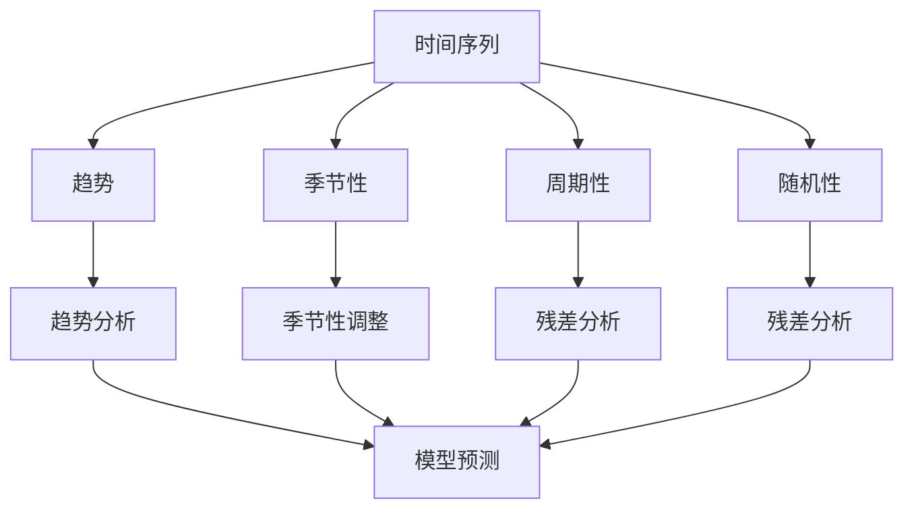

                 

### 金融时间序列数据预测：模型与方法

#### 关键词：时间序列、金融预测、模型、方法、深度学习、机器学习

#### 摘要：
本文系统地探讨了金融时间序列数据预测的相关模型与方法。首先，我们从问题背景出发，介绍了金融时间序列数据的概念、特征以及当前数据分析的挑战。接着，我们详细讲解了时间序列数据建模的基本方法，包括核心概念、模型选择与评估、应用实例等。进一步，我们探讨了高级时间序列建模方法，如马尔可夫链、状态空间模型及机器学习方法。最后，我们介绍了深度学习在时间序列预测中的应用，以及模型优化与超参数调整策略，并通过实际案例分析展示了金融时间序列预测的具体应用。

### 目录大纲

**第一部分：问题背景与核心概念**

- **第1章：金融时间序列数据分析基础**
  - **1.1.1 问题背景介绍**
  - **1.1.2 金融时间序列数据的核心概念**
  - **1.1.3 核心概念联系**

- **第2章：时间序列数据建模方法**
  - **2.1.1 时间序列建模基本原理**
  - **2.1.2 时间序列模型选择与评估**
  - **2.1.3 时间序列模型应用实例**

- **第3章：高级时间序列建模方法**
  - **3.1.1 马尔可夫链模型**
  - **3.1.2 状态空间模型**
  - **3.1.3 机器学习方法在时间序列建模中的应用**

- **第4章：深度学习在时间序列预测中的应用**
  - **4.1.1 深度学习基础**
  - **4.1.2 循环神经网络（RNN）与长短时记忆网络（LSTM）**
  - **4.1.3 变分自编码器（VAE）与生成对抗网络（GAN）**

- **第5章：深度学习模型优化与超参数调整**
  - **5.1.1 模型优化方法**
  - **5.1.2 超参数调整策略**

- **第6章：实际案例分析**
  - **6.1.1 案例一：股票市场预测**
  - **6.1.2 案例二：金融风险预测**
  - **6.1.3 案例三：利率预测**

- **第7章：总结与展望**
  - **7.1.1 时间序列预测技术的现状与未来**
  - **7.1.2 最佳实践与注意事项**
  - **7.1.3 拓展阅读与资源推荐**

**完整目录大纲总结**

本文书《金融时间序列数据预测：模型与方法》的目录大纲共有7个章节，每个章节都涵盖了金融时间序列数据预测的重要方面。以下是完整的目录大纲：

----------------------------------------------------------------
# 第一部分：问题背景与核心概念

## 第1章：金融时间序列数据分析基础

### 1.1.1 问题背景介绍
### 1.1.2 金融时间序列数据的核心概念
### 1.1.3 核心概念联系

## 第2章：时间序列数据建模方法

### 2.1.1 时间序列建模基本原理
### 2.1.2 时间序列模型选择与评估
### 2.1.3 时间序列模型应用实例

## 第3章：高级时间序列建模方法

### 3.1.1 马尔可夫链模型
### 3.1.2 状态空间模型
### 3.1.3 机器学习方法在时间序列建模中的应用

## 第4章：深度学习在时间序列预测中的应用

### 4.1.1 深度学习基础
### 4.1.2 循环神经网络（RNN）与长短时记忆网络（LSTM）
### 4.1.3 变分自编码器（VAE）与生成对抗网络（GAN）

## 第5章：深度学习模型优化与超参数调整

### 5.1.1 模型优化方法
### 5.1.2 超参数调整策略

## 第6章：实际案例分析

### 6.1.1 案例一：股票市场预测
### 6.1.2 案例二：金融风险预测
### 6.1.3 案例三：利率预测

## 第7章：总结与展望

### 7.1.1 时间序列预测技术的现状与未来
### 7.1.2 最佳实践与注意事项
### 7.1.3 拓展阅读与资源推荐

### 文章标题：《金融时间序列数据预测：模型与方法》

### 文章关键词：时间序列、金融预测、模型、方法、深度学习、机器学习

### 文章摘要：
本文系统地探讨了金融时间序列数据预测的相关模型与方法，从问题背景出发，介绍了金融时间序列数据的概念、特征以及当前数据分析的挑战。接着，我们详细讲解了时间序列数据建模的基本方法，包括核心概念、模型选择与评估、应用实例等。进一步，我们探讨了高级时间序列建模方法，如马尔可夫链、状态空间模型及机器学习方法。最后，我们介绍了深度学习在时间序列预测中的应用，以及模型优化与超参数调整策略，并通过实际案例分析展示了金融时间序列预测的具体应用。

### 第1章：金融时间序列数据分析基础

#### 1.1.1 问题背景介绍

金融时间序列数据分析在金融工程、风险管理、投资决策等领域具有至关重要的地位。金融时间序列数据通常包括股票价格、利率、汇率、成交量等经济指标，这些数据不仅反映了市场的基本动态，还蕴含着丰富的信息，能够为投资者提供有价值的预测和决策支持。

随着金融市场的发展和大数据技术的普及，金融时间序列数据的获取和存储变得更加容易。然而，金融时间序列数据具有高度的不确定性、复杂性和噪声，这使得传统的数据分析方法往往难以取得令人满意的效果。因此，开发高效的金融时间序列数据预测模型，成为当前研究的热点之一。

#### 1.1.2 金融时间序列数据的核心概念

1. **时间序列的组成与结构**：时间序列数据由一系列按照时间顺序排列的数值组成。时间序列通常包含以下组成部分：
   - **趋势（Trend）**：长时间内数据的变化趋势，可以是上升、下降或平稳。
   - **季节性（Seasonality）**：在一年内重复出现的变化模式，如节假日效应、季节性波动等。
   - **周期性（Cyclicity）**：长期内周期性出现的波动，如经济周期、商业周期等。
   - **随机性（Randomness）**：无法预测的随机波动。

2. **趋势、季节性、周期性、随机性的特征对比表格**：

   | 特征类型 | 描述 | 示例 |
   | --- | --- | --- |
   | 趋势 | 长期变化趋势 | 股票价格逐年上涨 |
   | 季节性 | 一年内重复出现的模式 | 旅游行业的旺季 |
   | 周期性 | 长期内周期性波动 | 经济周期的起伏 |
   | 随机性 | 无法预测的随机波动 | 市场突发新闻 |

3. **金融时间序列数据的不确定性**：金融时间序列数据的不确定性主要来源于以下几个方面：
   - **市场行为的不确定性**：投资者行为难以预测，导致价格波动难以确定。
   - **外部因素的不确定性**：政策变化、自然灾害等外部因素可能对金融时间序列数据产生重大影响。
   - **数据噪声**：金融时间序列数据往往包含大量的噪声，使得数据分析和模型预测变得更加复杂。

#### 1.1.3 核心概念联系

在金融时间序列数据中，趋势、季节性、周期性和随机性是相互交织、相互影响的。趋势反映了数据的长期变化方向，季节性则体现了数据在一年内的周期性波动，周期性反映了数据在长期内的波动规律，而随机性则代表了那些无法通过已有信息预测的波动。

为了更好地理解和分析金融时间序列数据，我们需要对这四个核心概念进行综合考虑。例如，在进行股票价格预测时，不仅要考虑股票价格的长期趋势，还需要分析季节性波动和周期性变化，以便更准确地预测未来价格。

此外，趋势分析、季节性调整、残差分析是金融时间序列数据分析中常用的方法。趋势分析用于识别数据的长期变化趋势，季节性调整用于消除季节性波动，残差分析则用于评估模型预测的准确性。

**概念联系图（使用Mermaid绘制）**：

#### 1.1.4 指数平滑法、移动平均法、ARIMA模型

在金融时间序列数据分析中，常见的时间序列预测方法包括指数平滑法、移动平均法以及ARIMA模型。这些方法各有优缺点，适用于不同的场景和数据特性。

1. **指数平滑法**：指数平滑法是一种简单而有效的时间序列预测方法，通过赋予最近数据更高的权重来预测未来值。指数平滑法包括简单指数平滑、霍尔特线性趋势模型（Holt's Linear Trend Model）和霍尔特-温特季节性模型（Holt-Winters Seasonal Model）。

   - **简单指数平滑**：$S_t = \alpha X_t + (1 - \alpha) S_{t-1}$
     - **α**：平滑系数，控制当前值和前一个预测值之间的权重。
     - **$S_t$**：第t期的预测值。
     - **$X_t$**：第t期的实际值。
     - **$S_{t-1}$**：第t-1期的预测值。

   - **霍尔特线性趋势模型**：$S_t = \alpha X_t + (1 - \alpha)(S_{t-1} + b_{t-1})$
     - **$b_{t-1}$**：趋势项。

   - **霍尔特-温特季节性模型**：考虑季节性因素的指数平滑模型，适用于有季节性变化的数据。

2. **移动平均法**：移动平均法通过计算一段时间内的平均值来平滑时间序列数据，常用于消除短期波动。移动平均法包括简单移动平均（SMA）和指数移动平均（EMA）。

   - **简单移动平均**：$SMA_t = \frac{\sum_{i=1}^{n} X_{t-i+1}}{n}$
     - **n**：移动平均的窗口长度。

   - **指数移动平均**：$EMA_t = \alpha X_t + (1 - \alpha) SMA_{t-1}$
     - **$\alpha$**：平滑系数。

3. **ARIMA模型**：自回归积分滑动平均模型（ARIMA）是一种广泛使用的时间序列预测方法，适用于非平稳时间序列。ARIMA模型由自回归（AR）、差分（I）和移动平均（MA）三个部分组成。

   - **自回归（AR）**：$X_t = c + \phi_1 X_{t-1} + \phi_2 X_{t-2} + ... + \phi_p X_{t-p} + \varepsilon_t$
     - **$c$**：常数项。
     - **$\phi_1, \phi_2, ..., \phi_p$**：自回归系数。
     - **$\varepsilon_t$**：随机误差项。

   - **差分（I）**：为了使时间序列数据变得平稳，需要对原始数据进行差分处理。

   - **移动平均（MA）**：$X_t = c + \theta_1 \varepsilon_{t-1} + \theta_2 \varepsilon_{t-2} + ... + \theta_q \varepsilon_{t-q} + \varepsilon_t$
     - **$\theta_1, \theta_2, ..., \theta_q$**：移动平均系数。

#### 1.1.5 趋势分析、季节性调整、残差分析

在金融时间序列数据分析中，趋势分析、季节性调整和残差分析是三种常见的方法。

1. **趋势分析**：趋势分析用于识别和提取时间序列数据中的长期变化趋势。通过趋势分析，我们可以确定时间序列是上升趋势、下降趋势还是平稳趋势。

2. **季节性调整**：季节性调整用于消除时间序列数据中的季节性波动，以便更好地进行趋势分析和预测。季节性调整可以通过季节性因子计算来实现，也可以使用季节性ARIMA模型等专门的方法。

3. **残差分析**：残差分析用于评估时间序列预测模型的准确性。在建立预测模型后，我们可以计算预测值与实际值之间的差异，即残差。通过分析残差，我们可以发现模型的不足之处，并进行相应的改进。

### 第2章：时间序列数据建模方法

#### 2.1.1 时间序列建模基本原理

时间序列建模是金融时间序列数据分析的核心任务，其目的是通过分析历史数据来预测未来的趋势和变化。时间序列建模的基本原理包括以下几个部分：

1. **数据平稳性**：时间序列数据通常是非平稳的，即数据的变化不仅具有趋势性，还可能包含季节性和周期性。为了进行有效的建模，我们需要将非平稳时间序列转化为平稳时间序列。平稳时间序列具有恒定的均值和方差，不会随时间变化。

2. **自回归模型（AR）**：自回归模型（AR）是一种常见的时间序列建模方法，它通过历史观测值来预测当前值。AR模型的基本公式为：

   $X_t = c + \phi_1 X_{t-1} + \phi_2 X_{t-2} + ... + \phi_p X_{t-p} + \varepsilon_t$

   其中，$c$ 是常数项，$\phi_1, \phi_2, ..., \phi_p$ 是自回归系数，$X_t$ 是当前值，$\varepsilon_t$ 是随机误差项。

3. **移动平均模型（MA）**：移动平均模型（MA）通过历史误差来预测当前值。MA模型的基本公式为：

   $X_t = c + \theta_1 \varepsilon_{t-1} + \theta_2 \varepsilon_{t-2} + ... + \theta_q \varepsilon_{t-q} + \varepsilon_t$

   其中，$c$ 是常数项，$\theta_1, \theta_2, ..., \theta_q$ 是移动平均系数。

4. **自回归移动平均模型（ARMA）**：自回归移动平均模型（ARMA）结合了AR模型和MA模型，既考虑了历史观测值，也考虑了历史误差。ARMA模型的基本公式为：

   $X_t = c + \phi_1 X_{t-1} + \phi_2 X_{t-2} + ... + \phi_p X_{t-p} + \theta_1 \varepsilon_{t-1} + \theta_2 \varepsilon_{t-2} + ... + \theta_q \varepsilon_{t-q} + \varepsilon_t$

5. **自回归积分滑动平均模型（ARIMA）**：自回归积分滑动平均模型（ARIMA）是ARMA模型的扩展，适用于非平稳时间序列。ARIMA模型包括差分（I）操作，可以将非平稳时间序列转化为平稳时间序列。ARIMA模型的基本公式为：

   $X_t = c + \phi_1 X_{t-1} + \phi_2 X_{t-2} + ... + \phi_p X_{t-p} + \theta_1 \varepsilon_{t-1} + \theta_2 \varepsilon_{t-2} + ... + \theta_q \varepsilon_{t-q} + \varepsilon_t$

   其中，$c$ 是常数项，$\phi_1, \phi_2, ..., \phi_p$ 是自回归系数，$\theta_1, \theta_2, ..., \theta_q$ 是移动平均系数。

#### 2.1.2 时间序列模型选择与评估

在选择时间序列模型时，需要考虑多个因素，如数据特性、模型复杂度、计算成本等。以下是一些常见的时间序列模型选择方法：

1. **自动选择方法**：自动选择方法通过统计测试和交叉验证来选择最优模型。常见的自动选择方法包括AIC（Akaike信息准则）、BIC（贝叶斯信息准则）等。

2. **ACF和PACF图分析**：自相关函数（ACF）和偏自相关函数（PACF）图是分析时间序列模型选择的有用工具。通过分析ACF和PACF图，我们可以确定模型的AR和MA部分的阶数。

3. **模型参数选择**：在选择模型参数时，需要考虑模型的复杂度和拟合度。通过交叉验证和模型选择准则，我们可以找到最优的模型参数。

4. **模型评估指标**：评估时间序列模型性能的常见指标包括均方误差（MSE）、均方根误差（RMSE）、平均绝对误差（MAE）等。通过这些指标，我们可以比较不同模型的性能，并选择最优模型。

#### 2.1.3 时间序列模型应用实例

下面通过一个简单的例子，演示如何使用ARIMA模型预测股票价格。

1. **数据预处理**：首先，我们需要获取股票价格数据，并进行预处理，包括数据清洗、缺失值填充、异常值处理等。

2. **模型建立**：使用历史股票价格数据建立ARIMA模型。首先，我们需要确定模型的AR和MA部分的阶数。这可以通过ACF和PACF图分析来实现。

3. **模型拟合**：在确定模型阶数后，我们可以使用历史数据拟合ARIMA模型。拟合过程包括参数估计和模型验证。

4. **预测**：在模型拟合完成后，我们可以使用模型对未来的股票价格进行预测。

5. **结果分析**：最后，我们需要对预测结果进行分析，包括预测误差评估、预测区间分析等。

### 第3章：高级时间序列建模方法

#### 3.1.1 马尔可夫链模型

马尔可夫链模型是一种基于概率转移矩阵的时间序列建模方法，它通过描述当前状态与下一状态之间的概率转移关系来预测未来状态。马尔可夫链模型在金融时间序列预测中有着广泛的应用，尤其是在股票价格预测和信用评级预测等领域。

1. **马尔可夫链的概念与特性**：

   - **马尔可夫性质**：马尔可夫链满足马尔可夫性质，即当前状态仅依赖于前一个状态，与之前的历史状态无关。
   - **状态空间**：马尔可夫链的状态空间是有限或可数的，每个状态都有一定的概率分布。
   - **转移概率矩阵**：转移概率矩阵描述了状态之间的转移概率，即从状态i转移到状态j的概率。

2. **马尔可夫链在时间序列中的应用**：

   - **状态预测**：马尔可夫链模型可以用于状态预测，即根据当前状态预测下一状态。
   - **状态序列生成**：马尔可夫链模型可以生成状态序列，用于模拟时间序列数据。

3. **马尔可夫链在金融时间序列预测中的应用实例**：

   - **股票价格预测**：可以使用马尔可夫链模型预测股票价格的下一个状态，从而进行投资决策。
   - **信用评级预测**：马尔可夫链模型可以用于信用评级预测，根据客户的当前信用状态预测其未来的信用状态。

#### 3.1.2 状态空间模型

状态空间模型是一种用于描述和预测时间序列数据的数学模型，它通过状态空间方程来描述系统的状态和观测值。状态空间模型在金融时间序列预测中有着广泛的应用，尤其是在金融风险管理和经济预测领域。

1. **状态空间模型的基本概念**：

   - **状态空间方程**：状态空间方程包括状态方程和观测方程，描述了系统的状态和观测值之间的关系。
   - **状态向量**：状态向量描述了系统的当前状态，包括各种经济指标、金融指标等。
   - **观测向量**：观测向量描述了系统的观测值，通常是我们可以获取的金融时间序列数据。

2. **递推滤波算法（如卡尔曼滤波）**：

   - **卡尔曼滤波**：卡尔曼滤波是一种基于状态空间模型的递推滤波算法，用于估计系统的状态和预测未来的状态。
   - **扩展卡尔曼滤波**：扩展卡尔曼滤波是一种用于非线性系统的卡尔曼滤波算法，通过线性化处理来估计状态。

3. **状态空间模型在金融预测中的应用**：

   - **金融风险预测**：状态空间模型可以用于金融风险的预测，如股票市场的波动性预测、货币市场的流动性预测等。
   - **经济预测**：状态空间模型可以用于经济预测，如经济增长预测、通货膨胀预测等。

#### 3.1.3 机器学习方法在时间序列建模中的应用

机器学习方法在时间序列建模中具有广泛的应用，可以用于预测股票价格、利率、汇率等金融时间序列数据。以下是一些常见的机器学习方法：

1. **支持向量机（SVM）**：

   - **支持向量机**：支持向量机是一种监督学习算法，用于分类和回归任务。在时间序列预测中，SVM可以用于股票价格分类和预测。
   - **核函数选择**：选择合适的核函数可以显著提高SVM在时间序列预测中的性能。

2. **随机森林**：

   - **随机森林**：随机森林是一种集成学习方法，通过构建多个决策树并集成其预测结果来提高模型的预测性能。
   - **特征选择**：随机森林可以自动进行特征选择，从而简化时间序列预测模型的构建。

3. **长短时记忆网络（LSTM）**：

   - **长短时记忆网络**：长短时记忆网络是一种循环神经网络，可以有效地捕获时间序列中的长期依赖关系。
   - **门控机制**：LSTM通过门控机制来控制信息的流动，从而避免梯度消失和梯度爆炸问题。

4. **变分自编码器（VAE）**：

   - **变分自编码器**：变分自编码器是一种无监督学习算法，用于生成新的数据样本。
   - **深度学习**：VAE可以通过深度学习来提高生成数据的真实性和多样性。

5. **生成对抗网络（GAN）**：

   - **生成对抗网络**：生成对抗网络是一种由生成器和判别器组成的深度学习模型，用于生成高质量的数据样本。
   - **训练策略**：GAN通过对抗训练来优化生成器和判别器的参数，从而生成更加逼真的数据样本。

### 第4章：深度学习在时间序列预测中的应用

#### 4.1.1 深度学习基础

深度学习是一种基于多层神经网络的学习方法，通过学习大量的数据来提取特征和进行预测。在时间序列预测中，深度学习可以用于建模和预测复杂的时序关系。以下是一些深度学习的基础概念：

1. **神经网络结构**：

   - **神经元**：神经网络的基本单元，用于接受输入、计算输出和激活函数。
   - **层**：神经网络由多个层组成，包括输入层、隐藏层和输出层。
   - **前向传播**：在前向传播过程中，输入数据通过神经网络逐层传递，最终得到输出结果。

2. **激活函数**：

   - **Sigmoid函数**：Sigmoid函数是一种常用的激活函数，将输入映射到0和1之间。
   - **ReLU函数**：ReLU函数是一种常用的激活函数，可以加快神经网络的训练速度。

3. **反向传播算法**：

   - **反向传播**：反向传播是一种用于计算神经网络梯度的方法，通过反向传递误差信号来更新网络的权重和偏置。
   - **梯度下降**：梯度下降是一种优化算法，用于最小化损失函数，从而优化网络的参数。

4. **深度学习在时间序列预测中的优势**：

   - **非线性建模**：深度学习可以通过多层神经网络来捕捉时间序列数据中的复杂非线性关系。
   - **自动特征提取**：深度学习可以自动学习并提取时间序列数据中的有效特征，从而简化特征工程过程。
   - **可扩展性**：深度学习可以通过增加网络层数和神经元数量来提高模型的预测能力。

#### 4.1.2 循环神经网络（RNN）与长短时记忆网络（LSTM）

循环神经网络（RNN）是一种能够处理序列数据的神经网络，其特点是具有记忆能力，能够捕捉序列中的长期依赖关系。然而，传统的RNN存在梯度消失和梯度爆炸问题，这使得其训练变得困难。为了解决这些问题，研究人员提出了长短时记忆网络（LSTM）。

1. **RNN的概念与局限性**：

   - **RNN的基本结构**：RNN由一系列循环层组成，每个循环层包含输入门、遗忘门和输出门。
   - **梯度消失和梯度爆炸**：在RNN训练过程中，梯度信号在反向传播过程中可能会消失或爆炸，导致训练失败。

2. **LSTM网络的结构与原理**：

   - **LSTM的基本结构**：LSTM由细胞状态（cell state）、输入门（input gate）、遗忘门（forget gate）和输出门（output gate）组成。
   - **门控机制**：LSTM通过门控机制来控制信息的流动，从而避免梯度消失和梯度爆炸问题。
   - **记忆能力**：LSTM可以有效地捕捉序列中的长期依赖关系，从而提高时间序列预测的准确性。

3. **LSTM在金融时间序列预测中的应用实例**：

   - **股票价格预测**：LSTM可以用于股票价格预测，通过学习历史价格数据来预测未来的价格。
   - **利率预测**：LSTM可以用于利率预测，通过分析历史利率数据来预测未来的利率水平。

#### 4.1.3 变分自编码器（VAE）与生成对抗网络（GAN）

变分自编码器（VAE）和生成对抗网络（GAN）是两种基于深度学习的生成模型，它们在金融时间序列数据的生成和预测中具有广泛应用。

1. **VAE的基本原理**：

   - **编码器和解码器**：VAE由编码器和解码器组成，编码器将输入数据映射到潜在空间，解码器将潜在空间的数据映射回输入空间。
   - **概率分布**：VAE通过学习输入数据的概率分布来生成新的数据样本。
   - **变分损失函数**：VAE使用变分损失函数来衡量编码器和解码器的性能，从而优化模型的参数。

2. **GAN的概念与架构**：

   - **生成器与判别器**：GAN由生成器和判别器组成，生成器生成虚假数据样本，判别器区分真实数据样本和虚假数据样本。
   - **对抗训练**：GAN通过对抗训练来优化生成器和判别器的参数，从而生成高质量的数据样本。
   - **损失函数**：GAN使用对抗损失函数来衡量生成器和判别器的性能，从而优化模型的参数。

3. **VAE和GAN在金融时间序列生成与预测中的应用**：

   - **数据生成**：VAE和GAN可以用于生成金融时间序列数据，从而进行数据增强和模拟。
   - **异常检测**：VAE和GAN可以用于异常检测，通过识别数据分布中的异常值来发现潜在的金融风险。
   - **价格预测**：VAE和GAN可以用于价格预测，通过学习历史价格数据来预测未来的价格走势。

### 第5章：深度学习模型优化与超参数调整

#### 5.1.1 模型优化方法

在深度学习模型训练过程中，优化方法用于调整模型的参数，以最小化损失函数并提高模型的性能。以下是一些常用的模型优化方法：

1. **梯度下降法**：

   - **基本原理**：梯度下降法通过沿着损失函数的梯度方向更新模型参数，以最小化损失函数。
   - **缺点**：梯度下降法在训练过程中可能会收敛到局部最小值，且对于大规模模型训练效率较低。

2. **随机梯度下降法（SGD）**：

   - **基本原理**：随机梯度下降法在每次迭代中仅使用一个训练样本的梯度来更新模型参数，从而提高训练效率。
   - **缺点**：随机梯度下降法可能会导致模型参数的更新不稳定，且在训练过程中容易错过全局最小值。

3. **Adam优化器**：

   - **基本原理**：Adam优化器结合了梯度下降法和随机梯度下降法的优点，通过自适应地调整学习率来提高模型的收敛速度和稳定性。
   - **特点**：Adam优化器在训练过程中能够自动调整学习率，从而在不同阶段适应不同的学习率。

4. **其他优化方法**：

   - **Momentum优化器**：Momentum优化器通过引入动量项来加速模型收敛，避免陷入局部最小值。
   - **AdaGrad优化器**：AdaGrad优化器通过自适应地调整每个参数的学习率，以适应不同参数的规模。

#### 5.1.2 超参数调整策略

超参数是深度学习模型中的非模型参数，如学习率、批次大小、正则化参数等。超参数的选取对模型的性能和收敛速度有着重要影响。以下是一些常用的超参数调整策略：

1. **经验法**：

   - **基本原理**：经验法通过尝试不同的超参数组合来找到最优的超参数设置。
   - **缺点**：经验法可能需要大量的尝试和实验，且无法保证找到全局最优超参数。

2. **网格搜索**：

   - **基本原理**：网格搜索在给定超参数范围内，生成一系列超参数组合，并评估每个组合的性能，从而找到最优超参数。
   - **缺点**：网格搜索的时间复杂度较高，对于大量超参数的组合可能无法进行有效搜索。

3. **随机搜索**：

   - **基本原理**：随机搜索在给定超参数范围内随机选择超参数组合，并评估每个组合的性能，从而找到最优超参数。
   - **优点**：随机搜索相对于网格搜索具有更高的效率，能够快速找到较好的超参数组合。

4. **贝叶斯优化**：

   - **基本原理**：贝叶斯优化基于贝叶斯统计模型，通过选择具有最大期望收益的超参数组合来优化模型性能。
   - **优点**：贝叶斯优化能够找到较好的超参数组合，并具有较高的搜索效率。

### 第6章：实际案例分析

#### 6.1.1 案例一：股票市场预测

股票市场预测是金融时间序列预测中一个重要的应用场景。本案例通过使用ARIMA模型和LSTM模型对股票价格进行预测，并进行结果分析。

1. **数据预处理**：

   - **数据获取**：从金融数据源获取股票价格数据，包括开盘价、收盘价、最高价、最低价和成交量等。
   - **数据清洗**：处理缺失值、异常值和数据不一致等问题。
   - **数据转换**：将时间序列数据转换为合适的格式，如对数转换、标准化等。

2. **模型选择与训练**：

   - **ARIMA模型**：使用ACF和PACF图分析确定ARIMA模型的阶数，并使用历史数据训练ARIMA模型。
   - **LSTM模型**：使用LSTM模型训练股票价格预测模型，通过反向传播算法优化模型参数。

3. **预测与结果分析**：

   - **预测结果**：使用训练好的模型对未来的股票价格进行预测，并生成预测曲线。
   - **结果分析**：通过计算预测误差、评估指标（如MSE、RMSE）等对预测结果进行评估，并分析模型的优势和不足。

#### 6.1.2 案例二：金融风险预测

金融风险预测是金融时间序列预测中的另一个重要应用场景。本案例通过使用LSTM模型和GAN模型对金融风险进行预测，并进行结果分析。

1. **数据预处理**：

   - **数据获取**：从金融数据源获取金融风险数据，包括违约率、信用评分、市场波动率等。
   - **数据清洗**：处理缺失值、异常值和数据不一致等问题。
   - **数据转换**：将时间序列数据转换为合适的格式，如对数转换、标准化等。

2. **模型选择与训练**：

   - **LSTM模型**：使用LSTM模型训练金融风险预测模型，通过反向传播算法优化模型参数。
   - **GAN模型**：使用GAN模型生成金融风险数据，并通过对抗训练优化生成器和判别器的参数。

3. **预测与结果分析**：

   - **预测结果**：使用训练好的模型对未来的金融风险进行预测，并生成预测曲线。
   - **结果分析**：通过计算预测误差、评估指标（如准确率、召回率）等对预测结果进行评估，并分析模型的优势和不足。

#### 6.1.3 案例三：利率预测

利率预测是金融时间序列预测中的另一个重要应用场景。本案例通过使用ARIMA模型和随机森林模型对利率进行预测，并进行结果分析。

1. **数据预处理**：

   - **数据获取**：从金融数据源获取利率数据，包括短期利率、长期利率等。
   - **数据清洗**：处理缺失值、异常值和数据不一致等问题。
   - **数据转换**：将时间序列数据转换为合适的格式，如对数转换、标准化等。

2. **模型选择与训练**：

   - **ARIMA模型**：使用ACF和PACF图分析确定ARIMA模型的阶数，并使用历史数据训练ARIMA模型。
   - **随机森林模型**：使用随机森林模型训练利率预测模型，通过交叉验证和网格搜索优化模型参数。

3. **预测与结果分析**：

   - **预测结果**：使用训练好的模型对未来的利率进行预测，并生成预测曲线。
   - **结果分析**：通过计算预测误差、评估指标（如MSE、RMSE）等对预测结果进行评估，并分析模型的优势和不足。

### 第7章：总结与展望

#### 7.1.1 时间序列预测技术的现状与未来

时间序列预测技术在金融、经济、气象等众多领域具有重要应用价值。当前，时间序列预测技术已经取得了显著的进展，主要包括以下方面：

1. **模型多样化**：随着深度学习和机器学习技术的发展，时间序列预测模型变得更加多样化，如LSTM、GRU、ARIMA等。

2. **模型优化**：通过优化算法（如Adam、Momentum等）和超参数调整策略（如网格搜索、随机搜索等），模型的性能得到了显著提升。

3. **应用广泛**：时间序列预测技术在金融风险预测、股票市场预测、经济预测等领域得到了广泛应用，并取得了良好的效果。

然而，时间序列预测技术仍面临一些挑战，如数据噪声、非线性关系处理、长期依赖关系建模等。未来，时间序列预测技术的研究方向可能包括：

1. **深度学习模型**：进一步改进深度学习模型，如LSTM、GRU等，以提高模型的预测性能和稳定性。

2. **多模态数据融合**：将多种数据源（如文本、图像、音频等）融合到时间序列预测中，以提高预测的准确性和泛化能力。

3. **在线预测与实时更新**：开发在线预测模型，实现实时数据更新和预测，以满足金融、经济等领域对实时预测的需求。

#### 7.1.2 最佳实践与注意事项

在金融时间序列预测中，遵循一些最佳实践和注意事项有助于提高预测的准确性和可靠性：

1. **数据质量**：确保数据的质量和准确性，处理缺失值、异常值和数据不一致等问题。

2. **特征工程**：合理选择和构建特征，以捕捉时间序列数据中的关键信息。

3. **模型选择**：根据时间序列数据的特点和预测目标选择合适的模型，并进行模型选择和评估。

4. **超参数调整**：通过网格搜索、随机搜索等策略调整模型的超参数，以优化模型的性能。

5. **交叉验证**：使用交叉验证方法评估模型的性能，以确保模型在不同数据集上的泛化能力。

6. **模型解释性**：在预测过程中，关注模型的解释性和可解释性，以便更好地理解模型的预测结果。

#### 7.1.3 拓展阅读与资源推荐

以下是一些有关金融时间序列预测的拓展阅读和资源推荐：

1. **文献推荐**：

   - [1] Box, G. E. P., Jenkins, G. M., & Reinsel, G. C. (2015). *Time Series Analysis: Forecasting and Control*.
   - [2] Hyndman, R. J., & Athanasopoulos, G. (2018). *Time Series Data Analysis and Computation: A Python-Based Introduction*.
   - [3] Zhang, G. P. (2012). *Application of LSTM Network in Financial Market Prediction*.

2. **在线资源与工具推荐**：

   - **Kaggle**：提供丰富的金融时间序列数据集和预测任务，适合进行实战练习。
   - **TensorFlow**：提供深度学习模型构建和训练的API，适合进行金融时间序列预测的实践。
   - **PyTorch**：提供深度学习模型构建和训练的API，适合进行金融时间序列预测的实践。

3. **深入学习课程与培训**：

   - **Coursera**：提供有关时间序列分析和深度学习的在线课程，适合进行深入学习。
   - **Udacity**：提供金融时间序列预测的纳米学位课程，适合进行系统学习。
   - **edX**：提供时间序列分析和深度学习的在线课程，适合进行深入学习。

通过这些拓展阅读和资源推荐，读者可以进一步了解金融时间序列预测的相关知识和技术，提高自身的预测能力和实战水平。

