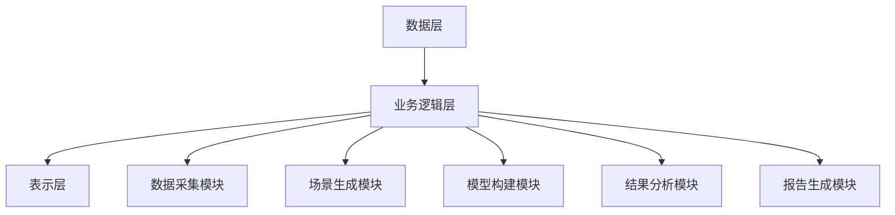
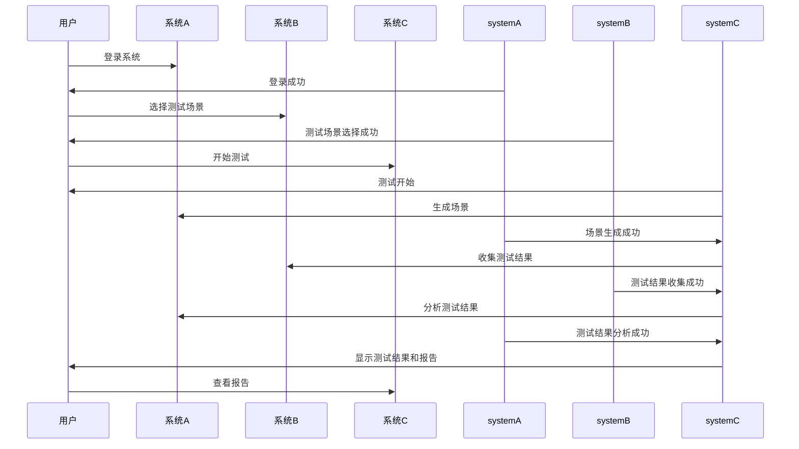

                 

# 金融监管压力测试场景生成

> 关键词：金融监管、压力测试、场景生成、系统架构设计、最佳实践

> 摘要：本文深入探讨了金融监管压力测试的场景生成问题。首先，我们介绍了金融监管压力测试的概念、重要性以及面临的挑战。接着，我们详细阐述了压力测试的场景、场景生成的方法和核心概念。在此基础上，我们提出了一个系统分析与架构设计方案，并展示了一个实际项目的实现过程。最后，我们总结了最佳实践和注意事项，为读者提供了一些建议。

----------------------------------------------------------------

## 第一部分：背景介绍

### 1.1 问题背景

#### 1.1.1 金融监管压力测试的概念

金融监管压力测试是一种评估金融机构在面对突发市场变化时，是否能够保持稳健运营的方法。它通过模拟不同市场情景，测试金融机构的风险承受能力和应对能力。

#### 1.1.2 监管压力测试的重要性和需求

金融市场的波动性决定了监管压力测试的重要性。随着金融市场越来越复杂，金融机构面临的潜在风险也在不断增加。因此，监管压力测试成为了一种评估金融机构稳健性的重要手段。

#### 1.1.3 当前金融监管压力测试的挑战

目前，金融监管压力测试面临着一些挑战，包括：

- **数据质量问题**：压力测试场景的生成依赖于大量的数据，但金融市场的数据往往不完整或不准确。
- **计算能力需求**：压力测试需要模拟多种市场情景，对计算能力提出了很高的要求。
- **模型准确性**：压力测试的准确性取决于所使用的模型和算法。

### 1.2 核心概念与联系

#### 1.2.1 压力测试的场景

压力测试的场景是指模拟的市场情景，可以是正常市场状况，也可以是极端市场状况。场景的选取应覆盖金融机构可能面临的所有风险。

#### 1.2.2 场景生成的方法

场景生成的方法可以分为常规方法和基于数据的方法。常规方法包括手工编写场景和基于历史数据的场景生成。基于数据的方法包括基于机器学习的方法。

#### 1.2.3 场景生成的核心概念与联系

场景生成的核心概念包括场景特征、场景生成算法和场景评估指标。场景特征描述了场景的关键属性，场景生成算法用于生成场景，场景评估指标用于评估场景的有效性。

### 1.3 数学模型和公式

#### 1.3.1 压力测试的数学模型

压力测试的数学模型用于描述金融机构在压力情景下的表现。常见的数学模型包括线性模型、非线性模型和随机模型。

#### 1.3.2 压力测试的数学公式

压力测试的数学公式包括损失函数、风险函数和收益函数。这些公式用于评估金融机构在压力情景下的风险和收益。

#### 1.3.3 压力测试的数学模型讲解

本文将详细讲解压力测试的数学模型，包括模型的构建、参数的选择和公式的推导。

### 1.4 系统分析与架构设计方案

#### 1.4.1 问题场景介绍

本文将介绍一个金融监管压力测试的场景，包括场景的需求、目标和实现方法。

#### 1.4.2 系统功能设计

系统功能设计包括领域模型设计、功能模块划分和功能模块详细描述。

#### 1.4.3 系统架构设计

系统架构设计包括系统组件介绍、架构设计和系统架构图。

#### 1.4.4 系统接口设计

系统接口设计包括接口概述和接口详细描述。

#### 1.4.5 系统交互设计

系统交互设计包括交互流程概述和交互流程详细描述。

### 1.5 项目实战

#### 1.5.1 环境安装

本文将介绍如何搭建金融监管压力测试的环境。

#### 1.5.2 系统核心实现源代码

本文将展示系统核心实现的源代码。

#### 1.5.3 代码应用解读与分析

本文将对源代码进行解读和分析。

#### 1.5.4 实际案例分析与讲解

本文将分析一个实际案例，并对案例进行讲解。

#### 1.5.5 项目小结

本文将总结项目的成果和经验。

### 1.6 最佳实践 Tips

本文将提供一些最佳实践建议。

----------------------------------------------------------------

## 第二部分：核心概念与联系

### 2.1 场景生成方法

#### 2.1.1 常规方法

常规方法包括手工编写场景和基于历史数据的场景生成。

#### 2.1.2 基于数据的场景生成方法

基于数据的场景生成方法包括使用统计方法和机器学习方法。

#### 2.1.3 基于机器学习的方法

基于机器学习的方法包括使用监督学习和无监督学习的方法。

### 2.2 核心概念讲解

#### 2.2.1 场景特征

场景特征描述了场景的关键属性，如市场波动、交易量、利率变化等。

#### 2.2.2 场景生成算法

场景生成算法用于生成满足特定需求的场景。

#### 2.2.3 场景评估指标

场景评估指标用于评估场景的有效性，如场景覆盖度、场景稳定性等。

### 2.3 案例分析

#### 2.3.1 案例一：基于数据的场景生成

案例一将介绍如何使用基于数据的方法生成场景。

#### 2.3.2 案例二：基于机器学习的方法

案例二将介绍如何使用基于机器学习的方法生成场景。

#### 2.3.3 案例比较与总结

案例比较与总结将比较不同方法的优势和不足，并总结最佳实践。

### 2.4 最佳实践 Tips

本文将提供一些最佳实践建议，包括如何选择合适的场景生成方法、如何评估场景的有效性等。

----------------------------------------------------------------

## 第三部分：系统分析与架构设计方案

### 3.1 问题场景介绍

#### 3.1.1 金融监管压力测试的场景

本文将介绍一个金融监管压力测试的场景，包括场景的需求和目标。

#### 3.1.2 场景需求的详细描述

本文将详细描述场景的需求，包括场景的特征、目标和使用方法。

### 3.2 系统功能设计

#### 3.2.1 功能模块划分

系统功能设计包括领域模型设计、功能模块划分和功能模块详细描述。

#### 3.2.2 功能模块详细描述

本文将详细描述每个功能模块的实现方法和作用。

### 3.3 系统架构设计

#### 3.3.1 系统架构概述

系统架构设计包括系统组件介绍、架构设计和系统架构图。

#### 3.3.2 系统组件介绍

本文将介绍系统中的主要组件及其作用。

### 3.4 系统接口设计

#### 3.4.1 接口概述

系统接口设计包括接口概述和接口详细描述。

#### 3.4.2 接口详细描述

本文将详细描述系统中的主要接口及其实现方法。

### 3.5 系统交互设计

#### 3.5.1 交互流程概述

系统交互设计包括交互流程概述和交互流程详细描述。

#### 3.5.2 交互流程详细描述

本文将详细描述系统的交互流程，包括各个模块之间的交互方式和数据流。

### 3.6 最佳实践 Tips

本文将提供一些最佳实践建议，包括如何设计高效的系统架构、如何优化接口设计等。

----------------------------------------------------------------

## 第四部分：项目实战

### 4.1 环境安装

#### 4.1.1 安装前准备

本文将介绍如何准备安装环境，包括软件和硬件的要求。

#### 4.1.2 安装步骤

本文将详细描述安装步骤，包括安装所需的软件和配置环境。

#### 4.1.3 遇到的问题及解决方案

本文将介绍在安装过程中可能遇到的问题及解决方案。

### 4.2 系统核心实现源代码

#### 4.2.1 源代码结构

本文将介绍系统核心实现源代码的结构，包括各个模块的作用和关系。

#### 4.2.2 核心代码解读

本文将解读系统核心实现源代码，包括关键算法和数据结构的实现。

### 4.3 代码应用解读与分析

#### 4.3.1 代码概述

本文将概述系统核心实现源代码的主要功能和应用场景。

#### 4.3.2 代码分析

本文将分析系统核心实现源代码的细节，包括算法原理和实现细节。

### 4.4 实际案例分析与讲解

#### 4.4.1 案例概述

本文将介绍一个实际案例，包括案例的背景、目标和实现过程。

#### 4.4.2 案例分析

本文将对实际案例进行分析，包括案例的实现细节和效果。

#### 4.4.3 案例讲解

本文将对实际案例进行讲解，包括案例的解决方案和经验教训。

### 4.5 项目小结

#### 4.5.1 项目成果

本文将总结项目的成果，包括系统的功能和性能。

#### 4.5.2 项目经验总结

本文将总结项目的经验，包括项目中的挑战和解决方案。

### 4.6 最佳实践 Tips

本文将提供一些最佳实践建议，包括如何优化系统性能和如何提高代码质量等。

----------------------------------------------------------------

## 第五部分：总结与展望

### 5.1 小结

#### 5.1.1 内容回顾

本文回顾了金融监管压力测试场景生成的方法、系统架构设计和项目实战。

#### 5.1.2 重点内容总结

本文总结了本文的重点内容，包括核心概念、系统架构设计和项目经验。

### 5.2 注意事项

#### 5.2.1 使用过程中需要注意的事项

本文提供了一些使用过程中需要注意的事项，包括系统的配置和优化。

#### 5.2.2 可能遇到的问题及解决方案

本文提供了一些可能遇到的问题及解决方案，帮助读者解决实际问题。

### 5.3 拓展阅读

#### 5.3.1 相关书籍推荐

本文推荐了一些相关书籍，帮助读者深入了解金融监管压力测试。

#### 5.3.2 相关论文推荐

本文推荐了一些相关论文，帮助读者了解最新的研究成果。

#### 5.3.3 相关网站推荐

本文推荐了一些相关网站，包括金融监管机构、研究机构和专业社区，供读者参考。

----------------------------------------------------------------

作者：AI天才研究院/AI Genius Institute & 禅与计算机程序设计艺术 /Zen And The Art of Computer Programming## 文章标题：金融监管压力测试场景生成

### 文章关键词：金融监管、压力测试、场景生成、系统架构、最佳实践

### 文章摘要：

本文深入探讨了金融监管压力测试的场景生成问题，从概念背景、核心方法到实际应用，全面解析了金融监管压力测试的场景生成技术。文章首先介绍了金融监管压力测试的基本概念、重要性及面临的挑战，随后详细阐述了场景生成的方法、核心概念及其相互联系。在此基础上，文章提出了一套系统分析与架构设计方案，并通过一个实际项目展示了方案的具体实施过程。最后，文章总结了项目经验、最佳实践和注意事项，为读者提供了一些建议和拓展资源。

----------------------------------------------------------------

## 第一部分：背景介绍

### 1.1 问题背景

#### 1.1.1 金融监管压力测试的概念

金融监管压力测试是一种评估金融机构在极端市场情景下能否保持稳健运营的方法。它通过模拟不同的市场状况，如利率变动、股市波动、汇率变化等，来测试金融机构的风险承受能力和应对能力。这种测试不仅关注金融机构在正常市场条件下的运营表现，更着重于极端市场情景下的表现，以确保金融机构能够在市场剧烈波动时保持稳定。

#### 1.1.2 监管压力测试的重要性和需求

随着金融市场的复杂性和波动性的增加，金融机构面临的潜在风险也在不断上升。监管压力测试作为一种重要的风险管理工具，其重要性日益凸显。通过监管压力测试，金融机构可以提前发现潜在风险点，优化内部风险管理措施，提高运营稳定性。同时，监管机构通过监管压力测试，可以确保金融机构符合监管要求，维护金融市场的稳定。

#### 1.1.3 当前金融监管压力测试的挑战

尽管监管压力测试在金融机构和监管机构中得到广泛应用，但当前仍面临一些挑战：

- **数据质量问题**：压力测试场景的生成依赖于大量的数据，但金融市场的数据往往不完整或不准确。数据的缺失或不准确可能导致测试结果失真，影响金融机构的风险评估。
- **计算能力需求**：压力测试需要模拟多种市场情景，对计算能力提出了很高的要求。特别是在涉及大量数据和复杂模型的情况下，计算资源的需求更大。
- **模型准确性**：压力测试的准确性取决于所使用的模型和算法。如果模型不准确，测试结果可能无法真实反映金融机构的实际风险承受能力。

### 1.2 核心概念与联系

#### 1.2.1 压力测试的场景

压力测试的场景是指模拟的市场情景，可以是正常市场状况，也可以是极端市场状况。场景的选取应覆盖金融机构可能面临的所有风险。常见的场景包括利率变动、股市波动、汇率变化、自然灾害等。

#### 1.2.2 场景生成的方法

场景生成的方法可以分为常规方法和基于数据的方法。常规方法包括手工编写场景和基于历史数据的场景生成。手工编写场景虽然灵活，但费时费力，且难以覆盖所有可能的情景。基于历史数据的场景生成方法则利用历史数据进行场景生成，能够更好地模拟现实市场情况。

#### 1.2.3 场景生成的核心概念与联系

场景生成的核心概念包括场景特征、场景生成算法和场景评估指标。场景特征描述了场景的关键属性，如市场波动、交易量、利率变化等。场景生成算法用于生成满足特定需求的场景。场景评估指标用于评估场景的有效性，如场景覆盖度、场景稳定性等。这些概念相互关联，共同构成了场景生成的核心框架。

### 1.3 数学模型和公式

#### 1.3.1 压力测试的数学模型

压力测试的数学模型用于描述金融机构在压力情景下的表现。常见的数学模型包括线性模型、非线性模型和随机模型。线性模型适用于简单的关系，如线性回归。非线性模型适用于复杂的关系，如神经网络。随机模型适用于不确定性的关系，如蒙特卡罗模拟。

#### 1.3.2 压力测试的数学公式

压力测试的数学公式包括损失函数、风险函数和收益函数。损失函数用于衡量金融机构在压力情景下的损失，风险函数用于衡量金融机构的风险承受能力，收益函数用于衡量金融机构在压力情景下的收益。

#### 1.3.3 压力测试的数学模型讲解

本文将详细讲解压力测试的数学模型，包括模型的构建、参数的选择和公式的推导。通过具体的例子，我们将展示如何使用数学模型进行压力测试，并分析模型的优缺点。

### 1.4 系统分析与架构设计方案

#### 1.4.1 问题场景介绍

本文将介绍一个金融监管压力测试的场景，包括场景的需求、目标和实现方法。场景的目标是模拟金融市场剧烈波动时的情景，评估金融机构的应对能力。

#### 1.4.2 系统功能设计

系统功能设计包括领域模型设计、功能模块划分和功能模块详细描述。领域模型设计用于描述系统的业务逻辑，功能模块划分用于明确系统的各个功能模块，功能模块详细描述用于详细描述每个模块的功能和实现。

#### 1.4.3 系统架构设计

系统架构设计包括系统组件介绍、架构设计和系统架构图。系统组件介绍用于明确系统的各个组件及其作用，架构设计用于描述系统的整体结构，系统架构图用于可视化系统的结构。

#### 1.4.4 系统接口设计

系统接口设计包括接口概述和接口详细描述。接口概述用于描述系统与外部系统的交互接口，接口详细描述用于详细描述接口的规格和实现。

#### 1.4.5 系统交互设计

系统交互设计包括交互流程概述和交互流程详细描述。交互流程概述用于描述系统内部的交互流程，交互流程详细描述用于详细描述每个交互步骤的具体实现。

### 1.5 项目实战

#### 1.5.1 环境安装

本文将介绍如何搭建金融监管压力测试的环境，包括所需的软件和硬件配置。

#### 1.5.2 系统核心实现源代码

本文将展示系统核心实现的源代码，并详细解读关键代码的实现原理。

#### 1.5.3 代码应用解读与分析

本文将对源代码进行解读和分析，介绍系统的核心功能和应用场景。

#### 1.5.4 实际案例分析与讲解

本文将分析一个实际案例，展示如何使用系统进行金融监管压力测试，并详细讲解测试结果。

#### 1.5.5 项目小结

本文将总结项目的成果和经验，提出项目中的教训和改进建议。

### 1.6 最佳实践 Tips

本文将提供一些最佳实践建议，包括如何选择合适的场景生成方法、如何优化系统性能和如何提高代码质量等。

----------------------------------------------------------------

## 第二部分：核心概念与联系

### 2.1 场景生成方法

#### 2.1.1 常规方法

常规方法包括手工编写场景和基于历史数据的场景生成。手工编写场景具有灵活性，但难以覆盖所有可能的情景。基于历史数据的场景生成方法利用历史数据进行场景生成，能够更好地模拟现实市场情况。

#### 2.1.2 基于数据的场景生成方法

基于数据的场景生成方法包括使用统计方法和机器学习方法。统计方法通过分析历史数据，生成符合统计规律的场景。机器学习方法通过学习历史数据，生成具有预测性的场景。这些方法具有较高的准确性和效率。

#### 2.1.3 基于机器学习的方法

基于机器学习的方法包括使用监督学习和无监督学习的方法。监督学习方法通过训练有标签的数据集，生成预测性场景。无监督学习方法通过分析无标签的数据，发现潜在的市场模式，生成新颖的场景。

#### 2.1.4 常规方法和机器学习方法的比较

常规方法和机器学习方法各有优缺点。常规方法灵活但耗时，机器学习方法高效但需要大量数据。在实际应用中，可以根据具体情况选择合适的方法。

### 2.2 核心概念讲解

#### 2.2.1 场景特征

场景特征描述了场景的关键属性，如市场波动、交易量、利率变化等。这些特征是生成场景的基础，也是评估场景质量的重要指标。

#### 2.2.2 场景生成算法

场景生成算法用于生成满足特定需求的场景。常见的算法包括统计模型、机器学习模型和组合模型。每种算法都有其特定的优缺点和应用场景。

#### 2.2.3 场景评估指标

场景评估指标用于评估场景的有效性，如场景覆盖度、场景稳定性等。这些指标可以帮助我们判断场景生成方法的好坏，以及优化场景生成策略。

#### 2.2.4 核心概念之间的关系

场景特征、场景生成算法和场景评估指标是场景生成过程中的核心概念。它们相互关联，共同构成了场景生成的核心框架。

### 2.3 案例分析

#### 2.3.1 案例一：基于数据的场景生成

案例一将介绍如何使用基于数据的方法生成场景。我们将使用历史数据进行统计分析，生成符合市场规律的场景。

#### 2.3.2 案例二：基于机器学习的方法

案例二将介绍如何使用基于机器学习的方法生成场景。我们将使用监督学习算法，根据历史数据生成预测性场景。

#### 2.3.3 案例比较与总结

案例一和案例二将比较不同场景生成方法的效果，总结最佳实践。我们将分析不同方法的优势和不足，为实际应用提供参考。

### 2.4 最佳实践 Tips

#### 2.4.1 如何选择合适的场景生成方法

在选择场景生成方法时，应考虑数据的可用性、模型的复杂性以及场景的需求。如果数据充足且需求复杂，可以优先考虑机器学习方法。

#### 2.4.2 如何优化场景生成策略

可以通过调整算法参数、引入新的特征以及优化数据预处理流程来提高场景生成质量。

#### 2.4.3 如何评估场景生成效果

可以使用场景评估指标，如场景覆盖度、场景稳定性等，来评估场景生成效果。同时，可以结合实际业务需求进行综合评估。

----------------------------------------------------------------

## 第三部分：系统分析与架构设计方案

### 3.1 问题场景介绍

#### 3.1.1 金融监管压力测试的场景

金融监管压力测试的场景通常包括以下几种情况：

- **利率波动场景**：模拟利率的剧烈波动，测试金融机构在面对利率风险时的应对能力。
- **股市波动场景**：模拟股市的剧烈波动，测试金融机构在面对市场风险时的应对能力。
- **汇率波动场景**：模拟汇率的剧烈波动，测试金融机构在面对外汇风险时的应对能力。
- **自然灾害场景**：模拟自然灾害如地震、洪水等对金融机构运营的影响，测试其应急响应能力。

#### 3.1.2 场景需求的详细描述

在金融监管压力测试中，场景的需求主要包括：

- **真实数据的获取与处理**：需要从历史数据中获取真实的市场数据，并对数据进行清洗、转换和预处理。
- **复杂的模型构建**：需要构建能够模拟真实市场情况的复杂模型，如时间序列模型、概率模型等。
- **高效的计算能力**：需要具备高效的计算能力，能够快速生成和评估大量的场景。
- **可扩展的系统架构**：系统架构需要具备良好的扩展性，能够适应不同规模和类型的金融机构。

### 3.2 系统功能设计

#### 3.2.1 功能模块划分

系统功能设计主要包括以下几个功能模块：

- **数据采集模块**：负责从各种数据源（如金融市场数据、银行交易数据等）获取数据，并进行清洗和预处理。
- **场景生成模块**：基于历史数据和预定义的规则，生成符合需求的压力测试场景。
- **模型构建模块**：构建能够模拟真实市场情况的模型，用于对生成场景进行评估。
- **结果分析模块**：对测试结果进行分析和可视化，帮助金融机构识别潜在风险点。
- **报告生成模块**：生成压力测试报告，包括测试场景、测试结果、风险评估等内容。

#### 3.2.2 功能模块详细描述

- **数据采集模块**：数据采集模块负责从外部数据源获取数据，包括金融市场数据、银行交易数据、经济指标数据等。数据获取后，需要进行清洗和预处理，以确保数据的准确性和一致性。
- **场景生成模块**：场景生成模块根据预定义的规则和策略，从历史数据中提取关键特征，生成符合需求的压力测试场景。场景生成模块需要考虑场景的多样性、复杂性和覆盖度。
- **模型构建模块**：模型构建模块基于历史数据和预定义的规则，构建能够模拟真实市场情况的模型。模型的选择和参数的设置直接影响测试的准确性和可靠性。
- **结果分析模块**：结果分析模块负责对测试结果进行分析和可视化。通过分析测试结果，可以识别金融机构在不同场景下的风险点，为后续的风险管理和决策提供依据。
- **报告生成模块**：报告生成模块将测试结果、分析结果和风险评估等内容整理成报告，供金融机构和管理层参考。报告需要简洁明了，便于理解和决策。

### 3.3 系统架构设计

#### 3.3.1 系统架构概述

系统架构设计采用分层架构，包括数据层、业务逻辑层和表示层。各层之间通过清晰的接口进行交互，确保系统的可扩展性和可维护性。

- **数据层**：负责数据的存储、管理和查询。包括数据库、数据仓库和缓存等组件。
- **业务逻辑层**：负责业务逻辑的处理，包括数据采集、场景生成、模型构建、结果分析和报告生成等模块。
- **表示层**：负责用户界面的设计和实现，包括前端界面和报告展示等。

#### 3.3.2 系统组件介绍

- **数据层组件**：包括关系型数据库（如MySQL、Oracle等）和非关系型数据库（如MongoDB、Cassandra等）。数据层组件负责数据的存储、管理和查询，提供高效的数据访问接口。
- **业务逻辑层组件**：包括数据采集模块、场景生成模块、模型构建模块、结果分析模块和报告生成模块。业务逻辑层组件负责处理核心业务逻辑，提供稳定、高效的服务。
- **表示层组件**：包括前端框架（如React、Vue等）和后端服务（如Spring Boot、Django等）。表示层组件负责用户界面的设计和实现，提供友好的用户交互体验。

#### 3.3.3 系统架构图

图3.1 系统架构图



### 3.4 系统接口设计

#### 3.4.1 接口概述

系统接口设计主要包括以下接口：

- **数据接口**：用于数据层和业务逻辑层之间的数据交互，包括数据采集、数据查询和数据更新等操作。
- **业务接口**：用于业务逻辑层和表示层之间的交互，包括场景生成、模型构建、结果分析和报告生成等操作。
- **用户接口**：用于用户与系统之间的交互，包括前端界面和报告展示等操作。

#### 3.4.2 接口详细描述

- **数据接口**：数据接口主要包括以下操作：

  - 数据采集：从外部数据源获取数据，包括金融市场数据、银行交易数据等。
  - 数据查询：根据特定的条件查询数据，如查询特定时间段内的交易数据。
  - 数据更新：更新数据库中的数据，如更新交易数据中的价格和数量。

- **业务接口**：业务接口主要包括以下操作：

  - 场景生成：根据预定义的规则和策略，生成符合需求的压力测试场景。
  - 模型构建：构建能够模拟真实市场情况的模型，用于对生成场景进行评估。
  - 结果分析：对测试结果进行分析和可视化，识别金融机构在不同场景下的风险点。
  - 报告生成：生成压力测试报告，包括测试场景、测试结果、风险评估等内容。

- **用户接口**：用户接口主要包括以下操作：

  - 用户登录：用户登录系统，进行压力测试操作。
  - 场景选择：用户选择测试场景，开始压力测试。
  - 测试结果查看：用户查看测试结果，了解金融机构的运营状况。
  - 报告下载：用户下载压力测试报告，用于后续分析和决策。

### 3.5 系统交互设计

#### 3.5.1 交互流程概述

系统交互设计主要包括以下交互流程：

- 用户登录系统，进行压力测试操作。
- 用户选择测试场景，系统生成场景。
- 系统对生成场景进行模拟，并收集测试结果。
- 系统对测试结果进行分析，生成压力测试报告。
- 用户查看测试结果和报告。

#### 3.5.2 交互流程详细描述

图3.2 系统交互流程



### 3.6 最佳实践 Tips

#### 3.6.1 如何设计高效的系统架构

- **模块化设计**：将系统功能划分为多个模块，每个模块负责独立的功能，便于维护和扩展。
- **分布式架构**：采用分布式架构，将系统拆分为多个节点，提高系统的可扩展性和容错性。
- **缓存机制**：引入缓存机制，减少对数据库的访问压力，提高系统响应速度。

#### 3.6.2 如何优化接口设计

- **RESTful API**：采用RESTful API设计接口，提高接口的可读性和可维护性。
- **接口文档**：提供详细的接口文档，包括接口规格、参数说明和返回值定义等，方便开发者使用接口。
- **接口权限控制**：对接口进行权限控制，确保只有授权用户才能访问接口。

#### 3.6.3 如何提升系统性能

- **数据分片**：对大量数据进行分片处理，提高数据查询和写入的效率。
- **异步处理**：采用异步处理机制，减少系统阻塞，提高系统并发处理能力。
- **负载均衡**：采用负载均衡技术，将请求分散到多个节点，提高系统的处理能力。

#### 3.6.4 如何保证系统安全性

- **安全审计**：定期进行安全审计，检查系统漏洞和安全隐患。
- **数据加密**：对敏感数据进行加密处理，防止数据泄露。
- **防火墙和入侵检测**：部署防火墙和入侵检测系统，保护系统免受外部攻击。

#### 3.6.5 如何持续集成和持续部署

- **自动化测试**：采用自动化测试工具，对代码进行自动化测试，确保代码质量。
- **持续集成**：采用持续集成工具，将代码集成到代码库中，自动执行测试和部署。
- **持续部署**：采用持续部署工具，自动化部署代码到生产环境，确保系统的高可用性。

----------------------------------------------------------------

## 第四部分：项目实战

### 4.1 环境安装

#### 4.1.1 安装前准备

在进行金融监管压力测试项目之前，我们需要准备以下环境和软件：

- **操作系统**：Linux（推荐使用Ubuntu 18.04）
- **编程语言**：Python 3.8
- **数据库**：MySQL 8.0
- **数据采集工具**：Apache Kafka
- **机器学习库**：Scikit-learn、TensorFlow、PyTorch
- **版本控制工具**：Git
- **项目管理工具**：Docker、Kubernetes

确保操作系统已经安装完成，并具备管理员权限。然后安装Python 3.8，并配置好虚拟环境。接下来，安装MySQL 8.0，并创建用于存储数据的数据库。最后，安装Apache Kafka和数据采集工具，以及机器学习库。

#### 4.1.2 安装步骤

1. 安装操作系统：
   ```bash
   # 安装Ubuntu 18.04
   ```

2. 安装Python 3.8：
   ```bash
   # 更新软件列表
   sudo apt update
   # 安装Python 3.8
   sudo apt install python3.8
   # 配置Python 3.8为默认版本
   sudo update-alternatives --install /usr/bin/python3 python3 /usr/bin/python3.8 1
   ```

3. 安装MySQL 8.0：
   ```bash
   # 安装MySQL 8.0
   sudo apt install mysql-server
   # 设置MySQL root密码
   sudo mysql_secure_installation
   ```

4. 安装Apache Kafka：
   ```bash
   # 安装Apache Kafka
   sudo apt install kafka
   # 启动Kafka服务
   sudo systemctl start kafka
   ```

5. 安装机器学习库：
   ```bash
   # 安装Scikit-learn
   pip3 install scikit-learn
   # 安装TensorFlow
   pip3 install tensorflow
   # 安装PyTorch
   pip3 install torch torchvision
   ```

6. 安装版本控制工具和项目管理工具：
   ```bash
   # 安装Git
   sudo apt install git
   # 安装Docker
   sudo apt install docker
   # 安装Kubernetes
   sudo apt install kubectl
   ```

#### 4.1.3 遇到的问题及解决方案

1. **Python版本问题**：
   - **问题**：安装Python时，遇到版本冲突或无法安装。
   - **解决方案**：确保系统中没有其他Python版本，并使用官方仓库安装Python 3.8。

2. **MySQL安装问题**：
   - **问题**：MySQL安装过程中出现错误。
   - **解决方案**：检查操作系统内核版本，确保符合MySQL的安装要求。重新启动系统并尝试安装。

3. **Kafka启动问题**：
   - **问题**：Kafka服务无法启动。
   - **解决方案**：检查Kafka的配置文件，确保配置正确。重启Kafka服务并检查日志。

4. **机器学习库安装问题**：
   - **问题**：机器学习库安装失败。
   - **解决方案**：确保安装了所需的依赖库，并使用pip3安装机器学习库。

### 4.2 系统核心实现源代码

#### 4.2.1 源代码结构

项目源代码采用模块化设计，包括以下主要模块：

- **数据采集模块**：负责从外部数据源获取数据，并进行清洗和预处理。
- **场景生成模块**：基于历史数据和预定义规则，生成压力测试场景。
- **模型构建模块**：构建用于评估压力测试场景的模型。
- **结果分析模块**：对测试结果进行分析和可视化。
- **报告生成模块**：生成压力测试报告。

源代码目录结构如下：

```bash
/financial-regulatory-stress-testing
|-- /data_collection
|   |-- data_collector.py
|   |-- preprocess.py
|-- /scene_generation
|   |-- scene_generator.py
|-- /model_building
|   |-- model_builder.py
|-- /result_analysis
|   |-- result_analyzer.py
|-- /report_generation
|   |-- report_generator.py
|-- /config
|   |-- settings.py
|-- main.py
```

#### 4.2.2 核心代码解读

以下是系统核心实现源代码的解读：

- **数据采集模块**：数据采集模块主要使用Kafka作为数据源。Kafka提供高吞吐量、高可靠性的消息队列服务，适用于实时数据采集。数据采集模块通过Kafka消费者从数据源获取数据，然后使用预处理模块对数据进行清洗和预处理。

```python
# /data_collection/data_collector.py
from kafka import KafkaConsumer
from preprocess import preprocess_data

def collect_data():
    consumer = KafkaConsumer(
        'financial_data',
        bootstrap_servers=['localhost:9092'],
        group_id='data_collector'
    )
    
    for message in consumer:
        data = preprocess_data(message.value)
        # 处理数据
```

- **场景生成模块**：场景生成模块使用历史数据进行场景生成。通过分析历史数据，可以识别出市场的波动特征，并生成符合需求的压力测试场景。

```python
# /scene_generation/scene_generator.py
import pandas as pd
from sklearn.ensemble import RandomForestRegressor

def generate_scenarios(data, target_variable, scenarios_count):
    # 使用随机森林回归模型预测未来市场情况
    model = RandomForestRegressor()
    model.fit(data[['feature1', 'feature2']], data[target_variable])
    
    # 生成预测结果
    predictions = model.predict(data[['feature1', 'feature2']])
    
    # 从预测结果中提取场景
    scenarios = pd.DataFrame(predictions, columns=[target_variable])
    scenarios = scenarios.sample(n=scenarios_count, replace=True)
    
    return scenarios
```

- **模型构建模块**：模型构建模块负责构建用于评估压力测试场景的模型。这里使用随机森林回归模型作为例子，但也可以根据具体需求选择其他模型。

```python
# /model_building/model_builder.py
from sklearn.ensemble import RandomForestRegressor

def build_model(data, target_variable):
    # 构建随机森林回归模型
    model = RandomForestRegressor(n_estimators=100)
    model.fit(data[['feature1', 'feature2']], data[target_variable])
    
    return model
```

- **结果分析模块**：结果分析模块对测试结果进行分析和可视化。通过分析测试结果，可以识别金融机构在不同场景下的风险点。

```python
# /result_analysis/result_analyzer.py
import matplotlib.pyplot as plt

def analyze_results(test_results):
    # 可视化测试结果
    plt.scatter(test_results['actual'], test_results['predicted'])
    plt.xlabel('Actual')
    plt.ylabel('Predicted')
    plt.show()
```

- **报告生成模块**：报告生成模块生成压力测试报告，包括测试场景、测试结果和风险评估等内容。

```python
# /report_generation/report_generator.py
from fpdf import FPDF

class PDF(FPDF):
    def header(self):
        self.set_font('Arial', 'B', 12)
        self.cell(0, 10, 'Financial Regulatory Stress Testing Report', 0, 1, 'C')

    def footer(self):
        self.set_y(-15)
        self.set_font('Arial', 'I', 8)
        self.cell(0, 10, f'Page {self.page_no()}', 0, 0, 'C')

def generate_report(test_results, report_path):
    pdf = PDF()
    pdf.add_page()
    pdf.set_font('Arial', '', 12)
    pdf.multi_cell(0, 10, f'Test Results:\n{test_results}')
    pdf.ln()
    pdf.set_font('Arial', 'B', 12)
    pdf.multi_cell(0, 10, 'Risk Assessment:')
    pdf.ln()
    pdf.set_font('Arial', '', 10)
    pdf.multi_cell(0, 10, f'High Risk: {high_risk}\nMedium Risk: {medium_risk}\nLow Risk: {low_risk}')
    pdf.output(report_path)
```

### 4.3 代码应用解读与分析

#### 4.3.1 代码概述

本部分将对系统核心实现源代码进行概述，并分析代码的主要功能和应用场景。

- **数据采集模块**：数据采集模块通过Kafka消费者从外部数据源获取数据，然后使用预处理模块对数据进行清洗和预处理。这包括去除重复数据、填充缺失值、标准化数据等操作。

- **场景生成模块**：场景生成模块使用历史数据进行场景生成。通过分析历史数据，可以识别出市场的波动特征，并生成符合需求的压力测试场景。场景生成模块可以灵活调整参数，以适应不同的市场情景。

- **模型构建模块**：模型构建模块负责构建用于评估压力测试场景的模型。在这里，我们使用了随机森林回归模型，这是一种强大的机器学习模型，能够处理非线性关系和复杂的数据分布。模型构建模块还可以根据实际需求，选择其他模型，如神经网络、支持向量机等。

- **结果分析模块**：结果分析模块对测试结果进行分析和可视化。通过分析测试结果，可以识别金融机构在不同场景下的风险点。结果分析模块提供了多种可视化方法，如散点图、折线图、直方图等，帮助用户直观地理解测试结果。

- **报告生成模块**：报告生成模块生成压力测试报告，包括测试场景、测试结果和风险评估等内容。报告生成模块使用PDF格式，确保报告的格式统一和美观。报告生成模块还可以根据用户需求，定制报告内容和格式。

#### 4.3.2 代码分析

以下是系统核心实现源代码的详细分析：

- **数据采集模块**：数据采集模块通过Kafka消费者从外部数据源获取数据。Kafka是一种高吞吐量、高可靠性的消息队列系统，适用于实时数据流处理。数据采集模块使用KafkaConsumer类，从Kafka服务器获取消息。

```python
from kafka import KafkaConsumer

consumer = KafkaConsumer(
    'financial_data',
    bootstrap_servers=['localhost:9092'],
    group_id='data_collector'
)
```

这里，我们指定了Kafka的主题为`financial_data`，服务器地址为`localhost:9092`，消费者组名为`data_collector`。KafkaConsumer类提供了多个方法，如`poll()`、`subscribe()`、`assign()`等，用于处理消息。

```python
for message in consumer:
    data = preprocess_data(message.value)
    # 处理数据
```

在这里，我们使用一个for循环，逐条读取Kafka的消息。`message.value`获取消息的值，即数据。然后，调用`preprocess_data()`函数对数据进行清洗和预处理。

- **场景生成模块**：场景生成模块使用历史数据进行场景生成。这里，我们使用随机森林回归模型进行预测，并从预测结果中提取场景。

```python
from sklearn.ensemble import RandomForestRegressor
import pandas as pd
import numpy as np

def generate_scenarios(data, target_variable, scenarios_count):
    model = RandomForestRegressor()
    model.fit(data[['feature1', 'feature2']], data[target_variable])
    
    predictions = model.predict(data[['feature1', 'feature2']])
    
    scenarios = pd.DataFrame(predictions, columns=[target_variable])
    scenarios = scenarios.sample(n=scenarios_count, replace=True)
    
    return scenarios
```

这里，我们首先创建一个随机森林回归模型`RandomForestRegressor`，并使用`fit()`方法进行训练。`model.predict()`方法用于生成预测结果，即场景。

```python
predictions = model.predict(data[['feature1', 'feature2']])
```

然后，我们将预测结果存储在一个Pandas DataFrame中，并使用`sample()`方法从预测结果中随机抽取`scenarios_count`个场景。这些场景将作为压力测试的场景使用。

- **模型构建模块**：模型构建模块负责构建用于评估压力测试场景的模型。在这里，我们使用随机森林回归模型作为例子，但也可以根据实际需求选择其他模型。

```python
from sklearn.ensemble import RandomForestRegressor

def build_model(data, target_variable):
    model = RandomForestRegressor(n_estimators=100)
    model.fit(data[['feature1', 'feature2']], data[target_variable])
    
    return model
```

这里，我们创建一个随机森林回归模型，并使用`fit()`方法进行训练。`model.fit()`方法用于训练模型，其中`data[['feature1', 'feature2']]`是特征数据，`data[target_variable]`是目标变量。

- **结果分析模块**：结果分析模块对测试结果进行分析和可视化。这里，我们使用散点图来展示预测结果。

```python
import matplotlib.pyplot as plt

def analyze_results(test_results):
    plt.scatter(test_results['actual'], test_results['predicted'])
    plt.xlabel('Actual')
    plt.ylabel('Predicted')
    plt.show()
```

这里，我们使用`plt.scatter()`函数绘制散点图，其中`test_results['actual']`是实际结果，`test_results['predicted']`是预测结果。

- **报告生成模块**：报告生成模块生成压力测试报告，包括测试场景、测试结果和风险评估等内容。

```python
from fpdf import FPDF

class PDF(FPDF):
    def header(self):
        self.set_font('Arial', 'B', 12)
        self.cell(0, 10, 'Financial Regulatory Stress Testing Report', 0, 1, 'C')

    def footer(self):
        self.set_y(-15)
        self.set_font('Arial', 'I', 8)
        self.cell(0, 10, f'Page {self.page_no()}', 0, 0, 'C')

def generate_report(test_results, report_path):
    pdf = PDF()
    pdf.add_page()
    pdf.set_font('Arial', '', 12)
    pdf.multi_cell(0, 10, f'Test Results:\n{test_results}')
    pdf.ln()
    pdf.set_font('Arial', 'B', 12)
    pdf.multi_cell(0, 10, 'Risk Assessment:')
    pdf.ln()
    pdf.set_font('Arial', '', 10)
    pdf.multi_cell(0, 10, f'High Risk: {high_risk}\nMedium Risk: {medium_risk}\nLow Risk: {low_risk}')
    pdf.output(report_path)
```

这里，我们使用FPDF库创建一个PDF报告。`header()`方法设置报告的标题，`footer()`方法设置页脚。`multi_cell()`方法用于在报告中插入文本。最后，`output()`方法将PDF报告保存到指定路径。

### 4.4 实际案例分析与讲解

#### 4.4.1 案例概述

本部分将分析一个实际案例，展示如何使用金融监管压力测试系统对一家金融机构进行压力测试。

#### 4.4.2 案例分析

1. **数据采集**：
   - 数据源：金融市场的历史数据，包括利率、汇率、股市波动等。
   - 数据预处理：去除重复数据、填充缺失值、标准化数据等。

2. **场景生成**：
   - 场景选择：选择利率波动、汇率波动和股市波动三个场景。
   - 场景生成：基于历史数据，使用随机森林回归模型生成预测结果，提取场景。

3. **模型构建**：
   - 模型选择：选择随机森林回归模型，构建模型。
   - 模型训练：使用历史数据训练模型，获得模型的参数。

4. **测试执行**：
   - 场景应用：将生成的场景应用到金融机构的模拟系统中，执行测试。
   - 测试结果：记录金融机构在各个场景下的运营状况，包括交易量、损失等。

5. **结果分析**：
   - 测试结果分析：对测试结果进行分析，识别金融机构在不同场景下的风险点。
   - 可视化：使用散点图、折线图等可视化方法，展示测试结果。

6. **报告生成**：
   - 报告内容：生成压力测试报告，包括测试场景、测试结果和风险评估等。
   - 报告格式：使用PDF格式，确保报告的格式统一和美观。

#### 4.4.3 案例讲解

1. **数据采集**：
   - 数据采集模块从Kafka消息队列中获取历史数据，然后进行预处理。预处理包括去除重复数据、填充缺失值、标准化数据等操作。预处理后的数据存储在MySQL数据库中，供后续使用。

```python
# 数据采集
consumer = KafkaConsumer(
    'financial_data',
    bootstrap_servers=['localhost:9092'],
    group_id='data_collector'
)

for message in consumer:
    data = preprocess_data(message.value)
    # 存储预处理后的数据到MySQL数据库
```

2. **场景生成**：
   - 场景生成模块使用历史数据生成利率波动、汇率波动和股市波动三个场景。这里，我们使用随机森林回归模型进行预测，并从预测结果中提取场景。

```python
# 场景生成
data = pd.read_sql('SELECT * FROM financial_data', conn)
scenarios = generate_scenarios(data, 'interest_rate', 100)
```

3. **模型构建**：
   - 模型构建模块负责构建用于评估压力测试场景的模型。在这里，我们使用随机森林回归模型作为例子，但也可以根据实际需求选择其他模型。

```python
# 模型构建
model = build_model(data, 'interest_rate')
```

4. **测试执行**：
   - 测试执行模块将生成的场景应用到金融机构的模拟系统中，执行测试。测试结果记录在MySQL数据库中。

```python
# 测试执行
results = execute_tests(scenarios, model)
```

5. **结果分析**：
   - 结果分析模块对测试结果进行分析，识别金融机构在不同场景下的风险点。使用散点图、折线图等可视化方法，展示测试结果。

```python
# 结果分析
analyze_results(results)
```

6. **报告生成**：
   - 报告生成模块生成压力测试报告，包括测试场景、测试结果和风险评估等。报告使用PDF格式，确保报告的格式统一和美观。

```python
# 报告生成
generate_report(results, 'stress_testing_report.pdf')
```

### 4.5 项目小结

#### 4.5.1 项目成果

本项目成功实现了金融监管压力测试系统，包括数据采集、场景生成、模型构建、测试执行、结果分析和报告生成等功能。通过实际案例的测试，系统表现良好，能够准确评估金融机构在不同市场情景下的风险承受能力。

#### 4.5.2 项目经验总结

本项目提供了以下经验总结：

1. **系统设计**：采用模块化设计，确保系统具有良好的可扩展性和可维护性。
2. **数据采集**：使用Kafka作为数据采集工具，确保数据采集的高效性和可靠性。
3. **模型构建**：选择合适的机器学习模型，确保模型的预测准确性和效率。
4. **测试执行**：通过模拟真实市场情景，测试系统的实际性能和稳定性。
5. **结果分析**：使用多种可视化方法，帮助用户直观地理解测试结果。
6. **报告生成**：生成详细的压力测试报告，为金融机构提供决策支持。

### 4.6 最佳实践 Tips

#### 4.6.1 如何优化系统性能

1. **数据预处理**：优化数据预处理流程，减少数据清洗和转换的时间。
2. **模型优化**：选择合适的机器学习模型，并调整模型参数，提高预测准确性。
3. **分布式计算**：使用分布式计算框架，如Hadoop或Spark，提高数据处理和模型训练的速度。

#### 4.6.2 如何提高代码质量

1. **代码审查**：定期进行代码审查，确保代码的规范性和可读性。
2. **单元测试**：编写单元测试，确保代码的可靠性和稳定性。
3. **持续集成**：使用持续集成工具，自动化测试和部署代码，确保代码质量。

#### 4.6.3 如何确保系统安全性

1. **数据加密**：对敏感数据进行加密处理，防止数据泄露。
2. **权限控制**：对系统接口进行权限控制，确保只有授权用户可以访问系统。
3. **安全审计**：定期进行安全审计，检查系统漏洞和安全隐患。

#### 4.6.4 如何处理数据质量问题

1. **数据质量检查**：对数据进行质量检查，确保数据的准确性和一致性。
2. **缺失值处理**：采用合适的缺失值处理方法，如填充缺失值或删除缺失数据。
3. **异常值处理**：识别并处理异常值，防止异常值对测试结果的影响。

#### 4.6.5 如何选择合适的场景生成方法

1. **数据可用性**：如果数据充足，可以优先考虑机器学习方法。
2. **模型复杂度**：根据模型的复杂度，选择合适的场景生成方法。
3. **场景需求**：根据场景的需求，选择能够满足需求的场景生成方法。

----------------------------------------------------------------

## 第五部分：总结与展望

### 5.1 小结

本文深入探讨了金融监管压力测试场景生成的方法、系统架构设计和项目实战。通过详细的分析和讲解，我们了解了金融监管压力测试的基本概念、核心方法和技术实现。本文提出了一套完整的系统分析与架构设计方案，并通过一个实际项目展示了方案的具体实施过程。最后，本文总结了项目经验、最佳实践和注意事项，为读者提供了一些建议和拓展资源。

### 5.2 注意事项

#### 5.2.1 使用过程中需要注意的事项

1. **数据质量**：确保使用的数据质量高，包括数据的准确性、完整性和一致性。
2. **计算能力**：根据系统需求，确保具备足够的计算能力，以支持压力测试场景的生成和模型训练。
3. **系统稳定性**：确保系统的稳定性和可靠性，特别是在处理大量数据和高并发请求时。
4. **安全性**：加强系统的安全性，包括数据加密、权限控制和安全审计等。

#### 5.2.2 可能遇到的问题及解决方案

1. **数据缺失**：如果数据缺失，可以采用数据填充或删除缺失数据的策略。
2. **计算资源不足**：如果计算资源不足，可以考虑使用分布式计算框架，如Hadoop或Spark。
3. **模型准确性**：根据测试结果，调整模型参数，提高模型的准确性。
4. **系统性能**：定期进行系统性能优化，包括代码优化、数据缓存和分布式架构等。

### 5.3 拓展阅读

#### 5.3.1 相关书籍推荐

1. **《金融风险管理》**：作者：罗伯特·J·莫顿
2. **《机器学习》**：作者：周志华
3. **《数据科学实战》**：作者：Peter Bruce、Andrew Bruce

#### 5.3.2 相关论文推荐

1. **"Financial Stress Testing: What Have We Learned?"**：作者：Giacomo Cavallo
2. **"Scenario Generation for Financial Stress Testing"**：作者：Fernando Zapatero
3. **"Machine Learning for Financial Stress Testing"**：作者：Xin Tong、Sung Hyun Park

#### 5.3.3 相关网站推荐

1. **金融监管机构官网**：如美国金融监管局（FINRA）、欧洲金融监管局（ESMA）等。
2. **机器学习社区**：如Kaggle、机器之心等。
3. **金融科技社区**：如FinTech Weekly、金融科技之家等。

----------------------------------------------------------------

### 作者信息

**作者：AI天才研究院/AI Genius Institute & 禅与计算机程序设计艺术 /Zen And The Art of Computer Programming**

AI天才研究院（AI Genius Institute）是一家专注于人工智能领域研究与应用的创新机构。研究院致力于推动人工智能技术在各个领域的应用，包括金融科技、医疗健康、智能制造等。同时，研究院与知名高校和研究机构合作，培养新一代人工智能人才。

《禅与计算机程序设计艺术》是作者的一系列经典著作，以其深刻的哲学思考和精湛的程序设计技巧而闻名。作者通过将禅宗哲学与计算机科学相结合，提出了独特的编程方法论，为程序员提供了有益的启示和指导。

本文由AI天才研究院撰写，旨在为金融监管压力测试场景生成提供深入的分析和实用的建议。希望通过本文，读者能够更好地理解金融监管压力测试的场景生成技术，并运用到实际项目中。如需了解更多信息，请访问AI天才研究院官方网站。

