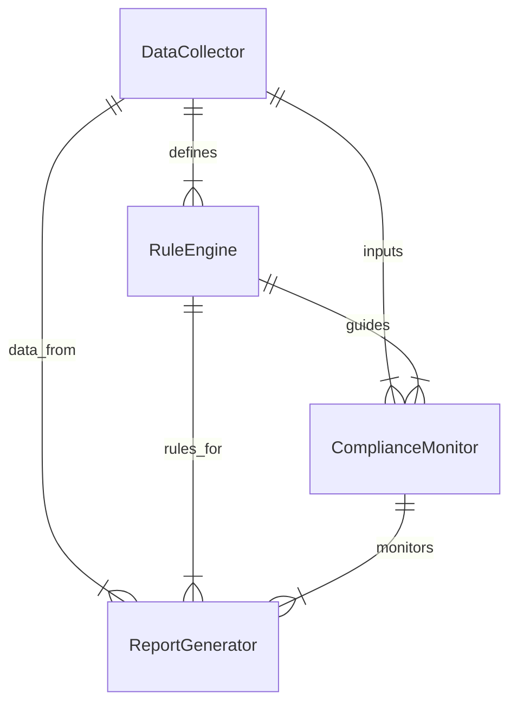
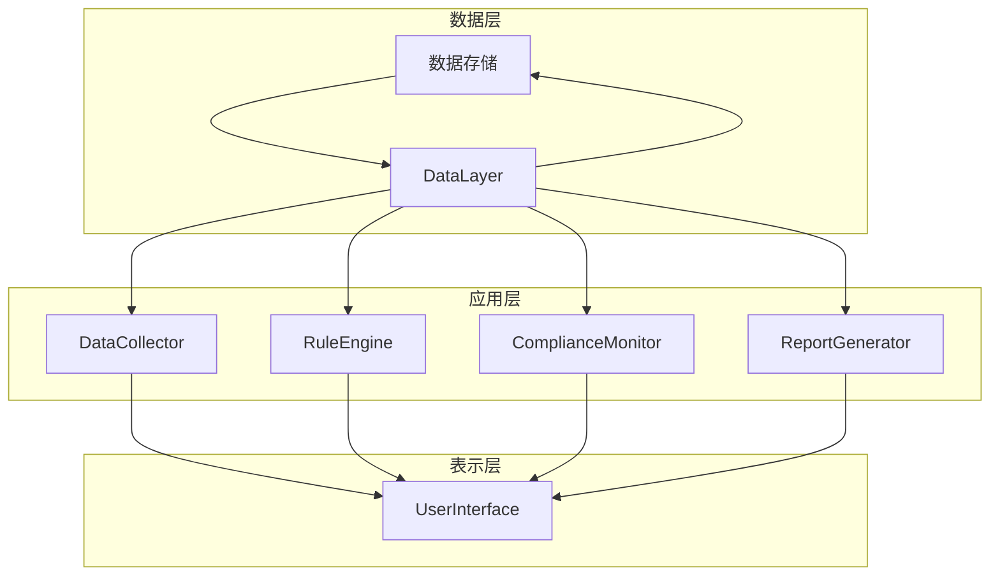
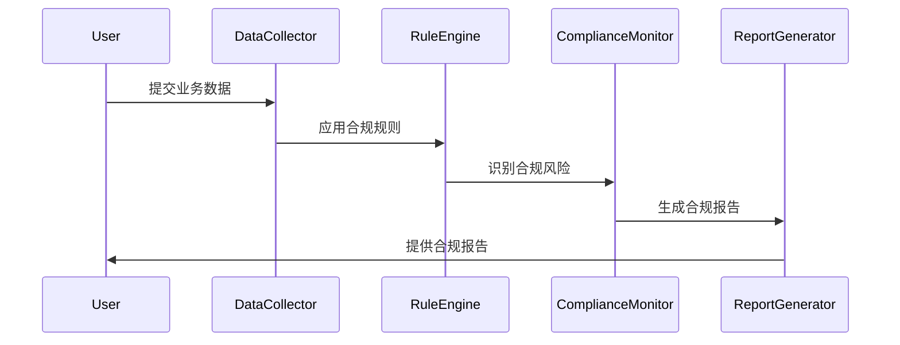

                 

 

# 金融监管合规自动化平台

关键词：金融监管、合规自动化、平台设计、风险监控、规则引擎

摘要：本文旨在探讨金融监管合规自动化平台的设计和实现，分析其核心概念与联系，阐述系统分析与架构设计方案，并通过实际案例进行应用解读和分析。

## 背景介绍

### 问题背景

在金融行业，监管合规是确保金融机构运营合法、稳健的核心环节。随着金融市场的复杂化和全球化，监管合规的要求日益严格，金融机构需要处理大量的合规数据，进行频繁的合规检查，这对金融机构的人力资源、时间资源和信息技术能力提出了巨大挑战。

### 问题描述

金融监管合规自动化平台旨在通过技术手段，实现监管合规流程的自动化，提高监管合规的效率和质量。该平台需要能够处理复杂的金融数据，识别合规风险，自动生成合规报告，并实时更新合规规则。

### 问题解决

通过建立金融监管合规自动化平台，金融机构可以实现以下目标：
- 自动化合规流程，降低人工操作错误的风险。
- 提高合规工作的效率，减少合规成本。
- 实时监控合规状况，确保金融机构的运营符合法规要求。

### 边界与外延

- 金融监管合规自动化平台的设计需要考虑金融行业的特定需求，如不同监管机构的法规要求、不同的业务场景等。
- 平台的架构和功能设计需要具备一定的灵活性和可扩展性，以适应未来的监管变化和技术更新。

## 核心概念与联系

### 金融监管合规自动化平台

#### 核心概念

金融监管合规自动化平台是一个集成了多种技术，用于自动化金融监管合规流程的系统。其核心功能包括数据采集、规则引擎、合规监控和报告生成。

#### 核心组成部分

金融监管合规自动化平台的主要组成部分如下：

1. **数据采集模块**：负责收集和处理金融机构的各类业务数据。
2. **规则引擎模块**：根据监管法规和机构内部政策，定义和更新合规规则。
3. **合规监控模块**：实时监控数据，识别潜在的合规风险。
4. **报告生成模块**：自动生成合规报告，供管理层和监管机构审查。

#### 概念属性特征对比表格

| 模块名称 | 功能 | 特点 | 关系 |
| --- | --- | --- | --- |
| 数据采集模块 | 收集和处理业务数据 | 自动化、高效 | 提供数据输入 |
| 规则引擎模块 | 定义和更新合规规则 | 智能化、灵活 | 指导数据监控 |
| 合规监控模块 | 实时监控合规状况 | 实时性、准确性 | 检测合规风险 |
| 报告生成模块 | 生成合规报告 | 自动化、规范化 | 提供合规证明 |

#### ER实体关系图架构



#### 数学模型和数学公式

在金融监管合规自动化平台中，合规风险评估可以通过以下数学模型实现：

$$
RiskScore = f(AuditFrequency, ComplianceRate, ViolationSeverity)
$$

其中：
- $RiskScore$ 代表合规风险得分。
- $AuditFrequency$ 代表审计频率。
- $ComplianceRate$ 代表合规率。
- $ViolationSeverity$ 代表违规严重程度。

详细讲解如下：
- **审计频率**：表示金融机构被审计的频率，频率越高，合规风险越小。
- **合规率**：表示金融机构合规操作的比率，比率越高，合规风险越小。
- **违规严重程度**：表示违规操作的严重性，严重程度越高，合规风险越大。

举例说明：如果一家金融机构的审计频率是每季度一次，合规率是95%，且没有发生重大违规操作，则其合规风险得分为较低水平。

## 系统分析与架构设计方案

### 问题场景介绍

某大型银行需要建立一套金融监管合规自动化平台，以应对日益复杂的监管环境，提高合规工作的效率和准确性。

### 项目介绍

- **项目名称**：金融监管合规自动化平台
- **项目目标**：实现金融监管合规流程的自动化，提高合规工作效率，确保合规操作符合法规要求。
- **项目背景**：随着金融市场的不断变化和监管要求的提高，银行需要处理大量合规数据，进行频繁的合规检查，传统的手动处理方式已无法满足需求。

### 系统功能设计

##### 领域模型Mermaid类图
```
classDiagram
DataCollector  <|-- RuleEngine
DataCollector  <|-- ComplianceMonitor
DataCollector  <|-- ReportGenerator
RuleEngine  <|-- ComplianceMonitor
RuleEngine  <|-- ReportGenerator
ComplianceMonitor  <|-- ReportGenerator
```

### 系统架构设计

金融监管合规自动化平台的架构设计应包括以下几个方面：

1. **数据层**：负责数据的存储和管理，包括业务数据、合规规则数据等。
2. **应用层**：包括数据采集模块、规则引擎模块、合规监控模块和报告生成模块等。
3. **表示层**：提供用户界面，便于用户操作和管理。

#### 系统架构Mermaid架构图



### 系统接口设计

金融监管合规自动化平台需要设计一系列接口，以实现不同模块之间的数据交互和功能调用。主要接口包括：

- **数据采集接口**：用于收集业务数据。
- **规则引擎接口**：用于定义和更新合规规则。
- **合规监控接口**：用于监控合规状况。
- **报告生成接口**：用于生成合规报告。

### 系统交互Mermaid序列图



## 项目实战

### 环境安装

1. **安装Python环境**：确保Python环境已安装，版本不低于3.8。
2. **安装依赖库**：通过pip安装以下依赖库：
   ```bash
   pip install pandas numpy flask
   ```

### 系统核心实现

以下是一个简单的Python实现，用于展示金融监管合规自动化平台的核心功能。

```python
import pandas as pd
import numpy as np

# 数据采集模块
class DataCollector:
    def __init__(self):
        self.data = []

    def collect_data(self, new_data):
        self.data.append(new_data)

    def get_data(self):
        return pd.DataFrame(self.data)

# 规则引擎模块
class RuleEngine:
    def __init__(self):
        self.rules = []

    def add_rule(self, rule):
        self.rules.append(rule)

    def apply_rules(self, data):
        for rule in self.rules:
            data = rule(data)
        return data

# 合规监控模块
class ComplianceMonitor:
    def check_compliance(self, data):
        # 检查合规性
        pass

# 报告生成模块
class ReportGenerator:
    def generate_report(self, data):
        # 生成报告
        pass

# 主程序
if __name__ == "__main__":
    # 创建对象
    collector = DataCollector()
    engine = RuleEngine()
    monitor = ComplianceMonitor()
    generator = ReportGenerator()

    # 收集数据
    collector.collect_data({'account': 'A001', 'balance': 10000})
    collector.collect_data({'account': 'A002', 'balance': 20000})

    # 应用规则
    engine.add_rule(lambda data: data[data['balance'] > 10000])
    data_with_rules = engine.apply_rules(collector.get_data())

    # 监控合规
    monitor.check_compliance(data_with_rules)

    # 生成报告
    generator.generate_report(data_with_rules)
```

### 代码应用解读与分析

上述代码实现了一个简单的金融监管合规自动化平台，主要包括数据采集、规则引擎、合规监控和报告生成四个核心模块。

- **数据采集模块**：通过`DataCollector`类实现，用于收集业务数据，存储在列表中，并转换为DataFrame格式便于后续处理。
- **规则引擎模块**：通过`RuleEngine`类实现，用于定义和更新合规规则，通过添加规则函数的方式实现规则的应用。
- **合规监控模块**：通过`ComplianceMonitor`类实现，用于检查数据的合规性，目前仅提供了一个空方法，具体实现需要根据监管要求进行。
- **报告生成模块**：通过`ReportGenerator`类实现，用于生成合规报告，目前仅提供了一个空方法，具体实现需要根据报告格式要求进行。

### 实际案例分析和详细讲解剖析

以某银行的账户余额监控为例，假设该银行需要监控账户余额超过10,000元的账户，以下是一个实际案例的分析和实现。

1. **数据采集**：银行系统每天会生成一份账户余额数据，包含账户名称和余额信息。
2. **规则引擎**：根据监管要求，需要监控账户余额超过10,000元的账户，因此添加一个规则函数，用于筛选出符合条件的账户。
3. **合规监控**：定期检查账户余额数据，识别是否存在违规操作。
4. **报告生成**：将监控结果生成报告，供管理层审查。

```python
# 添加规则
engine.add_rule(lambda data: data[data['balance'] > 10000])

# 应用规则并监控
data_with_rules = engine.apply_rules(collector.get_data())
monitor.check_compliance(data_with_rules)

# 生成报告
generator.generate_report(data_with_rules)
```

### 项目小结

本文详细介绍了金融监管合规自动化平台的设计和实现，包括背景介绍、核心概念与联系、系统分析与架构设计方案以及项目实战。通过实际案例分析和代码实现，展示了金融监管合规自动化平台的核心功能和应用场景。未来，金融监管合规自动化平台的发展将更加注重智能化和灵活性，以应对不断变化的监管环境和市场需求。

## 最佳实践 Tips

1. **数据采集**：确保数据的完整性和准确性，定期更新数据。
2. **规则引擎**：根据监管要求灵活定义和更新合规规则，保持平台的适应性。
3. **合规监控**：实时监控数据，及时识别和应对合规风险。
4. **报告生成**：规范报告格式，确保报告内容准确、完整。

## 小结

金融监管合规自动化平台是金融行业应对复杂监管环境的重要工具。通过本文的介绍，我们了解了其核心概念、系统架构和实现方法。金融监管合规自动化平台的建设有助于提高合规工作效率，降低合规风险，为金融机构的稳健运营提供有力支持。

## 注意事项

1. **数据安全**：在数据采集和处理过程中，确保数据的安全和隐私。
2. **规则更新**：定期更新合规规则，以适应监管变化。

## 拓展阅读

1. [金融科技与监管合规](https://www.financialexpress.com/industry/finance/banking/financial-technology-and-regulatory-compliance/163580/)
2. [人工智能在金融合规中的应用](https://www.csrc.gov.cn/web/site0/tab5651/list.shtml)
3. [金融监管科技发展趋势](https://www.bloomberg.com/news/articles/2021-08-10/how-regtech-is-redefining-the-banking-industry)

作者：AI天才研究院/AI Genius Institute & 禅与计算机程序设计艺术 /Zen And The Art of Computer Programming

