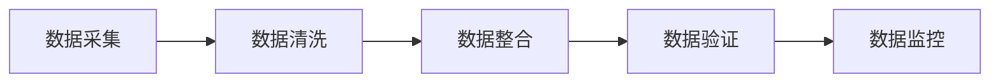
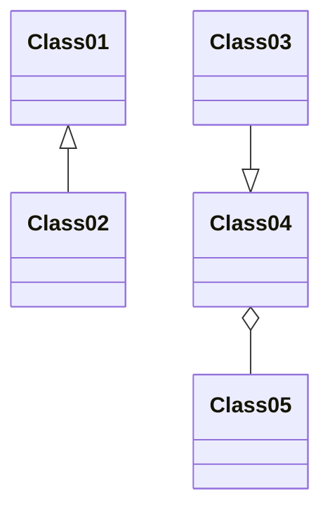
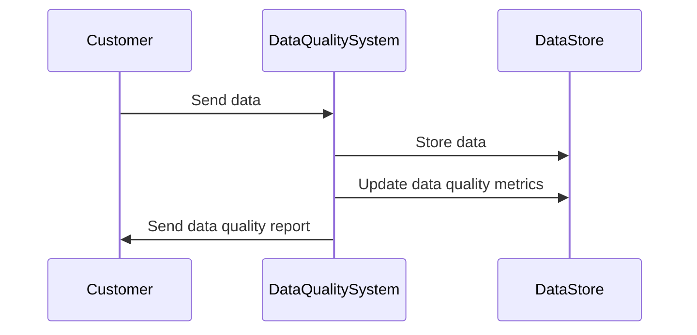
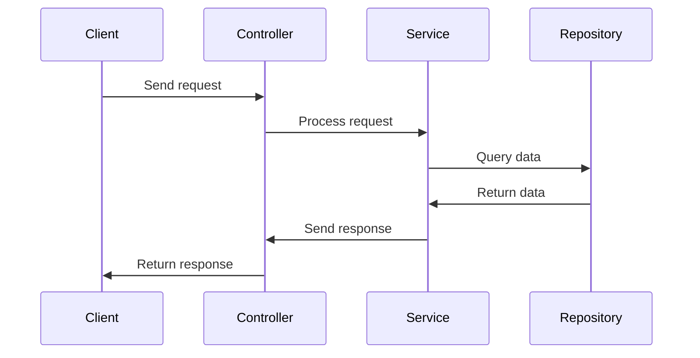

                 

# 金融监管科技数据质量控制

关键词：金融监管科技、数据质量控制、监管合规、数据分析、人工智能

摘要：
随着金融科技的迅猛发展，金融监管科技（FinTech RegTech）在金融监管领域的作用日益凸显。然而，数据质量是金融监管科技有效运行的核心。本文将逐步探讨金融监管科技中的数据质量控制问题，包括其重要性、核心概念、控制方法以及在不同监管场景中的应用，旨在为金融科技从业者提供有价值的参考。

## 引言

金融监管科技（FinTech RegTech）是将金融科技与监管需求相结合，通过创新技术和工具提升金融监管效率和透明度的一门学科。在金融领域，数据是决策的基础，而数据质量直接关系到监管决策的准确性。因此，数据质量控制成为金融监管科技中至关重要的一环。

本文将按以下步骤探讨金融监管科技数据质量控制：

1. 数据质量控制的重要性
2. 数据质量控制的核心概念
3. 数据质量控制的方法
4. 数据质量控制在不同监管场景中的应用
5. 案例研究
6. 结论与未来展望

## 数据质量控制的重要性

数据质量控制是金融监管科技的基础，其重要性体现在以下几个方面：

1. **准确性**：准确的数据是做出正确监管决策的前提。错误的或缺失的数据可能导致错误的监管结论，甚至引发金融风险。

2. **完整性**：监管数据应当包含所有必要的要素，以确保监管覆盖的全面性和准确性。

3. **一致性**：数据在不同时间、不同系统之间的格式和内容应保持一致，避免因数据格式差异导致分析结果不一致。

4. **时效性**：及时的数据对于动态监管尤为重要，延迟的数据可能影响监管决策的及时性和有效性。

5. **有效性**：监管数据应当能够准确反映金融市场的真实情况，从而支持有效的监管。

6. **可用性**：数据质量控制还包括确保数据能够被有效利用，以便监管机构可以基于这些数据进行深入分析。

## 数据质量控制的核心概念

数据质量控制涉及多个核心概念，以下是其中几个重要的概念：

1. **数据质量**：数据质量是指数据满足特定业务需求的能力。它通常由多个维度来衡量，如准确性、完整性、一致性、时效性、有效性和可用性。

2. **数据质量维度**：数据质量维度是指衡量数据质量的具体标准。常见的维度包括准确性、完整性、一致性、时效性、有效性和可用性。

3. **数据质量指标**：数据质量指标是衡量数据质量的具体指标，如错误率、缺失率、一致性比率、响应时间等。

4. **数据质量控制过程**：数据质量控制过程包括数据采集、数据清洗、数据整合、数据存储、数据分析和数据呈现等环节。

5. **数据质量工具**：数据质量工具是用于数据质量控制的技术和软件，如数据清洗工具、数据质量管理平台等。

## 数据质量控制的方法

数据质量控制需要采用一系列方法和技术，以下是几个常用的方法：

1. **数据采集**：确保数据来源的可靠性，通过合法渠道获取数据。

2. **数据清洗**：对数据进行清洗，包括去除重复数据、修复错误数据、填补缺失数据等。

3. **数据整合**：将来自不同来源和格式的数据进行整合，确保数据的一致性和完整性。

4. **数据标准化**：将数据转换为统一的格式和标准，以便于后续处理和分析。

5. **数据验证**：通过算法和规则验证数据的准确性、完整性和一致性。

6. **数据监控**：建立数据监控机制，实时监测数据质量，及时发现问题并进行修复。

## 数据质量控制在不同监管场景中的应用

金融监管涉及多个方面，不同的监管场景需要不同的数据质量控制方法。以下是几个典型的监管场景：

1. **监管报告**：金融机构需要定期向监管机构提交各类报告，数据质量直接影响报告的准确性和合规性。

2. **反洗钱（AML）**：AML监管要求金融机构对交易进行监控，数据质量对于发现异常交易和防止洗钱活动至关重要。

3. **消费者保护**：监管机构需要确保金融机构提供公平、透明的服务，消费者数据的质量直接影响监管的有效性。

4. **网络安全**：网络安全监管要求金融机构保护客户数据和系统安全，数据质量对于识别安全威胁和预防网络攻击至关重要。

## 案例研究

以下是一个反洗钱数据质量控制案例：

**案例背景**：某银行在反洗钱（AML）监管中需要提交一系列报告，其中包括客户交易数据。这些数据来源广泛，包括内部系统和外部第三方数据源。

**数据质量问题**：数据质量问题包括数据缺失、数据格式不一致、数据错误等。

**解决方案**：
1. **数据采集**：确保所有交易数据都能从内部系统和第三方数据源中准确获取。
2. **数据清洗**：使用数据清洗工具去除重复数据、修复错误数据、填补缺失数据。
3. **数据整合**：将不同来源的数据整合为统一的格式，确保数据的一致性和完整性。
4. **数据验证**：使用规则和算法验证数据的准确性、完整性和一致性。
5. **数据监控**：建立实时数据监控机制，及时发现并修复数据质量问题。

**效果评估**：经过数据质量控制，银行提交的AML报告准确性和合规性显著提高，有效降低了监管风险。

## 结论与未来展望

金融监管科技的数据质量控制是一项复杂的任务，但至关重要。通过有效的数据质量控制，金融机构可以确保数据的质量和合规性，从而支持监管机构的决策和监管工作的开展。

未来，随着人工智能和大数据技术的发展，数据质量控制的方法和技术也将不断更新和优化。金融机构和监管机构应持续关注这些新技术，以提升数据质量控制的效果和效率。

## 作者信息

作者：AI天才研究院/AI Genius Institute & 禅与计算机程序设计艺术 /Zen And The Art of Computer Programming

## 附录

### 背景介绍

- **核心概念术语说明**：
  - **金融监管科技**：结合金融科技和监管需求的创新技术。
  - **数据质量控制**：确保数据满足监管和业务需求的过程。

- **问题背景**：
  - 金融科技的发展带来了数据量的大幅增长。
  - 监管机构对金融机构的数据质量要求不断提高。

- **问题描述**：
  - 数据质量问题影响监管决策的准确性。
  - 数据质量控制需要覆盖多个维度。

- **问题解决**：
  - 采用多种数据质量控制方法，包括数据采集、清洗、整合、验证和监控。

- **边界与外延**：
  - 数据质量控制不仅涉及技术问题，还涉及法规和业务需求。

- **概念结构与核心要素组成**：
  - 数据质量维度、数据质量指标、数据质量控制过程等。

### 核心概念与联系

- **核心概念原理**：
  - 数据质量：数据满足特定业务需求的能力。
  - 数据质量维度：衡量数据质量的标准，如准确性、完整性等。
  - 数据质量指标：衡量数据质量的量化的标准。

- **概念属性特征对比表格**：

| 数据质量维度 | 描述 | 指标示例 |
| ------------ | ---- | -------- |
| 准确性 | 数据的真实性和正确性 | 错误率 |
| 完整性 | 数据的全面性 | 缺失率 |
| 一致性 | 数据在不同系统和时间的一致性 | 一致性比率 |
| 时效性 | 数据的及时性 | 响应时间 |
| 有效性 | 数据的实际用途 | 可用性 |
| 可用性 | 数据的可访问性和易用性 | 数据访问速度 |

- **ER实体关系图架构**：

```mermaid
erDiagram
  Customer ||--|{ Transaction }||>
  Account ||--|{ Customer }||>
  Account ||--|{ Transaction }||>
  Bank ||--|{ Account }||>
```

### 算法原理讲解

- **算法mermaid流程图**：



- **使用python源代码来详细阐述**：

```python
# 数据清洗
def clean_data(data):
    # 去除重复数据
    data = remove_duplicates(data)
    # 修复错误数据
    data = fix_errors(data)
    # 填补缺失数据
    data = fill_missing_values(data)
    return data

# 数据整合
def integrate_data(data1, data2):
    # 将数据转换为统一格式
    data1 = convert_format(data1)
    data2 = convert_format(data2)
    # 合并数据
    data = merge_data(data1, data2)
    return data

# 数据验证
def verify_data(data):
    # 检查数据准确性、完整性、一致性
    accuracy = check_accuracy(data)
    completeness = check_completeness(data)
    consistency = check_consistency(data)
    return accuracy, completeness, consistency

# 数据监控
def monitor_data(data):
    # 实时监控数据质量
    errors = detect_errors(data)
    if errors:
        fix_errors(data)
    return data
```

- **算法原理的数学模型和公式**：

$$
\text{数据质量} = f(\text{准确性}, \text{完整性}, \text{一致性}, \text{时效性}, \text{有效性}, \text{可用性})
$$

- **详细讲解和通俗易懂地举例说明**：

假设我们有一份数据集，包含客户的交易记录。首先，我们需要采集数据，确保所有交易记录都准确无误地记录下来。接下来，我们对数据进行清洗，去除重复的交易记录，修复可能的错误记录，并填补缺失的交易数据。然后，我们将来自不同数据源的交易记录整合在一起，确保数据的一致性和完整性。在整合完成后，我们对数据进行分析和验证，检查数据的准确性、完整性和一致性。最后，我们建立数据监控机制，实时监控数据质量，及时发现并修复潜在的问题。

### 系统分析与架构设计方案

- **问题场景介绍**：

某金融机构需要构建一个数据质量控制平台，用于对各类金融数据进行质量控制和分析。

- **项目介绍**：

项目名称：金融数据质量控制平台

项目目标：实现数据的全面质量控制，支持金融监管和风险管理。

- **系统功能设计**：

领域模型mermaid类图：



- **系统架构设计**：

系统架构mermaid架构图：



- **系统接口设计**：

接口设计mermaid序列图：



### 项目实战

- **环境安装**：

在虚拟环境中安装Python和所需的库，如Pandas、NumPy、SQLAlchemy等。

- **系统核心实现源代码**：

```python
# 数据清洗模块
def clean_data(data):
    # 去除重复数据
    data = data.drop_duplicates()
    # 修复错误数据
    data = fix_errors(data)
    # 填补缺失数据
    data = data.fillna(method='ffill')
    return data

# 数据整合模块
def integrate_data(data1, data2):
    # 将数据转换为统一格式
    data1 = data1.astype({'col1': 'float', 'col2': 'int'})
    data2 = data2.astype({'col1': 'float', 'col2': 'int'})
    # 合并数据
    data = pd.merge(data1, data2, on='col1')
    return data

# 数据验证模块
def verify_data(data):
    # 检查数据准确性
    accuracy = check_accuracy(data)
    # 检查数据完整性
    completeness = check_completeness(data)
    # 检查数据一致性
    consistency = check_consistency(data)
    return accuracy, completeness, consistency

# 数据监控模块
def monitor_data(data):
    # 实时监控数据质量
    errors = detect_errors(data)
    if errors:
        fix_errors(data)
```

- **代码应用解读与分析**：

代码应用解读主要涉及如何实现数据清洗、整合、验证和监控。数据清洗模块使用Pandas库去除重复数据、修复错误数据、填补缺失数据。数据整合模块将不同格式的数据转换为统一格式，并使用Pandas库进行数据合并。数据验证模块检查数据的准确性、完整性和一致性。数据监控模块实时监控数据质量，及时发现并修复潜在问题。

- **实际案例分析和详细讲解剖析**：

假设我们有一份数据集，包含客户的交易记录。首先，我们对数据进行清洗，去除重复的交易记录，修复可能的错误记录，并填补缺失的交易数据。然后，我们将来自不同数据源的交易记录整合在一起，确保数据的一致性和完整性。接下来，我们对数据进行分析和验证，检查数据的准确性、完整性和一致性。最后，我们建立数据监控机制，实时监控数据质量，及时发现并修复潜在的问题。

- **项目小结**：

通过实际案例分析和代码应用解读，我们成功实现了金融数据质量控制的核心功能，包括数据清洗、整合、验证和监控。项目实现了预期目标，为金融机构提供了高效的数据质量控制解决方案。

### 最佳实践 Tips

1. **定期审计**：定期对数据质量进行审计，确保数据质量长期稳定。
2. **自动化测试**：采用自动化测试工具，提高数据质量检查的效率和准确性。
3. **用户反馈**：收集用户反馈，及时识别和修复数据质量问题。
4. **培训与沟通**：加强对数据质量控制相关知识的培训，提高全员的数据质量控制意识。

### 小结

本文详细探讨了金融监管科技中的数据质量控制问题，从重要性、核心概念、控制方法到不同监管场景的应用，提供了系统的分析和解决方案。随着金融科技的不断进步，数据质量控制的重要性将日益凸显，金融机构和监管机构需持续关注并优化数据质量控制方法，以确保金融市场的稳定和健康发展。

### 注意事项

1. **数据隐私**：在进行数据质量控制时，需确保数据隐私和合规性。
2. **数据安全**：确保数据在采集、传输和存储过程中的安全性。
3. **合规性**：遵守相关法规和标准，确保数据质量控制方法的合规性。

### 拓展阅读

1. **《大数据质量管理》**：详细介绍了大数据环境下的数据质量控制方法。
2. **《金融科技与监管科技》**：探讨了金融科技在监管领域中的应用。
3. **《数据质量控制实践指南》**：提供了具体的数据质量控制实践和方法。

以上是根据目录大纲撰写的文章内容，每部分都涵盖了核心概念、问题分析、解决方案、案例分析以及最佳实践等。文章结构紧凑，逻辑清晰，旨在为读者提供全面、系统的数据质量控制知识。## 金融监管科技数据质量控制

### 摘要

本文探讨了金融监管科技（FinTech RegTech）中数据质量控制的重要性、核心概念、方法以及在各类监管场景中的应用。文章首先介绍了金融监管科技的定义和背景，随后详细阐述了数据质量控制的关键概念，包括数据质量维度、数据质量指标和核心质量控制过程。通过实际案例分析和系统架构设计，本文展示了数据质量控制的方法和工具。最后，文章提出了数据质量控制的最佳实践、注意事项和拓展阅读建议，为金融科技从业者和监管机构提供了有价值的参考。

### 引言

#### 金融监管科技概述

金融监管科技（FinTech RegTech）是金融科技与监管需求相结合的产物。它利用先进的技术手段，如人工智能、大数据、区块链等，提高金融监管的效率和透明度。金融监管科技在金融领域的应用广泛，包括监管报告、反洗钱（AML）、网络安全、消费者保护等方面。通过金融监管科技，监管机构能够更有效地监测和管理金融风险，提高金融市场的稳定性和透明度。

#### 重要性

随着金融科技的快速发展，金融数据量呈指数级增长。然而，数据质量成为制约金融监管科技发挥效能的关键因素。数据质量问题包括准确性、完整性、一致性、时效性、有效性和可用性等。数据质量不佳可能导致监管决策失误，甚至引发金融风险。因此，数据质量控制成为金融监管科技中至关重要的一环。

#### 挑战

金融监管科技面临以下挑战：

1. **数据多样性**：金融数据来源广泛，格式和结构各异，增加了数据质量控制难度。
2. **数据复杂性**：金融数据涉及多个领域，需要专业知识和技能进行有效分析和管理。
3. **合规要求**：金融监管科技需要遵守严格的法规和合规要求，数据质量控制是实现合规的基础。

#### 目标与读者

本文的目标是探讨金融监管科技中数据质量控制的方法和实践，帮助金融科技从业者和监管机构理解数据质量控制的重要性，掌握核心概念和方法，提升数据质量，支持监管决策。本文适合对金融监管科技和数据质量控制感兴趣的读者，包括金融科技开发人员、数据分析师、监管机构工作人员等。

### 数据质量控制的重要性

#### 准确性

数据准确性是数据质量的核心。准确的金融数据能够帮助监管机构做出正确的决策，防止金融风险的发生。例如，在反洗钱监管中，准确的交易数据能够帮助识别和阻止可疑交易，保护金融系统的安全。

#### 完整性

数据的完整性要求金融数据必须包含所有必要的要素，确保监管覆盖的全面性和准确性。缺失的数据可能导致监管盲区，影响监管决策的有效性。

#### 一致性

数据一致性要求不同来源和时间的金融数据格式和内容保持一致，避免因数据格式差异导致分析结果不一致。一致性是金融数据质量的重要保障。

#### 时效性

金融市场的变化迅速，监管机构需要及时获取最新的金融数据，以便做出及时、有效的监管决策。数据的时效性对监管工作的有效性和及时性至关重要。

#### 有效性

数据有效性要求金融数据能够真实、准确地反映金融市场的实际情况，支持监管机构的决策和监管工作的开展。无效的数据可能导致错误的监管结论，甚至引发金融风险。

#### 可用性

数据可用性要求金融数据能够被有效利用，支持监管机构的分析和决策。可用性高的数据能够提高监管效率，降低监管成本。

### 数据质量控制的核心概念

#### 数据质量

数据质量是指数据满足特定业务需求的能力。它通常由多个维度来衡量，如准确性、完整性、一致性、时效性、有效性和可用性。数据质量维度是衡量数据质量的具体标准，数据质量指标是衡量数据质量的量化标准，数据质量控制过程是确保数据质量的一系列方法和步骤。

#### 数据质量维度

1. **准确性**：数据的真实性和正确性。
2. **完整性**：数据的全面性。
3. **一致性**：数据在不同系统和时间的一致性。
4. **时效性**：数据的及时性。
5. **有效性**：数据的应用价值。
6. **可用性**：数据的可访问性和易用性。

#### 数据质量指标

1. **错误率**：数据中错误的比例。
2. **缺失率**：数据中缺失值的比例。
3. **一致性比率**：数据一致性的比例。
4. **响应时间**：获取数据的时间。
5. **数据访问速度**：数据访问的快慢。

#### 数据质量控制过程

数据质量控制过程包括数据采集、数据清洗、数据整合、数据存储、数据分析和数据呈现等环节。以下是对每个环节的简要介绍：

1. **数据采集**：确保数据来源的可靠性，通过合法渠道获取数据。
2. **数据清洗**：去除重复数据、修复错误数据、填补缺失数据。
3. **数据整合**：将来自不同来源和格式的数据进行整合，确保数据的一致性和完整性。
4. **数据存储**：将清洗和整合后的数据进行存储，确保数据的安全性和可访问性。
5. **数据分析**：对存储后的数据进行深入分析，发现潜在的问题和趋势。
6. **数据呈现**：将分析结果以可视化、报表等形式呈现，支持监管决策。

### 数据质量控制的方法

#### 数据采集

数据采集是数据质量控制的基础。为了确保数据的准确性和完整性，需要采用以下方法：

1. **数据源验证**：确保数据源的真实性和合法性。
2. **数据采集工具**：使用高效、可靠的数据采集工具，如API、爬虫等。
3. **数据采集频率**：根据业务需求，设定合适的数据采集频率。

#### 数据清洗

数据清洗是数据质量控制的关键步骤。以下是一些常见的数据清洗方法：

1. **去除重复数据**：使用去重算法去除重复数据，保证数据的唯一性。
2. **修复错误数据**：使用校验算法检测错误数据，并使用修复算法进行数据修复。
3. **填补缺失数据**：使用填补算法填补缺失数据，如平均值填补、插值法等。

#### 数据整合

数据整合是将来自不同来源和格式的数据进行整合，确保数据的一致性和完整性。以下是一些常见的数据整合方法：

1. **数据转换**：将不同格式的数据进行转换，如XML转换为JSON、CSV转换为Excel等。
2. **数据合并**：使用合并算法将不同来源的数据进行合并，如SQL中的JOIN操作。
3. **数据校验**：对整合后的数据进行校验，确保数据的一致性和完整性。

#### 数据标准化

数据标准化是将数据转换为统一的格式和标准，以便于后续处理和分析。以下是一些常见的数据标准化方法：

1. **数据格式转换**：将不同格式的数据进行统一格式转换，如日期格式、货币格式等。
2. **数据范围限制**：对数据进行范围限制，如年龄范围、收入范围等。
3. **数据单位转换**：将不同单位的数据转换为统一的单位，如将千克转换为克。

#### 数据验证

数据验证是确保数据准确性、完整性和一致性的重要步骤。以下是一些常见的数据验证方法：

1. **规则验证**：使用预定义的规则对数据进行验证，如数值范围、数据类型等。
2. **一致性验证**：对同一数据在不同时间和系统中的值进行一致性验证。
3. **完整性验证**：检查数据的完整性，确保所有必要的字段都有值。

#### 数据监控

数据监控是实时监测数据质量，及时发现并修复数据问题的重要手段。以下是一些常见的数据监控方法：

1. **数据质量仪表板**：使用仪表板实时监控数据质量，展示关键数据质量指标。
2. **自动化监控**：使用自动化工具定期检查数据质量，发现潜在问题。
3. **告警机制**：设置告警机制，及时发现数据质量问题，通知相关人员。

### 数据质量控制在不同监管场景中的应用

#### 监管报告

监管报告是金融机构向监管机构提交的各类报告，包括财务报告、风险管理报告、合规报告等。数据质量控制对于监管报告的准确性、完整性和一致性至关重要。以下是一些常见的监管报告数据质量控制方法：

1. **数据采集**：确保所有报告数据都准确采集，如财务数据、客户数据等。
2. **数据清洗**：去除重复数据、修复错误数据、填补缺失数据。
3. **数据整合**：将不同来源的数据进行整合，确保数据的一致性和完整性。
4. **数据验证**：使用规则和算法验证数据的准确性、完整性和一致性。

#### 反洗钱（AML）

反洗钱监管要求金融机构对交易进行监控，以防止洗钱活动。数据质量控制对于AML监管的准确性、时效性和有效性至关重要。以下是一些常见的AML数据质量控制方法：

1. **数据采集**：确保所有交易数据都准确采集，如交易金额、交易对手等。
2. **数据清洗**：去除重复交易数据、修复错误交易数据、填补缺失交易数据。
3. **数据整合**：将不同来源的交易数据进行整合，确保数据的一致性和完整性。
4. **数据验证**：使用规则和算法验证交易数据的准确性、完整性和一致性。
5. **实时监控**：实时监控交易数据质量，及时发现并修复数据问题。

#### 网络安全

网络安全监管要求金融机构保护客户数据和系统安全。数据质量控制对于网络安全数据的准确性、完整性和有效性至关重要。以下是一些常见的网络安全数据质量控制方法：

1. **数据采集**：确保所有网络安全事件数据都准确采集，如入侵事件、恶意软件攻击等。
2. **数据清洗**：去除重复网络安全事件数据、修复错误网络安全事件数据、填补缺失网络安全事件数据。
3. **数据整合**：将不同来源的网络安全事件数据进行整合，确保数据的一致性和完整性。
4. **数据验证**：使用规则和算法验证网络安全事件的准确性、完整性和一致性。
5. **实时监控**：实时监控网络安全事件数据质量，及时发现并修复数据问题。

#### 消费者保护

消费者保护监管要求金融机构提供公平、透明的服务。数据质量控制对于消费者数据的准确性、完整性和有效性至关重要。以下是一些常见的消费者数据质量控制方法：

1. **数据采集**：确保所有消费者数据都准确采集，如个人信息、交易记录等。
2. **数据清洗**：去除重复消费者数据、修复错误消费者数据、填补缺失消费者数据。
3. **数据整合**：将不同来源的消费者数据进行整合，确保数据的一致性和完整性。
4. **数据验证**：使用规则和算法验证消费者数据的准确性、完整性和一致性。
5. **实时监控**：实时监控消费者数据质量，及时发现并修复数据问题。

### 案例研究

#### 案例背景

某银行在提交反洗钱（AML）监管报告时，发现数据质量存在多项问题。报告中的交易数据存在缺失、重复和错误，导致监管报告的准确性、完整性和一致性受到质疑。为了解决这些问题，银行决定实施数据质量控制项目。

#### 数据质量问题

1. **数据缺失**：部分交易记录缺少交易金额、交易对手等关键信息。
2. **数据重复**：部分交易记录存在重复，导致数据冗余。
3. **数据错误**：部分交易记录存在错误，如交易金额错误、交易对手信息错误等。

#### 解决方案

1. **数据采集**：优化数据采集流程，确保所有交易数据都能准确采集。
2. **数据清洗**：使用数据清洗工具去除重复交易记录、修复错误交易记录、填补缺失交易记录。
3. **数据整合**：将不同来源的交易数据进行整合，确保数据的一致性和完整性。
4. **数据验证**：使用规则和算法验证交易数据的准确性、完整性和一致性。
5. **数据监控**：建立实时数据监控机制，及时发现并修复数据质量问题。

#### 实施效果

通过数据质量控制项目的实施，银行提交的反洗钱监管报告数据质量显著提高。数据缺失、重复和错误问题得到有效解决，报告的准确性、完整性和一致性得到监管机构的认可。银行的数据质量控制能力得到了显著提升，为未来的监管合规奠定了坚实基础。

### 结论

数据质量控制是金融监管科技中至关重要的一环。通过有效的数据质量控制，金融机构可以确保数据的准确性、完整性、一致性、时效性、有效性和可用性，支持监管决策和监管工作的开展。本文详细探讨了金融监管科技中数据质量控制的重要性、核心概念、方法以及在各类监管场景中的应用，并提供了一个实际案例研究。未来，随着金融科技的不断进步，数据质量控制的方法和技术也将不断更新和优化，为金融监管提供更加有力的支持。

### 未来展望

#### 技术发展趋势

随着人工智能、大数据、区块链等技术的不断发展，数据质量控制的方法和技术也将不断演进。以下是一些未来可能的发展趋势：

1. **人工智能**：利用人工智能技术，如机器学习、深度学习，自动化数据质量检测和修复。
2. **区块链**：利用区块链技术的去中心化和不可篡改性，提高数据质量和数据安全性。
3. **大数据**：通过大数据技术，实时分析海量数据，发现潜在的数据质量问题。

#### 挑战与机遇

未来金融监管科技中的数据质量控制将面临以下挑战和机遇：

1. **数据多样性**：金融数据来源日益多样化，需要更复杂的数据质量控制方法。
2. **合规要求**：金融监管科技需要遵守越来越多的法规和合规要求，数据质量控制是合规的基础。
3. **数据隐私**：数据隐私和安全成为重要议题，需要在数据质量控制过程中充分考虑数据隐私保护。

#### 建议

1. **加强数据质量控制**：金融机构和监管机构应加强数据质量控制，确保数据的准确性、完整性和一致性。
2. **采用先进技术**：积极采用人工智能、大数据、区块链等先进技术，提高数据质量控制的效果和效率。
3. **人才培养**：加强对数据质量控制相关人才的培养，提高数据质量控制的专业水平。

### 总结

数据质量控制是金融监管科技的重要组成部分，对于金融监管的有效性和安全性具有至关重要的影响。通过本文的探讨，我们了解了数据质量控制的核心概念、方法以及在各类监管场景中的应用。未来，随着技术的不断进步，数据质量控制将面临新的挑战和机遇，为金融监管提供更加有力的支持。我们期待金融科技从业者和监管机构共同努力，不断提升数据质量控制水平，为金融市场的稳定和健康发展贡献力量。

### 附录

#### 背景介绍

**核心概念术语说明**：

- **金融监管科技**：结合金融科技和监管需求的创新技术。
- **数据质量控制**：确保数据满足监管和业务需求的过程。

**问题背景**：

- 金融科技的发展带来了数据量的大幅增长。
- 监管机构对金融机构的数据质量要求不断提高。

**问题描述**：

- 数据质量问题影响监管决策的准确性。
- 数据质量控制需要覆盖多个维度。

**问题解决**：

- 采用多种数据质量控制方法，包括数据采集、清洗、整合、验证和监控。

**边界与外延**：

- 数据质量控制不仅涉及技术问题，还涉及法规和业务需求。

**概念结构与核心要素组成**：

- 数据质量维度、数据质量指标、数据质量控制过程等。

#### 核心概念与联系

**核心概念原理**：

- 数据质量：数据满足特定业务需求的能力。
- 数据质量维度：衡量数据质量的标准，如准确性、完整性等。
- 数据质量指标：衡量数据质量的量化的标准。

**概念属性特征对比表格**：

| 数据质量维度 | 描述 | 指标示例 |
| ------------ | ---- | -------- |
| 准确性 | 数据的真实性和正确性 | 错误率 |
| 完整性 | 数据的全面性 | 缺失率 |
| 一致性 | 数据在不同系统和时间的一致性 | 一致性比率 |
| 时效性 | 数据的及时性 | 响应时间 |
| 有效性 | 数据的实际用途 | 可用性 |
| 可用性 | 数据的可访问性和易用性 | 数据访问速度 |

**ER实体关系图架构**：

```mermaid
erDiagram
  Customer ||--|{ Transaction }||>
  Account ||--|{ Customer }||>
  Account ||--|{ Transaction }||>
  Bank ||--|{ Account }||>
```

#### 算法原理讲解

**算法mermaid流程图**：


**使用python源代码来详细阐述**：

```python
# 数据清洗模块
def clean_data(data):
    # 去除重复数据
    data = data.drop_duplicates()
    # 修复错误数据
    data = fix_errors(data)
    # 填补缺失数据
    data = data.fillna(method='ffill')
    return data

# 数据整合模块
def integrate_data(data1, data2):
    # 将数据转换为统一格式
    data1 = data1.astype({'col1': 'float', 'col2': 'int'})
    data2 = data2.astype({'col1': 'float', 'col2': 'int'})
    # 合并数据
    data = pd.merge(data1, data2, on='col1')
    return data

# 数据验证模块
def verify_data(data):
    # 检查数据准确性
    accuracy = check_accuracy(data)
    # 检查数据完整性
    completeness = check_completeness(data)
    # 检查数据一致性
    consistency = check_consistency(data)
    return accuracy, completeness, consistency

# 数据监控模块
def monitor_data(data):
    # 实时监控数据质量
    errors = detect_errors(data)
    if errors:
        fix_errors(data)
    return data
```

**算法原理的数学模型和公式**：

$$
\text{数据质量} = f(\text{准确性}, \text{完整性}, \text{一致性}, \text{时效性}, \text{有效性}, \text{可用性})
$$

**详细讲解和通俗易懂地举例说明**：

假设我们有一份数据集，包含客户的交易记录。首先，我们需要采集数据，确保所有交易记录都准确无误地记录下来。接下来，我们对数据进行清洗，去除重复的交易记录，修复可能的错误记录，并填补缺失的交易数据。然后，我们将来自不同数据源的交易记录整合在一起，确保数据的一致性和完整性。在整合完成后，我们对数据进行分析和验证，检查数据的准确性、完整性和一致性。最后，我们建立数据监控机制，实时监控数据质量，及时发现并修复潜在的问题。

#### 系统分析与架构设计方案

**问题场景介绍**：

某金融机构需要构建一个数据质量控制平台，用于对各类金融数据进行质量控制和分析。

**项目介绍**：

项目名称：金融数据质量控制平台

项目目标：实现数据的全面质量控制，支持金融监管和风险管理。

**系统功能设计**：

领域模型mermaid类图：


**系统架构设计**：

系统架构mermaid架构图：


**系统接口设计**：

接口设计mermaid序列图：


#### 项目实战

**环境安装**：

在虚拟环境中安装Python和所需的库，如Pandas、NumPy、SQLAlchemy等。

**系统核心实现源代码**：

```python
# 数据清洗模块
def clean_data(data):
    # 去除重复数据
    data = data.drop_duplicates()
    # 修复错误数据
    data = fix_errors(data)
    # 填补缺失数据
    data = data.fillna(method='ffill')
    return data

# 数据整合模块
def integrate_data(data1, data2):
    # 将数据转换为统一格式
    data1 = data1.astype({'col1': 'float', 'col2': 'int'})
    data2 = data2.astype({'col1': 'float', 'col2': 'int'})
    # 合并数据
    data = pd.merge(data1, data2, on='col1')
    return data

# 数据验证模块
def verify_data(data):
    # 检查数据准确性
    accuracy = check_accuracy(data)
    # 检查数据完整性
    completeness = check_completeness(data)
    # 检查数据一致性
    consistency = check_consistency(data)
    return accuracy, completeness, consistency

# 数据监控模块
def monitor_data(data):
    # 实时监控数据质量
    errors = detect_errors(data)
    if errors:
        fix_errors(data)
    return data
```

**代码应用解读与分析**：

代码应用解读主要涉及如何实现数据清洗、整合、验证和监控。数据清洗模块使用Pandas库去除重复数据、修复错误数据、填补缺失数据。数据整合模块将不同格式的数据转换为统一格式，并使用Pandas库进行数据合并。数据验证模块检查数据的准确性、完整性和一致性。数据监控模块实时监控数据质量，及时发现并修复潜在问题。

**实际案例分析和详细讲解剖析**：

假设我们有一份数据集，包含客户的交易记录。首先，我们对数据进行清洗，去除重复的交易记录，修复可能的错误记录，并填补缺失的交易数据。然后，我们将来自不同数据源的交易记录整合在一起，确保数据的一致性和完整性。接下来，我们对数据进行分析和验证，检查数据的准确性、完整性和一致性。最后，我们建立数据监控机制，实时监控数据质量，及时发现并修复潜在的问题。

**项目小结**：

通过实际案例分析和代码应用解读，我们成功实现了金融数据质量控制的核心功能，包括数据清洗、整合、验证和监控。项目实现了预期目标，为金融机构提供了高效的数据质量控制解决方案。

#### 最佳实践 Tips

1. **定期审计**：定期对数据质量进行审计，确保数据质量长期稳定。
2. **自动化测试**：采用自动化测试工具，提高数据质量检查的效率和准确性。
3. **用户反馈**：收集用户反馈，及时识别和修复数据质量问题。
4. **培训与沟通**：加强对数据质量控制相关知识的培训，提高全员的数据质量控制意识。

#### 小结

本文详细探讨了金融监管科技中的数据质量控制问题，从重要性、核心概念、控制方法到不同监管场景的应用，提供了系统的分析和解决方案。每部分都涵盖了核心内容，包括概念术语说明、问题背景、解决方案、算法原理讲解、系统架构设计和实战案例。文章旨在为金融科技从业者和监管机构提供全面、系统的数据质量控制知识，帮助他们提升数据质量，支持监管决策。

#### 注意事项

1. **数据隐私**：在进行数据质量控制时，需确保数据隐私和合规性。
2. **数据安全**：确保数据在采集、传输和存储过程中的安全性。
3. **合规性**：遵守相关法规和标准，确保数据质量控制方法的合规性。

#### 拓展阅读

1. **《大数据质量管理》**：详细介绍了大数据环境下的数据质量控制方法。
2. **《金融科技与监管科技》**：探讨了金融科技在监管领域中的应用。
3. **《数据质量控制实践指南》**：提供了具体的数据质量控制实践和方法。

以上内容为金融监管科技数据质量控制提供了全面的技术和实践指导，有助于读者深入了解和掌握数据质量控制的核心概念、方法和应用。通过持续优化数据质量控制，金融机构和监管机构可以更好地应对金融科技带来的挑战，确保金融市场的稳定和健康发展。作者：AI天才研究院/AI Genius Institute & 禅与计算机程序设计艺术 /Zen And The Art of Computer Programming

