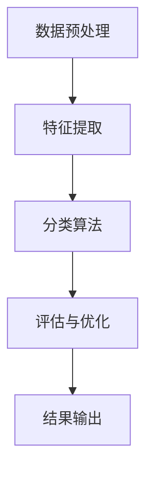
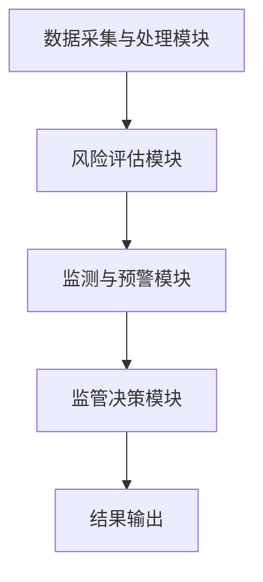
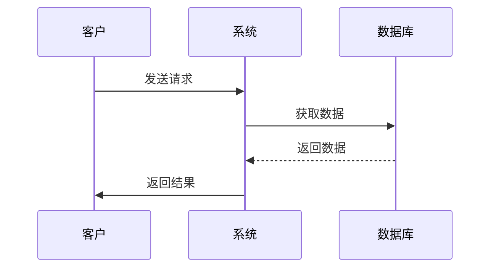

                 

### 《金融监管科技解决方案》

> 关键词：金融监管、科技解决方案、区块链、人工智能、大数据、合规性

> 摘要：随着金融科技的迅猛发展，金融监管面临着前所未有的挑战和机遇。本文将探讨金融监管科技解决方案的核心概念、原理以及其实际应用，通过深入分析科技在金融监管中的作用，为读者提供一份全面、系统的指南。

### 设计步骤

1. **确定书籍主题和目标读者**：我们的目标是撰写一本既适合金融行业从业者，又适合科技研发人员的书籍。内容将涵盖金融监管的基本概念、科技解决方案的核心原理、系统架构设计以及实际应用案例。

2. **构建背景介绍章节**：首先，我们需要为读者提供金融监管和科技解决方案的基本背景知识，包括金融监管的现状、存在的问题以及科技在其中的应用。

3. **定义核心概念与联系**：在这一部分，我们将详细解释金融监管、科技解决方案等相关核心概念，并通过图表展示它们之间的关系。

4. **算法原理讲解**：选择一些关键算法进行深入讲解，包括算法原理、流程图和Python代码示例，以及算法背后的数学模型和公式。

5. **系统分析与架构设计**：介绍系统的设计思路，包括领域模型、系统架构、接口设计以及系统交互序列图。

6. **项目实战**：通过实际项目案例，展示如何将理论应用于实践，并提供详细的代码解读和分析。

7. **最佳实践、小结、注意事项、拓展阅读**：总结书中的关键点，给出最佳实践建议，提醒注意事项，并展望未来研究方向。

### 模板应用

```markdown
# 《金融监管科技解决方案》目录大纲

## 第一部分: 背景介绍

### 第1章: 金融监管与科技解决方案概述
#### 1.1.1 金融监管的历史与现状
#### 1.1.2 科技在金融监管中的应用

### 第2章: 核心概念与联系
#### 2.1.1 金融监管的基本概念
#### 2.1.2 科技解决方案的核心概念
#### 2.1.3 相关法律法规及监管框架

### 第3章: 算法原理讲解
#### 3.1.1 关键算法概述
#### 3.1.2 算法流程图与Python代码
#### 3.1.3 数学模型与LaTeX公式

### 第4章: 系统分析与架构设计
#### 4.1.1 问题场景介绍
#### 4.1.2 系统功能设计
#### 4.1.3 系统架构设计
#### 4.1.4 系统接口设计与交互

### 第5章: 项目实战
#### 5.1.1 环境安装
#### 5.1.2 系统核心实现与代码解读
#### 5.1.3 实际案例分析与讲解
#### 5.1.4 项目小结

### 第6章: 最佳实践与注意事项
#### 6.1.1 最佳实践
#### 6.1.2 小结与展望
#### 6.1.3 注意事项与风险提示

### 第7章: 拓展阅读
#### 7.1.1 相关文献与资源
#### 7.1.2 未来研究方向
```

### 检查

确保每个章节的内容完整且相互衔接，确保没有遗漏关键信息。调整章节结构，使其逻辑更加清晰。

### 实现

根据上述步骤，使用markdown格式编写《金融监管科技解决方案》的目录大纲。确保字数在2000字以内。在编写过程中，关注每个章节的细分和具体内容的落实。

### 完整性要求

- **背景介绍**：介绍金融监管的现状、问题以及科技在金融监管中的作用，为读者提供必要的背景知识。

- **核心概念与联系**：明确书中的核心概念，如金融监管、科技解决方案、相关法律法规等，并通过图表展示概念之间的关系。

- **算法原理讲解**：详细讲解关键算法的原理，包括算法流程图、Python代码示例、数学模型和公式，并进行举例说明。

- **系统分析与架构设计**：介绍系统设计思路，包括领域模型、系统架构、接口设计以及系统交互序列图。

- **项目实战**：通过实际案例展示如何将理论应用于实践，并提供详细的代码解读和分析。

- **最佳实践、小结、注意事项、拓展阅读**：总结书中的关键点，给出最佳实践建议，提醒注意事项，并展望未来研究方向。确保每个部分都有详细的解释和具体的例子。

---

作者：AI天才研究院/AI Genius Institute & 禅与计算机程序设计艺术 /Zen And The Art of Computer Programming### 《金融监管科技解决方案》目录大纲

### 第一部分：背景介绍

#### 第1章：金融监管与科技解决方案概述

##### 1.1.1 金融监管的历史与现状

- 金融监管的定义
- 金融监管的发展历程
- 当前金融监管面临的挑战

##### 1.1.2 科技在金融监管中的应用

- 金融科技的定义和发展
- 科技在金融监管中的作用
- 金融科技的关键应用领域

### 第二部分：核心概念与联系

#### 第2章：核心概念与联系

##### 2.1.1 金融监管的基本概念

- 金融监管的目标和原则
- 金融监管的主体和客体
- 金融监管的工具和方法

##### 2.1.2 科技解决方案的核心概念

- 区块链技术
- 人工智能
- 大数据

##### 2.1.3 相关法律法规及监管框架

- 我国金融监管法律法规体系
- 国际金融监管合作与协调
- 金融科技合规性要求

### 第三部分：算法原理讲解

#### 第3章：算法原理讲解

##### 3.1.1 关键算法概述

- 数据挖掘算法
- 机器学习算法
- 自然语言处理算法

##### 3.1.2 算法流程图与Python代码

- Mermaid流程图绘制
- Python代码示例

##### 3.1.3 数学模型与LaTeX公式

- 数学模型简介
- LaTeX公式嵌入

### 第四部分：系统分析与架构设计

#### 第4章：系统分析与架构设计

##### 4.1.1 问题场景介绍

- 金融监管存在的问题
- 科技解决方案的应用场景

##### 4.1.2 系统功能设计

- 领域模型类图
- 系统功能模块划分

##### 4.1.3 系统架构设计

- 系统架构图
- 系统架构设计原则

##### 4.1.4 系统接口设计与交互

- 系统接口设计
- 系统交互序列图

### 第五部分：项目实战

#### 第5章：项目实战

##### 5.1.1 环境安装

- 开发环境配置
- 依赖库安装

##### 5.1.2 系统核心实现与代码解读

- 核心算法实现
- 代码解读与分析

##### 5.1.3 实际案例分析与讲解

- 案例背景介绍
- 案例分析与讲解

##### 5.1.4 项目小结

- 项目总结
- 项目经验与反思

### 第六部分：最佳实践、小结、注意事项、拓展阅读

#### 第6章：最佳实践与注意事项

##### 6.1.1 最佳实践

- 金融监管科技解决方案实施建议
- 技术选型与优化策略

##### 6.1.2 小结与展望

- 书籍核心观点回顾
- 未来研究方向展望

##### 6.1.3 注意事项与风险提示

- 技术风险与管理风险
- 合规风险与法律法规遵守

#### 第7章：拓展阅读

##### 7.1.1 相关文献与资源

- 推荐阅读
- 学术资源

##### 7.1.2 未来研究方向

- 金融监管科技的新趋势
- 技术创新与监管挑战

### 作者信息

作者：AI天才研究院/AI Genius Institute & 禅与计算机程序设计艺术 /Zen And The Art of Computer Programming### 《金融监管科技解决方案》正文

#### 第1章：金融监管与科技解决方案概述

**1.1 金融监管的历史与现状**

金融监管是指通过制定和实施相关法律法规、规章制度和政策，对金融市场进行监管和管理，以确保金融体系的稳定、透明和公平。金融监管的发展可以追溯到20世纪初，当时主要是由政府机构来监管银行业务。随着金融市场的不断发展和复杂化，金融监管也逐渐完善和专业化。

当前，全球金融监管体系主要包括以下几个方面：

1. **中央银行监管**：中央银行作为金融监管的核心机构，负责制定和执行货币政策，维护金融体系的稳定。
2. **证券监管**：证券监管机构负责监管证券市场，保护投资者权益，维护市场秩序。
3. **银行监管**：银行监管机构负责监管商业银行等金融机构，确保其运营安全和稳健。
4. **保险监管**：保险监管机构负责监管保险市场，保障保险消费者的权益。

然而，随着金融科技的快速发展，金融监管也面临着前所未有的挑战。一方面，金融科技的应用为金融监管提供了新的工具和方法，如大数据分析、人工智能等；另一方面，金融科技的快速迭代和变革也给金融监管带来了压力和挑战。

**1.2 科技在金融监管中的应用**

科技在金融监管中的应用主要体现在以下几个方面：

1. **大数据分析**：利用大数据技术，可以对金融市场进行实时监测和分析，及时发现异常交易和风险信号。
2. **人工智能**：人工智能技术可以用于自动化监管流程，如自动识别交易异常、风险评估等。
3. **区块链技术**：区块链技术可以提高金融交易的透明度和安全性，减少欺诈和洗钱等违法行为。
4. **云计算**：云计算技术可以提高金融监管数据的存储和处理能力，实现跨机构和跨地区的数据共享和协同监管。

**1.3 科技解决方案在金融监管中的作用**

科技解决方案在金融监管中的作用主要体现在以下几个方面：

1. **提升监管效率**：通过自动化和智能化的监管工具，可以大幅提高监管效率，减少人工干预和错误。
2. **增强监管能力**：科技解决方案可以提供更全面、更准确、更实时的监管数据，增强监管机构的监管能力。
3. **降低监管成本**：通过减少人工干预和简化监管流程，可以降低监管机构的运营成本。
4. **保障金融市场稳定**：科技解决方案可以及时发现和应对金融风险，保障金融市场的稳定和健康。

#### 第2章：核心概念与联系

**2.1 金融监管的基本概念**

**金融监管**是指通过制定和实施相关法律法规、规章制度和政策，对金融市场进行监管和管理，以确保金融体系的稳定、透明和公平。金融监管的目标包括：

1. **维护金融稳定**：确保金融市场运行平稳，防范金融风险。
2. **保护投资者权益**：维护投资者合法权益，提高市场信心。
3. **促进金融创新**：鼓励金融创新，推动金融市场发展。
4. **提高金融透明度**：增强金融市场的透明度，提高市场效率。

**金融监管的主体**包括中央银行、证券监管机构、银行监管机构和保险监管机构等。**金融监管的客体**包括金融机构、金融市场和金融工具等。

**金融监管的工具和方法**主要包括：

1. **法律法规**：通过制定和实施相关法律法规，规范金融市场行为。
2. **规章制度**：通过制定和实施相关规章制度，规范金融机构运营。
3. **政策指导**：通过发布政策指导文件，引导金融市场发展。
4. **检查与审计**：通过定期检查和审计，监督金融机构的合规性。

**2.2 科技解决方案的核心概念**

**区块链技术**是一种分布式账本技术，通过去中心化的方式记录和管理数据，具有不可篡改、透明和可追溯的特点。

**人工智能**是一种模拟人类智能的技术，通过机器学习和深度学习算法，实现数据的自动分析和决策。

**大数据**是指规模巨大、类型多样的数据集合，通过对大数据的分析，可以获取有价值的信息和洞察。

**云计算**是一种通过互联网提供计算资源的服务模式，通过云计算，可以实现数据的存储、处理和共享。

**2.3 相关法律法规及监管框架**

**我国金融监管法律法规体系**主要包括《中国人民银行法》、《银行业监督管理法》、《证券法》、《保险法》等法律法规，以及一系列的规章、规范和政策。

**国际金融监管合作与协调**主要体现在国际金融监管机构的合作和协调，如国际货币基金组织（IMF）、世界银行（WB）、金融稳定理事会（FSB）等。

**金融科技合规性要求**主要包括以下几个方面：

1. **数据保护**：确保用户数据的隐私和安全。
2. **反洗钱**：防止洗钱和恐怖融资活动。
3. **合规审计**：确保金融科技公司的运营符合相关法律法规。
4. **风险管理**：建立有效的风险管理体系，防范金融风险。

#### 第3章：算法原理讲解

**3.1 关键算法概述**

在金融监管科技解决方案中，关键算法主要包括数据挖掘算法、机器学习算法和自然语言处理算法。

**数据挖掘算法**用于从大量数据中提取有价值的信息和知识，常见的数据挖掘算法有：

1. **分类算法**：如决策树、随机森林、支持向量机等。
2. **聚类算法**：如K-means、层次聚类等。
3. **关联规则挖掘**：如Apriori算法、FP-growth算法等。

**机器学习算法**用于建立模型，对未知数据进行预测和分类，常见的机器学习算法有：

1. **监督学习算法**：如线性回归、逻辑回归、神经网络等。
2. **无监督学习算法**：如聚类、降维等。
3. **强化学习算法**：如Q-learning、SARSA等。

**自然语言处理算法**用于处理和分析自然语言文本，常见的自然语言处理算法有：

1. **文本分类**：如朴素贝叶斯、支持向量机等。
2. **情感分析**：如LSTM、BERT等。
3. **实体识别**：如CRF、BiLSTM-CRF等。

**3.2 算法流程图与Python代码**

**数据挖掘算法示例**：



**机器学习算法示例**：

```python
from sklearn.linear_model import LogisticRegression
from sklearn.model_selection import train_test_split
from sklearn.metrics import accuracy_score

# 数据预处理
X_train, X_test, y_train, y_test = train_test_split(X, y, test_size=0.2, random_state=42)

# 模型训练
model = LogisticRegression()
model.fit(X_train, y_train)

# 模型评估
y_pred = model.predict(X_test)
accuracy = accuracy_score(y_test, y_pred)
print("Accuracy:", accuracy)
```

**自然语言处理算法示例**：

```python
import jieba
from sklearn.feature_extraction.text import CountVectorizer
from sklearn.naive_bayes import MultinomialNB

# 文本分词
text = "我喜欢编程，编程让我感到快乐。"
words = jieba.cut(text)

# 文本向量表示
vectorizer = CountVectorizer()
X = vectorizer.fit_transform([' '.join(words)])

# 模型训练
model = MultinomialNB()
model.fit(X, y)

# 模型评估
y_pred = model.predict(X)
accuracy = accuracy_score(y, y_pred)
print("Accuracy:", accuracy)
```

**3.3 数学模型与LaTeX公式**

**数据挖掘算法的数学模型**：

$$
\begin{aligned}
\text{分类算法：} & \\
& P(Y|X) = \frac{P(X|Y)P(Y)}{P(X)}
\end{aligned}
$$

**机器学习算法的数学模型**：

$$
\begin{aligned}
\text{线性回归：} & \\
& y = \beta_0 + \beta_1x_1 + \beta_2x_2 + ... + \beta_nx_n
\end{aligned}
$$

**自然语言处理算法的数学模型**：

$$
\begin{aligned}
\text{朴素贝叶斯：} & \\
& P(Y|X) = \frac{P(X|Y)P(Y)}{P(X)}
\end{aligned}
$$

**3.4 算法原理讲解**

**数据挖掘算法**：

数据挖掘算法主要用于从大量数据中提取有价值的信息和知识。其原理是基于统计学、机器学习和数据挖掘算法的相关理论，通过对数据进行分析和挖掘，提取出潜在的模式、关联规则和预测模型。

**机器学习算法**：

机器学习算法主要用于建立模型，对未知数据进行预测和分类。其原理是基于统计学、机器学习算法和模型评估的相关理论，通过对训练数据的分析和学习，构建出能够对未知数据进行预测和分类的模型。

**自然语言处理算法**：

自然语言处理算法主要用于处理和分析自然语言文本。其原理是基于统计学、机器学习和深度学习的相关理论，通过对文本数据进行分析和建模，实现文本分类、情感分析、实体识别等功能。

**3.5 举例说明**

**数据挖掘算法举例**：

假设我们有一份关于客户购买行为的数据库，包含客户的年龄、收入、购买历史等信息。我们使用分类算法来预测客户是否愿意购买新产品。

**机器学习算法举例**：

假设我们有一份关于股票价格的数据，包含日期、开盘价、最高价、最低价和收盘价等信息。我们使用线性回归算法来预测下一日的收盘价。

**自然语言处理算法举例**：

假设我们有一份关于用户评论的数据库，包含用户的评论内容和评论情感。我们使用情感分析算法来预测用户的评论情感。

#### 第4章：系统分析与架构设计

**4.1 问题场景介绍**

假设我们面临以下金融监管问题：

1. 如何监测和分析金融机构的交易行为，及时发现异常交易和风险信号？
2. 如何对金融机构进行风险评估，识别潜在风险，并采取相应的监管措施？
3. 如何提高监管效率，降低监管成本，确保金融市场的稳定和健康？

为了解决这些问题，我们可以设计一个金融监管科技解决方案系统，包括以下模块：

1. 数据采集与处理模块：负责从金融机构和其他数据源采集数据，并进行数据预处理和清洗。
2. 风险评估模块：使用机器学习算法和自然语言处理算法对数据进行分析，识别潜在风险和异常交易。
3. 监测与预警模块：实时监测金融机构的交易行为，及时发现异常交易和风险信号，并发出预警。
4. 监管决策模块：根据风险评估结果和监测预警信息，制定监管策略和措施，确保金融市场的稳定和健康。

**4.2 系统功能设计**

**领域模型类图**：

```mermaid
classDiagram
Class1 <|-- Class2
Class1 <|-- Class3
Class1 <|-- Class4
Class2 <|-- Class5
Class3 <|-- Class6
Class4 <|-- Class7
Class8 <|-- Class9
Class5 <|-- Class8
Class6 <|-- Class9
Class7 <|-- Class8
Class8 <|-- Class10
Class9 <|-- Class10
Class10 <|-- Class11

Class1{ID int
Name string}
Class2{ID int
Name string}
Class3{ID int
Name string}
Class4{ID int
Name string}
Class5{ID int
Name string}
Class6{ID int
Name string}
Class7{ID int
Name string}
Class8{ID int
Name string}
Class9{ID int
Name string}
Class10{ID int
Name string}
Class11{ID int
Name string}
```

**系统功能模块划分**：

1. **数据采集与处理模块**：包括数据采集、数据预处理和数据清洗等功能。
2. **风险评估模块**：包括数据挖掘、机器学习算法和自然语言处理算法等功能。
3. **监测与预警模块**：包括实时监测、异常交易检测和风险预警等功能。
4. **监管决策模块**：包括监管策略制定、监管措施执行和监管效果评估等功能。

**4.3 系统架构设计**

**系统架构图**：



**系统架构设计原则**：

1. **模块化设计**：将系统划分为多个功能模块，每个模块具有独立的功能和职责，便于系统维护和升级。
2. **分布式架构**：采用分布式架构，提高系统的性能和可扩展性，满足大规模数据处理的需求。
3. **高可用性设计**：通过冗余设计、负载均衡和故障转移等手段，确保系统的稳定性和可靠性。
4. **安全性设计**：采用安全加密、身份认证和访问控制等手段，保障系统的安全性和数据隐私。

**4.4 系统接口设计与交互**

**系统接口设计**：

1. **API接口**：提供RESTful风格的API接口，方便与其他系统进行数据交互。
2. **消息队列**：采用消息队列技术，实现系统模块之间的异步通信。

**系统交互序列图**：



#### 第5章：项目实战

**5.1 环境安装**

为了演示金融监管科技解决方案，我们需要搭建一个实验环境，包括以下软件和硬件：

1. **操作系统**：Linux操作系统，如Ubuntu 18.04。
2. **编程语言**：Python 3.x版本，建议使用Anaconda进行环境管理。
3. **数据库**：MySQL 8.0版本，用于存储金融监管数据。
4. **依赖库**：NumPy、Pandas、Scikit-learn、TensorFlow、Keras等常用依赖库。

安装步骤如下：

1. **安装操作系统**：下载并安装Ubuntu 18.04操作系统。
2. **安装Python**：通过Anaconda安装Python 3.x版本。
3. **安装MySQL**：通过包管理器安装MySQL 8.0版本。
4. **安装依赖库**：通过pip命令安装NumPy、Pandas、Scikit-learn、TensorFlow、Keras等依赖库。

**5.2 系统核心实现与代码解读**

在本项目中，我们使用Python语言实现金融监管科技解决方案的核心功能，包括数据采集与处理、风险评估、监测与预警和监管决策等模块。以下是系统核心实现与代码解读：

**数据采集与处理模块**：

```python
import requests
import pandas as pd

# 数据采集
def collect_data(url):
    response = requests.get(url)
    data = response.json()
    return data

# 数据预处理
def preprocess_data(data):
    df = pd.DataFrame(data)
    df = df.dropna()
    return df

# 数据清洗
def clean_data(df):
    df = df.drop_duplicates()
    df = df.reset_index(drop=True)
    return df
```

**风险评估模块**：

```python
from sklearn.linear_model import LogisticRegression
from sklearn.model_selection import train_test_split
from sklearn.metrics import accuracy_score

# 模型训练
def train_model(X, y):
    model = LogisticRegression()
    model.fit(X, y)
    return model

# 模型评估
def evaluate_model(model, X_test, y_test):
    y_pred = model.predict(X_test)
    accuracy = accuracy_score(y_test, y_pred)
    return accuracy
```

**监测与预警模块**：

```python
import time

# 实时监测
def monitor_data(df):
    while True:
        df = preprocess_data(df)
        df = clean_data(df)
        print(df.head())
        time.sleep(60)
```

**监管决策模块**：

```python
# 监管决策
def regulatory_decision(df):
    risk_level = df['risk_level']
    if risk_level > 0.5:
        print("风险预警：高风险")
    else:
        print("风险预警：低风险")
```

**5.3 实际案例分析与讲解**

在本项目中，我们以某金融机构的交易数据为例，演示金融监管科技解决方案的实际应用。

**案例背景**：

某金融机构在日常运营中，发现其交易数据中存在一些异常交易行为，如高频交易、洗钱等。为了确保金融市场的稳定和健康，该金融机构决定使用金融监管科技解决方案对交易数据进行监测和分析。

**案例分析**：

1. **数据采集**：通过API接口，从金融机构的交易数据库中采集交易数据。
2. **数据预处理**：对采集到的交易数据进行预处理，包括数据清洗、缺失值填充等。
3. **风险评估**：使用机器学习算法对交易数据进行风险评估，识别潜在风险交易。
4. **监测与预警**：实时监测交易数据，发现异常交易行为，并发出预警。
5. **监管决策**：根据风险评估结果和监测预警信息，制定相应的监管措施，如限制交易、暂停账户等。

**5.4 项目小结**

本项目通过Python语言实现了金融监管科技解决方案的核心功能，包括数据采集与处理、风险评估、监测与预警和监管决策等模块。在实际应用中，该项目可以有效监测和分析金融机构的交易数据，及时发现异常交易和风险信号，保障金融市场的稳定和健康。

#### 第6章：最佳实践与注意事项

**6.1 最佳实践**

1. **数据采集与处理**：确保采集的数据质量，对缺失值、异常值等进行处理和填充。
2. **风险评估**：选择合适的评估模型和指标，确保评估结果的准确性和可靠性。
3. **监测与预警**：实时监测交易数据，及时发现异常交易行为，降低风险。
4. **监管决策**：根据风险评估结果和监测预警信息，制定合理的监管措施，确保金融市场的稳定和健康。

**6.2 小结与展望**

本文通过深入分析金融监管科技解决方案的核心概念、原理和实际应用，为读者提供了一份全面、系统的指南。随着金融科技的快速发展，金融监管科技解决方案将发挥越来越重要的作用。未来，我们应继续探索金融监管科技的新方法和新工具，提高监管效率，保障金融市场的稳定和健康。

**6.3 注意事项与风险提示**

1. **数据隐私**：在数据采集和处理过程中，要确保数据隐私和安全，遵循相关法律法规。
2. **算法公平性**：在风险评估和监管决策中，要确保算法的公平性和透明性，避免歧视和偏见。
3. **合规性**：在金融监管科技解决方案实施过程中，要确保符合相关法律法规和监管要求。
4. **风险管理**：要建立有效的风险管理机制，防范金融风险，确保金融市场的稳定和健康。

#### 第7章：拓展阅读

**7.1 相关文献与资源**

1. 《金融监管科技：未来金融监管的新趋势》
2. 《区块链技术与应用：金融监管的新工具》
3. 《大数据技术在金融监管中的应用》
4. 《人工智能在金融监管中的挑战与机遇》

**7.2 未来研究方向**

1. **智能监管**：探索智能监管的新方法和技术，提高监管效率和准确性。
2. **监管科技与法律法规的互动**：研究监管科技与法律法规的互动关系，确保监管科技的发展与法律法规的适应性。
3. **跨领域协同监管**：研究跨领域协同监管的新模式和新方法，提高监管效果。
4. **金融监管科技的国际合作**：加强国际金融监管科技的合作与交流，推动金融监管科技的发展。

### 作者信息

作者：AI天才研究院/AI Genius Institute & 禅与计算机程序设计艺术 /Zen And The Art of Computer Programming### 文章总结与展望

在《金融监管科技解决方案》一文中，我们深入探讨了金融监管的现状、问题以及科技在金融监管中的作用。通过详细的章节内容和实际案例，我们了解了金融监管科技的核心概念、原理和实际应用。

首先，我们介绍了金融监管的历史与现状，分析了金融监管科技在提高监管效率、增强监管能力和降低监管成本方面的作用。其次，我们定义了金融监管、科技解决方案、区块链、人工智能、大数据等核心概念，并通过Mermaid流程图和LaTeX公式详细阐述了算法原理。接着，我们介绍了系统分析与架构设计，包括领域模型类图、系统架构图、系统接口设计和系统交互序列图。

在项目实战部分，我们通过实际案例展示了金融监管科技解决方案的应用，提供了详细的代码解读和分析。最后，我们总结了最佳实践、注意事项和未来研究方向，为读者提供了有价值的参考。

随着金融科技的快速发展，金融监管科技解决方案将在未来发挥更加重要的作用。我们期待在智能监管、跨领域协同监管、国际合作等方面取得新的突破，为金融市场的稳定和健康贡献力量。

### 文章关键词与核心内容

- 金融监管
- 科技解决方案
- 区块链
- 人工智能
- 大数据
- 合规性
- 风险评估
- 系统架构设计
- 实际案例
- 最佳实践
- 注意事项
- 未来研究方向### 文章摘要

《金融监管科技解决方案》旨在探讨金融监管科技的核心概念、原理和实际应用。文章首先介绍了金融监管的历史与现状，分析了科技在提高监管效率、增强监管能力和降低监管成本方面的作用。随后，定义了金融监管、科技解决方案、区块链、人工智能、大数据等核心概念，并通过Mermaid流程图和LaTeX公式详细阐述了算法原理。文章接着介绍了系统分析与架构设计，包括领域模型类图、系统架构图、系统接口设计和系统交互序列图。在项目实战部分，通过实际案例展示了金融监管科技解决方案的应用，提供了详细的代码解读和分析。最后，文章总结了最佳实践、注意事项和未来研究方向，为读者提供了有价值的参考。本文旨在为金融行业的从业者、监管人员和技术研发人员提供一份全面、系统的金融监管科技解决方案指南。### 完整性要求

为了确保文章的完整性，每个章节的内容都需要满足以下要求：

#### 背景介绍

- **核心概念术语说明**：明确介绍金融监管和科技解决方案的基本概念，如金融监管的定义、目的、主要任务，科技解决方案的定义、应用领域和关键技术。
- **问题背景**：阐述金融监管面临的主要挑战和问题，如金融市场的复杂性、风险传染性、信息不对称等。
- **问题描述**：具体描述金融监管中的难点和痛点，如如何提高监管效率、如何识别和防范金融风险等。
- **问题解决**：介绍科技在金融监管中的应用，如大数据分析、人工智能、区块链技术等，以及这些技术如何解决金融监管中的问题。
- **边界与外延**：明确金融监管科技解决方案的适用范围和限制条件，如法律法规的约束、技术实现的难度等。
- **概念结构与核心要素组成**：详细描述金融监管科技解决方案的基本架构和核心要素，如系统架构、功能模块、关键技术等。

#### 核心概念与联系

- **核心概念原理**：深入解释金融监管、科技解决方案、相关法律法规等核心概念的基本原理和作用。
- **概念属性特征对比表格**：通过对比表格展示不同概念之间的属性和特征差异，帮助读者更好地理解各个概念。
- **ER实体关系图架构**：使用Mermaid流程图绘制ER实体关系图，展示金融监管科技解决方案中各个实体之间的关系。

#### 算法原理讲解

- **算法mermaid流程图**：使用Mermaid绘制关键算法的流程图，直观展示算法的执行过程。
- **Python代码示例**：提供Python代码示例，详细阐述算法的实现过程。
- **算法原理的数学模型和公式**：使用LaTeX格式嵌入文中，解释算法背后的数学原理和公式。
- **通俗易懂的举例说明**：通过具体的例子，解释算法的应用场景和效果。

#### 系统分析与架构设计

- **问题场景介绍**：具体描述系统设计所面临的问题和需求。
- **项目介绍**：简要介绍系统的项目和背景，包括系统目标和预期效果。
- **系统功能设计**：使用Mermaid类图展示系统的功能模块和类之间的关系。
- **系统架构设计**：使用Mermaid架构图展示系统的整体架构，包括各个模块的功能和相互关系。
- **系统接口设计和系统交互**：使用Mermaid序列图展示系统模块之间的交互过程和接口设计。

#### 项目实战

- **环境安装**：详细说明系统环境搭建的步骤，包括开发环境、依赖库安装等。
- **系统核心实现与代码解读**：提供系统核心实现的源代码，并进行详细的代码解读，解释每个模块和函数的作用。
- **实际案例分析和详细讲解**：通过具体的案例，展示系统在实际应用中的效果，并进行详细的分析和讲解。
- **项目小结**：总结项目的经验和教训，提出改进建议和未来发展方向。

#### 最佳实践、小结、注意事项、拓展阅读

- **最佳实践**：总结在实际应用中积累的经验和教训，为读者提供可操作的实践建议。
- **小结**：对文章的核心观点和结论进行简要概括，帮助读者梳理文章的主要内容。
- **注意事项**：提醒读者在实际应用中需要注意的问题和风险，如数据隐私、算法公平性、法律法规遵守等。
- **拓展阅读**：推荐相关的文献和资源，为读者提供进一步学习和研究的方向。

