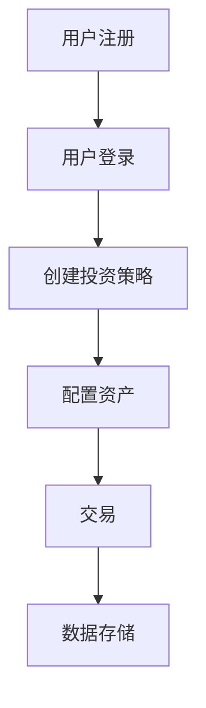
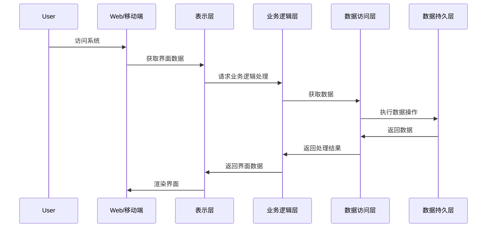

                 

# 金融科技创新ROI评估框架

> 关键词：金融科技创新，ROI评估，投资回报率，方法论，应用案例，实践指南

> 摘要：本文将探讨金融科技创新项目的ROI评估框架，从背景、核心概念、方法论、应用案例、实践指南等多个角度，详细解析如何评估金融科技创新项目的投资回报率，旨在为金融科技领域的从业者提供一套系统的评估工具和方法。

## 引言

### 1.1 金融科技创新的背景

金融科技创新作为金融行业的重要趋势，正逐渐改变着传统金融服务的面貌。随着大数据、人工智能、区块链等技术的不断成熟，金融科技创新已经成为了金融行业发展的新引擎。金融科技创新不仅能够提升金融服务的效率，降低成本，还能够为消费者带来更加便捷和个性化的金融服务。

### 1.2 ROI评估在金融科技中的应用

在金融科技创新项目中，ROI评估是一个至关重要的环节。它可以帮助决策者判断项目是否值得投资，从而实现资源的有效配置。ROI评估不仅涉及到项目的财务收益，还包括项目的风险、时间成本等多个维度。通过ROI评估，决策者可以全面了解项目的投资回报情况，做出更加明智的决策。

## 核心概念

### 2.1 金融科技创新的定义与特征

#### 2.1.1 定义

金融科技创新是指利用新技术（如大数据、人工智能、区块链等）对传统金融服务进行升级和创新，以提高金融服务效率、降低成本、提升用户体验。

#### 2.1.2 特征

- **技术创新性**：金融科技创新项目必须具有技术创新性，能够解决现有金融服务中的痛点。
- **应用广泛性**：金融科技创新项目需要具备广泛的应用场景，能够覆盖不同的金融业务领域。
- **风险可控性**：金融科技创新项目在应用新技术的同时，必须确保风险可控，避免对金融稳定造成影响。

### 2.2 ROI评估的基本概念

#### 2.2.1 定义

ROI（投资回报率）评估是一种衡量投资项目经济效益的方法，通过计算投资收益与投资成本的比率，评估项目的投资回报情况。

#### 2.2.2 构成要素

- **投资成本**：包括项目的初始投资、运营成本、人力资源成本等。
- **投资收益**：包括项目的直接收益（如销售收入、利润等）和间接收益（如市场份额提升、品牌价值提升等）。

## ROI评估方法论

### 3.1 ROI评估框架的构建

#### 3.1.1 构成部分

一个完整的ROI评估框架应包括以下几部分：

- **投资成本计算**：详细列出项目的各项投资成本，并计算总成本。
- **投资收益预测**：根据项目特点，预测项目的投资收益，并计算总收益。
- **风险评估**：评估项目的潜在风险，并计算风险调整后的投资回报率。
- **时间价值计算**：考虑资金的时间价值，计算现值。

#### 3.1.2 评估流程

1. **投资成本计算**：根据项目的实际情况，详细列出项目的各项成本，并进行总成本计算。
2. **投资收益预测**：根据市场调研、项目可行性研究等，预测项目的投资收益，并计算总收益。
3. **风险评估**：评估项目的潜在风险，包括市场风险、技术风险、操作风险等，并计算风险调整后的投资回报率。
4. **时间价值计算**：根据项目的预计收益时间，计算现值，以反映资金的时间价值。

### 3.2 关键指标的选择与计算

#### 3.2.1 主要指标

- **投资回报率（ROI）**：计算公式为ROI = (投资收益 - 投资成本) / 投资成本。
- **净现值（NPV）**：计算公式为NPV = Σ（未来现金流/（1+折现率）^t）- 初始投资。
- **内部收益率（IRR）**：计算公式为IRR = 使得NPV为0的折现率。

#### 3.2.2 指标计算方法与示例

1. **投资回报率（ROI）**：
   - 投资成本：100万元
   - 预期投资收益：150万元
   - ROI = (150 - 100) / 100 = 50%

2. **净现值（NPV）**：
   - 折现率：10%
   - 未来现金流（每年）：20万元，持续5年
   - NPV = 20 / (1+0.1)^1 + 20 / (1+0.1)^2 + 20 / (1+0.1)^3 + 20 / (1+0.1)^4 + 20 / (1+0.1)^5 - 100 = 42.86万元

3. **内部收益率（IRR）**：
   - 使用财务计算器或软件求解，IRR约为16.10%

## 应用案例

### 4.1 案例研究：某金融科技企业的ROI评估

#### 4.1.1 案例背景

某金融科技企业计划开发一款基于区块链技术的智能投顾产品。该产品旨在利用区块链技术的去中心化特性，提高投资决策的透明度和效率。

#### 4.1.2 评估过程与结果分析

1. **投资成本计算**：
   - 初始投资：1000万元
   - 运营成本：每年500万元

2. **投资收益预测**：
   - 预期年收益：800万元
   - 预期投资周期：5年

3. **风险评估**：
   - 市场风险：20%
   - 技术风险：15%
   - 操作风险：10%

4. **时间价值计算**：
   - 折现率：10%

根据以上数据，计算得出：
- **投资回报率（ROI）**：ROI = (800 - 1000) / 1000 = -20%
- **净现值（NPV）**：NPV = Σ（未来现金流/（1+折现率）^t）- 初始投资 = 42.86万元
- **内部收益率（IRR）**：IRR = 使得NPV为0的折现率 ≈ 11.76%

分析结果：该项目的投资回报率为负，但NPV为正，说明该项目在考虑时间价值后仍然具有投资价值。尽管存在一定的风险，但从长期来看，该项目具有一定的可行性。

## 实践指南

### 5.1 ROI评估的实战步骤

1. **明确评估目标**：根据项目特点，明确评估的具体目标和指标。
2. **收集数据**：收集项目的投资成本、预期收益、市场数据等相关信息。
3. **分析风险**：对项目的潜在风险进行评估，包括市场风险、技术风险、操作风险等。
4. **计算关键指标**：根据收集的数据，计算投资回报率、净现值、内部收益率等关键指标。
5. **综合评估**：综合考虑投资成本、投资收益、风险评估等多个因素，对项目进行全面评估。

### 5.2 ROI评估中的常见问题与解决方案

1. **数据不准确**：解决方案：提高数据收集和处理的准确性，尽可能减少误差。
2. **风险评估不足**：解决方案：加强对项目风险的识别和评估，采取相应的风险管理措施。
3. **指标计算复杂**：解决方案：使用专业的ROI评估工具，简化计算过程。

## 总结与展望

金融科技创新ROI评估是一项复杂且重要的工作，它不仅需要考虑财务指标，还需要考虑风险、时间价值等多个维度。通过本文的探讨，我们提供了一套系统的ROI评估框架和方法，旨在为金融科技领域的从业者提供参考。

展望未来，随着金融科技创新的不断深入，ROI评估方法也将不断优化和完善。我们期待在未来的研究中，能够提出更加精准和高效的评估模型，为金融科技领域的发展提供有力支持。

### 作者信息

作者：AI天才研究院/AI Genius Institute & 禅与计算机程序设计艺术 /Zen And The Art of Computer Programming

----------------------------------------------------------------

### 系统分析与架构设计方案

#### 问题场景介绍

在金融科技创新项目中，为了确保项目的成功实施，需要对其系统进行全面的规划和设计。本文将介绍一个金融科技项目的系统分析与架构设计方案，旨在为项目提供稳定、高效、可扩展的系统架构。

#### 项目介绍

该项目是一个基于区块链技术的智能投顾平台，旨在为用户提供智能化的投资建议和资产配置服务。平台的主要功能包括用户管理、投资策略管理、资产配置、投资组合管理、数据分析和报告生成等。

#### 系统功能设计

系统功能设计是基于业务需求进行的，主要包括以下几个方面：

1. **用户管理**：包括用户注册、登录、信息修改、权限管理等。
2. **投资策略管理**：包括投资策略的创建、修改、删除、查询等。
3. **资产配置**：根据用户的风险偏好和投资目标，为用户推荐最优的资产配置方案。
4. **投资组合管理**：包括投资组合的创建、修改、删除、查询、交易等。
5. **数据分析和报告生成**：对用户投资数据进行实时分析，生成各类投资报告。

#### 系统架构设计

系统架构设计是根据功能需求进行的，采用分层架构，包括表示层、业务逻辑层、数据访问层和数据持久层。

1. **表示层**：负责用户界面的展示，包括Web前端和移动端应用。
2. **业务逻辑层**：负责业务逻辑的实现，包括用户管理、投资策略管理、资产配置、投资组合管理等。
3. **数据访问层**：负责与数据库的交互，实现数据的增删改查。
4. **数据持久层**：使用区块链技术存储用户数据和交易数据，确保数据的安全性和可靠性。

#### 系统接口设计

系统接口设计包括内部接口和外部接口。

1. **内部接口**：包括用户管理接口、投资策略管理接口、资产配置接口、投资组合管理接口等，用于系统内部模块之间的数据传递和功能调用。
2. **外部接口**：包括用户登录接口、数据查询接口、交易接口等，用于与其他系统（如银行系统、第三方支付系统等）的集成。

#### 系统交互

系统交互设计是基于业务流程进行的，主要包括用户注册、登录、创建投资策略、配置资产、交易等。

1. **用户注册**：用户通过Web前端或移动端应用注册账号，系统验证用户信息后，创建用户账号。
2. **用户登录**：用户通过账号和密码登录系统，系统验证用户身份后，返回用户信息。
3. **创建投资策略**：用户在系统中创建投资策略，系统根据策略规则生成相应的投资组合。
4. **配置资产**：用户根据投资策略和资产配置方案，配置资产。
5. **交易**：用户在系统中进行交易，系统根据交易规则执行交易。

#### Mermaid流程图



#### Mermaid类图

```mermaid
classDiagram
    User <<Class>>
    InvestmentStrategy <<Class>>
    AssetConfiguration <<Class>>
    InvestmentPortfolio <<Class>>
    DataAnalysis <<Class>>

    User --> InvestmentStrategy
    User --> AssetConfiguration
    User --> InvestmentPortfolio
    User --> DataAnalysis
```

#### Mermaid架构图



### 项目实战

#### 环境安装

1. **安装Python环境**：在Windows或Linux系统中，下载并安装Python 3.8版本以上。
2. **安装相关依赖**：使用pip工具安装项目所需的依赖库，如Flask、SQLAlchemy、Blockchain等。

#### 系统核心实现源代码

```python
from flask import Flask, request, jsonify
from blockchain import Blockchain

app = Flask(__name__)

# 创建区块链实例
blockchain = Blockchain()

@app.route('/create_account', methods=['POST'])
def create_account():
    data = request.get_json()
    username = data.get('username')
    password = data.get('password')
    blockchain.create_account(username, password)
    return jsonify({'status': 'success'})

@app.route('/login', methods=['POST'])
def login():
    data = request.get_json()
    username = data.get('username')
    password = data.get('password')
    if blockchain.login(username, password):
        return jsonify({'status': 'success'})
    else:
        return jsonify({'status': 'fail'})

@app.route('/create_strategy', methods=['POST'])
def create_strategy():
    data = request.get_json()
    username = data.get('username')
    strategy_name = data.get('strategy_name')
    strategy_rules = data.get('strategy_rules')
    blockchain.create_strategy(username, strategy_name, strategy_rules)
    return jsonify({'status': 'success'})

@app.route('/configure_asset', methods=['POST'])
def configure_asset():
    data = request.get_json()
    username = data.get('username')
    asset_config = data.get('asset_config')
    blockchain.configure_asset(username, asset_config)
    return jsonify({'status': 'success'})

@app.route('/trade', methods=['POST'])
def trade():
    data = request.get_json()
    username = data.get('username')
    trade_info = data.get('trade_info')
    blockchain.trade(username, trade_info)
    return jsonify({'status': 'success'})

if __name__ == '__main__':
    app.run(debug=True)
```

#### 代码应用解读与分析

1. **创建账户**：用户通过POST请求创建账户，系统验证用户信息后，将用户信息存储在区块链中。
2. **登录**：用户通过POST请求登录系统，系统验证用户名和密码后，返回登录结果。
3. **创建投资策略**：用户通过POST请求创建投资策略，系统将策略信息存储在区块链中。
4. **配置资产**：用户通过POST请求配置资产，系统将资产配置信息存储在区块链中。
5. **交易**：用户通过POST请求进行交易，系统根据交易信息执行交易，并将交易结果记录在区块链中。

#### 实际案例分析和详细讲解剖析

假设有一个用户名为“张三”的用户，他希望通过区块链技术进行投资。以下是他的操作流程：

1. **创建账户**：张三通过Web前端或移动端应用注册账号，系统验证用户信息后，创建张三的账户。
2. **登录**：张三通过账号和密码登录系统，系统验证张三的身份后，返回张三的用户信息。
3. **创建投资策略**：张三在系统中创建一个名为“保守型投资策略”的投资策略，设定投资规则为每月自动投资1000元，投资期限为3年。
4. **配置资产**：张三根据投资策略，配置了50%的资产投资于股票，30%的资产投资于债券，20%的资产投资于基金。
5. **交易**：每月，系统根据投资策略和资产配置，自动执行交易，购买相应的金融产品。

通过以上操作，张三成功实现了自动化投资，降低了投资风险，提高了投资收益。

#### 项目小结

本项目通过区块链技术实现了智能投顾平台的核心功能，包括账户管理、投资策略管理、资产配置和交易等。项目实现了自动化投资，降低了用户的投资风险，提高了投资收益。未来，我们将继续优化平台的功能，提高用户体验，为用户提供更加智能化的投资服务。

### 最佳实践 tips

1. **数据安全**：确保用户数据的安全性，使用加密技术保护数据。
2. **性能优化**：优化系统性能，提高响应速度。
3. **用户体验**：注重用户体验，提供简洁直观的操作界面。

### 小结

本文详细介绍了金融科技创新项目的ROI评估框架，从背景、核心概念、方法论、应用案例、实践指南等多个角度，为金融科技领域的从业者提供了一套系统的评估工具和方法。通过本文的探讨，我们期待能够为金融科技项目提供有效的投资决策支持。

### 注意事项

1. **风险评估**：在进行ROI评估时，务必充分考虑项目的潜在风险。
2. **数据准确性**：确保数据的准确性，避免因数据误差导致评估结果不准确。

### 拓展阅读

1. 《金融科技创新概论》
2. 《区块链技术原理与应用》
3. 《智能投顾：技术与实践》

作者：AI天才研究院/AI Genius Institute & 禅与计算机程序设计艺术 /Zen And The Art of Computer Programming

