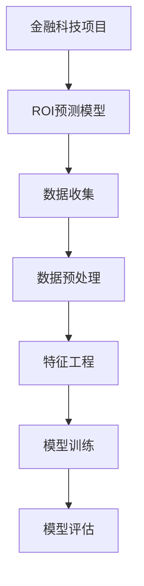
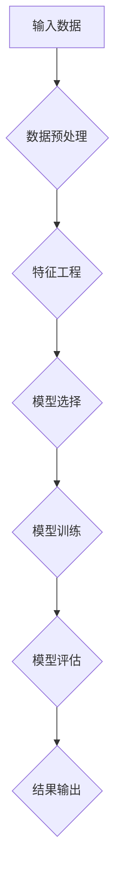

                 

# 《金融科技创新项目ROI预测模型》

关键词：金融科技、ROI预测、数据分析、机器学习、模型构建

摘要：本文将深入探讨金融科技创新项目ROI预测模型的设计与实现。通过系统性地分析金融科技的发展背景、ROI预测的核心概念及其模型构建，本文将详细介绍数学模型的推导、数据收集与处理方法，以及模型训练与评估的技术细节。同时，本文将通过实际项目案例，展示如何将ROI预测模型应用于金融科技创新项目，并总结最佳实践与未来展望。

## 引言与背景

### 1.1 问题背景

金融科技（FinTech）的快速发展正深刻改变着金融行业的格局。从移动支付、区块链技术到智能投顾，金融科技的创新层出不穷。然而，如何在金融科技项目中有效地预测投资回报率（ROI）成为许多企业面临的挑战。ROI预测不仅可以帮助企业评估投资项目的价值，还能为其战略决策提供有力支持。

### 1.1.1 金融科技创新的发展

金融科技的发展可以追溯到20世纪90年代，但随着互联网技术的普及和大数据、人工智能等新兴技术的应用，金融科技迎来了新的发展阶段。现今，金融科技已成为推动金融行业变革的重要力量。

### 1.1.2 ROI预测的重要性

ROI预测在金融科技项目中具有至关重要的意义。它不仅能够帮助企业评估项目的可行性，还能为其提供投资决策的依据。准确预测ROI可以帮助企业优化资源配置，降低投资风险，提高盈利能力。

### 1.1.3 研究目的与意义

本文旨在通过构建ROI预测模型，为金融科技项目提供一种有效的数据分析工具。通过深入研究金融科技与ROI预测的内在联系，本文期望为相关领域的研究和实践提供有价值的参考。

## 核心概念与联系

### 2.1 定义

#### 2.1.1 金融科技

金融科技是指利用新兴技术（如人工智能、大数据、区块链等）创新金融产品、服务或运营模式的金融行业创新。

#### 2.1.2 ROI预测

ROI预测是指利用数据分析方法，预测金融科技项目投资回报率的过程。

### 2.2 属性特征对比

#### 2.2.1 金融科技属性特征

- 创新性
- 可持续性
- 技术复杂性
- 法律合规性

#### 2.2.2 ROI预测属性特征

- 准确性
- 可靠性
- 实时性
- 灵活性

### 2.3 ER实体关系图

## ROI预测模型原理

### 3.1 基本原理

ROI预测模型的基本原理是通过历史数据分析和机器学习算法，预测金融科技项目的未来投资回报率。

#### 3.1.1 模型类型

常见的ROI预测模型包括线性回归、决策树和集成学习等。

#### 3.1.2 工作流程

1. 数据收集与预处理
2. 特征工程
3. 模型选择与训练
4. 模型评估与优化

#### 3.1.3 模型目标

模型的最终目标是实现高准确性、高可靠性、实时性和灵活性，以满足金融科技项目决策的需求。

### 3.2 算法mermaid流程图

### 3.3 数学模型和公式

#### 3.3.1 回归模型

$$
y = \beta_0 + \beta_1x_1 + \beta_2x_2 + ... + \beta_nx_n
$$

#### 3.3.2 决策树模型

$$
f(x) = \sum_{i=1}^{n}w_i \cdot g(x)
$$

## 数据收集与处理

### 4.1 数据来源

金融科技项目的ROI预测需要收集多方面的数据，包括历史财务数据、市场数据、技术数据等。

### 4.2 数据预处理

数据预处理包括缺失值处理、异常值处理和数据规范化，以确保数据质量。

### 4.3 特征工程

特征工程包括特征提取和特征选择，以提高模型的预测准确性。

## 模型训练与评估

### 5.1 模型选择

根据金融科技项目的特点，选择合适的机器学习模型，如线性回归、决策树和集成学习等。

### 5.2 模型评估指标

常用的模型评估指标包括均方误差、决策树精度和集成学习准确率。

### 5.3 调参技巧

通过交叉验证和超参数调整，优化模型性能。

## 项目实战与案例分析

### 6.1 环境安装

安装Python环境及相关库，配置数据库。

### 6.2 核心代码实现

实现数据收集、预处理、模型训练和评估的核心代码。

### 6.3 案例分析

通过实际案例，展示如何应用ROI预测模型。

### 6.4 项目总结

总结项目经验，提出改进建议。

## 最佳实践与未来展望

### 7.1 最佳实践

提升数据质量，优化模型参数，加强风险控制。

### 7.2 小结

本文通过系统性地分析金融科技创新项目ROI预测模型，为相关领域的研究和实践提供了有价值的参考。

### 7.3 注意事项

在实际应用中，需要注意数据质量、模型可靠性和实时性。

### 7.4 拓展阅读

推荐进一步阅读的相关文献和资源。

## 结束语

作者：AI天才研究院/AI Genius Institute & 禅与计算机程序设计艺术 /Zen And The Art of Computer Programming

以上是《金融科技创新项目ROI预测模型》的完整内容，包括引言与背景、核心概念与联系、ROI预测模型原理、数据收集与处理、模型训练与评估、项目实战与案例分析、最佳实践与未来展望等章节。本文旨在为金融科技项目的ROI预测提供一种有效的技术解决方案，并期望为相关领域的研究者和从业者提供参考。在未来的研究中，可以进一步优化模型算法、提升预测准确性，以更好地服务于金融科技创新项目。|

