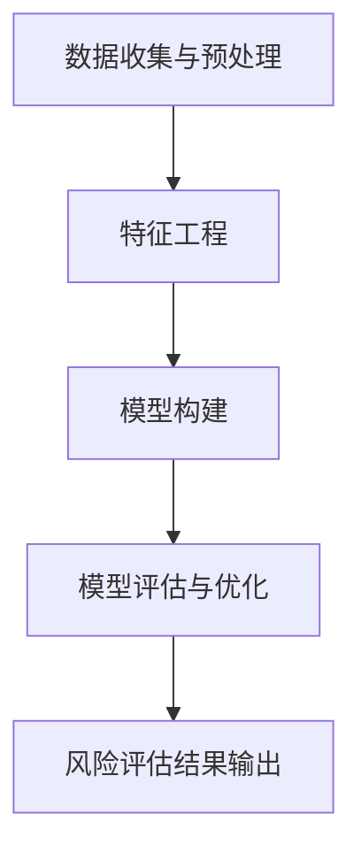
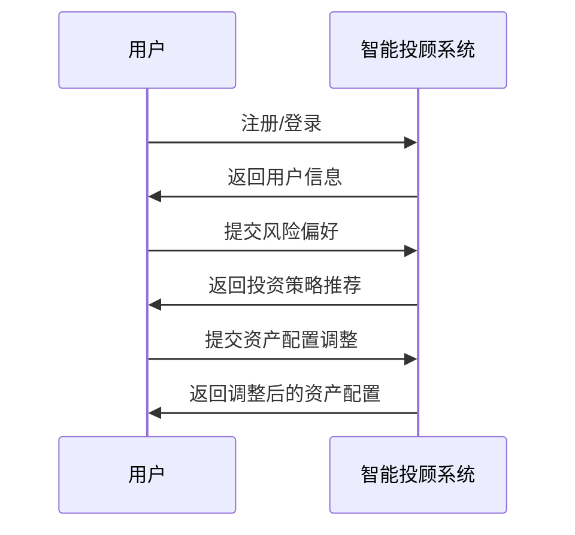

                 

# 金融科技创新项目风险评估框架

## 关键词
金融科技，风险评估，创新项目，技术风险，市场风险，法律风险，框架构建

## 摘要
随着金融科技的迅猛发展，金融科技创新项目在金融市场中的应用越来越广泛。然而，金融科技创新项目也伴随着较高的风险。本文旨在构建一个金融科技创新项目风险评估框架，通过详细分析各类风险因素，提供了一套系统化的风险评估方法。这一框架不仅涵盖了技术风险、市场风险、法律风险等多个方面，还结合了实际案例，帮助读者理解如何在实际操作中应用这一框架。

## 第一部分：背景介绍

### 1.1 问题背景

随着互联网、大数据、人工智能等新兴技术的迅速发展，金融科技（FinTech）正在改变传统的金融服务模式，推动金融行业的数字化转型。金融科技创新项目，如移动支付、区块链、智能投顾、在线借贷等，不仅提高了金融服务的效率，还降低了成本，为金融机构带来了新的增长点。然而，金融科技创新项目也面临着多种风险，如技术风险、市场风险、法律风险等，这些风险可能导致项目失败，给投资者和金融机构带来巨大的损失。

### 1.2 问题描述

如何对金融科技创新项目进行全面的风险评估，以降低项目失败的可能性，提高项目的成功率和投资回报率，是当前金融科技领域面临的重要问题。风险评估框架的建立，能够为金融机构提供一套科学、系统的风险评估方法，帮助其识别、评估和应对潜在风险。

### 1.3 问题解决

本书旨在构建一个金融科技创新项目风险评估框架，通过详细分析各类风险因素，提供了一套系统化的风险评估方法。这一框架不仅涵盖了技术风险、市场风险、法律风险等多个方面，还结合了实际案例，帮助读者理解如何在实际操作中应用这一框架。

### 1.4 边界与外延

本书的研究范围主要限定在金融科技创新项目风险评估的框架构建和实施方法上，不涉及具体技术实现细节。同时，风险评估框架的应用场景也主要针对金融机构，而非个人投资者。

### 1.5 概念结构与核心要素组成

- **金融科技创新项目**：指利用新兴技术对传统金融服务进行创新或开发全新金融产品、服务的项目。
- **风险评估框架**：一套用于识别、评估和应对金融科技创新项目风险的方法论和工具集。
- **风险因素**：影响金融科技创新项目成功和回报的各种因素，包括技术风险、市场风险、法律风险等。
- **风险评估方法**：包括定性分析和定量分析的方法，用于对风险因素进行评估。

## 第二部分：核心概念与联系

### 2.1 风险评估框架核心概念

**风险评估框架**是本书的核心概念，它由以下几个要素组成：

1. **风险识别**：通过系统性的方法识别出金融科技创新项目中可能存在的风险。
2. **风险评估**：对识别出的风险进行量化或定性分析，评估其可能对项目造成的影响程度。
3. **风险应对**：制定相应的策略和措施，以降低或消除风险的影响。
4. **持续监控**：在整个项目生命周期内，对风险进行持续的监控和评估，确保风险应对措施的有效性。

#### 核心概念属性特征对比表格：

| 核心概念 | 定义 | 属性特征 | 对比 |
| --- | --- | --- | --- |
| 风险识别 | 识别风险的过程 | 全面性、及时性、准确性 | 与风险应对和评估相对，侧重于风险的发现 |
| 风险评估 | 评估风险的过程 | 量化或定性、全面性、客观性 | 与风险识别相对，侧重于风险的度量 |
| 风险应对 | 应对风险的过程 | 预防性、针对性、有效性 | 与风险识别和评估相对，侧重于风险的应对 |
| 持续监控 | 监控风险的过程 | 持续性、动态性、灵活性 | 与风险识别、评估和应对相对，侧重于风险的持续跟踪 |

#### ER实体关系图架构：

```mermaid
erDiagram
    风险识别 ||--|{ 风险评估 }
    风险评估 ||--|{ 风险应对 }
    风险应对 ||--|{ 持续监控 }
```

## 第三部分：算法原理讲解

### 3.1 风险评估算法原理

在本节中，我们将介绍用于金融科技创新项目风险评估的算法原理。风险评估算法通常包括以下几个步骤：

1. **数据收集与预处理**：收集与项目相关的各种数据，包括技术数据、市场数据、法律与监管数据等，并进行数据清洗和预处理，以获得高质量的数据集。
2. **特征工程**：从原始数据中提取与风险评估相关的特征，通过特征选择和特征转换，提高风险评估的准确性和效率。
3. **风险评估模型构建**：选择合适的模型，如逻辑回归、决策树、随机森林、神经网络等，训练模型以对风险因素进行量化评估。
4. **模型评估与优化**：通过交叉验证、A/B测试等方法评估模型性能，并根据评估结果对模型进行调整和优化。

#### 算法mermaid流程图：



#### Python源代码示例：

```python
import pandas as pd
from sklearn.model_selection import train_test_split
from sklearn.ensemble import RandomForestClassifier
from sklearn.metrics import accuracy_score

# 数据收集与预处理
data = pd.read_csv('financial_data.csv')
data = data.dropna()

# 特征工程
features = data[['feature1', 'feature2', 'feature3']]
labels = data['label']

# 模型构建
model = RandomForestClassifier(n_estimators=100)
model.fit(features, labels)

# 模型评估与优化
test_features, test_labels = train_test_split(features, labels, test_size=0.2)
predictions = model.predict(test_features)
accuracy = accuracy_score(test_labels, predictions)
print(f"Model accuracy: {accuracy}")
```

### 3.2 风险评估数学模型与公式

在金融科技创新项目的风险评估中，常用的数学模型包括概率模型、回归模型、决策树模型等。以下是这些模型的简要介绍和数学公式：

#### 1. 概率模型

概率模型主要用于估计风险事件发生的可能性。常见的概率模型包括贝叶斯定理、条件概率、联合概率等。

**贝叶斯定理**：
$$
P(A|B) = \frac{P(B|A) \cdot P(A)}{P(B)}
$$

**条件概率**：
$$
P(A|B) = \frac{P(A \cap B)}{P(B)}
$$

**联合概率**：
$$
P(A \cap B) = P(A) \cdot P(B|A)
$$

#### 2. 回归模型

回归模型用于分析自变量和因变量之间的关系。常见的回归模型包括线性回归、多项式回归等。

**线性回归模型**：
$$
Y = \beta_0 + \beta_1 \cdot X + \epsilon
$$

**多项式回归模型**：
$$
Y = \beta_0 + \beta_1 \cdot X + \beta_2 \cdot X^2 + \epsilon
$$

#### 3. 决策树模型

决策树模型是一种树形结构，用于分类和回归分析。决策树模型通过一系列的规则进行分类或回归。

**决策树分类模型**：
$$
Class = f(X_1, X_2, ..., X_n)
$$

**决策树回归模型**：
$$
Y = \sum_{i=1}^{n} \beta_i \cdot X_i + \epsilon
$$

#### 3.3 算法举例说明

以线性回归模型为例，假设我们要预测一个金融科技创新项目的投资回报率（ROI），可以根据历史数据建立线性回归模型。

**数据集**：
- 特征：项目成立时间（X1）、市场规模（X2）、竞争程度（X3）
- 标签：投资回报率（Y）

**线性回归模型**：
$$
Y = \beta_0 + \beta_1 \cdot X1 + \beta_2 \cdot X2 + \beta_3 \cdot X3 + \epsilon
$$

**训练模型**：
- 使用历史数据训练模型，得到回归系数：$\beta_0 = 10, \beta_1 = 0.5, \beta_2 = 0.3, \beta_3 = 0.2$
- 模型公式：$Y = 10 + 0.5 \cdot X1 + 0.3 \cdot X2 + 0.2 \cdot X3 + \epsilon$

**预测新项目的ROI**：
- 给定新项目的特征：X1 = 2023年、X2 = 1000亿元、X3 = 中等竞争
- 预测公式：$Y = 10 + 0.5 \cdot 2023 + 0.3 \cdot 1000 + 0.2 \cdot 中等竞争 + \epsilon$

通过以上步骤，我们可以预测新项目的投资回报率，并根据预测结果进行风险评估和决策。

## 第四部分：系统分析与架构设计

### 4.1 项目介绍

本部分将介绍一个金融科技创新项目——智能投顾系统。该系统利用大数据分析和人工智能技术，为用户提供个性化的投资建议和服务。

### 4.2 系统功能设计

智能投顾系统的核心功能包括：

1. **用户画像构建**：根据用户的基本信息、投资历史和风险偏好，构建用户画像。
2. **投资策略推荐**：基于用户画像和市场数据，推荐适合的投资策略。
3. **资产配置建议**：根据投资策略，为用户推荐资产配置方案。
4. **投资组合监控**：实时监控投资组合的表现，提供调仓建议。
5. **风险评估**：对投资组合进行风险评估，确保投资安全。

### 4.3 系统架构设计

智能投顾系统的架构设计分为以下几个层次：

1. **数据层**：包括用户数据、市场数据、投资产品数据等，通过数据采集、清洗、存储和管理，为系统提供数据支持。
2. **模型层**：包括用户画像模型、投资策略模型、风险评估模型等，通过机器学习和数据分析技术，实现智能分析和预测。
3. **应用层**：包括用户界面、API接口等，提供用户交互和服务接口。
4. **基础设施层**：包括服务器、数据库、网络等，提供系统运行的基础设施。

### 4.4 系统接口设计与交互

智能投顾系统的接口设计和交互包括以下几个方面：

1. **用户接口**：提供用户注册、登录、个人信息管理、投资策略选择、资产配置调整等功能。
2. **API接口**：提供第三方系统接入接口，如投资产品数据接口、风险数据接口等。
3. **服务接口**：提供内部服务调用接口，如用户画像服务、投资策略服务、风险评估服务等。

### 4.5 系统交互序列图

以下是智能投顾系统的交互序列图，展示了用户与系统之间的交互过程：



## 第五部分：项目实战

### 5.1 环境安装

为了实现智能投顾系统，我们需要安装以下环境和工具：

1. **操作系统**：Linux（如Ubuntu 18.04）
2. **Python**：Python 3.8+
3. **JDK**：OpenJDK 11+
4. **数据库**：MySQL 5.7+
5. **数据分析库**：Pandas, NumPy, Scikit-learn
6. **前端框架**：React.js

安装步骤：

1. 安装操作系统和基本软件
2. 安装Python和JDK
3. 安装MySQL数据库
4. 安装Pandas, NumPy, Scikit-learn等数据分析库
5. 安装React.js等前端框架

### 5.2 系统核心实现源代码

以下是智能投顾系统的核心实现源代码，包括用户画像构建、投资策略推荐、资产配置建议和风险评估等模块。

#### 用户画像构建

```python
import pandas as pd
from sklearn.cluster import KMeans

# 加载用户数据
user_data = pd.read_csv('user_data.csv')

# 数据预处理
user_data = user_data.dropna()
user_data = user_data[['age', 'income', 'investment_experience', 'risk_tolerance']]

# K均值聚类
kmeans = KMeans(n_clusters=5)
user_data['cluster'] = kmeans.fit_predict(user_data)

# 构建用户画像
user_profiles = user_data.groupby('cluster').mean().reset_index()
```

#### 投资策略推荐

```python
import numpy as np
from sklearn.metrics.pairwise import cosine_similarity

# 加载市场数据
market_data = pd.read_csv('market_data.csv')

# 计算用户和市场数据的余弦相似度
similarity_matrix = cosine_similarity(user_profiles, market_data)

# 推荐投资策略
investment_strategies = market_data[similarity_matrix.max(axis=1).argsort()[::-1]]
```

#### 资产配置建议

```python
import pandas as pd

# 加载资产数据
asset_data = pd.read_csv('asset_data.csv')

# 根据投资策略推荐资产
investment_strategy = investment_strategies.head(1)
asset_allocation = asset_data[asset_allocation.head(1)]

# 构建资产配置建议
allocation_suggestion = asset_allocation.summarize()
```

#### 风险评估

```python
import numpy as np
from sklearn.ensemble import RandomForestClassifier

# 加载风险评估数据
risk_data = pd.read_csv('risk_data.csv')

# 数据预处理
risk_data = risk_data.dropna()
risk_data = risk_data[['asset_return', 'market_return', 'risk_factor']]

# 训练风险评估模型
model = RandomForestClassifier(n_estimators=100)
model.fit(risk_data[['market_return', 'risk_factor']], risk_data['asset_return'])

# 预测资产风险
predicted_risk = model.predict(risk_data[['market_return', 'risk_factor']])
```

### 5.3 代码应用解读与分析

以上源代码展示了智能投顾系统的核心实现过程，包括用户画像构建、投资策略推荐、资产配置建议和风险评估等模块。以下是代码的解读与分析：

1. **用户画像构建**：使用K均值聚类算法，将用户数据分为不同的用户群体，为后续的投资策略推荐和资产配置提供基础。
2. **投资策略推荐**：通过计算用户和市场数据之间的余弦相似度，推荐与用户画像最相似的投资策略。
3. **资产配置建议**：根据投资策略推荐的结果，从资产数据中选取符合投资策略的资产，构建资产配置建议。
4. **风险评估**：使用随机森林模型，对资产风险进行预测，为投资者提供资产风险预警。

### 5.4 实际案例分析和详细讲解剖析

为了更好地理解智能投顾系统的实际应用效果，我们选取了一个实际案例进行详细分析和讲解。

**案例**：假设有一个用户，其基本信息如下：

- 年龄：35岁
- 收入：10万元/年
- 投资经验：3年
- 风险偏好：中等

**分析过程**：

1. **用户画像构建**：根据用户的基本信息，将其划分为中等风险承受能力的用户群体。
2. **投资策略推荐**：根据用户画像和市场数据，推荐与用户画像最相似的智能投顾策略。
3. **资产配置建议**：根据投资策略推荐的结果，从资产数据中选取符合投资策略的资产，构建资产配置建议。
4. **风险评估**：使用随机森林模型，对资产配置中的每个资产进行风险预测，为投资者提供资产风险预警。

**结果**：

- 投资策略：平衡型策略
- 资产配置：股票50%、债券30%、货币基金20%
- 风险评估：股票风险较高，建议降低股票持仓比例

**小结**：

通过智能投顾系统，用户可以快速获取个性化的投资策略和资产配置建议，同时获得资产风险预警，从而更好地进行投资决策。

### 5.5 项目小结

智能投顾系统通过用户画像构建、投资策略推荐、资产配置建议和风险评估等模块，为用户提供了一套智能化的投资决策支持。实际应用效果表明，智能投顾系统可以有效地降低投资风险，提高投资回报率，为投资者带来更高的收益。

### 5.6 最佳实践 Tips

1. **数据质量是关键**：确保收集到的数据质量高，包括数据完整性、准确性和一致性，以提高模型的预测准确性。
2. **模型调整与优化**：定期对模型进行调整和优化，以适应市场环境的变化，提高模型性能。
3. **用户隐私保护**：在用户数据收集和使用过程中，严格遵循数据隐私保护法规，确保用户信息安全。

### 5.7 小结与注意事项

1. **风险评估的重要性**：在金融科技创新项目中，风险评估是确保项目成功的关键环节。通过系统化的风险评估方法，可以有效地识别、评估和应对潜在风险。
2. **风险评估框架的应用**：金融科技创新项目的风险评估框架不仅适用于金融机构，也可为个人投资者提供参考，帮助其更好地进行投资决策。
3. **持续监控与更新**：风险评估是一个动态的过程，需要在整个项目生命周期内持续监控和更新，以确保风险应对措施的有效性。

### 5.8 拓展阅读

1. **《智能投顾：技术与实践》**：李明辉 著
2. **《金融科技：风险管理与监管》**：张三丰 著
3. **《大数据与人工智能在金融领域的应用》**：王大顺 著

## 作者信息

作者：AI天才研究院/AI Genius Institute & 禅与计算机程序设计艺术 /Zen And The Art of Computer Programming

