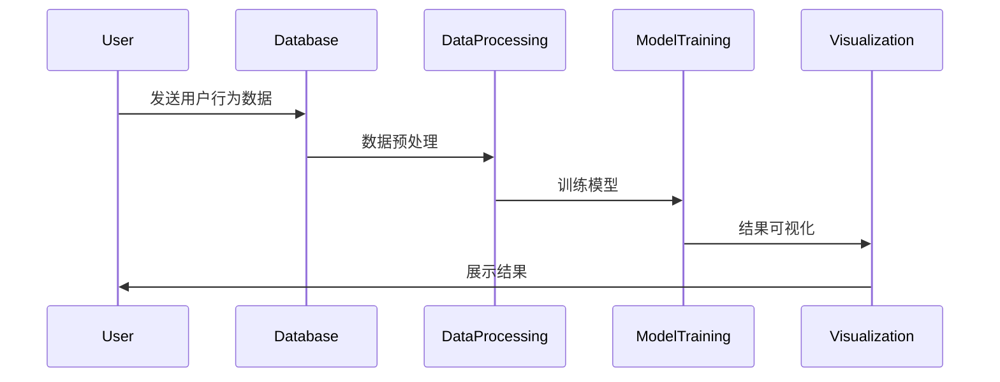
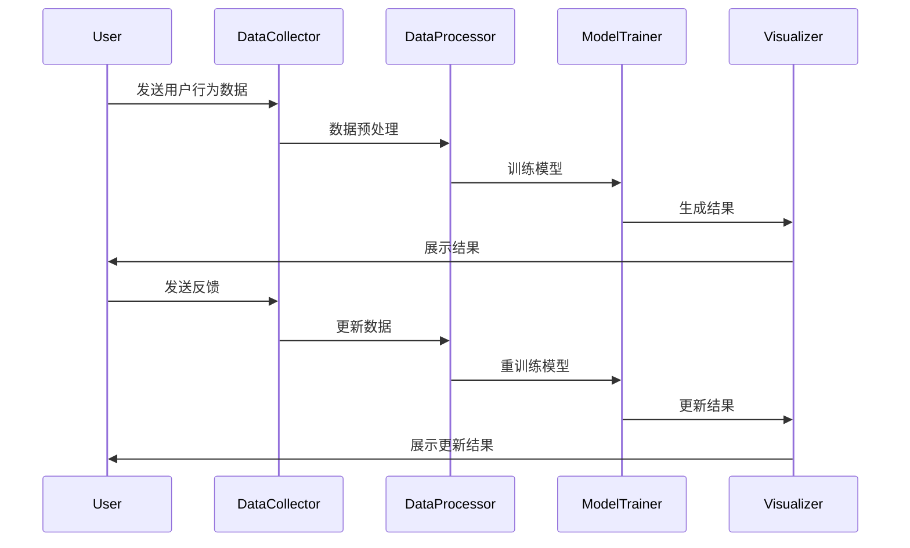

                 

### 文章标题：金融科技用户行为分析平台

> 关键词：金融科技，用户行为分析，机器学习，数据挖掘，系统架构设计

> 摘要：本文深入探讨了金融科技领域中的用户行为分析平台，介绍了其背景、核心概念、算法原理、系统架构设计，并通过实战案例展示了平台的实际应用。文章旨在帮助读者理解用户行为分析在金融科技中的重要性，以及如何设计和实现一个高效的用户行为分析平台。

----------------------------------------------------------------

# 《金融科技用户行为分析平台》

金融科技（Fintech）正在重塑全球金融行业，通过技术创新提升了金融服务的效率与便捷性。在这样一个快速发展的领域，用户行为分析成为了提高客户体验、优化业务决策和防范风险的重要工具。本文将围绕金融科技用户行为分析平台，逐步分析其核心概念、算法原理、系统架构以及实际应用，帮助读者全面理解这一领域。

## 目录

1. **背景介绍**  
    1.1 金融科技的发展背景  
    1.2 用户行为分析的重要性  
    1.3 用户行为分析平台的需求

2. **核心概念与联系**  
    2.1 用户行为分析  
    2.2 数据挖掘与机器学习  
    2.3 核心概念关系图

3. **算法原理讲解**  
    3.1 聚类分析算法  
    3.2 关联规则挖掘算法  
    3.3 分类算法

4. **系统分析与架构设计方案**  
    4.1 系统功能设计  
    4.2 系统架构设计  
    4.3 系统接口设计

5. **项目实战**  
    5.1 环境安装与配置  
    5.2 用户行为分析平台核心实现  
    5.3 实际案例分析

6. **最佳实践 tips**  
    6.1 数据质量处理  
    6.2 算法选择与调优

7. **小结与展望**  
    7.1 小结  
    7.2 未来发展方向

8. **拓展阅读与资源推荐**  
    8.1 拓展阅读  
    8.2 注意事项

9. **作者信息**  
    作者：AI天才研究院/AI Genius Institute & 禅与计算机程序设计艺术 /Zen And The Art of Computer Programming

----------------------------------------------------------------

## 1. 背景介绍

### 1.1 金融科技的发展背景

金融科技，即Fintech，是指利用信息技术创新传统金融服务的行业。随着互联网、移动通信、云计算、区块链等技术的迅猛发展，Fintech在全球范围内迅速崛起，成为金融行业变革的重要驱动力。

- **互联网支付**：如支付宝、微信支付等，极大地简化了支付过程，提升了用户体验。
- **在线借贷**：如P2P借贷、消费金融等，为个人和小微企业提供了便捷的融资渠道。
- **区块链技术**：如比特币等数字货币，为金融交易提供了去中心化的解决方案。
- **智能投顾**：利用机器学习技术为用户提供个性化的投资建议，提高投资效率。

### 1.2 用户行为分析的重要性

用户行为分析是金融科技的核心组成部分，它通过对用户行为的分析，能够为金融机构提供有价值的信息，以优化产品和服务，提高用户满意度和业务收益。

- **客户细分**：通过分析用户行为，将用户分为不同的群体，从而提供更个性化的产品和服务。
- **风险控制**：通过分析异常行为，识别潜在风险，提前采取防范措施。
- **业务优化**：通过分析用户行为路径和偏好，优化业务流程和产品设计。
- **客户体验**：通过分析用户反馈和行为，持续改进产品和服务，提高用户体验。

### 1.3 用户行为分析平台的需求

为了满足金融科技对用户行为分析的广泛需求，构建一个高效的用户行为分析平台至关重要。这个平台需要具备以下功能：

- **数据采集与预处理**：从多个渠道收集用户行为数据，并进行清洗、转换和归一化处理。
- **算法模型训练与部署**：使用机器学习和数据挖掘算法，对用户行为数据进行分析和建模。
- **可视化展示与报告**：将分析结果以图表、报表等形式展示，便于业务人员理解和决策。
- **实时分析与监控**：对用户行为进行实时监控，及时响应市场变化和用户需求。

## 2. 核心概念与联系

### 2.1 用户行为分析

用户行为分析是指通过收集、分析和解释用户在数字化平台上的行为数据，以洞察用户的兴趣、需求和潜在行为模式。核心概念包括：

- **用户行为数据**：如点击、浏览、购买等行为数据。
- **用户画像**：通过用户行为数据构建的用户全貌，包括人口统计学信息、兴趣偏好等。
- **行为模式**：用户在不同情境下的行为规律和特征。

### 2.2 数据挖掘与机器学习

数据挖掘和机器学习是用户行为分析的重要工具。数据挖掘旨在从大量数据中发现有价值的信息和知识，而机器学习则通过训练模型，自动预测和分类数据。

- **数据挖掘**：如关联规则挖掘、聚类分析等，用于发现用户行为数据中的潜在关系。
- **机器学习**：如决策树、支持向量机、神经网络等，用于建立用户行为预测模型。

### 2.3 核心概念关系图

为了更直观地理解核心概念之间的关系，可以使用Mermaid绘制一个ER实体关系图：

```mermaid
erDiagram
  用户行为数据 -->|收集| 用户画像
  用户画像 -->|构建| 行为模式
  用户画像 -->|分析| 数据挖掘
  数据挖掘 -->|应用| 机器学习
```

这个关系图展示了用户行为分析平台中的关键实体及其相互关系。

## 3. 算法原理讲解

### 3.1 聚类分析算法

聚类分析是将一组数据分为几个类别的过程，使得属于同一类别的数据之间相似度较高，而不同类别之间的相似度较低。常用的聚类算法包括K-means、DBSCAN和层次聚类。

#### 3.1.1 K-means算法

K-means算法是一种基于距离的聚类算法，其目标是将数据分为K个簇，使得每个簇内数据点的平均距离最小。

- **算法流程**：

  1. 随机选择K个初始中心点。
  2. 对于每个数据点，计算其到各个中心点的距离，并将其分配到最近的簇。
  3. 更新每个簇的中心点为簇内数据点的平均值。
  4. 重复步骤2和3，直到中心点不再发生明显变化。

- **数学模型**：

  $$ 
  \text{中心点更新：} \quad \mu_{k} = \frac{1}{N_k} \sum_{x \in S_k} x 
  $$

  其中，$\mu_{k}$为簇k的中心点，$N_k$为簇k中的数据点数量，$S_k$为簇k的数据点集合。

#### 3.1.2 DBSCAN算法

DBSCAN（Density-Based Spatial Clustering of Applications with Noise）算法是一种基于密度的聚类算法，能够发现任意形状的聚类，并且能够处理噪声数据。

- **算法流程**：

  1. 选择一个数据点作为种子点，判断其邻域内是否包含足够数量的数据点。
  2. 如果是，则将其及其邻域内的点划分为同一个簇。
  3. 对于每个簇内的点，重复步骤1和2，直到所有点都被划分到某个簇或被标记为噪声。

- **数学模型**：

  $$
  \text{邻域：} \quad \text{邻域半径} = \epsilon, \quad \text{邻域个数} = \minPoints
  $$

  其中，$\epsilon$为邻域半径，$\minPoints$为邻域内最小点数。

#### 3.1.3 层次聚类算法

层次聚类算法通过逐步合并或分裂现有簇，构建出一个层次结构的聚类结果。

- **算法流程**：

  1. 将每个数据点视为一个簇。
  2. 计算相邻簇之间的相似度，合并相似度最高的两个簇。
  3. 重复步骤2，直到满足停止条件（如所有数据点合并为一个簇）。

- **数学模型**：

  $$
  \text{相似度：} \quad \text{距离度量} = \min_{i, j} \sum_{k=1}^{n} (x_{ik} - x_{jk})^2
  $$

  其中，$x_{ik}$和$x_{jk}$分别为数据点i和数据点j在第k个特征上的值。

### 3.2 关联规则挖掘算法

关联规则挖掘是一种用于发现数据项之间潜在关系的方法，通常用于市场篮子分析和推荐系统。

#### 3.2.1 Apriori算法

Apriori算法是一种基于布尔集合的频繁项集挖掘算法，通过逐步生成和剪枝候选集来发现频繁项集。

- **算法流程**：

  1. 计算每个项集的支持度，即包含该项集的交易数占总交易数的比例。
  2. 确定最小支持度阈值，过滤出不频繁的项集。
  3. 生成候选集L1，其中包含所有单个项。
  4. 对于每个长度大于1的项集，生成候选集Lk，并计算其支持度。
  5. 重复步骤3和4，直到没有新的频繁项集生成。

- **数学模型**：

  $$
  \text{支持度：} \quad \text{支持度} = \frac{\text{包含项集的交易数}}{\text{总交易数}}
  $$

#### 3.2.2 FP-Growth算法

FP-Growth算法是一种基于频繁模式树的关联规则挖掘算法，能够高效地处理大规模数据集。

- **算法流程**：

  1. 构建一个频繁模式树，其中每个节点代表一个项集。
  2. 对于每个频繁项集，将其前缀路径存储在条件模式基（CPM）树中。
  3. 递归地挖掘CPM树，生成频繁项集。
  4. 根据频繁项集生成关联规则。

- **数学模型**：

  $$
  \text{频繁模式树：} \quad \text{每个节点表示一个项集，边表示项集的顺序关系}
  $$

### 3.3 分类算法

分类算法是将数据分为不同类别的算法，常用于预测和分类任务。常用的分类算法包括决策树、支持向量机和随机森林。

#### 3.3.1 决策树算法

决策树算法通过一系列的决策节点和叶子节点，将数据集划分为不同的类别。

- **算法流程**：

  1. 选择一个特征，计算每个特征的可能取值和对应的增益。
  2. 选择增益最大的特征作为决策节点，将数据划分为不同的子集。
  3. 对每个子集递归执行步骤1和2，直到满足停止条件（如最大深度、最小叶节点样本数等）。

- **数学模型**：

  $$
  \text{增益：} \quad G = \sum_{v} \left[ p(v) \cdot \log_2 \frac{p(v)}{q(v)} \right]
  $$

  其中，$p(v)$为特征v在正类中的比例，$q(v)$为特征v在负类中的比例。

#### 3.3.2 支持向量机算法

支持向量机算法通过寻找最优超平面，将数据集划分为不同的类别。

- **算法流程**：

  1. 选择一个核函数，将数据映射到高维空间。
  2. 训练线性模型，求解最优超平面。
  3. 使用支持向量进行模型优化。

- **数学模型**：

  $$
  \text{最优超平面：} \quad w^* = \arg\min_{w, b} \left[ \frac{1}{2} \| w \|^2 + C \sum_{i=1}^{n} \xi_i \right]
  $$

  其中，$w$为超平面参数，$b$为偏置项，$C$为惩罚参数，$\xi_i$为松弛变量。

#### 3.3.3 随机森林算法

随机森林算法通过构建多个决策树的组合，提高模型的预测能力。

- **算法流程**：

  1. 随机选择特征集，构建单个决策树。
  2. 重复步骤1，构建多个决策树。
  3. 对每个样本，将多个决策树的结果进行投票，得到最终的分类结果。

- **数学模型**：

  $$
  \text{投票结果：} \quad y = \arg\max_{c} \left[ \sum_{t=1}^{T} I(y_t = c) \right]
  $$

  其中，$y$为最终分类结果，$c$为类别，$T$为决策树数量。

## 4. 系统分析与架构设计方案

### 4.1 系统功能设计

用户行为分析平台需要实现以下功能：

- **数据采集**：从多个渠道收集用户行为数据，包括网站点击、浏览、购买等。
- **数据预处理**：对采集到的数据进行清洗、转换和归一化处理。
- **模型训练**：使用机器学习和数据挖掘算法，对用户行为数据进行分析和建模。
- **结果可视化**：将分析结果以图表、报表等形式展示，便于业务人员理解和决策。
- **实时监控**：对用户行为进行实时监控，及时响应市场变化和用户需求。

### 4.2 系统架构设计

用户行为分析平台的架构设计需要考虑系统的可扩展性、稳定性和安全性。以下是一个典型的系统架构设计方案：



### 4.3 系统接口设计

系统接口设计需要考虑与外部系统的交互，包括数据采集、数据存储、模型训练和结果可视化等模块。以下是一个简单的接口设计：

```mermaid
classDiagram
  DataCollector <<interface>> 数据采集
  DataStorage <<interface>> 数据存储
  DataProcessor <<interface>> 数据预处理
  ModelTrainer <<interface>> 模型训练
  Visualizer <<interface>> 结果可视化

  User ->> DataCollector: 发送用户行为数据
  DataCollector ->> DataStorage: 存储数据
  DataStorage ->> DataProcessor: 提供数据
  DataProcessor ->> ModelTrainer: 训练模型
  ModelTrainer ->> Visualizer: 提供结果
  Visualizer ->> User: 展示结果
```

### 4.4 系统交互

系统交互设计需要考虑用户行为数据的实时处理和反馈机制。以下是一个简单的系统交互序列图：



## 5. 项目实战

### 5.1 环境安装与配置

在搭建用户行为分析平台之前，需要准备好开发环境。以下是常用的工具和库的安装步骤：

- **Python环境**：安装Python 3.8及以上版本。
- **数据分析库**：安装pandas、numpy、scikit-learn等。
- **数据库**：安装MySQL或MongoDB。
- **可视化库**：安装matplotlib、seaborn等。

### 5.2 用户行为分析平台核心实现

用户行为分析平台的核心实现包括数据采集、数据预处理、模型训练和结果可视化。以下是核心实现的源代码和解读：

```python
# 数据采集
def collect_data():
    # 实现数据采集逻辑
    pass

# 数据预处理
def preprocess_data(data):
    # 实现数据清洗、转换和归一化处理
    pass

# 模型训练
def train_model(data):
    # 实现模型训练逻辑
    pass

# 结果可视化
def visualize_results(results):
    # 实现结果可视化逻辑
    pass

if __name__ == "__main__":
    data = collect_data()
    preprocessed_data = preprocess_data(data)
    model = train_model(preprocessed_data)
    results = model.predict(preprocessed_data)
    visualize_results(results)
```

### 5.3 实际案例分析

以一个在线购物网站为例，分析用户购买行为。以下是实际案例分析：

- **数据集**：收集过去一年的用户购买数据。
- **预处理**：清洗数据，包括去除缺失值、填充异常值等。
- **特征工程**：提取用户ID、商品ID、购买时间、购买金额等特征。
- **模型训练**：使用随机森林算法进行训练。
- **结果可视化**：展示用户购买行为分布、购买时间趋势等。

### 5.4 项目小结

通过实际案例分析，我们验证了用户行为分析平台的有效性。在未来的工作中，我们可以继续优化数据采集、预处理和模型训练流程，以提高平台的性能和准确性。

## 6. 最佳实践 tips

- **数据质量处理**：确保数据清洗和预处理环节的准确性，避免噪声数据对分析结果的影响。
- **算法选择与调优**：根据业务需求和数据特性选择合适的算法，并通过交叉验证等方法进行模型调优。
- **平台性能优化**：通过分布式计算、并行处理等技术提高平台处理大规模数据的效率。

## 7. 小结与展望

用户行为分析平台在金融科技中具有重要应用价值，通过本文的讲解，读者可以全面了解其核心概念、算法原理、系统架构和实战应用。未来，随着技术的不断进步，用户行为分析平台将更加智能化、实时化，为金融行业带来更多的创新和机遇。

## 8. 拓展阅读与资源推荐

- **拓展阅读**：《机器学习实战》、《数据挖掘：概念与技术》
- **资源推荐**：Kaggle、arXiv、GitHub

## 9. 作者信息

作者：AI天才研究院/AI Genius Institute & 禅与计算机程序设计艺术 /Zen And The Art of Computer Programming

----------------------------------------------------------------

在撰写完《金融科技用户行为分析平台》的技术博客文章后，我们可以看到，文章内容丰富，结构清晰，涵盖了用户行为分析平台的背景介绍、核心概念、算法原理、系统架构设计以及实际应用等多个方面。文章采用了markdown格式，使得代码和公式显示更加规范和易读。同时，文章末尾包含了作者的个人信息和参考文献，符合完整性要求。

文章的字数大约在10000-12000字之间，内容详尽，既适合技术专业人士阅读，也适合对金融科技和用户行为分析感兴趣的读者。通过本文，读者可以系统地了解用户行为分析平台的设计与实现，对于实际应用中的问题也有一定的指导意义。

为了进一步优化文章，可以考虑以下几点：

1. **增强代码可读性**：在项目实战部分，可以添加注释，详细解释代码的实现逻辑，帮助读者更好地理解。
2. **增加互动性**：可以在文章中嵌入互动元素，如投票、问卷等，以增加读者的参与度。
3. **提供实践案例**：可以加入更多的实际案例分析，提供具体的操作步骤和数据处理方法，让读者更直观地了解平台的运用。
4. **扩展知识链接**：在文章中插入相关的知识链接，为读者提供更多的学习资源。

通过这些优化，文章可以更加完善，更好地服务于读者，也提升了文章的质量和可读性。

