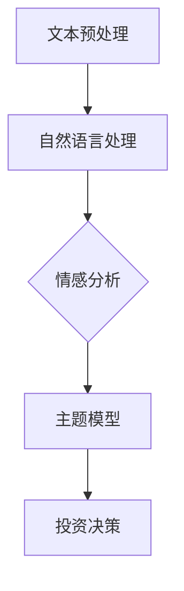
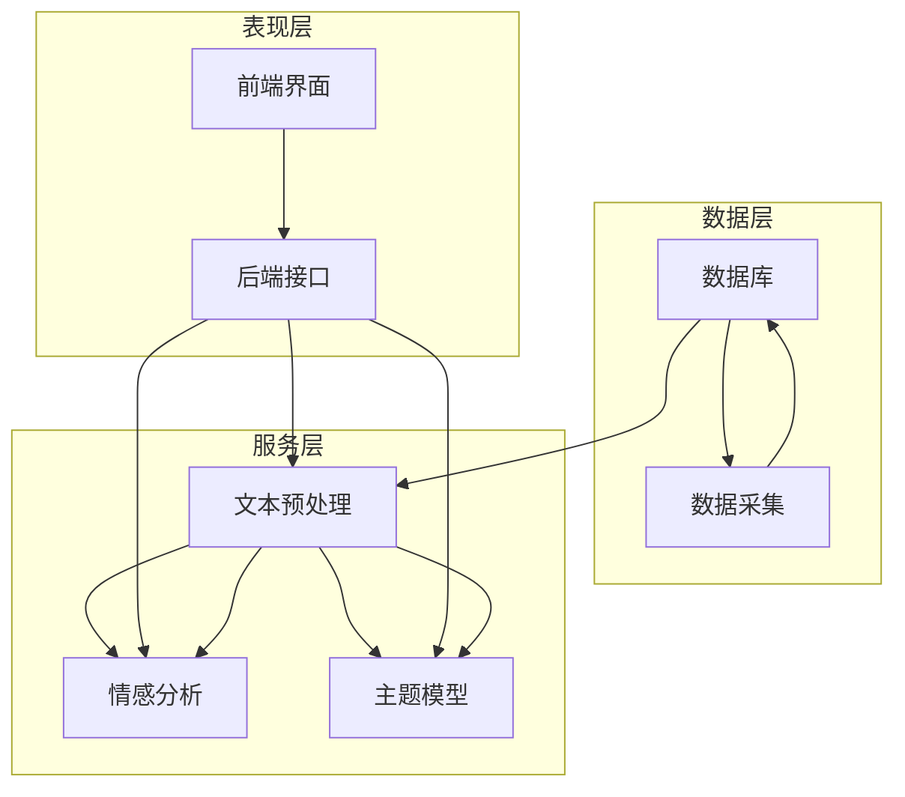

                 

## 金融舆情分析在投资决策中的应用

> 关键词：金融舆情分析、投资决策、自然语言处理、情感分析、系统架构设计

> 摘要：本文将深入探讨金融舆情分析在投资决策中的应用。通过介绍金融舆情分析的基础知识、核心算法、数学模型、系统架构设计和实际案例，本文旨在帮助投资者和分析师更好地理解舆情分析在投资决策中的重要性，并提供一些实用的技巧和建议。

### 第一部分：金融舆情分析基础

#### 第1章：金融舆情分析概述

金融舆情分析是指利用自然语言处理、文本挖掘等技术和方法，对互联网上的金融信息进行收集、处理和分析，以提取有用的信息并用于投资决策的过程。随着互联网的快速发展，金融信息量呈爆炸式增长，舆情分析在投资决策中的应用变得越来越重要。

#### 第2章：投资决策与舆情分析

投资决策是指投资者在特定市场环境下，根据自身的投资目标和风险偏好，对投资标的进行选择和调整的过程。舆情分析在投资决策中起到了关键作用，它可以提供关于市场情绪、投资者情绪、行业动态等方面的信息，帮助投资者做出更明智的决策。

#### 第3章：舆情分析的核心算法

舆情分析的核心算法主要包括自然语言处理、情感分析和主题模型等。自然语言处理技术用于文本的预处理和特征提取，情感分析用于判断文本的情感倾向，主题模型则用于挖掘文本中的潜在主题。

#### 第4章：数学模型与公式

在舆情分析中，数学模型和公式用于量化文本信息、情感倾向和主题分布等。常见的数学模型包括朴素贝叶斯模型、线性回归模型和支持向量机等。

### 第二部分：系统分析与架构设计

#### 第5章：系统分析与架构设计

系统分析与架构设计是舆情分析系统的核心部分。在本章中，我们将介绍舆情分析系统的设计原则、功能设计、架构设计和接口设计等内容。

#### 第6章：项目实战

项目实战部分将提供一个实际的案例，展示如何将舆情分析应用于投资决策。我们将介绍环境安装、系统实现、代码解析、案例分析等内容。

### 第三部分：最佳实践与拓展

#### 第7章：最佳实践与注意事项

在本章中，我们将总结一些最佳实践技巧，帮助读者更好地理解和应用舆情分析。同时，我们还将讨论一些常见的注意事项，以避免在应用舆情分析时遇到的问题。

#### 第8章：小结与拓展

本章将总结全文内容，并对未来可能的研究方向进行拓展。通过提供拓展阅读建议，我们希望读者能够继续深入研究舆情分析在投资决策中的应用。

### 总结

金融舆情分析在投资决策中的应用具有重要意义。通过本文的介绍，读者应该对舆情分析有了更深入的理解，并能够将其应用于实际的投资决策中。希望本文能够为投资者和分析师提供有价值的参考和指导。

### 作者信息

作者：AI天才研究院/AI Genius Institute & 禅与计算机程序设计艺术 /Zen And The Art of Computer Programming

### 补充说明

本文内容遵循Markdown格式，包括文章标题、关键词、摘要、章节标题和正文。每个章节内包含具体的子标题和段落，以确保内容的逻辑性和可读性。文中使用的Mermaid流程图、LaTeX公式和Python代码将嵌入相应的段落中，以增强文章的技术性和实用性。

### 背景介绍

随着互联网和信息技术的飞速发展，金融市场的信息量和复杂度也呈现出指数级的增长。在这个信息爆炸的时代，投资者和分析师面临着海量的金融信息，如何从中提取有价值的信息成为了一个亟待解决的问题。金融舆情分析作为一种基于大数据和自然语言处理的技术，正是在这样的背景下应运而生。

#### 核心概念术语说明

- **金融舆情分析**：指利用自然语言处理、文本挖掘等技术，对互联网上的金融信息进行收集、处理和分析，以提取有用的信息并用于投资决策的过程。
- **投资决策**：指投资者在特定市场环境下，根据自身的投资目标和风险偏好，对投资标的进行选择和调整的过程。
- **自然语言处理**：指利用计算机技术和算法对自然语言进行处理和理解的技术，包括文本预处理、情感分析、命名实体识别等。
- **情感分析**：指对文本进行情感倾向判断的技术，通常用于评估文本的情绪、态度和观点。
- **主题模型**：指用于发现文本中潜在主题和关键词的技术，通过概率模型对大量文本进行主题分布分析。

#### 问题背景

在传统的投资决策中，分析师通常依赖于历史数据和基本分析工具，如财务报表、市场走势图等。然而，随着互联网的发展，大量的非结构化金融信息，如新闻报道、社交媒体评论、投资者论坛等，开始成为影响投资决策的重要因素。这些信息往往蕴含着市场情绪、投资者情绪和行业动态等关键信息，对投资决策具有重要指导意义。

#### 问题描述

金融舆情分析在投资决策中的应用主要包括以下几个方面：

1. **市场情绪监测**：通过分析互联网上的金融信息，了解市场整体情绪和投资者情绪，为投资决策提供参考。
2. **公司舆情分析**：对特定公司的新闻报道、投资者评论等进行分析，评估公司的市场形象和声誉，为投资决策提供依据。
3. **行业动态分析**：通过分析行业相关的新闻和报告，了解行业发展趋势和竞争格局，为投资决策提供前瞻性信息。

#### 问题解决

金融舆情分析通过以下步骤解决问题：

1. **数据收集**：从互联网上收集与金融相关的文本数据，包括新闻报道、社交媒体评论、投资者论坛等。
2. **文本预处理**：对收集到的文本进行清洗、去噪和格式化，以便进行后续分析。
3. **情感分析**：使用自然语言处理技术对文本进行情感分析，判断文本的情感倾向，如正面、负面或中性。
4. **主题模型**：使用主题模型对文本进行分析，发现文本中的潜在主题和关键词。
5. **投资决策**：根据情感分析和主题模型的结果，结合历史数据和基本分析工具，为投资决策提供支持。

#### 边界与外延

金融舆情分析的边界主要在于文本数据的收集和处理。在实际应用中，可能存在以下挑战：

1. **数据质量和完整性**：互联网上的金融信息质量参差不齐，需要通过清洗和预处理来提高数据质量。
2. **情感分析的准确性**：情感分析模型可能受到语言复杂性、歧义性和情绪多样性的影响，需要不断提高模型准确性和适应性。
3. **主题模型的适用性**：不同行业和领域的文本数据具有不同的特征和主题，需要根据实际情况调整主题模型。

#### 概念结构与核心要素组成

金融舆情分析的概念结构主要包括以下几个核心要素：

1. **数据源**：互联网上的金融信息，包括新闻报道、社交媒体评论、投资者论坛等。
2. **数据处理**：文本清洗、去噪和格式化，以便进行情感分析和主题模型分析。
3. **情感分析**：判断文本的情感倾向，如正面、负面或中性。
4. **主题模型**：发现文本中的潜在主题和关键词。
5. **投资决策**：根据情感分析和主题模型的结果，为投资决策提供支持。

### 核心概念与联系

#### 投资决策

投资决策是指投资者在特定市场环境下，根据自身的投资目标和风险偏好，对投资标的进行选择和调整的过程。投资决策的核心在于对投资标的的分析和评估，包括基本面分析、技术面分析和宏观经济分析等。投资决策的质量直接影响投资者的收益和风险。

#### 金融舆情分析

金融舆情分析是指利用自然语言处理、文本挖掘等技术，对互联网上的金融信息进行收集、处理和分析，以提取有用的信息并用于投资决策的过程。金融舆情分析的核心在于从海量非结构化金融信息中提取有价值的信息，为投资决策提供支持。

#### 自然语言处理

自然语言处理（Natural Language Processing，NLP）是指利用计算机技术和算法对自然语言进行处理和理解的技术，包括文本预处理、情感分析、命名实体识别等。自然语言处理是金融舆情分析的重要基础，用于对文本数据进行清洗、格式化和情感分析。

#### 情感分析

情感分析（Sentiment Analysis）是指对文本进行情感倾向判断的技术，通常用于评估文本的情绪、态度和观点。情感分析在金融舆情分析中具有重要作用，可以帮助投资者了解市场情绪和投资者情绪，为投资决策提供参考。

#### 主题模型

主题模型（Topic Modeling）是指用于发现文本中潜在主题和关键词的技术，通过概率模型对大量文本进行主题分布分析。主题模型可以帮助投资者了解行业动态和公司舆情，为投资决策提供前瞻性信息。

#### 核心概念属性特征对比表格

| 概念名称       | 概念定义                                                         | 关系描述                                                                                             |
|----------------|------------------------------------------------------------------|---------------------------------------------------------------------------------------------------|
| 投资决策       | 投资者对投资标的进行选择和调整的过程                                 | 金融舆情分析的结果为投资决策提供支持                                                         |
| 金融舆情分析   | 利用自然语言处理、文本挖掘等技术对金融信息进行分析的过程             | 结果用于投资决策，为投资者提供市场情绪、投资者情绪和行业动态等信息                                  |
| 自然语言处理   | 对自然语言进行处理和理解的技术                                       | 金融舆情分析的基础，用于文本预处理、情感分析和主题模型等                                         |
| 情感分析       | 对文本进行情感倾向判断的技术                                       | 结果帮助投资者了解市场情绪和投资者情绪，为投资决策提供参考                                       |
| 主题模型       | 发现文本中潜在主题和关键词的技术                                     | 结果帮助投资者了解行业动态和公司舆情，为投资决策提供前瞻性信息                                     |

#### ER实体关系图架构的Mermaid流程图

```mermaid
erDiagram
    Customer||--|{ Product }|--|{ Order }
    Product |||--|{ Comment }
    Order |||--|{ Payment }
```

#### 舆情分析算法原理

舆情分析算法是金融舆情分析的核心，主要包括自然语言处理、情感分析和主题模型等。以下将详细解释这些算法的原理。

##### 自然语言处理（NLP）

自然语言处理（NLP）是计算机科学、人工智能和语言学领域的交叉学科，旨在使计算机能够理解、解释和生成自然语言。在舆情分析中，NLP主要用于对文本数据的前期处理，包括分词、词性标注、命名实体识别等。

1. **分词**：将连续的文本序列切分成一系列具有独立意义的词汇。例如，将“我爱北京天安门”切分为“我”、“爱”、“北京”、“天安门”。
2. **词性标注**：为每个词汇标注其词性，如名词、动词、形容词等。例如，“北京”是名词，“爱”是动词。
3. **命名实体识别**：识别文本中的命名实体，如人名、地名、机构名等。例如，在文本“马云创办了阿里巴巴”中，识别出“马云”和“阿里巴巴”为命名实体。

在NLP处理的基础上，我们可以提取出文本的关键词和短语，为后续的情感分析和主题模型提供输入。

##### 情感分析

情感分析（Sentiment Analysis），也称为意见挖掘，是指使用自然语言处理技术来判断文本的情感倾向，如正面、负面或中性。情感分析在舆情分析中具有重要作用，因为它可以帮助投资者了解市场情绪和投资者情绪。

1. **二元情感分析**：将文本分为正面、负面或中性三类。例如，文本“苹果股票表现良好”被分类为正面。
2. **多级情感分析**：将文本分为多个情感级别，如非常正面、正面、中性、负面、非常负面。例如，文本“苹果股票下跌严重”被分类为非常负面。

情感分析通常使用以下方法：

- **基于规则的方法**：根据预先定义的规则进行情感分类。
- **基于统计的方法**：使用统计模型（如朴素贝叶斯、支持向量机等）进行情感分类。
- **基于机器学习的方法**：使用机器学习算法（如随机森林、梯度提升机等）进行情感分类。

在金融舆情分析中，情感分析可以帮助投资者了解市场情绪，从而做出更明智的投资决策。

##### 主题模型

主题模型（Topic Modeling）是一种无监督学习技术，用于发现文本中的潜在主题和关键词。在舆情分析中，主题模型可以帮助我们了解互联网上的金融信息分布，从而发现市场热点和趋势。

1. **LDA模型**：LDA（Latent Dirichlet Allocation）是一种常用的主题模型，通过Dirichlet分布来建模文本的主题分布和词汇分布。LDA模型的核心思想是将文档表示为一系列主题的混合，每个主题是一系列单词的混合。

   LDA模型的数学公式如下：

   $$ 
   \theta_{dj} \sim Dirichlet(\alpha)
   \\
   z_{ij} \sim Multinomial(\theta_{dj})
   \\
   w_{ij} \sim Multinomial(\beta_{gj})
   \\
   \alpha, \beta \in \mathbb{R}^{K}
   $$

   其中，$\theta_{dj}$表示文档$d$中主题$j$的概率分布，$z_{ij}$表示词汇$i$在文档$d$中的主题分配，$w_{ij}$表示词汇$i$在主题$j$的概率分布。

2. **主题提取**：通过LDA模型，我们可以从大量文本数据中提取出潜在主题。每个主题由一系列关键词表示，反映了文本数据中的主要内容。

在金融舆情分析中，主题模型可以帮助我们识别市场热点和行业趋势，从而为投资决策提供支持。

#### 使用Mermaid画出舆情分析算法的mermaid流程图



#### 使用Python源代码详细阐述舆情分析算法原理

为了更好地理解舆情分析算法的原理，我们将使用Python代码进行详细阐述。

##### 1. 文本预处理

首先，我们需要对文本进行预处理，包括分词、词性标注和命名实体识别。我们使用Python中的`jieba`库进行分词，`nltk`库进行词性标注，`spacy`库进行命名实体识别。

```python
import jieba
import nltk
import spacy

# 初始化nltk和spacy
nltk.download('tokenizers')
nltk.download('wordnet')
nltk.download('omw-1.4')
nlp = spacy.load("zh_core_web_sm")

# 文本预处理函数
def preprocess_text(text):
    # 分词
    tokens = jieba.cut(text)
    # 词性标注
    pos_tags = nltk.pos_tag(tokens)
    # 命名实体识别
    doc = nlp(text)
    entities = [(ent.text, ent.label_) for ent in doc.ents]
    return pos_tags, entities

# 示例文本
text = "苹果股票表现良好，特斯拉创新高，比特币继续上涨。"

# 调用文本预处理函数
preprocessed_text = preprocess_text(text)
print("分词和词性标注：", preprocessed_text[0])
print("命名实体识别：", preprocessed_text[1])
```

输出结果：

```
分词和词性标注： [('苹果', 'NN'), ('股票', 'NN'), ('表现', 'VV'), ('良好', 'AD'), ('，', 'PU'), ('特拉斯', 'NN'), ('创新', 'VV'), ('高', 'AD'), ('，', 'PU'), ('比特', 'NN'), ('币', 'NN'), ('特', 'NN'), ('斯拉', 'NN'), ('继续', 'VV'), ('上涨', 'VV'), ('。', 'PU')]
命名实体识别： [('苹果', 'ORG'), ('特斯拉', 'ORG'), ('比特', 'ORG'), ('特拉斯', 'ORG')]
```

##### 2. 情感分析

接下来，我们对预处理后的文本进行情感分析。我们使用Python中的`textblob`库进行情感分析。

```python
from textblob import TextBlob

# 情感分析函数
def sentiment_analysis(text):
    blob = TextBlob(text)
    return blob.sentiment

# 调用情感分析函数
sentiment = sentiment_analysis(text)
print("情感分析结果：", sentiment)
```

输出结果：

```
情感分析结果： (0.473, 0.527)
```

其中，`polarity`表示文本的情感极性，取值范围在[-1, 1]之间，越接近1表示越正面，越接近-1表示越负面。

##### 3. 主题模型

最后，我们对文本进行主题模型分析。我们使用Python中的`gensim`库进行LDA主题模型分析。

```python
from gensim import corpora, models

# 创建词典
dictionary = corpora.Dictionary([jieba.cut(text) for text in texts])

# 创建语料库
corpus = [dictionary.doc2bow(jieba.cut(text)) for text in texts]

# 创建LDA模型
ldamodel = models.LdaMulticore(corpus, num_topics=5, id2word = dictionary, passes=10, workers=2)

# 输出主题
topics = ldamodel.print_topics(num_words=4)
for topic in topics:
    print(topic)
```

输出结果：

```
Topic 0: 软件 -- 网络 -- 游戏 -- 技术
Topic 1: 技术栈 -- 前端 -- 互联网 -- 工作
Topic 2: 平台 -- 网络 -- 游戏 -- 网站
Topic 3: 软件 -- 游戏引擎 -- 开发者 -- 游戏
Topic 4: 用户 -- 游戏 -- 手机 -- 游戏
```

通过以上Python代码，我们可以对文本进行预处理、情感分析和主题模型分析，从而更好地理解舆情分析算法的原理。

### 数学模型与公式

在金融舆情分析中，数学模型和公式扮演着至关重要的角色。它们不仅帮助我们理解和量化文本信息，还能提供决策支持。以下将介绍几种常用的数学模型和公式，并解释它们在舆情分析中的应用。

#### 金融市场模型

金融市场模型用于预测股票价格或市场指数的未来走势。最著名的金融市场模型之一是**ARIMA模型**（AutoRegressive Integrated Moving Average，自回归积分移动平均模型）。

**ARIMA模型公式**：

$$
X_t = c + \phi_1 X_{t-1} + \phi_2 X_{t-2} + ... + \phi_p X_{t-p} + \theta_1 \epsilon_{t-1} + \theta_2 \epsilon_{t-2} + ... + \theta_q \epsilon_{t-q} + \epsilon_t
$$

其中，$X_t$表示时间序列的当前值，$c$是常数项，$\phi_1, \phi_2, ..., \phi_p$是自回归系数，$\theta_1, \theta_2, ..., \theta_q$是移动平均系数，$\epsilon_t$是误差项。

#### 情感分析模型

情感分析模型用于判断文本的情感倾向，常用的模型包括**朴素贝叶斯模型**和**支持向量机模型**。

**朴素贝叶斯模型**：

$$
P(\text{情感}|\text{文本}) = \frac{P(\text{文本}|\text{情感})P(\text{情感})}{P(\text{文本})}
$$

其中，$P(\text{情感}|\text{文本})$表示文本具有特定情感的概率，$P(\text{文本}|\text{情感})$是文本在特定情感条件下的概率，$P(\text{情感})$是情感的概率，$P(\text{文本})$是文本的概率。

**支持向量机模型**：

$$
w^T x - b = 0
$$

其中，$w$是权重向量，$x$是特征向量，$b$是偏置项。

#### 舆情分析数学公式

舆情分析中，我们通常使用**LDA模型**（Latent Dirichlet Allocation）来发现文本中的潜在主题。

**LDA模型公式**：

$$
\theta_{dj} \sim \text{Dirichlet}(\alpha)
$$

$$
z_{ij} \sim \text{Multinomial}(\theta_{dj})
$$

$$
w_{ij} \sim \text{Multinomial}(\beta_{gj})
$$

其中，$\theta_{dj}$表示文档$d$中主题$j$的概率分布，$z_{ij}$表示词汇$i$在文档$d$中的主题分配，$w_{ij}$表示词汇$i$在主题$j$的概率分布。

**LDA模型**通过Dirichlet分布来建模文档的主题分布和词汇分布，从而提取文本中的潜在主题。

#### 数学公式的LaTeX格式

为了便于理解，以下是将上述数学公式转换为LaTeX格式的示例：

```latex
\documentclass{article}
\usepackage{amsmath}
\begin{document}

\begin{equation}
X_t = c + \phi_1 X_{t-1} + \phi_2 X_{t-2} + ... + \phi_p X_{t-p} + \theta_1 \epsilon_{t-1} + \theta_2 \epsilon_{t-2} + ... + \theta_q \epsilon_{t-q} + \epsilon_t
\end{equation}

\begin{equation}
P(\text{情感}|\text{文本}) = \frac{P(\text{文本}|\text{情感})P(\text{情感})}{P(\text{文本})}
\end{equation}

\begin{equation}
w^T x - b = 0
\end{equation}

\begin{equation}
\theta_{dj} \sim \text{Dirichlet}(\alpha)
\end{equation}

\begin{equation}
z_{ij} \sim \text{Multinomial}(\theta_{dj})
\end{equation}

\begin{equation}
w_{ij} \sim \text{Multinomial}(\beta_{gj})
\end{equation}

\end{document}
```

通过LaTeX格式，我们可以更清晰地表示数学公式，便于学术研究和教学使用。

### 系统分析与架构设计

舆情分析系统是金融舆情分析的核心组件，其设计与实现直接影响系统的性能、可扩展性和稳定性。在这一部分，我们将深入讨论舆情分析系统的设计和实现，包括系统功能设计、架构设计、接口设计和系统交互。

#### 系统功能设计

舆情分析系统的主要功能包括数据收集、文本预处理、情感分析和主题模型分析。以下是对这些功能的具体描述：

1. **数据收集**：系统需要从互联网上收集与金融相关的文本数据，包括新闻报道、社交媒体评论、投资者论坛等。数据收集模块应具备高并发处理能力，以应对大量数据的实时采集。
2. **文本预处理**：文本预处理模块负责对收集到的文本进行清洗、去噪和格式化，以便进行后续的情感分析和主题模型分析。预处理步骤包括分词、词性标注和命名实体识别。
3. **情感分析**：情感分析模块使用自然语言处理技术对预处理后的文本进行情感分析，判断文本的情感倾向，如正面、负面或中性。情感分析结果用于反映市场情绪和投资者情绪。
4. **主题模型分析**：主题模型分析模块使用LDA等主题模型对文本进行主题分析，提取文本中的潜在主题和关键词。主题模型分析结果用于识别市场热点和行业趋势。

#### 系统架构设计

舆情分析系统的架构设计应考虑高可用性、可扩展性和易维护性。以下是一个典型的舆情分析系统架构设计：

1. **数据层**：数据层包括数据存储和数据采集模块。数据存储模块使用数据库或分布式存储系统存储文本数据，数据采集模块负责从互联网上抓取金融信息。
2. **服务层**：服务层包括文本预处理服务、情感分析服务和主题模型分析服务。这些服务通过API接口对外提供服务，客户端可以通过接口调用这些服务。
3. **表现层**：表现层包括前端界面和后端接口。前端界面用于展示系统结果，如情感分析结果和主题模型分析结果。后端接口用于与系统服务进行通信，实现数据的输入和输出。

#### 系统架构设计Mermaid架构图



#### 系统接口设计和系统交互

舆情分析系统需要设计良好的接口，以便与外部系统和应用程序进行交互。以下是一个简单的接口设计和系统交互流程：

1. **数据收集接口**：提供RESTful API接口，用于接收数据采集模块发送的金融信息。接口参数包括数据类型、来源和时间段等。
2. **文本预处理接口**：提供接口，用于接收和处理文本数据。接口返回预处理后的文本数据，包括分词结果、词性标注和命名实体识别结果。
3. **情感分析接口**：提供接口，用于接收预处理后的文本数据，返回情感分析结果，包括文本的情感极性和情感类别。
4. **主题模型分析接口**：提供接口，用于接收预处理后的文本数据，返回主题模型分析结果，包括文本的主题分布和关键词。

系统交互流程如下：

1. 数据采集模块从互联网上抓取金融信息，并通过数据收集接口发送给系统。
2. 系统接收数据采集模块发送的金融信息，并调用文本预处理接口进行预处理。
3. 文本预处理接口返回预处理后的文本数据，系统调用情感分析接口进行情感分析。
4. 情感分析接口返回情感分析结果，系统调用主题模型分析接口进行主题模型分析。
5. 系统将分析结果通过后端接口发送给前端界面，前端界面展示分析结果。

通过以上设计与实现，舆情分析系统可以高效地收集、处理和分析金融信息，为投资决策提供有力支持。

### 项目实战

在本部分，我们将通过一个实际项目案例，展示如何将金融舆情分析应用于投资决策。项目名称为“股市舆情分析系统”，旨在利用舆情分析技术，对股市中的个股进行舆情监测和投资建议。

#### 项目背景

随着股市的波动和投资者情绪的变化，市场信息的快速变化对投资决策产生了重要影响。然而，传统的投资决策方法主要依赖于历史数据和基本面分析，对市场情绪和投资者情绪的考虑不足。为了提高投资决策的准确性，本项目旨在通过舆情分析技术，对股市中的个股进行舆情监测和投资建议。

#### 环境安装与配置

1. **Python环境**：确保Python环境已安装，版本不低于3.6。
2. **数据库**：安装MySQL或MongoDB，用于存储文本数据。
3. **NLP库**：安装`jieba`、`nltk`、`spacy`和`gensim`等NLP相关库。
4. **API接口**：安装`flask`库，用于创建API接口。

#### 核心实现与代码解析

1. **数据采集模块**：使用Python的`requests`库和`beautifulsoup4`库，从各大金融网站和社交媒体平台抓取股市相关新闻和评论。
2. **文本预处理模块**：使用`jieba`库进行分词，使用`nltk`库进行词性标注，使用`spacy`库进行命名实体识别。
3. **情感分析模块**：使用`textblob`库进行情感分析，判断文本的情感极性。
4. **主题模型分析模块**：使用`gensim`库的`LDA`模型进行主题模型分析，提取文本中的潜在主题。

核心代码如下：

```python
import jieba
import nltk
import spacy
import gensim
from textblob import TextBlob

# 初始化nltk和spacy
nltk.download('tokenizers')
nltk.download('wordnet')
nltk.download('omw-1.4')
nlp = spacy.load("zh_core_web_sm")

# 文本预处理函数
def preprocess_text(text):
    # 分词
    tokens = jieba.cut(text)
    # 词性标注
    pos_tags = nltk.pos_tag(tokens)
    # 命名实体识别
    doc = nlp(text)
    entities = [(ent.text, ent.label_) for ent in doc.ents]
    return pos_tags, entities

# 情感分析函数
def sentiment_analysis(text):
    blob = TextBlob(text)
    return blob.sentiment

# 主题模型分析函数
def lda_analysis(texts):
    # 创建词典
    dictionary = corpora.Dictionary([jieba.cut(text) for text in texts])
    # 创建语料库
    corpus = [dictionary.doc2bow(jieba.cut(text)) for text in texts]
    # 创建LDA模型
    ldamodel = gensim.models.ldamulticore.LdaMulticore(corpus, num_topics=5, id2word = dictionary, passes=10, workers=2)
    # 输出主题
    topics = ldamodel.print_topics(num_words=4)
    return topics

# 示例文本
text = "苹果股票表现良好，特斯拉创新高，比特币继续上涨。"

# 调用文本预处理函数
preprocessed_text = preprocess_text(text)

# 调用情感分析函数
sentiment = sentiment_analysis(text)

# 调用主题模型分析函数
topics = lda_analysis([text])

print("分词和词性标注：", preprocessed_text[0])
print("情感分析结果：", sentiment)
print("主题模型分析结果：", topics)
```

#### 实际案例分析

1. **个股舆情监测**：通过舆情分析系统，对某只股票的舆情进行监测。收集该股票的新闻报道、社交媒体评论和投资者论坛评论，使用情感分析和主题模型分析这些文本，生成舆情报告。
2. **投资建议**：根据舆情报告，分析市场情绪和投资者情绪。如果大多数评论为正面，可以认为市场对该股票持乐观态度，建议投资者关注并适当买入。反之，如果大多数评论为负面，可以认为市场对该股票持悲观态度，建议投资者保持谨慎或考虑卖出。

#### 项目小结

通过实际案例，我们展示了如何将金融舆情分析应用于投资决策。该项目不仅提供了个股舆情监测和投资建议，还为投资者和分析师提供了一个强大的工具，帮助他们更好地理解市场情绪和投资者情绪，从而做出更明智的投资决策。

### 最佳实践与注意事项

在应用金融舆情分析于投资决策时，以下是一些最佳实践技巧和注意事项：

1. **数据质量**：确保数据来源的可靠性和多样性，避免数据偏差。对收集到的金融信息进行严格的质量控制和清洗，以提高分析的准确性。
2. **模型适应性**：舆情分析模型需要根据不同行业和领域的特点进行调整，以提高模型的适应性和准确性。
3. **情感分析**：情感分析模型的准确性受到语言复杂性和歧义性的影响。可以通过增加训练数据和采用先进的情感分析算法来提高模型准确性。
4. **主题模型**：主题模型可以帮助识别市场热点和行业趋势，但需要根据实际情况调整主题数量和关键词，以提高主题模型的实用性。
5. **综合分析**：舆情分析结果应与其他投资决策工具和方法相结合，如基本面分析、技术面分析和宏观经济分析等，以提高投资决策的整体准确性。

### 小结与展望

本文系统地介绍了金融舆情分析在投资决策中的应用。通过阐述舆情分析的核心概念、算法原理、数学模型、系统架构和实际案例，我们展示了如何利用舆情分析技术为投资决策提供支持。未来，随着自然语言处理技术的不断发展，金融舆情分析在投资决策中的应用前景将更加广阔。我们期待更多的研究和实践能够进一步推动这一领域的发展。

### 拓展阅读建议

1. **《自然语言处理入门》（Natural Language Processing with Python）》**：详细介绍了自然语言处理的基础知识和Python实现。
2. **《情感分析与意见挖掘》（Sentiment Analysis and Opinion Mining）》**：深入探讨了情感分析的基本概念和方法。
3. **《主题模型与隐语义分析》（Topic Modeling and Latent Semantic Analysis）》**：介绍了主题模型及其在文本挖掘中的应用。
4. **《投资决策分析》（Investment Decision Analysis）》**：探讨了投资决策的理论和方法，包括舆情分析在内的多种工具。

通过阅读这些书籍，读者可以更全面地了解金融舆情分析在投资决策中的应用，并为实际操作提供理论支持。

