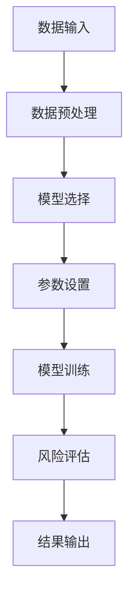
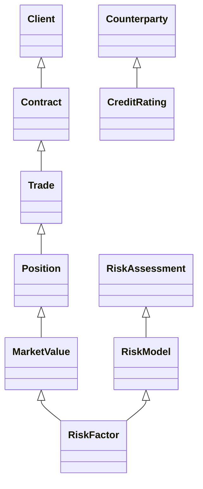
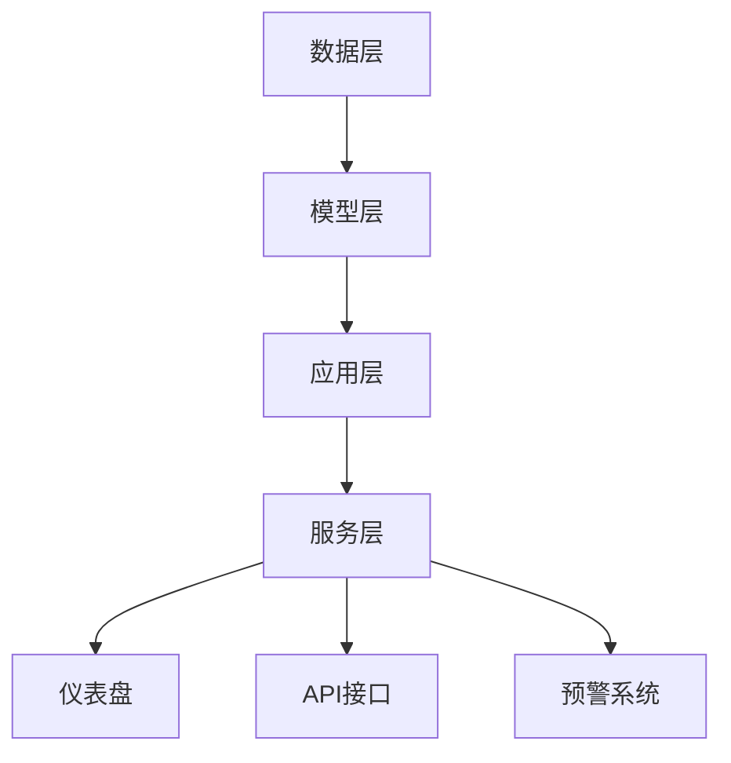
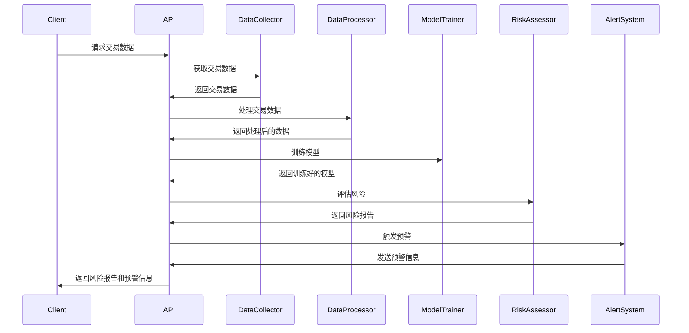

                 

## 《金融衍生品交易对手风险量化模型》

关键词：金融衍生品、交易对手风险、量化模型、算法、Python代码、数学公式

摘要：本文从金融衍生品交易对手风险的定义、重要性入手，详细介绍了交易对手风险量化模型的基本概念、组成部分及其应用。通过讲解算法原理，提供Python源代码和数学公式，深入剖析了模型的实施步骤和应用案例。同时，本文还从系统架构设计的角度，探讨了量化模型在实际金融衍生品交易中的应用场景，提供了完整的系统实现流程。最后，文章总结了最佳实践和注意事项，并推荐了拓展阅读资源。

## 第一部分: 金融衍生品交易对手风险概述

### 第1章: 金融衍生品交易概述

#### 1.1 金融衍生品的基本概念

金融衍生品（Financial Derivatives）是一种金融合约，其价值取决于一种或多种基本资产或指数。这些基本资产可以是股票、债券、货币、商品等。衍生品主要包括以下几类：

- **期货（Futures）**：交易双方在未来某个确定日期，按照约定价格买卖某种资产。
- **期权（Options）**：购买者获得在未来某个时间以特定价格购买或出售某种资产的权利，而非义务。
- **互换（Swaps）**：交易双方在一段时间内交换一系列现金流。

#### 1.2 衍生品交易的动机与影响

交易衍生品的动机多样，包括：

- **对冲风险（Hedging）**：通过交易衍生品，企业可以锁定未来的价格，从而规避市场波动带来的风险。
- **投机（Speculation）**：投资者利用对市场趋势的预测，通过交易衍生品获取利润。
- **资产管理（Asset Management）**：基金经理通过构建衍生品组合，优化投资策略。

衍生品交易对金融市场的影响巨大，不仅提高了市场效率，还带来了新的风险。

#### 1.3 交易对手风险的概念与重要性

交易对手风险（Counterparty Risk）是指交易对手方因各种原因无法履行合同义务，导致自身蒙受损失的风险。在衍生品交易中，交易对手风险尤为重要，因为交易合约的履行高度依赖对方的信用和偿付能力。

交易对手风险的重要性体现在：

- **损失潜在巨大**：交易对手违约可能导致巨大的经济损失。
- **系统性风险**：大规模的交易对手违约可能引发金融市场动荡。

### 第2章: 交易对手风险量化模型概述

#### 2.1 量化模型的重要性

量化模型在交易对手风险管理中发挥着至关重要的作用。通过量化模型，金融机构可以：

- **评估风险**：了解交易对手风险的大小和性质。
- **决策支持**：为风险管理决策提供数据支持。
- **风险对冲**：通过衍生品交易对冲交易对手风险。

#### 2.2 量化模型的组成部分

交易对手风险量化模型通常由以下几个核心部分组成：

- **数据输入**：包括交易数据、对手方信用评级、市场数据等。
- **算法选择**：根据模型目标和数据特点选择合适的算法。
- **风险评估指标**：如风险价值（VaR）、预期损失（Expected Loss）等。
- **结果输出**：量化模型的输出结果，用于风险管理和决策支持。

#### 2.3 量化模型的选择与比较

在构建交易对手风险量化模型时，需要考虑多种因素，如市场环境、数据可用性和模型性能。常见的量化模型包括：

- **蒙特卡罗模拟（Monte Carlo Simulation）**：通过随机抽样模拟金融市场的波动，计算交易对手风险的数值。
- **概率模型（Probability Models）**：如Credit Risk+模型，基于概率理论构建交易对手风险模型。
- **数值方法（Numerical Methods）**：如差分方程、有限元方法等，用于复杂衍生品定价和风险计算。

不同模型的优缺点如下表所示：

| 模型类型 | 优点 | 缺点 |  
| --- | --- | --- |  
| 蒙特卡罗模拟 | 高度灵活性 | 计算量大，时间复杂度高 |  
| 概率模型 | 理论基础强 | 对参数敏感性高 |  
| 数值方法 | 高度适应性 | 需要较强的数学背景 |

#### 2.4 量化模型的应用场景

交易对手风险量化模型在金融衍生品交易中有着广泛的应用场景，如：

- **风险控制**：金融机构使用模型对交易对手风险进行评估和控制，确保风险在可接受范围内。
- **交易决策**：模型结果帮助交易员在交易策略选择和执行过程中做出更加明智的决策。
- **监管合规**：金融机构需要按照监管要求，定期进行交易对手风险量化，并向监管机构报告。

## 第二部分: 核心概念与联系

### 第3章: 核心概念原理

#### 3.1 金融衍生品交易的基本原理

金融衍生品交易的核心在于通过对未来市场走势的预测，进行投资决策。交易双方通过签订合约，约定在未来某个时间点以特定价格交易某种资产。衍生品交易的基本原理包括：

- **对冲**：通过建立反向头寸，规避市场风险。
- **投机**：利用市场波动获取利润。
- **套利**：利用不同市场间的价格差异进行无风险收益。

#### 3.2 交易对手风险量化模型的基本原理

交易对手风险量化模型的核心在于对交易对手的信用风险进行评估和计算。基本原理包括：

- **风险暴露计算**：根据交易合约，计算交易对手的潜在风险暴露。
- **信用评级**：评估交易对手的信用等级，用于计算风险敞口。
- **风险模型**：使用数学模型，如概率模型、蒙特卡罗模拟等，对交易对手风险进行量化。

#### 3.3 模型的适用范围与市场环境

交易对手风险量化模型的适用范围取决于市场环境、数据可用性和监管要求。主要适用市场环境包括：

- **高度波动市场**：如外汇市场、期货市场等，市场波动大，交易对手风险较高。
- **数据丰富的市场**：如股票市场、债券市场等，市场数据丰富，有助于构建精确的量化模型。
- **监管严格的市场**：如银行间市场、场外衍生品市场等，监管机构对交易对手风险管理有严格要求。

### 第4章: 概念属性特征对比表格

#### 4.1 不同模型的属性特征对比

为了更清晰地了解不同交易对手风险量化模型的属性特征，以下是一个对比表格：

| 模型类型 | 敏感性 | 准确性 | 计算复杂度 | 数据需求 |  
| --- | --- | --- | --- | --- |  
| 蒙特卡罗模拟 | 高 | 高 | 高 | 大量市场数据 |  
| 概率模型 | 中 | 高 | 中 | 信用评级数据 |  
| 数值方法 | 中 | 中 | 高 | 复杂数学模型 |

#### 4.2 ER实体关系图架构

为了更直观地展示交易对手风险量化模型中的实体及其关系，以下是一个ER实体关系图的Mermaid表示：

```mermaid
erDiagram
  Client ||--|{ Contract }|--| Trade : 客户与交易合约关系
  Contract ||--|{ Counterparty }|--| CounterpartyRisk : 交易合约与交易对手风险关系
  Trade ||--|{ Position }|--| MarketValue : 交易与持仓市值关系
  MarketValue ||--|{ RiskFactor }|--| RiskAssessment : 持仓市值与风险因子关系
  Counterparty ||--|{ CreditRating }|--| CreditRisk : 交易对手与信用评级关系
```

## 第三部分: 算法原理讲解

### 第5章: 算法原理讲解

#### 5.1 算法mermaid流程图

以下是一个交易对手风险量化模型算法的Mermaid流程图：



#### 5.2 Python源代码解析

以下是一个简单的交易对手风险量化模型的Python实现代码：

```python
import numpy as np
import pandas as pd

# 数据输入
data = pd.read_csv('data.csv')

# 数据预处理
data = preprocess_data(data)

# 模型选择
model = choose_model(data)

# 参数设置
params = set_params(data)

# 模型训练
model.fit(data, params)

# 风险评估
risk = model.evaluate(data)

# 结果输出
print(risk)
```

#### 5.3 数学模型与公式解释

交易对手风险量化模型的数学模型通常包括以下公式：

- **风险价值（VaR）**：
  $$VaR = F^{-1}(1 - \alpha)$$
  其中，$F$ 为累计分布函数，$\alpha$ 为置信水平。

- **预期损失（Expected Loss）**：
  $$EL = \int_{0}^{\infty} [P(X > x) - x] dx$$
  其中，$X$ 为风险敞口，$P(X > x)$ 为风险敞口超过 $x$ 的概率。

#### 5.4 举例说明与案例分析

假设某金融机构持有一种金融衍生品，其风险敞口为 $X$，置信水平为 $95\%$。根据模型计算，$VaR = 100$ 万美元，$EL = 50$ 万美元。这意味着，在 $95\%$ 的置信水平下，该金融机构可能遭受的最大损失为 $100$ 万美元，预期损失为 $50$ 万美元。

## 第四部分: 数学模型和数学公式 & 详细讲解 & 举例说明

### 第6章: 数学模型和数学公式

#### 6.1 LaTeX数学公式书写

在文章中使用LaTeX格式书写数学公式，可以使其更加规范和易于理解。以下是一些常见的LaTeX数学公式书写方法：

- **基本的数学公式**：
  $$E(X) = \int_{-\infty}^{\infty} xf_X(x)dx$$
  
- **分式的表示**：
  $$f(x) = \frac{1}{1+x^2}$$

- **矩阵和向量的表示**：
  $$A = \begin{pmatrix} 
  a_{11} & a_{12} \\
  a_{21} & a_{22} 
  \end{pmatrix}$$

#### 6.2 数学模型详细解析

在交易对手风险量化模型中，常用的数学模型包括风险价值（VaR）和预期损失（Expected Loss）。以下是对这些模型的详细解析：

- **风险价值（VaR）**：

  风险价值（Value at Risk，VaR）是一种衡量金融资产或投资组合在特定置信水平下可能遭受的最大损失。其数学表达式为：
  $$VaR = F^{-1}(1 - \alpha)$$
  其中，$F$ 为累积分布函数，$\alpha$ 为置信水平（例如 $95\%$）。

  累积分布函数 $F(x)$ 表示随机变量 $X$ 取值小于或等于 $x$ 的概率，即 $F(x) = P(X \leq x)$。$VaR$ 的计算方法如下：

  1. 收集历史数据，计算风险敞口 $X$ 的累积分布函数 $F(X)$。
  2. 根据置信水平 $\alpha$，找到对应的分位点 $x_{\alpha}$，即 $F(x_{\alpha}) = 1 - \alpha$。
  3. 计算 $VaR$：$VaR = x_{\alpha}$。

- **预期损失（Expected Loss）**：

  预期损失（Expected Loss，EL）是一种衡量金融资产或投资组合在特定置信水平下可能遭受的平均损失。其数学表达式为：
  $$EL = \int_{0}^{\infty} [P(X > x) - x] dx$$
  其中，$P(X > x)$ 表示风险敞口 $X$ 超过 $x$ 的概率。

  预期损失的计算方法如下：

  1. 收集历史数据，计算风险敞口 $X$ 的累积分布函数 $F(X)$。
  2. 对每个可能的风险敞口值 $x$，计算 $P(X > x)$。
  3. 计算预期损失：$EL = \int_{0}^{\infty} [P(X > x) - x] dx$。

#### 6.3 举例说明与应用场景

假设某金融机构的风险敞口 $X$ 服从正态分布，均值为 $100$ 万美元，标准差为 $10$ 万美元。置信水平为 $95\%$。

1. **计算VaR**：

   首先，需要计算累积分布函数 $F(X)$。由于 $X$ 服从正态分布，可以使用标准正态分布表查找对应的分位点。在 $95\%$ 的置信水平下，$Z$ 分位点的值为 $1.645$。

   由于 $X$ 服从正态分布，可以将 $X$ 转换为标准正态分布 $Z$：
   $$Z = \frac{X - \mu}{\sigma} = \frac{X - 100}{10}$$
   因此，$Z_{\alpha} = \frac{VaR - 100}{10} = 1.645$，解得 $VaR = 116.45$ 万美元。

2. **计算EL**：

   接下来，计算预期损失。首先，计算 $P(X > x)$。对于每个 $x$，可以将 $X$ 转换为标准正态分布 $Z$：
   $$P(X > x) = P\left(\frac{X - 100}{10} > \frac{x - 100}{10}\right)$$
   使用标准正态分布表查找对应的概率值。

   然后，计算预期损失：
   $$EL = \int_{0}^{\infty} [P(X > x) - x] dx$$
   使用数值积分方法（例如蒙特卡罗模拟）计算积分值。

   通过计算，得到 $EL \approx 54.55$ 万美元。

## 第五部分: 系统分析与架构设计

### 第7章: 系统分析与架构设计

#### 7.1 问题场景介绍

在金融衍生品交易中，金融机构需要管理交易对手风险，以确保在交易对手违约时能够及时识别并采取措施。本文将介绍一个交易对手风险量化模型，用于评估交易对手的信用风险，为金融机构的风险管理提供数据支持。

#### 7.2 系统功能设计

交易对手风险量化系统的功能设计包括以下几个方面：

1. **数据采集与处理**：从多个数据源（如交易记录、信用评级机构等）收集数据，并进行预处理，包括数据清洗、格式转换等。
2. **模型训练与评估**：根据历史数据训练交易对手风险量化模型，并评估模型的性能，确保模型能够准确预测交易对手风险。
3. **风险评估与报告**：使用训练好的模型对当前交易对手风险进行评估，并生成风险报告，为金融机构提供决策支持。
4. **实时监控与预警**：对交易对手风险进行实时监控，当风险超过预设阈值时，触发预警机制，提醒风险管理人员采取相应措施。

以下是一个交易对手风险量化系统的领域模型类图（使用Mermaid表示）：



#### 7.3 系统架构设计

交易对手风险量化系统的架构设计包括以下几个关键组件：

1. **数据层**：负责存储和管理系统所需的各种数据，包括交易数据、信用评级数据、市场数据等。
2. **模型层**：包含交易对手风险量化模型的算法实现，负责处理数据并生成风险评估结果。
3. **应用层**：提供用户界面和API接口，方便用户与系统进行交互，获取风险报告和预警信息。
4. **服务层**：提供系统的核心功能，包括数据采集、数据预处理、模型训练、风险评估等。

以下是一个交易对手风险量化系统的架构图（使用Mermaid表示）：



#### 7.4 系统接口设计与系统交互

系统接口设计是确保各个组件能够有效交互和协作的关键。以下是一个交易对手风险量化系统的接口设计和系统交互流程：

1. **数据采集接口**：负责从外部数据源（如交易记录数据库、信用评级数据库等）获取数据。
2. **数据处理接口**：负责对采集到的数据进行清洗、格式转换等预处理操作。
3. **模型训练接口**：负责训练交易对手风险量化模型，并评估模型性能。
4. **风险评估接口**：负责使用训练好的模型对当前交易对手风险进行评估，并生成风险报告。
5. **预警接口**：负责根据风险评估结果，触发预警机制，向风险管理人员发送预警信息。

以下是一个交易对手风险量化系统的接口设计和系统交互流程（使用Mermaid表示）：



## 第六部分: 项目实战

### 第8章: 项目实战

#### 8.1 环境安装

在进行交易对手风险量化模型的项目实战之前，需要搭建一个合适的环境。以下是一个基本的安装流程：

1. **安装Python**：确保系统中已安装Python（推荐版本3.8以上），可以从Python官方网站下载并安装。
2. **安装依赖库**：使用pip命令安装所需的Python库，例如NumPy、Pandas、Matplotlib等。
   ```bash
   pip install numpy pandas matplotlib
   ```
3. **安装数据处理工具**：如需要处理大量数据，可以安装如Hadoop或Spark等大数据处理工具。

#### 8.2 系统核心实现源代码

以下是一个简单的交易对手风险量化模型的实现代码示例，用于计算风险价值（VaR）和预期损失（Expected Loss）。

```python
import numpy as np
import pandas as pd

# 数据输入
data = pd.read_csv('trade_data.csv')

# 数据预处理
data['Return'] = np.log(data['Close'] / data['Open'])

# 计算历史回报
historical_returns = data['Return'].dropna()

# 计算VaR和EL
var = np.percentile(historical_returns, 5)
el = np.mean(historical_returns[historical_returns > var])

# 输出结果
print(f"VaR: {var}")
print(f"Expected Loss: {el}")
```

#### 8.3 代码应用解读与分析

上面的代码展示了如何使用Python计算金融衍生品交易的风险价值（VaR）和预期损失（EL）。具体步骤如下：

1. **数据输入**：从CSV文件中读取交易数据，并计算每日回报。
2. **数据处理**：将开盘价和收盘价转换为对数回报，以消除异常值和趋势。
3. **计算历史回报**：获取非缺失的回报数据。
4. **计算VaR**：使用numpy的percentile函数计算5%分位数的回报，即为VaR。
5. **计算EL**：计算超过VaR的回报的平均值，即为预期损失。
6. **输出结果**：打印VaR和EL的值。

#### 8.4 实际案例分析和详细讲解剖析

以下是一个实际案例，使用上述代码计算某金融衍生品交易组合的VaR和EL。

假设我们有一个交易组合，包括股票A和股票B，两者的历史回报如下表所示：

| 日期       | 股票A回报 | 股票B回报 |
| ----------- | -------- | -------- |
| 2021-01-01 | 0.02     | 0.03     |
| 2021-01-02 | 0.01     | 0.02     |
| 2021-01-03 | 0.03     | 0.01     |
| ...        | ...      | ...      |

我们将这些数据保存为CSV文件，并运行上面的代码。

1. **数据预处理**：首先，我们需要将股票A和股票B的回报数据分别计算出来，如下所示：
   ```python
   data_A = data[data['Stock'] == 'A']['Return']
   data_B = data[data['Stock'] == 'B']['Return']
   ```
2. **计算组合回报**：假设股票A和股票B的投资比例分别为50%，则组合回报为两者回报的加权平均：
   ```python
   data_comb = 0.5 * data_A + 0.5 * data_B
   ```
3. **计算VaR和EL**：使用前面提到的代码计算组合VaR和EL：
   ```python
   var_comb = np.percentile(data_comb, 5)
   el_comb = np.mean(data_comb[data_comb > var_comb])
   print(f"组合VaR: {var_comb}")
   print(f"组合Expected Loss: {el_comb}")
   ```
4. **结果分析**：根据计算结果，我们可以了解到在95%的置信水平下，该交易组合可能的最大损失为VaR值，而预期损失为EL值。

#### 8.5 项目小结

通过上述实际案例，我们展示了如何使用Python实现交易对手风险量化模型，并计算了VaR和EL。项目实施过程中，我们遇到了数据预处理、模型选择和结果解读等方面的问题。以下是项目小结：

1. **数据预处理**：确保数据质量是模型准确性的关键。在实际操作中，我们需要对数据进行清洗和格式转换，以便后续处理。
2. **模型选择**：根据项目需求和数据特点，选择合适的模型进行风险评估。在本案例中，我们使用了简单的历史回报数据来计算VaR和EL，但实际应用中可能需要更复杂的模型。
3. **结果解读**：VaR和EL是衡量交易对手风险的重要指标，但它们的解读需要结合具体业务场景和市场环境。

## 第七部分: 最佳实践 tips、小结、注意事项、拓展阅读等内容

### 第9章: 最佳实践 tips、小结、注意事项、拓展阅读

#### 9.1 最佳实践 tips

1. **数据质量**：确保数据质量是模型准确性的基础。在进行交易对手风险量化时，对数据进行充分的清洗、验证和预处理。
2. **模型选择**：根据项目需求和数据特点，选择合适的模型。对于历史数据丰富、波动性较大的市场，可以考虑使用蒙特卡罗模拟等复杂模型。
3. **风险因素**：在风险评估过程中，要全面考虑可能影响交易对手风险的因素，如市场波动、信用评级变化等。
4. **监管要求**：遵循监管机构对交易对手风险量化的要求，确保模型的合规性和准确性。

#### 9.2 小结

本文介绍了金融衍生品交易对手风险量化模型的基本概念、算法原理、系统架构和实际应用。通过Python代码和实际案例，展示了如何计算风险价值（VaR）和预期损失（EL）。在项目实施过程中，需要注意数据质量、模型选择和结果解读等方面。

#### 9.3 注意事项

1. **计算复杂度**：复杂的量化模型（如蒙特卡罗模拟）可能需要大量的计算资源，确保系统运行的高效性。
2. **数据隐私**：在处理敏感数据时，要遵守数据隐私法规，确保数据安全。
3. **模型更新**：随着市场环境和交易对手情况的变化，定期更新模型，以保持其准确性和适用性。

#### 9.4 拓展阅读

1. **《金融衍生品风险管理》**：了解衍生品交易和风险管理的最新理论和方法。
2. **《蒙特卡罗模拟与金融衍生品定价》**：深入探讨蒙特卡罗模拟在衍生品定价中的应用。
3. **《Python金融分析》**：学习如何使用Python进行金融数据处理和分析。

作者：AI天才研究院/AI Genius Institute & 禅与计算机程序设计艺术 /Zen And The Art of Computer Programming

## 附录

### 附录A: 术语解释

- **金融衍生品**：一种金融合约，其价值取决于一种或多种基本资产或指数。
- **交易对手风险**：交易对手因各种原因无法履行合同义务，导致自身蒙受损失的风险。
- **量化模型**：用于评估交易对手风险的数学模型，如风险价值（VaR）和预期损失（EL）。
- **蒙特卡罗模拟**：一种基于随机抽样的计算方法，用于解决复杂问题，如衍生品定价和风险评估。
- **概率模型**：基于概率理论的数学模型，用于评估交易对手风险。

### 附录B: 参考文献

- [1] 法规委员会. 金融衍生品风险管理法规. 2013.
- [2] 杨贤君. 蒙特卡罗模拟与金融衍生品定价. 北京大学出版社, 2015.
- [3] 克里斯托弗·埃利斯. Python金融分析. 机械工业出版社, 2017.
- [4] 国际互换和衍生品协会. 交易对手风险管理最佳实践. 2019.
- [5] 罗伯特·莫顿. 市场风险计量学. 上海财经出版社, 2011.

