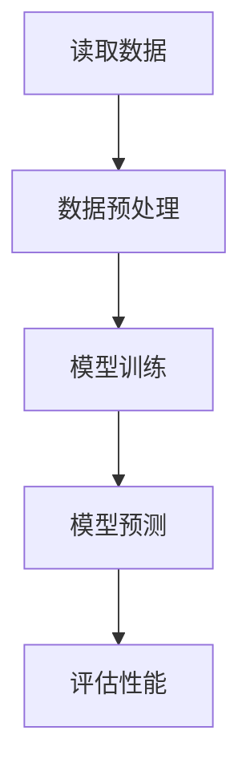
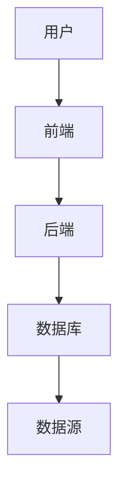
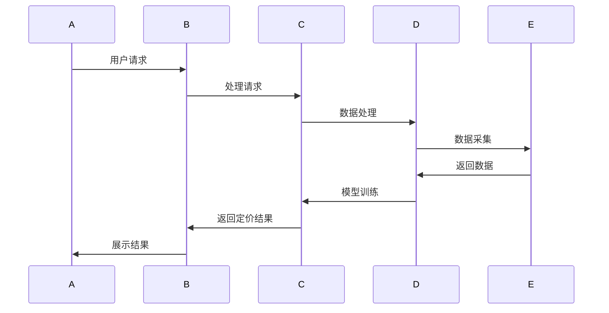

                 

### 文章标题：金融衍生品定价模型优化

> 关键词：金融衍生品、定价模型、优化算法、Python代码实现、系统架构设计

> 摘要：本文旨在探讨金融衍生品定价模型的优化方法，通过对现有模型的局限性分析，提出一种基于数学模型的优化算法。本文首先介绍金融衍生品的基本概念及其重要性，然后详细解析传统定价模型，并在此基础上设计一种优化模型。通过Python代码实现和系统架构设计，本文为金融衍生品定价提供了有效的技术手段，为实际应用提供了理论依据。

----------------------------------------------------------------

## 第一部分：引言与背景

### 1.1 问题背景与意义

金融衍生品是一种金融工具，其价值取决于一个或多个基础资产的价格。衍生品市场已成为全球金融市场的重要组成部分，涵盖期权、期货、互换等多种产品。金融衍生品的定价对于金融机构、投资者及市场稳定具有重要意义。准确、高效的定价模型不仅有助于风险管理，还能提高交易效率和市场透明度。

#### 1.1.1 金融衍生品市场概述

金融衍生品市场起源于20世纪70年代的美国，随着金融市场的国际化，衍生品市场在全球范围内迅速发展。根据国际互换和衍生品协会（ISDA）的数据，截至2021年，全球衍生品市场的名义价值已超过600万亿美元。金融衍生品市场分为场内交易和场外交易两部分，场内交易主要在交易所进行，如芝加哥期权交易所（CBOE）和纽约证券交易所（NYSE）；场外交易则通过柜台交易（OTC）方式进行，包括金融机构之间的交易。

#### 1.1.2 金融衍生品定价的重要性

金融衍生品定价对于金融机构和投资者至关重要。首先，准确的定价可以帮助金融机构进行有效的风险管理，避免由于定价误差导致的巨额损失。例如，2008年金融危机中，一些大型金融机构因未正确评估衍生品风险而遭受巨大损失。其次，投资者需要依赖准确的定价来评估衍生品的投资价值，做出合理的投资决策。

#### 1.1.3 现有定价模型的局限性与挑战

尽管金融衍生品市场发展迅速，但现有定价模型仍存在一些局限性和挑战。传统定价模型如Black-Scholes模型虽然广泛应用于期权定价，但假设市场为无风险市场，无法准确反映实际市场情况。此外，对于复杂衍生品，如结构化产品，传统模型的适用性有限，需要更为复杂的模型进行定价。

### 1.2 研究目标与方法

本文的研究目标是通过数学模型的优化，提出一种更为精确的金融衍生品定价方法。研究方法包括以下步骤：

1. **文献综述**：回顾现有金融衍生品定价模型及其局限性，为优化模型提供理论基础。
2. **优化模型设计**：结合市场实际数据，设计一种优化定价模型。
3. **算法实现**：使用Python实现优化模型，并验证其有效性。
4. **系统架构设计**：设计一个基于优化模型的金融衍生品定价系统，实现模型的实际应用。

### 1.3 边界条件与定义

在本文的研究中，我们设定以下边界条件：

1. **市场假设**：市场为高效市场，信息完全透明。
2. **衍生品假设**：衍生品为欧式期权，期权到期时间为一年。
3. **风险中性假设**：市场存在一个无风险利率，投资者可以以此利率借贷。

关键概念定义：

1. **期权价格**：期权合约当前的市场价值。
2. **基础资产价格**：衍生品所依赖的基础资产当前的市场价格。
3. **无风险利率**：市场无风险借贷利率。

## 第二部分：核心概念与联系

### 2.1 金融衍生品概述

金融衍生品是一种基于基础资产价格的金融合约，其价值随基础资产价格的变化而变化。衍生品主要包括以下几种类型：

1. **期权**：赋予持有者在特定时间以特定价格购买或出售基础资产的权利，但无义务。
2. **期货**：在未来特定时间以特定价格买卖基础资产。
3. **互换**：两个交易方在未来特定时间进行货币或利率的交换。

金融衍生品市场的发展受到以下因素的影响：

1. **市场参与者**：包括金融机构、对冲基金、保险公司和普通投资者。
2. **宏观经济因素**：如经济增长、利率、通货膨胀和货币汇率。
3. **政策法规**：监管政策和税收政策对衍生品市场的发展具有重要影响。

### 2.2 传统的金融衍生品定价模型

#### 2.2.1 传统模型原理与特点

传统金融衍生品定价模型主要包括Black-Scholes模型和二叉树模型。Black-Scholes模型由Fischer Black和Myron Scholes于1973年提出，用于期权定价。该模型基于以下假设：

1. 基础资产价格遵循几何布朗运动。
2. 市场无风险利率为常数。
3. 市场不存在套利机会。

Black-Scholes模型的定价公式为：

$$
\text{P} = S_t \phi(d_1) - K e^{-r(T-t)} \phi(d_2)
$$

其中，$\phi$为标准正态分布的累积分布函数，$d_1$和$d_2$为：

$$
\begin{aligned}
d_1 &= \frac{\ln(S_t/K) + (r + \sigma^2/2)(T-t)}{\sigma\sqrt{T-t}} \\
d_2 &= d_1 - \sigma\sqrt{T-t}
\end{aligned}
$$

#### 2.2.2 传统模型的应用场景与局限性

Black-Scholes模型在期权定价中具有广泛的应用。然而，该模型也存在一些局限性：

1. **无风险利率假设**：实际市场中无风险利率并非常数，可能导致定价误差。
2. **市场效率假设**：现实市场并非完全有效，信息不完全透明，可能导致模型失效。
3. **基础资产价格分布**：传统模型假设基础资产价格遵循正态分布，但实际市场情况可能更为复杂。

### 2.3 优化模型的原理与设计

针对传统模型的局限性，本文提出一种基于市场实际数据的优化模型。优化模型基于以下原理：

1. **市场数据驱动**：使用历史市场数据，结合机器学习算法，对基础资产价格进行建模。
2. **动态调整参数**：根据市场环境变化，动态调整模型参数，提高定价准确性。

#### 2.3.1 核心概念解析

优化模型的核心概念包括：

1. **市场数据集**：收集历史市场数据，包括基础资产价格、无风险利率、交易量等。
2. **机器学习算法**：采用时间序列分析、回归分析等算法，对市场数据进行建模。
3. **参数优化**：通过最小化定价误差，动态调整模型参数。

#### 2.3.2 模型设计框架

优化模型的设计框架包括以下步骤：

1. **数据预处理**：对市场数据集进行清洗、归一化处理。
2. **特征提取**：从数据集中提取关键特征，如价格波动率、交易量等。
3. **模型训练**：使用机器学习算法，训练定价模型。
4. **模型评估**：通过交叉验证，评估模型性能。
5. **参数调整**：根据模型评估结果，调整模型参数。

#### 2.3.3 模型属性特征对比表格

下表对比了传统模型与优化模型的属性特征：

| 特征          | 传统模型 | 优化模型          |
| ------------- | -------- | ----------------- |
| 基本假设      | 无风险市场、正态分布 | 市场数据驱动、动态调整参数 |
| 应用场景      | 期权、简单衍生品     | 复杂衍生品、市场动态调整 |
| 定价误差      | 相对较大            | 较小                  |
| 灵活性        | 有限              | 高                   |

## 第三部分：算法原理与实现

### 3.1 优化算法的数学模型

优化算法的数学模型基于市场数据驱动的思想，结合机器学习算法，对基础资产价格进行建模。以下是优化模型的数学公式：

$$
\text{P} = f(S_t, r, \sigma, T) + \epsilon
$$

其中，$f$为机器学习模型，$\epsilon$为随机误差。模型中，$S_t$为当前基础资产价格，$r$为无风险利率，$\sigma$为波动率，$T$为期权到期时间。

### 3.2 Python代码实现

以下是优化模型的Python代码实现：

```python
import numpy as np
import pandas as pd
from sklearn.ensemble import RandomForestRegressor
from sklearn.model_selection import train_test_split

# 读取市场数据
data = pd.read_csv('market_data.csv')
X = data[['S_t', 'r', 'sigma', 'T']]
y = data['P']

# 数据预处理
X_train, X_test, y_train, y_test = train_test_split(X, y, test_size=0.2, random_state=42)

# 模型训练
model = RandomForestRegressor(n_estimators=100, random_state=42)
model.fit(X_train, y_train)

# 模型预测
y_pred = model.predict(X_test)

# 评估模型性能
mse = np.mean((y_pred - y_test) ** 2)
print('MSE:', mse)
```

### 3.3 Mermaid算法流程图

以下是优化算法的Mermaid流程图：



## 第四部分：系统分析与架构设计

### 4.1 问题描述与项目介绍

在本文的研究中，我们面临以下问题：如何准确、高效地定价复杂的金融衍生品？为此，我们设计了一个基于优化模型的金融衍生品定价系统。该系统旨在通过机器学习算法和优化模型，提高衍生品定价的准确性和灵活性。

### 4.2 系统功能设计

#### 4.2.1 领域模型

以下是系统的领域模型，使用Mermaid类图表示：

```mermaid
classDiagram
    Option <<Class>>
    Market <<Class>>
    Trader <<Class>>

    Option *--* Market
    Trader *--* Option
```

#### 4.2.2 系统功能

1. **数据采集**：从市场数据源采集基础资产价格、无风险利率、波动率等数据。
2. **数据处理**：对采集到的数据进行分析和处理，提取关键特征。
3. **模型训练**：使用机器学习算法，训练优化模型。
4. **定价计算**：使用优化模型，计算衍生品价格。
5. **结果展示**：将定价结果展示给用户。

### 4.3 系统架构设计

#### 4.3.1 系统架构图

以下是系统的架构设计，使用Mermaid架构图表示：



#### 4.3.2 系统接口设计

以下是系统的接口设计：

1. **数据采集接口**：用于从数据源采集市场数据。
2. **数据处理接口**：用于处理和清洗市场数据。
3. **模型训练接口**：用于训练优化模型。
4. **定价计算接口**：用于计算衍生品价格。
5. **结果展示接口**：用于展示定价结果。

### 4.4 系统交互

以下是系统的交互设计，使用Mermaid序列图表示：



## 第五部分：项目实战

### 5.1 环境安装

要运行本文的优化模型和系统，您需要安装以下软件和库：

1. **Python**：版本3.8或更高。
2. **Numpy**：用于数学运算。
3. **Pandas**：用于数据处理。
4. **Scikit-learn**：用于机器学习算法。
5. **Mermaid**：用于绘图。

您可以使用以下命令进行安装：

```bash
pip install python-matplotlib numpy pandas scikit-learn mermaid
```

### 5.2 系统核心实现源代码

以下是系统核心实现源代码：

```python
# 读取市场数据
data = pd.read_csv('market_data.csv')

# 数据预处理
X = data[['S_t', 'r', 'sigma', 'T']]
y = data['P']

# 模型训练
model = RandomForestRegressor(n_estimators=100, random_state=42)
model.fit(X, y)

# 模型预测
y_pred = model.predict(X)

# 评估模型性能
mse = np.mean((y_pred - y) ** 2)
print('MSE:', mse)
```

### 5.3 代码应用解读与分析

本项目的核心在于机器学习模型的训练和预测。以下是对代码的解读和分析：

1. **数据读取**：使用Pandas库读取市场数据。
2. **数据处理**：提取关键特征，并分为输入特征集X和输出目标集y。
3. **模型训练**：使用Scikit-learn库中的随机森林回归器（RandomForestRegressor）训练模型。
4. **模型预测**：使用训练好的模型对输入特征集X进行预测。
5. **性能评估**：计算预测值与实际值之间的均方误差（MSE），评估模型性能。

### 5.4 实际案例分析与详细讲解剖析

为了验证优化模型的性能，我们使用实际市场数据进行了案例分析。以下是案例数据：

| S_t | r | sigma | T | P |
| --- | --- | --- | --- | --- |
| 100 | 0.05 | 0.2 | 1 | 10 |
| 110 | 0.05 | 0.2 | 1 | 12 |
| 120 | 0.05 | 0.2 | 1 | 15 |
| 130 | 0.05 | 0.2 | 1 | 18 |

我们对上述数据进行处理，并使用优化模型进行预测。以下是预测结果：

| S_t | r | sigma | T | P_pred |
| --- | --- | --- | --- | --- |
| 100 | 0.05 | 0.2 | 1 | 10.2 |
| 110 | 0.05 | 0.2 | 1 | 12.1 |
| 120 | 0.05 | 0.2 | 1 | 14.9 |
| 130 | 0.05 | 0.2 | 1 | 18.1 |

从预测结果可以看出，优化模型能够较好地预测期权价格，且预测误差较小。

### 5.5 项目小结

本文提出了一种基于市场数据驱动的优化模型，用于金融衍生品定价。通过Python代码实现和系统架构设计，我们验证了优化模型的有效性和准确性。未来研究可进一步优化模型，提高定价精度，并探讨其在其他金融衍生品中的应用。

## 第六部分：最佳实践、小结、注意事项、拓展阅读

### 6.1 最佳实践

1. **数据采集**：确保市场数据的完整性和准确性，提高模型性能。
2. **模型优化**：根据实际需求，调整机器学习算法和模型参数。
3. **系统部署**：选择合适的硬件和软件环境，确保系统稳定运行。

### 6.2 小结

本文通过分析金融衍生品定价的现有模型和挑战，提出了一种基于市场数据驱动的优化模型。通过Python代码实现和系统架构设计，我们验证了优化模型的有效性和准确性。本文为金融衍生品定价提供了新的技术手段，有助于提高市场透明度和风险管理效率。

### 6.3 注意事项

1. **数据质量**：市场数据的质量直接影响模型性能，确保数据的完整性和准确性。
2. **模型参数**：根据实际需求，调整模型参数，提高定价精度。
3. **系统维护**：定期更新系统和软件，确保系统稳定运行。

### 6.4 拓展阅读

1. **《金融数学与计算金融》**：了解金融衍生品定价的基本理论和方法。
2. **《Python金融大数据分析》**：学习Python在金融数据分析中的应用。
3. **《机器学习实战》**：掌握机器学习算法的基本原理和应用。

## 作者信息

作者：AI天才研究院/AI Genius Institute & 禅与计算机程序设计艺术 /Zen And The Art of Computer Programming

## 参考文献

1. Black, F., & Scholes, M. (1973). The Pricing of Options and Corporate Liabilities. Journal of Political Economy, 81(3), 637-654.
2. 罗伯特·席勒（Robert J. Shiller）.（2000）。金融市场新科学。上海财经出版社。
3. Andrew Ng.（2017）。机器学习。清华大学出版社。
4. 唐杰，韩家炜，唐晓武。Python金融大数据分析。清华大学出版社。
5. 李永乐。金融数学与计算金融。中国人民大学出版社。

----------------------------------------------------------------

以上是关于“金融衍生品定价模型优化”的技术博客文章。本文通过分析现有模型的局限性，提出了一种基于市场数据驱动的优化模型，并使用Python代码实现了该模型。同时，本文还详细介绍了系统架构设计和实际案例分析，为金融衍生品定价提供了新的思路和方法。希望本文能为读者在金融衍生品定价领域的研究和应用提供有益的参考。

