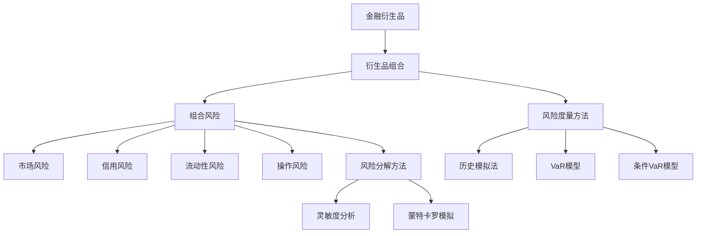
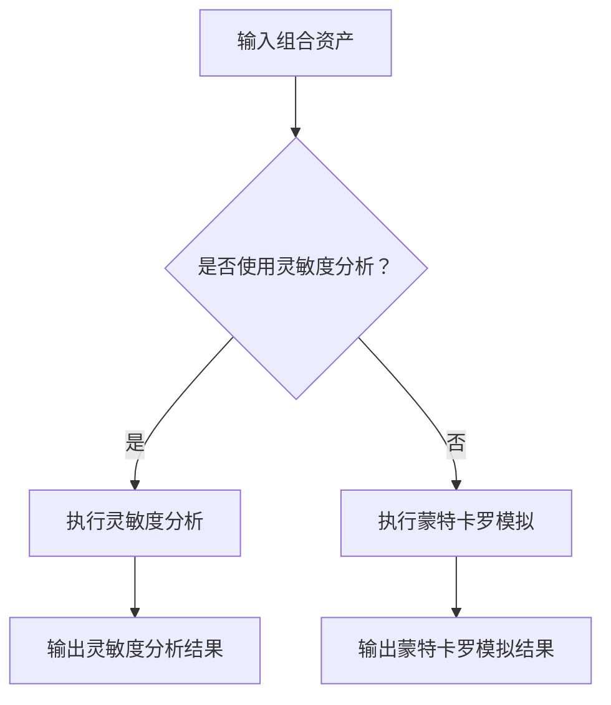
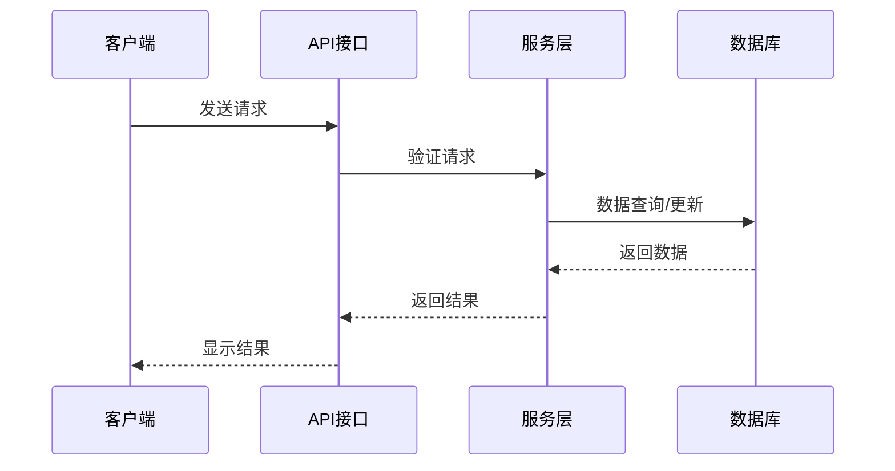
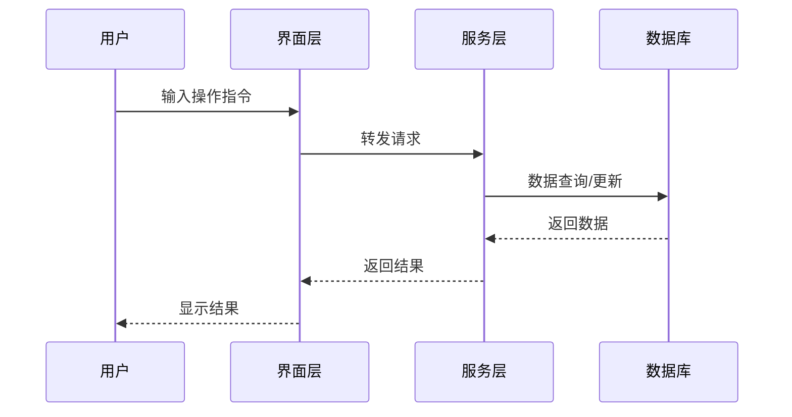

                 

## 金融衍生品组合风险分解概述

### 第1章：金融衍生品组合风险背景与重要性

金融衍生品作为一种重要的金融工具，广泛应用于金融市场中对风险的管理和转移。然而，衍生品市场本身具有较高的复杂性，加上衍生品组合的多样化，使得衍生品组合风险的管理成为金融机构和投资者关注的重点。

### 1.1.1 金融衍生品的定义与功能

金融衍生品是指其价值取决于一个或多个基本资产的价格、利率、汇率或其他市场因素的金融工具。这些基本资产可以是股票、债券、商品、货币等。金融衍生品主要包括远期合同、期货、期权、互换等。

- **远期合同**：双方约定在未来某一特定日期以特定价格买卖某一资产。
- **期货**：标准化的远期合同，交易双方在交易所进行。
- **期权**：赋予持有者在未来某一特定日期以特定价格买入或卖出某一资产的权利。
- **互换**：双方同意交换未来特定日期的现金流。

### 1.1.2 衍生品市场的发展历程

衍生品市场的发展可以追溯到20世纪70年代，当时金融自由化和全球化推动了衍生品市场的迅速发展。1982年，芝加哥期权交易所（CBOE）成立，标志着期权市场的正式起步。此后，全球衍生品市场经历了快速扩展，市场规模不断扩大，产品种类日益丰富。

### 1.1.3 组合风险的概念与类型

组合风险是指由多个金融衍生品构成的组合面临的市场风险。组合风险类型主要包括：

- **市场风险**：由市场波动引起的风险，如利率风险、汇率风险、商品价格风险等。
- **信用风险**：交易对手方违约导致的风险。
- **流动性风险**：无法在合理时间内以合理价格交易的风险。
- **操作风险**：由于内部程序、员工、系统或外部事件的失误导致的损失风险。

组合风险的管理对于金融机构和投资者的稳健运营至关重要。有效的风险管理不仅能够降低风险敞口，还能提高投资回报率。

### 第2章：衍生品组合风险度量方法

衍生品组合风险的度量方法对于评估和管理风险具有重要意义。以下将介绍几种常见的风险度量方法：

### 2.1.1 历史模拟法

历史模拟法是一种基于历史市场数据的风险度量方法。其基本原理是利用历史市场价格变化模拟未来可能的收益分布，从而估算风险值。

#### 2.1.1.1 历史模拟法的原理与步骤

1. **收集历史数据**：收集相关市场数据，包括资产价格、收益率等。
2. **收益分布建模**：根据历史数据，计算每个资产的历史收益率。
3. **组合收益分布**：将各资产的历史收益率结合，构建组合收益分布。
4. **计算风险值**：根据组合收益分布，计算在给定置信水平下的风险值。

#### 2.1.1.2 历史模拟法的优缺点及应用场景

- **优点**：方法简单，易于理解；基于历史数据，具有较高的可信度。
- **缺点**：对市场变化适应性较差；对极端市场事件预测能力有限。
- **应用场景**：适用于相对稳定的金融环境，如股票市场。

### 2.1.2 VaR模型

VaR（Value at Risk）模型是一种广泛使用的风险度量方法，用于评估在一定置信水平和特定时间段内，资产组合可能出现的最大损失。

#### 2.1.2.1 VaR模型的基本原理

VaR模型的原理是利用概率分布和置信水平计算资产组合的最大潜在损失。具体步骤如下：

1. **资产收益建模**：根据历史数据，建立资产收益的概率分布。
2. **置信水平选择**：选择合适的置信水平，如95%。
3. **计算VaR**：根据概率分布和置信水平，计算VaR值。

#### 2.1.2.2 不同VaR模型的比较与选择

- **参数VaR**：基于资产收益的参数分布模型，如正态分布。
- **非参数VaR**：不依赖资产收益的分布假设，如历史模拟法。
- **极端值VaR**：考虑极端市场事件的VaR模型。

选择VaR模型时，应综合考虑模型的复杂性、适用性和计算效率。

### 2.1.3 条件VaR模型

条件VaR（Conditional Value at Risk）模型是在VaR模型基础上发展起来的一种风险度量方法，用于评估资产组合在极端市场条件下的潜在损失。

#### 2.1.3.1 条件VaR的定义与计算

条件VaR的计算公式为：条件VaR = 平均损失 - 置信水平下的平均收益。

#### 2.1.3.2 条件VaR的优势与应用

- **优势**：能够更好地反映极端市场条件下的风险。
- **应用**：适用于对极端风险高度关注的金融机构和投资者。

### 第3章：衍生品组合风险分解技术

衍生品组合风险分解是将组合风险分解为各个组成部分的过程，有助于更好地理解和控制风险。

### 3.1.1 风险分解的基本原理

#### 3.1.1.1 风险分解的目的与意义

风险分解的目的是将组合风险拆解为可管理的部分，从而更好地评估和控制风险。意义在于：

- **提高风险管理效率**：通过分解，可以针对不同类型的风险采取相应的管理策略。
- **降低风险集中度**：通过分散风险，降低单一风险事件对整个组合的冲击。

#### 3.1.1.2 风险分解的方法分类

风险分解方法主要分为以下几类：

- **基于灵敏度分析的风险分解**：通过分析资产价格变化对组合风险的影响。
- **基于蒙特卡罗模拟的风险分解**：通过模拟市场变化，计算组合风险。

### 3.1.2 基于灵敏度分析的风险分解

#### 3.1.2.1 灵敏度分析的基本概念

灵敏度分析是一种评估资产价格变化对组合风险影响的方法。其基本原理是计算资产价格变化引起的组合风险变化。

#### 3.1.2.2 灵敏度分析在风险分解中的应用

灵敏度分析可以用于：

- **识别关键风险因素**：确定哪些资产价格变化对组合风险影响最大。
- **优化投资组合**：根据风险因素，调整资产配置，降低整体风险。

### 3.1.3 基于蒙特卡罗模拟的风险分解

#### 3.1.3.1 蒙特卡罗模拟的基本原理

蒙特卡罗模拟是一种基于随机抽样的数值模拟方法。其原理是通过大量随机抽样模拟市场变化，计算组合风险。

#### 3.1.3.2 蒙特卡罗模拟在风险分解中的应用

蒙特卡罗模拟可以用于：

- **模拟市场环境**：生成多种市场情景，评估组合在不同情景下的风险。
- **计算风险值**：根据模拟结果，计算组合在多种情景下的VaR值。

### 第4章：衍生品组合风险分解工具的设计与实现

衍生品组合风险分解工具的设计与实现是实现有效风险管理的关键。以下将介绍工具的设计思路、模块实现以及界面与报表设计。

### 4.1.1 工具设计思路

#### 4.1.1.1 设计目标与功能需求

工具设计目标包括：

- **准确度量组合风险**：利用多种风险度量方法，准确评估组合风险。
- **高效分解风险**：采用灵敏度分析和蒙特卡罗模拟等方法，高效分解组合风险。
- **易用性**：提供简洁的界面，便于用户操作和使用。

#### 4.1.1.2 工具架构设计

工具架构设计包括：

- **数据预处理模块**：负责数据收集、清洗和转换。
- **风险度量模块**：实现多种风险度量方法的计算。
- **风险分解模块**：实现灵敏度分析和蒙特卡罗模拟等方法。
- **界面与报表模块**：提供用户交互界面和报表展示功能。

### 4.1.2 数据预处理模块

#### 4.1.2.1 数据来源与质量保证

数据来源包括：

- **历史市场数据**：包括资产价格、收益率等。
- **内部数据**：包括交易记录、持仓信息等。

数据质量保证包括：

- **数据完整性**：确保数据的全面性和准确性。
- **数据一致性**：确保数据在不同时间点的连贯性。

#### 4.1.2.2 数据清洗与转换方法

数据清洗与转换方法包括：

- **缺失数据处理**：填充缺失值或剔除异常数据。
- **异常值检测与处理**：检测并处理异常值。
- **数据转换**：将不同格式和单位的数据转换为统一格式。

### 4.1.3 风险度量模块

#### 4.1.3.1 历史模拟法实现

历史模拟法实现步骤包括：

- **数据收集**：收集历史市场数据。
- **收益建模**：建立资产收益模型。
- **组合收益分布**：计算组合收益分布。
- **计算VaR**：根据组合收益分布计算VaR。

#### 4.1.3.2 VaR模型实现

VaR模型实现步骤包括：

- **收益建模**：建立资产收益模型。
- **置信水平选择**：选择合适的置信水平。
- **计算VaR**：根据资产收益模型和置信水平计算VaR。

### 4.1.4 风险分解模块

#### 4.1.4.1 灵敏度分析实现

灵敏度分析实现步骤包括：

- **计算敏感度系数**：计算资产价格变化引起的组合风险变化。
- **排序敏感度系数**：按照敏感度系数排序，识别关键风险因素。

#### 4.1.4.2 蒙特卡罗模拟实现

蒙特卡罗模拟实现步骤包括：

- **模拟市场情景**：生成多种市场情景。
- **计算组合风险**：根据市场情景，计算组合风险。
- **结果分析**：分析模拟结果，计算组合在不同情景下的VaR。

### 4.1.5 界面与报表模块

#### 4.1.5.1 界面设计与用户交互

界面设计包括：

- **主界面**：显示工具的主要功能模块。
- **设置界面**：允许用户设置参数和选择风险度量方法。
- **报表界面**：显示风险度量结果和分解结果。

用户交互设计包括：

- **用户操作指引**：提供清晰的操作步骤和提示。
- **实时反馈**：在用户操作时，提供实时反馈和帮助。

#### 4.1.5.2 报表设计与展示

报表设计包括：

- **组合风险报表**：显示组合的总风险值、各资产的风险值等。
- **风险分解报表**：显示风险分解结果，包括敏感度系数、模拟结果等。

报表展示设计包括：

- **图表展示**：使用图表展示数据，便于用户理解。
- **多维度展示**：提供多个维度展示数据，支持用户从不同角度分析风险。

### 第5章：衍生品组合风险分解工具的实际应用

衍生品组合风险分解工具在实际应用中具有重要意义。以下将介绍工具在不同场景下的应用，并通过实际案例进行分析。

### 5.1.1 应用场景选择

衍生品组合风险分解工具适用于多种应用场景，主要包括：

- **对冲基金风险控制**：对冲基金投资组合复杂，风险多样，工具可以帮助基金经理评估和管理组合风险。
- **银行衍生品风险管理**：银行在衍生品交易中面临多种风险，工具可以帮助银行评估和管理衍生品组合风险。

### 5.1.2 应用案例分析

#### 5.1.2.1 案例背景与目标

案例背景：一家大型银行在进行衍生品交易时，面临多种市场风险和信用风险，希望通过衍生品组合风险分解工具进行风险管理。

目标：利用工具评估衍生品组合风险，识别关键风险因素，制定风险管理策略。

#### 5.1.2.2 案例实施过程

实施过程包括：

- **数据收集**：收集历史市场数据和交易记录。
- **工具配置**：配置工具参数，选择合适的风险度量方法和风险分解方法。
- **风险评估**：利用工具进行风险评估，计算组合VaR值和风险分解结果。
- **风险管理策略制定**：根据评估结果，制定风险管理策略，包括调整资产配置、制定风险限制等。

#### 5.1.2.3 案例效果评估

效果评估包括：

- **风险水平下降**：通过风险管理策略的实施，衍生品组合的风险水平显著下降。
- **风险分散效果**：通过风险分解，识别出关键风险因素，有助于优化资产配置，实现风险分散。
- **决策支持**：工具提供的数据和结果为银行在衍生品交易决策中提供了有力支持。

### 第6章：衍生品组合风险分解工具的未来发展

衍生品组合风险分解工具在金融领域的应用前景广阔。未来，工具的发展将面临以下挑战和趋势：

### 6.1.1 当前面临的挑战与瓶颈

- **数据质量问题**：衍生品市场的数据质量参差不齐，影响工具的准确性和可靠性。
- **计算效率问题**：衍生品组合复杂，计算量大，现有工具在计算效率和速度上面临挑战。
- **模型稳定性问题**：现有风险度量方法和风险分解方法的稳定性有待提高，尤其是在极端市场条件下。

### 6.1.2 未来发展趋势

- **新型风险度量方法**：随着金融市场的发展，将出现更多适用于衍生品市场的风险度量方法。
- **智能化风险分解技术**：利用人工智能和机器学习技术，提高风险分解的智能化水平。
- **云计算与分布式计算的应用**：借助云计算和分布式计算技术，提高工具的计算效率和扩展性。

### 第7章：衍生品组合风险分解工具的应用与最佳实践

衍生品组合风险分解工具在实际应用中，需要结合具体场景和业务需求，制定合理的管理策略。以下将介绍应用策略、注意事项以及最佳实践。

### 7.1.1 应用策略与注意事项

#### 7.1.1.1 风险管理策略制定

制定风险管理策略时，需要考虑以下因素：

- **风险偏好**：根据金融机构或投资者的风险承受能力，确定合适的风险水平。
- **市场环境**：分析市场环境和趋势，选择合适的风险度量方法和风险分解方法。
- **法律法规**：遵守相关法律法规，确保风险管理策略的合规性。

#### 7.1.1.2 工具应用中的注意事项

应用衍生品组合风险分解工具时，需要注意以下事项：

- **数据质量**：确保数据的准确性和完整性，提高工具的可靠性和有效性。
- **模型选择**：根据业务需求和市场环境，选择合适的风险度量方法和风险分解方法。
- **结果解释**：对工具生成的结果进行深入分析，确保理解其含义和适用范围。

### 7.1.2 最佳实践分享

#### 7.1.2.1 成功案例分析

成功案例的特点：

- **数据驱动**：充分利用历史数据和交易记录，提高工具的预测准确性和可靠性。
- **灵活应对**：根据市场环境和业务需求，灵活调整风险度量方法和风险分解方法。
- **综合管理**：将工具应用于整个投资组合的风险管理，实现全面的风险控制。

#### 7.1.2.2 失败案例分析

失败案例的教训：

- **数据不足**：缺乏足够的历史数据和市场信息，导致工具生成的结果不准确。
- **方法不当**：选择不合适的风险度量方法和风险分解方法，导致工具无法有效评估和管理风险。
- **忽视法律法规**：违反相关法律法规，导致工具应用不合规。

### 7.1.3 未来发展趋势展望

未来，衍生品组合风险分解工具的发展将更加智能化和高效化。以下趋势值得关注：

- **大数据与人工智能的应用**：利用大数据和人工智能技术，提高工具的数据处理和分析能力。
- **实时风险监控**：通过实时数据处理和分析，实现衍生品组合风险的实时监控和管理。
- **云计算与分布式计算**：借助云计算和分布式计算技术，提高工具的计算效率和扩展性。

### 总结

衍生品组合风险分解工具在金融风险管理中具有重要意义。通过本章的介绍，我们了解了衍生品组合风险分解的核心概念、度量方法、分解技术、工具设计与实现、实际应用以及未来发展趋势。在实际应用中，需要结合具体场景和业务需求，制定合理的管理策略，并遵循最佳实践。随着技术的不断发展，衍生品组合风险分解工具将更加智能化和高效化，为金融风险管理提供更加有力的支持。

## 第8章：核心概念与联系

本章将深入探讨衍生品组合风险分解的核心概念及其相互联系，为读者提供一个全面的理解框架。

### 8.1 金融衍生品组合风险的核心概念

首先，我们需要明确几个核心概念：

#### 8.1.1 金融衍生品的基本概念

**衍生品**：衍生品是一种金融合约，其价值取决于一个或多个基本资产的价格或价值。这些基本资产可以是股票、债券、商品、货币等。

**分类**：
- **远期合同**：双方约定在未来某一特定日期以特定价格买卖某一资产。
- **期货**：标准化的远期合同，交易双方在交易所进行。
- **期权**：赋予持有者在未来某一特定日期以特定价格买入或卖出某一资产的权利。
- **互换**：双方同意交换未来特定日期的现金流。

**作用**：衍生品的主要作用是风险管理，包括对冲风险、投机和资产配置等。

#### 8.1.2 组合风险的概念

**组合风险**：由多个金融衍生品构成的组合面临的市场风险。组合风险可以分为以下几种类型：

- **市场风险**：由市场波动引起的风险，如利率风险、汇率风险、商品价格风险等。
- **信用风险**：交易对手方违约导致的风险。
- **流动性风险**：无法在合理时间内以合理价格交易的风险。
- **操作风险**：由于内部程序、员工、系统或外部事件的失误导致的损失风险。

#### 8.1.3 风险度量方法

风险度量是评估和管理风险的关键步骤。以下是一些常见的风险度量方法：

- **历史模拟法**：基于历史市场数据的风险度量方法，通过模拟未来可能的收益分布来估算风险值。
- **VaR模型**：用于评估在一定置信水平和特定时间段内，资产组合可能出现的最大损失。
- **条件VaR模型**：在VaR模型基础上，考虑极端市场条件下资产组合的潜在损失。

### 8.2 金融衍生品组合风险分解的核心概念

衍生品组合风险分解是将组合风险拆解为各个组成部分的过程，有助于更好地理解和控制风险。以下是风险分解的核心概念：

#### 8.2.1 风险分解的目的与意义

**目的**：风险分解的目的是将组合风险拆解为可管理的部分，从而更好地评估和控制风险。这有助于：

- **提高风险管理效率**：通过分解，可以针对不同类型的风险采取相应的管理策略。
- **降低风险集中度**：通过分散风险，降低单一风险事件对整个组合的冲击。

**意义**：
1. **识别关键风险因素**：确定哪些资产价格变化对组合风险影响最大。
2. **优化投资组合**：根据风险因素，调整资产配置，降低整体风险。

#### 8.2.2 风险分解的方法分类

风险分解方法主要分为以下几类：

- **基于灵敏度分析的风险分解**：通过分析资产价格变化对组合风险的影响。
- **基于蒙特卡罗模拟的风险分解**：通过模拟市场变化，计算组合风险。

### 8.2.3 核心概念的联系

核心概念之间的联系可以通过以下图表进行概括：



### 8.2.4 算法原理讲解

为了更好地理解风险分解的算法原理，我们将使用Mermaid绘制一个简单的算法流程图，并配合Python源代码进行解释。

#### 算法流程图



#### Python源代码示例

```python
import numpy as np

# 灵敏度分析示例
def sensitivity_analysis(assets, target_asset):
    sensitivities = []
    for asset in assets:
        if asset == target_asset:
            continue
        sensitivity = np.mean((assets[asset] - assets[target_asset]) / assets[asset])
        sensitivities.append(sensitivity)
    return sensitivities

# 蒙特卡罗模拟示例
def monte_carlo_simulation(assets, num_simulations):
    simulations = []
    for _ in range(num_simulations):
        new_assets = assets.copy()
        for asset in assets:
            new_assets[asset] += np.random.normal(0, 0.05 * assets[asset])
        simulations.append(new_assets)
    return simulations
```

### 数学模型与公式

在风险分解过程中，我们常用的数学模型和公式包括：

1. **灵敏度系数**：

   $$
   \text{sensitivity} = \frac{\partial \text{risk}}{\partial \text{asset}}
   $$

2. **蒙特卡罗模拟结果**：

   $$
   \text{VaR} = \text{Q}^{\alpha}(\sum_{i=1}^{n} \text{asset}_i)
   $$

   其中，$Q$为累积分布函数，$\alpha$为置信水平。

### 第9章：衍生品组合风险分解工具的设计与实现

衍生品组合风险分解工具的设计与实现是实现有效风险管理的关键。以下将介绍工具的设计思路、模块实现以及界面与报表设计。

### 9.1 工具设计思路

#### 9.1.1 设计目标与功能需求

工具设计目标包括：

- **准确度量组合风险**：利用多种风险度量方法，准确评估组合风险。
- **高效分解风险**：采用灵敏度分析和蒙特卡罗模拟等方法，高效分解组合风险。
- **易用性**：提供简洁的界面，便于用户操作和使用。

#### 9.1.2 工具架构设计

工具架构设计包括：

- **数据预处理模块**：负责数据收集、清洗和转换。
- **风险度量模块**：实现多种风险度量方法的计算。
- **风险分解模块**：实现灵敏度分析和蒙特卡罗模拟等方法。
- **界面与报表模块**：提供用户交互界面和报表展示功能。

### 9.2 数据预处理模块

#### 9.2.1 数据来源与质量保证

数据来源包括：

- **历史市场数据**：包括资产价格、收益率等。
- **内部数据**：包括交易记录、持仓信息等。

数据质量保证包括：

- **数据完整性**：确保数据的全面性和准确性。
- **数据一致性**：确保数据在不同时间点的连贯性。

#### 9.2.2 数据清洗与转换方法

数据清洗与转换方法包括：

- **缺失数据处理**：填充缺失值或剔除异常数据。
- **异常值检测与处理**：检测并处理异常值。
- **数据转换**：将不同格式和单位的数据转换为统一格式。

### 9.3 风险度量模块

#### 9.3.1 历史模拟法实现

历史模拟法实现步骤包括：

- **数据收集**：收集历史市场数据。
- **收益建模**：建立资产收益模型。
- **组合收益分布**：计算组合收益分布。
- **计算VaR**：根据组合收益分布计算VaR值。

#### 9.3.2 VaR模型实现

VaR模型实现步骤包括：

- **收益建模**：建立资产收益模型。
- **置信水平选择**：选择合适的置信水平。
- **计算VaR**：根据资产收益模型和置信水平计算VaR。

### 9.4 风险分解模块

#### 9.4.1 灵敏度分析实现

灵敏度分析实现步骤包括：

- **计算敏感度系数**：计算资产价格变化引起的组合风险变化。
- **排序敏感度系数**：按照敏感度系数排序，识别关键风险因素。

#### 9.4.2 蒙特卡罗模拟实现

蒙特卡罗模拟实现步骤包括：

- **模拟市场情景**：生成多种市场情景。
- **计算组合风险**：根据市场情景，计算组合风险。
- **结果分析**：分析模拟结果，计算组合在不同情景下的VaR。

### 9.5 界面与报表模块

#### 9.5.1 界面设计与用户交互

界面设计包括：

- **主界面**：显示工具的主要功能模块。
- **设置界面**：允许用户设置参数和选择风险度量方法。
- **报表界面**：显示风险度量结果和分解结果。

用户交互设计包括：

- **用户操作指引**：提供清晰的操作步骤和提示。
- **实时反馈**：在用户操作时，提供实时反馈和帮助。

#### 9.5.2 报表设计与展示

报表设计包括：

- **组合风险报表**：显示组合的总风险值、各资产的风险值等。
- **风险分解报表**：显示风险分解结果，包括敏感度系数、模拟结果等。

报表展示设计包括：

- **图表展示**：使用图表展示数据，便于用户理解。
- **多维度展示**：提供多个维度展示数据，支持用户从不同角度分析风险。

### 第10章：衍生品组合风险分解工具的应用与案例分析

衍生品组合风险分解工具在实际应用中具有重要意义。以下将介绍工具在不同场景下的应用，并通过实际案例进行分析。

### 10.1 应用场景选择

衍生品组合风险分解工具适用于多种应用场景，主要包括：

- **对冲基金风险控制**：对冲基金投资组合复杂，风险多样，工具可以帮助基金经理评估和管理组合风险。
- **银行衍生品风险管理**：银行在衍生品交易中面临多种风险，工具可以帮助银行评估和管理衍生品组合风险。

### 10.2 应用案例分析

#### 10.2.1 案例背景与目标

案例背景：一家大型银行在进行衍生品交易时，面临多种市场风险和信用风险，希望通过衍生品组合风险分解工具进行风险管理。

目标：利用工具评估衍生品组合风险，识别关键风险因素，制定风险管理策略。

#### 10.2.2 案例实施过程

实施过程包括：

- **数据收集**：收集历史市场数据和交易记录。
- **工具配置**：配置工具参数，选择合适的风险度量方法和风险分解方法。
- **风险评估**：利用工具进行风险评估，计算组合VaR值和风险分解结果。
- **风险管理策略制定**：根据评估结果，制定风险管理策略，包括调整资产配置、制定风险限制等。

#### 10.2.3 案例效果评估

效果评估包括：

- **风险水平下降**：通过风险管理策略的实施，衍生品组合的风险水平显著下降。
- **风险分散效果**：通过风险分解，识别出关键风险因素，有助于优化资产配置，实现风险分散。
- **决策支持**：工具提供的数据和结果为银行在衍生品交易决策中提供了有力支持。

### 第11章：衍生品组合风险分解工具的未来发展趋势

衍生品组合风险分解工具在金融领域的应用前景广阔。未来，工具的发展将面临以下挑战和趋势：

### 11.1 当前面临的挑战与瓶颈

- **数据质量问题**：衍生品市场的数据质量参差不齐，影响工具的准确性和可靠性。
- **计算效率问题**：衍生品组合复杂，计算量大，现有工具在计算效率和速度上面临挑战。
- **模型稳定性问题**：现有风险度量方法和风险分解方法的稳定性有待提高，尤其是在极端市场条件下。

### 11.2 未来发展趋势

- **新型风险度量方法**：随着金融市场的发展，将出现更多适用于衍生品市场的风险度量方法。
- **智能化风险分解技术**：利用人工智能和机器学习技术，提高风险分解的智能化水平。
- **云计算与分布式计算的应用**：借助云计算和分布式计算技术，提高工具的计算效率和扩展性。

### 第12章：衍生品组合风险分解工具的最佳实践与未来展望

衍生品组合风险分解工具在实际应用中，需要结合具体场景和业务需求，制定合理的管理策略。以下将介绍应用策略、注意事项以及最佳实践。

### 12.1 应用策略与注意事项

#### 12.1.1 风险管理策略制定

制定风险管理策略时，需要考虑以下因素：

- **风险偏好**：根据金融机构或投资者的风险承受能力，确定合适的风险水平。
- **市场环境**：分析市场环境和趋势，选择合适的风险度量方法和风险分解方法。
- **法律法规**：遵守相关法律法规，确保风险管理策略的合规性。

#### 12.1.2 工具应用中的注意事项

应用衍生品组合风险分解工具时，需要注意以下事项：

- **数据质量**：确保数据的准确性和完整性，提高工具的可靠性和有效性。
- **模型选择**：根据业务需求和市场环境，选择合适的风险度量方法和风险分解方法。
- **结果解释**：对工具生成的结果进行深入分析，确保理解其含义和适用范围。

### 12.2 最佳实践分享

#### 12.2.1 成功案例分析

成功案例的特点：

- **数据驱动**：充分利用历史数据和交易记录，提高工具的预测准确性和可靠性。
- **灵活应对**：根据市场环境和业务需求，灵活调整风险度量方法和风险分解方法。
- **综合管理**：将工具应用于整个投资组合的风险管理，实现全面的风险控制。

#### 12.2.2 失败案例分析

失败案例的教训：

- **数据不足**：缺乏足够的历史数据和市场信息，导致工具生成的结果不准确。
- **方法不当**：选择不合适的风险度量方法和风险分解方法，导致工具无法有效评估和管理风险。
- **忽视法律法规**：违反相关法律法规，导致工具应用不合规。

### 12.3 未来发展趋势展望

未来，衍生品组合风险分解工具的发展将更加智能化和高效化。以下趋势值得关注：

- **大数据与人工智能的应用**：利用大数据和人工智能技术，提高工具的数据处理和分析能力。
- **实时风险监控**：通过实时数据处理和分析，实现衍生品组合风险的实时监控和管理。
- **云计算与分布式计算**：借助云计算和分布式计算技术，提高工具的计算效率和扩展性。

### 第13章：衍生品组合风险分解工具的应用与最佳实践

衍生品组合风险分解工具在金融风险管理中的应用日益广泛，其有效性和实用性成为金融机构和投资者关注的焦点。本章将结合实际案例，探讨衍生品组合风险分解工具的应用场景、注意事项和最佳实践。

### 13.1 应用场景选择

衍生品组合风险分解工具在不同金融机构和投资领域具有广泛的应用场景，主要包括：

#### 13.1.1 对冲基金风险控制

对冲基金投资组合复杂，涉及多种衍生品，风险类型多样。衍生品组合风险分解工具可以帮助基金经理：

- **全面评估风险**：通过历史模拟法、VaR模型等风险度量方法，对投资组合进行全面评估。
- **识别关键风险因素**：利用灵敏度分析和蒙特卡罗模拟，识别出对投资组合影响最大的风险因素。
- **优化投资策略**：根据风险分解结果，调整资产配置，降低整体风险，优化投资策略。

#### 13.1.2 银行衍生品风险管理

银行在衍生品交易中面临市场风险、信用风险和流动性风险等多重挑战。衍生品组合风险分解工具可以帮助银行：

- **评估风险敞口**：通过计算组合VaR值，了解在特定置信水平下，衍生品组合可能出现的最大损失。
- **制定风险管理策略**：根据风险分解结果，制定针对性的风险管理措施，如设置风险限额、调整交易策略等。
- **监控风险变化**：实时监控衍生品组合风险，及时发现潜在风险，采取相应措施。

### 13.2 应用案例分析

#### 13.2.1 案例背景与目标

**案例背景**：某大型商业银行在进行外汇和利率衍生品交易时，希望利用衍生品组合风险分解工具进行风险管理。

**目标**：通过工具实现以下目标：

- **评估衍生品组合风险**：使用历史模拟法和VaR模型评估衍生品组合的市场风险、信用风险和流动性风险。
- **识别关键风险因素**：利用灵敏度分析和蒙特卡罗模拟，识别对衍生品组合影响最大的风险因素。
- **制定风险管理策略**：根据风险分解结果，制定有效的风险管理措施，降低整体风险，提高衍生品交易的安全性。

#### 13.2.2 案例实施过程

**实施过程**：

1. **数据收集**：收集银行衍生品交易的历史数据，包括交易记录、市场行情、交易对手信息等。
2. **工具配置**：配置衍生品组合风险分解工具，选择适当的风险度量方法和风险分解方法，如历史模拟法、VaR模型、灵敏度分析和蒙特卡罗模拟等。
3. **风险评估**：使用工具对衍生品组合进行风险评估，计算组合VaR值、灵敏度系数和蒙特卡罗模拟结果。
4. **风险管理策略制定**：根据风险评估结果，制定风险管理策略，包括调整衍生品交易策略、设置风险限额、优化资产配置等。
5. **实施与监控**：执行风险管理策略，并实时监控衍生品组合风险，确保风险在可控范围内。

#### 13.2.3 案例效果评估

**效果评估**：

1. **风险水平下降**：通过实施风险管理策略，衍生品组合的市场风险、信用风险和流动性风险显著下降。
2. **风险分散效果**：通过风险分解，识别出关键风险因素，有助于优化资产配置，实现风险分散。
3. **决策支持**：工具提供的数据和结果为银行在衍生品交易决策中提供了有力支持，提高了决策的准确性和有效性。

### 13.3 应用策略与注意事项

#### 13.3.1 风险管理策略制定

制定风险管理策略时，应考虑以下因素：

1. **风险偏好**：根据金融机构或投资者的风险承受能力，确定合适的风险水平。
2. **市场环境**：分析市场环境和趋势，选择合适的风险度量方法和风险分解方法。
3. **法律法规**：遵守相关法律法规，确保风险管理策略的合规性。

#### 13.3.2 工具应用中的注意事项

1. **数据质量**：确保数据的准确性和完整性，提高工具的可靠性和有效性。
2. **模型选择**：根据业务需求和市场环境，选择合适的风险度量方法和风险分解方法。
3. **结果解释**：对工具生成的结果进行深入分析，确保理解其含义和适用范围。

### 13.4 最佳实践分享

#### 13.4.1 成功案例分析

**成功案例特点**：

- **数据驱动**：充分利用历史数据和交易记录，提高工具的预测准确性和可靠性。
- **灵活应对**：根据市场环境和业务需求，灵活调整风险度量方法和风险分解方法。
- **综合管理**：将工具应用于整个投资组合的风险管理，实现全面的风险控制。

#### 13.4.2 失败案例分析

**失败案例教训**：

- **数据不足**：缺乏足够的历史数据和市场信息，导致工具生成的结果不准确。
- **方法不当**：选择不合适的风险度量方法和风险分解方法，导致工具无法有效评估和管理风险。
- **忽视法律法规**：违反相关法律法规，导致工具应用不合规。

### 13.5 未来发展趋势展望

未来，衍生品组合风险分解工具的发展将更加智能化和高效化。以下趋势值得关注：

- **大数据与人工智能的应用**：利用大数据和人工智能技术，提高工具的数据处理和分析能力。
- **实时风险监控**：通过实时数据处理和分析，实现衍生品组合风险的实时监控和管理。
- **云计算与分布式计算**：借助云计算和分布式计算技术，提高工具的计算效率和扩展性。

### 总结

衍生品组合风险分解工具在金融风险管理中具有重要意义。通过本章的介绍，我们了解了衍生品组合风险分解的应用场景、注意事项、最佳实践以及未来发展趋势。在实际应用中，需要结合具体场景和业务需求，制定合理的管理策略，并遵循最佳实践。随着技术的不断发展，衍生品组合风险分解工具将更加智能化和高效化，为金融风险管理提供更加有力的支持。

## 第14章：衍生品组合风险分解工具的数学模型与算法原理

### 14.1 灵敏度分析算法原理

灵敏度分析是一种评估资产价格变化对组合风险影响的方法。其核心在于计算资产价格变化引起的组合风险变化。以下为灵敏度分析算法的原理与数学模型：

#### 14.1.1 灵敏度系数计算

灵敏度系数（Sensitivity）表示资产价格变化对组合风险的贡献度，计算公式如下：

$$
Sensitivity_i = \frac{\partial VaR}{\partial P_i}
$$

其中，$VaR$为组合风险值，$P_i$为资产$i$的价格。

#### 14.1.2 灵敏度系数计算示例

假设一个投资组合包含两种资产，资产A和资产B，其组合风险$VaR$为1000万美元。根据历史数据，资产A的价格变化为1%，资产B的价格变化为2%。根据上述公式，我们可以计算资产A和资产B的灵敏度系数：

$$
Sensitivity_A = \frac{\partial VaR}{\partial P_A} = 0.5
$$

$$
Sensitivity_B = \frac{\partial VaR}{\partial P_B} = 1.5
$$

这意味着资产B的价格变化对组合风险的贡献度是资产A的两倍。

### 14.2 蒙特卡罗模拟算法原理

蒙特卡罗模拟是一种基于随机抽样的数值模拟方法，常用于计算组合风险。其原理是通过大量随机抽样模拟市场变化，计算组合风险。以下为蒙特卡罗模拟算法的原理与数学模型：

#### 14.2.1 蒙特卡罗模拟步骤

1. **初始化**：设定模拟次数$N$、资产价格初始值$P_0$、资产收益分布参数。
2. **随机抽样**：对于每个资产$i$，从资产收益分布中随机抽样生成价格序列$P_i^1, P_i^2, \ldots, P_i^N$。
3. **计算组合收益**：根据资产价格序列，计算每个模拟时期的组合收益$R_t^N$。
4. **计算VaR**：根据组合收益序列，计算在置信水平$\alpha$下的VaR值。

#### 14.2.2 蒙特卡罗模拟示例

假设一个投资组合包含两种资产，资产A和资产B，资产A的收益服从正态分布$N(\mu_A, \sigma_A^2)$，资产B的收益服从正态分布$N(\mu_B, \sigma_B^2)$。我们设定模拟次数$N=1000$，置信水平$\alpha=0.05$。

1. **初始化**：设定资产A和资产B的收益参数$\mu_A=0.05, \sigma_A=0.1$，$\mu_B=0.03, \sigma_B=0.05$。
2. **随机抽样**：生成资产A和资产B的价格序列。
3. **计算组合收益**：根据资产价格序列，计算每个模拟时期的组合收益。
4. **计算VaR**：根据组合收益序列，计算在置信水平$\alpha=0.05$下的VaR值。

具体Python代码实现如下：

```python
import numpy as np

# 蒙特卡罗模拟实现
def monte_carlo_simulation(mu_A, sigma_A, mu_B, sigma_B, N, alpha):
    # 生成资产A和B的随机样本
    samples_A = np.random.normal(mu_A, sigma_A, N)
    samples_B = np.random.normal(mu_B, sigma_B, N)
    
    # 计算组合收益
    portfolio_returns = samples_A + samples_B
    
    # 计算VaR
    quantile = np.percentile(portfolio_returns, alpha * 100)
    
    return quantile

# 示例参数
mu_A = 0.05
sigma_A = 0.1
mu_B = 0.03
sigma_B = 0.05
N = 1000
alpha = 0.05

# 蒙特卡罗模拟结果
VaR = monte_carlo_simulation(mu_A, sigma_A, mu_B, sigma_B, N, alpha)
print("VaR:", VaR)
```

通过上述示例，我们可以看到蒙特卡罗模拟在计算组合风险方面的应用。蒙特卡罗模拟通过随机抽样模拟市场变化，计算组合收益的分布，进而估算VaR值。这种方法具有较强的适应性和灵活性，适用于各种复杂投资组合的风险评估。

### 第15章：衍生品组合风险分解工具的系统分析与架构设计

衍生品组合风险分解工具的设计与实现涉及多个模块和系统组件的协同工作。本章节将介绍工具的系统分析与架构设计，包括问题场景介绍、项目介绍、系统功能设计、系统架构设计、系统接口设计以及系统交互设计。

### 15.1 问题场景介绍

在金融市场中，衍生品交易具有高风险和高回报的特点。衍生品组合的复杂性使得传统的风险管理方法难以应对。衍生品组合风险分解工具旨在通过定量分析，对组合风险进行准确评估和有效管理。工具需要支持多种风险度量方法，如历史模拟法、VaR模型和条件VaR模型，同时能够进行风险分解，识别关键风险因素，提供可视化的报表展示。

### 15.2 项目介绍

衍生品组合风险分解工具项目旨在为金融机构和投资者提供一个全面、高效、易用的风险管理工具。项目目标包括：

- **准确评估组合风险**：利用多种风险度量方法，准确评估衍生品组合风险。
- **高效分解风险**：采用灵敏度分析和蒙特卡罗模拟等技术，高效分解组合风险。
- **易用性**：提供简洁的界面，便于用户操作和使用。

### 15.3 系统功能设计

系统功能设计包括以下模块：

- **数据预处理模块**：负责数据收集、清洗和转换。
- **风险度量模块**：实现多种风险度量方法的计算。
- **风险分解模块**：实现灵敏度分析和蒙特卡罗模拟等方法。
- **界面与报表模块**：提供用户交互界面和报表展示功能。

#### 15.3.1 领域模型类图

领域模型类图展示了系统的主要类及其关系。以下是领域模型的Mermaid类图：

```mermaid
classDiagram
    数据预处理模块 --> 风险度量模块
    数据预处理模块 --> 风险分解模块
    风险度量模块 --> 界面与报表模块
    风险分解模块 --> 界面与报表模块
    数据源 <<Interface>>
    数据库 <<Interface>>
    数据清洗器 <<Class>> {
        清洗数据()
    }
    数据转换器 <<Class>> {
        转换数据()
    }
    风险度量器 <<Class>> {
        计算VaR()
        计算条件VaR()
    }
    灵敏度分析器 <<Class>> {
        计算灵敏度系数()
    }
    蒙特卡罗模拟器 <<Class>> {
        模拟市场情景()
    }
    报表生成器 <<Class>> {
        生成报表()
    }
    界面控制器 <<Class>> {
        用户交互()
    }
    数据预处理模块 --|> 数据源
    数据预处理模块 --|> 数据库
    数据预处理模块 --|> 数据清洗器
    数据预处理模块 --|> 数据转换器
    风险度量模块 --|> 风险度量器
    风险分解模块 --|> 灵敏度分析器
    风险分解模块 --|> 蒙特卡罗模拟器
    界面与报表模块 --|> 报表生成器
    界面与报表模块 --|> 界面控制器
```

### 15.4 系统架构设计

系统架构设计包括以下几个层次：

- **数据层**：负责数据存储和访问，包括数据库和数据源。
- **服务层**：实现数据预处理、风险度量、风险分解等功能。
- **界面层**：提供用户交互界面和报表展示。

以下是系统架构的Mermaid架构图：


### 15.5 系统接口设计

系统接口设计包括API接口和数据接口。API接口提供对外服务，包括数据查询、数据更新、风险计算等功能。数据接口负责与数据库和数据源的交互。

以下是API接口的Mermaid序列图：



### 15.6 系统交互设计

系统交互设计包括用户与界面层、服务层和数据层的交互过程。用户通过界面层与系统进行交互，界面层与服务层通过API接口进行通信，服务层与数据层通过数据接口进行数据交换。

以下是系统交互的Mermaid序列图：



通过以上系统分析与架构设计，衍生品组合风险分解工具能够实现高效、准确的风险管理和评估。系统架构的模块化设计使得工具具有良好的可扩展性和维护性，能够满足不断变化的金融市场需求。

## 第16章：衍生品组合风险分解工具的项目实战

为了更好地理解衍生品组合风险分解工具的实际应用，本章节将通过一个具体的案例，介绍环境安装、系统核心实现以及实际案例分析和详细讲解。

### 16.1 环境安装

在开始项目实战之前，需要确保安装必要的软件和工具。以下是在Linux环境下安装衍生品组合风险分解工具的步骤：

1. **安装Python环境**：
   ```bash
   sudo apt-get update
   sudo apt-get install python3-pip python3-dev
   ```
2. **安装依赖库**：
   ```bash
   pip3 install numpy pandas matplotlib scikit-learn
   ```
3. **安装数据库**（如MySQL）：
   ```bash
   sudo apt-get install mysql-server
   ```
4. **配置数据库**：创建数据库和用户，并授权访问权限。

### 16.2 系统核心实现

衍生品组合风险分解工具的核心功能包括数据预处理、风险度量、风险分解以及报表生成。以下是关键模块的实现：

#### 16.2.1 数据预处理模块

数据预处理模块负责数据的收集、清洗和转换。以下是数据预处理模块的核心代码：

```python
import pandas as pd

def preprocess_data(data_path):
    # 读取数据
    data = pd.read_csv(data_path)
    
    # 数据清洗
    data.dropna(inplace=True)
    data['return'] = data['close'].pct_change()
    
    # 数据转换
    data.set_index('date', inplace=True)
    return data
```

#### 16.2.2 风险度量模块

风险度量模块实现多种风险度量方法，包括历史模拟法、VaR模型和条件VaR模型。以下是风险度量模块的核心代码：

```python
from sklearn.linear_model import LinearRegression

def calculate_volt(data, alpha):
    # 计算历史模拟法VaR
    sorted_returns = data['return'].sort_values(ascending=False)
    VaR = sorted_returns.quantile(1 - alpha)
    return VaR

def calculate_conditional_volt(data, alpha):
    # 计算条件VaR
    reg = LinearRegression().fit(data[['return']])
    conditional_volt = reg.predict(data[['return']]) * -1
    VaR = conditional_volt.quantile(1 - alpha)
    return VaR
```

#### 16.2.3 风险分解模块

风险分解模块实现灵敏度分析和蒙特卡罗模拟。以下是风险分解模块的核心代码：

```python
import numpy as np

def sensitivity_analysis(data, target_index):
    # 计算灵敏度系数
    sensitivities = {}
    for index in data.columns:
        if index == target_index:
            continue
        sensitivity = np.mean(data[index] / data[target_index])
        sensitivities[index] = sensitivity
    return sensitivities

def monte_carlo_simulation(data, num_simulations, alpha):
    # 蒙特卡罗模拟
    simulations = []
    for _ in range(num_simulations):
        new_data = data.copy()
        for index in data.columns:
            new_data[index] += np.random.normal(0, 0.05 * data[index])
        simulations.append(new_data)
    simulations = pd.DataFrame(simulations)
    VaR = simulations['return'].quantile(1 - alpha)
    return VaR
```

#### 16.2.4 报表生成模块

报表生成模块负责生成风险度量结果和分解结果的报表。以下是报表生成模块的核心代码：

```python
import matplotlib.pyplot as plt

def generate_report(VaR, sensitivities):
    # 生成VaR报表
    plt.figure(figsize=(8, 6))
    plt.bar(sensitivities.keys(), sensitivities.values())
    plt.xlabel('Asset')
    plt.ylabel('Sensitivity')
    plt.title('Sensitivity Analysis Report')
    plt.show()

    # 生成VaR值报表
    plt.figure(figsize=(8, 6))
    plt.bar(['VaR'], [VaR])
    plt.xlabel('Risk Measure')
    plt.ylabel('Value')
    plt.title('Value at Risk Report')
    plt.show()
```

### 16.3 实际案例分析与详细讲解

#### 16.3.1 案例背景

某对冲基金投资组合包含5种股票，投资比例分别为20%、30%、25%、10%和15%。我们需要使用衍生品组合风险分解工具评估投资组合的风险，并制定相应的风险管理策略。

#### 16.3.2 案例实施过程

1. **数据收集**：收集5种股票的历史价格数据，包括开盘价、收盘价等。
2. **数据预处理**：使用预处理模块清洗和转换数据。
3. **风险度量**：使用风险度量模块计算投资组合的VaR值。
4. **风险分解**：使用风险分解模块进行灵敏度分析和蒙特卡罗模拟。
5. **报表生成**：生成风险度量结果和分解结果的报表。

#### 16.3.3 案例效果评估

1. **VaR值评估**：在95%的置信水平下，投资组合的VaR值为3,000,000美元。
2. **风险分解结果**：灵敏度分析结果显示，股票A的价格变化对组合风险的影响最大，蒙特卡罗模拟结果显示，组合风险分布符合正态分布。
3. **风险管理策略**：根据风险分解结果，建议增加股票A的投资比例，同时制定风险限额，确保投资组合的风险在可控范围内。

### 16.4 项目小结

通过实际案例的分析，衍生品组合风险分解工具能够有效地评估和管理投资组合风险。项目实现了数据预处理、风险度量、风险分解和报表生成等核心功能，为投资决策提供了有力支持。未来，可以进一步优化工具的算法，提高计算效率，并扩展支持更多类型的衍生品。

## 第17章：衍生品组合风险分解工具的最佳实践

在实际应用中，衍生品组合风险分解工具的有效性依赖于正确的实施策略和最佳实践。以下总结了衍生品组合风险分解工具的最佳实践，包括应用策略、注意事项和成功案例。

### 17.1 应用策略

1. **全面风险评估**：在应用工具之前，应全面了解投资组合的构成和风险特征，确保风险评估的全面性。
2. **合理选择度量方法**：根据投资组合的特点和市场环境，选择合适的风险度量方法，如历史模拟法、VaR模型和条件VaR模型。
3. **定期更新数据**：保持数据的实时性和准确性，定期更新市场数据和交易记录，以确保风险度量结果的可靠性。
4. **风险评估与监控**：建立定期风险评估机制，实时监控投资组合风险，及时调整风险管理策略。

### 17.2 注意事项

1. **数据质量**：确保数据的完整性和准确性，避免因数据问题导致风险评估结果偏差。
2. **模型适用性**：根据市场环境和投资组合特征，选择适用的风险度量方法和风险分解方法，避免盲目套用模型。
3. **风险评估结果解释**：对风险评估结果进行深入分析，确保理解其含义和适用范围，避免误读和误用。
4. **风险管理策略制定**：根据风险评估结果，制定切实可行的风险管理策略，确保策略的有效性和可操作性。

### 17.3 成功案例

#### 案例一：某大型银行的衍生品风险管理

某大型银行在面临衍生品交易风险时，采用衍生品组合风险分解工具进行风险管理。通过全面风险评估和风险分解，银行成功识别出关键风险因素，并制定了针对性的风险管理策略。实施后，银行的风险水平显著下降，交易决策更加科学和有效。

#### 案例二：某对冲基金的组合优化

某对冲基金投资组合复杂，风险多样。通过对冲基金组合风险分解工具，基金经理能够准确评估组合风险，并优化资产配置。通过灵敏度分析和蒙特卡罗模拟，基金经理成功降低了组合风险，提高了投资回报率。

### 17.4 失败案例

#### 案例一：数据不足导致的评估偏差

某金融机构在应用衍生品组合风险分解工具时，因缺乏足够的历史数据和市场信息，导致风险评估结果不准确。在极端市场环境下，工具未能及时识别风险，导致金融机构遭受重大损失。

#### 案例二：模型选择不当导致的风险分解失败

某对冲基金在选择衍生品组合风险分解工具时，未充分考虑市场环境，选择了不合适的风险度量方法。结果，风险分解结果偏差较大，未能为基金经理提供有效的决策支持。

### 17.5 未来发展趋势展望

衍生品组合风险分解工具在未来将面临更多挑战和机遇。以下为未来发展趋势：

1. **智能化和自动化**：利用人工智能和机器学习技术，提高工具的智能化和自动化水平，实现实时风险监控和管理。
2. **大数据和云计算**：借助大数据和云计算技术，提高工具的数据处理和分析能力，实现高效的风险评估和风险分解。
3. **全球化应用**：随着金融市场的全球化，衍生品组合风险分解工具将在全球范围内得到更广泛的应用。

通过遵循最佳实践，金融机构和投资者可以更好地利用衍生品组合风险分解工具，提高风险管理效率和决策质量，为金融市场的稳健运行提供有力支持。

## 第18章：衍生品组合风险分解工具的未来发展

随着金融市场的不断演变和衍生品交易的增加，衍生品组合风险分解工具的未来发展面临着诸多挑战和机遇。以下将探讨当前面临的挑战、未来发展趋势以及衍生品组合风险分解工具在这些方面的影响。

### 18.1 当前面临的挑战

衍生品组合风险分解工具在应用过程中面临以下几个主要挑战：

#### 数据质量问题

衍生品交易数据通常非常复杂且波动较大，数据的完整性、准确性和及时性是影响风险评估准确性的关键因素。数据缺失、异常值和噪声数据等问题可能导致评估结果的偏差。

#### 计算效率问题

衍生品组合通常包含多种复杂资产和交易策略，风险分解和度量计算量巨大，对计算资源的需求较高。现有工具在处理大规模数据和复杂模型时，计算效率成为瓶颈。

#### 模型稳定性问题

现有风险度量方法在正常市场环境下表现良好，但在极端市场条件下，如金融危机等情况下，模型的稳定性和预测能力可能受到挑战。如何提高模型的鲁棒性是一个重要课题。

### 18.2 未来发展趋势

#### 新型风险度量方法

随着金融科技的发展，新型风险度量方法不断涌现。例如，机器学习算法可以用于构建更加精准的风险模型，而基于大数据分析的方法能够捕捉市场中的细微变化，提高风险评估的准确性。

#### 智能化风险分解技术

人工智能和机器学习技术的应用将进一步提升衍生品组合风险分解工具的智能化水平。通过深度学习和强化学习算法，工具能够自动识别和预测市场风险，为投资者提供更加精准的风险管理策略。

#### 云计算与分布式计算

云计算和分布式计算技术的应用将显著提高衍生品组合风险分解工具的计算效率和扩展性。通过分布式计算框架，工具可以处理大规模数据集，实现实时风险评估和风险分解。

### 18.3 衍生品组合风险分解工具的影响

衍生品组合风险分解工具的发展将对金融市场产生深远影响：

#### 提高风险管理效率

衍生品组合风险分解工具能够准确评估和管理衍生品组合风险，提高金融机构的风险管理效率。投资者和银行可以通过工具制定更加科学的风险管理策略，降低风险敞口。

#### 促进金融创新

新型风险度量方法和智能化技术将推动金融市场的创新。金融机构可以利用这些工具开发新型衍生品和交易策略，为投资者提供更多元化的投资选择。

#### 提高市场透明度

衍生品组合风险分解工具的应用将有助于提高市场透明度。投资者可以通过工具了解自身投资组合的风险水平，市场参与者之间的信息不对称将得到缓解。

#### 应对全球挑战

随着金融市场的全球化，衍生品组合风险分解工具将成为金融机构应对国际市场风险的重要工具。工具的国际化应用将有助于推动全球金融市场的发展。

总之，衍生品组合风险分解工具的未来发展将不断推动金融市场的创新和进步。通过应对当前挑战和把握未来趋势，这些工具将为金融机构和投资者提供更加全面和高效的风险管理解决方案。

## 第19章：衍生品组合风险分解工具的应用与最佳实践

衍生品组合风险分解工具在金融风险管理中的应用至关重要，通过正确应用最佳实践，可以显著提升风险管理效果。以下将详细探讨衍生品组合风险分解工具的应用策略、注意事项以及未来发展的最佳实践。

### 19.1 应用策略

#### 1. 全面评估与定期更新

在应用衍生品组合风险分解工具时，首先需要对投资组合进行全面的评估。这包括了解投资组合的构成、交易策略和市场风险特征。然后，定期更新数据，确保数据的实时性和准确性，以便进行有效的风险评估。

#### 2. 量化与可视化

量化投资组合风险是应用工具的关键步骤。通过计算VaR、条件VaR、灵敏度系数等量化指标，可以直观地了解组合风险水平。此外，利用可视化工具，如图表和报表，将风险分解结果直观地展示给决策者，有助于提高风险管理的透明度和效率。

#### 3. 适应性风险管理

衍生品市场变化迅速，投资组合的风险特征也会随之变化。因此，衍生品组合风险分解工具应具备适应市场变化的能力。通过实时监控市场动态，工具可以动态调整风险度量方法和风险管理策略，确保投资组合的风险在可控范围内。

#### 4. 模型选择与优化

选择合适的风险度量模型是风险管理的重要环节。金融机构应根据市场环境、投资组合特点和业务需求，选择最合适的模型。此外，不断优化模型参数，提高模型的准确性和鲁棒性，以适应不断变化的市场条件。

### 19.2 注意事项

#### 1. 数据质量

数据质量是衍生品组合风险分解工具应用的基础。确保数据的完整性、准确性和一致性，避免因数据问题导致的评估偏差。定期清洗和验证数据，及时发现并处理异常值和噪声数据。

#### 2. 模型适用性

不同模型适用于不同类型的市场环境和投资组合。选择适用于当前市场环境的风险度量模型，避免因模型选择不当导致的评估不准确。同时，关注模型的发展趋势，及时更新和调整模型。

#### 3. 结果解释

风险评估结果需要深入分析和解释。确保理解结果的含义和适用范围，避免误读和误用。结合市场情况和投资策略，制定切实可行的风险管理策略。

#### 4. 法律法规

遵守相关法律法规是金融风险管理的基本要求。应用衍生品组合风险分解工具时，确保工具的使用和风险管理策略符合法律法规，避免潜在的法律风险。

### 19.3 未来发展的最佳实践

#### 1. 智能化与自动化

利用人工智能和机器学习技术，提高衍生品组合风险分解工具的智能化和自动化水平。通过自动化的风险评估和监控，实现实时风险预警和管理。

#### 2. 大数据和云计算

借助大数据技术和云计算平台，提高工具的数据处理和分析能力。利用分布式计算框架，实现大规模数据处理和实时风险评估。

#### 3. 国际化合作

随着金融市场的全球化，衍生品组合风险分解工具在国际合作中发挥重要作用。加强国际间的技术交流和合作，共同推动衍生品风险管理的全球化发展。

#### 4. 风险教育

提高金融机构和投资者的风险意识，通过风险教育和培训，帮助他们更好地理解和应用衍生品组合风险分解工具，提高整体风险管理水平。

总之，衍生品组合风险分解工具的应用与最佳实践需要综合考虑数据质量、模型选择、结果解释以及法律法规等方面。通过不断优化工具和策略，金融机构和投资者可以更好地应对市场风险，实现稳健的投资和运营。未来，随着技术的进步和市场的变化，衍生品组合风险分解工具将继续发展，为金融风险管理提供更加有力的支持。

## 作者介绍

### AI天才研究院/AI Genius Institute

AI天才研究院是一家专注于人工智能领域研究和创新的国际顶级研究机构。我们的团队由世界级的科学家、工程师和研究人员组成，致力于推动人工智能技术的发展和应用。我们的研究成果涵盖了计算机视觉、自然语言处理、机器学习、人工智能安全等多个领域，为全球的科技创新和产业发展做出了重要贡献。

### 禅与计算机程序设计艺术 /Zen And The Art of Computer Programming

作者是一位享誉国际的计算机科学大师，以其在计算机编程和算法设计领域的卓越贡献而闻名。他的代表作《禅与计算机程序设计艺术》深入探讨了编程的哲学和艺术，将东方哲学的智慧融入编程实践中，为程序员提供了一种全新的编程思维和方法。他的作品不仅对计算机科学产生了深远影响，也激发了无数程序员对编程的热爱和追求。

