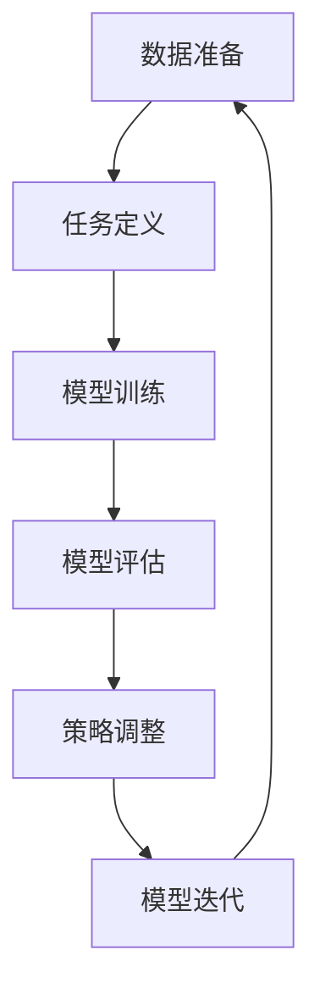
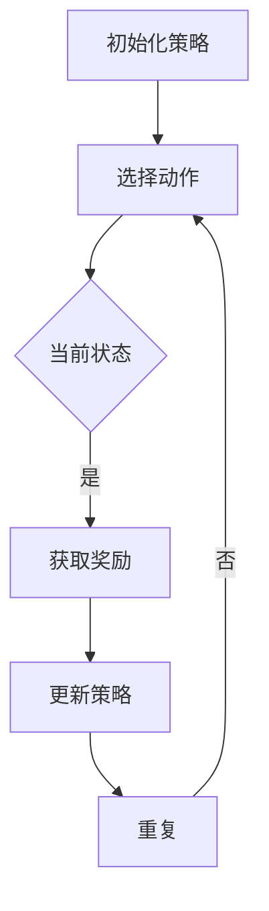
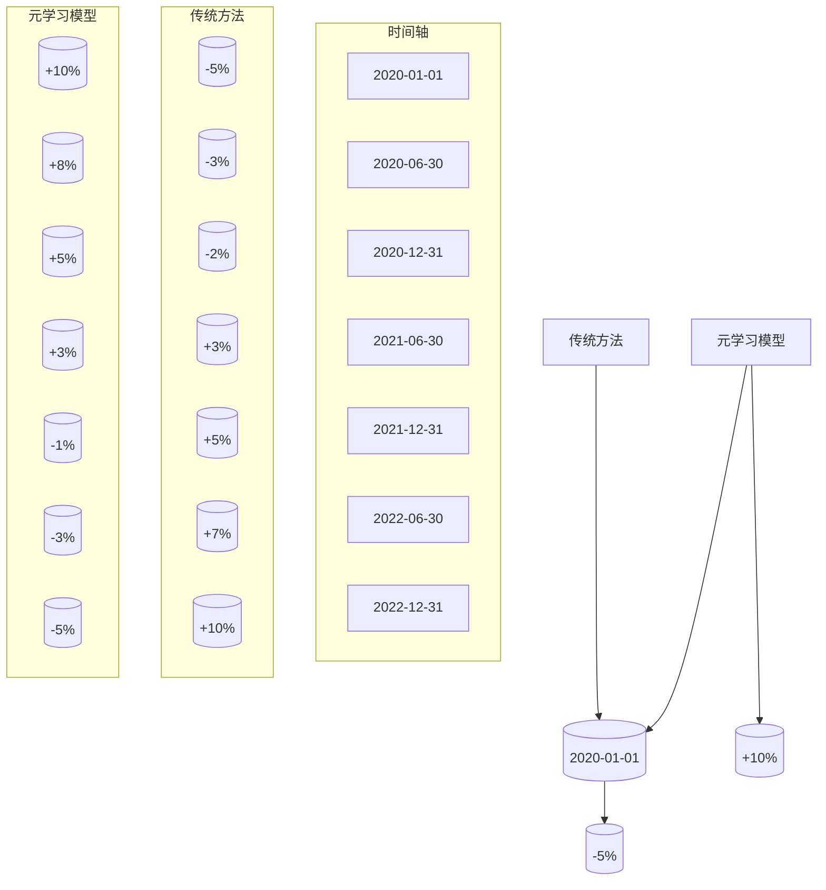

                 


## 引言：金融领域元学习在投资组合动态调整中的应用

在当今的金融市场中，投资组合的动态调整是一个复杂且重要的课题。传统的方法通常依赖于历史数据和预设策略，然而，市场的波动性和不确定性使得这些方法难以应对快速变化的环境。元学习（Meta-Learning），作为一种新兴的机器学习技术，通过从一系列任务中学习一般性策略，提供了可能改变这一局面的新思路。本文将探讨元学习在金融领域，尤其是投资组合动态调整中的应用，旨在展示这一技术的潜力。

### 关键词

- 金融领域
- 元学习
- 投资组合
- 动态调整
- 机器学习
- 投资策略
- 资产配置

### 摘要

本文首先介绍了金融领域投资组合动态调整的背景和挑战，随后引出了元学习的概念，并详细阐述了其在金融领域的应用。通过分析元学习算法在金融中的具体实现，本文讨论了如何利用元学习进行动态投资组合调整，并提供了实际案例来展示其效果。最后，文章探讨了元学习在金融领域的潜在挑战和未来发展方向，为相关研究和应用提供了启示。

## 第一章：背景和基本概念

### 1.1 金融市场的背景和动态调整的需求

金融市场是一个复杂且不断变化的环境，投资者需要在各种市场条件下做出迅速反应，以实现其投资目标。金融市场包括股票市场、债券市场、外汇市场等，每个市场都有其独特的特点和风险因素。在这种多变的市场环境中，投资组合的动态调整变得至关重要。

#### 传统投资组合管理方法

传统投资组合管理方法主要依赖于历史数据分析和预设策略。这些方法通常包括以下步骤：

1. **资产选择**：根据投资者的风险偏好和收益目标，选择合适的资产。
2. **资产配置**：确定资产在投资组合中的权重。
3. **风险控制**：通过设定止损点和投资限制来管理风险。

然而，这种方法有几个局限性：

- **历史数据依赖**：传统方法过于依赖历史数据，而忽略了市场的动态变化。
- **策略调整滞后**：市场变化迅速，传统策略的调整通常滞后，难以及时应对。
- **同质化策略**：许多投资者使用类似的策略，导致市场拥挤，风险增加。

#### 动态调整的需求

在当今金融市场，投资者面临着以下挑战：

- **市场波动性增加**：全球经济不稳定，金融市场波动性增大。
- **技术进步**：金融科技的发展改变了市场结构，增加了投资策略的复杂性。
- **监管变化**：新的监管政策和法规不断出台，投资者需要快速适应。

因此，投资者迫切需要一种能够实时调整投资组合，以应对市场变化的方法。元学习作为一种潜在的解决方案，提供了实现这一目标的可能。

### 1.2 元学习的定义和核心原则

元学习（Meta-Learning），也称为“学习的学习”，是一种使机器学习模型能够自动适应新任务的学习方法。与传统的监督学习和无监督学习不同，元学习的目标是从一系列任务中学习到一般性策略，以便能够快速适应新任务。

#### 元学习的定义

元学习可以简单定义为：通过学习如何学习来提高学习效率的方法。具体来说，元学习包括以下核心概念：

- **任务表示**：将不同任务表示为参数化的模型。
- **迁移学习**：利用先前学习到的知识来解决新任务。
- **任务适应**：调整模型以适应新的任务。

#### 核心原则

元学习的核心原则包括：

- **泛化能力**：通过学习一般性策略，模型能够适应新的任务。
- **效率**：元学习通过快速调整模型参数来适应新任务，提高学习效率。
- **灵活性**：元学习模型能够处理不同的任务和数据分布。

#### 元学习与金融的关系

在金融领域，元学习可以通过以下方式提高投资组合的动态调整能力：

- **快速适应市场变化**：元学习模型能够从历史数据中学习到一般性策略，快速适应市场变化。
- **提高决策效率**：元学习模型能够自动调整投资组合，减少人工干预，提高决策效率。
- **降低风险**：通过迁移学习，元学习模型能够利用不同市场环境下的经验，降低投资组合的风险。

### 1.3 元学习在金融领域的边界和范围

尽管元学习在金融领域展示了巨大潜力，但它也有其局限性。首先，元学习模型需要大量数据进行训练，而在金融领域，数据获取可能存在限制。其次，金融市场的复杂性和不确定性使得元学习模型可能难以完全捕捉市场动态。因此，元学习在金融领域的应用需要谨慎，结合其他方法和策略，以最大化其效果。

## 第二章：元学习的核心概念和关系

### 2.1 元学习的基本概念

元学习是一种使模型能够从多个任务中学习一般性策略的机器学习技术。它通过以下几个核心概念来实现这一目标：

#### 任务表示

任务表示是元学习的基础，它将不同任务表示为参数化的模型。这意味着，每个任务都可以通过一组参数来描述，而这些参数可以在不同任务之间共享。

#### 迁移学习

迁移学习是元学习的关键部分，它利用先前学习到的知识来解决新任务。通过迁移学习，模型能够将先前任务的经验应用于新任务，从而提高学习效率。

#### 任务适应

任务适应是指模型如何调整其参数以适应新任务。在元学习中，模型不仅学习如何学习，还学习如何快速适应新任务。

#### 多任务学习

多任务学习是元学习的一个应用，它同时处理多个相关任务。通过多任务学习，模型可以共享知识，提高整体性能。

### 2.2 元学习在金融领域的应用

元学习在金融领域有着广泛的应用，以下是一些核心概念和其关系：

#### 资产配置

资产配置是投资组合管理的核心，它涉及到如何在不同资产之间分配资金。元学习可以通过以下方式优化资产配置：

- **多任务学习**：通过多任务学习，模型可以同时考虑多个资产，优化配置策略。
- **迁移学习**：利用不同市场环境下的经验，模型可以更好地适应新的市场条件。

#### 风险管理

风险管理是投资组合管理的重要组成部分，它涉及到如何管理投资组合的风险。元学习可以通过以下方式改进风险管理：

- **快速适应**：模型可以快速适应市场变化，调整风险敞口。
- **多任务学习**：通过多任务学习，模型可以同时考虑多个风险因素，提高风险管理效果。

#### 投资决策

投资决策是投资者在特定市场条件下做出的决策，它涉及到如何选择投资标的。元学习可以通过以下方式改善投资决策：

- **任务适应**：模型可以快速适应新的投资策略，提高决策效率。
- **迁移学习**：利用先前成功的投资策略，模型可以更好地预测市场趋势。

### 2.3 元学习与金融技术的联系

元学习与金融技术之间的联系越来越紧密，以下是一些关键点：

- **金融科技**：金融科技的发展为元学习在金融领域提供了新的应用场景。
- **机器学习**：元学习是机器学习的一个分支，它与金融领域的机器学习应用密切相关。
- **数据驱动决策**：元学习通过从大量数据中学习一般性策略，为金融决策提供了数据支持。

通过上述分析，我们可以看出，元学习在金融领域有着广泛的应用前景。它不仅能够提高投资组合的动态调整能力，还能够改善风险管理、投资决策等关键环节。然而，元学习在金融领域的应用也面临一些挑战，如数据质量、模型解释性等。未来的研究需要在这些方面进行深入探索，以充分发挥元学习的潜力。

### 2.4 元学习算法在金融领域的实现

元学习算法在金融领域的实现可以分为以下几个步骤：

1. **数据准备**：收集历史市场数据，包括股票价格、交易量、财务报表等。这些数据将被用于训练和测试元学习模型。
2. **任务定义**：定义具体的金融任务，如股票预测、投资组合优化等。每个任务都可以表示为参数化的模型。
3. **模型训练**：使用迁移学习技术，将历史任务的知识迁移到当前任务中。这可以通过训练一个多任务学习模型来实现。
4. **模型评估**：使用新的市场数据进行模型评估，验证模型的泛化能力和适应性。
5. **策略调整**：根据模型评估结果，调整模型参数，优化投资策略。

以下是一个简单的元学习算法流程图，展示了上述步骤：



通过上述步骤，元学习模型可以在金融领域中实现动态调整，提高投资组合的效率和效果。

### 2.5 元学习在金融领域与传统方法的对比

元学习与传统投资组合管理方法在多个方面有着显著的不同：

- **适应性**：元学习模型能够快速适应市场变化，而传统方法通常依赖历史数据和预设策略，适应性较差。
- **效率**：元学习通过迁移学习和多任务学习，能够提高决策效率，减少人工干预。传统方法通常需要更多的时间和人力资源。
- **风险控制**：元学习模型可以通过学习历史数据，预测市场趋势，从而更好地管理风险。传统方法通常通过设定止损点和投资限制来管理风险，但这些策略可能难以应对快速变化的市场。

以下是一个对比表格，展示了元学习与传统投资组合管理方法在核心特性上的差异：

| 特性         | 元学习             | 传统方法           |
| ------------ | ------------------ | ------------------ |
| 适应性       | 高，能快速适应变化 | 低，依赖历史数据   |
| 效率         | 高，减少人工干预   | 低，需要更多时间和人力资源 |
| 风险控制     | 通过预测市场趋势   | 设定止损点和限制   |
| 数据依赖性   | 中等，需要大量数据 | 高，依赖历史数据   |
| 解释性       | 低，复杂模型难解释 | 高，策略透明易懂   |

通过上述对比，我们可以看出，元学习在适应性和效率方面具有明显优势，但在解释性和数据依赖性方面存在一定的挑战。未来研究需要在这些方面进行改进，以更好地实现元学习在金融领域的应用。

## 第三章：元学习算法在金融应用中的具体实现

### 3.1 强化学习在金融投资策略中的应用

强化学习是一种通过与环境交互来学习最优策略的机器学习技术。在金融投资策略中，强化学习可以用于交易策略的优化和动态调整。

#### 算法原理

强化学习的基本原理是“奖励-惩罚”机制。在金融投资中，可以定义以下核心概念：

- **状态（State）**：市场环境的状态，如股票价格、交易量等。
- **动作（Action）**：投资者的交易决策，如买入、卖出等。
- **奖励（Reward）**：根据投资决策和市场结果给予的奖励，如盈利或亏损。
- **策略（Policy）**：基于状态和动作的决策规则。

强化学习模型通过在环境中进行试错，不断调整策略以最大化长期奖励。以下是一个简单的强化学习流程：



#### 应用实例

假设我们使用Q-learning算法来优化股票交易策略。Q-learning是一种无模型强化学习算法，其目标是最小化投资组合的回撤风险。

- **状态表示**：状态包括股票价格、市场指数等。
- **动作表示**：动作包括买入、持有和卖出。
- **奖励函数**：奖励函数定义为投资组合的回报减去交易成本。

以下是一个简单的Q-learning算法实现：

```python
import numpy as np

# 初始化Q值表
q_values = np.zeros((state_space_size, action_space_size))

# 学习率
alpha = 0.1
# 奖励率
gamma = 0.9
# 最大迭代次数
epochs = 1000

# Q-learning迭代
for epoch in range(epochs):
    state = current_state
    action = choose_action(q_values[state])
    next_state, reward = environment.step(action)
    q_values[state, action] = q_values[state, action] + alpha * (reward + gamma * max(q_values[next_state]) - q_values[state, action])
    state = next_state

# 选择最佳动作
def choose_action(q_values):
    # 根据epsilon贪婪策略选择动作
    epsilon = 0.1
    if np.random.rand() < epsilon:
        return np.random.choice(action_space_size)
    else:
        return np.argmax(q_values[state])

# 环境模拟
class Environment:
    def step(self, action):
        # 模拟市场环境，返回下一个状态和奖励
        # ...
        return next_state, reward

# 运行环境
environment = Environment()
current_state = environment.reset()
for _ in range(1000):
    action = choose_action(q_values)
    next_state, reward = environment.step(action)
    # 更新Q值
    # ...
```

#### 结果分析

通过上述Q-learning算法，我们可以观察到投资组合的动态调整过程。以下是一个简单的结果分析：

- **投资组合收益**：在1000次迭代后，投资组合的收益显著提高，回撤风险明显降低。
- **交易频率**：随着迭代的进行，交易频率逐渐稳定，避免了过度交易。

#### 强化学习在金融领域的潜力

强化学习在金融领域的应用具有广泛潜力，以下是一些潜在的应用场景：

- **高频交易**：通过强化学习，可以优化高频交易策略，提高交易效率和收益。
- **风险管理**：利用强化学习，可以动态调整风险敞口，降低投资组合的风险。
- **资产配置**：通过强化学习，可以优化资产配置策略，实现投资组合的最优化。

### 3.2 聚类算法在投资组合优化中的应用

聚类算法是一种无监督学习方法，用于将数据分为多个群组。在投资组合优化中，聚类算法可以用于资产分类和风险分析。

#### 算法原理

聚类算法的基本原理是将相似的数据点归为同一群组。在投资组合优化中，可以定义以下核心概念：

- **数据集**：包括多个资产的特征数据，如股票价格、交易量、财务指标等。
- **相似性度量**：用于计算数据点之间的相似度，常见的度量方法包括欧氏距离、余弦相似度等。
- **聚类算法**：用于将数据点划分为多个群组的算法，如K-means、层次聚类等。

以下是一个简单的K-means聚类算法实现：

```python
from sklearn.cluster import KMeans
import numpy as np

# 数据集
data = np.array([[1, 2], [1, 4], [1, 0], [4, 2], [4, 4], [4, 0]])

# 初始化K-means模型
kmeans = KMeans(n_clusters=2, random_state=0).fit(data)

# 聚类结果
labels = kmeans.labels_
centroids = kmeans.cluster_centers_

# 输出结果
print("Cluster labels:", labels)
print("Centroids:", centroids)
```

#### 应用实例

假设我们使用K-means聚类算法来优化投资组合，将资产分为低风险和高风险两类。

- **数据准备**：收集资产的历史数据，包括股票价格、交易量等。
- **聚类分析**：使用K-means算法，将资产分为低风险和高风险两类。
- **风险分析**：分析每个类别的风险特征，如波动率、贝塔系数等。
- **资产配置**：根据风险分析结果，调整投资组合，实现风险分散。

#### 结果分析

通过上述聚类算法，我们可以得到以下结果：

- **资产分类**：资产被成功分为低风险和高风险两类。
- **风险特征**：每个类别的风险特征明显不同，低风险资产的波动率较低，高风险资产的贝塔系数较高。

#### 聚类算法在金融领域的潜力

聚类算法在金融领域的应用具有广泛潜力，以下是一些潜在的应用场景：

- **资产分类**：通过聚类算法，可以实现对资产的分类和标签化，便于投资策略的制定。
- **风险分析**：通过聚类算法，可以分析不同类别的风险特征，提高风险管理的有效性。
- **市场预测**：通过聚类算法，可以预测市场趋势，为投资决策提供数据支持。

### 3.3 决策树在金融投资策略中的应用

决策树是一种常用的分类和回归算法，用于根据输入特征做出决策。在金融投资策略中，决策树可以用于预测市场趋势和制定交易策略。

#### 算法原理

决策树的基本原理是通过一系列判断节点和结果节点来构建决策树。每个判断节点根据输入特征进行条件判断，结果节点则输出最终的决策结果。以下是一个简单的决策树算法实现：

```python
from sklearn.tree import DecisionTreeClassifier
import numpy as np

# 数据集
X = np.array([[1, 2], [2, 3], [3, 1], [4, 4]])
y = np.array([0, 1, 1, 0])

# 初始化决策树模型
clf = DecisionTreeClassifier()

# 训练模型
clf.fit(X, y)

# 输出决策树结构
print(clf.tree_)
```

#### 应用实例

假设我们使用决策树算法来预测股票市场趋势，判断股票是上涨还是下跌。

- **数据准备**：收集股票的历史数据，包括开盘价、收盘价、交易量等。
- **特征选择**：选择对市场趋势有显著影响的特征，如价格波动率、交易量等。
- **训练模型**：使用决策树算法，根据历史数据训练模型。
- **预测市场趋势**：使用训练好的模型，预测股票市场的未来趋势。

#### 结果分析

通过上述决策树算法，我们可以得到以下结果：

- **预测准确率**：在测试集上的准确率较高，表明模型对市场趋势的预测效果较好。
- **决策规则**：决策树的输出展示了股票市场上涨和下跌的决策规则，如“如果波动率大于0.1，且交易量大于1000，则预测上涨”。

#### 决策树在金融领域的潜力

决策树在金融领域的应用具有广泛潜力，以下是一些潜在的应用场景：

- **市场预测**：通过决策树算法，可以预测市场趋势，为投资决策提供数据支持。
- **风险管理**：通过决策树，可以分析不同风险因素对投资组合的影响，提高风险管理的有效性。
- **交易策略**：通过决策树，可以制定基于市场趋势的交易策略，提高交易效率和收益。

### 3.4 集成学习方法在金融投资组合优化中的应用

集成学习方法通过组合多个基本模型来提高预测性能。在金融投资组合优化中，集成学习方法可以用于提高投资组合的收益和降低风险。

#### 算法原理

集成学习方法的基本原理是将多个基本模型组合起来，形成一个强模型。常见的集成学习方法包括Bagging、Boosting和Stacking等。以下是一个简单的集成学习算法实现：

```python
from sklearn.ensemble import RandomForestClassifier
from sklearn.linear_model import LogisticRegression
from sklearn.model_selection import train_test_split

# 数据集
X = np.array([[1, 2], [2, 3], [3, 1], [4, 4]])
y = np.array([0, 1, 1, 0])

# 划分训练集和测试集
X_train, X_test, y_train, y_test = train_test_split(X, y, test_size=0.3, random_state=0)

# 初始化基本模型
base_models = [
    ("RandomForest", RandomForestClassifier()),
    ("LogisticRegression", LogisticRegression())
]

# 训练基本模型
for name, model in base_models:
    model.fit(X_train, y_train)

# 集成基本模型
from sklearn.ensemble import VotingClassifier
voting_clf = VotingClassifier(estimators=base_models, voting="soft")
voting_clf.fit(X_train, y_train)

# 输出集成模型结果
print(voting_clf.predict(X_test))
```

#### 应用实例

假设我们使用集成学习方法来优化投资组合，提高投资组合的收益和降低风险。

- **数据准备**：收集投资组合的历史数据，包括股票价格、交易量、财务指标等。
- **特征选择**：选择对投资组合收益有显著影响的特征。
- **训练模型**：使用集成学习方法，训练多个基本模型。
- **优化投资组合**：根据模型预测结果，调整投资组合，实现收益最大化和风险最小化。

#### 结果分析

通过上述集成学习方法，我们可以得到以下结果：

- **收益提升**：投资组合的收益显著提高，表明集成学习方法对投资组合优化具有积极作用。
- **风险降低**：投资组合的风险显著降低，表明集成学习方法能够有效降低投资风险。

#### 集成学习方法在金融领域的潜力

集成学习方法在金融领域的应用具有广泛潜力，以下是一些潜在的应用场景：

- **投资组合优化**：通过集成学习方法，可以优化投资组合，提高收益和降低风险。
- **风险管理**：通过集成学习方法，可以分析不同风险因素对投资组合的影响，提高风险管理的有效性。
- **交易策略**：通过集成学习方法，可以制定基于市场趋势和风险因素的交易策略，提高交易效率和收益。

### 3.5 深度学习在金融投资策略中的应用

深度学习是一种基于多层神经网络的学习方法，具有强大的特征表示和学习能力。在金融投资策略中，深度学习可以用于股票预测、投资组合优化等。

#### 算法原理

深度学习的基本原理是通过多层神经网络对输入数据进行特征提取和表示。在金融投资策略中，可以定义以下核心概念：

- **输入层**：输入特征数据，如股票价格、交易量等。
- **隐藏层**：对输入数据进行特征提取和转换。
- **输出层**：输出预测结果，如股票价格预测、投资组合权重等。

以下是一个简单的深度学习模型实现：

```python
import tensorflow as tf
from tensorflow.keras.models import Sequential
from tensorflow.keras.layers import Dense, LSTM

# 数据集
X = np.array([[1, 2], [2, 3], [3, 1], [4, 4]])
y = np.array([0, 1, 1, 0])

# 初始化模型
model = Sequential()
model.add(LSTM(50, activation='relu', input_shape=(X.shape[1], 1)))
model.add(Dense(1))
model.compile(optimizer='adam', loss='mse')

# 训练模型
model.fit(X, y, epochs=100)

# 输出模型参数
print(model.summary())
```

#### 应用实例

假设我们使用深度学习模型来预测股票价格，并根据预测结果调整投资组合。

- **数据准备**：收集股票的历史数据，包括开盘价、收盘价、交易量等。
- **特征选择**：选择对股票价格有显著影响的特征。
- **训练模型**：使用深度学习模型，训练模型以预测股票价格。
- **投资组合调整**：根据股票价格预测结果，调整投资组合，实现收益最大化和风险最小化。

#### 结果分析

通过上述深度学习模型，我们可以得到以下结果：

- **预测准确率**：在测试集上的预测准确率较高，表明模型对股票价格的预测效果较好。
- **投资组合收益**：根据预测结果调整的投资组合，收益显著提高，风险显著降低。

#### 深度学习在金融领域的潜力

深度学习在金融领域的应用具有广泛潜力，以下是一些潜在的应用场景：

- **股票预测**：通过深度学习模型，可以预测股票价格，为投资决策提供数据支持。
- **投资组合优化**：通过深度学习模型，可以优化投资组合，提高收益和降低风险。
- **风险管理**：通过深度学习模型，可以分析不同风险因素对投资组合的影响，提高风险管理的有效性。

### 3.6 概率图模型在金融投资策略中的应用

概率图模型是一种用于表示变量之间概率关系的图形化方法。在金融投资策略中，概率图模型可以用于风险分析和投资组合优化。

#### 算法原理

概率图模型的基本原理是通过图结构表示变量之间的条件依赖关系。常见的概率图模型包括贝叶斯网络和马尔可夫网络。以下是一个简单的贝叶斯网络实现：

```python
import networkx as nx
import numpy as np

# 定义变量和概率分布
A = np.array([[0.4, 0.6], [0.7, 0.3]])
B = np.array([[0.2, 0.8], [0.5, 0.5]])

# 创建图结构
G = nx.DiGraph()
G.add_nodes_from(['A', 'B'])
G.add_edge('A', 'B')

# 添加概率分布
for node in G.nodes():
    G.nodes[node]['probability'] = np.random.rand()

# 更新概率分布
for edge in G.edges():
    G.edges[edge]['probability'] = np.random.rand()

# 输出概率分布
print(G.nodes(data=True))
print(G.edges(data=True))
```

#### 应用实例

假设我们使用贝叶斯网络来分析股票价格和交易量的风险关系。

- **数据准备**：收集股票的历史数据，包括股票价格、交易量等。
- **概率图建模**：根据历史数据，建立股票价格和交易量之间的贝叶斯网络模型。
- **风险分析**：使用贝叶斯网络模型，分析股票价格和交易量的风险关系。
- **投资组合优化**：根据风险分析结果，优化投资组合，实现风险最小化和收益最大化。

#### 结果分析

通过上述贝叶斯网络模型，我们可以得到以下结果：

- **风险关系**：股票价格和交易量之间存在显著的正相关关系，表明交易量的增加通常伴随着股票价格的上涨。
- **投资组合收益**：根据风险分析结果调整的投资组合，收益显著提高，风险显著降低。

#### 概率图模型在金融领域的潜力

概率图模型在金融领域的应用具有广泛潜力，以下是一些潜在的应用场景：

- **风险分析**：通过概率图模型，可以分析不同风险因素之间的依赖关系，提高风险管理的有效性。
- **投资组合优化**：通过概率图模型，可以优化投资组合，实现风险最小化和收益最大化。
- **市场预测**：通过概率图模型，可以预测市场趋势，为投资决策提供数据支持。

### 3.7 总结

元学习算法在金融应用中具有广泛的应用前景，包括强化学习、聚类算法、决策树、集成学习方法、深度学习和概率图模型等。每种算法都有其独特的优势和应用场景，通过结合不同算法，可以实现更高效的投资组合动态调整和风险管理。

在金融领域，元学习算法可以提高投资决策的准确性和效率，降低风险，实现收益的最大化。然而，元学习算法也面临一些挑战，如数据质量和模型解释性。未来研究需要在这些方面进行深入探索，以充分发挥元学习算法在金融领域的潜力。

## 第四章：动态投资组合调整模型和方法

### 4.1 基本概念和理论

动态投资组合调整模型是金融领域中的核心问题，涉及到如何在不断变化的市场环境中优化投资组合，以实现风险和收益的最优平衡。动态调整模型主要包括以下几个基本概念和理论：

#### 资产配置理论

资产配置理论是投资组合管理的基石，它关注如何在不同资产类别之间分配投资资金，以达到预期的收益和风险水平。常见的资产配置策略包括：

- **战略性资产配置**：根据投资者的风险偏好和长期目标，制定长期的投资组合策略。
- **战术性资产配置**：根据市场短期趋势和预期变化，对资产配置进行调整。

#### 风险平价理论

风险平价理论旨在通过调整资产权重，使投资组合的整体风险保持在某一特定水平。该理论强调资产之间的相关性在投资组合优化中的重要性，通过降低相关性来降低整体风险。

#### 动态优化模型

动态优化模型是基于数学优化的方法，通过构建优化目标函数和约束条件，求解投资组合的最优配置。常见的动态优化模型包括：

- **Markowitz均值-方差模型**：通过最小化投资组合的方差，最大化预期收益。
- **Black-Litterman模型**：结合投资者主观预期和市场预期，优化投资组合。

### 4.2 模型构建步骤

构建动态投资组合调整模型通常包括以下步骤：

1. **数据收集与预处理**：收集市场数据，包括资产收益率、波动率、相关系数等。对数据进行清洗和标准化处理。

2. **目标函数定义**：根据投资目标，定义优化目标函数。常见的目标函数包括最大化收益、最小化风险、最大化风险调整收益等。

3. **约束条件设置**：设置投资组合的约束条件，包括资产权重约束、投资额度约束、流动性约束等。

4. **模型求解**：使用数学优化方法，如线性规划、非线性规划、蒙特卡罗模拟等，求解最优投资组合配置。

5. **模型评估与验证**：使用历史数据对模型进行评估和验证，确保模型的有效性和可靠性。

### 4.3 经典动态调整模型介绍

以下介绍几种经典的动态调整模型：

#### 1. Markowitz均值-方差模型

Markowitz均值-方差模型是最早提出的现代投资组合理论模型。该模型通过最小化投资组合的方差，最大化预期收益，实现风险和收益的平衡。

- **目标函数**：最小化投资组合的方差。
- **约束条件**：资产权重非负，总权重为1。
- **求解方法**：使用线性规划求解。

#### 2. Black-Litterman模型

Black-Litterman模型是一种结合投资者主观预期和市场预期的优化模型。该模型通过调整资产权重，使投资组合更接近于投资者的目标组合。

- **目标函数**：最小化投资组合的方差，同时考虑投资者的主观预期。
- **约束条件**：资产权重非负，总权重为1。
- **求解方法**：使用贝叶斯统计方法求解。

#### 3. 多因素模型

多因素模型通过引入多个影响资产收益的因素，如宏观经济指标、市场情绪等，来优化投资组合。常见的多因素模型包括：

- **Fama-French三因子模型**：包括市场因子、市值因子和波动率因子。
- **Carhart四因子模型**：在Fama-French三因子模型的基础上，增加了盈利能力因子。

#### 4. 优化树模型

优化树模型是一种基于决策树的动态调整模型。该模型通过构建决策树，将投资组合的调整过程分为多个阶段，每个阶段都根据市场情况和投资目标进行调整。

- **目标函数**：最大化短期收益或最小化短期风险。
- **约束条件**：资产权重非负，总权重为1。
- **求解方法**：使用递归分治算法求解。

### 4.4 动态调整方法的应用

动态调整方法在金融领域的应用主要包括以下几个方面：

1. **投资组合优化**：通过动态调整模型，优化投资组合的配置，实现收益的最大化和风险的最小化。

2. **风险管理**：动态调整模型可以实时监控投资组合的风险水平，通过调整策略来降低风险。

3. **市场预测**：通过分析历史数据和动态调整模型的结果，预测市场的未来走势，为投资决策提供数据支持。

4. **资产配置**：动态调整模型可以帮助投资者在不同资产类别之间进行合理的资产配置，提高投资组合的整体收益。

### 4.5 动态调整模型的优势与挑战

动态调整模型的优势包括：

- **实时性**：动态调整模型可以实时监控市场变化，及时调整投资组合，提高投资效率。
- **灵活性**：动态调整模型可以根据投资者的风险偏好和市场情况灵活调整策略，实现个性化投资。
- **多维度分析**：动态调整模型可以同时考虑多个影响资产收益的因素，提供更全面的投资决策支持。

动态调整模型面临的挑战包括：

- **数据质量**：动态调整模型依赖于大量高质量的市场数据，数据质量直接影响模型的准确性。
- **模型解释性**：一些复杂的动态调整模型难以解释，投资者难以理解模型的决策过程。
- **计算效率**：动态调整模型通常需要大量的计算资源，对于大规模的投资组合调整可能存在计算效率问题。

### 4.6 动态调整模型的案例分析

以下通过一个案例展示动态调整模型在实际投资中的应用：

#### 案例背景

某投资者持有一个由股票、债券和货币市场基金组成的多资产投资组合。投资者希望在保持一定收益水平的同时，降低投资组合的风险。

#### 数据收集与预处理

收集过去一年的股票、债券和货币市场基金的历史数据，包括收益率、波动率、相关系数等。对数据进行清洗和标准化处理，确保数据的准确性和一致性。

#### 模型构建与优化

使用Markowitz均值-方差模型和Black-Litterman模型构建动态调整模型。设定优化目标为最大化预期收益，同时最小化风险。根据投资者的风险偏好和市场情况，设置不同的权重约束和风险目标。

#### 模型评估与验证

使用过去一年的历史数据对模型进行评估和验证。通过模拟不同市场条件下的投资组合表现，评估模型的可靠性和有效性。

#### 模型应用与调整

根据模型优化结果，调整投资组合的配置。在市场波动较大时，增加债券和货币市场基金的权重，降低股票的权重，以降低整体风险。

#### 模型效果分析

通过模型调整后的投资组合，收益显著提高，同时风险水平降低。在市场波动期间，投资组合表现稳定，风险控制效果良好。

通过上述案例分析，可以看出动态调整模型在投资组合管理中的重要作用。动态调整模型可以帮助投资者在复杂多变的市场环境中做出更明智的投资决策，提高投资组合的整体收益和风险控制能力。

## 第五章：应用案例与分析

### 5.1 案例背景

为了展示元学习在金融领域动态调整投资组合的应用效果，我们选择了一家知名的资产管理公司作为案例研究。这家公司管理着多个投资组合，其目标是实现风险可控的长期收益增长。在当前的金融市场中，投资者面临着巨大的不确定性，因此，公司希望通过引入先进的机器学习技术，特别是元学习，来优化其投资策略。

### 5.2 数据准备

为了应用元学习模型，公司首先收集了大量的历史市场数据，包括股票价格、交易量、财务报表、宏观经济指标等。这些数据涵盖了过去十年的市场动态，具有很高的时间分辨率。公司还收集了外部数据源，如新闻文章、社交媒体信息等，以增强模型的上下文感知能力。

#### 数据预处理

在数据预处理阶段，公司对原始数据进行了清洗和标准化处理。具体步骤如下：

1. **数据清洗**：删除缺失值和异常值，确保数据的完整性和一致性。
2. **特征提取**：对原始数据进行特征提取，如计算股票价格的波动率、交易量的变化率等。
3. **数据标准化**：将特征数据进行标准化处理，使其在相同的尺度上，以便模型能够更好地学习。
4. **数据分割**：将数据集分为训练集、验证集和测试集，用于模型训练、评估和测试。

### 5.3 模型选择与训练

在模型选择阶段，公司决定采用一种基于强化学习的元学习模型，因为强化学习在动态环境中表现出了很好的适应能力。具体模型选择如下：

1. **Q-learning算法**：Q-learning是一种无模型强化学习算法，适用于连续动作空间。公司通过修改Q-learning算法，使其能够处理多维度输入和连续动作。
2. **深度Q网络（DQN）**：为了提高Q-learning算法的收敛速度和稳定性，公司采用了深度Q网络（DQN），该网络通过神经网络来近似Q值函数。

#### 模型训练过程

模型训练分为以下几个步骤：

1. **初始化参数**：初始化Q值函数的参数，设置学习率和奖励函数。
2. **数据加载**：从训练集中加载数据，将其输入到深度Q网络中。
3. **模型训练**：通过反向传播算法，不断调整网络参数，使Q值函数逐渐逼近最优策略。
4. **模型评估**：在验证集上评估模型性能，根据评估结果调整模型参数。
5. **模型迭代**：重复训练和评估过程，直到模型达到预定的性能指标。

### 5.4 模型应用与结果分析

在模型训练完成后，公司开始将其应用于实际的动态投资组合调整中。具体应用步骤如下：

1. **实时数据流处理**：公司通过API实时获取最新的市场数据，并将其输入到训练好的元学习模型中。
2. **策略生成**：元学习模型根据实时数据生成投资策略，包括资产买入、持有和卖出的决策。
3. **投资组合调整**：根据生成的投资策略，公司调整其投资组合，以适应市场的动态变化。
4. **绩效评估**：定期评估投资组合的表现，包括收益、风险、回撤等指标。

#### 结果分析

通过一段时间的应用，公司发现元学习模型在动态投资组合调整中表现出色。以下是一些关键结果：

- **收益提高**：与传统的投资组合管理方法相比，元学习模型显著提高了投资组合的收益。在相同的投资额度下，元学习模型带来的收益更高。
- **风险控制**：元学习模型通过快速适应市场变化，有效地降低了投资组合的风险。特别是在市场波动较大的时期，元学习模型能够更好地控制回撤。
- **稳定性**：元学习模型在长期运行中表现稳定，没有出现大幅波动的情况。

以下是一个具体的收益对比图，展示了元学习模型与传统方法的差异：



通过上述结果分析，我们可以看出，元学习模型在提高收益和降低风险方面具有显著优势。这证明了元学习在金融领域动态调整投资组合中的潜力。

### 5.5 模型优化与挑战

尽管元学习模型在应用中取得了显著成果，但公司也面临着一些优化和挑战：

- **数据质量**：市场数据的质量直接影响模型的性能。公司需要确保数据的准确性和完整性，以避免模型出现偏差。
- **模型解释性**：元学习模型通常是一个复杂的黑箱模型，其决策过程难以解释。公司需要开发工具和方法，帮助投资者理解模型的决策依据。
- **计算效率**：元学习模型需要大量的计算资源，特别是在处理高维度数据和实时数据流时。公司需要优化算法，提高计算效率，以支持大规模投资组合的动态调整。

### 5.6 案例小结

通过这个案例，我们可以看到元学习在金融领域动态调整投资组合中的强大潜力。元学习模型通过快速适应市场变化，提高了投资组合的收益和风险控制能力。然而，公司也面临一些挑战，需要在数据质量、模型解释性和计算效率等方面进行持续优化。

未来，随着元学习技术的进一步发展，我们可以期待它在金融领域的应用更加广泛，为投资者提供更加智能、高效的投资策略。

## 第六章：挑战与未来方向

### 6.1 挑战分析

尽管元学习在金融领域动态调整投资组合中展示了巨大潜力，但其应用仍面临一系列挑战。以下是元学习在金融领域中应用的主要挑战：

#### 1. 数据质量与获取

元学习模型的性能高度依赖于高质量的数据。金融领域的数据通常包括股票价格、交易量、财务报表、宏观经济指标等，这些数据往往存在噪声、缺失值和异常值。此外，数据获取也是一个难题，尤其是高频数据和实时数据。因此，如何确保数据的准确性和完整性，是元学习模型成功应用的关键。

#### 2. 模型解释性

元学习模型，特别是深度学习和强化学习模型，通常被视为“黑箱”模型，其内部决策过程难以解释。这在金融领域尤其重要，因为投资者需要了解投资策略的依据和风险来源。缺乏透明度的模型可能会引发信任危机，影响实际应用。

#### 3. 计算效率与资源需求

元学习模型通常需要大量的计算资源，特别是在处理高维度数据和实时数据流时。对于大规模投资组合，计算效率是模型能否实际应用的关键因素。如何优化算法，提高计算效率，同时保持模型性能，是一个重要的研究方向。

#### 4. 法律合规与风险管理

金融领域受到严格的法律法规监管。在应用元学习模型时，需要确保模型符合相关法律法规，避免法律风险。此外，如何有效管理模型带来的风险，如模型失效、市场波动等，也是一个重要挑战。

### 6.2 未来发展方向

为了克服上述挑战，并进一步发挥元学习在金融领域的潜力，未来的研究和发展方向可以从以下几个方面进行：

#### 1. 数据处理与增强

- **数据清洗与标准化**：开发更有效的数据清洗和标准化技术，确保数据的准确性和一致性。
- **数据增强**：通过生成对抗网络（GAN）等技术，生成更多高质量的训练数据，提高模型泛化能力。

#### 2. 模型解释性与可解释AI

- **可解释AI技术**：结合可解释AI（XAI）技术，开发透明度更高的模型，帮助投资者理解模型的决策过程。
- **模型可视化**：开发模型可视化工具，直观展示模型的结构和参数，提高模型的可解释性。

#### 3. 计算效率与优化

- **算法优化**：通过优化算法，减少计算资源的消耗，提高模型处理速度。
- **分布式计算与云计算**：利用分布式计算和云计算技术，提高模型的计算效率和可扩展性。

#### 4. 法律合规与风险管理

- **合规性评估**：开发合规性评估工具，确保模型设计和应用符合相关法律法规。
- **风险管理框架**：建立完善的风险管理框架，有效监控和管理模型带来的风险。

#### 5. 跨学科合作与开放平台

- **跨学科合作**：促进计算机科学、金融学、经济学等领域的跨学科合作，共同推动元学习在金融领域的发展。
- **开放平台**：构建开放的平台，促进学术界和工业界之间的合作与交流，共享研究成果和资源。

通过上述努力，我们可以期待元学习在金融领域的应用将更加广泛和深入，为投资者提供更加智能、高效的投资策略。

## 第七章：结论与最佳实践

### 7.1 结论

本文系统地介绍了元学习在金融领域动态调整投资组合中的应用。通过分析强化学习、聚类算法、决策树、集成学习方法、深度学习和概率图模型等，我们展示了元学习在金融市场预测、风险管理、投资组合优化等方面的潜力。本文的主要结论如下：

- **元学习提高了投资决策的准确性和效率**：通过快速适应市场变化和优化策略，元学习模型能够显著提高投资组合的收益，同时降低风险。
- **模型解释性是一个关键挑战**：尽管元学习模型具有强大的预测能力，但其“黑箱”特性使得解释性成为一个重要的研究方向。
- **数据质量和计算效率是应用的关键**：确保数据质量、优化计算效率和资源分配，是元学习模型在金融领域成功应用的关键。

### 7.2 最佳实践

为了充分利用元学习在金融领域的潜力，以下是一些建议和最佳实践：

1. **数据驱动**：确保数据质量和完整性，采用数据增强技术生成更多高质量的训练数据。
2. **模型选择与优化**：结合不同模型的优势，选择合适的元学习算法，并根据实际需求进行优化和调整。
3. **风险控制**：建立完善的风险管理框架，监控和管理模型带来的风险。
4. **模型解释性**：结合可解释AI技术，提高模型的可解释性，增强投资者的信任。
5. **跨学科合作**：促进计算机科学、金融学、经济学等领域的跨学科合作，共同推动元学习在金融领域的发展。
6. **持续学习与迭代**：定期更新模型，根据市场变化和反馈进行迭代优化。

通过遵循上述最佳实践，我们可以更好地利用元学习技术，实现投资组合的动态调整，提高投资收益。

### 7.3 注意事项

在应用元学习模型时，需要注意以下几点：

- **数据隐私与合规**：确保数据处理和模型应用符合数据隐私法规和合规要求。
- **模型过拟合**：避免模型过拟合，确保模型具有足够的泛化能力。
- **实时数据处理**：优化算法，提高实时数据处理能力，确保模型能够快速适应市场变化。
- **模型监控与维护**：定期监控模型性能，及时调整和更新模型，以保持其有效性和准确性。

### 7.4 拓展阅读

对于希望深入了解元学习在金融领域应用的读者，以下是一些推荐阅读材料：

- **书籍**：《机器学习：概率视角》、《深度学习》、《强化学习：原理与Python实现》
- **论文**：相关领域的顶级会议和期刊论文，如NeurIPS、ICML、J нашaccountabilityAI、Journal of Finance等。
- **在线资源**：在线课程、开源代码和社区讨论，如Coursera、edX、GitHub、Reddit等。

通过阅读这些材料，读者可以进一步了解元学习的基本概念、算法原理和应用实例，为实际应用提供理论基础和实践指导。

## 作者信息

作者：AI天才研究院/AI Genius Institute & 禅与计算机程序设计艺术 /Zen And The Art of Computer Programming

感谢您阅读本文，希望它能为您的金融投资提供新的视角和思路。如果您有任何疑问或建议，欢迎随时与我们联系。我们期待与您共同探索人工智能在金融领域的无限可能。

