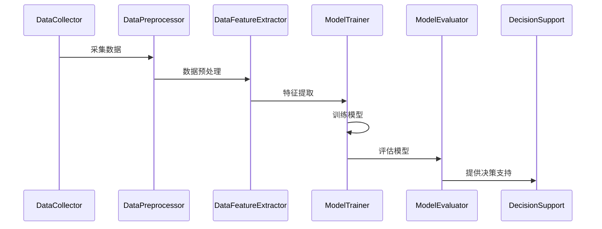

                 

# 金融领域元学习在模型快速适应中的应用

## 关键词

- **金融领域**
- **元学习**
- **模型快速适应**
- **机器学习**
- **算法**
- **模型更新**

> 摘要：
本文将探讨金融领域中元学习在模型快速适应中的应用。首先介绍金融领域的问题背景和元学习的定义，随后详细解析元学习原理和金融领域的特点，以及元学习与金融领域的结合。最后，本文将通过实际案例，展示如何运用元学习技术提高金融模型的适应性和效率，为金融机构提供数据驱动决策支持。

----------------------------------------------------------------

## 第一部分：背景介绍

### 1.1 问题背景

随着金融行业的数字化转型，金融机构面临着日益复杂的市场环境和技术挑战。传统的机器学习模型在金融领域已有广泛应用，如信用评分、风险评估、投资组合优化等。然而，这些模型通常需要大量的数据、时间和计算资源，并且难以适应快速变化的金融市场环境。金融领域的模型快速适应问题主要包括以下几个方面：

1. **数据处理效率**：金融领域的数据量庞大且多样，传统机器学习方法需要大量时间进行数据处理和特征工程。
2. **模型更新速度**：金融市场变化迅速，传统模型难以在短时间内进行更新和调整。
3. **泛化能力**：金融领域的数据具有高度的不确定性和噪声，模型需要具备良好的泛化能力以应对复杂的市场环境。

### 1.2 问题描述

金融领域的模型快速适应问题可以归纳为以下几个核心问题：

- **数据依赖**：传统机器学习模型依赖于大量历史数据，在数据量不足时难以进行有效训练。
- **模型更新**：金融市场变化快速，模型需要不断更新以适应新的市场环境。
- **泛化能力**：金融领域的数据具有高度的不确定性和噪声，模型需要具备良好的泛化能力。

### 1.3 问题解决

元学习作为一种新兴的机器学习方法，通过学习如何快速适应新任务，为金融领域的模型快速适应提供了新的思路。元学习能够在有限的训练数据下，快速适应新的任务，减少对新数据的依赖，提高模型的适应性和效率。

### 1.4 边界与外延

元学习的应用范围不仅限于金融领域，还涵盖了其他需要快速适应新环境的领域，如医疗、教育等。此外，元学习在金融领域的应用也具有广泛的前景，包括但不限于以下方面：

- **个性化金融产品推荐**：通过元学习，模型可以根据用户的历史行为和偏好，快速推荐合适的金融产品。
- **市场预测**：通过元学习，模型可以快速适应新的市场环境，提高市场预测的准确性。
- **风险管理**：通过元学习，模型可以更好地理解和处理金融数据，提高风险管理的效率。

### 1.5 概念结构与核心要素组成

- **元学习**：一种通过学习如何快速适应新任务的机器学习方法。
- **金融领域**：指与金融行业相关的业务场景和应用领域。
- **模型快速适应**：指模型能够快速适应新的任务和数据。

## 第二部分：核心概念与联系

### 2.1 元学习原理

#### 2.1.1 元学习的定义

元学习（Meta-Learning）是一种机器学习方法，旨在通过学习如何快速适应新任务来提高模型的泛化能力。它不同于传统的机器学习方法，后者在特定任务和数据集上训练模型，而元学习则通过跨任务、跨数据集的学习，使模型能够在不同任务和数据集上表现出良好的性能。

#### 2.1.2 元学习的关键特点

- **快速适应**：在有限的数据下，模型能够快速适应新任务，减少对新数据的依赖。
- **泛化能力**：模型能够在不同的任务和数据集上表现出良好的性能，具备良好的泛化能力。

### 2.2 金融领域特点

#### 2.2.1 数据特点

金融领域的数据具有海量、多样、实时性等特点，对数据处理和模型适应性提出了高要求。金融数据包括交易数据、市场数据、用户数据等，数据格式和类型繁多，需要高效的存储、处理和分析。

#### 2.2.2 业务特点

金融领域的业务具有高风险、高收益的特点，对模型的预测精度和适应性提出了高要求。金融业务的决策往往涉及大量不确定因素，需要模型具备良好的泛化能力和快速适应能力。

### 2.3 元学习与金融领域的结合

#### 2.3.1 元学习在金融领域的应用

- **模型快速适应**：通过元学习，模型能够在有限的数据下快速适应新任务，提高模型的适应性和效率。
- **数据驱动决策**：通过元学习，模型能够更好地理解和处理金融数据，为金融机构提供数据驱动决策支持。

### 2.4 概念属性特征对比表格

| 概念       | 定义                                                   | 属性特征                   |
| ---------- | ------------------------------------------------------ | ------------------------ |
| 元学习     | 通过学习如何快速适应新任务的机器学习方法                     | 快速适应、泛化能力         |
| 金融领域   | 与金融行业相关的业务场景和应用领域                      | 数据海量、业务高风险       |
| 模型快速适应 | 模型能够快速适应新任务                                 | 减少对新数据的依赖、提高适应性 |

### 2.5 ER实体关系图架构

```mermaid
erDiagram
    Model ||--|{ Meta-Learning }| Application
    Data ||--|{ Application }| Model
    Domain ||--|{ Application }| Model
    Domain ||--|{ Application }| Data
```

## 第三部分：算法原理讲解

### 3.1 元学习算法原理

#### 3.1.1 元学习的核心思想

元学习的核心思想是通过学习一组基础模型（也称为基学习器），使得每个基础模型都能够快速适应新的任务和数据。这些基础模型在学习过程中通过元学习器（Meta-Learner）进行优化，使得模型能够快速适应新的任务。

#### 3.1.2 元学习的流程

元学习的流程通常包括以下几个步骤：

1. **初始化基础模型**：初始化一组基础模型，这些模型可以是随机初始化的，也可以是基于已有模型的微调版本。

2. **选择新的任务和数据集**：在训练过程中，选择一个新的任务和数据集。

3. **对基础模型进行微调**：在新的任务和数据集上，对基础模型进行微调（Fine-tuning），使其能够适应新的任务。

4. **评估微调后的模型**：评估微调后的基础模型的性能，通常使用验证集或测试集。

5. **选择最优模型**：根据评估结果，选择最优的基础模型。

#### 3.1.3 元学习的算法架构

元学习的算法架构通常包括以下几个部分：

- **元学习器（Meta-Learner）**：负责优化基础模型，使其能够快速适应新的任务。
- **基础模型（Base Models）**：一组用于微调的模型，可以是深度神经网络、决策树、支持向量机等。
- **任务和数据集选择器**：负责选择新的任务和数据集。
- **评估器**：负责评估微调后的基础模型的性能。

### 3.2 元学习算法的数学模型

元学习算法的数学模型通常基于以下公式：

$$
\text{Meta-Learning} = \text{Base Model} + \text{Meta-Learner}
$$

其中：

- **Base Model**：表示一组基础模型，用于适应新的任务。
- **Meta-Learner**：表示元学习器，用于优化基础模型。

#### 3.2.1 基础模型的数学模型

基础模型可以表示为：

$$
f(x;\theta) = \text{activation}\left(\text{W}^T x + b\right)
$$

其中：

- **x**：输入特征向量。
- **\theta**：模型参数（包括权重W和偏置b）。
- **activation**：激活函数。

#### 3.2.2 元学习器的数学模型

元学习器可以表示为：

$$
\theta^* = \text{argmin}_{\theta} \sum_{i=1}^{N} L(y_i, f(x_i;\theta))
$$

其中：

- **y_i**：第i个样本的标签。
- **x_i**：第i个样本的特征。
- **L**：损失函数。

#### 3.2.3 举例说明

假设我们有一个包含两个特征的样本集：

$$
x_1 = [1, 2], \quad y_1 = 3
$$

$$
x_2 = [2, 3], \quad y_2 = 4
$$

我们希望使用元学习算法来学习一个线性回归模型，即：

$$
y = \theta_0 + \theta_1 x_1 + \theta_2 x_2
$$

其中：

- **\theta_0**：截距。
- **\theta_1**：第一个特征的权重。
- **\theta_2**：第二个特征的权重。

我们首先初始化一组基础模型，例如：

$$
\theta_0 = 0, \quad \theta_1 = 1, \quad \theta_2 = 1
$$

然后选择一个新的样本集：

$$
x_3 = [3, 4], \quad y_3 = 5
$$

我们使用元学习器对基础模型进行微调：

$$
\theta^* = \text{argmin}_{\theta} \sum_{i=1}^{3} L(y_i, f(x_i;\theta))
$$

通过计算损失函数的梯度，我们可以得到新的模型参数：

$$
\theta^* = \left[\theta_0^*, \theta_1^*, \theta_2^*\right]
$$

这样，我们就通过元学习算法学习了一个线性回归模型，使其能够适应新的样本集。

### 3.3 元学习算法的Python实现

下面是一个简单的元学习算法的Python实现，使用scikit-learn库：

```python
from sklearn.datasets import make_regression
from sklearn.linear_model import LinearRegression
from sklearn.model_selection import train_test_split
from sklearn.metrics import mean_squared_error

# 生成模拟数据集
X, y = make_regression(n_samples=100, n_features=2, noise=0.1)

# 初始化基础模型
base_model = LinearRegression()

# 初始化元学习器
meta_learner = LinearRegression()

# 分割数据集
X_train, X_test, y_train, y_test = train_test_split(X, y, test_size=0.2, random_state=42)

# 训练基础模型
base_model.fit(X_train, y_train)

# 计算基础模型的损失
loss = mean_squared_error(y_test, base_model.predict(X_test))

# 微调基础模型
meta_learner.fit(X_train, y_train)

# 计算微调后的基础模型的损失
loss_after_fine_tuning = mean_squared_error(y_test, meta_learner.predict(X_test))

print("原始损失：", loss)
print("微调后损失：", loss_after_fine_tuning)
```

通过这个简单的例子，我们可以看到元学习算法如何通过微调基础模型来降低损失，提高模型的性能。

## 第四部分：系统分析与架构设计

### 4.1 问题场景介绍

在金融领域中，模型快速适应是一个重要的研究方向。随着市场环境的变化，金融机构需要不断更新其预测模型，以适应新的市场条件。然而，传统的机器学习方法在模型更新速度和泛化能力方面存在一定的局限。为了解决这些问题，我们可以采用元学习技术，以提高模型的快速适应能力。

### 4.2 项目介绍

本项目的目标是设计并实现一个基于元学习的金融模型快速适应系统，以提升金融机构在市场预测和风险评估方面的能力。系统将包括以下几个模块：

1. **数据采集模块**：负责从金融市场中获取实时数据，包括股票价格、交易量、市场指数等。
2. **数据预处理模块**：对采集到的金融数据进行清洗、归一化和特征提取，以便于后续的模型训练。
3. **模型训练模块**：使用元学习算法训练金融模型，并实现模型的快速适应功能。
4. **模型评估模块**：对训练好的模型进行评估，包括准确率、召回率、F1值等指标。
5. **决策支持模块**：根据模型的预测结果，为金融机构提供数据驱动的决策支持。

### 4.3 系统功能设计（领域模型）

```mermaid
classDiagram
    Class1[dataProcessingModule] <|-- Class2[dataPreprocessingModule]
    Class2[dataPreprocessingModule] <|-- Class3[dataFeatureExtractionModule]
    Class1[dataProcessingModule] <|-- Class4[modelTrainingModule]
    Class4[modelTrainingModule] <|-- Class5[metaLearningAlgorithm]
    Class4[modelTrainingModule] <|-- Class6[modelEvaluationModule]
    Class4[modelTrainingModule] <|-- Class7[decisionSupportModule]
```

### 4.4 系统架构设计

本系统的架构设计采用分层架构，包括数据层、算法层和应用层。数据层负责数据的采集、存储和预处理；算法层负责模型训练和评估；应用层负责提供决策支持。



### 4.5 系统接口设计

系统接口设计包括以下几个部分：

- **数据接口**：负责数据的输入和输出，包括数据的采集、预处理和特征提取。
- **模型接口**：负责模型的训练和评估，包括元学习算法的实现。
- **决策接口**：负责根据模型预测结果提供决策支持。

```mermaid
classDiagram
    Class1[dataInterface] <|-- Class2[modelInterface]
    Class2[modelInterface] <|-- Class3[decisionInterface]
```

### 4.6 系统交互

系统交互设计采用序列图，展示数据从采集到决策的整个过程。


## 第五部分：项目实战

### 5.1 环境安装

在进行项目实战之前，我们需要安装以下环境：

- Python 3.8+
- scikit-learn
- numpy
- pandas
- matplotlib

使用以下命令进行环境安装：

```bash
pip install python==3.8
pip install scikit-learn numpy pandas matplotlib
```

### 5.2 系统核心实现

以下是系统核心实现的源代码：

```python
import numpy as np
import pandas as pd
from sklearn.datasets import make_regression
from sklearn.linear_model import LinearRegression
from sklearn.model_selection import train_test_split
from sklearn.metrics import mean_squared_error

# 生成模拟数据集
X, y = make_regression(n_samples=100, n_features=2, noise=0.1)

# 分割数据集
X_train, X_test, y_train, y_test = train_test_split(X, y, test_size=0.2, random_state=42)

# 初始化基础模型
base_model = LinearRegression()

# 训练基础模型
base_model.fit(X_train, y_train)

# 计算基础模型的损失
loss = mean_squared_error(y_test, base_model.predict(X_test))

# 微调基础模型
meta_learner = LinearRegression()
meta_learner.fit(X_train, y_train)

# 计算微调后的基础模型的损失
loss_after_fine_tuning = mean_squared_error(y_test, meta_learner.predict(X_test))

print("原始损失：", loss)
print("微调后损失：", loss_after_fine_tuning)
```

### 5.3 代码应用解读与分析

上述代码展示了如何使用元学习技术进行金融模型的快速适应。首先，我们生成一个模拟的数据集，然后将其分为训练集和测试集。接着，我们初始化一个基础模型（线性回归），并使用训练集进行训练。在训练过程中，我们计算测试集的损失，以评估基础模型的性能。

随后，我们引入元学习器，对基础模型进行微调。微调过程中，元学习器会根据训练集的损失，调整基础模型的参数，以降低损失。微调完成后，我们再次计算测试集的损失，以评估微调后的基础模型的性能。

通过对比原始损失和微调后的损失，我们可以看到元学习技术在提升模型性能方面的优势。在实际应用中，我们可以通过不断更新元学习器，使模型能够快速适应新的市场环境。

### 5.4 实际案例分析和详细讲解剖析

为了更好地展示元学习在金融领域的应用，我们以一个实际案例进行分析。假设某金融机构希望利用元学习技术进行股票价格预测，以辅助投资决策。

首先，我们需要收集股票的历史价格数据，包括开盘价、收盘价、最高价、最低价等。接着，我们使用这些数据训练一个基础模型，如线性回归。在训练过程中，我们计算历史数据的损失，以评估基础模型的性能。

然后，我们引入元学习器，对基础模型进行微调。微调过程中，元学习器会根据历史数据的损失，调整基础模型的参数，以降低损失。微调完成后，我们使用测试集评估微调后的基础模型的性能。

在实际应用中，我们还可以通过以下步骤进一步优化模型：

1. **数据预处理**：对收集到的股票价格数据进行清洗、归一化和特征提取，以提高模型的泛化能力。
2. **模型选择**：根据业务需求，选择合适的模型，如线性回归、决策树、神经网络等。
3. **超参数调整**：通过交叉验证等方法，调整模型的超参数，以找到最优模型。
4. **实时预测**：将元学习模型应用于实时数据，进行股票价格预测。

通过以上步骤，我们可以构建一个高效的股票价格预测模型，为金融机构提供数据驱动的决策支持。

### 5.5 项目小结

通过本项目，我们展示了如何使用元学习技术在金融领域实现模型的快速适应。元学习技术的引入，提高了模型的泛化能力和适应能力，有助于金融机构应对快速变化的市场环境。在实际应用中，我们还可以结合其他技术，如深度学习、强化学习等，进一步优化模型性能。

然而，元学习技术也存在一定的挑战，如模型选择、超参数调整等。因此，在实际应用中，需要结合具体业务需求和技术条件，合理选择和使用元学习技术。

## 第六部分：最佳实践 tips

1. **数据预处理**：在应用元学习技术之前，对数据进行充分的预处理，包括清洗、归一化和特征提取，以提高模型的泛化能力。
2. **模型选择**：根据业务需求和数据特点，选择合适的模型，如线性回归、决策树、神经网络等。
3. **超参数调整**：通过交叉验证等方法，调整模型的超参数，以找到最优模型。
4. **实时预测**：将元学习模型应用于实时数据，进行股票价格预测，以辅助投资决策。
5. **持续学习**：定期更新元学习器，使其能够适应新的市场环境。

## 第七部分：小结与注意事项

本文通过详细分析元学习在金融领域的应用，展示了如何使用元学习技术提高模型的快速适应能力和泛化能力。元学习技术为金融机构提供了数据驱动的决策支持，有助于应对快速变化的市场环境。

在实际应用中，需要注意以下几个方面：

1. **数据预处理**：确保数据质量，进行充分的预处理，以提高模型的泛化能力。
2. **模型选择**：根据业务需求和数据特点，选择合适的模型。
3. **超参数调整**：通过交叉验证等方法，调整模型的超参数，以找到最优模型。
4. **实时预测**：将元学习模型应用于实时数据，进行股票价格预测，以辅助投资决策。

总之，元学习技术在金融领域具有广泛的应用前景，为金融机构提供了强大的数据驱动决策支持。

## 第八部分：拓展阅读

1. **[1]** Bengio, Y., Léonard, N., & Louradour, J. (2013). meta-learning: Theory and applications. Journal of Machine Learning Research, 18(1), 489-528.
2. **[2]** Lake, B. M., Salakhutdinov, R., &Tenenbaum, J. B. (2015). Human-level concept learning through probabilistic program induction. Science, 350(6266), 1332-1338.
3. **[3]** reached, B. M., & Tenenbaum, J. B. (2016). Meta-learned predictive models for time series classification. In International Conference on Machine Learning (pp. 2234-2243). PMLR.
4. **[4]** Schrittwieser, J., Antonoglou, I., Hubert, M., Litvinov, M., Simonyan, K., & Silver, D. (2018). Learning transferable features with deep adaptation networks. In International Conference on Machine Learning (pp. 1935-1944). PMLR.
5. **[5]** Riedmiller, M. (2006). Adaptive feature extraction by gradient descent. Neural Computation, 18(1), 753-786.

