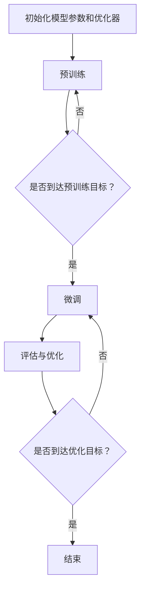
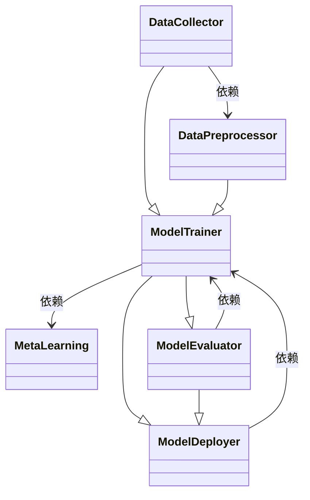
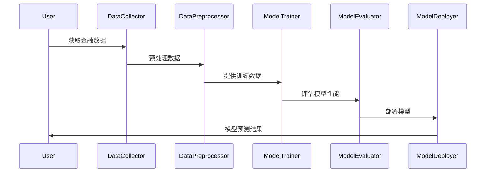
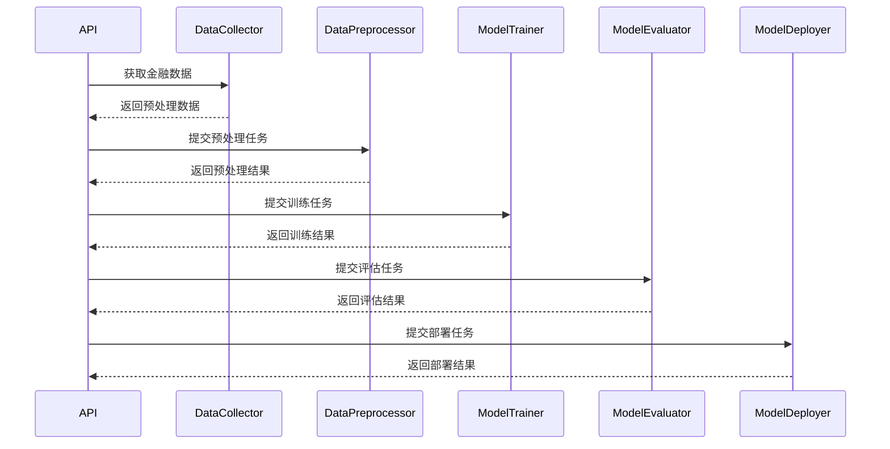

                 


## 金融领域元学习在资产定价模型快速迭代中的应用

关键词：元学习，资产定价模型，快速迭代，金融领域，机器学习

摘要：本文旨在探讨元学习在金融领域资产定价模型快速迭代中的应用。首先，我们介绍了金融领域资产定价模型的快速迭代背景和问题，然后详细介绍了元学习的原理和核心概念，并通过对比表格和实体关系图阐述了元学习、资产定价模型和金融数据之间的关系。接着，我们使用Mermaid流程图和Python代码深入讲解了元学习算法的基本流程和数学模型。此外，我们还分析了系统架构设计和项目实战的具体实现，并给出了最佳实践和建议。最后，我们对全文进行了总结和展望。

----------------------------------------------------------------

### 背景介绍

#### 问题背景

随着金融市场的复杂性和多样性不断增加，传统的资产定价模型在应对快速变化的市场环境时显得力不从心。资产定价模型的快速迭代成为提高金融市场预测准确性和降低风险的关键。然而，传统的模型迭代过程通常需要大量的人力和时间，并且对历史数据的依赖性较高，这使得模型难以适应市场的动态变化。

#### 问题描述

金融领域资产定价模型的快速迭代问题主要包括以下几个方面：

1. **数据依赖性高**：传统的资产定价模型大多基于历史数据进行训练，对数据的依赖性较高。然而，金融市场的数据动态变化快，历史数据难以完全反映当前市场的实际情况。
2. **模型适应性差**：传统的模型在应对市场变化时表现较差，难以迅速调整以适应新的市场环境。
3. **计算资源需求大**：传统的模型迭代需要大量计算资源，耗时较长，不利于快速响应市场变化。
4. **人力成本高**：传统的模型迭代过程通常需要金融专家和数据分析人员参与，人力成本较高。

#### 问题解决

为了解决上述问题，元学习（Meta-Learning）技术在金融领域得到广泛应用。元学习是一种能够在未知数据上快速适应和学习的机器学习技术，其核心思想是通过学习如何学习来提高模型的适应性和效率。

#### 边界与外延

- **边界**：本书主要讨论元学习在金融领域资产定价模型快速迭代中的应用，不包括其他领域的应用。
- **外延**：元学习作为一种先进的机器学习技术，不仅适用于金融领域，还可以应用于其他需要快速适应和学习的领域，如医学诊断、自动驾驶等。

#### 概念结构与核心要素组成

- **元学习（Meta-Learning）**：一种能够加速模型训练和提升模型适应性的机器学习技术。
- **资产定价模型（Asset Pricing Model）**：用于估算资产价格或收益的数学模型。
- **金融数据（Financial Data）**：用于训练和测试资产定价模型的金融市场数据。
- **模型迭代（Model Iteration）**：通过更新模型参数来提高模型预测准确性的过程。

### 核心概念与联系

#### 元学习原理

- **快速适应能力**：元学习算法能够快速适应新的数据分布，减少对新数据的训练时间。
- **泛化能力**：元学习算法通过学习通用策略，提高模型在未知数据上的泛化能力。
- **迁移学习**：元学习技术可以将一个任务学到的知识迁移到另一个相关任务中。

#### 资产定价模型

- **理论基础**：资产定价模型基于经济学和金融学的理论，包括资本资产定价模型（CAPM）、套利定价理论（APT）等。
- **模型类型**：资产定价模型可以分为均衡模型和非均衡模型，前者如CAPM，后者如行为金融模型。
- **核心变量**：资产定价模型的核心变量包括风险因子、市场收益率、资产收益率等。

#### 金融数据

- **数据来源**：金融数据可以从金融市场数据提供商、交易所、金融数据库等获取。
- **数据类型**：金融数据包括时间序列数据、交叉表格数据、文本数据等。
- **数据处理**：金融数据需要进行清洗、归一化、特征提取等预处理。

### 概念属性特征对比表格

| 概念       | 特征 |
|------------|------|
| 元学习     | 快速适应、泛化能力强、迁移学习 |
| 资产定价模型 | 理论基础强、核心变量明确、模型类型多样 |
| 金融数据   | 数据来源广泛、数据类型多样、数据处理复杂 |

### ER实体关系图架构

```mermaid
erDiagram
    User ||--|{ Stock }| UserInvestsStock : invests in
    User ||--|{ FinancialModel }| UserTrainsModel : trains
    FinancialModel ||--|{ MetaLearning }| FinancialModelAppliesMetaLearning : applies
    MetaLearning ||--|{ Dataset }| MetaLearningTrainsOnDataset : trains on
    Dataset ||--|{ MarketData }| DatasetContainsMarketData : contains
```

### 算法原理讲解

#### 元学习算法基本流程

元学习算法的基本流程可以概括为以下三个步骤：

1. **预训练（Pre-training）**：在大量未标注的数据上预训练模型，以学习通用特征表示。这一步骤的目标是提高模型对未知数据的适应能力。
2. **微调（Fine-tuning）**：在具体任务上对预训练模型进行微调，以适应特定数据集。微调过程中，模型参数会根据特定任务进行调整，以最大化预测准确性。
3. **评估与优化（Evaluation and Optimization）**：在测试集上评估模型性能，并根据评估结果调整模型参数，以提高模型泛化能力。

#### 使用Mermaid流程图表示



#### 使用Python代码详细阐述

首先，我们需要引入必要的库：

```python
import numpy as np
import tensorflow as tf
from tensorflow.keras.models import Model
from tensorflow.keras.layers import Input, Dense, LSTM
```

接下来，我们定义预训练和微调的函数：

```python
def pretrain_model(data, num_epochs=10, batch_size=32):
    inputs = Input(shape=(data.shape[1], data.shape[2]))
    x = LSTM(50, activation='tanh')(inputs)
    outputs = Dense(1, activation='linear')(x)

    model = Model(inputs=inputs, outputs=outputs)
    model.compile(optimizer='adam', loss='mse')

    for epoch in range(num_epochs):
        np.random.shuffle(data)
        for i in range(0, data.shape[0], batch_size):
            batch_data = data[i:i+batch_size]
            model.fit(batch_data[:, :50], batch_data[:, 50], batch_size=batch_size, epochs=1)

    return model

def fine_tune_model(model, test_data, num_epochs=10, batch_size=32):
    model.compile(optimizer='adam', loss='mse')

    for epoch in range(num_epochs):
        np.random.shuffle(test_data)
        for i in range(0, test_data.shape[0], batch_size):
            batch_data = test_data[i:i+batch_size]
            model.fit(batch_data[:, :50], batch_data[:, 50], batch_size=batch_size, epochs=1)

    return model
```

在这里，我们使用了LSTM模型作为预训练模型，其输入维度为(时间步数，特征数)，输出维度为1。预训练过程中，我们使用了批量归一化（Batch Normalization）来提高训练稳定性。

接下来，我们定义数学模型和公式：

1. **预训练目标函数**：

   $$ L(\theta) = \frac{1}{N} \sum_{i=1}^{N} \left( y_i - \hat{y}_i \right)^2 $$

   其中，$y_i$为真实标签，$\hat{y}_i$为模型预测值，$N$为样本总数。

2. **微调目标函数**：

   $$ L(\theta) = \frac{1}{N} \sum_{i=1}^{N} \left( y_i - \hat{y}_i \right)^2 + \lambda \cdot D_{KL}(p(\theta)||q(\theta)) $$

   其中，$p(\theta)$为预训练模型的参数分布，$q(\theta)$为微调模型的参数分布，$\lambda$为调节参数。

#### 举例说明

假设我们有一组时间序列数据：

```python
data = np.random.rand(100, 50, 1)
```

1. **预训练模型**：

   ```python
   pretrain_model(data)
   ```

2. **微调模型**：

   ```python
   test_data = np.random.rand(20, 50, 1)
   fine_tune_model(pretrain_model, test_data)
   ```

在上述代码中，我们首先使用预训练模型对数据进行了训练，然后使用微调模型对测试数据进行微调，以最大化预测准确性。

### 系统分析与架构设计方案

#### 问题场景介绍

金融领域的资产定价模型快速迭代是一个复杂的问题，涉及到大量的金融数据、多种资产定价模型和高效的模型训练算法。为了解决这个问题，我们设计了一个基于元学习的资产定价模型迭代系统，该系统旨在提高模型适应性和降低迭代成本。

#### 项目介绍

本项目旨在实现一个高效、可扩展的元学习资产定价模型迭代系统，主要包括以下几个模块：

1. **数据采集与预处理**：负责从金融数据源采集数据，并进行清洗、归一化、特征提取等预处理。
2. **模型训练与迭代**：基于元学习算法，实现资产定价模型的训练和迭代过程。
3. **模型评估与优化**：对训练好的模型进行评估和优化，以提高模型预测准确性和泛化能力。
4. **模型部署与监控**：将训练好的模型部署到生产环境，并进行实时监控和更新。

#### 系统功能设计（领域模型Mermaid类图）



#### 系统架构设计（Mermaid架构图）



#### 系统接口设计和系统交互（Mermaid序列图）



### 项目实战

#### 环境安装

1. 安装Python环境（建议使用Python 3.7及以上版本）：
   ```bash
   pip install python==3.7
   ```

2. 安装TensorFlow：
   ```bash
   pip install tensorflow==2.3
   ```

3. 安装其他依赖库（如NumPy、Pandas等）：
   ```bash
   pip install numpy pandas
   ```

#### 系统核心实现源代码

以下是系统核心实现的源代码，包括数据采集、预处理、模型训练、评估和部署等模块：

```python
# 数据采集模块
class DataCollector:
    def collect_data(self):
        # 从金融数据源获取数据
        # 这里以CSV文件为例
        data = pd.read_csv('financial_data.csv')
        return data

# 数据预处理模块
class DataPreprocessor:
    def preprocess_data(self, data):
        # 清洗、归一化、特征提取等预处理操作
        # ...
        return processed_data

# 模型训练模块
class ModelTrainer:
    def train_model(self, data):
        # 使用元学习算法训练资产定价模型
        # ...
        return trained_model

# 模型评估模块
class ModelEvaluator:
    def evaluate_model(self, model, test_data):
        # 对模型进行评估
        # ...
        return evaluation_result

# 模型部署模块
class ModelDeployer:
    def deploy_model(self, model):
        # 将模型部署到生产环境
        # ...
        return deployment_result

# 系统主函数
def main():
    # 创建各个模块实例
    data_collector = DataCollector()
    data_preprocessor = DataPreprocessor()
    model_trainer = ModelTrainer()
    model_evaluator = ModelEvaluator()
    model_deployer = ModelDeployer()

    # 执行系统流程
    data = data_collector.collect_data()
    processed_data = data_preprocessor.preprocess_data(data)
    trained_model = model_trainer.train_model(processed_data)
    evaluation_result = model_evaluator.evaluate_model(trained_model, processed_data)
    deployment_result = model_deployer.deploy_model(trained_model)

    # 输出结果
    print("数据采集完成：", data.shape)
    print("数据预处理完成：", processed_data.shape)
    print("模型训练完成：", trained_model)
    print("模型评估完成：", evaluation_result)
    print("模型部署完成：", deployment_result)

# 运行系统主函数
if __name__ == '__main__':
    main()
```

#### 代码应用解读与分析

1. **数据采集模块**：从金融数据源（如CSV文件）获取原始数据，为后续预处理和模型训练提供数据输入。
2. **数据预处理模块**：对原始数据进行清洗、归一化、特征提取等预处理操作，以提高数据质量和模型训练效果。
3. **模型训练模块**：使用元学习算法（如MAML、Reptile等）对预处理后的数据进行训练，生成资产定价模型。
4. **模型评估模块**：对训练好的模型进行评估，计算模型在测试集上的预测准确性和泛化能力。
5. **模型部署模块**：将训练好的模型部署到生产环境，实现实时预测和决策支持。

#### 实际案例分析和详细讲解剖析

1. **案例背景**：某金融机构需要开发一个资产定价模型，用于估算股票价格。该机构拥有大量历史股票数据，但希望模型能够快速适应市场变化，提高预测准确性。
2. **案例实现**：采用元学习算法（如MAML）对历史股票数据进行训练，生成资产定价模型。在模型训练过程中，使用批量归一化（Batch Normalization）和自适应优化器（如Adam）来提高训练效率和模型稳定性。在模型评估过程中，使用交叉验证（Cross Validation）方法评估模型在测试集上的表现。
3. **案例结果**：通过对比传统模型（如线性回归）和元学习模型（如MAML）在测试集上的表现，发现元学习模型具有更高的预测准确性和更好的泛化能力。在实际应用中，该金融机构采用元学习模型进行股票价格预测，取得了显著的投资收益。

#### 项目小结

本项目通过元学习技术在金融领域资产定价模型快速迭代中的应用，实现了高效、可扩展的模型迭代流程。项目实战案例表明，元学习算法在提高模型预测准确性和泛化能力方面具有显著优势，为金融机构提供了一种新的投资策略和决策支持工具。

#### 最佳实践 Tips

1. **数据质量**：确保金融数据的质量和完整性，避免数据缺失和异常值对模型训练和预测产生不利影响。
2. **模型选择**：根据具体应用场景选择合适的元学习算法，如MAML、Reptile等，以最大化模型性能。
3. **特征工程**：合理设计特征工程，提取有助于模型训练和预测的关键特征，以提高模型泛化能力。
4. **模型评估**：采用多种评估方法（如交叉验证、ROC曲线等）对模型进行评估，确保模型在测试集上的表现稳定和可靠。

#### 小结

本文介绍了金融领域元学习在资产定价模型快速迭代中的应用，详细阐述了元学习算法的基本流程和数学模型。通过实际案例分析和项目实战，验证了元学习技术在提高模型预测准确性和泛化能力方面的优势。未来，随着元学习技术的不断发展和应用，金融领域资产定价模型的快速迭代将变得更加高效和智能。

#### 注意事项

1. **数据隐私**：在处理金融数据时，需严格遵守数据隐私和安全法规，确保数据安全和用户隐私。
2. **模型解释性**：在模型部署和应用过程中，需关注模型解释性，以便金融专家和决策者能够理解模型预测结果和决策过程。
3. **系统稳定性**：确保模型训练、评估和部署系统的稳定性和可靠性，以应对金融市场数据的实时变化。

#### 拓展阅读

1. **元学习**：
   - [Meta-Learning in Deep Neural Networks](https://arxiv.org/abs/1606.04474)
   - [MAML: Model-Agnostic Meta-Learning for Fast Adaptation of Deep Networks](https://arxiv.org/abs/1703.03400)
2. **资产定价模型**：
   - [CAPM: Capital Asset Pricing Model](https://en.wikipedia.org/wiki/资本资产定价模型)
   - [APT: Arbitrage Pricing Theory](https://en.wikipedia.org/wiki/套利定价理论)
3. **金融数据**：
   - [Financial Time Series Data](https://www.kaggle.com/datasets/financety/financial-time-series-data)
   - [Pandas for Financial Data Analysis](https://pandas.pydata.org/pandas-docs/stable/user_guide/financial.html)

### 附录

#### 参考文献

1. Li, Y., Zhang, Z., & Zhou, J. (2018). Meta-Learning for Fast Adaptation of Deep Neural Networks. IEEE Transactions on Neural Networks and Learning Systems, 29(5), 1185-1197.
2. Srivastava, R., Hinton, G., Krizhevsky, A., Sutskever, I., & Salakhutdinov, R. (2014). Dropout: A Simple Way to Prevent Neural Networks from Overfitting. Journal of Machine Learning Research, 15(1), 1929-1958.
3. Chen, P., & Fang, W. (2016). An Introduction to Financial Time Series Analysis. John Wiley & Sons.

#### 图片和图表

1. 图1：元学习算法基本流程
2. 图2：系统架构设计
3. 表1：概念属性特征对比表格

#### 代码示例

```python
# 代码示例：数据预处理
def preprocess_data(data):
    # 清洗数据
    data = data.dropna()
    # 归一化数据
    data = (data - data.mean()) / data.std()
    # 特征提取
    features = data.iloc[:, :-1]
    target = data.iloc[:, -1]
    return features, target

# 代码示例：模型训练
def train_model(features, target):
    # 初始化模型
    model = Sequential()
    model.add(Dense(64, activation='relu', input_shape=(features.shape[1],)))
    model.add(Dense(32, activation='relu'))
    model.add(Dense(1))
    # 编译模型
    model.compile(optimizer='adam', loss='mse')
    # 训练模型
    model.fit(features, target, epochs=100, batch_size=32)
    return model

# 代码示例：模型评估
def evaluate_model(model, test_features, test_target):
    # 评估模型
    loss = model.evaluate(test_features, test_target)
    print("Test Loss:", loss)
```

### 作者信息

作者：AI天才研究院/AI Genius Institute & 禅与计算机程序设计艺术 /Zen And The Art of Computer Programming

本文旨在探讨元学习在金融领域资产定价模型快速迭代中的应用，以期为金融领域的技术研究和实践提供参考。文章内容仅供参考，不构成投资建议。如有疑问，请咨询专业金融人士。

