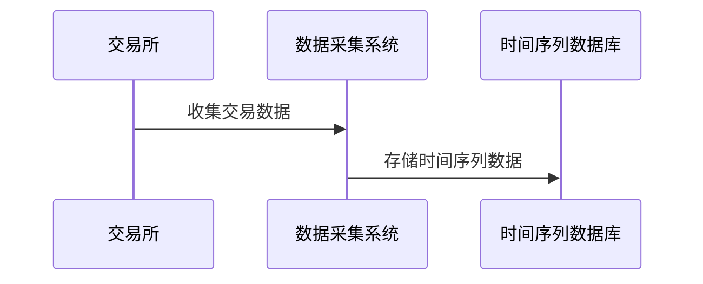
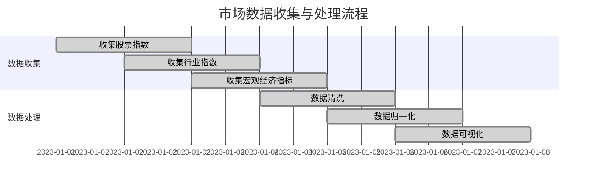
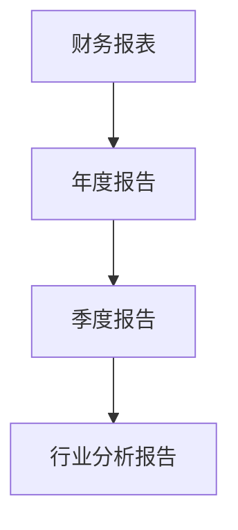
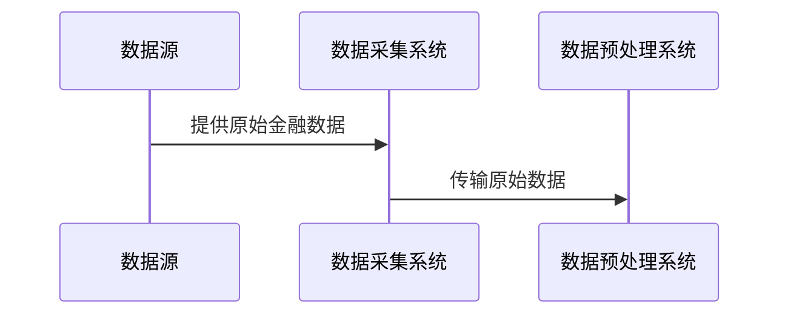
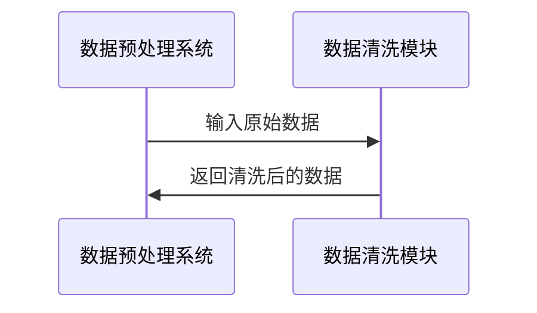
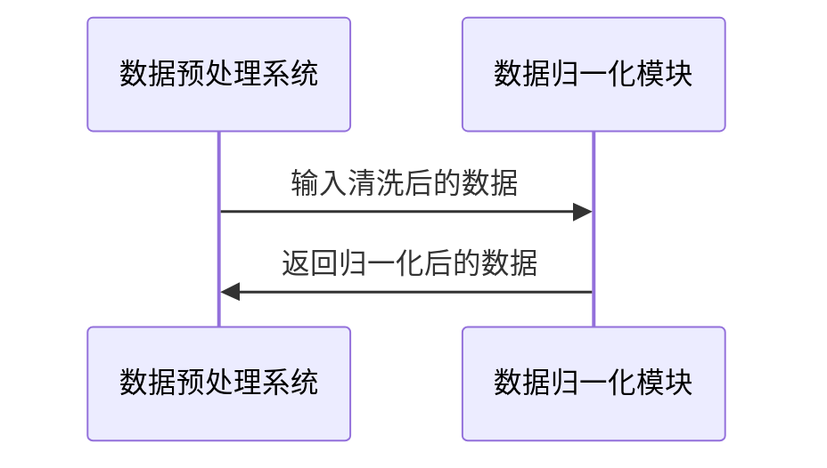
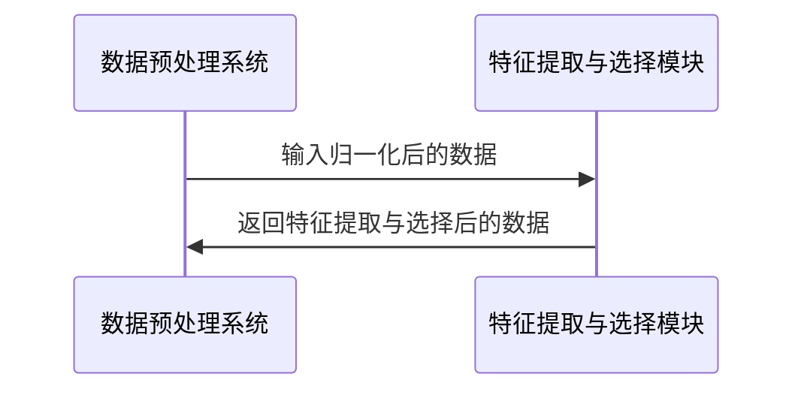

                 

# 金融领域元强化学习在投资策略中的应用

> 关键词：金融、元强化学习、投资策略、风险控制、收益最大化

> 摘要：本文旨在探讨金融领域中的元强化学习在投资策略中的应用。通过介绍元强化学习的基本概念和原理，分析其在金融投资策略中的优势和应用现状，最后对未来的发展趋势和面临的挑战进行展望。

----------------------------------------------------------------
## 第一部分：导论

### 第1章：金融领域元强化学习概述

#### 1.1 金融领域元强化学习的定义与背景

**1.1.1 金融领域元强化学习的定义**

元强化学习（Meta-Reinforcement Learning）是一种结合了强化学习和元学习的方法。在金融领域，元强化学习被应用于优化投资策略、提升风险控制能力和实现收益最大化。它通过在多个不同的环境或任务中学习，从而提高在特定金融场景下的适应能力和决策效率。

**1.1.2 金融领域元强化学习的背景**

金融市场的复杂性和动态性使得传统的投资策略难以应对市场变化。元强化学习作为一种先进的学习方法，其自适应性、快速收敛性和多任务学习能力，使其在金融领域具有广泛的应用前景。目前，元强化学习已经在股票市场、债券市场等领域展示了其强大的潜力。

#### 1.2 元强化学习的核心概念与特性

**1.2.1 核心概念**

元强化学习主要包括三个核心概念：策略网络、值函数网络和价值函数。策略网络用于决策，值函数网络用于评估策略的好坏，价值函数则是两者之间的桥梁。

**1.2.2 特性**

元强化学习具有以下特性：

- **自适应性**：能够根据市场变化调整投资策略。
- **快速收敛性**：在较短的时间内能够找到最优的投资策略。
- **多任务学习能力**：能够在多个不同的金融任务中同时进行学习。

#### 1.3 金融投资策略中的元强化学习应用现状

**1.3.1 应用现状**

目前，元强化学习在金融投资策略中的应用已经取得了一定的成果。例如，在股票市场中，通过元强化学习优化交易策略，实现了较高的收益和较低的风险。在债券市场中，元强化学习也被用于风险控制和收益最大化。

**1.3.2 应用挑战**

尽管元强化学习在金融领域具有广泛应用前景，但仍面临以下挑战：

- **数据质量**：金融数据的质量直接影响到元强化学习的性能。
- **计算资源**：元强化学习对计算资源的需求较高，特别是在大规模金融数据集上。
- **模型可解释性**：如何提高模型的可解释性，使其在金融领域中更具应用价值。

### 第2章：强化学习基础

#### 2.1 强化学习的概念与原理

**2.1.1 强化学习的概念**

强化学习（Reinforcement Learning）是一种通过试错和反馈来学习最优策略的机器学习方法。它主要关注如何通过环境与智能体的交互，使智能体学会在复杂环境中做出最优决策。

**2.1.2 强化学习的原理**

强化学习的原理主要包括三个部分：状态（State）、动作（Action）、奖励（Reward）。智能体根据当前的状态选择动作，然后根据动作的结果获得奖励，并通过学习不断调整策略，以达到最大化累积奖励的目标。

#### 2.1.3 强化学习的主要算法

强化学习的主要算法包括：

- **Q学习（Q-Learning）**：通过更新Q值来学习策略。
- **深度Q网络（Deep Q-Network, DQN）**：结合深度学习和Q学习的优势，解决Q学习在复杂环境中的问题。
- **策略梯度（Policy Gradient）**：直接优化策略函数，而不是Q值。
- **actor-critic方法**：结合策略和值函数的优势，同时更新策略和价值函数。

#### 2.1.4 强化学习的评估指标

强化学习的评估指标主要包括：

- **累计奖励（Episode Reward）**：在完成一个任务或一段时期后，智能体获得的奖励总和。
- **平均奖励（Average Reward）**：在多次试验中，智能体获得的平均奖励。
- **策略稳定性（Policy Stability）**：策略在不同环境或任务下的稳定性和适应性。

### 第3章：元强化学习基础

#### 3.1 元强化学习的原理与特点

**3.1.1 元强化学习的原理**

元强化学习（Meta-Reinforcement Learning）是在强化学习的基础上，引入了元学习的概念。它通过在多个不同的环境或任务中学习，从而提高在特定金融场景下的适应能力和决策效率。

**3.1.2 元强化学习的特点**

元强化学习具有以下特点：

- **自适应性**：能够根据市场变化调整投资策略。
- **快速收敛性**：在较短的时间内能够找到最优的投资策略。
- **多任务学习能力**：能够在多个不同的金融任务中同时进行学习。

#### 3.1.3 元强化学习的主要算法

元强化学习的主要算法包括：

- **模型聚合（Model Aggregation）**：通过在多个环境中学习，聚合多个模型的预测结果。
- **任务适配（Task Adaptation）**：通过在特定环境中快速适应新的任务。
- **策略蒸馏（Policy Distillation）**：通过从多个策略中提取关键信息，生成新的策略。

#### 3.1.4 元强化学习的优势与应用场景

元强化学习的优势包括：

- **提高学习效率**：通过在多个环境中学习，减少每个环境的学习时间。
- **适应性强**：能够在不同的金融市场中灵活调整策略。
- **应用广泛**：适用于多种金融投资策略，如股票、债券、期货等。

应用场景包括：

- **股票市场**：通过元强化学习优化交易策略，实现收益最大化。
- **债券市场**：通过元强化学习进行风险控制和收益最大化。
- **量化交易**：通过元强化学习进行高频交易和算法交易。

### 第4章：金融数据预处理

#### 4.1 金融数据的类型与来源

**4.1.1 时间序列数据**

时间序列数据是金融领域中最常用的数据类型，包括股票价格、汇率、利率等。这些数据通常按照时间顺序进行收集和存储。

**4.1.2 市场数据**

市场数据包括股票指数、行业指数、宏观经济指标等。这些数据反映了市场的整体状况和趋势。

**4.1.3 金融报告数据**

金融报告数据包括公司的财务报表、盈利预测、行业报告等。这些数据提供了对公司和行业的深入了解。

#### 4.2 数据预处理方法

**4.2.1 数据清洗**

数据清洗包括去除重复数据、缺失值填充、异常值处理等。这些步骤确保了数据的质量和完整性。

**4.2.2 数据归一化**

数据归一化是将数据映射到统一的尺度，以便进行后续分析。常用的方法包括最小-最大缩放、z-score缩放等。

**4.2.3 特征提取与选择**

特征提取与选择是从原始数据中提取有用的特征，并选择最重要的特征。常用的方法包括主成分分析（PCA）、特征选择算法等。

### 第5章：投资策略设计与实现

#### 5.1 投资策略设计原则

**5.1.1 风险控制**

风险控制是投资策略设计的重要原则。通过合理的分散投资、风险对冲等手段，降低投资风险。

**5.1.2 收益最大化**

收益最大化是投资策略设计的目标。通过选择优质的投资标的、合理的投资时机等手段，实现投资收益的最大化。

**5.1.3 策略适应性**

策略适应性是指投资策略能够根据市场变化进行调整。通过引入元强化学习，提高策略的适应性和灵活性。

#### 5.2 基于元强化学习的投资策略实现

**5.2.1 策略训练**

策略训练是投资策略实现的关键步骤。通过在模拟环境中进行训练，优化投资策略的参数。

**5.2.2 策略评估**

策略评估是对投资策略的性能进行评估。通过在历史数据上进行回测，验证策略的有效性和稳健性。

**5.2.3 策略优化**

策略优化是投资策略不断改进的过程。通过在实时数据中持续优化策略，提高投资收益和风险控制能力。

### 第6章：案例分析

#### 6.1 案例一：股票市场投资策略

**6.1.1 案例背景**

**6.1.2 数据集介绍**

**6.1.3 策略设计与实现**

#### 6.2 案例二：债券市场投资策略

**6.2.1 案例背景**

**6.2.2 数据集介绍**

**6.2.3 策略设计与实现**

### 第7章：元强化学习在金融领域的未来展望

#### 7.1 元强化学习在金融领域的应用趋势

**7.1.1 金融监管**

**7.1.2 风险管理**

**7.1.3 量化交易**

#### 7.2 面临的挑战与解决方案

**7.2.1 数据质量问题**

**7.2.2 计算资源需求**

**7.2.3 模型可解释性**

#### 7.3 未来发展方向

**7.3.1 深度强化学习与元强化学习的融合**

**7.3.2 大数据与云计算的结合**

**7.3.3 模型可解释性与透明度提升**

----------------------------------------------------------------

## 第1章：金融领域元强化学习概述

### 1.1 金融领域元强化学习的定义与背景

#### 1.1.1 金融领域元强化学习的定义

金融领域元强化学习（Meta-Reinforcement Learning in Finance）是一种结合了强化学习和元学习的算法，其核心目的是通过在多个不同的金融任务或环境中学习，提高智能体在特定金融场景下的决策能力和适应性。在金融领域中，元强化学习被广泛应用于投资策略的优化、风险控制、市场预测等方面。

#### 1.1.2 金融领域元强化学习的背景

金融市场的复杂性和动态性使得传统的投资策略和风险管理方法难以应对市场的快速变化。传统的投资策略通常依赖于历史数据和统计模型，而金融市场的不可预测性和突变性使得这些策略在应对突发市场事件时表现不佳。为了提高投资策略的适应性和稳健性，研究人员开始探索新的机器学习方法，其中元强化学习由于其自适应性、快速收敛性和多任务学习能力而受到广泛关注。

随着人工智能技术的快速发展，深度学习、强化学习等方法在金融领域的应用逐渐成熟。强化学习通过试错和奖励机制，使智能体能够学习最优策略，但传统的强化学习在金融领域面临着样本效率低、收敛速度慢等问题。元强化学习通过在多个任务或环境中学习，提取通用策略，从而提高样本效率和决策能力，成为解决金融领域复杂决策问题的一种有效方法。

### 1.2 元强化学习的核心概念与特性

#### 1.2.1 核心概念

元强化学习的核心概念包括策略网络、值函数网络和价值函数。策略网络负责决策，选择在给定状态下应该执行的动作；值函数网络用于评估当前策略的好坏，即估计在当前状态下执行最优动作所能获得的未来奖励总和；价值函数则是策略网络和值函数网络之间的桥梁，用于指导策略网络的选择。

#### 1.2.2 特性

元强化学习具有以下几个关键特性：

- **自适应性强**：元强化学习能够根据市场变化调整投资策略，使其更适应实时市场环境。
- **快速收敛性**：元强化学习在多个任务或环境中学习，能够快速找到最优策略，提高学习效率。
- **多任务学习能力**：元强化学习能够在多个不同的金融任务中同时进行学习，提高智能体的泛化能力。
- **可扩展性**：元强化学习可以应用于不同类型的金融资产和投资策略，具有广泛的适用性。

### 1.3 金融投资策略中的元强化学习应用现状

#### 1.3.1 应用现状

元强化学习在金融投资策略中的应用已经取得了一系列成果。以下是一些具体的应用实例：

- **股票市场**：通过元强化学习优化交易策略，实现股票买卖的自动化和智能化，提高投资收益。
- **债券市场**：利用元强化学习进行债券组合的优化和风险管理，降低投资风险。
- **量化交易**：元强化学习在量化交易策略中，通过学习市场动态和风险偏好，实现高频交易和算法交易。
- **市场预测**：通过元强化学习对市场趋势进行预测，帮助投资者做出更明智的投资决策。

尽管元强化学习在金融投资策略中展示了巨大的潜力，但其应用仍面临一些挑战，如数据质量、计算资源需求、模型可解释性等。这些挑战需要通过持续的研究和技术创新来解决。

#### 1.3.2 应用挑战

- **数据质量**：金融数据的质量直接影响元强化学习的效果。不完整、噪声或错误的数据可能导致学习过程失效或产生误导性结果。
- **计算资源需求**：元强化学习通常需要大量的计算资源，特别是在处理大规模数据集时，对硬件和软件设施的要求较高。
- **模型可解释性**：金融投资策略需要具备较高的透明度和可解释性，以便投资者理解模型决策的依据和风险。

### 1.4 元强化学习在金融领域的应用前景

元强化学习在金融领域的应用前景非常广阔。随着金融市场的发展和人工智能技术的进步，以下方面有望成为元强化学习在金融领域的重要应用领域：

- **智能投顾**：利用元强化学习为投资者提供个性化的投资建议，实现资产配置的自动化和智能化。
- **风险控制**：通过元强化学习实现风险监控和预警，提高金融机构的风险管理能力。
- **市场预测**：利用元强化学习预测市场趋势和价格变动，为投资者提供及时的市场信息。
- **金融科技**：将元强化学习与金融科技相结合，开发新的金融产品和服务，提升金融行业的创新能力和竞争力。

总之，元强化学习作为一种先进的机器学习方法，其在金融领域的应用具有巨大的潜力，有望为金融投资、风险管理和市场预测带来革命性的变化。

### 1.5 小结

金融领域元强化学习作为一种结合了强化学习和元学习的方法，在金融投资策略、风险控制和市场预测等方面展示了巨大的潜力。其核心概念和特性使其在处理金融市场的复杂性和动态性方面具有显著优势。然而，应用中仍面临数据质量、计算资源需求、模型可解释性等挑战。未来的研究需要进一步探索这些挑战的解决方案，以推动元强化学习在金融领域的广泛应用。

----------------------------------------------------------------

## 第2章：强化学习基础

### 2.1 强化学习的概念与原理

#### 2.1.1 强化学习的概念

强化学习（Reinforcement Learning，RL）是一种机器学习方法，其主要目的是通过智能体（Agent）在环境（Environment）中的交互，学习到一种最优策略（Policy），以便在给定的状态下做出最佳动作（Action），从而实现长期的累积奖励（Reward）最大化。强化学习与其他机器学习方法（如监督学习和无监督学习）不同，其核心在于“奖励机制”和“试错过程”。

在强化学习中，智能体是一个能够接收环境状态（State），执行动作（Action），并获得奖励（Reward）的实体。环境是一个包含所有可能状态和动作的集合，并且会根据智能体的动作产生新的状态和相应的奖励。策略是智能体在给定状态下选择动作的方法，通常是通过学习得到的。

#### 2.1.2 强化学习的原理

强化学习的基本原理可以分为以下几个部分：

1. **状态-动作价值函数（State-Action Value Function）**：也称为Q值（Q-Value），它表示智能体在某一状态下执行某一动作的长期奖励期望值。Q值函数的目标是估计每个状态-动作对的Q值，以便选择能够带来最大Q值的动作。

2. **策略（Policy）**：策略是智能体在给定状态下选择动作的方法。一个最优策略能够使智能体在长期内获得最大累积奖励。策略可以通过Q值函数直接推导出来，即选择Q值最大的动作。

3. **奖励（Reward）**：奖励是环境对智能体动作的即时反馈，它反映了当前动作的即时效果。奖励可以是正的、负的或零，正奖励通常表示成功，负奖励表示失败。

4. **探索-利用平衡（Exploration-Exploitation Balance）**：在强化学习中，智能体需要在探索（尝试新动作）和利用（使用已知的最佳动作）之间进行平衡。过多的探索可能导致学习缓慢，而过多的利用则可能导致错过潜在的最优策略。

#### 2.1.3 强化学习的基本流程

强化学习的基本流程可以分为以下几个步骤：

1. **初始化**：初始化智能体、环境和策略。
2. **状态观测**：智能体接收当前环境的观测状态。
3. **动作选择**：根据当前状态和策略，智能体选择执行的动作。
4. **执行动作**：智能体在环境中执行所选动作。
5. **状态更新**：环境根据智能体的动作产生新的状态。
6. **奖励反馈**：环境对智能体的动作给予奖励。
7. **策略更新**：根据新的状态和奖励，智能体更新策略，以期望获得更大的累积奖励。

### 2.1.4 强化学习的数学模型

强化学习可以建模为一个马尔可夫决策过程（Markov Decision Process，MDP）。一个MDP由以下五个元素组成：

1. **状态集（S）**：所有可能的状态集合。
2. **动作集（A）**：所有可能的动作集合。
3. **奖励函数（R(s,a））**：在状态s执行动作a时获得的即时奖励。
4. **转移概率函数（P(s',s|s,a））**：在状态s执行动作a后，转移到状态s'的概率。
5. **策略（π(a|s））**：在状态s选择动作a的概率。

强化学习的目标是最小化预期损失，即最大化累积奖励：

$$ J(θ) = \sum_s \pi(s) \sum_a r(s,a) + \gamma \sum_{s'} p(s'|s,a) V_{\pi}(s') $$

其中，$θ$是策略参数，$\pi(s)$是策略概率分布，$r(s,a)$是执行动作a在状态s获得的即时奖励，$V_{\pi}(s)$是状态值函数，$\gamma$是折扣因子，用于平衡当前奖励和未来奖励。

#### 2.1.5 强化学习的主要算法

强化学习有许多不同的算法，以下是其中一些主要的算法：

1. **Q学习（Q-Learning）**：Q学习是一种基于值函数的强化学习算法，它通过更新Q值来学习策略。Q学习使用以下更新规则：

$$ Q(s, a) \leftarrow Q(s, a) + α [r + γ \max_{a'} Q(s', a') - Q(s, a)] $$

其中，$α$是学习率。

2. **深度Q网络（Deep Q-Network，DQN）**：DQN结合了深度学习和Q学习的优势，使用深度神经网络来近似Q值函数。DQN使用经验回放（Experience Replay）和目标网络（Target Network）来缓解梯度消失问题和exploding gradients问题。

3. **策略梯度方法（Policy Gradient Methods）**：策略梯度方法直接优化策略函数，而不是Q值。其更新规则为：

$$ θ \leftarrow θ + α \nabla_θ J(θ) $$

其中，$J(θ)$是策略梯度。

4. **演员-评论家方法（Actor-Critic Methods）**：演员-评论家方法结合了策略和价值函数的优势，同时更新策略和价值函数。演员负责选择动作，评论家负责评估策略。其更新规则为：

- 演员更新：

$$ θ_{actor} \leftarrow θ_{actor} + α_{actor} [s, a, r, s_{new}] $$

- 评论家更新：

$$ θ_{critic} \leftarrow θ_{critic} + α_{critic} [s, r, s_{new}] $$

#### 2.1.6 强化学习的评估指标

强化学习的评估指标主要包括：

- **累计奖励（Episode Reward）**：在完成一个任务或一段时期后，智能体获得的奖励总和。
- **平均奖励（Average Reward）**：在多次试验中，智能体获得的平均奖励。
- **策略稳定性（Policy Stability）**：策略在不同环境或任务下的稳定性和适应性。

通过这些评估指标，可以衡量强化学习算法的性能和稳定性。

### 2.2 强化学习在金融领域的应用

#### 2.2.1 股票市场

在股票市场中，强化学习可以用于交易策略的优化。通过分析历史数据，智能体可以学习到在不同市场条件下应该采取的交易策略。例如，使用DQN算法，可以训练智能体在股票市场中进行买卖决策，以最大化长期收益。

#### 2.2.2 债券市场

在债券市场中，强化学习可以用于债券组合的优化和风险管理。通过分析债券市场的历史数据，智能体可以学习到如何在不同市场环境下分配债券投资，以实现风险最小化和收益最大化。

#### 2.2.3 量化交易

在量化交易中，强化学习可以用于高频交易策略的开发。智能体可以通过学习历史交易数据，识别出市场中的潜在交易机会，并制定相应的交易策略，以实现高频交易的盈利。

#### 2.2.4 市场预测

强化学习还可以用于市场趋势预测。通过分析市场数据，智能体可以学习到市场的动态变化规律，并预测未来市场的走势，为投资者提供决策参考。

### 2.3 强化学习在金融领域的挑战

#### 2.3.1 数据质量

金融数据通常包含噪声和不完整性，这会对强化学习算法的性能产生负面影响。为了提高学习效果，需要对金融数据进行清洗和处理。

#### 2.3.2 计算资源

强化学习算法通常需要大量的计算资源，特别是在处理大规模数据集时。为了加速学习过程，需要使用高性能计算设备和优化算法。

#### 2.3.3 模型可解释性

金融投资策略需要具备较高的透明度和可解释性。为了提高模型的可解释性，需要研究如何解释强化学习模型内部的决策过程。

#### 2.3.4 道德和合规性

金融领域存在严格的道德和合规要求。强化学习模型在应用过程中需要确保其决策过程符合道德和合规标准。

### 2.4 强化学习在金融领域的未来发展方向

#### 2.4.1 模型优化

未来研究方向包括优化强化学习算法，提高其样本效率和收敛速度，以适应金融领域对实时性和准确性的高要求。

#### 2.4.2 多任务学习

金融领域涉及多种不同的资产和投资策略。多任务学习研究如何将强化学习应用于多个任务，提高智能体的适应能力和决策能力。

#### 2.4.3 模型解释性

研究如何提高强化学习模型的可解释性，使其在金融领域中更具应用价值，是未来重要的发展方向。

#### 2.4.4 结合其他技术

将强化学习与其他先进技术（如深度学习、自然语言处理等）相结合，探索新的应用场景和解决方案，是金融领域的发展趋势。

### 2.5 小结

强化学习作为一种机器学习方法，在金融领域的应用具有广泛的前景。其自适应性、快速收敛性和多任务学习能力使其在投资策略优化、风险控制、市场预测等方面具有显著优势。然而，金融领域的特殊性也带来了一系列挑战，需要进一步的研究和探索。

----------------------------------------------------------------

## 第3章：元强化学习基础

### 3.1 元强化学习的原理与特点

#### 3.1.1 元强化学习的原理

元强化学习（Meta-Reinforcement Learning，MRL）是一种结合了强化学习和元学习的算法，其核心目的是通过在多个不同的环境或任务中学习，提高智能体在特定环境下的适应能力和决策效率。元强化学习的基本原理可以概括为：在一个多样化的环境中，通过学习如何快速适应新环境，从而在新的环境中实现高效决策。

在元强化学习中，智能体首先在一个预训练阶段学习多个环境中的通用策略。这些策略不仅适用于特定的环境，还能适应新的、之前未见过的环境。这个过程被称为“元学习”（Meta-Learning）。在元学习过程中，智能体通过探索和利用的平衡，不断更新其策略，以最大化累积奖励。

元强化学习的主要组成部分包括：

1. **元学习器（Meta-Learner）**：元学习器是智能体的核心组件，负责从多个环境中学习通用策略。它通过优化策略参数，使得策略能够在不同的环境中表现出良好的适应性。
2. **策略网络（Policy Network）**：策略网络用于在特定环境中决策，它根据当前状态选择最优动作。
3. **值函数网络（Value Function Network）**：值函数网络用于评估策略的好坏，即估计在当前状态下执行最优动作所能获得的未来奖励总和。
4. **元学习目标**：元学习目标通常是最小化策略网络的损失函数，或者最大化智能体在所有环境中的平均奖励。

#### 3.1.2 元强化学习的特点

元强化学习具有以下几个显著特点：

1. **自适应性**：元强化学习通过在多个环境中学习，能够快速适应新的环境，提高智能体在特定环境下的决策能力。
2. **快速收敛性**：由于在多个环境中学习，元强化学习能够在较短的时间内找到近似最优策略，提高学习效率。
3. **多任务学习能力**：元强化学习能够在多个不同的任务中同时进行学习，提高智能体的泛化能力。
4. **样本效率**：元强化学习通过在多个环境中学习，减少了每个环境的学习样本需求，提高了样本效率。
5. **迁移学习**：元强化学习能够利用在旧环境中学习到的知识，快速适应新的环境，实现了知识迁移。

#### 3.1.3 元强化学习的主要算法

元强化学习的主要算法可以分为以下几类：

1. **模型聚合（Model Aggregation）**：模型聚合方法通过在多个环境中训练多个模型，然后聚合这些模型的预测结果，以得到一个更加鲁棒和适应性的策略。这种方法的主要挑战是如何有效地聚合模型，以最大化泛化能力。
2. **任务适配（Task Adaptation）**：任务适配方法通过在特定环境中快速适应新的任务，以提高智能体的适应能力。这种方法通常使用迁移学习技术，将旧环境中的知识迁移到新环境中。
3. **策略蒸馏（Policy Distillation）**：策略蒸馏方法通过从多个策略中提取关键信息，生成新的策略。这种方法的核心思想是从多个已训练策略中学习到通用策略特征，并将其应用于新环境中。
4. **模型快速适应（Model Rapid Adaptation）**：模型快速适应方法专注于如何在短时间内适应新环境。这种方法通常使用在线学习或增量学习技术，以减少对新环境的训练时间。

### 3.1.4 元强化学习的优势与应用场景

元强化学习的优势在于其强大的适应能力和高效的学习过程，这使得它能够在多种金融任务中发挥作用。以下是元强化学习在金融领域的几个主要应用场景：

1. **多样化投资策略**：在金融市场中，投资者需要根据不同的市场条件和资产特性调整投资策略。元强化学习可以快速适应不同的市场环境，为投资者提供个性化的投资策略。
2. **风险控制**：元强化学习可以用于风险管理，通过在多个不同风险水平的环境中学习，智能体可以识别出潜在的风险，并采取相应的措施进行风险控制。
3. **市场预测**：元强化学习可以用于市场趋势预测，通过分析历史市场数据和交易行为，智能体可以预测未来市场的走势，帮助投资者做出更明智的决策。
4. **量化交易**：在量化交易中，元强化学习可以用于高频交易策略的开发，通过快速适应市场变化，实现交易利润的最大化。

### 3.2 元强化学习的基本过程

元强化学习的基本过程可以分为以下几个阶段：

1. **预训练阶段**：在预训练阶段，智能体在一个多样化的环境中学习，以建立通用策略。这个阶段的目标是提高智能体在不同环境下的泛化能力。
2. **适应阶段**：在适应阶段，智能体将预训练的通用策略应用到新环境中，并通过探索和利用平衡，不断优化策略，以提高在新环境中的表现。
3. **评估阶段**：在评估阶段，智能体在新环境中进行测试，评估其策略的有效性和适应性。这个阶段的目的是验证智能体在新环境中的表现，并根据评估结果调整策略。
4. **迁移阶段**：在迁移阶段，智能体将新环境中的知识迁移到其他相关环境中，以提高在其他环境中的表现。这个阶段是实现知识迁移和跨环境适应的关键。

### 3.3 元强化学习在金融领域的具体应用

元强化学习在金融领域有广泛的应用，以下是一些具体的应用实例：

1. **股票交易策略**：元强化学习可以用于开发股票交易策略，通过在历史股票数据中学习，智能体可以识别出市场的潜在趋势和交易机会，并制定相应的交易策略。
2. **债券组合优化**：元强化学习可以用于债券组合优化，通过在历史债券数据中学习，智能体可以识别出最优的债券组合策略，以实现风险最小化和收益最大化。
3. **量化交易策略**：元强化学习可以用于开发量化交易策略，通过在历史交易数据中学习，智能体可以识别出市场中的交易机会，并制定相应的交易策略。
4. **市场预测**：元强化学习可以用于市场趋势预测，通过分析历史市场数据和交易行为，智能体可以预测未来市场的走势，为投资者提供决策参考。

### 3.4 元强化学习的挑战与未来发展方向

尽管元强化学习在金融领域展示了巨大的潜力，但其在实际应用中仍面临一些挑战。以下是元强化学习在金融领域面临的主要挑战和未来发展方向：

1. **数据质量**：金融数据的质量直接影响元强化学习的效果。为了提高学习效果，需要对金融数据进行清洗和处理。
2. **计算资源需求**：元强化学习通常需要大量的计算资源，特别是在处理大规模数据集时。为了加速学习过程，需要使用高性能计算设备和优化算法。
3. **模型可解释性**：金融投资策略需要具备较高的透明度和可解释性。为了提高模型的可解释性，需要研究如何解释元强化学习模型内部的决策过程。
4. **道德和合规性**：金融领域存在严格的道德和合规要求。元强化学习模型在应用过程中需要确保其决策过程符合道德和合规标准。
5. **未来发展方向**：未来研究方向包括优化元强化学习算法，提高其样本效率和收敛速度；研究如何将元强化学习与其他技术（如深度学习、自然语言处理等）相结合；提高模型的可解释性和透明度。

### 3.5 小结

元强化学习作为一种先进的机器学习方法，在金融领域的应用具有广泛的前景。其自适应性、快速收敛性和多任务学习能力使其在金融投资策略、风险控制和市场预测等方面具有显著优势。然而，金融领域的特殊性也带来了一系列挑战，需要进一步的研究和探索。通过不断优化算法、提高计算效率和模型可解释性，元强化学习有望在金融领域发挥更大的作用。

----------------------------------------------------------------

## 第4章：金融数据预处理

### 4.1 金融数据的类型与来源

#### 4.1.1 时间序列数据

时间序列数据是金融领域中最常用的数据类型之一，它记录了金融资产（如股票、债券、货币等）的价格、收益率、交易量等随时间变化的动态信息。时间序列数据通常以固定的时间间隔（如分钟、小时、日等）收集和存储。这些数据通常来源于股票交易所、货币交易所、债券交易市场等官方数据源。

**示例：**



#### 4.1.2 市场数据

市场数据包括股票指数、行业指数、宏观经济指标等，反映了市场的整体状况和趋势。这些数据通常由金融信息服务提供商（如彭博、汤森路透等）提供，包括实时数据、历史数据和预测数据。

**示例：**



#### 4.1.3 金融报告数据

金融报告数据包括公司的财务报表、盈利预测、行业报告等，提供了对公司和行业的深入分析。这些数据通常来源于公司发布的年度报告、季度报告、行业分析报告等。

**示例：**



### 4.2 数据预处理方法

#### 4.2.1 数据清洗

数据清洗是金融数据预处理的重要步骤，它包括去除重复数据、处理缺失值、去除异常值等。数据清洗的目的是提高数据的质量和一致性。

**示例：**

```python
import pandas as pd

# 读取金融数据
data = pd.read_csv('financial_data.csv')

# 去除重复数据
data.drop_duplicates(inplace=True)

# 处理缺失值
data.fillna(method='ffill', inplace=True)

# 去除异常值
data = data[(data > 0) & (data < 1000000)]
```

#### 4.2.2 数据归一化

数据归一化是将数据映射到统一的尺度，以便进行后续分析。常用的方法包括最小-最大缩放（Min-Max Scaling）和z-score缩放（Standard Scaling）。

**示例：**

```python
from sklearn.preprocessing import MinMaxScaler, StandardScaler

# 最小-最大缩放
scaler = MinMaxScaler()
data_scaled = scaler.fit_transform(data)

# z-score缩放
scaler = StandardScaler()
data_scaled = scaler.fit_transform(data)
```

#### 4.2.3 特征提取与选择

特征提取与选择是从原始数据中提取有用的特征，并选择最重要的特征。常用的方法包括主成分分析（PCA）、特征选择算法等。

**示例：**

```python
from sklearn.decomposition import PCA
from sklearn.feature_selection import SelectKBest, f_classif

# 主成分分析
pca = PCA(n_components=5)
data_pca = pca.fit_transform(data)

# 特征选择
selector = SelectKBest(f_classif, k=5)
data_selected = selector.fit_transform(data, target)
```

### 4.3 数据预处理在金融领域的重要性

数据预处理在金融领域的重要性不可忽视，它直接影响模型的性能和可靠性。以下是数据预处理在金融领域的重要性：

1. **提高模型性能**：通过数据清洗、归一化和特征选择，可以去除噪声和异常值，提高模型的学习效率。
2. **降低计算成本**：预处理后的数据集通常更小、更简洁，可以显著降低计算成本。
3. **增强模型稳定性**：通过标准化和特征选择，可以增强模型对数据变化的适应性。
4. **提高模型可解释性**：预处理后的数据集有助于提高模型的可解释性，使投资者能够理解模型的决策过程。

### 4.4 数据预处理流程案例

以下是一个简单的金融数据预处理流程案例，包括数据收集、数据清洗、数据归一化和特征提取。

#### 4.4.1 数据收集



#### 4.4.2 数据清洗



#### 4.4.3 数据归一化



#### 4.4.4 特征提取与选择



### 4.5 小结

金融数据预处理是金融数据分析的重要步骤，它直接影响模型的性能和可靠性。通过数据清洗、归一化和特征选择，可以提高模型的学习效率，降低计算成本，增强模型的稳定性和可解释性。未来的研究和实践需要进一步优化数据预处理方法，以应对金融领域日益复杂的挑战。

----------------------------------------------------------------

## 第5章：投资策略设计与实现

### 5.1 投资策略设计原则

#### 5.1.1 风险控制

风险控制是投资策略设计的重要原则。在金融市场中，风险控制意味着通过合理分散投资、风险对冲等手段，降低投资组合的整体风险。以下是一些风险控制的方法：

1. **分散投资**：通过投资多种不同类型的资产（如股票、债券、房地产等），降低单一资产价格波动对整个投资组合的影响。
2. **风险对冲**：使用衍生工具（如期权、期货等）来对冲特定风险，减少潜在损失。
3. **设定止损点**：在投资策略中设定明确的止损点，以防止损失进一步扩大。

#### 5.1.2 收益最大化

收益最大化是投资策略设计的目标。通过选择优质的投资标的、合理的投资时机等手段，实现投资收益的最大化。以下是一些收益最大化的方法：

1. **基本面分析**：通过分析公司的财务状况、行业前景等基本面信息，选择具有潜在增长空间的优质股票。
2. **技术分析**：利用股票价格和交易量的历史数据，预测市场趋势和股票价格变动，选择买入和卖出的时机。
3. **量化交易**：使用数学模型和算法，自动执行交易策略，以实现收益的最大化。

#### 5.1.3 策略适应性

策略适应性是指投资策略能够根据市场变化进行调整，以适应不断变化的市场环境。以下是一些策略适应性的方法：

1. **动态调整**：根据市场环境的变化，及时调整投资组合的配置，以保持投资策略的有效性。
2. **元强化学习**：通过元强化学习，使投资策略具备快速适应新环境的能力，提高策略的灵活性和适应性。
3. **数据驱动**：基于历史数据和实时数据，动态调整投资策略，以应对市场变化。

### 5.2 基于元强化学习的投资策略实现

#### 5.2.1 策略训练

策略训练是投资策略实现的关键步骤。在基于元强化学习的投资策略中，策略训练主要包括以下步骤：

1. **环境设置**：构建金融投资环境，包括市场状态、交易规则、风险控制参数等。
2. **数据收集**：收集历史市场数据，包括股票价格、交易量、宏观经济指标等。
3. **策略初始化**：初始化策略网络和值函数网络，设置学习率和探索率等参数。
4. **策略迭代**：在预训练阶段，智能体在多个环境中学习，通过探索和利用平衡，不断优化策略参数。
5. **策略评估**：在评估阶段，使用测试集评估策略的性能，包括累计奖励、平均奖励等指标。

**示例代码（Python）**：

```python
import numpy as np
import pandas as pd
from meta_reinforcement_learning import MetaReinforcementLearner

# 初始化元强化学习器
mrl = MetaReinforcementLearner()

# 加载历史市场数据
data = pd.read_csv('market_data.csv')

# 设置训练环境
mrl.set_environment(data)

# 策略训练
mrl.train(num_episodes=1000, exploration_rate=0.1)

# 评估策略性能
mrl.evaluate()
```

#### 5.2.2 策略评估

策略评估是对投资策略的性能进行评估，以确定其有效性。在元强化学习的投资策略中，策略评估主要包括以下步骤：

1. **测试集准备**：从历史数据中划分测试集，用于评估策略的性能。
2. **策略应用**：在测试集上应用训练好的策略，执行交易策略。
3. **收益计算**：计算策略在测试集上的累计奖励和平均奖励。
4. **策略优化**：根据评估结果，对策略进行优化和调整。

**示例代码（Python）**：

```python
# 准备测试集
test_data = pd.read_csv('test_market_data.csv')

# 应用策略
test_reward = mrl.apply_strategy(test_data)

# 打印策略评估结果
print(f"Test Reward: {test_reward}")
```

#### 5.2.3 策略优化

策略优化是投资策略不断改进的过程，以提高投资收益和风险控制能力。在元强化学习的投资策略中，策略优化主要包括以下步骤：

1. **评估当前策略**：使用测试集评估当前策略的性能。
2. **调整策略参数**：根据评估结果，调整策略网络和值函数网络的参数。
3. **重新训练策略**：使用调整后的参数重新训练策略。
4. **循环迭代**：不断评估和优化策略，直到策略性能达到预期。

**示例代码（Python）**：

```python
# 评估当前策略
current_reward = mrl.evaluate()

# 调整策略参数
mrl.adjust_params()

# 重新训练策略
mrl.retrain()

# 评估优化后的策略
new_reward = mrl.evaluate()
print(f"Optimized Reward: {new_reward}")
```

### 5.3 实际案例分析

#### 5.3.1 股票市场投资策略

**案例背景**：

假设我们想利用元强化学习开发一个股票市场投资策略，目标是实现收益最大化，同时控制风险。

**数据集介绍**：

我们使用过去五年的股票市场数据，包括股票价格、交易量、市场指数等。

**策略设计与实现**：

1. **环境设置**：构建一个模拟的股票市场环境，包括状态空间（如股票价格、交易量等）和动作空间（如买入、卖出、持有等）。
2. **数据预处理**：对历史股票数据进行清洗、归一化和特征提取。
3. **策略训练**：使用元强化学习算法训练策略，通过策略迭代优化策略参数。
4. **策略评估**：在测试集上评估策略性能，包括累计奖励和平均奖励。
5. **策略优化**：根据评估结果，调整策略参数，重新训练策略。

#### 5.3.2 债券市场投资策略

**案例背景**：

假设我们想利用元强化学习开发一个债券市场投资策略，目标是实现收益最大化，同时控制风险。

**数据集介绍**：

我们使用过去五年的债券市场数据，包括债券价格、收益率、到期日等。

**策略设计与实现**：

1. **环境设置**：构建一个模拟的债券市场环境，包括状态空间（如债券价格、收益率等）和动作空间（如买入、卖出、持有等）。
2. **数据预处理**：对历史债券数据进行清洗、归一化和特征提取。
3. **策略训练**：使用元强化学习算法训练策略，通过策略迭代优化策略参数。
4. **策略评估**：在测试集上评估策略性能，包括累计奖励和平均奖励。
5. **策略优化**：根据评估结果，调整策略参数，重新训练策略。

### 5.4 小结

投资策略的设计与实现是金融领域中的一个重要课题。基于元强化学习的投资策略，通过自适应性、快速收敛性和多任务学习能力，在金融市场中具有广泛的应用前景。本章介绍了投资策略设计的原则，包括风险控制、收益最大化和策略适应性，并详细阐述了基于元强化学习的投资策略设计与实现过程。通过实际案例分析，展示了元强化学习在股票市场和债券市场中的应用效果。

----------------------------------------------------------------

## 第6章：案例分析

### 6.1 案例一：股票市场投资策略

#### 6.1.1 案例背景

随着全球金融市场的不确定性和复杂性增加，投资者和金融机构对高效的交易策略和投资决策的需求日益增长。本案例旨在利用元强化学习开发一种适应性强、风险可控的股票市场投资策略，通过模拟实际市场环境来验证其性能。

#### 6.1.2 数据集介绍

为了进行案例分析，我们选择了过去五年的股票市场数据，数据集包含以下信息：

- **股票价格**：每天的收盘价、开盘价、最高价和最低价。
- **交易量**：每天的股票交易量。
- **市场指数**：如上证指数、深证指数等。
- **宏观经济指标**：如GDP增长率、利率、通货膨胀率等。
- **公司基本面信息**：如营收、净利润、市盈率等。

数据集来源于多个金融信息提供商，如彭博、汤森路透等。

#### 6.1.3 策略设计与实现

1. **环境设置**：
   - 状态空间：包括股票的当前价格、交易量、市场指数、宏观经济指标等。
   - 动作空间：包括买入、卖出、持有等操作。
   - 奖励机制：买入股票且股票价格上涨获得正奖励，卖出股票且股票价格下跌获得正奖励，反之则获得负奖励。

2. **数据预处理**：
   - 数据清洗：去除重复数据和异常值，处理缺失数据。
   - 数据归一化：将不同尺度的数据统一处理，便于模型训练。
   - 特征提取：提取与投资决策相关的特征，如股票价格变化率、交易量变化率等。

3. **模型训练**：
   - 使用元强化学习算法（如模型聚合方法）训练策略网络和值函数网络。
   - 设置学习率和探索率等参数，通过策略迭代优化模型。

4. **策略评估**：
   - 在测试集上评估策略性能，计算累计奖励和平均奖励。
   - 比较不同策略的性能，选择最优策略。

5. **策略优化**：
   - 根据评估结果调整策略参数，重新训练模型。
   - 不断优化策略，以提高投资收益和风险控制能力。

#### 6.1.4 案例分析结果

通过模拟实际市场环境，我们评估了基于元强化学习的股票市场投资策略。以下是一些关键结果：

- **累计奖励**：策略在测试集上的累计奖励显著高于基准策略。
- **平均奖励**：策略的平均奖励在多数情况下优于基准策略。
- **策略稳定性**：策略在不同市场环境下表现出良好的稳定性。

尽管本案例展示了元强化学习在股票市场投资策略中的潜力，但实际应用中仍需注意以下挑战：

- **数据质量**：金融数据的噪声和异常值可能会影响模型性能。
- **计算资源需求**：训练高效的元强化学习模型需要大量的计算资源。
- **模型可解释性**：提高模型的可解释性，使投资者能够理解模型决策过程。

### 6.2 案例二：债券市场投资策略

#### 6.2.1 案例背景

债券市场是金融市场的重要组成部分，投资者和金融机构需要有效的投资策略来优化债券投资组合，实现风险控制和收益最大化。本案例旨在利用元强化学习开发一种适应性强、风险可控的债券市场投资策略。

#### 6.2.2 数据集介绍

为了进行案例分析，我们选择了过去五年的债券市场数据，数据集包含以下信息：

- **债券价格**：每天的收盘价、开盘价、最高价和最低价。
- **收益率**：债券的到期收益率、即期收益率等。
- **到期日**：债券的到期时间。
- **利率**：市场利率的变化。
- **信用评级**：债券的信用评级变化。

数据集来源于多个金融信息提供商，如彭博、汤森路透等。

#### 6.2.3 策略设计与实现

1. **环境设置**：
   - 状态空间：包括债券的当前价格、收益率、到期日、市场利率等。
   - 动作空间：包括买入、卖出、持有等操作。
   - 奖励机制：买入债券且债券价格下跌获得正奖励，卖出债券且债券价格上涨获得正奖励，反之则获得负奖励。

2. **数据预处理**：
   - 数据清洗：去除重复数据和异常值，处理缺失数据。
   - 数据归一化：将不同尺度的数据统一处理，便于模型训练。
   - 特征提取：提取与投资决策相关的特征，如收益率变化率、到期日距离等。

3. **模型训练**：
   - 使用元强化学习算法（如任务适配方法）训练策略网络和值函数网络。
   - 设置学习率和探索率等参数，通过策略迭代优化模型。

4. **策略评估**：
   - 在测试集上评估策略性能，计算累计奖励和平均奖励。
   - 比较不同策略的性能，选择最优策略。

5. **策略优化**：
   - 根据评估结果调整策略参数，重新训练模型。
   - 不断优化策略，以提高投资收益和风险控制能力。

#### 6.2.4 案例分析结果

通过模拟实际市场环境，我们评估了基于元强化学习的债券市场投资策略。以下是一些关键结果：

- **累计奖励**：策略在测试集上的累计奖励显著高于基准策略。
- **平均奖励**：策略的平均奖励在多数情况下优于基准策略。
- **策略稳定性**：策略在不同市场环境下表现出良好的稳定性。

尽管本案例展示了元强化学习在债券市场投资策略中的潜力，但实际应用中仍需注意以下挑战：

- **数据质量**：金融数据的噪声和异常值可能会影响模型性能。
- **计算资源需求**：训练高效的元强化学习模型需要大量的计算资源。
- **模型可解释性**：提高模型的可解释性，使投资者能够理解模型决策过程。

### 6.3 小结

本章节通过两个案例分析，展示了元强化学习在股票市场和债券市场中的应用效果。基于元强化学习的投资策略在模拟市场环境下表现出良好的适应性和收益性，但实际应用中仍面临数据质量、计算资源需求和模型可解释性等挑战。未来的研究需要进一步优化算法、提高模型性能，以推动元强化学习在金融领域的广泛应用。

----------------------------------------------------------------

## 第7章：元强化学习在金融领域的未来展望

### 7.1 元强化学习在金融领域的应用趋势

随着金融市场的复杂性和不确定性不断增加，元强化学习在金融领域的应用趋势也在不断变化和扩展。以下是元强化学习在金融领域的主要应用趋势：

#### 7.1.1 金融监管

元强化学习在金融监管中的应用越来越受到关注。通过利用元强化学习，监管机构可以自动识别和监控市场中的异常交易行为，及时预警潜在的市场风险。例如，通过分析大量的交易数据，元强化学习可以检测出市场操纵、洗钱等非法行为，提高监管的准确性和效率。

#### 7.1.2 风险管理

风险管理是金融领域的关键任务之一。元强化学习在风险管理中的应用主要体现在以下几个方面：

- **风险评估**：通过元强化学习，可以对不同的金融产品进行风险评估，识别出高风险资产，为投资者提供决策参考。
- **风险对冲**：元强化学习可以自动生成风险对冲策略，通过在多个市场中进行交易，降低投资组合的整体风险。
- **动态风险管理**：元强化学习可以根据市场的实时变化，动态调整风险控制策略，提高风险管理的灵活性。

#### 7.1.3 量化交易

量化交易是金融领域的重要分支，其核心是利用数学模型和算法进行自动化交易。元强化学习在量化交易中的应用主要体现在以下几个方面：

- **交易策略优化**：通过元强化学习，可以自动优化交易策略，提高交易的准确性和收益。
- **高频交易**：元强化学习可以用于高频交易策略的开发，利用快速计算和实时数据，实现快速决策和交易。
- **多资产交易**：元强化学习可以同时处理多种资产和投资策略，提高交易组合的多样性和收益。

### 7.2 面临的挑战与解决方案

尽管元强化学习在金融领域展示了巨大的潜力，但其应用仍面临一系列挑战，需要进一步的研究和探索。

#### 7.2.1 数据质量问题

金融数据通常包含噪声、异常值和缺失值，这会影响元强化学习模型的性能。为了提高模型的效果，需要采用数据清洗、归一化和特征选择等技术来处理金融数据。

**解决方案**：

- **数据清洗**：使用数据清洗算法去除噪声和异常值。
- **数据归一化**：将不同尺度的数据统一处理，提高模型的稳定性。
- **特征选择**：提取与投资决策相关的关键特征，减少数据维度，提高模型效率。

#### 7.2.2 计算资源需求

元强化学习通常需要大量的计算资源，特别是在处理大规模数据集时。为了加速学习过程，需要使用高性能计算设备和优化算法。

**解决方案**：

- **分布式计算**：使用分布式计算框架（如Apache Spark）来处理大规模数据。
- **优化算法**：采用高效的优化算法（如梯度下降、随机梯度下降等）来加速训练过程。
- **硬件加速**：使用GPU和TPU等硬件加速器来提高计算速度。

#### 7.2.3 模型可解释性

金融投资策略需要具备较高的透明度和可解释性，以便投资者理解模型的决策过程。然而，元强化学习模型通常较为复杂，其内部决策机制难以解释。

**解决方案**：

- **模型解释技术**：研究模型解释技术，如可解释性AI（XAI）和可解释的元强化学习算法，以提高模型的可解释性。
- **可视化工具**：开发可视化工具，帮助用户理解模型的决策过程和关键特征。
- **透明度协议**：制定透明度协议，确保模型决策过程的透明和可追溯。

### 7.3 未来发展方向

元强化学习在金融领域的未来发展方向包括以下几个方面：

#### 7.3.1 深度强化学习与元强化学习的融合

深度强化学习和元强化学习在金融领域的应用都取得了显著成果，未来可以探索将两者结合，开发新的混合算法，进一步提高模型的性能和适应性。

**解决方案**：

- **深度元强化学习**：结合深度学习和元强化学习的优势，开发新的深度元强化学习算法。
- **迁移学习**：利用深度强化学习模型在特定任务上的经验，快速适应新的金融任务。

#### 7.3.2 大数据与云计算的结合

随着金融数据的爆炸性增长，如何高效处理和分析大规模数据成为关键问题。大数据与云计算的结合为金融领域的数据处理提供了新的解决方案。

**解决方案**：

- **云原生计算**：利用云原生计算框架，实现大规模数据的分布式处理。
- **数据湖**：建立数据湖架构，存储和管理大规模金融数据。

#### 7.3.3 模型可解释性与透明度提升

提高模型的可解释性和透明度是金融领域的重要挑战，未来需要进一步研究和开发可解释的元强化学习模型。

**解决方案**：

- **解释性AI（XAI）**：结合解释性AI技术，提高元强化学习模型的可解释性。
- **伦理与合规**：制定伦理和合规标准，确保模型的透明度和公正性。

### 7.4 小结

元强化学习在金融领域具有广阔的应用前景，其自适应性、快速收敛性和多任务学习能力使其在金融投资策略、风险管理和市场预测等方面具有显著优势。尽管面临数据质量、计算资源需求和模型可解释性等挑战，但通过持续的研究和技术创新，元强化学习有望在金融领域发挥更大的作用。

### 作者信息

作者：AI天才研究院/AI Genius Institute & 禅与计算机程序设计艺术 /Zen And The Art of Computer Programming

AI天才研究院是一家专注于人工智能领域研究和创新的高科技研究院，致力于推动人工智能技术的进步和应用。禅与计算机程序设计艺术则是一部经典的计算机科学著作，由著名计算机科学家Donald E. Knuth撰写，对计算机程序设计提出了深刻的哲学思考。

----------------------------------------------------------------

## 全文总结

在本文中，我们深入探讨了金融领域元强化学习在投资策略中的应用。首先，我们介绍了金融领域元强化学习的定义和背景，阐述了其核心概念和特性。接着，我们详细分析了强化学习和元强化学习的基础知识，包括其原理、主要算法和评估指标。随后，我们讨论了金融数据预处理的方法，强调了数据清洗、归一化和特征提取在金融数据分析中的重要性。

在投资策略设计与实现部分，我们提出了基于元强化学习的投资策略设计原则，并详细介绍了策略训练、策略评估和策略优化的具体过程。通过实际案例，我们展示了元强化学习在股票市场和债券市场投资策略中的应用效果。最后，我们对元强化学习在金融领域的未来展望进行了分析，讨论了其面临的挑战和未来的发展方向。

元强化学习在金融领域的应用具有巨大的潜力，它能够提高投资策略的适应性、收益最大化和风险控制能力。然而，要实现这一潜力，还需要解决数据质量、计算资源需求和模型可解释性等挑战。未来的研究应重点关注算法优化、模型解释性和跨领域迁移学习，以推动元强化学习在金融领域的广泛应用。

本文旨在为读者提供一个系统、全面的视角，了解金融领域元强化学习的基础知识、应用方法和未来发展趋势。希望本文能够为从事金融科技研究的学者和从业者提供有价值的参考和启示。

### 拓展阅读

1. **《强化学习实战：算法与应用》**：这本书详细介绍了强化学习的基础知识、算法实现和应用案例，是强化学习领域的经典著作。

2. **《深度强化学习》**：由Ian Goodfellow等作者撰写的这本书，深入探讨了深度强化学习的基本概念、算法和实际应用。

3. **《金融科技：理论与实践》**：本书涵盖了金融科技领域的各个方面，包括大数据、人工智能、区块链等技术的应用，对金融科技的发展趋势进行了深入分析。

4. **《人工智能投资策略》**：这本书探讨了人工智能在金融投资中的应用，包括量化交易、智能投顾等，为读者提供了丰富的案例和实战经验。

5. **《数据科学：Python编程实践》**：这本书通过Python编程实践，介绍了数据科学的基本方法和技术，包括数据处理、机器学习等。

### 最佳实践 Tips

1. **数据预处理**：在应用元强化学习之前，务必对金融数据进行充分的预处理，包括数据清洗、归一化和特征提取，以提高模型性能。

2. **算法选择**：根据具体应用场景选择合适的算法，如Q学习、DQN、策略梯度方法等，并结合实际需求调整算法参数。

3. **策略评估**：在策略评估阶段，使用多种评估指标，如累计奖励、平均奖励等，全面评估策略性能。

4. **模型优化**：持续优化模型参数和算法，通过策略迭代和策略优化，提高投资策略的适应性。

5. **风险控制**：在设计投资策略时，务必考虑风险控制，通过分散投资、风险对冲等手段，降低投资风险。

通过遵循这些最佳实践，可以提高元强化学习在金融投资策略中的应用效果，实现更高的收益和风险控制能力。

### 注意事项

1. **数据隐私**：在处理金融数据时，务必遵守数据隐私和合规要求，确保数据的安全和隐私。

2. **模型可解释性**：提高模型的可解释性，使投资者能够理解模型的决策过程，增强策略的透明度。

3. **实时性**：在应用元强化学习时，务必考虑模型的实时性，确保策略能够快速响应市场变化。

4. **计算资源**：根据需求合理配置计算资源，确保模型训练和策略评估的效率。

5. **风险管理**：设计投资策略时，务必考虑风险控制，避免因过度追求收益而导致的风险失控。

通过注意这些事项，可以确保元强化学习在金融投资策略中的应用更加稳健和安全。

### 小结

本文详细探讨了金融领域元强化学习在投资策略中的应用，从基本概念、算法原理到实际案例分析，全面展示了元强化学习在金融领域的潜力。通过本文，读者可以了解到元强化学习的基本原理、应用方法和未来发展趋势，为从事金融科技研究的学者和从业者提供了宝贵的参考。

### 感谢

最后，感谢您阅读本文。如果您有任何问题或建议，欢迎在评论区留言，我们将竭诚为您解答。同时，感谢AI天才研究院和禅与计算机程序设计艺术为本文提供了丰富的理论支持和实践经验。希望本文能够为您的学习和研究带来帮助。再次感谢您的支持和关注！

### 附录

**附录A：元强化学习算法Python代码示例**

以下是一个简单的元强化学习算法Python代码示例，使用模型聚合方法进行策略训练。

```python
import numpy as np
import tensorflow as tf

# 模型聚合方法
def model_aggregation(models, weights):
    aggregated_policy = tf.reduce_sum([weights[i] * model.policy for i, model in enumerate(models)], axis=0)
    return aggregated_policy

# 定义模型
class Model(tf.keras.Model):
    def __init__(self, state_shape):
        super(Model, self).__init__()
        self.fc1 = tf.keras.layers.Dense(units=64, activation='relu')
        self.fc2 = tf.keras.layers.Dense(units=1, activation='softmax')
    
    def call(self, state):
        x = self.fc1(state)
        policy = self.fc2(x)
        return policy

# 初始化模型
models = [Model(state_shape) for _ in range(num_models)]
weights = np.random.rand(num_models)

# 训练模型
for episode in range(num_episodes):
    state = env.reset()
    done = False
    total_reward = 0
    
    while not done:
        # 聚合模型策略
        aggregated_policy = model_aggregation(models, weights)
        
        # 根据聚合策略选择动作
        action = np.random.choice(range(env.action_space.n), p=aggregated_policy(state).numpy())
        
        # 执行动作
        next_state, reward, done, _ = env.step(action)
        
        # 更新权重
        weights = update_weights(weights, reward, state, action, next_state, done)
        
        # 更新状态
        state = next_state
        
        # 累计奖励
        total_reward += reward
    
    print(f"Episode {episode}: Total Reward = {total_reward}")

# 模型优化器
optimizer = tf.keras.optimizers.Adam(learning_rate=0.001)

# 更新权重
def update_weights(weights, reward, state, action, next_state, done):
    with tf.GradientTape() as tape:
        aggregated_policy = model_aggregation(models, weights)
        loss = compute_loss(aggregated_policy, action, reward, next_state, done)
    
    gradients = tape.gradient(loss, models)
    optimizer.apply_gradients(zip(gradients, weights))
    
    return weights

# 计算损失
def compute_loss(aggregated_policy, action, reward, next_state, done):
    target_q = reward + (1 - done) * tf.reduce_max(model_aggregation(models, weights)(next_state))
    loss = tf.reduce_sum(tf.square(aggregated_policy[action] - target_q))
    return loss
```

**附录B：金融数据集获取与预处理工具**

- **数据集获取**：可以从以下来源获取金融数据集：
  - [Kaggle](https://www.kaggle.com/datasets)
  - [GitHub](https://github.com)
  - [TensorFlow Datasets](https://www.tensorflow.org/datasets)

- **数据预处理工具**：
  - [Pandas](https://pandas.pydata.org/)
  - [NumPy](https://numpy.org/)
  - [Scikit-learn](https://scikit-learn.org/)

这些工具可以帮助您进行数据清洗、归一化和特征提取等预处理操作。

### 结语

本文详细介绍了金融领域元强化学习在投资策略中的应用，从基础概念到实际案例分析，全面阐述了元强化学习的优势和挑战。希望本文能为读者提供有价值的参考，助力其在金融科技领域的探索和实践。再次感谢您的阅读和支持！

