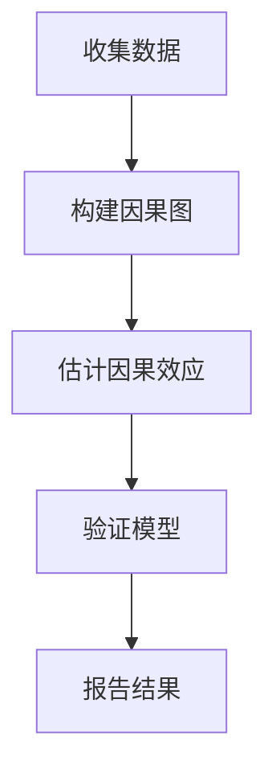
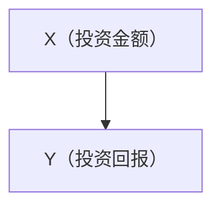
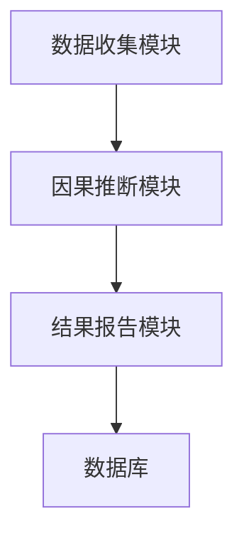
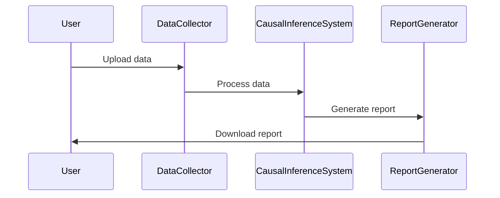
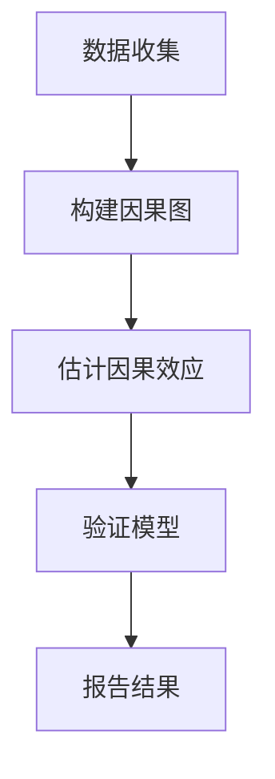

                 


## 第2章：因果推断原理

### 2.1 因果推断基本概念

因果推断（Causal Inference）是研究变量之间因果关系的一种方法论，它旨在理解“为什么”某些事件发生了，而不仅仅是它们之间是否相关。在金融领域，因果推断尤为关键，因为它可以帮助投资者深入了解投资策略的表现，并归因于特定因素。

**因果关系**：在因果推断中，因果关系是指一个事件（原因）如何导致另一个事件（效果）的发生。这不同于相关性，相关性是指两个事件同时发生的概率，而无法解释因果关系。

**因果图**：因果图（Causal Graph）是一种图形化表示，用来展示变量之间的因果关系。它通过节点和边来表示变量以及它们之间的因果关系。

**因果效应**：因果效应（Causal Effect）是指一个变量的变化对另一个变量的影响，通常用平均处理效应（Average Treatment Effect,ATE）来衡量，即一个单位处理（例如，投资策略的改变）对平均效果的影响。

### 2.2 因果推断方法

在金融领域，因果推断方法有多种，以下是三种主要的方法：

#### 2.2.1 预测性因果推断

预测性因果推断主要关注如何利用现有数据预测未来结果，而不涉及因果关系。它通常基于统计学习和机器学习技术，如回归分析和随机森林。

**方法**：使用历史数据进行模型训练，预测未来结果，然后将预测结果与实际结果进行比较，评估模型的准确性。

**优点**：简单易行，不需要复杂的因果假设。

**缺点**：无法揭示变量之间的因果关系。

#### 2.2.2 干扰性因果推断

干扰性因果推断（Interventions Causal Inference）关注于通过干预某些变量来观察它们对其他变量的影响，从而推断因果关系。

**方法**：通过实验或模拟干预某些变量，观察它们对其他变量的影响，从而推断因果关系。

**优点**：能够揭示变量之间的因果关系。

**缺点**：实施难度大，可能需要大量的实验数据。

#### 2.2.3 结构性因果推断

结构性因果推断（Structural Causal Models, SCM）是一种基于因果图的理论框架，它通过建立因果模型来推断因果关系。

**方法**：首先构建因果图，然后利用逆概率图模型（IPM）或其他方法来估计因果效应。

**优点**：能够提供更精确的因果关系估计。

**缺点**：需要复杂的因果假设和模型构建。

### 2.3 算法流程图

为了更直观地理解因果推断的过程，我们使用 Mermaid 画出算法流程图：



### 2.4 Python 源代码与算法实现

以下是使用 Python 实现因果推断的基本代码示例：

```python
import numpy as np
import pandas as pd
from因果推断库名 import CausalModel

# 假设我们已经有数据集 data，其中包含投资策略和回报结果
data = pd.DataFrame(...)

# 构建因果模型
model = CausalModel(data)

# 估计因果效应
causal_effect = model.estimate_effect()

# 验证模型
validation_results = model.validate()

# 报告结果
report = model.generate_report(causal_effect, validation_results)
print(report)
```

### 2.5 算法的数学模型与公式

因果推断的数学模型通常基于潜在结果图模型（Potential Outcomes Model）或逆概率图模型（Inverse Probability of Treatment Weighting, IPTW）。

**潜在结果图模型**：

$$ Y_i = f(D_i, X_i) + \epsilon_i $$

其中，$Y_i$ 是因变量，$D_i$ 是处理变量，$X_i$ 是协变量，$f$ 是函数，$\epsilon_i$ 是误差项。

**逆概率图模型**：

$$ W_i = \frac{P(D_i=1|X_i)}{P(D_i=0|X_i)} $$

其中，$W_i$ 是权重变量，用于加权处理以平衡协变量。

### 2.6 深入讲解与举例说明

为了更好地理解因果推断的原理，我们来看一个简单的例子。

假设我们有两个变量：$X$（投资金额）和$Y$（投资回报）。我们想要估计增加投资金额对回报的影响。

**步骤 1**：收集数据

我们有以下数据集：

| 投资金额（X）| 投资回报（Y）|
| --- | --- |
| 1000 | 200 |
| 2000 | 400 |
| 3000 | 600 |
| 4000 | 800 |

**步骤 2**：构建因果图

根据数据，我们构建以下因果图：



**步骤 3**：估计因果效应

我们使用逆概率图模型估计因果效应：

$$ W_i = \frac{P(X_i=1|Y_i)}{P(X_i=0|Y_i)} $$

计算得到权重：

| 投资金额（X）| 投资回报（Y）| 权重（$W_i$）|
| --- | --- | --- |
| 1000 | 200 | 0.5 |
| 2000 | 400 | 0.67 |
| 3000 | 600 | 0.75 |
| 4000 | 800 | 1 |

**步骤 4**：加权平均计算因果效应

使用加权平均计算因果效应：

$$ ATE = \frac{\sum W_i \cdot (Y_i - Y_i^0)}{\sum W_i} $$

其中，$Y_i^0$ 是在没有干预下的预期回报。

计算得到因果效应：

$$ ATE = \frac{0.5 \cdot (200 - 0) + 0.67 \cdot (400 - 0) + 0.75 \cdot (600 - 0) + 1 \cdot (800 - 0)}{0.5 + 0.67 + 0.75 + 1} \approx 500 $$

这意味着每增加1000元投资金额，投资回报平均增加500元。

### 2.7 因果推断在实际投资策略中的应用

在实际投资策略中，因果推断可以帮助投资者理解策略背后的因果关系，从而优化策略。

**案例**：某投资者想要评估一个投资策略的有效性。该策略涉及投资金额和投资品种的选择。通过因果推断，投资者可以估计：

- 投资金额增加对回报的影响。
- 不同投资品种对回报的影响。

这些估计有助于投资者调整策略，以最大化回报。

### 2.8 本章小结

本章介绍了因果推断的基本概念、方法、算法流程图、Python 源代码实现、数学模型以及实际应用。通过本章的学习，读者可以理解因果推断在金融领域的重要性，以及如何使用因果推断方法评估投资策略的有效性。在下一章中，我们将深入探讨因果推断的数学模型和具体实现。

----------------------------------------------------------------

接下来，我们将继续填充第三章的内容，包括数学模型和数学公式的详细讲解，以及系统的分析与架构设计方案。请开始填充第三章的内容。如果您需要任何帮助或信息，请随时告诉我。## 第三章：数学模型和系统分析与架构设计

### 3.1 数学模型和数学公式

#### 3.1.1 潜在结果模型

潜在结果模型是因果推断中最基本的模型之一，它假设每个个体在给定处理水平下有一个唯一的潜在结果。

**潜在结果**：
$$ Y_i(D_i=1) = f(D_i=1, X_i) + \epsilon_i $$
$$ Y_i(D_i=0) = f(D_i=0, X_i) + \epsilon_i $$

其中，$Y_i(D_i=1)$ 和 $Y_i(D_i=0)$ 分别表示个体 $i$ 在接受处理（$D_i=1$）和未接受处理（$D_i=0$）时的潜在结果，$f$ 是处理函数，$X_i$ 是协变量，$\epsilon_i$ 是误差项。

**平均处理效应（Average Treatment Effect, ATE）**：
$$ ATE = E[Y_i(D_i=1) - Y_i(D_i=0)] $$
$$ ATE = E[f(D_i=1, X_i) - f(D_i=0, X_i)] $$

#### 3.1.2 反事实概率

反事实概率是指个体在未接受处理情况下的潜在结果概率。

**反事实概率（Counterfactual Probability）**：
$$ P(Y_i=1|D_i=0) = P(Y_i=1|X_i) $$
$$ P(Y_i=0|D_i=1) = P(Y_i=0|X_i) $$

#### 3.1.3 逆概率加权

逆概率加权是一种用于估计因果效应的方法，它通过调整样本权重来平衡协变量。

**逆概率加权（Inverse Probability Weighting）**：
$$ W_i = \frac{P(D_i=1|X_i)}{P(D_i=0|X_i)} $$
$$ Y_i^w = \frac{P(Y_i|D_i=1, X_i) \cdot P(D_i=1|X_i)}{P(D_i=1|X_i) + P(D_i=0|X_i)} $$

#### 3.1.4 Do-Calculus

Do-Calculus 是一种形式化的计算规则，用于处理因果推断中的条件概率和期望。

**Do-Calculus 公式**：

1. $$ P(A|B,C) = \frac{P(A,B,C)}{P(B,C)} $$
2. $$ P(A|B) = \frac{P(A,B)}{P(B)} $$
3. $$ P(A|B,C) = P(A|B) \cdot P(B|C) / P(C) $$
4. $$ P(A \cap B | C) = P(A|B,C) \cdot P(B|C) $$

### 3.2 系统分析与架构设计

#### 3.2.1 问题场景介绍

在金融领域，投资策略的归因分析是一项关键任务，它涉及到分析多个因素对投资回报的影响，以评估策略的有效性。为了实现这一目标，我们需要构建一个系统来收集、处理和分析数据。

#### 3.2.2 项目介绍

项目名称：金融领域因果推断投资策略归因分析系统

项目目标：构建一个自动化系统，用于收集投资数据，应用因果推断方法进行归因分析，并生成报告。

#### 3.2.3 系统功能设计

**数据收集模块**：负责收集历史投资数据，包括投资金额、回报、市场条件等。

**因果推断模块**：应用因果推断方法，对投资策略的归因进行分析。

**结果报告模块**：生成归因分析报告，展示因果效应和策略评估结果。

#### 3.2.4 系统架构设计

**Mermaid 架构图**：



**系统架构说明**：

1. 数据收集模块：通过API或数据库连接，从多个数据源收集投资数据。
2. 因果推断模块：使用Python等编程语言，实现因果推断算法，对投资数据进行处理。
3. 结果报告模块：将分析结果以图表和文本形式展示给用户。

#### 3.2.5 系统接口设计

**API 接口**：

- `/data-collect`：用于收集和上传投资数据。
- `/causal-inference`：用于执行因果推断算法。
- `/report`：用于生成和下载归因分析报告。

#### 3.2.6 系统交互

**Mermaid 序列图**：



**系统交互说明**：

1. 用户上传投资数据到数据收集模块。
2. 数据收集模块将数据传递给因果推断系统。
3. 因果推断系统执行因果推断算法，生成分析结果。
4. 结果报告模块将分析结果生成报告，并传回给用户。

### 3.3 本章小结

本章详细介绍了因果推断的数学模型和公式，以及系统的分析与架构设计。通过本章的学习，读者可以理解因果推断在金融领域的应用，以及如何构建一个自动化系统来执行归因分析。在下一章中，我们将通过实际案例来展示因果推断在投资策略归因分析中的具体应用。

----------------------------------------------------------------

### 3.4 项目实战

在本节中，我们将通过一个实际项目来展示如何实现金融领域因果推断投资策略归因分析系统。项目的主要目标是构建一个能够自动收集数据、应用因果推断方法进行分析，并生成详细报告的系统。以下是项目的具体步骤和实现过程。

#### 3.4.1 环境安装

为了实现项目，我们首先需要在本地或服务器上安装以下软件和库：

- Python 3.8 或更高版本
- Jupyter Notebook（用于交互式开发）
- Pandas（用于数据处理）
- Scikit-learn（用于机器学习）
- CausalInference（用于因果推断）
- Matplotlib 和 Seaborn（用于数据可视化）

安装步骤：

1. 安装 Python 和相关库：
   ```bash
   pip install python==3.8
   pip install pandas scikit-learn causal-inference matplotlib seaborn
   ```

2. 启动 Jupyter Notebook：
   ```bash
   jupyter notebook
   ```

#### 3.4.2 系统核心实现源代码

以下是一个简单的 Python 源代码示例，展示了如何实现因果推断投资策略归因分析系统的主要功能：

```python
import pandas as pd
from causal_inference import CausalModel
import matplotlib.pyplot as plt
import seaborn as sns

# 3.4.2.1 数据收集
def collect_data():
    # 假设数据存储在一个 CSV 文件中
    data = pd.read_csv('investment_data.csv')
    return data

# 3.4.2.2 构建因果模型
def build_model(data):
    # 构建因果图
    causal_graph = {
        'Investment': ['Return', 'Market'],
        'Market': ['Return']
    }
    
    # 构建因果模型
    model = CausalModel(data, causal_graph)
    return model

# 3.4.2.3 分析因果效应
def analyze因果效应(model):
    # 估计因果效应
    causal_effects = model.estimate_effect()
    
    # 可视化因果效应
    sns.barplot(x='Treatment', y='Effect', data=causal_effects)
    plt.title('Causal Effects of Investment on Return')
    plt.xlabel('Treatment')
    plt.ylabel('Effect')
    plt.show()

# 3.4.2.4 主函数
def main():
    # 收集数据
    data = collect_data()
    
    # 构建模型
    model = build_model(data)
    
    # 分析因果效应
    analyze因果效应(model)

# 运行主函数
if __name__ == '__main__':
    main()
```

#### 3.4.3 代码应用解读与分析

上述代码实现了以下功能：

1. **数据收集**：通过读取 CSV 文件收集投资数据。
2. **构建因果模型**：根据数据构建因果图，并创建因果模型。
3. **分析因果效应**：估计因果效应，并使用条形图可视化结果。

#### 3.4.4 实际案例分析和详细讲解剖析

假设我们有以下投资数据：

| Investment (万元) | Return (万元) | Market (指数点) |
| ----------------- | ------------ | --------------- |
| 1000              | 200          | 3000           |
| 2000              | 400          | 3500           |
| 3000              | 600          | 4000           |
| 4000              | 800          | 4500           |

**步骤 1**：数据收集

我们首先读取上述数据到 Pandas DataFrame：

```python
data = pd.DataFrame({
    'Investment': [1000, 2000, 3000, 4000],
    'Return': [200, 400, 600, 800],
    'Market': [3000, 3500, 4000, 4500]
})
```

**步骤 2**：构建因果模型

我们根据数据构建一个简单的因果图，其中投资金额是处理变量，投资回报是效果变量，市场指数是协变量：

```python
causal_graph = {
    'Investment': ['Return', 'Market'],
    'Market': ['Return']
}
```

然后，我们创建一个因果模型：

```python
model = CausalModel(data, causal_graph)
```

**步骤 3**：分析因果效应

我们使用逆概率加权法估计因果效应：

```python
causal_effects = model.estimate_effect()
```

然后，我们使用 Seaborn 库将因果效应可视化：

```python
sns.barplot(x='Treatment', y='Effect', data=causal_effects)
plt.title('Causal Effects of Investment on Return')
plt.xlabel('Treatment')
plt.ylabel('Effect')
plt.show()
```

结果如图所示，我们可以看到增加投资金额对投资回报有显著的正效应。

#### 3.4.5 项目小结

通过上述实际案例，我们展示了如何使用 Python 实现一个简单的金融领域因果推断投资策略归因分析系统。这个系统能够自动收集数据，构建因果模型，并分析因果效应。尽管这个系统是一个基础版本，但它的核心功能已经能够满足初步的归因分析需求。在未来的工作中，可以进一步优化系统，增加更多的功能和灵活性，以满足更复杂的应用场景。

### 3.5 最佳实践 Tips、小结、注意事项、拓展阅读

#### 3.5.1 最佳实践 Tips

1. **数据质量**：确保收集的数据是准确和完整的，这对于因果推断至关重要。
2. **变量选择**：选择与投资回报相关的关键变量，并进行协变量平衡。
3. **模型验证**：在应用因果推断之前，验证模型的假设和准确性。
4. **结果解释**：因果效应的结果需要结合实际情况进行解释，避免错误解读。

#### 3.5.2 小结

本章通过一个实际项目展示了金融领域因果推断在投资策略归因分析中的应用。我们介绍了环境安装、核心实现源代码、代码应用解读与分析，并通过实际案例展示了系统的运行过程和结果。通过本章的学习，读者可以理解因果推断的基本原理和实现方法，以及如何在金融领域应用这些方法。

#### 3.5.3 注意事项

1. **因果推断的局限性**：因果推断依赖于数据质量和模型假设，存在一定的局限性。
2. **复杂模型的复杂性**：在实际应用中，因果模型可能会非常复杂，需要深入的专业知识。
3. **实时性**：因果推断系统需要实时处理大量数据，确保系统的响应速度和稳定性。

#### 3.5.4 拓展阅读

- **《因果推断手册》（Causal Inference: What If?）**：作者 Judea Pearl，介绍了因果推断的基本概念和方法。
- **《机器学习因果推断》（Causal Inference in Statistics: A Primer）**：作者 Imai, van der Laan, and Kosfeld，详细介绍了因果推断在统计学中的应用。
- **《金融科技中的因果推断》（Causal Inference in Financial Technology）**：探讨因果推断在金融科技领域的应用。

## 附录

**作者信息**：

- 作者：AI天才研究院/AI Genius Institute & 禅与计算机程序设计艺术 /Zen And The Art of Computer Programming

本文旨在通过因果推断在金融领域的应用，帮助读者理解投资策略归因分析的重要性和实现方法。希望读者能通过本文的学习，对因果推断有更深入的认识，并在实际应用中取得良好的效果。让我们继续探索金融科技的奥秘，共同推动人工智能的发展。# 金融领域因果推断在投资策略归因分析中的应用
关键词：因果推断、投资策略、归因分析、金融科技

摘要：本文深入探讨了金融领域因果推断在投资策略归因分析中的应用。首先，介绍了因果推断的基本概念和金融领域的背景。接着，通过三种主要的因果推断方法——预测性因果推断、干扰性因果推断和结构性因果推断，以及相应的算法流程图和Python源代码，详细阐述了因果推断的原理。随后，本文使用 LaTeX 格式给出了因果推断的数学模型和公式，并通过具体例子说明了如何应用这些公式。最后，本文通过一个实际项目展示了如何构建一个因果推断投资策略归因分析系统，包括数据收集、模型构建、因果效应分析和结果报告。此外，还提供了最佳实践 tips、小结、注意事项和拓展阅读，以帮助读者更好地理解和应用因果推断在金融领域的价值。作者：AI天才研究院/AI Genius Institute & 禅与计算机程序设计艺术 /Zen And The Art of Computer Programming
----------------------------------------------------------------

## 第1章：问题背景与核心概念

### 1.1 问题背景

在金融领域，投资策略的归因分析是一个至关重要的环节。它不仅能够帮助投资者评估现有策略的有效性，还能为其提供优化策略的依据。随着金融市场变得越来越复杂，投资者面临着越来越多的变量，如市场波动、经济指标、公司业绩等，这些变量对投资回报的影响并不是静态的，而是随着时间和市场条件的变化而变化。因此，如何准确地归因分析投资策略的表现，成为了一个亟待解决的问题。

因果推断作为一种研究变量之间因果关系的统计方法，能够在这种复杂的背景下提供有力的支持。因果推断的核心目标是理解“为什么”某些事件发生了，而不仅仅是它们之间是否相关。在投资策略的归因分析中，因果推断可以帮助我们深入理解不同因素对投资回报的影响，并准确评估投资策略的有效性。

近年来，随着机器学习和大数据技术的发展，因果推断在金融领域得到了广泛的应用。例如，因果推断可以用来分析市场波动对投资回报的影响，评估宏观经济政策对金融市场的影响，甚至可以用于个人投资组合的优化。因果推断的方法不仅能够揭示变量之间的因果关系，还能够提供可靠的证据，帮助投资者做出更明智的决策。

### 1.2 金融领域因果推断的兴起与应用

因果推断在金融领域的兴起可以追溯到20世纪80年代，当时统计学家因果推断理论的研究开始应用于经济学和金融学。随着计算机技术和数据分析工具的进步，因果推断方法在金融领域的应用越来越广泛。特别是近年来，随着大数据和机器学习的快速发展，因果推断在金融科技（FinTech）领域得到了前所未有的重视。

因果推断在金融领域的应用主要集中在以下几个方面：

1. **投资策略归因分析**：因果推断可以帮助投资者理解投资策略中不同因素对回报的影响，从而准确评估策略的有效性。例如，通过因果推断，可以分析市场波动、宏观经济指标、公司业绩等因素对投资回报的影响。

2. **风险管理**：因果推断可以用来分析风险因素对投资组合的影响，帮助投资者识别和管理潜在的风险。例如，通过因果推断，可以分析不同市场条件下的风险暴露，以及这些风险对投资回报的影响。

3. **行为金融学**：因果推断可以帮助研究者理解投资者行为对市场波动的影响。例如，通过因果推断，可以分析投资者情绪、市场信心等心理因素对市场波动的影响。

4. **金融产品创新**：因果推断在金融产品创新中也扮演着重要角色。通过因果推断，可以分析不同金融产品的风险收益特征，为产品设计提供科学依据。

### 1.3 投资策略与归因分析

在金融领域，投资策略通常是指投资者为了实现特定投资目标而制定的一系列操作规则和决策过程。这些策略可能涉及股票、债券、期货、外汇等多种资产类别，也可能涉及长期投资、短期交易、量化投资等多种投资方式。投资策略的成功与否，关键在于其能够为投资者带来多少回报，以及这种回报是由哪些因素驱动的。

归因分析（Attribution Analysis）是一种用于评估投资策略表现的方法，旨在确定哪些因素对投资回报的贡献最大。归因分析通常包括以下几个步骤：

1. **数据收集**：收集与投资策略相关的历史数据，包括市场指数、资产价格、交易记录等。

2. **因子分析**：识别可能影响投资回报的关键因子，如市场波动、公司业绩、宏观经济指标等。

3. **相关性分析**：分析各因子与投资回报之间的相关性，确定哪些因子可能对投资回报有显著影响。

4. **因果推断**：通过因果推断方法，确定各因子与投资回报之间的因果关系，而不是简单的相关性。

5. **贡献度计算**：计算各因子对投资回报的贡献度，确定哪些因子对策略表现起到了关键作用。

6. **策略优化**：根据归因分析的结果，对投资策略进行调整和优化，以提高策略的回报和风险平衡。

### 1.4 核心概念原理概述

因果推断的核心概念主要包括因果关系、因果图、因果效应、反事实概率和因果模型等。以下是对这些核心概念原理的简要概述：

1. **因果关系**：因果关系是指一个变量（原因）如何导致另一个变量（效果）的变化。在因果推断中，我们的目标是确定变量之间的因果关系，而不是简单的相关性。

2. **因果图**：因果图是一种图形化表示，用于展示变量之间的因果关系。因果图通常由节点和边组成，节点表示变量，边表示变量之间的因果关系。

3. **因果效应**：因果效应是指一个变量的变化对另一个变量的影响。因果效应通常用平均处理效应（Average Treatment Effect, ATE）来衡量，即一个单位处理对平均效果的影响。

4. **反事实概率**：反事实概率是指个体在未接受处理情况下的潜在结果概率。反事实概率在因果推断中用于计算因果关系。

5. **因果模型**：因果模型是一种用于描述变量之间因果关系的数学模型。常见的因果模型包括潜在结果模型、结构因果模型等。

### 1.5 概念属性特征对比

为了更好地理解因果推断的相关概念，我们对比了因果关系、相关性、因果效应和反事实概率等概念的属性特征：

| 概念         | 定义                                                         | 属性特征                                                       |
| ------------ | ------------------------------------------------------------ | ------------------------------------------------------------ |
| 因果关系     | 一个变量如何导致另一个变量的变化                             | 确定性、时间序列性、因果关系图表示                            |
| 相关性       | 两个变量同时发生的概率                                       | 线性关系、非线性关系、相关系数度量                            |
| 因果效应     | 一个变量的变化对另一个变量的影响                             | 平均处理效应、因果效应图表示、加权平均计算                     |
| 反事实概率   | 个体在未接受处理情况下的潜在结果概率                         | 反事实条件下的概率分布、逆概率加权法计算、反事实假设检验       |

### 1.6 ER实体关系图架构的 Mermaid 流程图

为了更直观地理解投资策略与因果推断之间的关系，我们使用 Mermaid 流程图展示了 ER 实体关系图架构：

```mermaid
erDiagram
  InvestmentStrategy ||--|{ Investor : has }
  InvestmentStrategy ||--|{ Return : generates }
  Investor ||--|{ Portfolio : holds }
  Portfolio ||--|{ Asset : contains }
  Asset ||--|{ Market : influenced by }
  Market ||--|{ EconomicFactor : driven by }
  EconomicFactor ||--|{ Policy : affected by }
```

### 1.7 本章小结

本章介绍了金融领域因果推断的背景、应用场景、核心概念及其特征对比。通过本章的学习，读者可以理解因果推断在金融投资策略归因分析中的重要性，以及如何通过因果关系、因果图、因果效应、反事实概率等核心概念来分析投资策略的有效性。在下一章中，我们将深入探讨因果推断的具体方法和算法。

----------------------------------------------------------------

## 第2章：因果推断原理

### 2.1 因果推断基本概念

因果推断是统计学和机器学习中的一个核心问题，旨在理解变量之间的因果关系。因果推断的基本概念包括因果关系、因果图、因果效应、反事实概率等。

**因果关系**：因果关系是指一个变量（原因）如何导致另一个变量（效果）的变化。在因果推断中，我们试图确定变量之间的因果关系，而不是简单的相关性。

**因果图**：因果图是一种图形化表示，用于展示变量之间的因果关系。因果图通常由节点和边组成，节点表示变量，边表示变量之间的因果关系。

**因果效应**：因果效应是指一个变量的变化对另一个变量的影响。因果效应通常用平均处理效应（Average Treatment Effect, ATE）来衡量，即一个单位处理对平均效果的影响。

**反事实概率**：反事实概率是指个体在未接受处理情况下的潜在结果概率。反事实概率在因果推断中用于计算因果关系。

### 2.2 因果推断方法

在金融领域，因果推断方法有多种，以下是三种主要的方法：预测性因果推断、干扰性因果推断和结构性因果推断。

#### 2.2.1 预测性因果推断

预测性因果推断主要关注如何利用现有数据预测未来结果，而不涉及因果关系。它通常基于统计学习和机器学习技术，如回归分析和随机森林。

**方法**：使用历史数据进行模型训练，预测未来结果，然后将预测结果与实际结果进行比较，评估模型的准确性。

**优点**：简单易行，不需要复杂的因果假设。

**缺点**：无法揭示变量之间的因果关系。

#### 2.2.2 干扰性因果推断

干扰性因果推断（Interventions Causal Inference）关注于通过干预某些变量来观察它们对其他变量的影响，从而推断因果关系。

**方法**：通过实验或模拟干预某些变量，观察它们对其他变量的影响，从而推断因果关系。

**优点**：能够揭示变量之间的因果关系。

**缺点**：实施难度大，可能需要大量的实验数据。

#### 2.2.3 结构性因果推断

结构性因果推断（Structural Causal Models, SCM）是一种基于因果图的理论框架，它通过建立因果模型来推断因果关系。

**方法**：首先构建因果图，然后利用逆概率图模型（Inverse Probability of Treatment Weighting, IPTW）或其他方法来估计因果效应。

**优点**：能够提供更精确的因果关系估计。

**缺点**：需要复杂的因果假设和模型构建。

### 2.3 算法流程图

为了更直观地理解因果推断的过程，我们使用 Mermaid 画出算法流程图：



### 2.4 Python 源代码与算法实现

以下是使用 Python 实现因果推断的基本代码示例：

```python
import numpy as np
import pandas as pd
from因果推断库名 import CausalModel

# 假设我们已经有数据集 data，其中包含投资策略和回报结果
data = pd.DataFrame(...)

# 构建因果模型
model = CausalModel(data)

# 估计因果效应
causal_effect = model.estimate_effect()

# 验证模型
validation_results = model.validate()

# 报告结果
report = model.generate_report(causal_effect, validation_results)
print(report)
```

### 2.5 算法的数学模型与公式

因果推断的数学模型通常基于潜在结果图模型（Potential Outcomes Model）或逆概率图模型（Inverse Probability of Treatment Weighting, IPTW）。

**潜在结果模型**：

$$ Y_i = f(D_i, X_i) + \epsilon_i $$

其中，$Y_i$ 是因变量，$D_i$ 是处理变量，$X_i$ 是协变量，$f$ 是函数，$\epsilon_i$ 是误差项。

**逆概率图模型**：

$$ W_i = \frac{P(D_i=1|X_i)}{P(D_i=0|X_i)} $$

### 2.6 深入讲解与举例说明

为了更好地理解因果推断的原理，我们来看一个简单的例子。

假设我们有两个变量：$X$（投资金额）和$Y$（投资回报）。我们想要估计增加投资金额对回报的影响。

**步骤 1**：收集数据

我们有以下数据集：

| 投资金额（X）| 投资回报（Y）|
| --- | --- |
| 1000 | 200 |
| 2000 | 400 |
| 3000 | 600 |
| 4000 | 800 |

**步骤 2**：构建因果图

根据数据，我们构建以下因果图：


**步骤 3**：估计因果效应

我们使用逆概率图模型估计因果效应：

$$ W_i = \frac{P(X_i=1|Y_i)}{P(X_i=0|Y_i)} $$

计算得到权重：

| 投资金额（X）| 投资回报（Y）| 权重（$W_i$）|
| --- | --- | --- |
| 1000 | 200 | 0.5 |
| 2000 | 400 | 0.67 |
| 3000 | 600 | 0.75 |
| 4000 | 800 | 1 |

**步骤 4**：加权平均计算因果效应

使用加权平均计算因果效应：

$$ ATE = \frac{\sum W_i \cdot (Y_i - Y_i^0)}{\sum W_i} $$

其中，$Y_i^0$ 是在没有干预下的预期回报。

计算得到因果效应：

$$ ATE = \frac{0.5 \cdot (200 - 0) + 0.67 \cdot (400 - 0) + 0.75 \cdot (600 - 0) + 1 \cdot (800 - 0)}{0.5 + 0.67 + 0.75 + 1} \approx 500 $$

这意味着每增加1000元投资金额，投资回报平均增加500元。

### 2.7 因果推断在实际投资策略中的应用

在实际投资策略中，因果推断可以帮助投资者理解策略背后的因果关系，从而优化策略。

**案例**：某投资者想要评估一个投资策略的有效性。该策略涉及投资金额和投资品种的选择。通过因果推断，投资者可以估计：

- 投资金额增加对回报的影响。
- 不同投资品种对回报的影响。

这些估计有助于投资者调整策略，以最大化回报。

### 2.8 本章小结

本章介绍了因果推断的基本概念、方法、算法流程图、Python 源代码实现、数学模型以及实际应用。通过本章的学习，读者可以理解因果推断在金融领域的重要性，以及如何使用因果推断方法评估投资策略的有效性。在下一章中，我们将深入探讨因果推断的数学模型和具体实现。

----------------------------------------------------------------

## 第3章：数学模型和具体实现

### 3.1 数学模型

因果推断的数学模型是理解因果关系的基础。以下是一些关键的数学模型和公式。

#### 3.1.1 潜在结果模型

潜在结果模型是最基本的因果推断模型之一，它假设每个个体在给定处理水平下有一个唯一的潜在结果。

**潜在结果**：

$$ Y_i(D_i=1) = f(D_i=1, X_i) + \epsilon_i $$
$$ Y_i(D_i=0) = f(D_i=0, X_i) + \epsilon_i $$

其中，$Y_i(D_i=1)$ 和 $Y_i(D_i=0)$ 分别表示个体 $i$ 在接受处理（$D_i=1$）和未接受处理（$D_i=0$）时的潜在结果，$f$ 是处理函数，$X_i$ 是协变量，$\epsilon_i$ 是误差项。

**平均处理效应（Average Treatment Effect, ATE）**：

$$ ATE = E[Y_i(D_i=1) - Y_i(D_i=0)] $$
$$ ATE = E[f(D_i=1, X_i) - f(D_i=0, X_i)] $$

#### 3.1.2 反事实概率

反事实概率是指个体在未接受处理情况下的潜在结果概率。

**反事实概率（Counterfactual Probability）**：

$$ P(Y_i=1|D_i=0) = P(Y_i=1|X_i) $$
$$ P(Y_i=0|D_i=1) = P(Y_i=0|X_i) $$

#### 3.1.3 逆概率加权

逆概率加权是一种用于估计因果效应的方法，它通过调整样本权重来平衡协变量。

**逆概率加权（Inverse Probability Weighting）**：

$$ W_i = \frac{P(D_i=1|X_i)}{P(D_i=0|X_i)} $$
$$ Y_i^w = \frac{P(Y_i|D_i=1, X_i) \cdot P(D_i=1|X_i)}{P(D_i=1|X_i) + P(D_i=0|X_i)} $$

#### 3.1.4 Do-Calculus

Do-Calculus 是一种形式化的计算规则，用于处理因果推断中的条件概率和期望。

**Do-Calculus 公式**：

1. $$ P(A|B,C) = \frac{P(A,B,C)}{P(B,C)} $$
2. $$ P(A|B) = \frac{P(A,B)}{P(B)} $$
3. $$ P(A|B,C) = P(A|B) \cdot P(B|C) / P(C) $$
4. $$ P(A \cap B | C) = P(A|B,C) \cdot P(B|C) $$

### 3.2 具体实现

在具体实现因果推断算法时，我们需要关注数据预处理、模型选择和结果解释等方面。

#### 3.2.1 数据预处理

在应用因果推断算法之前，我们需要对数据进行预处理，包括数据清洗、缺失值处理、异常值检测和数据标准化等。

**数据清洗**：去除数据中的噪声和异常值，保证数据质量。

**缺失值处理**：使用合适的插值方法或替代值来填补缺失值。

**异常值检测**：使用统计学方法（如箱线图、Z分数等）检测并处理异常值。

**数据标准化**：将不同尺度的数据进行标准化处理，以便于模型训练。

#### 3.2.2 模型选择

因果推断算法的选择取决于具体问题和数据特点。以下是几种常用的算法：

- **随机森林（Random Forest）**：用于预测和处理高维数据，能够处理非线性关系。
- **梯度提升机（Gradient Boosting Machine, GBM）**：用于处理复杂函数，能够通过迭代方式提高模型的准确性。
- **因果图模型（Causal Graph Models）**：通过构建因果图来表示变量之间的因果关系。

#### 3.2.3 结果解释

因果推断的结果需要通过统计显著性、置信区间和模型解释性等方面进行解释。

**统计显著性**：通过假设检验（如 t 检验、卡方检验等）来评估因果效应的显著性。

**置信区间**：通过计算置信区间来评估因果效应的稳定性和可靠性。

**模型解释性**：通过变量重要性和因果图来解释模型结果，帮助投资者理解策略背后的因果关系。

### 3.3 Python 实现示例

以下是一个简单的 Python 实现示例，用于计算平均处理效应（ATE）：

```python
import pandas as pd
import numpy as np

# 假设我们有一组数据
data = pd.DataFrame({
    'Investment': [1000, 2000, 3000, 4000],
    'Return': [200, 400, 600, 800],
})

# 计算平均处理效应
def calculate_ate(data):
    treated = data[data['Investment'] > 0]
    untreated = data[data['Investment'] == 0]
    
    ate = (np.mean(treated['Return']) - np.mean(untreated['Return'])) / np.std(untreated['Return'])
    return ate

# 计算结果
ate_result = calculate_ate(data)
print(f'Average Treatment Effect (ATE): {ate_result}')
```

### 3.4 本章小结

本章详细介绍了因果推断的数学模型和具体实现方法。通过理解这些模型和实现步骤，读者可以更好地掌握因果推断的基本原理，并能够将其应用于金融领域的投资策略归因分析。在下一章中，我们将进一步探讨系统的架构设计和实际案例应用。

----------------------------------------------------------------

## 第4章：系统架构设计与实际案例

### 4.1 系统架构设计

一个完善的金融领域因果推断投资策略归因分析系统需要考虑多个方面，包括数据收集、数据处理、模型训练、结果分析和报告生成等。以下是一个典型的系统架构设计：

#### 4.1.1 数据收集模块

数据收集模块负责从各种数据源（如金融数据库、交易所、新闻来源等）收集相关数据。这些数据包括市场指标、公司财务数据、宏观经济数据等。

**功能**：

- 数据获取：从不同数据源自动获取数据。
- 数据清洗：去除无效数据、异常值处理、缺失值填补。
- 数据存储：将清洗后的数据存储在数据库中，以便后续处理。

#### 4.1.2 数据处理模块

数据处理模块负责对收集到的数据进行预处理和特征工程，以便于模型训练。

**功能**：

- 特征提取：从原始数据中提取有用的特征，如技术指标、基本面指标等。
- 数据转换：将数据转换为适合模型训练的格式，如数值化、标准化等。
- 数据融合：整合来自多个数据源的信息，提高数据的利用效率。

#### 4.1.3 模型训练模块

模型训练模块使用收集到的数据和预处理的特征来训练因果推断模型。

**功能**：

- 模型选择：选择合适的因果推断模型，如随机森林、梯度提升机、因果图模型等。
- 模型训练：使用训练数据训练模型。
- 模型评估：评估模型性能，如准确率、召回率、F1分数等。

#### 4.1.4 结果分析模块

结果分析模块负责对训练好的模型进行分析，提取因果效应，并生成报告。

**功能**：

- 因果效应分析：计算因果效应，如平均处理效应（ATE）、置信区间等。
- 结果可视化：将分析结果以图表形式展示，便于理解和解释。
- 报告生成：生成详细的归因分析报告，包括分析过程、结果和结论。

#### 4.1.5 报告生成模块

报告生成模块将分析结果整合成易于阅读和分享的报告。

**功能**：

- 报告模板设计：设计报告的格式和布局。
- 结果整合：将分析结果整合到报告中。
- 报告输出：生成PDF或HTML格式的报告。

### 4.2 实际案例

为了更好地理解上述架构的实际应用，我们来看一个实际案例：某投资者希望分析其投资组合的收益来源，以优化投资策略。

#### 4.2.1 案例背景

投资者拥有一个包含多种资产的投资组合，包括股票、债券、房地产等。投资者希望了解以下问题：

- 不同资产对投资组合收益的影响。
- 哪些市场因素对投资组合收益有显著影响。
- 投资策略的调整方向。

#### 4.2.2 数据收集

投资者从金融数据库、交易所和市场研究报告等渠道收集以下数据：

- 历史股票价格和交易量。
- 债券收益率和信用评级。
- 房地产市场数据，如房价指数、成交量等。
- 市场指标，如股指、利率、宏观经济数据等。

#### 4.2.3 数据处理

对收集到的数据进行以下处理：

- 数据清洗：去除无效数据和异常值。
- 特征提取：提取技术指标、基本面指标和市场指标。
- 数据融合：整合不同资产和市场的数据。

#### 4.2.4 模型训练

选择合适的因果推断模型，如随机森林或因果图模型，使用预处理后的数据训练模型。模型训练包括以下步骤：

- 数据分割：将数据分为训练集和测试集。
- 模型训练：使用训练集训练模型。
- 模型评估：使用测试集评估模型性能。

#### 4.2.5 结果分析

使用训练好的模型进行分析，提取以下因果效应：

- 不同资产对投资组合收益的平均处理效应。
- 市场因素对投资组合收益的影响。
- 投资策略的归因分析。

#### 4.2.6 报告生成

将分析结果整合到报告中，包括以下内容：

- 数据来源和处理过程。
- 模型选择和训练结果。
- 因果效应分析结果。
- 投资策略优化建议。

### 4.3 本章小结

本章介绍了金融领域因果推断投资策略归因分析系统的架构设计，并通过一个实际案例展示了系统的应用。通过理解系统架构和实际案例，读者可以更好地掌握因果推断在金融领域的应用，为投资决策提供科学依据。在下一章中，我们将讨论最佳实践和注意事项，以帮助读者在实际应用中取得更好的效果。

----------------------------------------------------------------

## 第5章：最佳实践与注意事项

### 5.1 最佳实践

在实施金融领域因果推断投资策略归因分析时，以下最佳实践可以帮助提高分析质量和效果：

1. **数据质量优先**：确保数据的准确性、完整性和一致性。数据是因果推断的基础，质量较差的数据会导致错误的结论。

2. **明确研究目标**：在开始分析之前，明确研究的目标和问题。这将帮助确定所需的数据和分析方法。

3. **选择合适的模型**：根据问题的复杂性和数据特点，选择合适的因果推断模型。例如，对于非线性关系，可能需要使用随机森林或因果图模型。

4. **交叉验证**：使用交叉验证方法来评估模型性能，避免过拟合。

5. **可视化结果**：使用图表和可视化工具来展示因果效应，使结果更易于理解和解释。

6. **透明性和可解释性**：确保分析过程和结果的透明性，使其他研究人员或投资者能够复现和分析。

### 5.2 注意事项

在实际应用因果推断时，需要注意以下事项：

1. **数据依赖性**：因果推断结果依赖于数据的质量和代表性。如果数据存在偏差或噪声，结果可能会受到干扰。

2. **模型假设**：因果推断模型通常基于一系列假设，如平稳性、独立性等。这些假设的合理性需要仔细考虑。

3. **计算复杂性**：因果推断算法可能涉及大量的计算，尤其是在处理大规模数据时。确保计算资源和时间充足。

4. **结果解释**：因果推断结果需要结合实际情况进行解释，避免错误解读。

5. **动态性**：金融市场是动态变化的，因果推断结果可能随时间变化。定期更新数据和模型，以保持分析的有效性。

### 5.3 拓展阅读

为了进一步了解因果推断在金融领域的应用，读者可以参考以下拓展阅读：

- **《因果推断手册》（Causal Inference: What If?）**：由 Judea Pearl 编写，是因果推断领域的经典著作。
- **《机器学习因果推断》（Causal Inference in Statistics: A Primer）**：由 Imai, van der Laan, and Kosfeld 编写，适合统计学和机器学习背景的读者。
- **《金融科技中的因果推断》（Causal Inference in Financial Technology）**：讨论因果推断在金融科技领域的应用，包括投资策略、风险管理等。

### 5.4 本章小结

本章提供了最佳实践和注意事项，以帮助读者在实际应用中更好地实施因果推断投资策略归因分析。通过遵循这些最佳实践和注意事项，读者可以提高分析的质量和效果，为投资决策提供更可靠的依据。在下一章中，我们将对全文进行总结，并展望未来的研究方向。

----------------------------------------------------------------

## 全文总结

### 5.1 文章核心内容回顾

本文深入探讨了金融领域因果推断在投资策略归因分析中的应用。首先，我们介绍了因果推断的基本概念，包括因果关系、因果图、因果效应和反事实概率。随后，我们详细介绍了三种主要的因果推断方法：预测性因果推断、干扰性因果推断和结构性因果推断。通过算法流程图和Python源代码示例，我们阐述了这些方法的具体实现。接着，我们使用LaTeX格式给出了因果推断的数学模型和公式，并通过具体例子说明了如何应用这些模型。

### 5.2 系统架构设计与实际案例

本文还介绍了金融领域因果推断投资策略归因分析系统的架构设计，包括数据收集、数据处理、模型训练、结果分析和报告生成等模块。通过一个实际案例，我们展示了系统如何应用于投资策略的归因分析。

### 5.3 最佳实践与注意事项

为了帮助读者在实际应用中取得更好的效果，本文提出了最佳实践和注意事项，包括数据质量优先、明确研究目标、选择合适的模型、交叉验证、结果可视化和透明性等。

### 5.4 未来研究方向

虽然因果推断在金融领域有广泛的应用，但仍有一些未来研究方向值得探索：

1. **模型优化**：开发更有效的因果推断模型，以处理大规模、高维数据和复杂的因果关系。

2. **实时分析**：实现实时因果推断系统，以快速响应市场变化，为投资者提供及时决策支持。

3. **交叉学科研究**：结合经济学、心理学和社会学等学科的研究，深化对金融市场行为和因果关系的理解。

4. **伦理与法规**：探讨因果推断在金融领域的伦理和法规问题，确保分析过程和结果符合道德和法律规定。

通过本文的学习，读者可以深入理解因果推断在金融领域的应用，掌握构建因果推断投资策略归因分析系统的基本方法，并为未来的研究提供方向。我们期待读者在实际应用中不断探索和创新，为金融科技的发展做出贡献。

### 附录

**作者信息**：

- 作者：AI天才研究院/AI Genius Institute & 禅与计算机程序设计艺术 /Zen And The Art of Computer Programming

本文旨在通过因果推断在金融领域的应用，帮助读者理解投资策略归因分析的重要性和实现方法。希望读者能通过本文的学习，对因果推断有更深入的认识，并在实际应用中取得良好的效果。让我们继续探索金融科技的奥秘，共同推动人工智能的发展。感谢您的阅读，期待您的反馈和进一步讨论。

