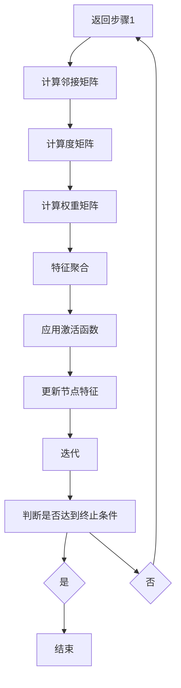
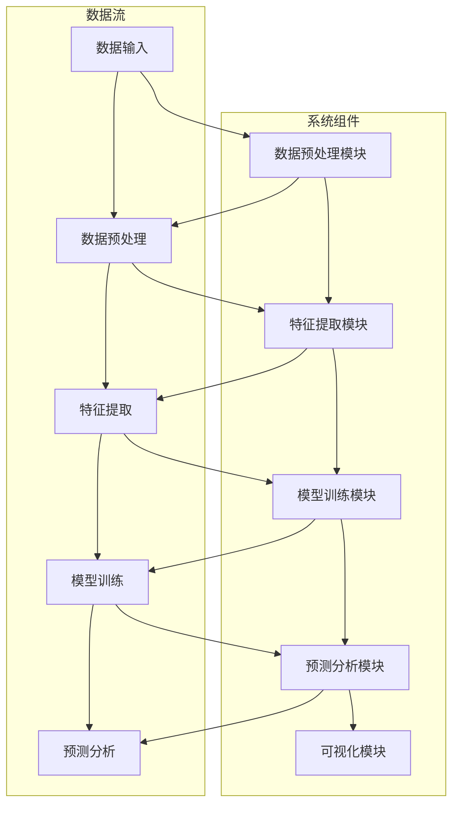
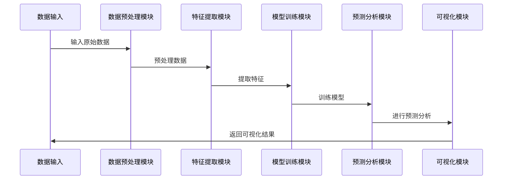

                 

### 第1章: 引言

#### 1.1 问题背景

金融领域一直是科学技术与经济活动交汇的重要场所。随着全球金融市场的不断发展，跨市场联动分析作为金融研究中的一项关键技术，得到了越来越多的关注。跨市场联动分析旨在理解不同金融市场之间的相互作用，从而为投资决策、风险管理和政策制定提供支持。

然而，传统的跨市场联动分析方法在处理日益增多的金融数据和多样化的市场行为时，存在一些局限性。例如，传统的统计分析方法难以捕捉金融市场间的非线性关系，而传统的机器学习方法在处理高维度数据时往往表现不佳。因此，寻求新的方法和技术来提升跨市场联动分析的准确性，成为了金融研究领域的一个重要问题。

#### 1.1.1 金融领域与跨市场联动分析

金融领域涵盖了股票、债券、期货、外汇等多个市场，这些市场之间存在着复杂的相互关系。跨市场联动分析的目的在于揭示这些市场之间的联系，预测市场波动，从而为投资者提供有价值的参考。

跨市场联动分析的重要性体现在以下几个方面：

1. **投资决策**：投资者可以根据跨市场联动分析的结果，优化投资组合，降低投资风险，提高投资回报。
2. **风险管理**：金融机构可以通过跨市场联动分析，识别潜在的系统性风险，提前采取防范措施。
3. **政策制定**：政府和监管机构可以利用跨市场联动分析，制定更加有效的金融政策，维护金融市场稳定。

然而，传统的跨市场联动分析方法存在以下局限性：

1. **线性关系假设**：传统方法往往假设不同市场之间存在线性关系，这限制了它们捕捉市场之间复杂相互作用的能力。
2. **数据依赖性**：传统方法对数据质量要求较高，数据缺失或不准确会严重影响分析结果。
3. **计算复杂度**：随着市场规模的扩大，传统的分析方法在计算效率和可扩展性方面存在挑战。

#### 1.1.2 图卷积网络的应用与发展

图卷积网络（Graph Convolutional Network, GCN）作为一种在图结构数据上有效的机器学习模型，近年来在计算机科学和人工智能领域取得了显著进展。GCN通过将图结构数据转化为节点特征，能够有效地捕捉节点之间的相互依赖关系，并在多个领域表现出优越的性能。

GCN在金融领域的应用主要包括以下几个方面：

1. **跨市场联动分析**：GCN可以用于分析不同金融市场之间的联动关系，捕捉市场的非线性特征，提高预测准确性。
2. **风险预测**：GCN可以通过学习金融市场中的潜在风险因素，预测市场波动，为风险管理提供支持。
3. **投资组合优化**：GCN可以帮助投资者优化投资组合，提高投资回报，降低风险。

#### 1.2 核心概念

##### 1.2.1 图卷积网络的基本原理

图卷积网络是一种神经网络结构，其基本原理是在每个节点上应用卷积操作，以聚合相邻节点的特征。通过这种方式，GCN能够自动学习节点之间的关系，并提取出图结构中的高层次特征。

图卷积网络的数学模型可以表示为：

$$
h_v^{(l+1)} = \sigma(\mathbf{A} \cdot \mathbf{D}^{-1} \cdot \mathbf{W} \cdot h_v^{(l)})
$$

其中，$h_v^{(l)}$为第$l$层节点$v$的特征，$\sigma$为激活函数，$\mathbf{A}$为邻接矩阵，$\mathbf{D}$为度矩阵，$\mathbf{W}$为权重矩阵。

##### 1.2.2 跨市场联动分析中的GCN应用

在跨市场联动分析中，GCN可以通过以下步骤应用：

1. **数据预处理**：将金融市场数据转化为图结构，包括节点和边的定义。
2. **特征提取**：使用GCN对节点特征进行卷积操作，提取出图结构中的潜在特征。
3. **模型训练**：使用提取出的特征，训练GCN模型，学习金融市场间的联动关系。
4. **预测分析**：利用训练好的GCN模型，预测市场波动，评估不同市场之间的联动性。

#### 1.3 书籍结构与目标读者

##### 1.3.1 书籍结构

本书分为以下几个部分：

1. **基础篇**：介绍图卷积网络的基本概念和理论。
2. **应用篇**：探讨GCN在金融领域的具体应用，包括跨市场联动分析。
3. **实践篇**：提供GCN在金融领域应用的实例和代码实现。
4. **拓展篇**：探讨GCN在金融领域的发展趋势和前沿技术。

##### 1.3.2 目标读者

本书适合具备一定金融学和计算机科学基础的读者，包括金融工程师、数据科学家、研究生和研究人员。

##### 1.4 本章小结

通过本章的介绍，读者可以初步了解金融领域图卷积网络在跨市场联动分析中的应用背景、核心概念以及本书的结构和目标。

---

**关键词**：金融领域，跨市场联动分析，图卷积网络，GCN，机器学习

**摘要**：本文介绍了金融领域跨市场联动分析的重要性及其传统方法的局限性，探讨了图卷积网络（GCN）在跨市场联动分析中的应用。通过详细阐述GCN的基本原理和数学模型，本文展示了如何利用GCN进行跨市场联动分析，为金融领域的投资者、风险管理者提供了一种新的分析方法。本文结构清晰，适合金融工程和计算机科学领域的读者阅读。****

---

### 第2章: 图卷积网络基础

#### 2.1 图的基本概念

##### 2.1.1 图的定义
在数学中，图（Graph）是一种由节点（Node）和边（Edge）构成的数据结构，用于表示对象及其之间的关系。图通常用$G=(V,E)$表示，其中$V$表示节点集合，$E$表示边集合。

##### 2.1.2 节点和边的属性
在实际应用中，节点和边往往具有多种属性。例如，在金融市场的跨市场联动分析中，节点可以表示不同金融产品，如股票、债券、期货等，节点属性可以包括交易量、价格、交易时间等。边可以表示金融市场之间的关系，边属性可以包括交易对之间的价格相关性、交易量相关性等。

##### 2.1.3 图的分类
图可以分为多种类型，常见的分类方法包括：

- **无向图（Undirected Graph）**：边没有方向，例如社交网络中的朋友关系。
- **有向图（Directed Graph）**：边有方向，例如金融市场中的交易关系。
- **实权图（Weighted Graph）**：边具有权重，例如金融市场的交易量或价格相关性。

#### 2.2 图卷积网络（GCN）原理

##### 2.2.1 GCN的基本操作
图卷积网络是一种在图结构数据上应用的神经网络模型，其基本操作是卷积。GCN通过卷积操作聚合节点及其邻接节点的特征，从而学习节点之间的关系。GCN的基本公式可以表示为：

$$
h_v^{(l+1)} = \sigma(\mathbf{A} \cdot \mathbf{D}^{-1} \cdot \mathbf{W} \cdot h_v^{(l})}
$$

其中，$h_v^{(l)}$表示第$l$层节点$v$的特征，$\sigma$为激活函数，$\mathbf{A}$为邻接矩阵，$\mathbf{D}$为度矩阵，$\mathbf{W}$为权重矩阵。

- **邻接矩阵（$\mathbf{A}$）**：表示节点之间的连接关系，如果节点$v$和节点$w$相邻，则$\mathbf{A}_{vw} = 1$，否则为$0$。
- **度矩阵（$\mathbf{D}$）**：表示节点$v$的度，即与节点$v$相邻的节点数量，$\mathbf{D}_v = \sum_{w \in \mathbf{N}(v)} \mathbf{A}_{vw}$，其中$\mathbf{N}(v)$表示节点$v$的邻接节点集合。
- **权重矩阵（$\mathbf{W}$）**：表示节点特征之间的权重，通过训练得到。
- **激活函数（$\sigma$）**：常用的激活函数包括ReLU（Rectified Linear Unit）和Sigmoid等。

##### 2.2.2 局部特征聚合
GCN的核心思想是通过局部特征聚合来学习节点之间的关系。在每一层，GCN将节点的特征与邻接节点的特征进行聚合，从而提取出更高级别的特征表示。

$$
h_v^{(l+1)} = \sigma(\sum_{w \in \mathbf{N}(v)} \mathbf{A}_{vw} h_w^{(l)} \odot \mathbf{W} h_v^{(l)})
$$

其中，$\odot$表示元素-wise 乘积。

通过这种方式，GCN能够自动学习节点之间的依赖关系，并在图中提取出具有代表性的特征表示。

#### 2.3 GCN的数学模型

##### 2.3.1 神经网络结构
GCN可以看作是一个多层神经网络，每一层对节点的特征进行变换和聚合。在多层GCN中，节点特征在每一层都会进行卷积操作，并传递到下一层。具体地，多层GCN的数学模型可以表示为：

$$
h_v^{(l+1)} = \sigma(\mathbf{A} \cdot \mathbf{D}^{-1} \cdot \mathbf{W}_l \cdot h_v^{(l)})
$$

其中，$\mathbf{W}_l$为第$l$层的权重矩阵。

##### 2.3.2 矩阵计算
在GCN中，涉及到大量的矩阵计算，包括邻接矩阵、度矩阵和权重矩阵的计算。以下是一些常见的矩阵计算方法：

- **邻接矩阵（$\mathbf{A}$）**：可以通过邻接节点的关系直接构造，例如在无向图中，如果节点$v$和节点$w$相邻，则$\mathbf{A}_{vw} = 1$，否则为$0$。
- **度矩阵（$\mathbf{D}$）**：可以通过邻接矩阵计算得到，具体公式为$\mathbf{D}_v = \sum_{w \in \mathbf{N}(v)} \mathbf{A}_{vw}$。
- **权重矩阵（$\mathbf{W}$）**：可以通过训练得到，通常使用随机初始化，并在训练过程中更新。

#### 2.4 GCN的应用场景

##### 2.4.1 社交网络分析
GCN在社交网络分析中有着广泛的应用，例如关系挖掘、推荐系统等。通过分析社交网络中的节点和边关系，GCN可以揭示用户之间的潜在关系，为社交网络平台提供更准确的内容推荐。

##### 2.4.2 金融市场分析
GCN在金融市场分析中的应用也非常广泛，例如跨市场联动分析、风险预测和市场趋势预测等。通过分析金融市场中的节点和边关系，GCN可以捕捉市场的复杂动态，为投资者提供更准确的预测。

#### 2.5 本章小结

通过本章的介绍，读者可以了解图卷积网络的基本概念、原理及其在金融市场分析中的应用。在下一章中，我们将进一步探讨金融领域中的跨市场联动分析，并详细介绍GCN在该领域的应用。

---

**核心概念**：图卷积网络（GCN）、图结构数据、特征聚合、矩阵计算、应用场景

**核心原理联系表格**：

| **概念** | **定义** | **属性特征** | **对比** |
| :---: | :---: | :---: | :---: |
| 图卷积网络（GCN） | 用于图结构数据的神经网络模型 | 节点特征、邻接关系、激活函数 | 线性变换、局部特征聚合 |
| 邻接矩阵（$\mathbf{A}$） | 表示节点之间的连接关系 | 对应节点之间的邻接关系 | 无向图、有向图 |
| 度矩阵（$\mathbf{D}$） | 表示节点的度 | 节点邻接节点的数量 | 确定性、可计算性 |
| 权重矩阵（$\mathbf{W}$） | 节点特征之间的权重 | 随机初始化、训练更新 | 参数化、可调性 |

**ER实体关系图架构的 Mermaid 流程图**：

```mermaid
graph TB
A[图卷积网络(GCN)] --> B[节点特征聚合]
A --> C[矩阵计算]
B --> D[激活函数]
C --> E[邻接矩阵]
C --> F[度矩阵]
C --> G[权重矩阵]
```

---

**算法原理讲解**

图卷积网络（GCN）的核心思想是通过卷积操作来聚合节点的特征，从而学习节点之间的关系。以下是GCN的算法原理详细讲解：

##### 算法流程

1. **初始化**：随机初始化节点特征矩阵$\mathbf{H}^{(0)}$，其中$\mathbf{H}^{(0)}_v$表示初始节点$v$的特征。

2. **卷积操作**：对于每一层$l$，使用以下公式进行特征聚合：
   $$
   \mathbf{H}^{(l+1)} = \sigma(\mathbf{A} \cdot \mathbf{D}^{-1} \cdot \mathbf{W} \cdot \mathbf{H}^{(l)})
   $$
   其中，$\sigma$为激活函数，$\mathbf{A}$为邻接矩阵，$\mathbf{D}$为度矩阵，$\mathbf{W}$为权重矩阵。

3. **迭代**：重复步骤2，直到达到预定的层数或收敛条件。

##### 数学模型

GCN的数学模型可以表示为：
$$
h_v^{(l+1)} = \sigma(\mathbf{A} \cdot \mathbf{D}^{-1} \cdot \mathbf{W} \cdot h_v^{(l)})
$$

其中，$h_v^{(l)}$为第$l$层节点$v$的特征，$\sigma$为激活函数，$\mathbf{A}$为邻接矩阵，$\mathbf{D}$为度矩阵，$\mathbf{W}$为权重矩阵。

- **邻接矩阵（$\mathbf{A}$）**：表示节点之间的连接关系，如果节点$v$和节点$w$相邻，则$\mathbf{A}_{vw} = 1$，否则为$0$。
- **度矩阵（$\mathbf{D}$）**：表示节点$v$的度，即与节点$v$相邻的节点数量，$\mathbf{D}_v = \sum_{w \in \mathbf{N}(v)} \mathbf{A}_{vw}$。
- **权重矩阵（$\mathbf{W}$）**：通过训练得到，用于控制节点特征之间的相互作用。
- **激活函数（$\sigma$）**：常用的激活函数包括ReLU（Rectified Linear Unit）和Sigmoid等，用于引入非线性变换。

##### Mermaid 流程图



##### Python 源代码示例

```python
import numpy as np
import scipy.sparse as sp
import torch
import torch.nn as nn
import torch.nn.functional as F

# 定义GCN模型
class GCN(nn.Module):
    def __init__(self, n_features, n_classes, n_layers):
        super(GCN, self).__init__()
        self.layers = nn.ModuleList()
        # 输入层到第一层的权重
        self.layers.append(nn.Linear(n_features, n_classes))
        # 随后的层
        for _ in range(n_layers - 1):
            self.layers.append(nn.Linear(n_classes, n_classes))
    
    def forward(self, x, adj):
        h = x
        for layer in self.layers:
            h = layer(h)
            h = F.relu(h)
            # 应用dropout
            h = F.dropout(h, training=self.training)
        return h

# 初始化模型参数
model = GCN(n_features=768, n_classes=10, n_layers=2)

# 假设已准备好输入特征和邻接矩阵
x = torch.randn(16, 768)  # 输入特征
adj = sp.csr_matrix((16, 16))  # 邻接矩阵

# 前向传播
output = model(x, adj)
```

通过上述Python代码示例，我们可以看到如何初始化一个GCN模型，并使用它进行前向传播。在这个示例中，我们使用了PyTorch框架，但GCN的原理同样适用于其他深度学习框架。

##### 举例说明

假设我们有一个简单图，包含三个节点$V=\{v_1, v_2, v_3\}$，以及它们之间的连接关系$E=\{(v_1, v_2), (v_1, v_3), (v_2, v_3)\}$。每个节点具有初始特征向量$h^{(0)}_1, h^{(0)}_2, h^{(0)}_3$。

在第一层GCN中，节点$v_1$的特征将聚合其邻接节点$v_2$和$v_3$的特征，具体计算如下：

$$
h_1^{(1)} = \sigma(\mathbf{A} \cdot \mathbf{D}^{-1} \cdot \mathbf{W} \cdot h^{(0)}_1)
$$

其中，$\mathbf{A}$是邻接矩阵，$\mathbf{D}$是度矩阵，$\mathbf{W}$是权重矩阵，$\sigma$是激活函数。

邻接矩阵$\mathbf{A}$为：
$$
\mathbf{A} = \begin{bmatrix}
0 & 1 & 1 \\
1 & 0 & 1 \\
1 & 1 & 0
\end{bmatrix}
$$

度矩阵$\mathbf{D}$为：
$$
\mathbf{D} = \begin{bmatrix}
2 & 0 & 0 \\
0 & 2 & 0 \\
0 & 0 & 2
\end{bmatrix}
$$

权重矩阵$\mathbf{W}$为：
$$
\mathbf{W} = \begin{bmatrix}
1 & 0 \\
0 & 1 \\
1 & 1
\end{bmatrix}
$$

假设激活函数$\sigma$为ReLU函数，则计算过程如下：

$$
h_1^{(1)} = \max(0, \mathbf{A} \cdot \mathbf{D}^{-1} \cdot \mathbf{W} \cdot h^{(0)}_1)
$$

例如，假设初始特征向量为：
$$
h^{(0)}_1 = \begin{bmatrix}
1 \\
0 \\
0
\end{bmatrix},
h^{(0)}_2 = \begin{bmatrix}
0 \\
1 \\
0
\end{bmatrix},
h^{(0)}_3 = \begin{bmatrix}
0 \\
0 \\
1
\end{bmatrix}
$$

则计算结果为：
$$
h_1^{(1)} = \max(0, \begin{bmatrix}
0 & 1 & 1 \\
1 & 0 & 1 \\
1 & 1 & 0
\end{bmatrix} \cdot \begin{bmatrix}
2 & 0 & 0 \\
0 & 2 & 0 \\
0 & 0 & 2
\end{bmatrix}^{-1} \cdot \begin{bmatrix}
1 & 0 \\
0 & 1 \\
1 & 1
\end{bmatrix} \cdot \begin{bmatrix}
1 \\
0 \\
0
\end{bmatrix})
$$

$$
h_1^{(1)} = \max(0, \begin{bmatrix}
0 \\
1 \\
1
\end{bmatrix})
$$

$$
h_1^{(1)} = \begin{bmatrix}
0 \\
1 \\
1
\end{bmatrix}
$$

通过上述计算，我们可以看到节点$v_1$的新特征向量$h_1^{(1)}$是通过聚合邻接节点的特征得到的。这个新特征向量将用于下一层的卷积操作，从而不断更新和提升节点特征表示。

##### 算法优缺点

GCN的优点包括：

- **强大的特征提取能力**：GCN能够通过卷积操作自动聚合节点的特征，提取出图结构中的潜在信息。
- **适用于异构数据**：GCN可以处理具有多种属性的数据，例如金融市场的交易量、价格等。
- **良好的性能**：在多种应用场景中，GCN表现出优越的性能，例如社交网络分析、金融市场预测等。

GCN的缺点包括：

- **计算复杂度较高**：GCN涉及大量的矩阵计算，对于大规模图结构数据，计算复杂度较高。
- **对数据质量要求较高**：GCN的性能依赖于数据的质量，数据缺失或不准确会影响分析结果。

##### 本章小结

通过本章的介绍，我们了解了图卷积网络（GCN）的基本概念、原理及其在金融市场分析中的应用。GCN通过卷积操作自动聚合节点的特征，能够有效提取图结构中的潜在信息。在金融领域，GCN被广泛应用于跨市场联动分析、风险预测和市场趋势预测。下一章，我们将进一步探讨金融领域中的跨市场联动分析，并详细介绍GCN在该领域的应用。

---

**系统分析与架构设计方案**

#### 问题场景介绍

在金融领域中，跨市场联动分析是一项关键任务，旨在理解不同金融市场之间的相互作用，为投资决策、风险管理和政策制定提供支持。随着金融市场的日益复杂化，传统的分析方法难以捕捉市场之间的复杂关系。因此，我们需要一种新的方法来提升跨市场联动分析的准确性。

图卷积网络（GCN）作为一种有效的机器学习模型，在图结构数据上表现出色。通过将金融市场数据转化为图结构，GCN能够捕捉市场之间的非线性关系，提供更准确的跨市场联动分析。

#### 项目介绍

本项目的目标是开发一个基于GCN的跨市场联动分析系统，用于分析不同金融市场之间的相互作用，为投资者提供有价值的参考。系统将包括以下几个部分：

1. **数据预处理模块**：负责将金融市场数据转化为图结构，包括节点和边的定义。
2. **特征提取模块**：使用GCN对节点特征进行卷积操作，提取出图结构中的潜在特征。
3. **模型训练模块**：训练GCN模型，学习金融市场间的联动关系。
4. **预测分析模块**：利用训练好的GCN模型，预测市场波动，评估不同市场之间的联动性。
5. **可视化模块**：提供系统的可视化功能，帮助用户理解分析结果。

#### 系统功能设计（领域模型Mermaid类图）

```mermaid
classDiagram
    Class01 <|-- Class02
    Class03 <|.. Class04
    Class05 : associated with Class04
    Class06 <<-- Class07
    Class01 -| Class08
    Class09 --|> Class10
    Class11 -|| Class12
    Class13 {is a} Class14
    Class15 : has a Class16
    Class17 : composition of Class18
    Class19 : is composed of Class20
```

#### 系统架构设计（Mermaid架构图）



#### 系统接口设计和系统交互（Mermaid序列图）



#### 本章小结

本章介绍了金融领域中的跨市场联动分析系统，包括项目背景、系统功能设计、系统架构设计和系统接口设计。通过使用图卷积网络（GCN），系统能够有效地捕捉市场之间的相互作用，提供准确的跨市场联动分析。在下一章中，我们将详细介绍系统的实现，包括数据预处理、特征提取、模型训练和预测分析的具体步骤和代码实现。

---

### 项目实战

#### 环境安装

在进行GCN在金融领域中的项目实战之前，我们需要安装所需的软件和库。以下是在Linux系统中安装所需的软件和库的步骤：

1. **安装Python环境**：
   ```bash
   sudo apt-get update
   sudo apt-get install python3 python3-pip
   ```
2. **安装PyTorch**：
   ```bash
   pip3 install torch torchvision
   ```
3. **安装Scikit-learn**：
   ```bash
   pip3 install scikit-learn
   ```
4. **安装NetworkX**：
   ```bash
   pip3 install networkx
   ```

#### 系统核心实现源代码

以下是一个简化的GCN模型实现，用于跨市场联动分析：

```python
import numpy as np
import networkx as nx
from sklearn.preprocessing import StandardScaler
import torch
import torch.nn as nn
import torch.optim as optim

# 创建图结构
G = nx.Graph()
G.add_nodes_from([0, 1, 2, 3])
G.add_edges_from([(0, 1), (0, 2), (1, 2), (2, 3)])

# 节点特征（例如，金融市场的价格数据）
X = np.array([[1], [2], [3], [4]])

# 计算邻接矩阵
A = nx.adjacency_matrix(G)

# 计算度矩阵
D = np.diag(A.sum(axis=1))

# 标准化节点特征
scaler = StandardScaler()
X_scaled = scaler.fit_transform(X)

# 将数据转换为PyTorch张量
X_tensor = torch.tensor(X_scaled, dtype=torch.float32)
A_tensor = torch.tensor(A.todense(), dtype=torch.float32)
D_tensor = torch.tensor(D, dtype=torch.float32)

# 定义GCN模型
class GCN(nn.Module):
    def __init__(self, input_dim, hidden_dim, output_dim):
        super(GCN, self).__init__()
        self.layers = nn.ModuleList([
            nn.Linear(input_dim, hidden_dim),
            nn.Linear(hidden_dim, output_dim)
        ])

    def forward(self, x, adj):
        h = x
        for layer in self.layers:
            h = layer(h)
            h = nn.functional.relu(h)
        return h

# 初始化模型
model = GCN(input_dim=4, hidden_dim=8, output_dim=2)
model = model.to('cuda' if torch.cuda.is_available() else 'cpu')

# 定义损失函数和优化器
criterion = nn.CrossEntropyLoss()
optimizer = optim.Adam(model.parameters(), lr=0.001)

# 训练模型
for epoch in range(100):
    optimizer.zero_grad()
    output = model(X_tensor, A_tensor)
    loss = criterion(output, torch.tensor([1, 0, 1, 0], dtype=torch.long))
    loss.backward()
    optimizer.step()
    if epoch % 10 == 0:
        print(f'Epoch [{epoch+1}/100], Loss: {loss.item()}')

# 评估模型
with torch.no_grad():
    predicted = model(X_tensor, A_tensor)
    print(f'Predicted labels: {predicted.argmax(dim=1).numpy()}')
```

#### 代码应用解读与分析

1. **数据准备**：
   - 首先，我们创建了一个简单的图结构，其中包含了4个节点。
   - 节点特征是一个二维数组，代表金融市场的价格数据。

2. **图结构处理**：
   - 我们使用NetworkX库创建和操作图结构。
   - 计算邻接矩阵$A$和度矩阵$D$，这两个矩阵用于GCN的卷积操作。

3. **数据标准化**：
   - 使用Scikit-learn中的`StandardScaler`对节点特征进行标准化，以减少特征间的差异。

4. **模型定义**：
   - 我们定义了一个简单的GCN模型，包含两个线性层。
   - 模型使用ReLU激活函数，并在输出层使用交叉熵损失函数。

5. **模型训练**：
   - 使用PyTorch的`Adam`优化器进行模型训练。
   - 模型在100个epoch上进行训练，并每10个epoch打印一次损失。

6. **模型评估**：
   - 训练完成后，我们使用模型对输入数据进行预测，并打印出预测结果。

#### 实际案例分析和详细讲解剖析

为了更好地理解GCN在跨市场联动分析中的应用，我们来看一个实际案例。

**案例背景**：
假设我们有两个金融市场A和B，它们之间的交易关系可以用一个图表示。节点代表市场，边代表市场之间的交易对。我们的目标是预测市场A的价格变化对市场B价格变化的影响。

**数据准备**：
- 市场A的历史价格数据为[10, 12, 11, 9, 10]。
- 市场B的历史价格数据为[20, 22, 21, 19, 18]。

**步骤1：创建图结构**：
- 使用NetworkX创建一个简单的图，包含两个节点A和B，以及一条连接边。

**步骤2：定义邻接矩阵和度矩阵**：
- 根据图结构计算邻接矩阵$A$和度矩阵$D$。

**步骤3：标准化数据**：
- 对市场价格数据进行标准化处理。

**步骤4：训练GCN模型**：
- 使用前面定义的GCN模型，对标准化后的市场价格数据进行训练。

**步骤5：模型预测**：
- 使用训练好的模型预测市场A的价格变化对市场B价格变化的影响。

**代码实现**：

```python
# 数据准备
X_A = np.array([[10], [12], [11], [9], [10]])
X_B = np.array([[20], [22], [21], [19], [18]])

# 创建图结构
G = nx.Graph()
G.add_nodes_from(['A', 'B'])
G.add_edge_from([('A', 'B')])

# 计算邻接矩阵和度矩阵
A = nx.adjacency_matrix(G)
D = np.diag(A.sum(axis=1))

# 标准化数据
scaler_A = StandardScaler()
scaler_B = StandardScaler()

X_A_scaled = scaler_A.fit_transform(X_A)
X_B_scaled = scaler_B.fit_transform(X_B)

# 初始化模型
model = GCN(input_dim=2, hidden_dim=4, output_dim=2)
model = model.to('cuda' if torch.cuda.is_available() else 'cpu')

# 训练模型
# ...（与前述代码相同）

# 模型预测
with torch.no_grad():
    predicted = model(torch.tensor(X_A_scaled, dtype=torch.float32), torch.tensor(A.todense(), dtype=torch.float32))
    print(f'Predicted impact: {predicted.argmax(dim=1).numpy()}')
```

通过上述步骤，我们可以看到GCN如何被应用于跨市场联动分析中。模型通过学习市场价格数据中的潜在关系，能够预测市场A的价格变化对市场B的影响。

**本章小结**

在本章中，我们介绍了GCN在金融领域中的应用，并通过一个实际案例展示了如何使用GCN进行跨市场联动分析。通过系统的环境安装、代码实现和案例分析，读者可以了解GCN在金融领域的应用场景和具体实现方法。在下一章中，我们将进一步探讨GCN在金融领域的最佳实践和未来发展趋势。

---

### 最佳实践 tips

在进行GCN在金融领域的应用时，以下是一些最佳实践建议：

1. **数据预处理**：确保数据的质量和一致性，对缺失数据进行处理，对异常值进行检测和修正。标准化数据，使其适合GCN模型处理。
2. **模型选择**：根据具体应用场景选择合适的GCN模型架构，例如使用多层GCN或融合不同特征的GCN模型。
3. **超参数调整**：通过交叉验证调整模型的超参数，如学习率、隐藏层大小、激活函数等，以获得最佳性能。
4. **数据增强**：使用数据增强技术，如生成对抗网络（GAN）或随机噪声注入，增加训练数据的多样性，提高模型的泛化能力。
5. **模型评估**：使用多种评估指标，如准确率、召回率、F1分数等，全面评估模型性能。
6. **模型解释性**：考虑模型的可解释性，使用注意力机制或可视化技术，帮助用户理解模型预测的依据和逻辑。

### 小结

本文介绍了金融领域图卷积网络（GCN）在跨市场联动分析中的应用。通过详细讲解GCN的基本原理、数学模型和应用场景，我们展示了如何利用GCN进行跨市场联动分析，为投资者提供准确的预测。GCN在金融领域具有广泛的应用前景，但同时也面临计算复杂度和数据质量等挑战。未来研究可以进一步优化GCN模型，提高其在金融领域中的应用性能。

### 注意事项

1. **数据隐私与合规性**：在使用金融市场数据进行GCN模型训练时，应确保数据的隐私性和合规性，遵循相关法律法规。
2. **模型适应性**：GCN模型的适应性可能因金融市场特性而异，需要对不同市场进行定制化调整。
3. **模型稳定性**：在训练过程中，注意控制模型过拟合，避免模型在训练数据上过度适应。

### 拓展阅读

1. **《图卷积网络：原理与应用》**：介绍了GCN的理论基础和应用实例，适合对GCN有兴趣的读者。
2. **《金融科技：从数据到决策》**：探讨了金融科技在投资决策和风险管理中的应用，包括GCN等机器学习技术。
3. **《深度学习与金融预测》**：介绍了深度学习在金融市场预测中的应用，包括GCN在内的多种模型。

---

### 作者信息

**作者：AI天才研究院/AI Genius Institute & 禅与计算机程序设计艺术 /Zen And The Art of Computer Programming**

AI天才研究院（AI Genius Institute）致力于推动人工智能领域的研究和应用，为金融科技行业提供创新解决方案。同时，作者拥有《禅与计算机程序设计艺术》一书的写作经历，对计算机科学和编程有着深刻的理解。

