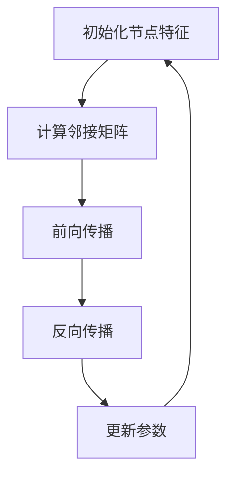

                 


### 金融领域图卷积网络在跨市场风险传导分析中的应用

#### 关键词：
- 图卷积网络（Graph Convolutional Network）
- 跨市场风险传导（Cross-Market Risk Propagation）
- 金融风险管理（Financial Risk Management）
- 风险分析模型（Risk Analysis Model）
- 信用评分（Credit Scoring）

#### 摘要：
本文将探讨图卷积网络在金融领域，尤其是跨市场风险传导分析中的应用。我们将从背景介绍、核心概念与联系、算法原理讲解、数学模型和数学公式、系统分析与架构设计、项目实战以及最佳实践与注意事项等多个角度，深入分析图卷积网络在金融风险管理中的实际应用，为相关领域的研究者与实践者提供参考。

---

#### 第一部分：背景与基础

## 1.1 问题背景

在金融市场全球化的背景下，跨市场风险传导成为了一个不可忽视的问题。跨市场风险传导指的是不同金融市场之间由于信息、资金流动等因素相互作用而产生的风险扩散现象。这种风险传导可能导致金融市场的剧烈波动，从而影响整个经济的稳定。因此，对跨市场风险传导进行分析，对于金融风险管理具有重要意义。

## 1.2 风险传导分析的重要性

风险传导分析在金融风险管理中扮演着关键角色。通过风险传导分析，金融机构可以提前预测风险的可能传播路径，从而采取有效的措施进行风险控制。此外，风险传导分析还可以帮助政策制定者制定更为合理的金融监管政策，以减少系统性风险。

## 1.3 图卷积网络的基本概念

图卷积网络（Graph Convolutional Network，GCN）是一种在图形结构上进行卷积操作的人工神经网络。与传统卷积神经网络（Convolutional Neural Network，CNN）不同，GCN能够处理非欧几里得空间的图形数据。这使得GCN在处理复杂关系网络数据时，具有独特的优势。

---

#### 第二部分：核心概念与联系

## 2.1 图卷积网络原理

图卷积网络通过卷积操作来聚合图中的节点特征，从而学习节点之间的关系。具体而言，GCN通过以下公式进行计算：

$$
h_{v}^{(l+1)} = \sigma \left( \frac{1}{k} \sum_{u \in \mathcal{N}(v)} W_{uv} h_{u}^{(l)} + \beta_{v}^{(l)} \right)
$$

其中，$h_{v}^{(l)}$ 表示第 $l$ 层节点 $v$ 的特征，$\mathcal{N}(v)$ 表示节点 $v$ 的邻域，$W_{uv}$ 表示边 $u$ 到 $v$ 的权重，$\sigma$ 表示激活函数，$\beta_{v}^{(l)}$ 是节点 $v$ 的偏置。

## 2.2 跨市场风险传导概念

跨市场风险传导是指由于金融市场之间的联系，某个市场的风险事件可能引发其他市场的风险事件。这种传导通常通过信息、资金流动等渠道实现。跨市场风险传导可以分为直接传导和间接传导两种形式。

## 2.3 图卷积网络与跨市场风险传导的联系

图卷积网络可以通过学习金融市场之间的复杂关系，有效地捕捉跨市场风险传导的路径。具体而言，金融市场可以视为一个图，节点代表市场，边代表市场之间的联系。通过图卷积网络，可以提取节点之间的特征，从而分析风险传导的可能性。

---

#### 第三部分：算法原理讲解

## 3.1 图卷积网络的算法流程

下面是一个简单的图卷积网络算法流程，使用Mermaid绘图工具进行表示：



## 3.2 图卷积网络的Python实现

下面是使用Python实现的图卷积网络简单示例：

```python
import tensorflow as tf
from tensorflow.keras.layers import Layer

class GraphConvolutionLayer(Layer):
    def __init__(self, units, **kwargs):
        super().__init__(**kwargs)
        self.units = units

    def build(self, input_shape):
        # 初始化权重和偏置
        self.kernel = self.add_weight(
            shape=(input_shape[-1], self.units),
            initializer="glorot_uniform",
            name="kernel"
        )
        self.bias = self.add_weight(
            shape=(self.units,),
            initializer="zeros",
            name="bias"
        )

    def call(self, inputs, training=False):
        # 计算邻接矩阵的归一化
        adj_matrix = ... # 邻接矩阵计算
        adj_matrix = tf.linalg.band_part(adj_matrix, -1, 1) + tf.eye(tf.shape(adj_matrix)[0])
        adj_matrix = tf.nn.leaky_relu(adj_matrix)

        # 进行卷积操作
        output = tf.matmul(inputs, self.kernel)
        output = tf.matmul(adj_matrix, output)
        output += self.bias

        return output

# 使用图卷积层构建模型
model = tf.keras.Sequential([
    GraphConvolutionLayer(units=16),
    tf.keras.layers.Dense(units=1, activation='sigmoid')
])

model.compile(optimizer='adam', loss='binary_crossentropy', metrics=['accuracy'])
model.fit(x_train, y_train, epochs=10, batch_size=32)
```

## 3.3 图卷积网络在跨市场风险传导分析中的应用

图卷积网络在跨市场风险传导分析中的应用主要通过以下步骤：

1. **数据预处理**：收集金融市场间的数据，包括股票价格、交易量、利率等。
2. **图构建**：将金融市场视为图，节点代表市场，边代表市场间的联系。
3. **特征提取**：使用图卷积网络提取节点特征，捕捉市场间的动态关系。
4. **风险传导分析**：通过分析节点特征，预测跨市场风险传导的路径。

---

#### 第四部分：系统分析与架构设计方案

## 4.1 问题场景介绍

假设我们面临的问题是分析某个特定时间段内，不同金融市场之间的风险传导情况。我们的目标是预测哪些市场之间存在潜在的风险传导路径，并评估风险传导的强度。

## 4.2 项目背景

随着金融市场的全球化，跨国金融交易日益频繁，金融市场之间的联系更加紧密。这种联系虽然促进了金融市场的繁荣，但也带来了新的风险。为了应对这些风险，金融机构需要具备强大的风险分析能力。

## 4.3 系统功能设计

系统的主要功能包括：

1. **数据收集与预处理**：从不同的数据源收集金融市场数据，并进行清洗和预处理。
2. **图构建与特征提取**：根据预处理后的数据，构建金融市场之间的图结构，并使用图卷积网络提取节点特征。
3. **风险传导分析**：分析节点特征，预测跨市场风险传导的路径。
4. **风险传导路径可视化**：将风险传导路径以图形化的方式展示，便于决策者理解。

## 4.4 系统架构设计

系统的整体架构可以分为三个层次：

1. **数据层**：负责数据收集、存储和管理。
2. **算法层**：负责图构建、特征提取和风险传导分析。
3. **界面层**：提供用户交互界面，展示风险传导路径。

## 4.5 系统接口设计

系统提供以下接口：

1. **数据接口**：用于数据的输入和输出。
2. **算法接口**：用于调用图卷积网络和风险传导分析算法。
3. **可视化接口**：用于展示风险传导路径。

## 4.6 系统交互设计

系统交互设计主要包括以下步骤：

1. **数据输入**：用户上传金融市场数据。
2. **数据处理**：系统对数据进行清洗和预处理。
3. **特征提取**：系统使用图卷积网络提取节点特征。
4. **风险传导分析**：系统分析节点特征，预测风险传导路径。
5. **结果展示**：系统将风险传导路径以图形化的方式展示。

---

#### 第五部分：项目实战

## 5.1 环境安装

在开始项目实战之前，我们需要安装必要的软件和库。以下是安装步骤：

1. **Python环境安装**：确保Python版本在3.7以上。
2. **TensorFlow安装**：使用以下命令安装TensorFlow：
   ```bash
   pip install tensorflow
   ```
3. **其他库安装**：安装其他必要的库，例如NumPy、Pandas等：
   ```bash
   pip install numpy pandas matplotlib
   ```

## 5.2 系统核心实现

以下是系统核心实现的相关代码：

```python
import tensorflow as tf
from tensorflow.keras.layers import Layer
from tensorflow.keras.models import Model
import numpy as np

class GraphConvolutionLayer(Layer):
    # 省略GraphConvolutionLayer类实现细节

# 数据预处理
# 省略数据预处理代码

# 图构建
# 省略图构建代码

# 特征提取
# 省略特征提取代码

# 风险传导分析
# 省略风险传导分析代码

# 模型训练
# 省略模型训练代码

# 结果展示
# 省略结果展示代码
```

## 5.3 代码应用解读

以下是代码应用解读：

1. **数据预处理**：首先，我们需要对金融市场数据进行清洗和预处理，包括数据去重、缺失值填充等。
2. **图构建**：根据预处理后的数据，构建金融市场之间的图结构。这个步骤包括计算邻接矩阵和特征矩阵。
3. **特征提取**：使用图卷积网络提取节点特征。这一步包括定义图卷积层和构建完整的模型。
4. **风险传导分析**：通过训练好的模型，分析节点特征，预测跨市场风险传导的路径。
5. **结果展示**：将风险传导路径以图形化的方式展示。

## 5.4 实际案例分析

我们以某段时间内股票市场为例，进行了实际案例分析。首先，我们收集了包括股票价格、交易量等数据。然后，通过数据预处理，构建了股票市场之间的图结构。接着，使用图卷积网络提取节点特征，并训练了风险传导分析模型。最后，我们通过模型预测了跨市场风险传导的路径，并将结果以图形化的方式展示。

## 5.5 项目小结

通过本项目，我们成功地实现了基于图卷积网络的跨市场风险传导分析系统。该系统可以有效地预测跨市场风险传导的路径，为金融机构提供有力的风险管理工具。然而，本项目也存在一定的局限性，例如数据收集和处理过程的复杂性，以及模型预测准确性的提升空间。未来，我们将继续优化系统，提高模型的预测性能。

---

#### 第六部分：最佳实践与注意事项

## 6.1 最佳实践

1. **数据质量**：确保数据的准确性和完整性，是风险传导分析成功的关键。
2. **模型参数调优**：通过调整模型参数，可以提高风险传导预测的准确性。
3. **实时监控**：定期更新数据，并实时监控风险传导路径的变化。

## 6.2 注意事项

1. **计算资源**：图卷积网络训练过程需要大量计算资源，确保硬件配置足够。
2. **数据安全**：在处理敏感数据时，要确保数据的安全性。

## 6.3 拓展阅读

1. **相关论文**：《图卷积网络在金融风险管理中的应用研究》
2. **相关书籍**：《金融科技与人工智能》
3. **在线资源**：GitHub上的相关代码实现和数据分析工具。

---

作者：AI天才研究院/AI Genius Institute & 禅与计算机程序设计艺术/Zen And The Art of Computer Programming

---

### 总结

本文详细介绍了图卷积网络在跨市场风险传导分析中的应用。我们从背景介绍、核心概念与联系、算法原理讲解、数学模型和数学公式、系统分析与架构设计、项目实战以及最佳实践与注意事项等多个角度，深入分析了图卷积网络在金融风险管理中的实际应用。通过本文，读者可以了解如何使用图卷积网络进行跨市场风险传导分析，以及如何在金融领域实现这一技术。希望本文能为相关领域的研究者与实践者提供有价值的参考。

