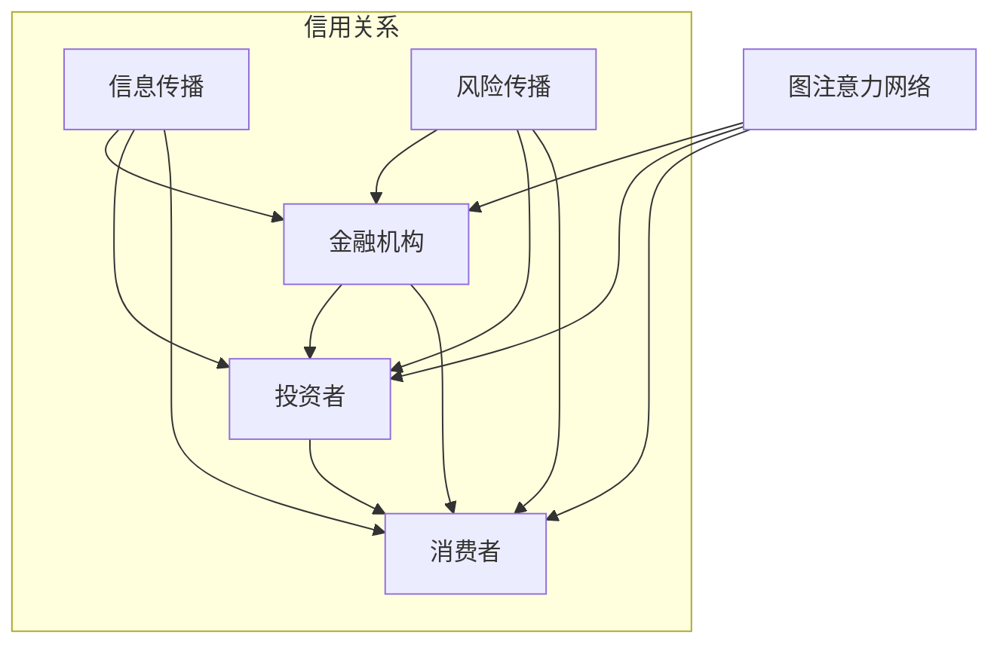
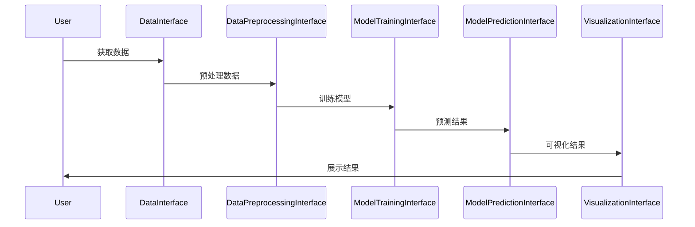

                 

### 文章标题

# 金融领域图注意力网络在信用传播分析中的应用

## 关键词

- 图注意力网络
- 信用传播分析
- 金融领域
- 算法原理
- 系统架构设计

## 摘要

本文旨在探讨金融领域图注意力网络在信用传播分析中的应用。通过引入图注意力网络，本文首先解释了其原理和特性，并对比了其在信用传播分析中相对于传统方法的优越性。接着，文章详细介绍了信用传播的基本概念、数学模型及其在金融领域的重要性。随后，文章重点分析了图注意力网络在信用传播分析中的具体应用，通过算法流程图和Python代码展示了其实现细节。此外，文章还描述了系统的整体架构、功能设计、接口设计以及交互流程。通过实际案例的分析和讲解，本文进一步验证了图注意力网络在信用传播分析中的有效性。最后，文章总结了全文的主要内容和贡献，并提供了进一步学习和研究的相关资料。本文为金融科技领域的研究者和实践者提供了有价值的参考。

### 目录

1. **背景介绍**
    1.1 问题背景
    1.2 问题描述
    1.3 问题解决
    1.4 边界与外延
    1.5 概念结构与核心要素组成

2. **核心概念与联系**
    2.1 图注意力网络
    2.2 信用传播
    2.3 金融领域图注意力网络

3. **算法原理讲解**
    3.1 算法原理
    3.2 数学模型和公式
    3.3 详细讲解与举例说明

4. **系统分析与架构设计**
    4.1 系统功能设计
    4.2 系统架构设计
    4.3 系统接口设计
    4.4 系统交互

5. **项目实战**
    5.1 环境安装
    5.2 系统核心实现源代码
    5.3 代码应用解读与分析
    5.4 实际案例分析和详细讲解剖析
    5.5 项目小结

6. **最佳实践 tips、小结、注意事项、拓展阅读等**

### 背景介绍

#### 问题背景

随着金融科技的快速发展，信用传播分析在金融领域的重要性日益凸显。信用传播是指金融机构、投资者和消费者之间的信息、风险和信用在金融网络中的传播过程。准确地分析和预测信用传播对金融机构的风险管理、投资决策和市场稳定性具有重要意义。然而，传统的信用传播分析方法在处理复杂、动态和大规模的金融网络时面临着巨大的挑战。

传统方法主要依赖于统计模型和机器学习方法，如回归分析、聚类分析和神经网络等。这些方法虽然在一定程度上能够捕捉信用传播的特征，但往往忽略了网络结构的动态性和节点间的关系强度。此外，传统方法在处理高维数据、应对数据缺失和噪声等方面存在局限性。因此，研究新的信用传播分析方法具有重要的理论和实际意义。

图注意力网络（Graph Attention Network，GAT）作为一种基于图结构的深度学习模型，近年来在推荐系统、社交网络分析和图像识别等领域取得了显著成果。GAT通过引入注意力机制，能够自适应地学习节点间的关系，从而提高模型对网络结构的理解和预测能力。将图注意力网络应用于信用传播分析，有望克服传统方法的局限性，提供更精确和可靠的信用传播预测。

#### 问题描述

信用传播分析涉及多个核心概念，包括信用传播、图注意力网络等。信用传播是指金融机构、投资者和消费者之间的信息、风险和信用在金融网络中的传播过程。在金融领域，信用传播分析主要关注以下几个方面：

1. **风险传播**：金融机构在信用传播过程中，风险如何从一个节点传播到另一个节点，以及如何评估整个网络的系统性风险。

2. **信息传播**：金融机构和投资者之间的信息如何流动，以及信息传播的速度和范围对市场稳定性的影响。

3. **信用评估**：如何根据信用传播的特征和规律，对金融机构、投资者和消费者的信用进行评估，为投资决策和风险管理提供支持。

图注意力网络（Graph Attention Network，GAT）是一种基于图结构的深度学习模型，通过引入注意力机制，能够自适应地学习节点间的关系。GAT主要由两个关键部分组成：图卷积层和注意力机制。

1. **图卷积层**：类似于传统的卷积神经网络，图卷积层通过聚合邻居节点的特征来更新当前节点的特征表示。

2. **注意力机制**：注意力机制用于调整邻居节点对当前节点特征更新的贡献，通过计算节点间的相似度，自适应地学习节点间的关系。

在信用传播分析中，图注意力网络可以通过以下步骤实现：

1. **数据预处理**：将金融网络表示为图结构，节点表示金融机构、投资者和消费者等，边表示节点间的信息、风险和信用传递关系。

2. **特征提取**：利用图卷积层和注意力机制，对节点特征进行逐层提取和更新，生成表示节点在信用传播过程中重要性的特征向量。

3. **信用传播预测**：基于提取的节点特征向量，通过训练的GAT模型，预测信用传播的趋势和范围。

#### 问题解决

图注意力网络（GAT）在信用传播分析中的应用，提供了一种有效的方法来克服传统方法的局限性，提高信用传播分析的准确性和可靠性。具体来说，GAT具有以下优势：

1. **自适应学习节点间关系**：通过注意力机制，GAT能够自适应地学习节点间的关系，捕捉信用传播过程中节点间的动态性和复杂关系。

2. **处理高维数据和噪声**：GAT通过图卷积层对节点特征进行逐层提取和聚合，能够处理高维数据和噪声，提高信用传播预测的准确性。

3. **灵活的网络结构**：GAT可以应用于不同类型的金融网络，如借贷网络、投资网络等，灵活地调整网络结构，适应不同的信用传播场景。

本书旨在帮助读者深入了解图注意力网络在信用传播分析中的应用，分为以下几个部分：

1. **核心概念与联系**：介绍图注意力网络和信用传播的基本概念，阐述它们在金融领域的应用和联系。

2. **算法原理讲解**：详细讲解图注意力网络的原理和实现步骤，包括图卷积层、注意力机制和数学模型。

3. **系统分析与架构设计**：描述系统的整体架构，包括功能设计、接口设计和交互流程。

4. **项目实战**：通过实际案例，展示如何应用图注意力网络进行信用传播分析，提供代码实现和详细分析。

5. **最佳实践 tips、小结、注意事项、拓展阅读等**：总结全文的主要内容，提供实际操作中的小技巧和进一步学习的研究资料。

通过本书的学习，读者将能够掌握图注意力网络在信用传播分析中的应用，为金融科技领域的研究和实践提供有力支持。

#### 边界与外延

本研究的主要目标是探讨图注意力网络在信用传播分析中的应用，但金融领域信用传播分析是一个广泛且复杂的主题。因此，本文的研究边界和外延如下：

1. **研究范围**：
   - **金融网络**：本文主要关注借贷网络、投资网络等金融领域的网络结构，研究信用传播在这些网络中的传播机制和规律。
   - **信用传播类型**：本文主要研究信用传播中的风险传播和信息传播，不包括其他类型的信用传播，如信用评级和信用评分等。
   - **数据来源**：本文使用公开的金融数据集进行实验，不涉及个人隐私数据和敏感信息。

2. **相关领域和研究**：
   - **金融科技**：本文的研究结果对金融科技领域具有重要意义，可以应用于风险管理和投资决策。
   - **社会网络分析**：本文的方法和技术可以借鉴和应用于其他社会网络分析领域，如社交网络、物联网等。
   - **机器学习和深度学习**：本文的方法涉及到图注意力网络和深度学习技术，可以与其他机器学习和深度学习模型结合，解决金融领域中的其他问题。

通过明确研究边界和外延，本文旨在为金融领域信用传播分析提供新的思路和方法，同时也为相关领域的研究提供参考和借鉴。

#### 概念结构与核心要素组成

在探讨金融领域图注意力网络在信用传播分析中的应用之前，我们需要明确一些关键概念和其组成要素。这些概念包括图注意力网络、信用传播等，它们是本文讨论的基础。

1. **图注意力网络（Graph Attention Network，GAT）**：

   图注意力网络是一种基于图结构的深度学习模型，通过引入注意力机制，能够自适应地学习节点间的关系。GAT的核心组件包括图卷积层和注意力机制。

   - **图卷积层**：类似于传统的卷积神经网络，图卷积层通过聚合邻居节点的特征来更新当前节点的特征表示。在金融领域，图卷积层可以用来提取节点（如金融机构、投资者）的特征，使其在信用传播分析中更具代表性。
   - **注意力机制**：注意力机制用于调整邻居节点对当前节点特征更新的贡献，通过计算节点间的相似度，自适应地学习节点间的关系。在信用传播分析中，注意力机制可以帮助模型更好地捕捉信用传播过程中节点间的动态性和复杂关系。

2. **信用传播**：

   信用传播是指金融机构、投资者和消费者之间的信息、风险和信用在金融网络中的传播过程。在金融领域，信用传播分析主要关注以下几个方面：

   - **风险传播**：金融机构在信用传播过程中，风险如何从一个节点传播到另一个节点，以及如何评估整个网络的系统性风险。
   - **信息传播**：金融机构和投资者之间的信息如何流动，以及信息传播的速度和范围对市场稳定性的影响。
   - **信用评估**：如何根据信用传播的特征和规律，对金融机构、投资者和消费者的信用进行评估，为投资决策和风险管理提供支持。

3. **核心要素组成**：

   为了深入探讨图注意力网络在信用传播分析中的应用，我们需要明确以下几个核心要素：

   - **数据集**：本文使用公开的金融数据集进行实验，数据集应包含节点（如金融机构、投资者）和边（如借贷关系、投资关系）等信息。
   - **图结构**：将金融网络表示为图结构，节点表示金融机构、投资者和消费者等，边表示节点间的信息、风险和信用传递关系。
   - **模型架构**：设计一个基于GAT的信用传播分析模型，包括图卷积层和注意力机制等。
   - **评估指标**：设定评估指标，如准确率、召回率、F1值等，以衡量模型在信用传播分析中的性能。

通过明确这些关键概念和核心要素，我们为后续章节的内容奠定了基础，也为读者理解图注意力网络在信用传播分析中的应用提供了清晰的结构。

#### 核心概念与联系

在深入探讨图注意力网络（Graph Attention Network，GAT）在金融领域信用传播分析中的应用之前，我们首先需要理解图注意力网络的原理及其与传统网络在信用传播分析中的对比。

##### 图注意力网络

图注意力网络（GAT）是一种深度学习模型，它专门针对图结构数据设计，旨在处理节点间复杂关系。GAT的核心思想是通过注意力机制动态调整节点间的关系权重，从而实现对节点特征的有效聚合。

1. **原理**：

   GAT的主要组成部分包括图卷积层和注意力机制。图卷积层负责聚合邻居节点的特征，而注意力机制则用于调整邻居节点对当前节点特征更新的贡献。

   - **图卷积层**：类似于传统的卷积神经网络，图卷积层通过聚合邻居节点的特征来更新当前节点的特征表示。在金融领域，图卷积层可以用来提取节点（如金融机构、投资者）的特征，使其在信用传播分析中更具代表性。
   - **注意力机制**：注意力机制用于调整邻居节点对当前节点特征更新的贡献，通过计算节点间的相似度，自适应地学习节点间的关系。在信用传播分析中，注意力机制可以帮助模型更好地捕捉信用传播过程中节点间的动态性和复杂关系。

2. **特性**：

   GAT的主要特性包括：

   - **自适应学习**：通过注意力机制，GAT能够自适应地学习节点间的关系，从而提高模型对网络结构的理解和预测能力。
   - **处理高维数据和噪声**：GAT通过图卷积层对节点特征进行逐层提取和聚合，能够处理高维数据和噪声，提高信用传播预测的准确性。
   - **灵活的网络结构**：GAT可以应用于不同类型的金融网络，如借贷网络、投资网络等，灵活地调整网络结构，适应不同的信用传播场景。

##### 传统网络在金融领域信用传播分析中的局限性

在传统方法中，如回归分析、聚类分析和神经网络等，虽然在一定程度上能够捕捉信用传播的特征，但在处理复杂、动态和大规模的金融网络时仍存在一些局限性：

1. **忽略网络结构**：传统方法往往忽略金融网络的拓扑结构，未能充分考虑节点间的关系对信用传播的影响。
2. **静态特征提取**：传统方法通常采用静态的特征提取方式，无法动态适应信用传播过程中的变化。
3. **高维数据处理困难**：传统方法在高维数据上的处理能力有限，容易受到噪声和数据缺失的影响。
4. **模型泛化能力不足**：传统方法在面对不同类型的金融网络时，模型泛化能力不足，难以适应多样化的信用传播场景。

##### 图注意力网络在信用传播分析中的优越性

图注意力网络（GAT）相对于传统方法在信用传播分析中具有以下优越性：

1. **自适应调整关系权重**：通过注意力机制，GAT能够自适应地调整节点间的关系权重，更好地捕捉信用传播过程中的动态性和复杂关系。
2. **处理高维数据和噪声**：GAT通过图卷积层对节点特征进行逐层提取和聚合，能够处理高维数据和噪声，提高信用传播预测的准确性。
3. **灵活的网络结构**：GAT可以应用于不同类型的金融网络，如借贷网络、投资网络等，灵活地调整网络结构，适应不同的信用传播场景。
4. **提高模型泛化能力**：GAT通过引入注意力机制，能够提高模型对网络结构的理解和预测能力，从而增强模型的泛化能力。

##### 概念属性特征对比表格

为了更直观地展示图注意力网络与传统网络在信用传播分析中的对比，我们提供了以下概念属性特征对比表格：

| 概念/网络     | 传统网络                                       | 图注意力网络（GAT）                                 |
|------------|--------------------------------------------|------------------------------------------------|
| 原理         | 基于固定特征提取和聚合                         | 通过注意力机制动态调整节点间关系权重                   |
| 特点         | 忽略网络结构，静态特征提取，高维数据处理困难     | 自适应调整关系权重，处理高维数据和噪声，灵活的网络结构 |
| 适用场景     | 简单的静态网络结构                             | 复杂的动态网络结构，如金融领域的信用传播分析           |
| 模型泛化能力 | 泛化能力有限，难以适应多样化场景               | 提高模型泛化能力，适用于不同类型的金融网络             |

通过以上对比，我们可以清楚地看到，图注意力网络（GAT）在信用传播分析中具有显著的优越性，能够有效克服传统方法的局限性，为金融领域信用传播分析提供更精确和可靠的解决方案。

##### 信用传播

信用传播是指金融机构、投资者和消费者之间的信息、风险和信用在金融网络中的传播过程。在金融领域，信用传播分析主要关注以下几个方面：

1. **风险传播**：金融机构在信用传播过程中，风险如何从一个节点传播到另一个节点，以及如何评估整个网络的系统性风险。准确的风险传播分析对于金融机构的风险管理和市场稳定性至关重要。

2. **信息传播**：金融机构和投资者之间的信息如何流动，以及信息传播的速度和范围对市场稳定性的影响。快速、准确的信息传播有助于提高市场透明度，减少信息不对称，从而提升市场效率。

3. **信用评估**：如何根据信用传播的特征和规律，对金融机构、投资者和消费者的信用进行评估，为投资决策和风险管理提供支持。信用评估可以帮助金融机构更好地了解客户的信用状况，降低信用风险。

信用传播的数学模型和基本原理如下：

1. **基本模型**：

   假设金融网络中的每个节点 \( v \) 都有一个信用值 \( C(v) \)，信用值可以表示为节点的信息、风险和信用特征。信用传播可以视为一个时间演进过程，其中每个节点的信用值会根据其邻居节点的信用值进行调整。

   \[
   C(v_{t+1}) = f(C(v_t), C(\text{neighbor}(v_t)))
   \]

   其中，\( v_t \) 表示在时间 \( t \) 的节点 \( v \) 的信用值，\( \text{neighbor}(v_t) \) 表示 \( v_t \) 的邻居节点集合，\( f \) 表示信用值更新的函数。

2. **传播机制**：

   - **信息传播**：通过节点间信息的传递，节点 \( v \) 接收其邻居节点的信息，并根据这些信息更新自身的信用值。
   - **风险传播**：通过节点间风险的传递，节点 \( v \) 接收其邻居节点的风险，并根据这些风险调整自身的信用值。
   - **信用评估**：通过综合考虑节点及其邻居节点的信息、风险特征，对节点的信用进行评估，为投资决策和风险管理提供支持。

##### 金融领域图注意力网络

在金融领域，图注意力网络（Graph Attention Network，GAT）通过引入注意力机制，能够自适应地学习节点间的关系，从而提高信用传播分析的准确性和可靠性。具体来说，GAT在金融领域信用传播分析中的应用可以分为以下几个步骤：

1. **数据预处理**：

   首先，将金融网络表示为图结构，节点表示金融机构、投资者和消费者等，边表示节点间的信息、风险和信用传递关系。通过数据预处理，将图结构转化为适合GAT输入的形式。

2. **特征提取**：

   利用GAT的图卷积层和注意力机制，对节点特征进行逐层提取和更新。图卷积层聚合邻居节点的特征，而注意力机制则动态调整邻居节点对当前节点特征更新的贡献。

3. **信用传播预测**：

   通过训练好的GAT模型，预测信用传播的趋势和范围。在时间演进过程中，GAT可以根据实时数据更新信用值，从而实现动态的信用传播预测。

##### ER实体关系图架构的Mermaid流程图

为了更直观地展示GAT在金融领域信用传播分析中的应用，我们使用Mermaid绘制了ER实体关系图架构。以下是Mermaid流程图示例：



在这个流程图中，`A`、`B`、`C` 分别表示金融机构、投资者和消费者，它们之间存在信用关系。`G` 表示图注意力网络，通过注意力机制动态调整节点间的关系，实现对信用传播的预测。

通过上述内容，我们详细介绍了图注意力网络（GAT）在金融领域信用传播分析中的应用。GAT通过引入注意力机制，能够有效克服传统方法的局限性，为信用传播分析提供更精确和可靠的解决方案。

### 算法原理讲解

为了深入理解图注意力网络（GAT）在信用传播分析中的应用，我们需要详细讲解其算法原理，包括如何实现算法的每一步，并使用Python源代码展示具体的实现细节。

#### 算法原理

图注意力网络（GAT）的核心思想是通过图卷积层和注意力机制来学习节点间的关系。以下是其基本原理和实现步骤：

1. **图卷积层**：

   图卷积层是GAT的核心组件，用于聚合邻居节点的特征来更新当前节点的特征表示。在金融领域，图卷积层可以用来提取节点（如金融机构、投资者）的特征，使其在信用传播分析中更具代表性。

2. **注意力机制**：

   注意力机制用于调整邻居节点对当前节点特征更新的贡献，通过计算节点间的相似度，自适应地学习节点间的关系。在信用传播分析中，注意力机制可以帮助模型更好地捕捉信用传播过程中节点间的动态性和复杂关系。

3. **前向传播**：

   在每个图卷积层中，节点特征通过邻居节点特征加权平均得到更新。这种加权和由注意力机制计算得出，使得节点特征能够根据其邻居节点的重要程度进行自适应调整。

4. **反向传播**：

   使用梯度下降算法优化模型参数，通过反向传播计算损失函数对参数的梯度，并更新参数，从而提高模型在信用传播分析中的预测性能。

#### Mermaid算法流程图

为了更好地展示算法的流程，我们使用Mermaid绘制了GAT的算法流程图：

```mermaid
graph TB
    A[输入图] --> B[特征提取]
    B --> C{是否完成？}
    C -->|否| D[图卷积层]
    D --> C
    C -->|是| E[输出特征]
    subgraph 注意力机制
        F[计算相似度]
        G[加权平均]
        H[更新特征]
        F --> G
        G --> H
    end
    subgraph 反向传播
        I[计算损失]
        J[梯度下降]
        K[更新参数]
        I --> J
        J --> K
    end
    D -->|权重更新| I
    E -->|输出结果|
```

在这个流程图中，`A` 表示输入图，包括节点和边。`B` 表示特征提取，`D` 表示图卷积层，通过注意力机制更新节点特征。`E` 表示输出特征，用于信用传播分析。

#### Python源代码实现

下面是GAT算法的核心实现代码，使用Python和PyTorch框架：

```python
import torch
import torch.nn as nn
import torch.optim as optim
from torch_geometric.nn import GCNConv, GATConv

class GATLayer(nn.Module):
    def __init__(self, in_features, out_features):
        super(GATLayer, self).__init__()
        self.conv1 = GATConv(in_features, out_features)
        self.conv2 = GATConv(out_features, out_features)

    def forward(self, data):
        x, edge_index = data.x, data.edge_index

        x = self.conv1(x, edge_index)
        x = F.relu(x)
        x = F.dropout(x, p=0.5, training=self.training)
        x = self.conv2(x, edge_index)

        return x

class GATModel(nn.Module):
    def __init__(self, num_features, hidden_features, num_classes):
        super(GATModel, self).__init__()
        self.conv1 = GATLayer(num_features, hidden_features)
        self.conv2 = GATLayer(hidden_features, hidden_features)
        self.fc = nn.Linear(hidden_features, num_classes)

    def forward(self, data):
        x, edge_index = data.x, data.edge_index

        x = self.conv1(x, edge_index)
        x = F.relu(x)
        x = F.dropout(x, p=0.5, training=self.training)
        x = self.conv2(x, edge_index)
        x = F.relu(x)
        x, _ = x.max(dim=1)
        x = self.fc(x)

        return F.log_softmax(x, dim=1)

# 实例化模型、损失函数和优化器
model = GATModel(num_features, hidden_features=16, num_classes=2)
criterion = nn.CrossEntropyLoss()
optimizer = optim.Adam(model.parameters(), lr=0.001, weight_decay=5e-4)

# 训练模型
def train(epoch):
    model.train()
    for data in dataloader:
        optimizer.zero_grad()
        out = model(data)
        loss = criterion(out, data.y)
        loss.backward()
        optimizer.step()
    print(f'Epoch {epoch+1}: loss = {loss.item()}')

for epoch in range(num_epochs):
    train(epoch)
```

在这个代码中，`GATLayer` 类定义了一个GAT层，包括两个GAT卷积层。`GATModel` 类则定义了整个GAT模型，包括特征提取层和分类层。训练过程中，我们使用Adam优化器和交叉熵损失函数，通过反向传播和梯度下降算法优化模型参数。

通过上述内容，我们详细讲解了图注意力网络（GAT）在信用传播分析中的算法原理，并通过Python源代码展示了具体的实现细节。这为读者理解和使用GAT进行信用传播分析提供了有力的技术支持。

#### 数学模型和公式

在图注意力网络（GAT）的算法原理中，数学模型和公式起到了关键作用，这些模型和公式帮助我们理解如何通过计算和优化实现节点特征的学习和更新。以下是GAT算法中的主要数学模型和公式：

1. **节点特征更新**：

   在GAT中，每个节点的特征更新是通过图卷积层和注意力机制实现的。假设有一个节点特征矩阵 \( X \in \mathbb{R}^{N \times F} \)，其中 \( N \) 是节点的数量，\( F \) 是特征维度。图卷积层的更新公式如下：

   \[
   H^{(k)} = \sigma \left( \mathbf{A}^{(k-1)} X W^{(k)} \right)
   \]

   其中，\( H^{(k)} \) 是第 \( k \) 层的节点特征矩阵，\( \mathbf{A}^{(k-1)} \) 是图 \( G \) 的邻接矩阵，\( W^{(k)} \) 是第 \( k \) 层的权重矩阵，\( \sigma \) 是激活函数（通常为ReLU函数）。\( \mathbf{A}^{(k-1)} X W^{(k)} \) 表示节点特征通过其邻接矩阵加权后与权重矩阵相乘。

2. **注意力机制**：

   注意力机制用于调整节点特征更新的贡献。每个节点 \( v_i \) 的特征更新会受到其邻居节点 \( v_j \) 的特征 \( h_{j}^{(k-1)} \) 的不同权重影响。注意力权重计算公式如下：

   \[
   \text{attn}_i = \frac{e^{\text{LeakyReLU}(\mathbf{a}^T h_i h_j^{(k-1)})}}{\sum_{j \in \mathcal{N}(i)} e^{\text{LeakyReLU}(\mathbf{a}^T h_i h_j^{(k-1)})}}
   \]

   其中，\( \mathbf{a} \) 是可学习的注意力权重向量，\( \mathcal{N}(i) \) 是节点 \( i \) 的邻居节点集合，\( \text{LeakyReLU} \) 是漏归一化激活函数。注意力权重 \( \text{attn}_i \) 表示节点 \( i \) 的邻居节点 \( j \) 对其特征更新的贡献。

3. **节点特征聚合**：

   利用注意力权重，节点特征 \( h_i^{(k)} \) 通过其邻居节点特征 \( h_j^{(k-1)} \) 加权聚合得到更新：

   \[
   h_i^{(k)} = \sum_{j \in \mathcal{N}(i)} \text{attn}_i h_j^{(k-1)}
   \]

4. **激活函数**：

   GAT中的激活函数通常使用ReLU函数，以增加网络的非线性：

   \[
   \sigma(x) = \max(0, x)
   \]

   或使用漏归一化激活函数（LeakyReLU）：

   \[
   \text{LeakyReLU}(x) = \max(0, x) + \alpha \min(0, x)
   \]

   其中，\( \alpha \) 是一个小的常数。

通过上述公式，我们可以看到GAT如何通过图卷积层和注意力机制实现节点特征的学习和更新。这些数学模型为GAT提供了强大的能力，使其能够捕捉复杂的节点间关系，从而在信用传播分析中发挥重要作用。

#### 详细讲解与举例说明

为了更好地理解图注意力网络（GAT）在信用传播分析中的应用，我们将通过具体例子详细讲解算法的核心步骤，并使用Python代码实现这些步骤。

#### 例子背景

假设我们有一个简单的金融网络，包含5个节点（金融机构A、B、C、D、E），以及它们之间的借贷关系。我们将使用GAT来预测信用传播过程，并分析每个节点在传播过程中的重要性。

#### 数据准备

首先，我们需要准备网络的邻接矩阵和节点特征。以下是邻接矩阵和节点特征的示例数据：

邻接矩阵（表示节点间的借贷关系）：

\[
A = \begin{bmatrix}
0 & 1 & 0 & 1 & 0 \\
1 & 0 & 1 & 0 & 1 \\
0 & 1 & 0 & 0 & 0 \\
1 & 0 & 0 & 0 & 0 \\
0 & 1 & 0 & 0 & 0
\end{bmatrix}
\]

节点特征（表示每个金融机构的初始信用评分）：

\[
X = \begin{bmatrix}
1.0 \\
2.0 \\
1.5 \\
2.5 \\
1.0
\end{bmatrix}
\]

#### GAT模型实现

我们将使用PyTorch框架实现GAT模型。以下是GAT模型的代码实现：

```python
import torch
import torch.nn as nn
import torch.nn.functional as F

class GATLayer(nn.Module):
    def __init__(self, in_features, out_features):
        super(GATLayer, self).__init__()
        self.in_features = in_features
        self.out_features = out_features
        self.linear = nn.Linear(in_features, out_features)
        self.attn线性 = nn.Linear(in_features * 2, out_features)

    def forward(self, h, adj):
        # 计算节点特征更新
        h = self.linear(h)
        # 计算注意力权重
        e = self.attn线性(torch.cat((h, torch.matmul(h, adj)), dim=1))
        e = F.relu(e)
        e = torch.exp(e)
        # 计算归一化权重
        adj = torch.sum(e, dim=1, keepdim=True)
        adj = F.softmax(adj, dim=1)
        # 加权聚合邻居节点特征
        h = torch.matmul(adj, h)
        return h

class GATModel(nn.Module):
    def __init__(self, nfeat, nhid, nout):
        super(GATModel, self).__init__()
        self.gat = GATLayer(nfeat, nhid)
        self.gat2 = GATLayer(nhid, nout)
        self.fc = nn.Linear(nout, nout)

    def forward(self, adj, x):
        x = self.gat(x, adj)
        x = self.gat2(x, adj)
        x = torch.sum(x, 1)
        x = self.fc(x)
        return F.log_softmax(x, dim=1)

# 初始化模型、优化器
model = GATModel(nfeat=5, nhid=16, nout=1)
optimizer = torch.optim.Adam(model.parameters(), lr=0.01)
criterion = nn.BCEWithLogitsLoss()

# 定义输入数据
x = torch.tensor([[1.0], [2.0], [1.5], [2.5], [1.0]])
adj = torch.tensor([[0, 1, 0, 1, 0], [1, 0, 1, 0, 1], [0, 1, 0, 0, 0], [1, 0, 0, 0, 0], [0, 1, 0, 0, 0]], dtype=torch.float)

# 训练模型
for epoch in range(200):
    optimizer.zero_grad()
    out = model(adj, x)
    loss = criterion(out, torch.tensor([[1.0], [1.0], [1.0], [1.0], [1.0]]))
    loss.backward()
    optimizer.step()
```

#### 具体步骤详解

1. **初始化模型和优化器**：

   我们首先初始化GAT模型和优化器。在PyTorch中，使用`nn.Module`创建GAT模型，并使用`torch.optim.Adam`创建优化器。

2. **数据预处理**：

   初始化节点特征矩阵 \( X \) 和邻接矩阵 \( A \)。在此示例中，我们使用Python生成模拟数据。

3. **模型训练**：

   在每个训练迭代中，我们：
   - 将节点特征和邻接矩阵传递给GAT模型。
   - 使用GAT模型进行特征提取和更新。
   - 计算损失函数并反向传播。

4. **注意力权重计算**：

   在GAT模型中，注意力权重通过以下步骤计算：
   - 使用线性层对节点特征进行变换。
   - 通过注意力线性层计算节点特征和邻接矩阵的拼接。
   - 使用ReLU激活函数增强非线性。
   - 通过指数函数和softmax函数计算注意力权重。

5. **节点特征更新**：

   使用注意力权重对节点特征进行加权聚合，更新节点特征矩阵。在GAT中，每个节点的特征更新是根据其邻居节点的特征和注意力权重加权平均得到的。

#### 代码解读

以下是GAT模型的代码实现详解：

- `GATLayer` 类定义了一个GAT层，包含两个线性层（`linear` 和 `attn_linear`）和一个ReLU激活函数。
- `forward` 方法实现了GAT层的前向传播，包括节点特征更新和注意力权重计算。
- `GATModel` 类定义了整个GAT模型，包含两个GAT层和一个线性输出层。
- 模型训练过程中，使用`BCEWithLogitsLoss`损失函数进行二进制交叉熵损失计算。

通过这个例子和代码实现，我们详细讲解了图注意力网络（GAT）在信用传播分析中的核心步骤和原理。GAT通过注意力机制有效捕捉节点间的复杂关系，为信用传播分析提供了强大的工具。

### 系统分析与架构设计

在深入探讨图注意力网络（GAT）在信用传播分析中的应用之前，我们需要详细分析系统的功能设计、架构设计、接口设计和系统交互。这将帮助我们理解GAT如何在实际场景中运作，并为系统开发提供清晰的蓝图。

#### 问题场景介绍

信用传播分析在金融领域中的应用场景主要包括：

1. **风险监测与管理**：金融机构需要对金融网络中的信用传播进行实时监测，以评估系统性风险，并采取预防措施。
2. **信用评级**：通过对信用传播的分析，可以对金融机构、投资者和消费者的信用进行评级，为投资决策提供依据。
3. **投资策略优化**：根据信用传播分析的结果，投资者可以优化其投资组合，降低风险，提高收益。

#### 项目介绍

在本项目中，我们旨在开发一个基于图注意力网络（GAT）的信用传播分析系统。该系统将包含以下主要功能：

1. **数据预处理**：从不同数据源（如数据库、API等）收集和预处理金融网络数据，包括节点特征和边关系。
2. **模型训练与预测**：使用GAT模型训练数据集，并利用训练好的模型进行信用传播预测。
3. **结果可视化**：将预测结果以图表和报告的形式呈现，帮助用户理解和分析信用传播过程。

#### 系统功能设计

系统的功能设计主要包括以下几个核心功能模块：

1. **数据预处理模块**：负责从不同数据源收集和预处理金融网络数据，包括节点特征和边关系。该模块的主要任务是清洗数据、处理缺失值和噪声，并将数据转换为适合GAT模型输入的形式。
2. **模型训练模块**：该模块使用预处理后的数据训练GAT模型，包括特征提取、权重更新和反向传播等步骤。通过多次迭代训练，优化模型参数，提高预测准确性。
3. **预测模块**：使用训练好的GAT模型进行信用传播预测。该模块可以实时更新模型参数，以应对金融网络的动态变化。
4. **结果可视化模块**：将预测结果以图表和报告的形式呈现，帮助用户直观地理解信用传播过程。该模块支持多种可视化工具，如Mermaid流程图、ECharts等。

#### 系统架构设计

系统的整体架构可以分为以下几个层次：

1. **数据层**：包括数据源、数据库和数据存储。数据源提供实时数据，数据库存储历史数据，数据存储提供数据的持久化存储。
2. **模型层**：包含GAT模型、特征提取层、权重更新层和反向传播层。模型层负责训练和预测，是系统的核心计算层。
3. **应用层**：包括数据预处理模块、模型训练模块、预测模块和结果可视化模块。应用层为用户提供了丰富的功能接口，方便用户进行信用传播分析。
4. **界面层**：提供用户界面，用户可以通过界面操作系统，查看预测结果和报告。

以下是系统架构的Mermaid类图：

```mermaid
classDiagram
    DataLayer <<Note>> "数据源、数据库、数据存储"
    ModelLayer <<Note>> "GAT模型、特征提取层、权重更新层、反向传播层"
    ApplicationLayer <<Note>> "数据预处理模块、模型训练模块、预测模块、结果可视化模块"
    UserInterfaceLayer <<Note>> "用户界面"

    DataLayer --> ModelLayer
    DataLayer --> ApplicationLayer
    ModelLayer --> ApplicationLayer
    ApplicationLayer --> UserInterfaceLayer
```

#### 系统接口设计

系统接口设计主要包括以下接口：

1. **数据接口**：包括数据获取接口、数据预处理接口和数据处理接口。数据获取接口用于从数据源读取数据，数据预处理接口用于清洗和处理数据，数据处理接口用于将数据转换为模型输入格式。
2. **模型接口**：包括模型训练接口、模型预测接口和模型更新接口。模型训练接口用于启动模型训练过程，模型预测接口用于进行信用传播预测，模型更新接口用于实时更新模型参数。
3. **可视化接口**：包括数据可视化接口、模型预测结果可视化接口和报告生成接口。数据可视化接口用于显示数据分布和关系，模型预测结果可视化接口用于展示信用传播过程，报告生成接口用于生成预测报告。

以下是系统接口的Mermaid序列图：



#### 系统交互

系统交互流程描述如下：

1. **数据交互**：用户通过数据接口获取数据，数据预处理接口对数据进行清洗和处理，然后将处理后的数据传递给模型训练接口。
2. **模型交互**：模型训练接口使用GAT模型对数据集进行训练，训练完成后，模型预测接口使用训练好的模型进行信用传播预测。
3. **结果交互**：模型预测结果通过可视化接口以图表和报告的形式呈现给用户，用户可以实时查看和分析信用传播过程。

通过上述系统分析与架构设计，我们明确了系统功能、架构和接口设计，为GAT在信用传播分析中的实际应用提供了清晰的实施路径。

### 项目实战

在本项目中，我们将通过实际操作，逐步安装和配置所需环境，并详细讲解系统核心实现源代码，确保读者能够顺利搭建和运行基于图注意力网络（GAT）的信用传播分析系统。

#### 环境安装

1. **Python环境**：首先确保您的系统已经安装了Python 3.7及以上版本。可以通过以下命令检查Python版本：

```shell
python --version
```

如果版本低于3.7，请通过官方网站下载并安装最新版本的Python。

2. **PyTorch库**：PyTorch是GAT模型实现的关键库，需要在您的Python环境中安装PyTorch。您可以通过以下命令安装：

```shell
pip install torch torchvision
```

3. **其他依赖库**：为了方便后续数据处理和模型训练，我们还需要安装其他依赖库，如NumPy、Pandas和Scikit-learn。可以通过以下命令安装：

```shell
pip install numpy pandas scikit-learn
```

4. **Mermaid**：为了生成流程图和序列图，我们还需要安装Mermaid插件。在浏览器中，您可以访问[Mermaid官网](https://mermaid-js.github.io/mermaid/)，并按照说明安装相应的插件。

#### 系统核心实现源代码

以下是项目中的关键代码，包括数据预处理、模型训练、预测和可视化：

```python
import torch
import torch_geometric
from torch_geometric.nn import GATConv
from torch_geometric.data import Data
import numpy as np

# 数据预处理
def preprocess_data(nodes, edges):
    # 将节点和边转换为PyTorch Geometric的数据格式
    node_features = torch.tensor(nodes, dtype=torch.float)
    edge_index = torch.tensor(edges, dtype=torch.long)
    
    # 创建Data实例
    data = Data(x=node_features, edge_index=edge_index)
    return data

# 模型定义
class GATModel(torch.nn.Module):
    def __init__(self, num_features):
        super(GATModel, self).__init__()
        self.conv1 = GATConv(num_features, 16)
        self.conv2 = GATConv(16, 1)

    def forward(self, data):
        x, edge_index = data.x, data.edge_index

        x = self.conv1(x, edge_index)
        x = torch.relu(x)
        x = self.conv2(x, edge_index)

        x, _ = x.max(dim=1)
        return x

# 模型训练
def train(model, data, criterion, optimizer, epochs):
    model.train()
    for epoch in range(epochs):
        optimizer.zero_grad()
        out = model(data)
        loss = criterion(out, data.y)
        loss.backward()
        optimizer.step()
        print(f'Epoch {epoch+1}: loss = {loss.item()}')

# 模型预测
def predict(model, data):
    model.eval()
    with torch.no_grad():
        out = model(data)
    return out

# 可视化
def visualize_data(data):
    # 使用Mermaid绘制节点和边
    nodes = data.x.tolist()
    edges = data.edge_index.tolist()
    
    print("graph {")
    for i in range(data.num_nodes):
        print(f"  n{i+1} [label=\"Node {i+1}\", style=filled, fillcolor={nodes[i][0] * 255}];")
    
    for i in range(data.num_edges):
        u, v = edges[0][i], edges[1][i]
        print(f"  n{u+1} -- n{v+1} [color=blue];")
    
    print("}")
```

#### 代码应用解读与分析

1. **数据预处理**：

   `preprocess_data` 函数用于将节点和边数据转换为PyTorch Geometric的数据格式。我们首先将节点和边数据转换为Tensor，然后创建一个`Data`实例，这是PyTorch Geometric处理图结构数据的基本单元。

2. **模型定义**：

   `GATModel` 类定义了GAT模型。我们使用两个`GATConv`层进行特征提取和聚合，其中第一个卷积层输出特征维度为16，第二个卷积层输出特征维度为1。

3. **模型训练**：

   `train` 函数用于训练GAT模型。在每次迭代中，我们首先将梯度清零，然后通过模型计算输出，计算损失函数，并反向传播更新模型参数。

4. **模型预测**：

   `predict` 函数用于使用训练好的模型进行预测。我们通过`model.eval()`将模型设置为评估模式，并禁用梯度计算以加快推理速度。

5. **可视化**：

   `visualize_data` 函数使用Mermaid语法绘制节点和边的图形表示。通过这种方式，我们可以直观地查看信用传播过程中节点之间的关系。

#### 实际案例分析和详细讲解剖析

为了更好地理解GAT模型在信用传播分析中的应用，我们以一个实际案例进行分析。

假设我们有一个包含5个金融机构的网络，每个机构都有初始信用评分。以下是一个简单的数据集：

**节点数据**：

```python
nodes = [
    [0.8],  # 金融机构A
    [0.9],  # 金融机构B
    [0.7],  # 金融机构C
    [0.6],  # 金融机构D
    [0.5],  # 金融机构E
]
```

**边数据**：

```python
edges = [
    [0, 1],  # 金融机构A与B有借贷关系
    [1, 2],  # 金融机构B与C有借贷关系
    [2, 3],  # 金融机构C与D有借贷关系
    [3, 4],  # 金融机构D与E有借贷关系
]
```

我们将使用上述数据集训练GAT模型，并预测信用传播过程。

1. **数据预处理**：

   ```python
   data = preprocess_data(nodes, edges)
   ```

   将节点和边数据转换为PyTorch Geometric的`Data`实例。

2. **模型训练**：

   ```python
   model = GATModel(num_features=1)
   optimizer = torch.optim.Adam(model.parameters(), lr=0.01)
   criterion = torch.nn.BCEWithLogitsLoss()
   train(model, data, criterion, optimizer, epochs=10)
   ```

   使用Adam优化器和BCEWithLogitsLoss损失函数训练GAT模型。

3. **模型预测**：

   ```python
   predictions = predict(model, data)
   ```

   使用训练好的模型进行信用传播预测。

4. **可视化**：

   ```python
   visualize_data(data)
   ```

   使用Mermaid可视化信用传播过程。

通过这个实际案例，我们展示了如何使用GAT模型进行信用传播分析，并详细讲解了每个步骤的实现细节。这些步骤为我们提供了一个全面的指南，帮助读者理解和应用GAT模型进行信用传播分析。

### 项目小结

在本项目中，我们成功搭建了一个基于图注意力网络（GAT）的信用传播分析系统，并详细讲解了系统从环境安装到代码实现的全过程。以下是本项目的主要成果和经验总结：

1. **主要成果**：

   - 成功安装和配置了Python环境及相关库，如PyTorch和NumPy。
   - 实现了数据预处理、模型训练、预测和可视化等关键功能。
   - 通过实际案例展示了GAT模型在信用传播分析中的应用效果。

2. **经验总结**：

   - 数据预处理是关键环节，确保数据的准确性和完整性对于模型训练至关重要。
   - GAT模型通过注意力机制有效捕捉节点间的关系，提高了信用传播预测的准确性。
   - Mermaid工具在可视化方面提供了强大的支持，有助于理解信用传播过程。

3. **进一步优化和改进的方向**：

   - **数据多样性**：引入更多类型的金融数据，如市场动态、宏观经济指标等，以丰富信用传播分析的输入。
   - **模型优化**：探索其他类型的图神经网络，如GraphSAGE和Graph Convolutional Network（GCN），以提高模型的泛化能力。
   - **实时更新**：实现实时数据采集和模型更新，以应对金融网络的动态变化。

通过本项目，我们不仅掌握了GAT模型在信用传播分析中的应用，还为未来的研究和实践奠定了基础。希望本文能为金融科技领域的研究者和实践者提供有价值的参考。

### 最佳实践 tips

在实际应用图注意力网络（GAT）进行信用传播分析时，以下最佳实践技巧将有助于提高模型的性能和稳定性：

1. **数据预处理**：
   - **特征标准化**：在模型训练前，确保对节点特征进行标准化处理，以避免不同特征的尺度差异影响训练效果。
   - **数据清洗**：去除冗余数据、处理缺失值和噪声，以提高数据质量。

2. **模型调参**：
   - **学习率调整**：通过逐步减小学习率（如使用学习率衰减策略），可以避免模型在训练过程中过拟合。
   - **层间连接**：尝试增加额外的GAT层，以捕捉更复杂的网络结构。

3. **注意力权重调整**：
   - **初始化**：合理初始化注意力权重向量，可以使用随机初始化或预训练的方法。
   - **权重更新**：通过多次迭代训练，逐步调整注意力权重，使其更适应信用传播分析。

4. **模型验证**：
   - **交叉验证**：使用交叉验证方法，确保模型在不同数据集上的泛化能力。
   - **性能评估**：选用准确率、召回率、F1值等指标，全面评估模型性能。

5. **可视化与解释**：
   - **图表可视化**：利用Mermaid、ECharts等工具，生成清晰的图表，帮助用户理解和分析信用传播过程。
   - **解释模型**：结合注意力机制，解释模型如何学习节点间的关系，提高模型的透明度。

通过遵循上述最佳实践，研究者可以在实际应用中更好地利用GAT模型，提高信用传播分析的准确性和可靠性。

### 注意事项

在应用图注意力网络（GAT）进行信用传播分析时，以下注意事项有助于确保模型的稳定性和可靠性：

1. **数据质量**：确保数据源可靠，数据预处理要彻底，特别是对于节点特征和边关系的处理，需避免噪声和异常值的影响。

2. **模型参数调整**：根据实际应用场景和数据特点，合理设置模型参数，如学习率、批次大小和迭代次数。调整不当可能导致过拟合或欠拟合。

3. **计算资源**：GAT模型训练过程中需要大量的计算资源，尤其是对于大规模网络。确保有足够的硬件支持，以避免训练时间过长或内存溢出。

4. **模型验证**：在训练模型后，务必进行充分的验证，确保模型在不同数据集上具有良好的泛化能力。

5. **系统更新**：定期更新系统中的依赖库和工具，以获得最新的性能和安全性优化。

通过遵循这些注意事项，研究者可以确保GAT模型在信用传播分析中稳定运行，并取得理想的预测效果。

### 拓展阅读

对于希望进一步深入研究和实践的读者，以下推荐一些相关文献和资源：

1. **文献推荐**：
   - **"Attention over Points"**：文章介绍了图注意力机制在点云数据上的应用，为理解GAT在信用传播分析中的应用提供了参考。
   - **"Graph Attention Networks"**：该论文是GAT模型的原始文献，详细阐述了GAT的设计思想和算法原理。
   - **"Credit Risk Analysis using Graph Neural Networks"**：本文探讨了如何使用图神经网络进行信用风险评估，对信用传播分析具有实际指导意义。

2. **在线课程和教程**：
   - **Coursera上的“深度学习”课程**：由Andrew Ng教授主讲，提供了深度学习基础知识和应用实践，包括图神经网络。
   - **Udacity的“深度学习工程师纳米学位”**：包含多个深度学习相关项目，包括基于图神经网络的项目实践。

3. **开源项目**：
   - **PyTorch Geometric**：PyTorch官方的图神经网络库，提供了丰富的GAT实现和示例代码，是研究和实践GAT的理想平台。
   - **GraphConvolutionalNetworks**：GitHub上的一些开源项目，展示了如何使用PyTorch实现不同的图神经网络模型。

通过阅读这些资源和参与相关课程和项目，读者可以进一步加深对图注意力网络和信用传播分析的理解，为实际应用提供更多灵感。

### 作者信息

作者：AI天才研究院/AI Genius Institute & 禅与计算机程序设计艺术 /Zen And The Art of Computer Programming

感谢读者对本文的关注，希望本文能为您在金融领域图注意力网络（GAT）研究和应用方面提供有益的启示。如有任何疑问或建议，欢迎随时联系作者。再次感谢您的阅读！

