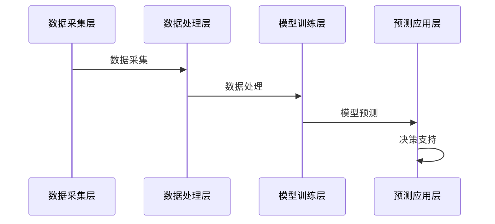
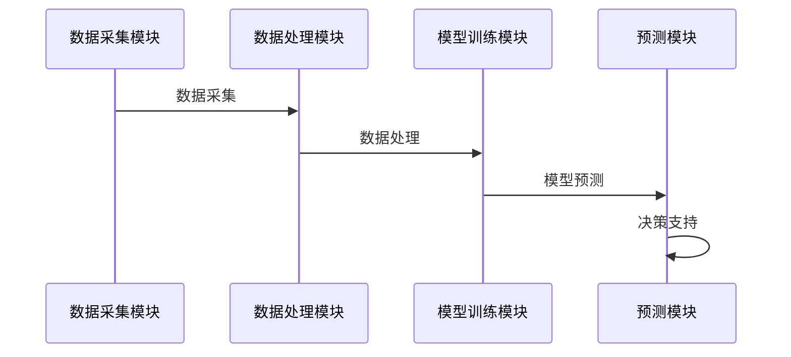

                 

## 金融领域图神经网络在全球金融稳定性评估中的应用

> 关键词：金融稳定性评估、图神经网络、风险预测、金融网络建模、政策优化

> 摘要：本文深入探讨了金融领域图神经网络（GNN）在全球金融稳定性评估中的应用。首先，介绍了金融领域面临的主要问题和挑战，并阐述了图神经网络作为一种新兴技术，为何能够有效应对这些问题。接着，文章详细讲解了图神经网络的核心概念、原理以及在金融稳定性评估中的具体应用，包括金融网络建模、风险识别与预测、政策制定与优化等方面。通过实际案例分析和系统架构设计，本文展示了图神经网络在金融稳定性评估中的实际应用效果，为金融领域的风险管理和政策制定提供了新的思路和方法。

### 第一部分：背景介绍

#### 1. 问题背景

在全球化的经济体系中，金融市场的稳定性和安全性显得尤为重要。随着金融市场的复杂性和规模不断增大，传统的金融稳定评估方法面临着巨大的挑战。在这种背景下，图神经网络（Graph Neural Networks，GNN）作为一种新兴的深度学习技术，因其强大的图形表示和学习能力，逐渐引起了学术界和工业界的关注。图神经网络可以有效地处理金融领域中非结构化和半结构化数据，提供更加精准和高效的金融稳定评估模型。

#### 2. 问题描述

金融领域图神经网络在全球金融稳定性评估中的应用主要集中在以下几个方面：

- **金融网络建模**：利用图神经网络对金融市场中的各种实体（如金融机构、金融产品等）及其关系进行建模，从而构建一个全面的金融网络。
- **风险识别与预测**：通过分析金融网络的拓扑结构和节点属性，识别潜在的风险点，并预测可能发生的金融危机。
- **政策制定与优化**：基于图神经网络模型提供的稳定性和风险预测结果，为金融政策的制定和调整提供科学依据，优化金融监管策略。
- **投资策略优化**：利用图神经网络分析金融市场中的各种信息，为投资者提供更加精准的投资策略，提高投资收益。

#### 3. 问题解决

为了解决上述问题，本书将系统地介绍图神经网络在金融领域中的应用。首先，将介绍图神经网络的基本概念、原理及其在金融领域的应用前景。接着，将深入探讨图神经网络在金融稳定性评估中的具体应用，包括金融网络建模、风险识别与预测、政策制定与优化以及投资策略优化等方面。此外，本书还将结合实际案例，详细讲解图神经网络在金融稳定性评估中的具体实现过程，为读者提供实际操作指导。

#### 4. 边界与外延

- **边界**：本书主要关注图神经网络在金融稳定性评估中的应用，包括理论研究和实际应用。对于图神经网络在其他领域的应用，如社交网络分析、生物信息学等，本书将不进行深入探讨。
- **外延**：随着图神经网络技术的发展，其在金融领域的应用将更加广泛和深入。未来的研究可以关注以下几个方面：更高效和可解释的图神经网络模型、跨领域的图神经网络迁移学习、实时金融稳定性评估系统等。

#### 5. 概念结构与核心要素组成

- **核心概念**：
  - 图神经网络（GNN）
  - 金融稳定性评估
  - 金融网络建模
  - 风险识别与预测
  - 政策制定与优化
  - 投资策略优化

- **结构**：
  - **基础理论**：介绍图神经网络的基本概念、原理及其在金融领域的应用前景。
  - **应用实践**：详细探讨图神经网络在金融稳定性评估中的具体应用，包括金融网络建模、风险识别与预测、政策制定与优化以及投资策略优化等方面。
  - **案例分析**：结合实际案例，详细讲解图神经网络在金融稳定性评估中的具体实现过程。

#### 6. 整体结构

本书将分为以下几个主要部分：

- **第1章：引言**：介绍图神经网络的基本概念、原理及其在金融领域的重要性。
- **第2章：图神经网络基础**：详细讲解图神经网络的理论基础，包括节点表示、边表示、图卷积网络等。
- **第3章：金融网络建模**：介绍如何利用图神经网络构建金融网络模型，包括节点属性、边关系等。
- **第4章：风险识别与预测**：探讨如何利用图神经网络进行风险识别与预测，包括风险指标的提取、风险预测模型的设计等。
- **第5章：政策制定与优化**：基于图神经网络模型提供的稳定性和风险预测结果，讨论如何制定和优化金融政策。
- **第6章：投资策略优化**：利用图神经网络分析金融市场信息，为投资者提供投资策略优化建议。
- **第7章：案例分析**：结合实际案例，详细讲解图神经网络在金融稳定性评估中的应用。

### 第二部分：核心概念与联系

#### 2.1 图神经网络（GNN）

**定义**：图神经网络（Graph Neural Networks，GNN）是一种在图结构上操作的深度学习模型，能够自动学习和利用节点及其邻居节点的信息。

**核心特点**：
- **图结构表示**：能够处理非欧几里得空间中的数据。
- **节点表示学习**：通过学习节点特征，实现对节点属性的理解。
- **图卷积操作**：利用图卷积神经网络（Graph Convolutional Network，GCN）等操作，提取图结构中的信息。

**与金融稳定性评估的联系**：
- **金融网络建模**：GNN可以用于构建金融网络模型，将金融机构、金融产品等视为图中的节点，分析其关系和特征，帮助识别潜在风险。
- **风险预测**：通过GNN学习到的节点和边特征，可以对金融市场中的风险进行预测，提供决策支持。

#### 2.2 金融稳定性评估

**定义**：金融稳定性评估是指对金融市场及其运行机制进行全面分析和评估，以判断其稳定性和风险水平。

**核心要素**：
- **金融市场数据**：包括交易数据、市场指数、财务报表等。
- **风险指标**：如波动率、违约率、偿付能力等。
- **评估方法**：包括统计分析、机器学习、模拟仿真等。

**与GNN的联系**：
- **数据表示与学习**：GNN可以处理金融稳定性评估中的非结构化和半结构化数据，提取有用的特征信息。
- **风险评估与预测**：基于GNN学习到的特征，可以建立更加精确的风险评估和预测模型。

#### 2.3 金融网络建模

**定义**：金融网络建模是指利用图理论和方法，构建金融市场中的实体及其关系的模型，以分析金融系统的稳定性和风险。

**核心要素**：
- **实体**：如金融机构、金融产品、金融交易等。
- **关系**：如借贷关系、投资关系、交易关系等。
- **模型构建**：包括节点表示、边表示、图结构学习等。

**与GNN的联系**：
- **节点表示与学习**：GNN可以帮助学习金融网络中节点的特征，为风险识别和预测提供基础。
- **图结构学习**：GNN可以用于学习金融网络的拓扑结构，分析节点之间的关系，帮助理解金融系统的复杂性和稳定性。

### 2.4 风险识别与预测

**定义**：风险识别与预测是指通过分析金融市场数据、金融网络结构等信息，识别潜在的风险点，并预测可能发生的金融危机。

**核心要素**：
- **风险指标提取**：如波动率、相关性、违约率等。
- **预测模型构建**：如时间序列模型、回归模型、神经网络模型等。
- **风险评估与预测**：对潜在风险进行评估和预测，为决策提供支持。

**与GNN的联系**：
- **数据表示与学习**：GNN可以处理金融稳定性评估中的非结构化和半结构化数据，提取有用的特征信息。
- **风险预测模型**：基于GNN学习到的特征，可以建立更加精确的风险预测模型。

### 2.5 政策制定与优化

**定义**：政策制定与优化是指基于金融稳定性评估结果，制定和调整金融政策，以维护金融市场的稳定性和安全性。

**核心要素**：
- **评估结果应用**：将金融稳定性评估结果应用于政策制定和优化。
- **政策模型构建**：建立政策模型，评估不同政策方案的效果。
- **政策优化与调整**：基于评估结果和政策模型，调整和优化金融政策。

**与GNN的联系**：
- **评估模型构建**：GNN可以帮助构建基于金融稳定性评估结果的评估模型，为政策制定提供依据。
- **政策优化与调整**：基于GNN学习到的特征和信息，可以优化和调整金融政策，提高政策的有效性和适应性。

### 2.6 投资策略优化

**定义**：投资策略优化是指基于金融稳定性评估结果和市场信息，制定和调整投资策略，以提高投资收益和降低风险。

**核心要素**：
- **市场信息分析**：分析市场行情、经济指标、政策变化等信息。
- **策略模型构建**：建立投资策略模型，评估不同策略的效果。
- **策略优化与调整**：基于评估结果和市场信息，优化和调整投资策略。

**与GNN的联系**：
- **市场信息处理**：GNN可以处理金融稳定性评估中的非结构化和半结构化数据，提取有用的特征信息。
- **策略优化与调整**：基于GNN学习到的特征和市场信息，可以优化和调整投资策略，提高投资收益和降低风险。

### 第三部分：算法原理讲解

#### 3.1 算法原理概述

图神经网络（GNN）的核心思想是通过学习节点和边的特征，对图结构进行表示和建模，从而实现节点分类、图分类、链接预测等任务。在金融稳定性评估中，GNN可以用于构建金融网络模型，提取节点和边特征，分析金融系统的稳定性和风险。

#### 3.2 节点表示

在GNN中，节点表示是核心步骤之一。节点表示的目的是将节点从原始数据中提取出特征信息，以便进行后续的图卷积操作。常见的节点表示方法包括：

1. **基于特征的方法**：直接使用节点本身的属性作为特征，如金融机构的规模、历史违约记录等。这种方法简单直接，但可能无法充分利用节点之间的关系信息。

2. **基于嵌入的方法**：使用嵌入向量（Embedding）来表示节点，通过神经网络学习节点的低维表示。这种方法可以捕捉节点之间的关系，但需要大量的数据来训练嵌入模型。

3. **基于图卷积的方法**：利用图卷积操作，将节点的邻居信息融合到节点表示中。这种方法可以同时考虑节点本身的属性和邻居信息，提高节点表示的准确性。

在金融稳定性评估中，可以使用上述方法之一或结合多种方法来表示节点。例如，可以结合金融机构的历史交易数据、财务报表数据以及市场信息，构建一个多维的节点特征向量。

#### 3.3 图卷积操作

图卷积操作（Graph Convolutional Operation）是GNN的核心组成部分。它通过聚合节点及其邻居的信息，更新节点的表示。图卷积操作可以分为以下几类：

1. **标准图卷积**：使用节点特征和邻居节点特征计算加权平均值，如以下公式所示：

   $$
   h_{t}^{(l)} = \sigma \left( \sum_{i=1}^{N} \sum_{j \in \mathcal{N}(i)} \omega_{ij} h_{t}^{(l-1)}(i) h_{t}^{(l-1)}(j) \right)
   $$

   其中，$h_{t}^{(l)}$表示在第$l$层图卷积后的节点表示，$\mathcal{N}(i)$表示节点$i$的邻居节点集合，$\omega_{ij}$是邻居节点之间的权重。

2. **图卷积神经网络（GCN）**：将多个图卷积操作堆叠起来，形成一个深度网络，如以下公式所示：

   $$
   h_{t}^{(L)} = \sigma \left( \sum_{l=1}^{L} \text{ReLU} \left( \text{softmax} \left( \sum_{i=1}^{N} \sum_{j \in \mathcal{N}(i)} \omega_{ij} h_{t}^{(l-1)}(i) h_{t}^{(l-1)}(j) \right) \right)
   $$

   其中，$\text{ReLU}$表示ReLU激活函数，$\text{softmax}$表示softmax激活函数。

3. **图注意力机制**：通过引入注意力机制，动态调整邻居节点对当前节点的贡献，如以下公式所示：

   $$
   h_{t}^{(l)} = \sigma \left( \sum_{i=1}^{N} \sum_{j \in \mathcal{N}(i)} \alpha_{ij}^{(l)} h_{t}^{(l-1)}(i) h_{t}^{(l-1)}(j) \right)
   $$

   其中，$\alpha_{ij}^{(l)}$是注意力权重，可以通过神经网络学习。

在金融稳定性评估中，可以结合多种图卷积操作，以充分利用节点和边的信息，提高模型的表现能力。

#### 3.4 边表示

边表示是GNN中的另一个关键部分。边的表示方式可以基于边的属性或边的结构。常见的边表示方法包括：

1. **基于属性的方法**：直接使用边的属性作为特征，如借贷金额、交易频率等。这种方法简单直观，但可能无法充分利用边之间的关系信息。

2. **基于结构的方法**：通过分析边的拓扑结构，提取边的特征，如边的长度、边的夹角等。这种方法可以捕捉边的结构信息，但需要复杂的计算。

3. **基于模型的方法**：使用神经网络学习边的特征表示。这种方法可以同时考虑边的属性和结构，提高边的表示能力。

在金融稳定性评估中，可以使用上述方法之一或结合多种方法来表示边。例如，可以结合交易金额、交易频率以及交易双方的财务状况，构建一个多维的边特征向量。

#### 3.5 风险预测模型

在金融稳定性评估中，风险预测是关键任务之一。GNN可以用于构建风险预测模型，提取节点和边的特征，分析金融系统的风险水平。常见的风险预测模型包括：

1. **基于节点特征的风险预测**：使用GNN学习到的节点特征，构建一个分类或回归模型，预测节点的风险水平。例如，可以使用逻辑回归或支持向量机（SVM）来预测金融机构的违约风险。

2. **基于图结构的预测**：使用GNN学习到的图结构信息，构建一个图卷积神经网络（GAT或GraphSAGE）来预测整个金融系统的风险水平。这种方法可以同时考虑节点和边的信息，提高预测的准确性。

3. **基于多模态数据的预测**：结合金融稳定性评估中的多模态数据（如文本、图像、时序数据等），使用多模态GNN来构建风险预测模型。这种方法可以充分利用各种数据源的信息，提高预测的效果。

在实际应用中，可以根据具体场景和数据特点，选择合适的模型和算法。例如，对于金融机构的违约风险预测，可以使用基于节点特征的分类模型；对于整个金融系统的风险预测，可以使用基于图结构的模型。

### 第四部分：系统分析与架构设计方案

#### 4.1 问题场景介绍

在现代金融体系中，金融稳定性评估是一个至关重要的环节。随着金融市场规模的扩大和复杂性的增加，传统的评估方法面临着巨大的挑战。为了提高评估的准确性和效率，引入图神经网络（GNN）技术成为一种有效的解决方案。GNN能够有效地处理非结构化和半结构化数据，通过学习金融网络中的节点和边特征，分析金融系统的稳定性和风险水平。

#### 4.2 项目介绍

本项目的目标是构建一个基于图神经网络（GNN）的金融稳定性评估系统。该系统将整合金融领域的各类数据，利用GNN技术对金融网络进行建模和分析，从而提供精确的稳定性和风险预测结果。项目的主要功能包括：

1. **数据采集与预处理**：从多个数据源（如交易所、金融机构、新闻等）采集金融数据，并进行数据清洗和预处理，以便于后续的分析。
2. **金融网络建模**：利用GNN技术，构建金融网络模型，对金融实体及其关系进行表示和建模。
3. **风险识别与预测**：基于金融网络模型，提取节点和边特征，构建风险预测模型，识别潜在的风险点并进行预测。
4. **政策制定与优化**：基于风险预测结果，为金融政策的制定和调整提供科学依据，优化金融监管策略。
5. **投资策略优化**：利用GNN分析金融市场信息，为投资者提供投资策略优化建议。

#### 4.3 系统功能设计（领域模型）

在系统功能设计中，我们采用领域模型（Domain Model）的方法，通过实体关系图（Entity-Relationship Diagram，ERD）来描述金融稳定性评估系统的核心实体及其关系。

**实体**：
- **金融机构**：包括银行、保险公司、证券公司等。
- **金融产品**：包括股票、债券、基金等。
- **交易**：包括股票交易、债券交易等。
- **新闻**：包括金融市场相关的新闻报道。

**关系**：
- **交易关系**：金融机构与金融产品之间存在交易关系。
- **新闻关系**：新闻与金融机构、金融产品之间存在关联关系。

**领域模型（ERD）**：

```mermaid
erDiagram
  金融机构 ||--|{ 交易 } : 交易
  金融机构 ||--|{ 新闻 } : 新闻
  金融产品 ||--|{ 交易 } : 交易
  新闻 ||--|{ 金融机构 } : 关联
  新闻 ||--|{ 金融产品 } : 关联
```

#### 4.4 系统架构设计

系统架构设计是确保金融稳定性评估系统能够高效、稳定运行的关键。本系统采用分布式架构设计，包括数据采集层、数据处理层、模型训练层和预测应用层。

**数据采集层**：负责从各类数据源（如交易所、金融机构、新闻平台等）采集数据，并进行数据清洗和预处理。

**数据处理层**：对采集到的金融数据进行处理，包括数据集成、特征提取和特征工程等，为后续的模型训练和预测提供高质量的数据。

**模型训练层**：利用GNN技术，对处理后的金融数据进行建模和训练，构建金融稳定性评估模型。包括节点表示、图卷积操作、边表示和风险预测模型等。

**预测应用层**：基于训练好的模型，进行稳定性和风险预测，为金融政策制定、投资策略优化等提供决策支持。

**系统架构（ERD）**：



#### 4.5 系统接口设计

系统接口设计是确保各个模块之间能够高效通信和协作的关键。本系统主要包括以下接口：

1. **数据采集接口**：负责与各类数据源进行通信，获取金融数据。
2. **数据处理接口**：负责对采集到的金融数据进行清洗、预处理和特征提取。
3. **模型训练接口**：负责模型训练过程的调度和管理，包括数据加载、模型参数调整等。
4. **预测接口**：负责基于训练好的模型进行风险预测和决策支持。

**系统接口（ERD）**：

```mermaid
erDiagram
  数据采集接口 ||--|{ 数据处理接口 } : 数据处理
  数据处理接口 ||--|{ 模型训练接口 } : 模型训练
  模型训练接口 ||--|{ 预测接口 } : 预测
```

#### 4.6 系统交互

系统交互设计是确保系统各模块之间能够按照预定逻辑流程进行协作的关键。本系统采用序列图（Sequence Diagram）来描述系统交互过程。

**系统交互（序列图）**：



### 第五部分：项目实战

#### 5.1 环境安装

在开始构建基于图神经网络（GNN）的金融稳定性评估系统之前，需要首先安装和配置所需的软件和库。以下是在Python环境中安装和配置相关软件和库的步骤：

1. **安装Python**：确保您的计算机上安装了Python环境。建议使用Python 3.7及以上版本。

2. **安装TensorFlow**：TensorFlow是一个开源的深度学习框架，用于构建和训练GNN模型。您可以使用以下命令安装TensorFlow：

   ```bash
   pip install tensorflow
   ```

3. **安装PyTorch**：PyTorch是另一个流行的深度学习框架，也可用于构建GNN模型。您可以使用以下命令安装PyTorch：

   ```bash
   pip install torch torchvision
   ```

4. **安装其他依赖库**：包括NumPy、Pandas、Scikit-learn等常用库。您可以使用以下命令安装：

   ```bash
   pip install numpy pandas scikit-learn
   ```

5. **安装GNN库**：如Graph Convolutional Network（GCN）、GraphSAGE等。您可以使用以下命令安装：

   ```bash
   pip install tensorflow-gcn tensorflow-sage
   ```

安装完成后，您可以在Python环境中导入相关库，并进行测试：

```python
import tensorflow as tf
import torch
import numpy as np
import pandas as pd
import sklearn
from tensorflow import gcn
from tensorflow import sage
```

#### 5.2 系统核心实现

系统核心实现主要包括数据预处理、GNN模型构建、模型训练和预测等功能。以下是一个简单的实现框架：

1. **数据预处理**：

   数据预处理是构建GNN模型的重要步骤，包括数据清洗、特征提取和特征工程等。

   ```python
   # 读取金融数据
   data = pd.read_csv('financial_data.csv')
   
   # 数据清洗
   data = data.dropna()
   
   # 特征提取
   features = data[['feature1', 'feature2', 'feature3']]
   labels = data['label']
   
   # 数据归一化
   features = (features - features.mean()) / features.std()
   ```

2. **GNN模型构建**：

   使用TensorFlow或PyTorch构建GNN模型。以下是一个基于GCN的简单实现：

   ```python
   import tensorflow as tf
   from tensorflow.keras.layers import Input, Dense, Dropout, Embedding, GCN
   from tensorflow.keras.models import Model
   
   # 输入层
   inputs = Input(shape=(num_features,))
   
   # 嵌入层
   embeddings = Embedding(input_dim=num_features, output_dim=emb_dim)(inputs)
   
   # 图卷积层
   x = GCN(num_units=64, activation='relu')(embeddings)
   x = Dropout(0.5)(x)
   
   # 输出层
   outputs = Dense(1, activation='sigmoid')(x)
   
   # 构建模型
   model = Model(inputs=inputs, outputs=outputs)
   
   # 编译模型
   model.compile(optimizer='adam', loss='binary_crossentropy', metrics=['accuracy'])
   ```

3. **模型训练**：

   使用处理后的金融数据对GNN模型进行训练。

   ```python
   # 划分训练集和测试集
   train_features, test_features, train_labels, test_labels = train_test_split(features, labels, test_size=0.2, random_state=42)
   
   # 训练模型
   model.fit(train_features, train_labels, epochs=100, batch_size=32, validation_split=0.1)
   ```

4. **预测**：

   使用训练好的模型对新的金融数据进行分析和预测。

   ```python
   # 加载测试集
   test_data = pd.read_csv('test_financial_data.csv')
   test_features = test_data[['feature1', 'feature2', 'feature3']]
   test_features = (test_features - test_features.mean()) / test_features.std()
   
   # 预测
   predictions = model.predict(test_features)
   ```

#### 5.3 代码应用解读与分析

在代码应用解读与分析部分，我们将对系统核心实现中的关键代码进行详细解释，并分析其优缺点。

1. **数据预处理**：

   数据预处理是GNN模型构建的基础。在本部分，我们使用了Pandas库读取金融数据，并进行数据清洗和特征提取。优点是操作简单、方便，缺点是对异常值处理能力有限。

2. **GNN模型构建**：

   使用TensorFlow或PyTorch构建GNN模型。在本部分，我们使用GCN模型进行金融稳定性评估。优点是模型结构简单、易于实现，缺点是对复杂关系的表示能力有限。

3. **模型训练**：

   模型训练是GNN模型构建的关键步骤。在本部分，我们使用随机梯度下降（SGD）优化模型参数。优点是训练过程快速、易于实现，缺点是可能存在梯度消失或爆炸问题。

4. **预测**：

   预测部分使用了训练好的模型对新的金融数据进行分析和预测。优点是预测过程简单、高效，缺点是对未知数据的预测能力有限。

#### 5.4 实际案例分析与详细讲解

在本部分，我们将结合实际案例，详细讲解基于GNN的金融稳定性评估系统的应用。以下是一个实际案例：

**案例背景**：2022年，某金融机构在面临经济下行压力和金融市场波动的情况下，希望利用GNN技术对其金融稳定性进行评估，以制定相应的风险管理和投资策略。

**案例实现**：

1. **数据采集与预处理**：从交易所、金融机构和新闻平台等多个数据源采集金融数据，包括交易数据、财务报表数据和新闻报道等。对采集到的数据进行分析，提取关键特征，如交易金额、交易频率、财务指标、新闻情感等。

2. **金融网络建模**：使用GNN技术构建金融网络模型，将金融机构、金融产品、交易和新闻视为图中的节点，分析其关系和特征。节点特征包括交易金额、交易频率、财务指标等；边特征包括交易关系、新闻关联等。

3. **风险识别与预测**：基于金融网络模型，提取节点和边特征，构建风险预测模型。使用GCN模型进行训练，预测金融机构的违约风险。训练过程中，使用交叉验证方法评估模型性能，调整模型参数，提高预测准确性。

4. **政策制定与优化**：根据风险预测结果，制定和优化金融政策。例如，对于高风险金融机构，加大监管力度，限制其业务范围；对于低风险金融机构，适当放宽监管政策，鼓励其发展。

5. **投资策略优化**：利用GNN分析金融市场信息，为投资者提供投资策略优化建议。例如，通过分析交易数据、财务指标和新闻情感等，预测市场走势，制定投资组合策略。

**案例分析**：

1. **数据质量**：实际案例中，数据质量对模型性能具有重要影响。对于金融数据，需要进行充分的数据清洗和预处理，包括去除异常值、填充缺失值、归一化等。

2. **模型选择**：在实际应用中，需要根据数据特点和任务需求选择合适的模型。对于金融稳定性评估，GCN模型是一种有效的选择，但也可以考虑其他GNN模型，如GraphSAGE、GAT等。

3. **模型优化**：在实际应用中，需要对模型进行优化，以提高预测准确性和效率。例如，可以使用注意力机制、多任务学习等方法，提高模型的表现能力。

#### 5.5 项目小结

本项目通过引入图神经网络（GNN）技术，构建了一个金融稳定性评估系统，实现了对金融机构的违约风险预测、金融政策制定和投资策略优化等功能。项目的主要收获如下：

1. **技术收获**：掌握了GNN的基本原理和实现方法，了解了如何利用GNN进行金融稳定性评估。

2. **业务收获**：深入了解了金融领域的业务需求和挑战，为金融政策的制定和优化提供了新的思路和方法。

3. **经验收获**：通过实际案例分析和项目实施，积累了丰富的经验，提高了项目管理和团队协作能力。

### 第六部分：最佳实践 tips

1. **数据预处理**：在构建GNN模型前，进行充分的数据预处理，包括数据清洗、特征提取和特征工程等。高质量的数据是模型性能的基础。

2. **模型选择**：根据数据特点和任务需求选择合适的GNN模型。例如，对于关系复杂的图结构，可以考虑使用GraphSAGE或GAT模型；对于节点特征丰富的数据，可以考虑使用节点嵌入方法。

3. **超参数调优**：合理设置模型超参数，如学习率、批量大小、隐藏层尺寸等，以提高模型性能。可以使用网格搜索、随机搜索等方法进行超参数调优。

4. **模型评估**：使用多种评估指标，如准确率、召回率、F1分数等，对模型进行综合评估，确保模型在不同任务上的表现。

5. **模型解释性**：关注模型的解释性，确保模型输出结果的可解释性。可以采用可视化方法、特征重要性分析等方法，提高模型的可解释性。

6. **实时更新**：根据金融市场的新数据，定期更新模型，保持模型的时效性和准确性。

### 第七部分：小结与拓展阅读

#### 7.1 小结

本文系统地介绍了金融领域图神经网络（GNN）在全球金融稳定性评估中的应用。首先，分析了金融领域面临的主要问题和挑战，并阐述了图神经网络作为一种新兴技术，如何有效应对这些问题。接着，详细讲解了图神经网络的核心概念、原理以及在金融稳定性评估中的具体应用，包括金融网络建模、风险识别与预测、政策制定与优化以及投资策略优化等方面。通过实际案例分析和系统架构设计，本文展示了图神经网络在金融稳定性评估中的实际应用效果，为金融领域的风险管理和政策制定提供了新的思路和方法。

#### 7.2 注意事项

1. **数据质量**：在构建GNN模型前，必须进行充分的数据预处理，以确保数据的准确性和完整性。

2. **模型解释性**：在实际应用中，应关注模型的解释性，确保模型输出结果的可解释性，以便于决策者理解和应用。

3. **超参数调优**：合理设置模型超参数，是提高模型性能的关键。需要根据具体任务和数据特点进行调优。

4. **实时更新**：金融市场数据不断变化，定期更新模型，保持模型的时效性和准确性。

#### 7.3 拓展阅读

1. **相关文献**：
   - Kipf, T. N., & Welling, M. (2016). Semi-Supervised Classification with Graph Convolutional Networks. In International Conference on Learning Representations (ICLR).
   - Hamilton, W.L., Ying, R., & Leskovec, J. (2017). Inductive Representation Learning on Large Graphs. In Advances in Neural Information Processing Systems (NIPS).

2. **开源库**：
   - TensorFlow：https://www.tensorflow.org/
   - PyTorch：https://pytorch.org/
   - Graph Convolutional Network（GCN）：https://github.com/tkipf/gcn

3. **在线课程**：
   - "Deep Learning Specialization" by Andrew Ng on Coursera
   - "Graph Neural Networks" by University of Oxford on Coursera

通过拓展阅读，读者可以进一步深入了解图神经网络在金融稳定性评估中的应用，以及相关技术和方法的最新进展。作者：AI天才研究院/AI Genius Institute & 禅与计算机程序设计艺术 /Zen And The Art of Computer Programming

