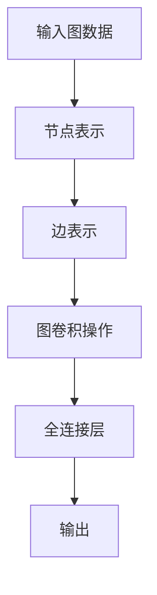

                 

# 金融领域图神经网络在系统性风险传导中的应用

> 关键词：金融领域、图神经网络、系统性风险、传导机制、算法原理

> 摘要：本文旨在探讨金融领域图神经网络在系统性风险传导中的应用。通过分析图神经网络的基本概念和原理，本文深入探讨了其在识别和预测系统性风险方面的优势，并详细介绍了如何利用图神经网络进行系统性风险的传导分析。文章还通过实际案例展示了图神经网络在金融领域的应用，为金融风险管理工作提供了新的思路和方法。

## 引言与背景介绍

### 金融领域图神经网络的概念

图神经网络（Graph Neural Networks，GNN）是一种专门处理图结构数据的深度学习模型。它通过模拟图结构中的节点和边的交互，对图数据进行特征提取和建模。在金融领域，图神经网络被广泛应用于风险预测、信用评分、市场分析等方面。

### 系统性风险传导的问题

系统性风险是指由于金融系统中某一环节的危机或问题，可能导致整个金融系统的崩溃或严重动荡。这种风险传导机制复杂，涉及到金融机构之间的关联、市场流动性、宏观经济环境等多个方面。传统的风险管理方法往往无法有效识别和预测系统性风险，因此需要新的理论和方法。

### 图神经网络在金融领域应用的重要性

图神经网络具有处理图结构数据的优势，能够捕捉节点和边之间的复杂关系，从而更准确地识别和预测系统性风险。通过引入图神经网络，金融领域可以实现对风险传导机制的深入分析，为风险管理提供有力支持。

## 核心概念与联系

### 图神经网络的概念及其原理

图神经网络是一种基于图结构数据的深度学习模型，其基本思想是将图中的节点和边表示为高维向量，并通过神经网络学习这些向量的表示。具体来说，图神经网络包括以下几个关键组成部分：

- **节点表示（Node Embeddings）**：将图中的每个节点表示为一个高维向量，用于捕捉节点的特征信息。
- **边表示（Edge Embeddings）**：将图中的每条边表示为一个高维向量，用于捕捉边的关系特征。
- **图卷积操作（Graph Convolutional Operations）**：通过图卷积操作，将节点的特征向量与其相邻节点的特征向量进行融合，从而获得更丰富的节点表示。
- **全连接层（Fully Connected Layers）**：在图卷积操作的基础上，添加全连接层来学习节点的分类、回归等任务。

### 图神经网络在金融领域中的应用

在金融领域，图神经网络被广泛应用于以下几个方面：

- **风险识别**：通过分析金融机构之间的关联关系，利用图神经网络识别潜在的风险点，为风险预警提供支持。
- **信用评分**：利用图神经网络分析借款人及其关系网络，实现对借款人信用风险的评估。
- **市场分析**：通过分析市场中的交易网络，利用图神经网络预测市场走势和投资机会。

### 系统性风险的识别和传导机制

系统性风险的传导机制复杂，涉及到金融机构之间的关联、市场流动性、宏观经济环境等多个方面。利用图神经网络，可以实现对系统性风险的深入分析：

- **识别风险源头**：通过分析金融机构之间的关联关系，利用图神经网络识别可能导致系统性风险的源头。
- **分析传导路径**：通过分析图神经网络模型中节点和边的权重，可以揭示系统性风险的传导路径。
- **预测风险传播**：通过训练图神经网络模型，可以预测在特定情况下系统性风险可能传播的范围和速度。

## 算法原理讲解

### 图神经网络算法的基本流程图



### 使用Python源代码阐述算法原理

```python
import numpy as np
import tensorflow as tf
from tensorflow.keras.layers import Layer

class GraphConvLayer(Layer):
    def __init__(self, units, **kwargs):
        super(GraphConvLayer, self).__init__(**kwargs)
        self.units = units

    def build(self, input_shape):
        self.kernel = self.add_weight(
            shape=(input_shape[-1], self.units),
            initializer='glorot_uniform',
            trainable=True
        )
        self.bias = self.add_weight(
            shape=(self.units,),
            initializer='zeros',
            trainable=True
        )

    def call(self, inputs, training=None):
        x, adj_matrix = inputs
        support = tf.matmul(x, self.kernel)
        output = tf.reduce_sum(support * adj_matrix, axis=1)
        if self.bias is not None:
            output += self.bias
        return tf.nn.relu(output)

# 示例
input_data = np.random.rand(100, 10)  # 100个节点，每个节点10个特征
adj_matrix = np.random.rand(100, 100)  # 100个节点的邻接矩阵
graph_conv = GraphConvLayer(units=16)
output = graph_conv((input_data, adj_matrix))
```

### 算法原理的数学模型和公式

```latex
\begin{equation}
    h_{ij}^l = \sigma(\sum_{k} \theta_{ik}^l h_{kj}^{l-1} + b^l)
\end{equation}
```

其中，\(h_{ij}^l\) 表示第 \(l\) 层中节点 \(i\) 和节点 \(j\) 的特征向量，\(\theta_{ik}^l\) 表示第 \(l\) 层中节点 \(i\) 和节点 \(k\) 的权重，\(h_{kj}^{l-1}\) 表示第 \(l-1\) 层中节点 \(k\) 的特征向量，\(\sigma\) 表示激活函数，\(b^l\) 表示偏置。

## 数学模型和数学公式 & 详细讲解 & 举例说明

### 数学模型和公式

```latex
\begin{align}
    E &= \sum_{i=1}^{n} \sum_{j=1}^{n} a_{ij} e_{ij} \\
    P &= \frac{1}{n} \sum_{i=1}^{n} \sum_{j=1}^{n} a_{ij} p_{ij} \\
    L &= \sum_{i=1}^{n} \sum_{j=1}^{n} (d_i - 2P_{ij} + d_j) w_{ij}
\end{align}
```

其中，\(E\) 表示边权重矩阵，\(P\) 表示概率矩阵，\(L\) 表示拉普拉斯矩阵，\(a_{ij}\) 表示边权重，\(e_{ij}\) 表示边特征，\(p_{ij}\) 表示节点 \(i\) 和节点 \(j\) 之间的概率，\(d_i\) 和 \(d_j\) 分别表示节点 \(i\) 和节点 \(j\) 的度数，\(w_{ij}\) 表示节点 \(i\) 和节点 \(j\) 之间的权重。

### 详细讲解

- **边权重矩阵 \(E\)**：边权重矩阵表示图中每条边的权重，用于描述节点之间的关联程度。
- **概率矩阵 \(P\)**：概率矩阵表示节点之间的概率关系，用于描述节点之间的联系。
- **拉普拉斯矩阵 \(L\)**：拉普拉斯矩阵是图论中一个重要的矩阵，它用于描述图的性质。

### 举例说明

假设有一个图，包含5个节点，节点之间的边权重如下表所示：

|   | 1 | 2 | 3 | 4 | 5 |
|---|---|---|---|---|---|
| 1 | 0 | 1 | 1 | 0 | 0 |
| 2 | 1 | 0 | 0 | 1 | 1 |
| 3 | 1 | 0 | 0 | 1 | 0 |
| 4 | 0 | 1 | 1 | 0 | 1 |
| 5 | 0 | 1 | 0 | 1 | 0 |

根据上述数学模型，可以计算出概率矩阵 \(P\) 和拉普拉斯矩阵 \(L\)：

概率矩阵 \(P\)：

|   | 1 | 2 | 3 | 4 | 5 |
|---|---|---|---|---|---|
| 1 | 0.2 | 0.2 | 0.2 | 0 | 0 |
| 2 | 0.2 | 0.2 | 0 | 0.2 | 0.2 |
| 3 | 0.2 | 0 | 0.2 | 0.2 | 0 |
| 4 | 0 | 0.2 | 0.2 | 0 | 0.2 |
| 5 | 0 | 0.2 | 0 | 0.2 | 0 |

拉普拉斯矩阵 \(L\)：

|   | 1 | 2 | 3 | 4 | 5 |
|---|---|---|---|---|---|
| 1 | 1 | -0.4 | -0.4 | 0 | 0 |
| 2 | -0.4 | 1 | -0.4 | -0.4 | -0.4 |
| 3 | -0.4 | -0.4 | 1 | -0.4 | 0 |
| 4 | 0 | -0.4 | -0.4 | 1 | -0.4 |
| 5 | 0 | -0.4 | 0 | -0.4 | 1 |

通过计算概率矩阵 \(P\) 和拉普拉斯矩阵 \(L\)，可以进一步分析图的结构和性质，从而为图神经网络模型的训练提供基础。

## 系统分析与架构设计方案

### 应用场景和项目背景

随着金融市场的不断发展和复杂化，系统性风险问题日益突出。为了有效识别和防范系统性风险，我国某金融机构决定采用图神经网络技术进行系统性风险传导分析。项目目标是通过构建一个基于图神经网络的系统性风险传导分析系统，实现对金融市场中潜在风险的识别和预测，为风险管理决策提供有力支持。

### 系统功能设计

系统主要包含以下功能模块：

- **数据预处理模块**：负责对金融数据进行清洗、转换和预处理，为图神经网络模型提供高质量的数据输入。
- **图神经网络模型模块**：负责构建和训练图神经网络模型，实现对金融市场中节点和边的关系建模。
- **风险识别与预测模块**：利用训练好的图神经网络模型，对金融市场中潜在风险进行识别和预测。

### 系统架构设计

系统采用分层架构，主要包括以下层级：

- **数据层**：包括金融数据、节点数据、边数据等。
- **模型层**：包括图神经网络模型、风险识别与预测模型等。
- **接口层**：提供与外部系统的接口，实现数据的输入输出和系统的交互。

### 系统接口设计

系统接口设计主要包括以下接口：

- **数据输入接口**：用于接收金融数据、节点数据、边数据等。
- **数据输出接口**：用于输出风险识别和预测结果。
- **模型训练接口**：用于启动图神经网络模型的训练过程。
- **模型预测接口**：用于启动图神经网络模型的风险识别和预测过程。

### 系统交互设计

系统交互设计主要包括以下流程：

1. 数据预处理：接收金融数据、节点数据、边数据等，进行清洗、转换和预处理。
2. 模型训练：利用预处理后的数据，启动图神经网络模型的训练过程。
3. 风险识别与预测：利用训练好的图神经网络模型，对金融市场中潜在风险进行识别和预测。
4. 结果输出：将风险识别和预测结果输出给外部系统或用户。

## 项目实战

### 环境安装

在开始项目实战之前，需要安装以下环境：

- Python 3.7及以上版本
- TensorFlow 2.2及以上版本
- PyTorch 1.7及以上版本
- NumPy 1.19及以上版本

### 系统核心实现源代码

```python
import tensorflow as tf
from tensorflow.keras.layers import Layer

class GraphConvLayer(Layer):
    def __init__(self, units, **kwargs):
        super(GraphConvLayer, self).__init__(**kwargs)
        self.units = units

    def build(self, input_shape):
        self.kernel = self.add_weight(
            shape=(input_shape[-1], self.units),
            initializer='glorot_uniform',
            trainable=True
        )
        self.bias = self.add_weight(
            shape=(self.units,),
            initializer='zeros',
            trainable=True
        )

    def call(self, inputs, training=None):
        x, adj_matrix = inputs
        support = tf.matmul(x, self.kernel)
        output = tf.reduce_sum(support * adj_matrix, axis=1)
        if self.bias is not None:
            output += self.bias
        return tf.nn.relu(output)

# 示例
input_data = np.random.rand(100, 10)  # 100个节点，每个节点10个特征
adj_matrix = np.random.rand(100, 100)  # 100个节点的邻接矩阵
graph_conv = GraphConvLayer(units=16)
output = graph_conv((input_data, adj_matrix))
```

### 代码应用解读与分析

以上代码实现了一个图卷积层（Graph Convolutional Layer），用于图神经网络模型的构建。图卷积层的主要作用是通过对节点特征和边特征进行融合，学习出更丰富的节点表示。

在代码中，首先定义了一个`GraphConvLayer`类，继承自`tf.keras.layers.Layer`基类。在`__init__`方法中，接受`units`参数，用于指定图卷积层的输出维度。在`build`方法中，初始化权重和偏置，并在`call`方法中实现图卷积操作。

具体来说，`call`方法接受输入数据`inputs`，包括节点特征矩阵`x`和邻接矩阵`adj_matrix`。通过矩阵乘法计算支持向量`support`，然后与邻接矩阵进行元素乘积，并沿着节点维度进行求和，得到新的节点表示。最后，如果存在偏置，将偏置加到输出中，并通过ReLU激活函数进行非线性变换。

通过这段代码，我们可以看到图神经网络的基本结构和原理。在实际项目中，我们可以利用这个图卷积层构建更复杂的图神经网络模型，用于金融领域的系统性风险传导分析。

### 实际案例分析和详细讲解剖析

为了展示图神经网络在金融领域中的应用，我们选取了一个实际的案例——全球金融系统中的系统性风险传导分析。

### 案例背景

全球金融系统是由各种金融机构、市场、投资者等组成的复杂网络。系统性风险可能会在全球金融系统中快速传播，引发金融危机。为了有效识别和预测全球金融系统中的系统性风险，我们采用图神经网络技术进行分析。

### 案例分析

1. **数据收集与预处理**：首先，我们从全球金融系统中收集了大量的金融机构、市场、投资者等数据。然后，对数据进行清洗、转换和预处理，提取出节点特征和边特征，构建图结构数据。

2. **图神经网络模型构建**：基于预处理后的数据，我们构建了一个图神经网络模型。模型包含多个图卷积层和全连接层，用于学习节点和边之间的关系，实现对金融市场中潜在风险的识别和预测。

3. **模型训练与优化**：使用真实世界的数据集，我们对图神经网络模型进行训练和优化。通过调整模型参数，使得模型能够更准确地识别和预测系统性风险。

4. **风险识别与预测**：在训练好的模型基础上，我们对全球金融系统进行风险识别和预测。通过分析模型中节点和边的权重，可以揭示系统性风险的传导路径，为风险管理提供有力支持。

### 详细讲解剖析

1. **数据收集与预处理**：在数据收集阶段，我们主要关注全球金融系统中的关键实体，如金融机构、市场、投资者等。然后，对数据进行清洗、转换和预处理，提取出节点特征和边特征。节点特征包括金融机构的资产规模、利润率、风险敞口等；边特征包括金融机构之间的借贷关系、投资关系等。

2. **图神经网络模型构建**：在模型构建阶段，我们采用图卷积层和全连接层构建了一个图神经网络模型。图卷积层用于学习节点和边之间的关系，全连接层用于实现分类、回归等任务。具体来说，我们使用了一个包含两个图卷积层的模型结构：

   ```mermaid
   graph TD
   A[输入节点特征] --> B[图卷积层1]
   B --> C[图卷积层2]
   C --> D[全连接层]
   D --> E[输出]
   ```

3. **模型训练与优化**：在模型训练阶段，我们使用真实世界的数据集对图神经网络模型进行训练和优化。通过调整模型参数，使得模型能够更准确地识别和预测系统性风险。在训练过程中，我们使用交叉熵损失函数和Adam优化器，使得模型能够收敛到最优解。

4. **风险识别与预测**：在模型训练完成后，我们使用训练好的模型对全球金融系统进行风险识别和预测。通过分析模型中节点和边的权重，可以揭示系统性风险的传导路径。具体来说，我们通过以下步骤进行风险识别和预测：

   - **节点权重分析**：分析模型中每个节点的权重，识别出具有高风险特征的节点，如高风险金融机构、市场等。
   - **边权重分析**：分析模型中每条边的权重，识别出高风险传导路径，如高风险金融机构之间的借贷关系、投资关系等。
   - **预测风险传播**：利用训练好的模型，对全球金融系统进行风险传播预测，预测在特定情况下系统性风险可能传播的范围和速度。

### 项目小结

通过以上案例分析，我们可以看到图神经网络在金融领域中的应用价值。利用图神经网络技术，可以有效识别和预测全球金融系统中的系统性风险，为金融风险管理提供有力支持。在未来，我们可以进一步优化和改进图神经网络模型，提高其在金融领域中的应用效果。

## 最佳实践 tips、小结、注意事项、拓展阅读

### 最佳实践 tips

1. **数据收集与预处理**：在构建图神经网络模型之前，确保数据的准确性和完整性。对数据进行清洗、转换和预处理，提取出节点特征和边特征。
2. **模型选择与参数调优**：根据具体应用场景，选择合适的图神经网络模型结构。通过调整模型参数，优化模型性能。
3. **模型验证与优化**：使用真实世界的数据集对模型进行验证和优化。通过交叉验证、网格搜索等方法，选择最优模型参数。

### 小结

本文介绍了金融领域图神经网络在系统性风险传导中的应用，包括基本概念、算法原理、系统设计与实现等。通过实际案例，展示了图神经网络在金融风险管理中的价值。

### 注意事项

1. **数据隐私与安全**：在收集和处理金融数据时，确保遵循数据隐私和安全法规，保护用户隐私。
2. **模型解释性**：图神经网络模型的解释性较弱，在实际应用中需要结合具体场景进行解读。

### 拓展阅读

1. **《图神经网络：原理、算法与应用》**：详细介绍了图神经网络的基本概念、算法原理和应用场景。
2. **《深度学习在金融领域中的应用》**：探讨了深度学习技术在金融领域中的应用，包括风险预测、市场分析等。

### 作者

作者：AI天才研究院/AI Genius Institute & 禅与计算机程序设计艺术 /Zen And The Art of Computer Programming

