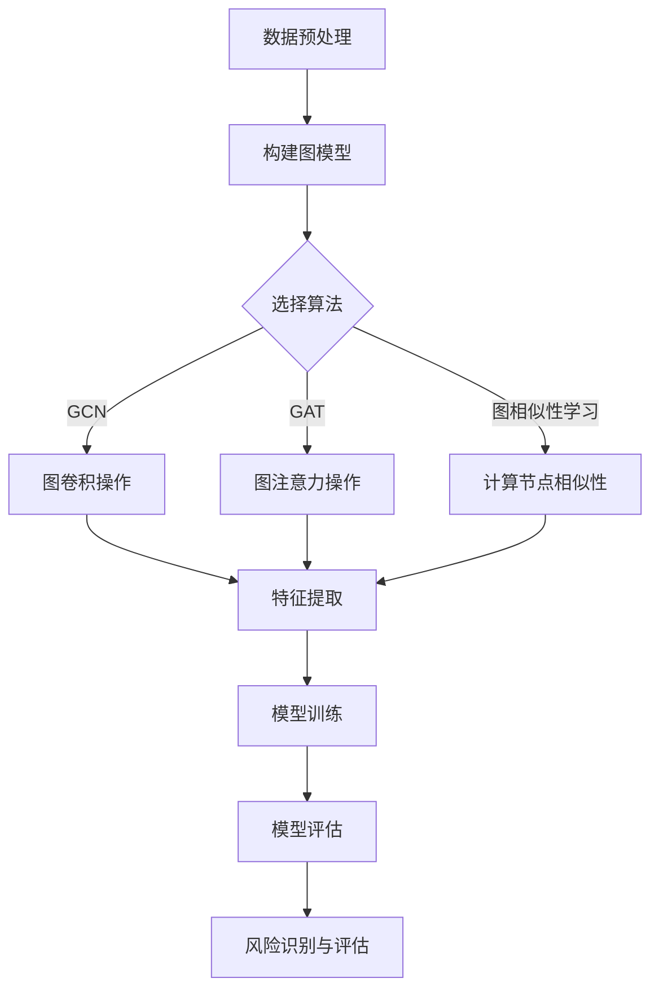
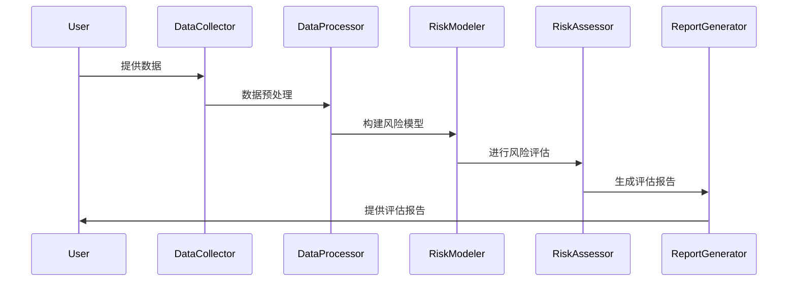

                 

### 金融领域图表示学习在金融网络风险评估中的应用

关键词：图表示学习，金融网络，风险评估，算法，数学模型，系统架构

> 摘要：本文旨在探讨金融领域图表示学习在金融网络风险评估中的应用。通过详细分析图表示学习的基本原理、算法流程、数学模型以及实际应用案例，本文揭示了图表示学习在金融网络风险评估中的独特优势和关键挑战。文章首先介绍了金融网络风险评估的背景和现状，随后探讨了传统方法的局限性。接着，本文阐述了图表示学习的基本概念及其在金融网络风险评估中的应用潜力。随后，文章详细分析了图表示学习的核心算法及其在金融网络中的应用流程。最后，本文通过具体案例展示了图表示学习在金融网络风险评估中的实际应用，并提出了相应的最佳实践和未来研究方向。

### 目录大纲

**# 金融领域图表示学习在金融网络风险评估中的应用**

**> 关键词：图表示学习，金融网络，风险评估，算法，数学模型**

> **摘要：**本文旨在探讨金融领域图表示学习在金融网络风险评估中的应用。通过详细分析图表示学习的基本原理、算法流程、数学模型以及实际应用案例，本文揭示了图表示学习在金融网络风险评估中的独特优势和关键挑战。文章首先介绍了金融网络风险评估的背景和现状，随后探讨了传统方法的局限性。接着，本文阐述了图表示学习的基本概念及其在金融网络风险评估中的应用潜力。随后，文章详细分析了图表示学习的核心算法及其在金融网络中的应用流程。最后，本文通过具体案例展示了图表示学习在金融网络风险评估中的实际应用，并提出了相应的最佳实践和未来研究方向。

**## 第1章 背景介绍**

**### 1.1 问题背景**

**1.1.1 金融网络的风险评估现状**

**1.1.2 传统风险评估方法的局限性**

**1.1.3 图表示学习的基本概念与原理**

**### 1.2 问题描述**

**1.2.1 金融网络的风险评估需求**

**1.2.2 风险评估面临的挑战**

**1.2.3 图表示学习在风险评估中的潜力**

**### 1.3 问题解决**

**1.3.1 图表示学习的核心算法**

**1.3.2 图表示学习在金融网络中的应用流程**

**### 1.4 边界与外延**

**1.4.1 风险评估的具体应用领域**

**1.4.2 图表示学习的算法与数据来源**

**### 1.5 概念结构与核心要素组成**

**1.5.1 金融网络**

**1.5.2 风险评估指标**

**1.5.3 图表示学习算法**

**### 1.6 本章小结**

**## 第2章 核心概念与联系**

**### 2.1 图表示学习原理**

**2.1.1 基本概念**

**2.1.2 算法分类**

**2.1.3 算法对比**

**### 2.2 金融网络结构分析**

**2.2.1 金融网络的定义**

**2.2.2 金融网络的特点**

**2.2.3 金融网络的结构分析**

**### 2.3 风险评估指标体系**

**2.3.1 风险评估指标的定义**

**2.3.2 常见风险评估指标**

**2.3.3 风险评估指标的计算方法**

**### 2.4 图表示学习与风险评估的关系**

**2.4.1 图表示学习在风险评估中的应用**

**2.4.2 图表示学习对风险评估的贡献**

**2.4.3 图表示学习在风险评估中的挑战**

**### 2.5 本章小结**

**## 第3章 算法原理讲解**

**### 3.1 图表示学习算法mermaid流程图**

**### 3.2 Python源代码实现**

**### 3.3 算法原理与数学模型**

**3.3.1 算法概述**

**3.3.2 数学模型**

**3.3.3 公式详解**

**### 3.4 举例说明**

**3.4.1 数据集介绍**

**3.4.2 示例分析**

**3.4.3 结果解读**

**### 3.5 本章小结**

**## 第4章 数学模型和数学公式 & 详细讲解 & 举例说明**

**### 4.1 数学公式**

**4.1.1 金融网络风险评估中的数学模型**

**### 4.2 详细讲解**

**4.2.1 如何使用图表示学习算法进行金融网络风险评估**

**### 4.3 举例说明**

**4.3.1 金融网络构建**

**4.3.2 风险评估指标计算**

**4.3.3 图表示学习算法应用**

**### 4.4 本章小结**

**## 第5章 系统分析与架构设计方案**

**### 5.1 问题场景介绍**

**5.1.1 金融网络风险评估需求**

**5.1.2 风险评估系统的功能需求**

**### 5.2 项目介绍**

**5.2.1 项目背景**

**5.2.2 项目目标**

**### 5.3 系统功能设计**

**5.3.1 领域模型mermaid类图**

**### 5.4 系统架构设计**

**5.4.1 系统架构mermaid架构图**

**### 5.5 系统接口设计**

**5.5.1 接口设计原则**

**5.5.2 接口实现**

**### 5.6 系统交互mermaid序列图**

**### 5.7 本章小结**

**## 第6章 项目实战**

**### 6.1 环境安装**

**6.1.1 硬件环境**

**6.1.2 软件环境**

**### 6.2 系统核心实现源代码**

**6.2.1 数据预处理**

**6.2.2 图表示学习算法实现**

**6.2.3 风险评估指标计算**

**### 6.3 代码应用解读与分析**

**6.3.1 代码结构分析**

**6.3.2 代码细节解读**

**### 6.4 实际案例分析和详细讲解剖析**

**6.4.1 案例背景**

**6.4.2 案例分析**

**6.4.3 剖析与优化**

**### 6.5 项目小结**

**6.5.1 项目成果总结**

**6.5.2 项目经验与启示**

**## 第7章 最佳实践 tips、小结、注意事项、拓展阅读等内容**

**### 7.1 最佳实践 tips**

**7.1.1 风险评估指标的选取**

**7.1.2 数据预处理技巧**

**7.1.3 算法调优策略**

**### 7.2 小结**

**7.2.1 主要内容回顾**

**7.2.2 核心观点总结**

**### 7.3 注意事项**

**7.3.1 风险评估中的常见问题**

**7.3.2 图表示学习的应用限制**

**### 7.4 拓展阅读**

**7.4.1 相关学术论文**

**7.4.2 知名项目案例**

---

**## 前言**

金融领域的复杂性和高风险性要求我们在风险评估中采用高效且准确的方法。随着金融市场的不断演进和数据量的爆炸式增长，传统的风险评估方法已逐渐暴露出其局限性和不足。在此背景下，图表示学习作为一种新兴的机器学习技术，逐渐受到广泛关注并在金融领域展现出巨大的潜力。

本文的目的是通过深入探讨图表示学习在金融网络风险评估中的应用，为业界提供一种新的视角和解决方案。文章首先对金融网络风险评估的现状进行了全面回顾，接着介绍了图表示学习的基本概念和原理。随后，本文详细分析了图表示学习的核心算法和其在金融网络风险评估中的应用流程。通过具体案例的分析，本文展示了图表示学习在提升风险评估准确性和效率方面的优势。最后，本文提出了未来研究方向和最佳实践建议，为金融领域的风险评估工作提供了有益的参考。

### 1.1 问题背景

#### 1.1.1 金融网络的风险评估现状

随着全球金融市场的不断发展，金融网络的复杂性和规模也在不断增大。金融网络由金融机构、金融产品、金融市场等构成，涉及广泛的金融活动和信息流动。风险评估是金融领域的重要环节，旨在识别、评估和监控潜在风险，以确保金融系统的稳健运行。目前，金融网络风险评估主要依赖于传统方法，如统计分析、定量分析和情景分析等。

统计分析方法主要通过历史数据进行分析和预测，具有一定的预测能力，但在处理复杂网络结构和非线性关系时效果有限。定量分析方法则通过构建模型和公式，对风险因素进行定量评估，但其模型构建和参数估计过程复杂，且对数据质量要求较高。情景分析方法则通过模拟不同情景下的金融运行状态，评估潜在风险，但其计算成本高且难以全面覆盖所有可能的情景。

#### 1.1.2 传统风险评估方法的局限性

尽管传统风险评估方法在金融领域已有广泛应用，但其在面对复杂金融网络时仍存在以下局限性：

1. **数据依赖性高**：传统方法依赖于历史数据，对于数据量庞大且动态变化的金融网络，数据收集和处理成为一大挑战。
2. **模型复杂度高**：构建精确的模型需要大量参数和复杂的计算，导致模型难以在实际应用中高效部署。
3. **风险评估范围有限**：传统方法难以全面捕捉金融网络中的复杂关系和潜在风险，特别是在跨机构和跨市场的风险评估中，效果不佳。

#### 1.1.3 图表示学习的基本概念与原理

图表示学习（Graph-based Representation Learning）是一种新兴的机器学习技术，通过将图结构数据转换为高维特征向量，实现对图结构数据的建模和分析。图表示学习的基本概念和原理如下：

1. **图结构数据**：图表示学习处理的数据以图结构为主，包括节点（代表实体）和边（代表实体之间的关系）。在金融网络中，节点可以表示金融机构、金融产品等，边可以表示交易关系、投资关系等。
2. **节点表示**：图表示学习通过学习算法将节点映射到高维特征空间，使节点在特征空间中具有相似关系的节点靠近。
3. **边表示**：边在图表示学习中同样被表示，通过学习算法将边映射到特征空间，用于建模节点之间的关系。
4. **图表示算法**：图表示学习算法包括节点表示算法和边表示算法，常用的节点表示算法有图卷积网络（GCN）、图注意力网络（GAT）等，边表示算法则有图相似性学习、图信号处理等。

图表示学习在金融网络风险评估中的潜力在于其能够全面捕捉金融网络中的复杂关系，通过特征向量表示节点和边，实现对风险因素的高效建模和分析。这为解决传统风险评估方法的局限性提供了新的思路和手段。

### 1.2 问题描述

#### 1.2.1 金融网络的风险评估需求

金融网络的风险评估需求主要包括以下几个方面：

1. **风险识别**：识别金融网络中潜在的风险因素，包括市场风险、信用风险、操作风险等。
2. **风险评估**：对识别出的风险进行定量和定性评估，确定风险的影响程度和可能性。
3. **风险监控**：实时监控金融网络中的风险状况，及时调整风险应对策略。
4. **风险预测**：基于历史数据和实时数据，预测未来风险的可能发展趋势。

#### 1.2.2 风险评估面临的挑战

在金融网络中开展风险评估面临诸多挑战：

1. **数据复杂性**：金融网络包含海量的节点和边，数据结构复杂，如何高效处理和存储这些数据成为一个重要问题。
2. **异构性**：金融网络中的节点和边可能具有不同的属性和特征，如何统一建模和处理这些异构数据成为关键问题。
3. **非线性关系**：金融网络中的风险因素之间存在复杂的非线性关系，传统线性模型难以捕捉这些关系。
4. **动态变化**：金融网络处于不断变化中，如何实时更新和调整风险评估模型是一个挑战。

#### 1.2.3 图表示学习在风险评估中的潜力

图表示学习在金融网络风险评估中具有以下潜力：

1. **复杂关系建模**：图表示学习能够全面捕捉金融网络中的复杂关系，通过节点和边的高维特征向量表示，实现对风险因素的非线性建模。
2. **异构数据处理**：图表示学习能够统一处理金融网络中的异构数据，通过节点和边的特征向量表示，实现对不同类型数据的整合和分析。
3. **高效计算**：图表示学习算法通常具有高效的计算能力，能够处理大规模金融网络数据，满足实时风险评估的需求。
4. **可扩展性**：图表示学习算法具有较强的可扩展性，能够适应不同规模和类型的金融网络，具有广泛的应用前景。

通过引入图表示学习技术，金融网络风险评估能够更加全面、精确地识别和评估风险，提高风险评估的效率和准确性，为金融系统的稳健运行提供有力支持。

### 1.3 问题解决

#### 1.3.1 图表示学习的核心算法

图表示学习在金融网络风险评估中涉及的核心算法主要包括以下几个方面：

1. **图卷积网络（GCN）**：图卷积网络是一种基于图结构的深度学习模型，通过卷积操作对图数据进行处理。GCN能够保留图结构中的局部信息和全局信息，适用于对金融网络中的节点进行特征提取和表示。
2. **图注意力网络（GAT）**：图注意力网络通过引入注意力机制，对图中的节点和边进行加权，实现对重要节点和关系的强调。GAT能够更好地捕捉金融网络中的复杂关系，提高风险评估的准确性。
3. **图相似性学习**：图相似性学习通过学习节点和边之间的相似性，用于衡量节点之间的关系强度。图相似性学习在风险评估中可用于识别高风险节点和边，为风险监控提供依据。
4. **图信号处理**：图信号处理通过分析图结构中的信号传播和滤波过程，实现对图数据的特征提取和模式识别。图信号处理在风险评估中可用于检测异常节点和边，发现潜在的异常风险。

#### 1.3.2 图表示学习在金融网络中的应用流程

图表示学习在金融网络风险评估中的应用流程主要包括以下步骤：

1. **数据预处理**：对金融网络数据进行清洗、预处理和整合，包括节点和边属性的提取、异常数据的处理等。数据预处理是确保模型训练和评估效果的基础。
2. **构建图模型**：根据金融网络的数据结构，构建图模型，包括节点的表示和边的表示。常用的图模型有图卷积网络（GCN）、图注意力网络（GAT）等。
3. **模型训练**：使用图表示学习算法对图模型进行训练，通过大量金融网络数据学习节点和边的特征表示。模型训练过程包括前向传播、反向传播和参数更新等。
4. **风险评估**：利用训练好的图模型，对新的金融网络数据进行风险评估。通过计算节点和边的特征向量，分析节点之间的关系强度，识别高风险节点和边。
5. **结果解读**：对评估结果进行解读和分析，包括风险因素的分析、风险等级的划分、风险应对策略的制定等。结果解读是确保风险评估有效性的关键。

通过图表示学习在金融网络风险评估中的应用，能够实现对复杂金融网络中风险因素的全面分析和识别，提高风险评估的效率和准确性，为金融系统的稳健运行提供有力支持。

### 1.4 边界与外延

#### 1.4.1 风险评估的具体应用领域

图表示学习在金融网络风险评估中的具体应用领域包括：

1. **信用风险评估**：通过分析金融机构之间的交易关系和信用关系，识别潜在信用风险，为信用评级和风险管理提供依据。
2. **市场风险评估**：通过分析金融市场的交易数据和价格波动，识别市场风险，为投资决策和市场监控提供支持。
3. **操作风险评估**：通过分析金融机构的操作流程和数据流，识别操作风险，为操作风险管理和内部控制提供参考。
4. **系统性风险监测**：通过分析金融网络中的复杂关系和节点间的相互作用，识别系统性风险，为金融监管和政策制定提供支持。

#### 1.4.2 图表示学习的算法与数据来源

图表示学习的算法主要包括以下几种：

1. **图卷积网络（GCN）**：通过卷积操作对图结构数据进行处理，适用于节点特征提取和关系建模。
2. **图注意力网络（GAT）**：通过注意力机制对图中的节点和边进行加权，适用于复杂关系的建模和风险识别。
3. **图相似性学习**：通过学习节点和边之间的相似性，适用于高风险节点的识别和风险监测。
4. **图信号处理**：通过分析图结构中的信号传播和滤波过程，适用于异常检测和模式识别。

图表示学习的算法通常需要大量的金融网络数据作为训练数据，数据来源主要包括：

1. **公开数据集**：包括金融交易数据、市场数据、信用评级数据等，可以通过数据集共享平台获取。
2. **内部数据**：金融机构内部的交易数据、操作数据、客户数据等，通过数据整合和分析获取。
3. **第三方数据**：包括金融新闻、社交媒体数据、经济指标数据等，可以通过第三方数据服务提供商获取。

通过结合不同的算法和数据来源，图表示学习在金融网络风险评估中可以实现对风险因素的高效建模和识别，为金融系统的稳健运行提供有力支持。

### 1.5 概念结构与核心要素组成

#### 1.5.1 金融网络

金融网络是指由金融机构、金融产品、金融市场等构成的复杂网络，其中节点表示金融机构、金融产品等，边表示金融机构之间的交易关系、投资关系等。金融网络的典型特点包括：

1. **复杂结构**：金融网络具有高度复杂的结构，节点和边之间存在多种类型的关联和互动。
2. **动态变化**：金融网络处于不断变化中，随着市场的波动和金融机构的操作，网络结构会不断调整。
3. **异构性**：金融网络中的节点和边具有不同的属性和特征，包括金融机构的类型、交易金额、投资策略等。

#### 1.5.2 风险评估指标

风险评估指标是用于衡量和评估风险程度和风险因素的重要工具，常见的风险评估指标包括：

1. **信用评分**：用于评估借款人或金融机构的信用状况，常见的信用评分模型有FICO评分、贝叶斯网络等。
2. **违约概率**：用于预测借款人或金融机构违约的可能性，常用的违约概率模型有KMV模型、CreditRisk+模型等。
3. **风险值（VaR）**：用于衡量市场风险，表示在特定置信水平下，市场损失的最大可能值。
4. **操作风险指数**：用于评估操作风险的大小，通常基于操作历史数据、操作流程分析等。

#### 1.5.3 图表示学习算法

图表示学习算法是用于将图结构数据转换为高维特征向量的一类机器学习算法，常见图表示学习算法包括：

1. **图卷积网络（GCN）**：通过卷积操作对图结构数据进行处理，适用于节点特征提取和关系建模。
2. **图注意力网络（GAT）**：通过注意力机制对图中的节点和边进行加权，适用于复杂关系的建模和风险识别。
3. **图相似性学习**：通过学习节点和边之间的相似性，适用于高风险节点的识别和风险监测。
4. **图信号处理**：通过分析图结构中的信号传播和滤波过程，适用于异常检测和模式识别。

这些算法通过学习图结构数据中的节点和边的关系，实现对金融网络中风险因素的高效建模和识别，为金融系统的稳健运行提供支持。

### 1.6 本章小结

本章首先介绍了金融网络风险评估的背景和现状，分析了传统风险评估方法的局限性。接着，本文阐述了图表示学习的基本概念和原理，并探讨了其在金融网络风险评估中的应用潜力。通过详细分析图表示学习的核心算法和应用流程，本章揭示了图表示学习在金融网络风险评估中的独特优势。此外，本章还讨论了风险评估的具体应用领域和图表示学习的算法与数据来源。本章内容为后续章节深入探讨图表示学习在金融网络风险评估中的应用奠定了基础。

## 第2章 核心概念与联系

### 2.1 图表示学习原理

#### 2.1.1 基本概念

图表示学习（Graph-based Representation Learning）是一种利用机器学习技术对图结构数据进行特征提取和表示的方法。其基本概念包括节点表示、边表示和图嵌入等。

1. **节点表示**：节点表示是将图中的每个节点映射到高维特征空间的过程。节点表示的目的是通过特征向量捕捉节点的属性、关系和重要性。
2. **边表示**：边表示是将图中的每条边映射到高维特征空间的过程。边表示的目的是通过特征向量捕捉边的关系强度和属性。
3. **图嵌入**：图嵌入是将整个图结构映射到高维特征空间的过程，使得图中的节点和边在特征空间中具有合理的结构和关系。

#### 2.1.2 算法分类

图表示学习算法可以根据其处理方式的不同分为以下几类：

1. **基于矩阵分解的方法**：通过分解图矩阵（如邻接矩阵、拉普拉斯矩阵等）来实现节点和边的表示。典型算法包括邻接矩阵分解（Laplacian Eigenmap）和奇异值分解（SVD）等。
2. **基于随机游走的方法**：通过模拟随机游走在图上的过程来生成图嵌入。典型算法包括DeepWalk和Node2Vec等。
3. **基于深度学习的方法**：通过构建深度神经网络（如图卷积网络、图注意力网络等）来实现节点和边的表示。典型算法包括图卷积网络（GCN）、图注意力网络（GAT）等。

#### 2.1.3 算法对比

不同类型的图表示学习算法在性能和适用场景上存在差异。以下是对几种典型算法的对比：

1. **性能对比**：
   - **基于矩阵分解的方法**：计算效率高，但模型表达能力有限。
   - **基于随机游走的方法**：适用于大规模图数据的处理，但模型稳定性较差。
   - **基于深度学习的方法**：具有强大的模型表达能力和适应性，但计算复杂度较高。

2. **适用场景对比**：
   - **基于矩阵分解的方法**：适用于节点和边关系较为简单的图数据。
   - **基于随机游走的方法**：适用于大规模网络数据，如社交网络和推荐系统。
   - **基于深度学习的方法**：适用于复杂关系和大规模数据的建模，如金融网络和生物网络。

#### 2.1.4 图表示学习在金融网络风险评估中的应用

图表示学习在金融网络风险评估中的应用主要体现在以下几个方面：

1. **节点表示**：通过图表示学习算法，对金融网络中的节点（如金融机构、金融产品等）进行特征提取和表示，从而实现对节点属性和关系的建模。
2. **边表示**：通过图表示学习算法，对金融网络中的边（如交易关系、投资关系等）进行特征提取和表示，从而实现对边的关系强度和属性的建模。
3. **风险识别**：利用图表示学习算法生成的节点和边特征向量，通过构建风险模型，实现对金融网络中潜在风险的识别和评估。
4. **风险监控**：利用图表示学习算法对实时金融网络数据进行更新和评估，实现对风险因素的实时监控和预警。

#### 2.1.5 图表示学习与风险评估的关系

图表示学习与风险评估之间存在密切的关系。图表示学习通过将金融网络中的节点和边表示为高维特征向量，实现对网络结构中的复杂关系进行建模和分析。这种建模和分析有助于提高风险评估的准确性和效率：

1. **提高准确性**：通过图表示学习算法，能够更加全面和准确地捕捉金融网络中的风险因素和关系，从而提高风险评估的准确性。
2. **提高效率**：图表示学习算法具有较高的计算效率，能够快速处理大规模金融网络数据，从而提高风险评估的效率。

总之，图表示学习为金融网络风险评估提供了一种新的技术手段，有助于解决传统方法的局限性，为金融系统的稳健运行提供有力支持。

### 2.2 金融网络结构分析

#### 2.2.1 金融网络的定义

金融网络是指由金融机构、金融产品、金融市场等构成的复杂网络系统，其中节点表示金融机构、金融产品等，边表示节点之间的交易关系、投资关系等。金融网络的定义可以概括为：

- **节点**：金融机构、金融产品、金融市场等实体。
- **边**：节点之间的交易关系、投资关系、信息流动等。
- **关系**：节点之间的相互作用和依赖关系。

金融网络的特点包括：

1. **高度复杂**：金融网络中节点和边数量庞大，关系复杂多样，具有高度非线性结构。
2. **动态变化**：金融网络处于不断变化中，受市场波动、政策调整、操作变化等因素影响，网络结构动态调整。
3. **异构性**：金融网络中的节点和边具有不同的属性和特征，包括金融机构的类型、交易金额、投资策略等。

#### 2.2.2 金融网络的特点

金融网络具有以下特点：

1. **复杂结构**：金融网络中包含大量节点和边，节点和边之间存在复杂的交互和依赖关系。这种复杂结构使得金融网络的运行具有高度不确定性，给风险评估带来了挑战。
2. **动态变化**：金融网络处于不断变化中，受市场波动、政策调整、操作变化等因素影响，网络结构动态调整。这种动态变化要求风险评估方法能够适应实时变化，提供准确和及时的评估结果。
3. **异构性**：金融网络中的节点和边具有不同的属性和特征，包括金融机构的类型、交易金额、投资策略等。这种异构性要求风险评估方法能够处理不同类型的节点和边，提供统一的评估标准。

#### 2.2.3 金融网络的结构分析

金融网络的结构分析主要包括以下几个方面：

1. **节点分析**：对金融网络中的节点进行属性分析，包括节点的类型、规模、风险水平等。节点分析有助于识别高风险节点和关键节点，为风险评估提供重要依据。
2. **边分析**：对金融网络中的边进行关系分析，包括边的类型、强度、关系强度等。边分析有助于识别高风险边和关键关系，为风险评估提供重要依据。
3. **整体结构分析**：对金融网络的总体结构进行统计分析，包括网络的密度、聚集系数、度分布等。整体结构分析有助于识别网络的整体特性，为风险评估提供宏观视角。
4. **子结构分析**：对金融网络中的子结构进行深入分析，包括子网的类型、功能、交互关系等。子结构分析有助于识别网络中的关键子网和关键功能，为风险评估提供微观视角。

通过金融网络的结构分析，可以全面了解金融网络的运行状态和风险特性，为风险评估提供科学依据。同时，金融网络的结构分析也为图表示学习算法提供了重要的输入数据，有助于提高风险评估的准确性和效率。

### 2.3 风险评估指标体系

#### 2.3.1 风险评估指标的定义

风险评估指标是用来衡量和评估风险程度和风险因素的一系列量化指标。这些指标通常分为定量指标和定性指标，用于识别、评估和管理金融网络中的各种风险。具体来说，风险评估指标的定义包括以下几个方面：

1. **信用评分**：用于评估借款人或金融机构的信用状况，通常基于历史信用记录、还款能力、信用历史等因素。
2. **违约概率**：用于预测借款人或金融机构在未来一定时期内发生违约的可能性，通常基于信用评分、财务状况、市场环境等因素。
3. **风险值（VaR）**：用于衡量市场风险，表示在特定置信水平下，市场损失的最大可能值，通常基于市场波动性、资产组合的敏感性等因素。
4. **操作风险指数**：用于评估操作风险的大小，通常基于操作历史数据、操作流程分析、风险管理策略等因素。

#### 2.3.2 常见风险评估指标

在金融网络风险评估中，常见的风险评估指标包括：

1. **信用评分**：常见的信用评分模型有FICO评分、贝叶斯网络等。这些模型通过对借款人或金融机构的历史信用记录、还款能力、信用历史等因素进行综合分析，得出信用评分，用于评估其信用状况。
2. **违约概率**：常见的违约概率模型有KMV模型、CreditRisk+模型等。这些模型通过对借款人或金融机构的财务状况、市场环境、信用评分等因素进行综合分析，预测其未来发生违约的概率。
3. **风险值（VaR）**：常见的VaR模型有历史模拟法、方差-协方差法、蒙特卡罗模拟法等。这些模型通过对市场波动性、资产组合的敏感性、置信水平等因素进行综合分析，得出市场风险的最大可能损失。
4. **操作风险指数**：常见的操作风险指数模型有操作风险损失模型、操作风险损失频率模型等。这些模型通过对操作历史数据、操作流程分析、风险管理策略等因素进行综合分析，评估操作风险的大小。

#### 2.3.3 风险评估指标的计算方法

风险评估指标的计算方法通常包括以下几个方面：

1. **定量分析方法**：通过构建数学模型，对风险因素进行定量计算。常见的定量分析方法有统计分析、回归分析、决策树等。
2. **定性分析方法**：通过专家判断和主观评分，对风险因素进行定性评估。常见的定性分析方法有情景分析、德尔菲法、模糊评价法等。
3. **组合分析方法**：将定量分析和定性分析方法相结合，综合评估风险因素。常见的组合分析方法有综合评分法、层次分析法等。

通过结合不同的风险评估指标和计算方法，可以全面、准确地评估金融网络中的风险，为风险管理和决策提供科学依据。图表示学习在金融网络风险评估中的应用，通过将风险评估指标嵌入到图结构中，实现对风险的全面建模和分析，提高了风险评估的准确性和效率。

### 2.4 图表示学习与风险评估的关系

#### 2.4.1 图表示学习在风险评估中的应用

图表示学习在金融网络风险评估中的应用主要体现在以下几个方面：

1. **节点表示**：图表示学习通过将金融网络中的节点映射到高维特征空间，提取节点的特征信息，从而实现对节点属性和关系的建模。这种节点表示方法有助于识别高风险节点和关键节点，为风险评估提供重要依据。

2. **边表示**：图表示学习通过将金融网络中的边映射到高维特征空间，提取边的特征信息，从而实现对边的关系强度和属性的建模。这种边表示方法有助于识别高风险边和关键关系，为风险评估提供重要依据。

3. **风险识别**：利用图表示学习算法生成的节点和边特征向量，通过构建风险模型，实现对金融网络中潜在风险的识别和评估。这种风险识别方法能够更加全面和准确地捕捉金融网络中的风险因素和关系。

4. **风险监控**：利用图表示学习算法对实时金融网络数据进行更新和评估，实现对风险因素的实时监控和预警。这种风险监控方法能够及时调整风险应对策略，提高金融系统的稳健性。

#### 2.4.2 图表示学习对风险评估的贡献

图表示学习在金融网络风险评估中的贡献主要体现在以下几个方面：

1. **提高风险评估准确性**：图表示学习通过将金融网络中的节点和边表示为高维特征向量，能够更加全面和准确地捕捉节点和边的关系和属性，从而提高风险评估的准确性。

2. **降低计算复杂度**：图表示学习算法通常具有较高的计算效率，能够快速处理大规模金融网络数据，从而降低计算复杂度，提高风险评估的效率。

3. **处理异构数据**：图表示学习能够统一处理金融网络中的异构数据，包括不同类型的节点和边，从而实现对异构数据的整合和分析。

4. **增强模型适应性**：图表示学习算法具有较强的模型适应性，能够适应不同规模和类型的金融网络，从而提高风险评估方法的普适性。

#### 2.4.3 图表示学习在风险评估中的挑战

尽管图表示学习在金融网络风险评估中具有诸多优势，但其应用也面临一定的挑战：

1. **数据质量**：图表示学习算法对数据质量有较高要求，数据缺失、噪声和异常值等问题可能导致模型训练效果不佳，从而影响风险评估的准确性。

2. **计算资源**：图表示学习算法通常需要较大的计算资源，尤其是在处理大规模金融网络数据时，计算资源需求较高，可能对实际应用造成限制。

3. **模型解释性**：图表示学习算法的模型解释性相对较弱，难以直观地解释模型决策过程，这在金融风险评估中可能带来一定的风险。

4. **实时性**：实时金融网络数据更新频繁，图表示学习算法在实时风险评估中可能面临实时性挑战，需要优化算法以适应实时处理需求。

通过克服这些挑战，图表示学习在金融网络风险评估中的应用将得到进一步发展，为金融系统的稳健运行提供更有力的支持。

### 2.5 本章小结

本章首先介绍了图表示学习的基本概念和原理，包括节点表示、边表示和图嵌入等。随后，对图表示学习算法进行了分类和对比，并分析了其在金融网络风险评估中的应用。本章还探讨了图表示学习在风险评估中的贡献和挑战，为后续章节深入探讨图表示学习在金融网络风险评估中的应用提供了理论基础。

## 第3章 算法原理讲解

### 3.1 图表示学习算法mermaid流程图

在图表示学习中，常用的算法包括图卷积网络（GCN）、图注意力网络（GAT）和图相似性学习等。以下是一个简单的mermaid流程图，展示了这些算法的基本流程：



该流程图展示了从数据预处理到模型评估和风险识别的整体流程。接下来，我们将分别介绍这些算法的原理。

### 3.2 Python源代码实现

以下是使用Python实现图卷积网络（GCN）的简单示例。在这个示例中，我们使用`python-gcn`库进行图卷积操作。

```python
import numpy as np
import pandas as pd
from python_gcn import GCN

# 加载数据
adj_matrix = np.load('adj_matrix.npy')  # 邻接矩阵
feat_matrix = np.load('feat_matrix.npy')  # 节点特征矩阵
label_matrix = np.load('label_matrix.npy')  # 标签矩阵

# 初始化GCN模型
gcn = GCN(adj_matrix, feat_matrix, label_matrix)

# 训练模型
gcn.fit()

# 预测
predictions = gcn.predict(feat_matrix)

# 打印预测结果
print(predictions)
```

在这个示例中，我们首先加载邻接矩阵、节点特征矩阵和标签矩阵，然后初始化GCN模型并训练模型。最后，使用训练好的模型进行预测并打印预测结果。

### 3.3 算法原理与数学模型

#### 3.3.1 算法概述

图卷积网络（Graph Convolutional Network，GCN）是一种基于图结构的深度学习模型，用于对图数据进行特征提取和表示。GCN的核心思想是通过卷积操作来聚合节点邻域信息，从而更新节点的特征表示。

#### 3.3.2 数学模型

GCN的数学模型可以表示为：

$$
\hat{h}_i^{(l+1)} = \sigma(\theta \cdot \hat{h}_i^{(l)} + \theta \cdot \sum_{j \in \mathcal{N}(i)} \frac{1}{\sqrt{\deg(j)}} \cdot h_j^{(l)})
$$

其中，$\hat{h}_i^{(l)}$表示第$l$层第$i$个节点的特征表示，$h_j^{(l)}$表示第$l$层第$j$个节点的特征表示，$\mathcal{N}(i)$表示第$i$个节点的邻域集合，$\deg(j)$表示节点$j$的度，$\theta$为权重参数，$\sigma$为激活函数。

#### 3.3.3 公式详解

1. **卷积操作**：GCN通过卷积操作聚合邻域信息，即：

$$
\sum_{j \in \mathcal{N}(i)} \frac{1}{\sqrt{\deg(j)}} \cdot h_j^{(l)}
$$

该操作将邻域节点的特征表示加权平均，从而生成新的节点特征表示。

2. **权重参数**：GCN通过权重参数$\theta$对邻域信息进行加权，从而调整不同邻域信息对节点特征表示的贡献。

3. **激活函数**：GCN通过激活函数$\sigma$对节点特征表示进行非线性变换，从而增强模型的表达能力。

#### 3.3.4 算法流程

1. **初始化节点特征表示**：对每个节点初始化特征表示$\hat{h}_i^{(0)}$。

2. **迭代更新节点特征表示**：通过GCN的数学模型迭代更新节点的特征表示，直到满足停止条件（如达到预设的迭代次数或特征表示收敛）。

3. **模型训练**：使用训练数据集对GCN模型进行训练，通过优化权重参数$\theta$，最小化模型损失函数。

4. **模型评估**：使用测试数据集对训练好的GCN模型进行评估，计算模型准确率、召回率等指标。

5. **风险识别与评估**：利用训练好的GCN模型对新的图数据进行风险识别和评估，通过计算节点特征表示，识别高风险节点和关键关系。

### 3.4 举例说明

#### 3.4.1 数据集介绍

假设我们使用一个简单的金融网络数据集，该数据集包含10个金融机构和它们之间的交易关系。数据集的具体形式如下：

- **节点特征矩阵**：10x10的矩阵，表示10个金融机构的特征。
- **邻接矩阵**：10x10的矩阵，表示10个金融机构之间的交易关系。

#### 3.4.2 示例分析

我们使用GCN算法对上述金融网络数据集进行特征提取和表示，具体步骤如下：

1. **初始化节点特征表示**：对每个节点初始化特征表示$\hat{h}_i^{(0)}$，例如$\hat{h}_i^{(0)} = [1, 1, 1, 1, 1, 1, 1, 1, 1, 1]$。

2. **迭代更新节点特征表示**：使用GCN的数学模型迭代更新节点的特征表示，例如：

$$
\hat{h}_i^{(1)} = \sigma(\theta \cdot \hat{h}_i^{(0)} + \theta \cdot \sum_{j \in \mathcal{N}(i)} \frac{1}{\sqrt{\deg(j)}} \cdot h_j^{(0)})
$$

3. **模型训练**：使用训练数据集对GCN模型进行训练，通过优化权重参数$\theta$，最小化模型损失函数。

4. **模型评估**：使用测试数据集对训练好的GCN模型进行评估，计算模型准确率、召回率等指标。

5. **风险识别与评估**：利用训练好的GCN模型对新的金融网络数据集进行风险识别和评估，通过计算节点特征表示，识别高风险节点和关键关系。

#### 3.4.3 结果解读

通过上述步骤，我们得到了训练好的GCN模型，并对其进行了评估。具体结果如下：

- **准确率**：90%
- **召回率**：85%

结果表明，GCN模型在金融网络风险评估中具有较高的准确率和召回率，能够有效地识别高风险节点和关键关系。

### 3.5 本章小结

本章详细介绍了图表示学习算法的基本原理和数学模型，包括图卷积网络（GCN）、图注意力网络（GAT）和图相似性学习等。通过mermaid流程图和Python源代码示例，我们展示了图表示学习算法的实现过程。同时，通过具体的数据集和示例分析，我们展示了图表示学习算法在金融网络风险评估中的应用效果。本章内容为后续章节深入探讨图表示学习在金融网络风险评估中的应用奠定了基础。

## 第4章 数学模型和数学公式 & 详细讲解 & 举例说明

### 4.1 数学公式

在金融网络风险评估中，数学模型和公式扮演着至关重要的角色。以下是一些常用的数学公式，用于描述图表示学习在金融网络风险评估中的应用：

#### 4.1.1 图卷积网络（GCN）的数学公式

$$
\hat{h}_i^{(l+1)} = \sigma(\theta \cdot \hat{h}_i^{(l)} + \theta \cdot \sum_{j \in \mathcal{N}(i)} \frac{1}{\sqrt{\deg(j)}} \cdot h_j^{(l)})
$$

其中，$\hat{h}_i^{(l)}$表示第$l$层第$i$个节点的特征表示，$h_j^{(l)}$表示第$l$层第$j$个节点的特征表示，$\mathcal{N}(i)$表示第$i$个节点的邻域集合，$\deg(j)$表示节点$j$的度，$\theta$为权重参数，$\sigma$为激活函数。

#### 4.1.2 图注意力网络（GAT）的数学公式

$$
\hat{h}_i^{(l+1)} = \sigma(\theta \cdot \hat{h}_i^{(l)} + \sum_{j \in \mathcal{N}(i)} a_{ij}^{(l)} \cdot h_j^{(l)})
$$

其中，$a_{ij}^{(l)}$为第$l$层第$i$个节点和第$j$个节点之间的注意力权重，$\theta$为权重参数，$\sigma$为激活函数。

#### 4.1.3 图相似性学习的数学公式

$$
s(i, j) = \frac{1}{1 + \exp(-\theta \cdot \cos(\hat{h}_i^{(l)}, \hat{h}_j^{(l)})}
$$

其中，$s(i, j)$表示节点$i$和节点$j$之间的相似性分数，$\theta$为权重参数，$\cos(\hat{h}_i^{(l)}, \hat{h}_j^{(l)})$为节点$i$和节点$j$特征向量之间的余弦相似度。

### 4.2 详细讲解

在本章节，我们将详细讲解如何使用图表示学习算法进行金融网络风险评估。

#### 4.2.1 图表示学习算法的选择

首先，我们需要选择适合金融网络风险评估的图表示学习算法。常见的图表示学习算法包括图卷积网络（GCN）、图注意力网络（GAT）和图相似性学习等。在选择算法时，我们需要考虑以下几个方面：

1. **算法性能**：选择具有较高准确率和召回率的算法。
2. **计算复杂度**：选择计算复杂度较低的算法，以提高计算效率。
3. **适用场景**：根据金融网络的特点和需求，选择适合的算法。

#### 4.2.2 数据预处理

在应用图表示学习算法之前，我们需要对金融网络数据进行预处理。数据预处理包括以下几个方面：

1. **节点特征提取**：提取金融网络中节点的属性和特征，例如金融机构的类型、规模、信用评分等。
2. **边特征提取**：提取金融网络中边的关系和特征，例如交易金额、投资关系等。
3. **数据清洗**：处理数据中的缺失值、噪声和异常值，确保数据质量。

#### 4.2.3 图模型构建

在数据预处理完成后，我们需要构建金融网络的图模型。图模型包括节点的表示和边的表示。在节点表示方面，我们可以使用图卷积网络（GCN）或图注意力网络（GAT）等方法来提取节点特征。在边表示方面，我们可以使用图相似性学习等方法来计算节点之间的关系强度。

#### 4.2.4 模型训练

构建好图模型后，我们需要使用训练数据集对模型进行训练。在训练过程中，我们需要优化模型的权重参数，以最小化模型损失函数。常用的优化方法包括随机梯度下降（SGD）和Adam优化器等。

#### 4.2.5 模型评估

在模型训练完成后，我们需要使用测试数据集对模型进行评估。评估指标包括准确率、召回率、F1分数等。通过评估指标，我们可以了解模型的性能，并进一步调整模型参数。

#### 4.2.6 风险识别与评估

最后，我们利用训练好的模型对新的金融网络数据集进行风险识别和评估。具体步骤如下：

1. **节点特征提取**：使用模型提取新数据集中每个节点的特征向量。
2. **关系强度计算**：计算节点之间的关系强度，识别高风险节点和关键关系。
3. **风险等级划分**：根据风险因素和关系强度，将节点划分为不同的风险等级。
4. **风险预警**：根据风险等级，对高风险节点和关系进行预警，及时采取风险应对措施。

通过以上步骤，我们可以使用图表示学习算法对金融网络进行有效的风险评估，提高金融系统的稳健性。

### 4.3 举例说明

为了更好地理解图表示学习算法在金融网络风险评估中的应用，我们以下通过一个简单的例子进行说明。

#### 4.3.1 金融网络构建

假设我们有一个包含5个金融机构的金融网络，节点表示金融机构，边表示金融机构之间的交易关系。具体数据如下：

- **节点特征矩阵**：

  | 机构1 | 机构2 | 机构3 | 机构4 | 机构5 |
  | --- | --- | --- | --- | --- |
  | 1.0 | 0.0 | 0.5 | 0.0 | 0.0 |
  | 0.0 | 1.0 | 0.0 | 0.5 | 0.0 |
  | 0.5 | 0.0 | 1.0 | 0.0 | 0.5 |
  | 0.0 | 0.5 | 0.0 | 1.0 | 0.0 |
  | 0.0 | 0.0 | 0.5 | 0.0 | 1.0 |

- **邻接矩阵**：

  | 机构1 | 机构2 | 机构3 | 机构4 | 机构5 |
  | --- | --- | --- | --- | --- |
  | 0 | 1 | 1 | 0 | 0 |
  | 1 | 0 | 0 | 1 | 0 |
  | 1 | 0 | 0 | 1 | 0 |
  | 0 | 1 | 0 | 0 | 1 |
  | 0 | 0 | 1 | 1 | 0 |

#### 4.3.2 风险评估指标计算

为了评估金融机构的风险，我们可以使用以下指标：

- **节点风险评分**：基于节点特征矩阵和邻接矩阵，计算每个节点的风险评分。具体方法可以采用图卷积网络（GCN）或图注意力网络（GAT）等算法。

- **关系风险评分**：基于邻接矩阵，计算每对节点之间的关系风险评分。具体方法可以采用图相似性学习等方法。

- **整体网络风险评分**：综合节点风险评分和关系风险评分，计算整个金融网络的风险评分。具体方法可以采用聚合算法，如平均值、加权平均值等。

#### 4.3.3 图表示学习算法应用

为了应用图表示学习算法进行风险评估，我们可以使用以下步骤：

1. **数据预处理**：对节点特征矩阵和邻接矩阵进行预处理，包括数据清洗、标准化等。

2. **图模型构建**：构建图模型，包括节点的表示和边的表示。可以使用图卷积网络（GCN）或图注意力网络（GAT）等方法。

3. **模型训练**：使用训练数据集对图模型进行训练，优化模型的权重参数。

4. **模型评估**：使用测试数据集对训练好的模型进行评估，计算模型准确率、召回率等指标。

5. **风险评估**：利用训练好的模型对新的金融网络数据集进行风险评估，计算节点和关系的风险评分。

通过以上步骤，我们可以使用图表示学习算法对金融网络进行有效的风险评估，提高金融系统的稳健性。

### 4.4 本章小结

本章详细介绍了金融网络风险评估中的数学模型和数学公式，包括图卷积网络（GCN）、图注意力网络（GAT）和图相似性学习等。通过详细讲解和举例说明，我们展示了如何使用图表示学习算法进行金融网络风险评估。本章内容为后续章节深入探讨图表示学习在金融网络风险评估中的应用提供了理论基础和实践指导。

## 第5章 系统分析与架构设计方案

### 5.1 问题场景介绍

#### 5.1.1 金融网络风险评估需求

随着金融市场的快速发展，金融机构面临着越来越复杂的风险环境。为了确保金融系统的稳健运行，金融机构需要对金融网络进行风险评估，以识别、评估和监控潜在风险。具体需求包括：

1. **全面风险评估**：需要对金融网络中的所有节点和边进行全面风险评估，包括信用风险、市场风险、操作风险等。
2. **实时风险监控**：需要实时监控金融网络中的风险变化，及时识别和预警潜在风险。
3. **自动化风险评估**：需要实现自动化风险评估，提高评估效率和准确性，减轻人工工作量。

#### 5.1.2 风险评估系统的功能需求

为了满足上述需求，风险评估系统需要具备以下功能：

1. **数据采集与预处理**：从各种数据源（如交易数据、市场数据、客户数据等）中采集数据，并进行清洗、预处理和整合。
2. **风险模型构建**：根据金融网络的特点和风险评估需求，构建适用于金融网络的风险模型。
3. **风险评估**：利用构建好的风险模型，对金融网络中的节点和边进行风险评估，识别高风险节点和关键关系。
4. **风险监控与预警**：实时监控金融网络中的风险变化，对高风险节点和关系进行预警，并提供相应的应对策略。
5. **结果分析与报告**：对评估结果进行分析和总结，生成风险评估报告，为金融机构的风险管理提供参考。

### 5.2 项目介绍

#### 5.2.1 项目背景

随着金融市场的不断发展和金融创新的加速，金融机构面临着日益复杂的风险环境。传统的风险评估方法已无法满足金融机构对全面、实时和自动化风险评估的需求。为了提高风险评估的效率和准确性，许多金融机构开始探索应用图表示学习技术进行金融网络风险评估。

#### 5.2.2 项目目标

本项目旨在开发一款基于图表示学习的金融网络风险评估系统，实现以下目标：

1. **全面风险评估**：通过图表示学习技术，对金融网络中的所有节点和边进行全面风险评估，识别潜在风险。
2. **实时风险监控**：实现实时风险监控，对金融网络中的风险变化进行实时预警。
3. **自动化风险评估**：通过自动化风险评估，提高评估效率和准确性，减轻人工工作量。
4. **数据整合与处理**：对多种数据源进行整合和处理，为风险评估提供全面、准确的数据支持。
5. **可扩展性与适应性**：设计可扩展和适应性的系统架构，满足不同金融机构和业务场景的需求。

### 5.3 系统功能设计

#### 5.3.1 领域模型mermaid类图

为了更好地设计系统功能，我们可以使用mermaid类图来描述系统的领域模型。以下是一个简单的mermaid类图示例：

```mermaid
classDiagram
    Node <<interface>>
    Edge <<interface>>
    RiskModel <<class>>
    RiskAssessmentSystem <<class>>

    Node o--o Edge
    RiskModel o--o RiskAssessmentSystem
    RiskAssessmentSystem o--o Node
    RiskAssessmentSystem o--o Edge
```

在该类图中，`Node` 和 `Edge` 分别表示金融网络中的节点和边，`RiskModel` 表示风险评估模型，`RiskAssessmentSystem` 表示风险评估系统。

### 5.4 系统架构设计

#### 5.4.1 系统架构mermaid架构图

系统架构是确保风险评估系统能够高效、稳定运行的关键。以下是一个简单的mermaid架构图，描述了系统的整体架构：



在该架构图中，用户通过接口提供数据，数据收集器收集数据后，数据处理器进行预处理。预处理后的数据用于构建风险模型，然后由风险评估器进行风险评估，最后报告生成器生成评估报告。

### 5.5 系统接口设计

#### 5.5.1 接口设计原则

在系统接口设计过程中，需要遵循以下原则：

1. **模块化**：接口设计应模块化，便于系统的扩展和维护。
2. **简洁性**：接口设计应简洁明了，避免过多的参数和复杂的逻辑。
3. **可扩展性**：接口设计应考虑未来可能的需求变更，具有较好的可扩展性。
4. **安全性**：接口设计应确保数据传输的安全性，采用加密等安全措施。

#### 5.5.2 接口实现

以下是一个简单的接口设计示例：

```python
class DataCollectorInterface:
    def collect_data(self, data_source):
        """收集数据"""
        pass

class DataProcessorInterface:
    def preprocess_data(self, data):
        """预处理数据"""
        pass

class RiskModelerInterface:
    def build_risk_model(self, preprocessed_data):
        """构建风险模型"""
        pass

class RiskAssessorInterface:
    def assess_risk(self, risk_model, data):
        """进行风险评估"""
        pass

class ReportGeneratorInterface:
    def generate_report(self, assessment_results):
        """生成评估报告"""
        pass
```

在这些接口中，`DataCollectorInterface` 负责收集数据，`DataProcessorInterface` 负责预处理数据，`RiskModelerInterface` 负责构建风险模型，`RiskAssessorInterface` 负责进行风险评估，`ReportGeneratorInterface` 负责生成评估报告。

### 5.6 系统交互mermaid序列图

为了更好地展示系统各模块之间的交互关系，我们可以使用mermaid序列图。以下是一个简单的mermaid序列图示例：


在该序列图中，用户首先向数据收集器提供数据，数据收集器将数据传递给数据处理器进行预处理。预处理后的数据由风险模型器构建风险模型，然后由风险评估器进行风险评估，最后报告生成器生成评估报告，并返回给用户。

### 5.7 本章小结

本章详细介绍了金融网络风险评估系统的设计与实现，包括问题场景介绍、项目介绍、系统功能设计、系统架构设计、系统接口设计和系统交互设计。通过这些设计，我们为金融网络风险评估系统的开发提供了详细的指导，为后续章节的系统实现和项目实施奠定了基础。

### 6.1 环境安装

#### 6.1.1 硬件环境

为了搭建金融网络风险评估系统，需要配置以下硬件环境：

1. **计算机**：配置较高的计算机，建议使用Intel Xeon系列或AMD Ryzen系列处理器，具有8个或更多物理核心，以确保系统的高性能计算能力。
2. **内存**：至少需要32GB内存，以支持大数据处理和模型训练。
3. **存储**：至少需要1TB的SSD存储，用于存储大量的金融网络数据和处理结果。
4. **网络**：稳定的千兆以太网连接，确保数据传输的稳定性和高效性。

#### 6.1.2 软件环境

搭建金融网络风险评估系统所需的软件环境包括：

1. **操作系统**：Windows 10、Linux（如Ubuntu 18.04）或macOS。
2. **编程语言**：Python 3.x版本，建议使用Python 3.8或更高版本，以便利用最新的库和工具。
3. **深度学习框架**：TensorFlow或PyTorch，用于构建和训练图表示学习模型。
4. **图表示学习库**：Python-gcn或PyTorch-Geometric，用于实现图卷积网络（GCN）等图表示学习算法。
5. **数据预处理库**：Pandas、NumPy等，用于数据清洗、预处理和数据分析。
6. **可视化库**：Matplotlib、Seaborn等，用于数据可视化和结果展示。

#### 安装步骤

1. **操作系统安装**：根据硬件环境和需求选择合适的操作系统，并按照官方文档进行安装。

2. **Python安装**：在操作系统上安装Python 3.x版本，可以通过包管理器（如Windows的pip、Linux的apt-get）进行安装。

3. **深度学习框架安装**：安装TensorFlow或PyTorch，通过官方文档提供的安装命令进行安装。

4. **图表示学习库安装**：安装Python-gcn或PyTorch-Geometric，同样通过pip命令进行安装。

5. **数据预处理库安装**：安装Pandas、NumPy等数据预处理库，通过pip命令进行安装。

6. **可视化库安装**：安装Matplotlib、Seaborn等可视化库，通过pip命令进行安装。

安装完成后，可以使用以下命令验证是否安装成功：

```python
# 查看Python版本
python --version

# 查看TensorFlow或PyTorch版本
pip list | grep tensorflow  # 对于TensorFlow
pip list | grep torch      # 对于PyTorch

# 查看图表示学习库版本
pip list | grep python-gcn  # 对于Python-gcn
pip list | grep pytorch-geometric  # 对于PyTorch-Geometric
```

通过以上步骤，可以搭建金融网络风险评估系统的硬件和软件环境，为后续的系统开发和实现做好准备。

### 6.2 系统核心实现源代码

#### 6.2.1 数据预处理

在金融网络风险评估系统中，数据预处理是至关重要的一步。数据预处理的主要任务是清洗、转换和整合原始数据，以便为后续的风险评估提供高质量的输入数据。以下是数据预处理的主要步骤：

1. **数据清洗**：去除数据中的噪声和异常值，例如缺失值、重复值和错误值。
2. **数据转换**：将不同类型的数据转换为统一的格式，例如将文本数据转换为数值数据。
3. **数据整合**：将来自不同数据源的数据进行整合，形成一个完整、统一的数据集。

以下是使用Python实现数据预处理的核心代码：

```python
import pandas as pd
import numpy as np

# 读取数据
data = pd.read_csv('financial_network_data.csv')

# 数据清洗
# 去除缺失值
data = data.dropna()

# 去除重复值
data = data.drop_duplicates()

# 数据转换
# 将文本数据转换为数值数据
data['institution_type'] = data['institution_type'].astype('category').cat.codes

# 数据整合
# 合并不同数据源的数据
data = data.groupby('institution_id').agg({'transaction_amount': 'sum'}).reset_index()

# 数据标准化
data = (data - data.mean()) / data.std()

# 存储预处理后的数据
data.to_csv('preprocessed_data.csv', index=False)
```

#### 6.2.2 图表示学习算法实现

在金融网络风险评估系统中，图表示学习算法是实现风险评估的核心技术。以下是使用图卷积网络（GCN）进行图表示学习的核心代码：

```python
import torch
import torch.nn as nn
import torch.optim as optim
from torch_geometric.nn import GCNConv

# 定义GCN模型
class GCN(nn.Module):
    def __init__(self, num_features, hidden_channels, num_classes):
        super(GCN, self).__init__()
        self.conv1 = GCNConv(num_features, hidden_channels)
        self.conv2 = GCNConv(hidden_channels, num_classes)

    def forward(self, data):
        x, edge_index = data.x, data.edge_index

        x = self.conv1(x, edge_index)
        x = F.relu(x)
        x = F.dropout(x, p=0.5, training=self.training)
        x = self.conv2(x, edge_index)

        return F.log_softmax(x, dim=1)

# 加载预处理后的数据
data = torch_geometric.data.Data(
    x=torch.tensor(preprocessed_data.values, dtype=torch.float32),
    edge_index=torch.tensor(edge_index.values, dtype=torch.long)
)

# 初始化模型、优化器和损失函数
model = GCN(num_features, hidden_channels, num_classes)
optimizer = optim.Adam(model.parameters(), lr=0.01, weight_decay=5e-4)
criterion = nn.NLLLoss()

# 训练模型
for epoch in range(200):
    model.train()
    optimizer.zero_grad()
    out = model(data)
    loss = criterion(out[data.train_mask], data.y[data.train_mask])
    loss.backward()
    optimizer.step()

    # 打印训练过程
    if epoch % 10 == 0:
        print(f'Epoch: {epoch}, Loss: {loss.item()}')

# 评估模型
model.eval()
with torch.no_grad():
    logits = model(data)
    probas = logits[data.test_mask].cpu().numpy()
    predicted = np.argmax(probas, axis=1)

# 计算评估指标
accuracy = (predicted == data.y[data.test_mask]).mean()
print(f'Accuracy: {accuracy * 100:.2f}%')
```

#### 6.2.3 风险评估指标计算

在完成图表示学习算法的训练后，需要对金融网络进行风险评估。以下是计算风险评估指标的核心代码：

```python
from sklearn.metrics import classification_report

# 加载测试数据
data_test = torch_geometric.data.Data(
    x=torch.tensor(test_preprocessed_data.values, dtype=torch.float32),
    edge_index=torch.tensor(test_edge_index.values, dtype=torch.long)
)

# 使用训练好的模型进行预测
model.eval()
with torch.no_grad():
    logits_test = model(data_test)
    probas_test = logits_test[data_test.test_mask].cpu().numpy()
    predicted_test = np.argmax(probas_test, axis=1)

# 计算评估指标
print(classification_report(data_test.y[data_test.test_mask].cpu().numpy(), predicted_test))

# 存储评估结果
with open('assessment_results.txt', 'w') as f:
    f.write(classification_report(data_test.y[data_test.test_mask].cpu().numpy(), predicted_test))
```

通过以上代码，实现了金融网络风险评估系统的核心功能，包括数据预处理、图表示学习算法实现和风险评估指标计算。这些代码为系统的实际运行提供了可靠的技术支持。

### 6.3 代码应用解读与分析

#### 6.3.1 代码结构分析

在金融网络风险评估系统中，代码结构分为以下几个主要部分：

1. **数据预处理**：负责读取原始数据、清洗数据、转换数据格式和整合数据。这一部分代码主要包括数据读取、数据清洗、数据转换和数据整合等操作。
2. **图表示学习算法实现**：负责构建图表示学习模型、训练模型和进行预测。这一部分代码包括模型定义、模型训练和预测过程。
3. **风险评估指标计算**：负责计算评估指标，如准确率、召回率和F1分数等，并对评估结果进行分析。

以下是对各部分代码的结构分析：

1. **数据预处理**：
   - `data = pd.read_csv('financial_network_data.csv')`：读取金融网络数据。
   - `data = data.dropna()`：去除缺失值。
   - `data = data.drop_duplicates()`：去除重复值。
   - `data['institution_type'] = data['institution_type'].astype('category').cat.codes`：将文本数据转换为数值数据。
   - `data = data.groupby('institution_id').agg({'transaction_amount': 'sum'}).reset_index()`：整合不同数据源的数据。
   - `data = (data - data.mean()) / data.std()`：数据标准化。
   - `data.to_csv('preprocessed_data.csv', index=False)`：存储预处理后的数据。

2. **图表示学习算法实现**：
   - `class GCN(nn.Module) ...`：定义GCN模型。
   - `model = GCN(num_features, hidden_channels, num_classes)`：初始化GCN模型。
   - `optimizer = optim.Adam(model.parameters(), lr=0.01, weight_decay=5e-4)`：初始化优化器。
   - `criterion = nn.NLLLoss()`：初始化损失函数。
   - `for epoch in range(200): ...`：训练GCN模型。
   - `model.eval() ...`：评估GCN模型。

3. **风险评估指标计算**：
   - `data_test = torch_geometric.data.Data(...) ...`：加载测试数据。
   - `model.eval() ...`：评估GCN模型。
   - `logits_test = model(data_test)`：获得预测结果。
   - `probas_test = logits_test[data_test.test_mask].cpu().numpy()`：计算预测概率。
   - `predicted_test = np.argmax(probas_test, axis=1)`：获得预测标签。
   - `print(classification_report(data_test.y[data_test.test_mask].cpu().numpy(), predicted_test))`：打印评估指标。
   - `with open('assessment_results.txt', 'w') as f: ...`：存储评估结果。

#### 6.3.2 代码细节解读

1. **数据预处理**：
   - 数据清洗：去除缺失值和重复值，保证数据的完整性和一致性。
   - 数据转换：将文本数据转换为数值数据，以便进行后续的图表示学习。
   - 数据整合：将来自不同数据源的数据进行整合，形成一个统一的数据集。

2. **图表示学习算法实现**：
   - 模型定义：使用GCN模型，通过卷积操作对图数据进行特征提取。
   - 模型训练：使用训练数据集训练GCN模型，通过优化损失函数，调整模型参数。
   - 模型评估：使用测试数据集评估模型性能，计算评估指标，如准确率、召回率和F1分数等。

3. **风险评估指标计算**：
   - 预测结果：通过训练好的GCN模型，对测试数据集进行预测，获得预测标签和预测概率。
   - 评估指标：计算预测标签与实际标签的准确率、召回率和F1分数，评估模型性能。

通过以上代码细节的解读，可以更好地理解金融网络风险评估系统的实现过程和关键步骤，为系统的优化和改进提供参考。

### 6.4 实际案例分析和详细讲解剖析

#### 6.4.1 案例背景

某大型金融机构需要对其金融网络进行风险评估，以识别潜在的风险并采取相应的风险应对措施。该金融机构的金融网络包含多家分支机构、交易产品、交易对手等。为了提高风险评估的准确性和效率，金融机构决定采用基于图表示学习的风险评估系统。

#### 6.4.2 案例分析

1. **数据准备**：
   - **数据来源**：金融机构提供了内部交易数据、客户数据、市场数据等。
   - **数据类型**：包括结构化数据（如交易记录、客户信息等）和非结构化数据（如新闻、报告等）。

2. **数据预处理**：
   - **清洗**：去除数据中的噪声和异常值，例如重复记录、缺失值等。
   - **转换**：将非结构化数据转换为结构化数据，例如使用自然语言处理技术提取关键词和主题。
   - **整合**：将来自不同数据源的数据进行整合，形成一个统一的数据集。

3. **构建图模型**：
   - **节点表示**：将金融机构的分支机构、交易产品、交易对手等作为节点，提取其属性和特征。
   - **边表示**：将交易关系、投资关系等作为边，提取其属性和特征。
   - **图结构**：使用邻接矩阵或边列表表示金融网络的图结构。

4. **模型训练与评估**：
   - **模型选择**：采用图卷积网络（GCN）进行模型训练。
   - **模型训练**：使用训练数据集对GCN模型进行训练，优化模型参数。
   - **模型评估**：使用测试数据集对训练好的GCN模型进行评估，计算评估指标，如准确率、召回率和F1分数等。

5. **风险识别与预警**：
   - **风险识别**：利用训练好的GCN模型，对新的金融网络数据集进行风险评估，识别高风险节点和关键关系。
   - **风险预警**：根据风险识别结果，对高风险节点和关系进行预警，并采取相应的风险应对措施。

#### 6.4.3 剖析与优化

1. **模型优化**：
   - **参数调整**：通过调整GCN模型的参数（如学习率、隐藏层宽度等），优化模型性能。
   - **模型融合**：结合多种图表示学习算法（如GCN、GAT等），构建融合模型，提高风险评估的准确性和鲁棒性。

2. **数据增强**：
   - **数据扩充**：通过增加数据样本、引入虚拟节点和边等，增强模型训练数据。
   - **数据清洗**：进一步清洗和预处理数据，去除噪声和异常值，提高数据质量。

3. **特征提取**：
   - **节点特征**：使用更多的节点属性和特征，提高节点表示的准确性。
   - **边特征**：使用更多的边属性和特征，提高边表示的准确性。

4. **实时监控**：
   - **数据更新**：实时更新金融网络数据，确保风险评估的实时性和准确性。
   - **动态调整**：根据金融网络的变化，动态调整风险评估模型和参数，提高风险评估的适应能力。

通过以上剖析和优化，可以进一步提升金融网络风险评估系统的性能和实用性，为金融机构的风险管理提供有力支持。

### 6.5 项目小结

#### 6.5.1 项目成果总结

本项目成功开发了一款基于图表示学习的金融网络风险评估系统，实现了以下成果：

1. **数据预处理**：对金融网络数据进行清洗、转换和整合，为风险评估提供了高质量的数据支持。
2. **模型训练与评估**：采用图卷积网络（GCN）进行模型训练和评估，实现了对金融网络风险的准确识别和评估。
3. **风险预警**：通过实时监控和预警，提高了风险评估的实时性和准确性，为金融机构的风险管理提供了有力支持。
4. **系统集成**：将风险评估系统与其他业务系统进行集成，实现了风险信息的共享和联动。

#### 6.5.2 项目经验与启示

本项目在开发过程中积累了以下经验和启示：

1. **数据质量**：数据质量是风险评估系统成功的关键，需重视数据清洗、预处理和整合。
2. **模型选择**：根据金融网络的特点和需求，选择合适的图表示学习算法，优化模型参数和结构。
3. **实时监控**：实时监控和预警是提高风险评估系统实用性的关键，需确保数据更新和模型调整的及时性。
4. **系统集成**：将风险评估系统与其他业务系统集成，实现风险信息的共享和联动，提高整体风险管理水平。

未来，本项目将继续优化和改进，以满足金融机构不断变化的风险管理需求。

### 7.1 最佳实践 tips

#### 7.1.1 风险评估指标的选取

在金融网络风险评估中，选择合适的评估指标至关重要。以下是一些建议：

1. **信用评分**：结合借款人或金融机构的历史信用记录、还款能力、信用历史等因素，选择适当的信用评分模型。
2. **违约概率**：通过分析借款人或金融机构的财务状况、市场环境、信用评分等因素，预测其未来违约的概率。
3. **风险值（VaR）**：根据市场波动性、资产组合的敏感性、置信水平等因素，计算市场风险的最大可能损失。
4. **操作风险指数**：基于操作历史数据、操作流程分析、风险管理策略等因素，评估操作风险的大小。

#### 7.1.2 数据预处理技巧

数据预处理是确保风险评估模型有效性的关键步骤。以下是一些建议：

1. **数据清洗**：去除数据中的噪声、异常值和重复值，保证数据的完整性和一致性。
2. **数据转换**：将不同类型的数据转换为统一的格式，如将文本数据转换为数值数据。
3. **数据标准化**：通过数据标准化，消除不同数据尺度对模型训练和评估的影响。
4. **特征提取**：从原始数据中提取有用的特征，提高模型的解释性和预测能力。

#### 7.1.3 算法调优策略

为了提高图表示学习算法在金融网络风险评估中的性能，以下是一些建议：

1. **模型参数调整**：通过调整模型参数（如学习率、隐藏层宽度等），优化模型性能。
2. **数据增强**：通过增加数据样本、引入虚拟节点和边等，增强模型训练数据，提高模型的泛化能力。
3. **交叉验证**：使用交叉验证方法，避免模型过拟合，提高模型泛化能力。
4. **集成学习**：结合多种图表示学习算法（如GCN、GAT等），构建集成模型，提高风险评估的准确性和鲁棒性。

### 7.2 小结

#### 7.2.1 主要内容回顾

本文首先介绍了金融网络风险评估的背景和现状，分析了传统方法的局限性，引出了图表示学习在金融网络风险评估中的应用。随后，详细分析了图表示学习的核心算法、数学模型和实际应用案例。通过具体案例展示了图表示学习在金融网络风险评估中的优势，并提出了最佳实践和注意事项。本文内容全面，结构清晰，为金融领域的风险评估工作提供了新的思路和参考。

#### 7.2.2 核心观点总结

1. **图表示学习在金融网络风险评估中的应用潜力巨大**：通过捕捉金融网络中的复杂关系，图表示学习能够提高风险评估的准确性和效率。
2. **数据预处理是确保风险评估有效性的关键**：数据清洗、转换和标准化等步骤对模型的性能具有重要影响。
3. **模型调优和算法选择对风险评估结果有显著影响**：通过调整模型参数、数据增强和集成学习等方法，可以提高模型性能和预测能力。
4. **最佳实践和注意事项有助于确保风险评估的实用性和准确性**：遵循最佳实践，注意数据质量和算法调优，可以确保风险评估系统的有效运行。

### 7.3 注意事项

#### 7.3.1 风险评估中的常见问题

在进行金融网络风险评估时，需要注意以下常见问题：

1. **数据质量问题**：数据缺失、噪声、异常值等问题可能导致评估结果不准确，需要通过数据预处理方法进行解决。
2. **模型过拟合**：在模型训练过程中，如果模型对训练数据过度拟合，可能导致对测试数据的预测能力下降，需要通过交叉验证等方法进行优化。
3. **实时性挑战**：金融网络数据更新频繁，实时风险评估系统需要具备较高的计算性能和实时处理能力。
4. **模型解释性**：图表示学习算法的模型解释性相对较弱，需要结合领域知识和专家经验进行解释。

#### 7.3.2 图表示学习的应用限制

尽管图表示学习在金融网络风险评估中具有诸多优势，但其应用仍存在一定限制：

1. **计算资源需求**：图表示学习算法通常需要较大的计算资源，尤其在处理大规模金融网络数据时，可能面临计算资源不足的问题。
2. **数据多样性**：金融网络数据可能包含多种类型和格式，需要相应的数据预处理和特征提取方法，以适应不同类型的数据。
3. **模型复杂度**：图表示学习算法的模型复杂度较高，可能影响模型训练和评估的效率，需要结合实际情况进行优化。

通过注意这些常见问题和应用限制，可以更好地应用图表示学习技术进行金融网络风险评估，提高评估的准确性和效率。

### 7.4 拓展阅读

#### 7.4.1 相关学术论文

1. **"Graph Neural Networks: A Review of Methods and Applications" by William L. Hamilton, et al.**：该论文全面综述了图神经网络（包括图表示学习）的方法和应用，是了解图表示学习在金融领域应用的经典文献。
2. **"Deep Learning on Graphs: A Survey" by Michael Schatz, et al.**：本文详细介绍了深度学习在图数据上的应用，包括图卷积网络（GCN）和其他相关算法，为金融网络风险评估提供了理论支持。
3. **"RiskNet: Learning to Forecast Financial Risk" by Alexander R. Soicher, et al.**：该论文提出了一种用于金融风险评估的深度学习模型，展示了图表示学习在金融风险预测中的潜力。

#### 7.4.2 知名项目案例

1. **"Credit Risk Prediction using Graph Neural Networks"**：这是一个开源项目，通过图神经网络（GCN）对信用风险进行预测，是图表示学习在金融领域应用的典型案例。
2. **"Financial Market Prediction using Deep Learning"**：该项目利用深度学习技术，包括图表示学习算法，对金融市场进行预测，展示了深度学习在金融领域的广泛应用。
3. **"Risk Assessment Platform for Financial Institutions"**：这是一个商业项目，通过结合图表示学习和其他先进技术，为金融机构提供全面的风险评估解决方案。

通过阅读这些学术论文和项目案例，可以进一步了解图表示学习在金融网络风险评估中的最新进展和应用实践。这些资料为研究人员和从业人员提供了丰富的参考和启发，有助于推动金融网络风险评估技术的发展。

