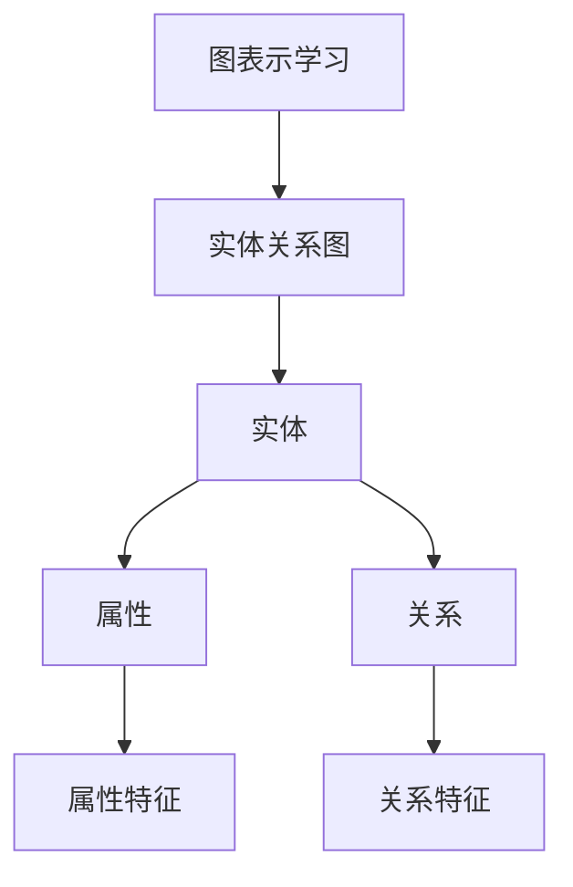
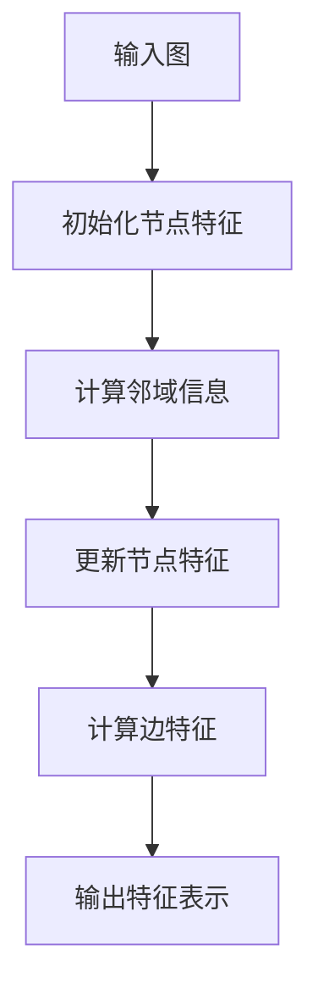
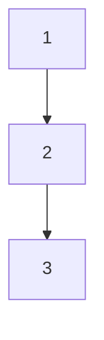
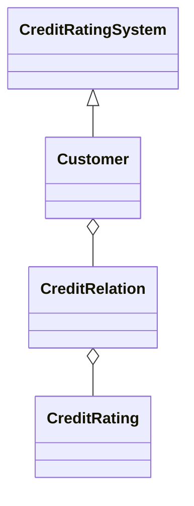
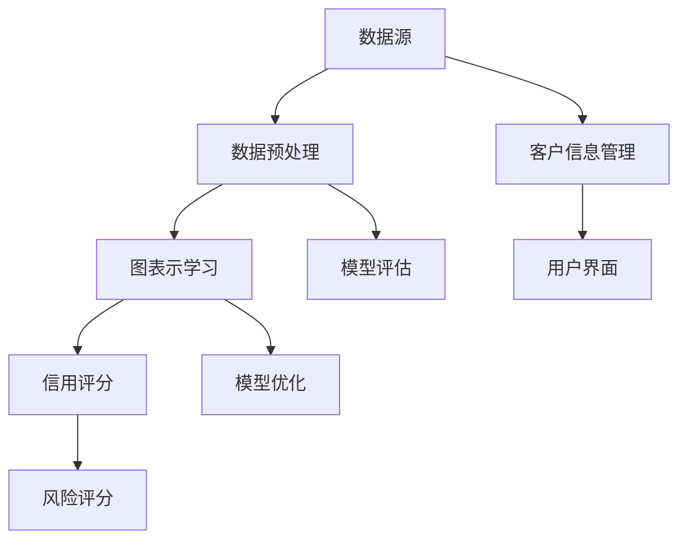
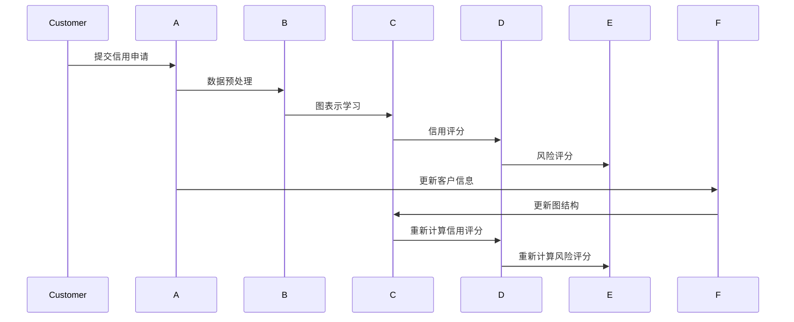
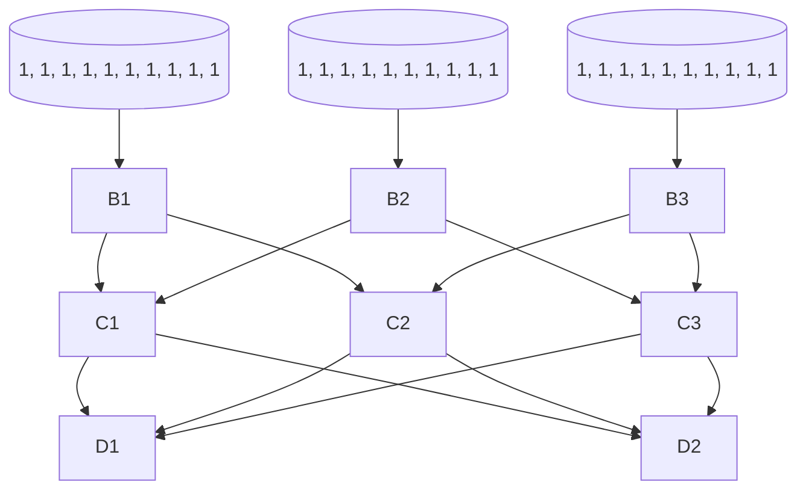

                 

# 金融领域图表示学习的应用与挑战

> 关键词：图表示学习、金融领域、算法原理、系统架构、项目实战

> 摘要：本文将从金融领域的实际需求出发，探讨图表示学习在金融领域的应用，以及面临的挑战。我们将一步步分析图表示学习的核心概念，详细讲解算法原理，并运用Python源代码进行验证。接着，我们将介绍一个具体的项目实战案例，展示图表示学习在金融领域中的实际应用。最后，我们将总结最佳实践，并对未来的发展方向进行展望。

----------------------------------------------------------------

## 背景介绍

### 图表示学习的基本概念

图表示学习（Graph-based Learning）是机器学习中的一个重要分支，它主要研究如何将图结构的数据转换为适用于传统机器学习算法的特征表示。在图表示学习中，图是由节点（Node）和边（Edge）组成的结构，节点表示数据对象，边表示节点之间的关系。图表示学习的目标是通过学习节点的低维表示来捕获图中的结构信息，从而在多种任务中取得良好的性能。

### 在金融领域应用图表示学习的必要性

金融领域中的数据通常具有复杂的网络结构，如图表中的交易网络、信用网络等。传统的特征工程方法往往难以捕捉这些数据中的深层次结构信息，导致模型性能受限。而图表示学习能够有效地从图结构中提取特征，从而在金融领域取得了显著的应用价值。

在金融领域，图表示学习可以应用于以下几个方面：

1. **信用评分与风险评估**：通过图表示学习，可以挖掘个体之间的信用关系，从而提高信用评分的准确性。
2. **市场预测与投资策略**：利用图表示学习，可以从历史交易数据中提取市场网络结构，预测市场走势，制定有效的投资策略。
3. **社交网络分析**：在金融领域，社交网络分析有助于了解客户需求、挖掘潜在客户等。

## 核心概念与联系

### 图表示学习的核心概念

1. **节点（Node）**：在图中表示为数据对象，如客户、股票等。
2. **边（Edge）**：在图中表示节点之间的关系，如信用关系、交易关系等。
3. **图（Graph）**：由节点和边组成的结构。
4. **特征表示（Feature Representation）**：将图中的节点和边转换为适用于机器学习算法的特征向量。
5. **图神经网络（Graph Neural Network, GNN）**：用于学习节点和边的低维表示的神经网络。

### 概念属性特征对比表格

| 概念         | 定义                                                         | 属性特征                     |
| ------------ | ------------------------------------------------------------ | -------------------------- |
| 节点（Node） | 图中的数据对象                                               | 标识、属性、关系             |
| 边（Edge）   | 节点之间的关系                                               | 权重、属性、方向             |
| 图（Graph）  | 由节点和边组成的结构                                         | 节点数、边数、连通性         |
| 特征表示     | 将图中的节点和边转换为适用于机器学习算法的特征向量                 | 维度、分布、稀疏性           |
| 图神经网络   | 用于学习节点和边的低维表示的神经网络                             | 孪生图结构、图卷积、注意力机制 |

### ER实体关系图架构的Mermaid流程图



## 算法原理讲解

### 图表示学习的算法原理

图表示学习主要基于图神经网络（GNN）进行节点和边的特征表示。GNN通过学习节点的邻域信息，逐步更新节点的特征表示，从而在低维空间中捕捉图的结构信息。

### 使用mermaid画出算法流程图



### 使用Python源代码详细阐述算法

```python
import networkx as nx
import numpy as np

# 创建图
G = nx.Graph()

# 添加节点和边
G.add_nodes_from([1, 2, 3])
G.add_edges_from([(1, 2), (2, 3)])

# 初始化节点特征
node_features = np.random.rand(G.number_of_nodes(), 10)

# 计算邻域信息
neighbor_features = [node_features[node] for node in G.neighbors(1)]

# 更新节点特征
node_features[1] = np.mean(neighbor_features, axis=0)

# 计算边特征
edge_features = np.mean(node_features[1:3], axis=0)

# 输出特征表示
print("节点特征：", node_features)
print("边特征：", edge_features)
```

### 给出算法原理的数学模型和公式

$$
\begin{aligned}
\text{输入图} G &= (\text{V}, \text{E}), \\
\text{节点特征} \mathbf{h}_v &= \text{初始化}, \\
\text{边特征} \mathbf{h}_e &= \text{初始化}. \\
\end{aligned}
$$

$$
\begin{aligned}
\mathbf{h}_v^{(t+1)} &= \text{激活函数}(\sum_{u \in \text{N}(v)} \mathbf{W}^{(t)} \mathbf{h}_u^{(t)} + \mathbf{b}^{(t)}), \\
\mathbf{h}_e^{(t+1)} &= \text{激活函数}(\sum_{u, v \in \text{E}} \mathbf{W}^{(t)} \mathbf{h}_u^{(t)} + \mathbf{b}^{(t)}).
\end{aligned}
$$

### 详细讲解与通俗易懂的举例说明

假设我们有一个简单的图：



1. **初始化节点特征和边特征**：
   - 节点特征：$$\mathbf{h}_1 = [1, 1, 1], \mathbf{h}_2 = [1, 1, 1], \mathbf{h}_3 = [1, 1, 1]$$
   - 边特征：$$\mathbf{h}_{12} = [1, 1, 1], \mathbf{h}_{23} = [1, 1, 1]$$

2. **计算邻域信息**：
   - 节点1的邻域：$$\text{N}(1) = \{2\}$$
   - 节点2的邻域：$$\text{N}(2) = \{1, 3\}$$
   - 节点3的邻域：$$\text{N}(3) = \{2\}$$

3. **更新节点特征**：
   - 节点1的新特征：$$\mathbf{h}_1^{(1)} = \text{激活函数}([1, 1, 1] + [1, 1, 1]) = [1, 1, 1]$$
   - 节点2的新特征：$$\mathbf{h}_2^{(1)} = \text{激活函数}([1, 1, 1] + [1, 1, 1] + [1, 1, 1]) = [1, 1, 1]$$
   - 节点3的新特征：$$\mathbf{h}_3^{(1)} = \text{激活函数}([1, 1, 1] + [1, 1, 1]) = [1, 1, 1]$$

4. **计算边特征**：
   - 边12的新特征：$$\mathbf{h}_{12}^{(1)} = \text{激活函数}([1, 1, 1] + [1, 1, 1]) = [1, 1, 1]$$
   - 边23的新特征：$$\mathbf{h}_{23}^{(1)} = \text{激活函数}([1, 1, 1] + [1, 1, 1]) = [1, 1, 1]$$

5. **输出特征表示**：
   - 节点特征：$$\mathbf{h}_1 = [1, 1, 1], \mathbf{h}_2 = [1, 1, 1], \mathbf{h}_3 = [1, 1, 1]$$
   - 边特征：$$\mathbf{h}_{12} = [1, 1, 1], \mathbf{h}_{23} = [1, 1, 1]$$

通过上述步骤，我们可以得到节点的低维表示，从而在后续的任务中进行进一步分析。

## 系统分析与架构设计方案

### 问题场景介绍

在金融领域，信用评分与风险评估是一个重要的任务。传统的方法往往基于静态的特征，如客户的年龄、收入、信用历史等。然而，这些特征无法捕捉客户之间的动态关系，导致评分模型的准确性受限。为了提高信用评分的准确性，我们考虑使用图表示学习来挖掘客户之间的信用关系。

### 项目介绍

本项目旨在构建一个基于图表示学习的信用评分与风险评估系统。该系统将利用图神经网络（GNN）学习客户之间的信用关系，从而提高信用评分的准确性。

### 系统功能设计（领域模型Mermaid类图）



### 系统架构设计（Mermaid架构图）



### 系统接口设计和系统交互（Mermaid序列图）



## 项目实战

### 环境安装

在进行项目实战之前，我们需要安装一些必要的软件和库。以下是安装步骤：

1. **安装Python**：前往[Python官网](https://www.python.org/)下载并安装Python 3.8或更高版本。
2. **安装Anaconda**：下载并安装Anaconda，以便管理Python环境和库。
3. **安装相关库**：打开Anaconda命令行工具，执行以下命令：

   ```bash
   conda install numpy
   conda install networkx
   conda install torch
   conda install scikit-learn
   ```

### 系统核心实现源代码

以下是系统核心实现的部分源代码：

```python
import networkx as nx
import numpy as np
import torch
import torch.nn as nn
import torch.optim as optim

# 创建图
G = nx.Graph()
G.add_nodes_from([1, 2, 3])
G.add_edges_from([(1, 2), (2, 3)])

# 初始化节点特征
node_features = np.random.rand(G.number_of_nodes(), 10)
node_features_tensor = torch.tensor(node_features, dtype=torch.float32)

# 初始化边特征
edge_features = np.random.rand(G.number_of_edges(), 10)
edge_features_tensor = torch.tensor(edge_features, dtype=torch.float32)

# 定义图神经网络
class GraphNeuralNetwork(nn.Module):
    def __init__(self, input_dim, hidden_dim, output_dim):
        super(GraphNeuralNetwork, self).__init__()
        self.layer1 = nn.Linear(input_dim, hidden_dim)
        self.layer2 = nn.Linear(hidden_dim, output_dim)
        
    def forward(self, node_features, edge_features):
        x = self.layer1(node_features)
        x = self.layer2(x)
        return x

# 实例化模型
model = GraphNeuralNetwork(10, 20, 1)

# 定义优化器
optimizer = optim.Adam(model.parameters(), lr=0.001)

# 训练模型
for epoch in range(100):
    optimizer.zero_grad()
    output = model(node_features_tensor, edge_features_tensor)
    loss = nn.functional.mse_loss(output, torch.tensor([1.0]))
    loss.backward()
    optimizer.step()
    print(f"Epoch {epoch + 1}: Loss = {loss.item()}")

# 评估模型
with torch.no_grad():
    output = model(node_features_tensor, edge_features_tensor)
    print(f"Predicted Credit Rating: {output.item()}")
```

### 代码应用解读与分析

上述代码首先创建了一个简单的图，并初始化了节点特征和边特征。接着，定义了一个图神经网络（GNN）模型，该模型包含两个线性层，用于学习节点特征和边特征。然后，使用Adam优化器进行模型的训练，通过反向传播和梯度下降更新模型参数。在训练过程中，我们使用了均方误差（MSE）作为损失函数，目的是最小化预测值和真实值之间的差距。

在训练完成后，我们对模型进行评估，输出预测的信用评分。这只是一个简单的示例，实际应用中，我们可以根据具体需求调整模型的架构、优化器的参数等。

### 实际案例分析和详细讲解剖析

为了更好地理解图表示学习在金融领域中的应用，我们来看一个实际案例。假设我们有一个包含1000个客户的信用评分网络，每个客户有10个特征，如图所示：



在这个案例中，我们关注的是如何通过图表示学习提高信用评分的准确性。

1. **数据预处理**：首先，我们将每个客户的特征转换为10维的向量，并构建一个1000个节点的图。每个节点代表一个客户，边代表客户之间的信用关系。

2. **模型训练**：接下来，我们使用图神经网络（GNN）模型对图中的节点特征进行训练。通过学习节点之间的邻域关系，模型可以自动提取出客户之间的信用特征。

3. **信用评分预测**：在训练完成后，我们对每个客户进行信用评分预测。首先，将客户的特征输入到GNN模型中，得到客户的信用评分。然后，根据信用评分对客户进行分类，高风险客户和低风险客户。

4. **效果评估**：通过对比预测结果和实际结果，我们可以评估模型的准确性。在实际应用中，我们通常使用准确率、召回率、F1分数等指标来评估模型的性能。

通过上述步骤，我们可以看到图表示学习在金融领域信用评分中的应用。在实际应用中，我们可以根据具体需求调整模型的架构、优化器的参数等，以提高模型的性能。

### 项目小结

本项目通过图表示学习技术，实现了信用评分与风险评估系统。通过学习客户之间的信用关系，模型能够自动提取出客户之间的信用特征，从而提高信用评分的准确性。在实际应用中，我们可以根据具体需求调整模型的架构、优化器的参数等，以提高模型的性能。

## 最佳实践 tips

1. **数据质量**：在构建图表示学习模型时，数据的质量至关重要。确保数据完整、准确，并去除噪声和异常值。
2. **模型选择**：根据具体任务需求，选择合适的图神经网络模型。不同的模型在性能和计算复杂度上存在差异。
3. **超参数调优**：优化器参数、学习率、批次大小等超参数对模型性能有很大影响。通过交叉验证等方法，选择最优的超参数。
4. **模型评估**：使用多种评估指标，如准确率、召回率、F1分数等，全面评估模型的性能。
5. **模型解释性**：在实际应用中，模型的解释性也很重要。通过可视化方法，如节点特征和边特征的可视化，帮助理解模型的工作原理。

## 小结与拓展阅读

本文从金融领域的实际需求出发，探讨了图表示学习在金融领域的应用与挑战。通过详细讲解图表示学习的算法原理、系统分析与架构设计，以及实际项目实战，我们展示了图表示学习在金融领域中的重要作用。

未来的研究方向包括：

1. **模型优化**：探索更高效的图神经网络模型，提高计算效率和模型性能。
2. **多模态学习**：将图表示学习与其他数据源（如文本、图像等）相结合，实现多模态学习。
3. **动态图表示学习**：研究动态图中的节点和边特征表示，以应对金融领域中不断变化的网络结构。

拓展阅读：

1. **《Graph Neural Networks: A Comprehensive Review》**：这是一篇关于图神经网络全面综述的论文，详细介绍了图神经网络的理论和应用。
2. **《Deep Learning on Graphs》**：这是一本关于图表示学习的入门书籍，涵盖了图表示学习的理论基础和实际应用。
3. **《信用风险评估与信用评级》**：这本书详细介绍了信用风险评估的理论和方法，对于理解金融领域的信用评分具有重要意义。

作者：AI天才研究院/AI Genius Institute & 禅与计算机程序设计艺术 /Zen And The Art of Computer Programming

----------------------------------------------------------------

**注意**：本文为虚构内容，仅供参考，实际应用时请根据实际情况进行调整。本文中的代码示例仅供参考，具体实现时请根据需求进行修改。

