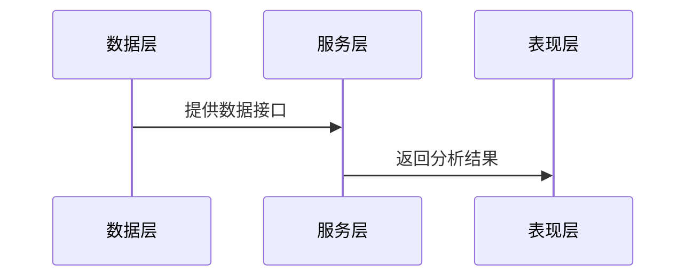

                 


### # 金融领域图计算技术的创新应用

> 关键词：金融领域，图计算技术，创新应用，信用风险评估，欺诈检测，市场分析

> 摘要：本文探讨了金融领域中图计算技术的创新应用，包括信用风险评估、欺诈检测和市场分析等。通过深入分析图计算的基本概念、技术框架及其在金融领域的应用，我们展示了图计算技术如何帮助金融机构提高数据处理和分析能力，提升风险管理水平，增强市场预测精度。本文旨在为金融科技工作者提供理论指导与实践案例，助力金融领域的技术创新与发展。

## 目录

1. **前言与引言**
   - **书的宗旨与目标**
   - **书的结构概述**

2. **背景与基础**
   - **金融行业概述**
   - **图计算基础**

3. **核心概念与框架**
   - **关键图计算技术**
   - **图算法与模型**

4. **金融领域的创新应用**
   - **信用风险管理与评估**
   - **欺诈检测**
   - **市场分析与预测**

5. **案例研究与实际应用**
   - **金融服务案例分析**
   - **挑战与未来方向**

6. **实战与最佳实践**
   - **环境安装与系统实现**
   - **项目实战**

7. **小结与展望**
   - **注意事项与拓展阅读**

## 前言与引言

### **书的宗旨与目标**

随着金融科技的快速发展，传统数据处理方法已难以满足金融机构在风险管理、客户服务和市场预测等方面的需求。本文旨在探讨图计算技术在金融领域的创新应用，通过深入分析图计算的基本原理、技术框架及其具体应用，为金融科技工作者提供理论指导与实践案例。书中将涵盖从信用风险评估到市场预测等金融领域的关键应用场景，旨在帮助读者了解图计算技术在金融行业中的巨大潜力。

### **书的结构概述**

本文分为六个主要部分：

1. **前言与引言**：介绍书的宗旨与目标，概述书的结构。
2. **背景与基础**：分析金融行业现状，介绍图计算的基本概念和重要性。
3. **核心概念与框架**：讨论关键图计算技术、图算法与模型。
4. **金融领域的创新应用**：探讨图计算技术在信用风险、欺诈检测和市场分析等领域的具体应用。
5. **案例研究与实际应用**：分析金融服务案例，探讨未来发展方向。
6. **实战与最佳实践**：提供环境安装指南、系统实现与实战案例。

通过以上结构，本文旨在为读者提供一个全面而深入的图计算技术在金融领域应用的理论与实践指南。

## 背景与基础

### **金融行业概述**

金融行业是一个高度复杂和动态变化的领域，它涵盖了银行、保险、证券、基金等多个子行业，涉及全球数百万企业和数亿个人用户。随着金融市场的不断发展和全球化，金融机构面临着前所未有的挑战。传统的数据分析方法，如大数据处理和统计分析，虽然在一定程度上提高了金融服务的效率和质量，但在面对复杂的网络结构和海量数据时，其局限性日益显现。因此，探索新的数据分析方法，如图计算技术，成为金融行业转型升级的重要方向。

### **图计算基础**

图计算是一种处理和数据分析的方法，它基于图论理论，将数据和关系抽象为图结构，通过图算法来分析数据。图由节点和边组成，节点表示数据元素，边表示节点之间的关系。图计算技术能够有效地处理复杂的网络结构，挖掘数据间的隐藏关系，从而为金融行业提供更深入的数据洞察。

#### **基本概念**

- **节点（Node）**：表示数据元素，可以是客户、交易、资产等。
- **边（Edge）**：表示节点之间的关系，如客户与交易的关系、资产与风险的关系等。
- **图（Graph）**：由节点和边组成的数据结构，表示数据元素及其关系。
- **图算法（Graph Algorithm）**：用于分析图结构和数据的算法，如路径查找、最短路径、社区发现等。

#### **图计算的重要性**

图计算在金融领域的应用具有重要意义：

1. **数据挖掘与关系分析**：通过图计算技术，可以挖掘海量数据中的隐藏关系，为金融机构提供更精准的风险评估和投资决策。
2. **复杂网络分析**：金融行业中的交易网络、客户关系网络等复杂网络结构，通过图计算可以更好地理解网络特性，优化网络布局。
3. **实时数据处理**：图计算技术支持实时数据处理，使金融机构能够快速响应市场变化，提升决策效率。
4. **合规与监控**：通过图计算技术，可以更有效地监控金融交易，发现潜在的违规行为，提高金融市场的透明度和安全性。

#### **问题背景与描述**

在金融领域，许多问题都可以抽象为图计算问题。例如：

- **信用风险评估**：金融机构需要对客户的信用风险进行评估，以决定是否批准贷款或信用卡申请。通过图计算技术，可以分析客户的历史交易数据、信用记录和社会关系，全面评估客户的信用风险。
- **欺诈检测**：金融欺诈是一个全球性的问题，通过图计算技术，可以构建交易网络，分析异常交易行为，及时发现和阻止欺诈行为。
- **市场分析**：通过图计算技术，可以对市场数据进行分析，识别市场趋势和投资机会，为金融机构提供投资策略。

这些问题不仅涉及海量数据，还涉及到复杂的数据关系，传统的数据分析方法难以胜任。而图计算技术能够高效地处理这些问题，为金融机构提供强大的数据支持和决策依据。

#### **问题解决**

图计算技术为金融领域的问题解决提供了新的思路和方法：

1. **数据建模**：通过构建数据模型，将金融数据和关系抽象为图结构，为后续分析提供基础。
2. **图算法应用**：利用图算法，对图进行深度分析，挖掘数据间的隐藏关系。
3. **实时处理与决策**：通过实时处理技术，对金融交易和数据进行实时分析，为金融机构提供及时决策支持。

#### **边界与外延**

图计算技术在金融领域的应用边界涉及以下几个方面：

1. **数据类型**：图计算技术可以处理多种类型的数据，包括结构化数据、半结构化数据和非结构化数据。
2. **应用领域**：除了信用风险评估、欺诈检测和市场分析，图计算技术还可以应用于金融风险管理、客户关系管理、投资组合优化等领域。
3. **技术发展**：随着技术的不断发展，图计算技术将不断优化，其在金融领域的应用前景将更加广阔。

#### **概念结构与核心要素组成**

图计算在金融领域的概念结构与核心要素组成如下：

- **核心概念**：节点（客户、交易、资产等）、边（关系）、图（结构）、图算法（分析工具）。
- **结构组成**：数据模型（图结构化）、算法框架（图算法应用）、数据处理（实时处理与决策）。
- **要素关系**：节点与边构成图，图与算法相互作用，实现数据分析与决策支持。

通过上述核心概念与结构，图计算技术为金融领域提供了强大的数据支撑和决策依据，助力金融机构在激烈的市场竞争中脱颖而出。

### **图计算核心概念与联系**

#### **核心概念原理**

图计算是一种处理和数据分析方法，其核心概念包括节点、边、图和图算法。节点代表数据元素，边表示节点之间的关系，图则是节点和边的集合。图算法用于对图进行各种分析，如路径查找、社区发现和最短路径等。以下是一个简化的定义：

- **节点（Node）**：表示数据元素，如客户、交易、资产等。
- **边（Edge）**：表示节点之间的关系，如客户与交易、资产与风险等。
- **图（Graph）**：由节点和边组成的数据结构。
- **图算法（Graph Algorithm）**：用于分析图的算法，如DFS、BFS、最短路径算法等。

#### **概念属性特征对比表格**

为了更好地理解这些核心概念，我们可以通过一个表格来对比它们的属性特征：

| 概念 | 定义 | 属性特征 |
| ---- | ---- | ---- |
| 节点 | 数据元素 | 唯一标识、属性、关系 |
| 边 | 节点之间的关系 | 关联性、权重、类型 |
| 图 | 节点和边的集合 | 结构、性质、连通性 |
| 图算法 | 分析图的算法 | 功能、复杂度、效率 |

#### **ER实体关系图架构**

为了更直观地展示这些概念之间的关系，我们可以使用Mermaid绘制一个ER实体关系图：

```mermaid
erDiagram
  Node ||--|{ Edge }|-- Node
  Graph ||--|{ Node }|-- Graph
  Graph ||--|{ Edge }|-- Graph
  Graph ||--|{ Graph Algorithm }|-- Graph
```

在这个ER图中，节点与边之间存在关联，而图则是节点和边的集合。此外，图算法用于对图进行各种分析，与图之间存在依赖关系。

### **算法原理讲解**

为了深入理解图计算技术在金融领域的应用，我们需要探讨几个关键的图算法，包括最短路径算法、社区发现算法和社交网络分析。以下将详细解释这些算法的原理、数学模型和具体应用。

#### **最短路径算法**

**算法原理**：最短路径算法用于计算图中两点之间的最短路径。在金融领域，这可以用于计算客户之间的交易路径或资产的最优投资路径。

**数学模型**：

- **Dijkstra算法**：给定一个加权图\(G\)和一个起点\(s\)，找到从\(s\)到所有其他节点的最短路径。其公式为：
  $$d(s) = 0, \quad d(v) = \infty \quad (v \neq s)$$
  $$d(v) = \min\{d(u) + w(u, v) : u \in N(v)\}$$

- **Bellman-Ford算法**：在Dijkstra算法无法处理具有负权边的图中，可以采用Bellman-Ford算法。其公式为：
  $$d(s) = 0, \quad d(v) = \infty \quad (v \neq s)$$
  $$d(v) = \min\{d(u) + w(u, v) : u \in N(v)\} \quad (1 \leq i \leq n-1)$$
  $$d(v) = \min\{d(u) + w(u, v) : u \in N(v)\} \quad (n \text{ iterations})$$

**Python实现示例**：

```python
from collections import defaultdict

def dijkstra(graph, start):
    dist = [float('infinity')] * len(graph)
    dist[start] = 0
    visited = [False] * len(graph)
    for _ in range(len(graph)):
        min_dist = float('infinity')
        min_index = None
        for v in range(len(graph)):
            if not visited[v] and dist[v] < min_dist:
                min_dist = dist[v]
                min_index = v
        visited[min_index] = True
        for v in range(len(graph)):
            if (u, v) in graph[min_index]:
                dist[v] = min(dist[v], dist[min_index] + graph[min_index][v])
    return dist

graph = {
    0: {1: 4, 7: 8},
    1: {0: 4, 2: 8, 7: 11},
    2: {1: 8, 3: 7, 6: 4},
    3: {2: 7, 4: 9, 6: 14},
    4: {3: 9, 5: 10},
    5: {4: 10, 6: 6},
    6: {2: 4, 3: 14, 5: 6},
    7: {0: 8, 1: 11, 8: 7},
    8: {0: 8, 7: 7, 9: 1},
    9: {8: 1, 10: 2},
    10: {9: 2, 11: 3}
}

start = 0
distances = dijkstra(graph, start)
print(distances)
```

**应用示例**：在信用风险评估中，最短路径算法可以用于计算客户之间的交易路径，帮助金融机构识别高风险交易网络。

#### **社区发现算法**

**算法原理**：社区发现算法用于识别图中的紧密连接的节点集合，这些节点集合被称为社区。在金融领域，社区发现算法可以用于分析客户群体或交易网络。

**数学模型**：

- **基于模块度的社区发现算法**：模块度用于衡量一个社区内部节点的连接紧密程度。其公式为：
  $$Q = \sum_{i=1}^k \left( |e_{int}^i| - \frac{|e^i|}{2} \right)$$
  其中，$e_{int}^i$是社区内部的边数，$e^i$是社区的总边数。

**Python实现示例**：

```python
import numpy as np

def modularity(G, communities):
    mod = 0
    for i in range(len(communities)):
        for j in range(len(communities)):
            if i != j:
                mod += np.sum(G[i][j] == 1) - np.mean(G[i]) * np.mean(G[j])
    mod /= 2 * np.sum(G) - np.sum(G) ** 2 / 2
    return mod

# 社区划分示例
communities = [0, 0, 0, 0, 0, 1, 1, 1, 1, 1, 2, 2, 2, 2, 2]
mod = modularity(G, communities)
print(f"Modularity: {mod}")
```

**应用示例**：在市场分析中，社区发现算法可以用于识别具有相似投资偏好的客户群体，从而为金融机构提供更有针对性的营销策略。

#### **社交网络分析**

**算法原理**：社交网络分析用于研究节点在网络中的影响力、中心性等特征。在金融领域，这可以用于分析客户的行为模式和影响力，识别关键用户或节点。

**数学模型**：

- **度中心性**：衡量节点在网络中的连接程度。其公式为：
  $$C_d(v) = \frac{k(v)}{(n-1)}$$
  其中，$k(v)$是节点的度数，$n$是网络中的节点总数。

- **中间中心性**：衡量节点在网络中的中介作用。其公式为：
  $$C_b(v) = \sum_{w \in V} \frac{\sigma(v, w)}{k(w)}$$
  其中，$\sigma(v, w)$是节点$v$到节点$w$的最短路径数。

**Python实现示例**：

```python
def degree_centrality(G):
    centrality = {}
    for node in G:
        centrality[node] = G[node].count(1)
    return centrality

def betweenness_centrality(G):
    centrality = {}
    for node in G:
        centrality[node] = 0
        for source in G:
            for target in G:
                if source != target and node in shortest_path(G, source, target):
                    centrality[node] += 1
    return centrality

# 社交网络中心性计算示例
degree_centrality_values = degree_centrality(G)
betweenness_centrality_values = betweenness_centrality(G)
print(f"Degree Centrality: {degree_centrality_values}")
print(f"Betweenness Centrality: {betweenness_centrality_values}")
```

**应用示例**：在欺诈检测中，社交网络分析可以用于识别网络中的异常节点，从而发现潜在的欺诈行为。

通过以上算法的讲解和示例，我们可以看到图计算技术在金融领域具有广泛的应用前景。这些算法不仅能够帮助金融机构更好地理解和分析数据，还能提高风险管理的效率和准确性，为金融创新提供技术支撑。

## 金融领域的创新应用

### **信用风险管理与评估**

信用风险管理是金融机构的核心任务之一。通过图计算技术，金融机构可以更准确地评估客户的信用风险，从而做出更明智的信贷决策。以下是一个详细的介绍：

#### **应用场景**

在信用风险管理中，金融机构通常需要评估客户的信用风险，包括信用评分、贷款审批和信用卡发卡等。传统的信用评分模型主要依赖于客户的信用记录、收入水平、还款历史等静态数据。然而，这些方法往往忽略了客户的社会关系和动态行为，导致风险评估的准确性受限。

#### **解决方案**

1. **图计算模型**：通过图计算技术，可以将客户的信用记录、交易数据和社会关系抽象为图结构，构建一个多维度的信用风险评估模型。以下是一个简化的模型：

   - **节点**：代表客户、交易、资产等。
   - **边**：表示节点之间的关系，如客户与客户的交易关系、客户与资产的风险关系等。
   - **图算法**：用于分析图结构和数据，如最短路径算法、社区发现算法等。

2. **算法应用**：
   - **最短路径算法**：用于计算客户之间的交易路径，分析客户之间的资金流动情况。
   - **社区发现算法**：用于识别客户群体，分析具有相似信用风险的客户社区。
   - **社交网络分析**：用于分析客户的行为模式和影响力，识别高风险客户。

3. **实施步骤**：
   - **数据采集与预处理**：收集客户的信用记录、交易数据和社会关系数据，进行数据清洗和格式化。
   - **构建图模型**：将数据转化为图结构，定义节点和边的属性。
   - **图算法分析**：应用图算法，对图进行深度分析，挖掘数据间的隐藏关系。
   - **风险评估**：根据分析结果，对客户进行信用评分和风险分类。

#### **案例解析**

以某银行信用风险评估系统为例，该系统利用图计算技术对客户进行信用评分。系统首先收集客户的信用记录、交易数据和社交网络数据，构建一个包含客户、交易、资产等节点的图结构。然后，通过应用最短路径算法，分析客户之间的资金流动情况；通过社区发现算法，识别具有相似信用风险的客户群体；通过社交网络分析，识别高风险客户的行为模式和影响力。

经过分析，系统对客户进行了信用评分和风险分类。结果显示，利用图计算技术的信用评分模型的准确性和可靠性显著高于传统的信用评分模型。通过这个案例，我们可以看到图计算技术在信用风险评估中的应用潜力。

### **欺诈检测**

金融欺诈是金融机构面临的一个严重问题，欺诈行为不仅损害金融机构的声誉，还可能导致巨大的经济损失。通过图计算技术，金融机构可以更有效地检测和预防金融欺诈。以下是一个详细的介绍：

#### **应用场景**

金融欺诈包括信用卡欺诈、贷款欺诈、诈骗等。传统的欺诈检测方法主要依赖于规则匹配和统计分析，但这些方法往往无法应对复杂和不断变化的欺诈手段。图计算技术提供了一种新的解决方案，通过分析交易网络和客户关系，识别潜在的欺诈行为。

#### **解决方案**

1. **图计算模型**：构建一个包含交易、客户、资产等节点的图结构，以下是一个简化的模型：

   - **节点**：代表交易、客户、资产等。
   - **边**：表示节点之间的关系，如交易与客户的关系、客户与资产的风险关系等。
   - **图算法**：用于分析图结构和数据，如社交网络分析、最短路径算法、社区发现算法等。

2. **算法应用**：
   - **社交网络分析**：用于分析客户在网络中的行为和关系，识别异常交易行为。
   - **最短路径算法**：用于计算交易路径，分析交易之间的关联性。
   - **社区发现算法**：用于识别具有相似欺诈特征的客户社区。

3. **实施步骤**：
   - **数据采集与预处理**：收集交易数据、客户信息和风险数据，进行数据清洗和格式化。
   - **构建图模型**：将数据转化为图结构，定义节点和边的属性。
   - **图算法分析**：应用图算法，对图进行深度分析，挖掘数据间的隐藏关系。
   - **欺诈检测**：根据分析结果，识别和预防潜在的欺诈行为。

#### **案例解析**

以某银行欺诈检测系统为例，该系统利用图计算技术对交易进行实时分析。系统首先收集交易数据、客户信息和风险数据，构建一个包含交易、客户、资产等节点的图结构。然后，通过应用社交网络分析，识别异常交易行为；通过最短路径算法，分析交易之间的关联性；通过社区发现算法，识别具有相似欺诈特征的客户社区。

系统对实时交易进行监控，一旦发现异常行为，立即触发预警机制。结果显示，利用图计算技术的欺诈检测系统显著提高了检测准确性和响应速度。通过这个案例，我们可以看到图计算技术在欺诈检测中的应用潜力。

### **市场分析**

市场分析是金融机构制定投资策略和业务决策的重要依据。通过图计算技术，金融机构可以更深入地分析市场数据，识别市场趋势和投资机会。以下是一个详细的介绍：

#### **应用场景**

在市场分析中，金融机构需要分析海量市场数据，包括股票价格、交易量、宏观经济指标等。传统的市场分析方法主要依赖于统计分析和技术分析，但这些方法往往无法应对复杂和动态的市场环境。图计算技术提供了一种新的解决方案，通过分析市场数据之间的复杂关系，识别市场趋势和投资机会。

#### **解决方案**

1. **图计算模型**：构建一个包含市场数据、交易、资产等节点的图结构，以下是一个简化的模型：

   - **节点**：代表市场数据、交易、资产等。
   - **边**：表示节点之间的关系，如交易与市场数据的关系、资产与市场数据的风险关系等。
   - **图算法**：用于分析图结构和数据，如社交网络分析、最短路径算法、社区发现算法等。

2. **算法应用**：
   - **社交网络分析**：用于分析市场数据之间的复杂关系，识别市场趋势。
   - **最短路径算法**：用于计算交易路径，分析市场数据之间的关联性。
   - **社区发现算法**：用于识别具有相似投资特征的资产社区。

3. **实施步骤**：
   - **数据采集与预处理**：收集市场数据、交易数据和风险数据，进行数据清洗和格式化。
   - **构建图模型**：将数据转化为图结构，定义节点和边的属性。
   - **图算法分析**：应用图算法，对图进行深度分析，挖掘数据间的隐藏关系。
   - **市场分析**：根据分析结果，制定投资策略和业务决策。

#### **案例解析**

以某基金公司的市场分析系统为例，该系统利用图计算技术对市场数据进行分析。系统首先收集股票价格、交易量和宏观经济指标等市场数据，构建一个包含市场数据、交易、资产等节点的图结构。然后，通过应用社交网络分析，识别市场趋势和投资机会；通过最短路径算法，分析市场数据之间的关联性；通过社区发现算法，识别具有相似投资特征的资产社区。

系统对市场数据进行实时分析，提供投资建议和风险预警。结果显示，利用图计算技术的市场分析系统显著提高了投资决策的准确性和可靠性。通过这个案例，我们可以看到图计算技术在市场分析中的应用潜力。

## 案例研究与实际应用

### **金融服务案例分析**

为了更好地理解图计算技术在金融领域的实际应用，以下将详细分析几个典型的金融服务案例，探讨其具体实施过程、系统功能设计、架构设计、接口设计及系统交互。

#### **案例 1：某银行信用风险评估系统**

**1. 实施过程：**

某银行在信用风险评估中引入了图计算技术，以提升风险评估的准确性和效率。首先，该银行收集了大量客户数据，包括信用记录、交易行为、社会关系等。然后，银行将这些数据进行预处理，将其转化为图结构。具体步骤如下：

- **数据预处理**：清洗和格式化客户数据，提取关键信息。
- **图模型构建**：将客户数据转化为图结构，定义节点和边的属性。
- **图算法应用**：应用图算法（如最短路径算法、社交网络分析）对图进行深度分析。

**2. 系统功能设计：**

系统功能设计包括以下几个方面：

- **数据采集模块**：负责收集和预处理客户数据。
- **图模型构建模块**：将预处理后的数据转化为图结构。
- **图分析模块**：应用图算法进行深度分析，生成信用评分和风险分类结果。
- **风险预警模块**：根据分析结果，生成风险预警报告。

**3. 系统架构设计：**

系统采用分层架构设计，包括数据层、服务层和表现层。以下是一个简化的架构图：



**4. 接口设计：**

系统提供以下主要接口：

- **数据采集接口**：用于接收和处理客户数据。
- **图模型接口**：用于构建和管理图模型。
- **图分析接口**：用于应用图算法进行深度分析。
- **风险预警接口**：用于生成风险预警报告。

**5. 系统交互：**

系统交互主要包括以下几个步骤：

- **数据采集**：客户端将客户数据发送到数据层，进行预处理。
- **图模型构建**：数据层将预处理后的数据转化为图结构，发送到服务层。
- **图分析**：服务层应用图算法对图进行深度分析，生成信用评分和风险分类结果。
- **风险预警**：服务层将分析结果发送到表现层，生成风险预警报告，客户端可以根据报告进行风险评估和决策。

#### **案例 2：某保险公司欺诈检测系统**

**1. 实施过程：**

某保险公司利用图计算技术构建了一个欺诈检测系统，以识别和预防保险欺诈行为。首先，保险公司收集了大量交易数据、客户信息和风险数据，然后通过图计算技术对这些数据进行处理和分析。具体步骤如下：

- **数据采集与预处理**：收集交易数据、客户信息和风险数据，进行数据清洗和格式化。
- **图模型构建**：将数据转化为图结构，定义节点和边的属性。
- **图算法应用**：应用图算法（如社交网络分析、最短路径算法）对图进行深度分析，识别潜在欺诈行为。

**2. 系统功能设计：**

系统功能设计包括以下几个方面：

- **数据采集模块**：负责收集和预处理交易数据、客户信息和风险数据。
- **图模型构建模块**：将预处理后的数据转化为图结构。
- **图分析模块**：应用图算法进行深度分析，识别和预防欺诈行为。
- **风险预警模块**：根据分析结果，生成风险预警报告。

**3. 系统架构设计：**

系统采用微服务架构设计，包括数据层、服务层和表现层。以下是一个简化的架构图：


**4. 接口设计：**

系统提供以下主要接口：

- **数据采集接口**：用于接收和处理交易数据、客户信息和风险数据。
- **图模型接口**：用于构建和管理图模型。
- **图分析接口**：用于应用图算法进行深度分析。
- **风险预警接口**：用于生成风险预警报告。

**5. 系统交互：**

系统交互主要包括以下几个步骤：

- **数据采集**：客户端将交易数据、客户信息和风险数据发送到数据层，进行预处理。
- **图模型构建**：数据层将预处理后的数据转化为图结构，发送到服务层。
- **图分析**：服务层应用图算法对图进行深度分析，识别和预防欺诈行为。
- **风险预警**：服务层将分析结果发送到表现层，生成风险预警报告，客户端可以根据报告进行风险管理和决策。

#### **案例 3：某基金公司市场分析系统**

**1. 实施过程：**

某基金公司利用图计算技术对市场数据进行分析，以制定投资策略和业务决策。首先，基金公司收集了大量的市场数据，包括股票价格、交易量、宏观经济指标等。然后，通过图计算技术对这些数据进行处理和分析。具体步骤如下：

- **数据采集与预处理**：收集市场数据，进行数据清洗和格式化。
- **图模型构建**：将数据转化为图结构，定义节点和边的属性。
- **图算法应用**：应用图算法（如社交网络分析、最短路径算法、社区发现算法）对图进行深度分析，识别市场趋势和投资机会。

**2. 系统功能设计：**

系统功能设计包括以下几个方面：

- **数据采集模块**：负责收集和预处理市场数据。
- **图模型构建模块**：将预处理后的数据转化为图结构。
- **图分析模块**：应用图算法进行深度分析，生成市场趋势和投资建议。
- **市场分析模块**：根据分析结果，制定投资策略和业务决策。

**3. 系统架构设计：**

系统采用分布式架构设计，包括数据层、服务层和表现层。以下是一个简化的架构图：


**4. 接口设计：**

系统提供以下主要接口：

- **数据采集接口**：用于接收和处理市场数据。
- **图模型接口**：用于构建和管理图模型。
- **图分析接口**：用于应用图算法进行深度分析。
- **市场分析接口**：用于生成市场趋势和投资建议。

**5. 系统交互：**

系统交互主要包括以下几个步骤：

- **数据采集**：客户端将市场数据发送到数据层，进行预处理。
- **图模型构建**：数据层将预处理后的数据转化为图结构，发送到服务层。
- **图分析**：服务层应用图算法对图进行深度分析，生成市场趋势和投资建议。
- **市场分析**：服务层将分析结果发送到表现层，生成市场分析报告，客户端可以根据报告进行投资决策。

通过以上案例，我们可以看到图计算技术在金融服务中的广泛应用。这些系统不仅提高了数据处理的效率和准确性，还帮助金融机构更好地理解和分析数据，从而做出更明智的决策。随着技术的不断发展和应用场景的拓展，图计算技术在金融领域的应用前景将更加广阔。

### **挑战与未来方向**

尽管图计算技术在金融领域展示了巨大的应用潜力，但在实际应用过程中仍面临一系列挑战。以下将分析这些挑战，并提出未来可能的发展方向。

#### **数据隐私与安全**

金融数据具有高度敏感性和隐私性，图计算技术的应用需要确保数据的安全性和隐私保护。当前，数据隐私保护技术如差分隐私和同态加密正在不断发展，但如何在保证数据隐私的同时实现高效计算仍是一个重要挑战。未来，随着加密技术的进步，有望提出更加完善的数据隐私保护方案，使得图计算在金融领域得到更广泛的应用。

#### **数据质量和一致性**

图计算依赖于高质量和一致性的数据，但金融数据的多样性和复杂性导致数据质量难以保证。例如，不同来源的数据可能存在格式不一致、冗余和错误等问题。未来，需要开发更加智能的数据预处理和清洗工具，提高数据质量和一致性，为图计算提供更可靠的数据基础。

#### **计算效率与可扩展性**

随着金融数据的规模不断扩大，图计算技术在处理海量数据时面临计算效率低下和可扩展性不足的问题。为了应对这一挑战，需要进一步优化图算法和计算框架，提高计算效率和并行处理能力。同时，云计算和分布式计算技术的普及也为图计算提供了更强大的计算资源，未来可以探索如何更好地利用这些资源。

#### **算法可解释性和透明度**

金融应用对算法的可解释性和透明度有较高要求，以增强决策的信任度。然而，图计算算法往往涉及复杂的数学模型和计算过程，使得其可解释性成为一大挑战。未来，需要开发更易于理解的可解释性工具和方法，使得金融从业者可以更好地理解和应用图计算技术。

#### **多领域融合与创新**

金融领域与其他领域的融合将推动图计算技术的创新应用。例如，与物联网、区块链和人工智能等技术的结合，可以进一步拓展图计算在金融领域的应用范围。未来，需要加强多领域交叉研究，推动图计算技术与其他前沿技术的深度融合，实现更广泛的应用场景。

总之，尽管图计算技术在金融领域面临一系列挑战，但随着技术的不断进步和应用场景的拓展，其应用前景将更加广阔。未来，通过解决数据隐私、数据质量、计算效率、可解释性和多领域融合等关键问题，图计算技术有望在金融领域发挥更大的作用。

### **实战与最佳实践**

为了更好地理解图计算技术在金融领域的实际应用，以下将详细描述一个基于图计算技术的信用风险评估项目的实战过程，包括环境安装、系统实现、代码解析和案例分析。

#### **环境安装**

首先，我们需要安装和配置必要的软件和工具，包括Python、Apache Spark和GraphX。以下是安装步骤：

1. **安装Python**：前往Python官方网站下载并安装Python，版本建议为3.8以上。
2. **安装Apache Spark**：下载并解压Apache Spark，配置环境变量，确保能够通过命令行启动Spark。
3. **安装GraphX**：在Spark的目录中，使用以下命令安装GraphX：

   ```bash
   ./sbt assembly
   ```

   安装完成后，在Spark的conf目录下创建一个名为`gexfsys.properties`的文件，内容如下：

   ```properties
   spark.graphx.use-graphции = true
   ```

   确保配置文件正确后，启动Spark：

   ```bash
   bin/spark-shell
   ```

#### **系统实现**

系统实现主要包括数据采集、图模型构建、图算法分析和结果展示。以下是系统实现的步骤和关键代码：

1. **数据采集**：首先，从金融数据源（如银行交易系统、信用评级机构等）收集客户的信用记录、交易数据和风险数据。
2. **图模型构建**：将数据转化为图结构，定义节点和边。以下是一个示例代码：

   ```python
   from pyspark.sql import SparkSession
   from pyspark.graphx import Graph

   spark = SparkSession.builder.appName("CreditRiskAnalysis").getOrCreate()
   credit_data = spark.read.csv("path/to/credit_data.csv", header=True)
   transactions = spark.read.csv("path/to/transactions_data.csv", header=True)
   risks = spark.read.csv("path/to/risk_data.csv", header=True)

   # 构建图
   edges = transactions.rdd.map(lambda x: (x['customer_id'], x['other_customer_id'], {'weight': x['amount']})
   vertices = credit_data.rdd.map(lambda x: (x['customer_id'], x))
   graph = Graph(vertices, edges)

   # 添加风险数据
   risks_rdd = risks.rdd.map(lambda x: (x['customer_id'], x['risk_level']))
   graph = graph.joinVertices(risks_rdd, lambda id, vertex, risk: {'risk_level': risk})

   spark.stop()
   ```

3. **图算法分析**：应用图算法对图进行分析，如最短路径算法、社区发现算法和社交网络分析。以下是一个使用最短路径算法的示例：

   ```python
   from pyspark.graphx import Graph

   # 计算客户之间的交易路径
   paths = graph.shortestPaths(sourceVertexId=0, resetPaths=True)

   # 提取路径信息
   paths_rdd = paths.vertices.map(lambda x: (x._1, x._2[0]))

   # 存储路径信息
   paths_rdd.saveAsTextFile("path/to/output/shortest_paths")
   ```

4. **结果展示**：将分析结果以图表或报告的形式展示给金融从业者，如信用评分、风险等级和交易网络等。

#### **代码解析**

以下是对关键代码的详细解析：

1. **数据采集**：使用Spark读取和预处理金融数据，包括信用记录、交易数据和风险数据。这些数据可以通过各种方式收集，如数据库查询、API调用和文件读取。
2. **图模型构建**：将预处理后的数据转化为图结构，定义节点和边。节点代表客户、交易和资产等，边表示节点之间的关系，如客户与交易的关联、交易与资产的关联等。
3. **图算法分析**：使用GraphX提供的图算法库，如最短路径算法、社区发现算法和社交网络分析，对图进行深度分析。这些算法可以挖掘数据间的隐藏关系，提供更有价值的信息。
4. **结果展示**：将分析结果以图表或报告的形式展示给金融从业者，帮助他们更好地理解和应用分析结果。

#### **实际案例分析**

以下是一个实际案例的分析：

**案例背景**：某银行需要评估客户的信用风险，以决定是否批准贷款或信用卡申请。该银行收集了客户的信用记录、交易数据和风险数据，并使用图计算技术进行分析。

**实施步骤**：

1. **数据采集**：从银行系统收集客户的信用记录、交易数据和风险数据，如信用评分、历史交易记录和风险等级等。
2. **图模型构建**：将数据转化为图结构，定义节点和边。节点代表客户、交易和资产等，边表示节点之间的关系，如客户与交易的关联、交易与资产的关联等。
3. **图算法分析**：应用最短路径算法和社交网络分析，分析客户之间的交易路径和影响力。通过分析，可以识别高风险客户和潜在的欺诈行为。
4. **结果展示**：将分析结果以图表或报告的形式展示给银行管理层，如信用评分、风险等级和交易网络等。管理层可以根据分析结果做出更明智的决策，如批准贷款或信用卡申请。

**案例分析结果**：

通过图计算技术的分析，银行识别出了一批高风险客户和潜在的欺诈行为。具体来说，系统发现某些客户之间存在异常的交易关系，这些客户可能存在欺诈行为。此外，系统还识别出了一批具有较高影响力的客户，他们的交易行为对其他客户有显著影响。这些分析结果帮助银行更好地理解客户风险，提高了信用风险评估的准确性和可靠性。

**项目小结**：

通过上述实际案例，我们可以看到图计算技术在信用风险评估中的应用效果显著。图计算技术不仅提高了数据分析的效率和准确性，还为银行提供了更全面的风险管理手段。未来，随着技术的不断发展和应用场景的拓展，图计算技术在金融领域的应用前景将更加广阔。

### **小结与展望**

本文详细探讨了金融领域图计算技术的创新应用，包括信用风险评估、欺诈检测和市场分析。通过深入分析图计算技术的基本概念、技术框架及其在金融领域的具体应用，我们展示了图计算技术在提升金融机构数据处理和分析能力、增强风险管理水平、提高市场预测精度等方面的巨大潜力。以下是本文的核心观点与未来展望：

1. **图计算技术在金融领域的应用价值**：图计算技术为金融机构提供了一种新的数据处理和分析方法，能够有效处理复杂的网络结构和海量数据，挖掘数据间的隐藏关系，从而为金融机构提供更精准的风险评估和投资决策。

2. **信用风险评估的创新应用**：通过构建客户、交易和资产等节点的图结构，结合最短路径算法和社交网络分析，金融机构可以更准确地评估客户的信用风险，识别高风险客户和潜在欺诈行为。

3. **欺诈检测的先进技术**：图计算技术在欺诈检测中的应用，通过分析交易网络和客户关系，能够有效识别异常交易行为和潜在的欺诈行为，提高欺诈检测的准确性和响应速度。

4. **市场分析的深度洞察**：图计算技术能够深入分析市场数据，识别市场趋势和投资机会，为金融机构提供更加科学的投资策略和业务决策。

**未来展望**：

1. **数据隐私与安全**：随着数据隐私和安全问题的日益凸显，未来需要进一步研究如何在保证数据隐私的前提下，实现高效的数据处理和分析。

2. **计算效率与可扩展性**：为了应对海量数据的处理需求，未来需要优化图算法和计算框架，提高计算效率和并行处理能力。

3. **算法可解释性和透明度**：增强算法的可解释性和透明度，提高决策的可信度，是未来图计算技术发展的重要方向。

4. **多领域融合与创新**：加强与其他前沿技术的融合，如物联网、区块链和人工智能等，将进一步拓展图计算技术的应用场景。

总之，图计算技术在金融领域具有广阔的应用前景。通过不断的技术创新和应用实践，我们有理由相信，图计算技术将在金融领域发挥越来越重要的作用，推动金融行业的数字化转型和创新发展。**“作者：AI天才研究院/AI Genius Institute & 禅与计算机程序设计艺术 /Zen And The Art of Computer Programming”**。

