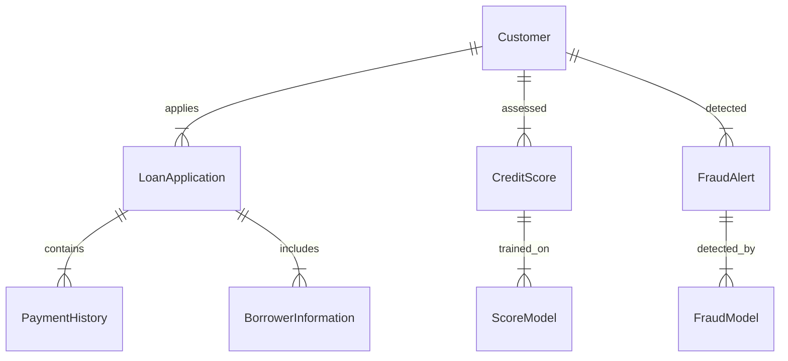
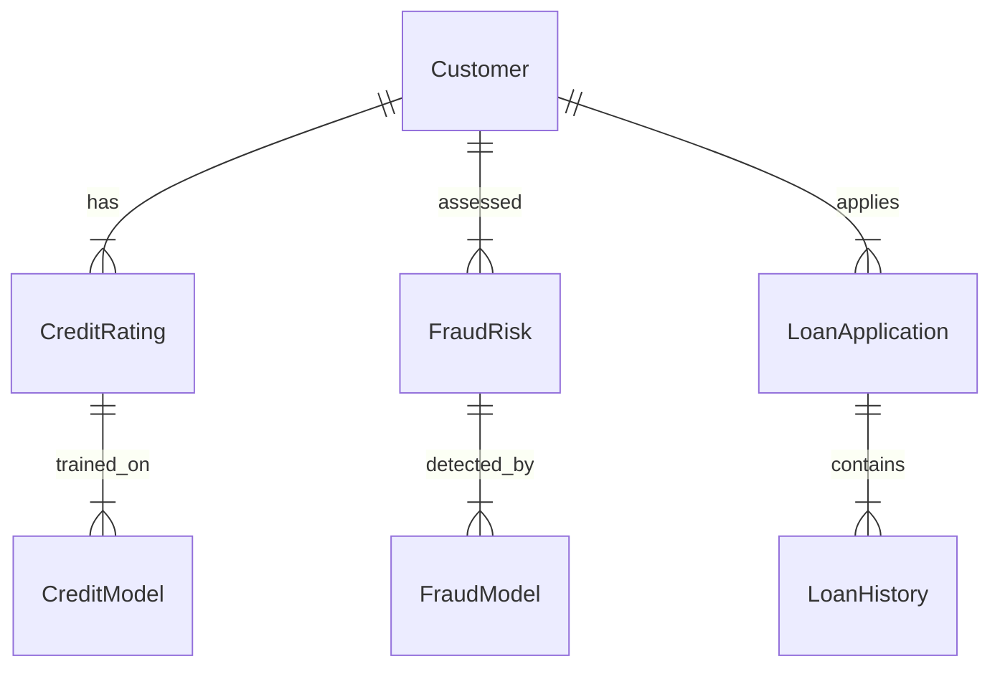
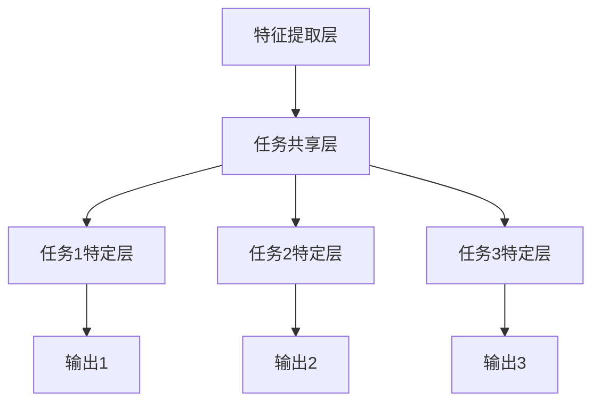
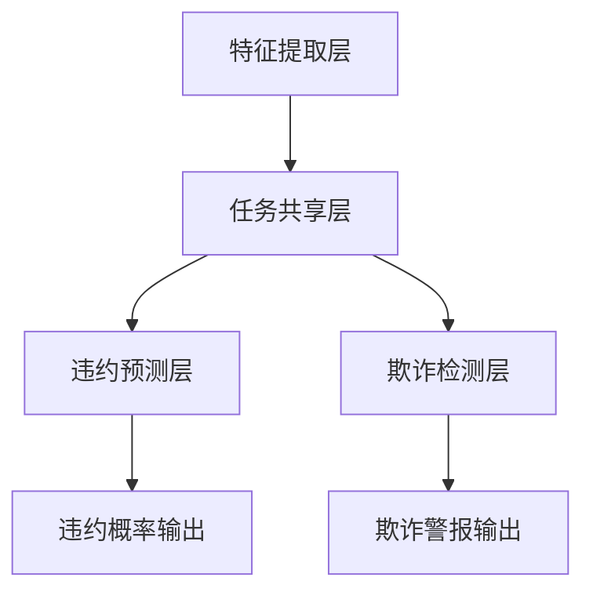

                 

# 金融领域多任务学习在信用评分中的应用

## 关键词

- 多任务学习
- 信用评分
- 金融科技
- 信用风险管理
- 机器学习算法

## 摘要

本文将探讨金融领域中的多任务学习技术，尤其是在信用评分中的应用。首先，我们介绍了多任务学习的定义、背景以及其在金融领域的应用重要性。接着，深入分析了多任务学习的基本原理，包括模型框架、核心概念和信用评分中的常见算法。随后，通过具体案例展示了多任务学习在信用评分和信用风险管理中的应用，最后讨论了多任务学习在金融科技中的前景与挑战。本文旨在为金融科技领域从业者提供多任务学习技术在实际应用中的深入理解和实践指导。

---

## 第一部分：金融领域多任务学习概述

### 第1章：多任务学习与金融领域

#### 1.1.1 多任务学习的定义与核心概念

多任务学习（Multi-Task Learning，MTL）是一种机器学习技术，旨在同时解决多个相关的学习任务。与单一任务学习相比，多任务学习通过共享表示和知识转移来提高模型的泛化能力和效率。

**定义：**
多任务学习是一种学习范式，其中多个相关的任务被同时或依次训练，模型需要学习到如何在不同任务之间共享特征和知识，从而提高整体性能。

**核心概念：**
- **共享表示**：多任务学习的关键在于任务之间的共享表示，即不同任务使用相同的特征表示来提高学习效果。
- **任务关联性**：多任务学习假定任务之间存在某种关联性，这种关联性可以是基于数据、目标或学习过程的相似性。
- **任务权重**：在多任务学习中，不同任务的贡献可能不同，通过调整任务权重可以优化模型的整体性能。

#### 1.1.1.1 多任务学习的背景

随着数据规模的不断扩大和复杂度的增加，单一任务学习逐渐暴露出其局限性。例如，传统单任务学习模型在处理大规模、多维度的金融数据时，往往无法充分利用数据中的潜在关联性，导致性能不佳。多任务学习技术在此背景下应运而生，通过任务间的共享表示和知识转移，提高模型对复杂金融数据的处理能力。

#### 1.1.1.2 多任务学习的核心概念

多任务学习的核心概念包括：

- **协同训练**：协同训练是多任务学习的核心方法，通过在训练过程中同时优化多个任务，从而提高每个任务的性能。
- **共享参数**：多任务学习模型中，不同任务共享一部分参数，以充分利用数据中的共性信息。
- **动态权重调整**：在多任务学习中，动态调整不同任务的权重可以优化模型的性能，适应不同任务的相对重要性。

#### 1.1.1.3 多任务学习在金融领域的应用背景

金融领域的数据复杂多样，包含用户行为、交易记录、市场动态等多方面信息。传统的单一任务学习方法在处理这些数据时往往力不从心。多任务学习技术可以通过以下方式改善这一现状：

- **提高模型性能**：通过任务间共享表示和知识转移，多任务学习可以提高模型在金融数据分析中的准确性。
- **降低过拟合风险**：多任务学习可以通过任务间的相互约束，降低模型对单个任务数据的依赖，减少过拟合现象。
- **节省计算资源**：多任务学习通过共享参数和表示，可以减少模型参数的数量，降低计算复杂度，节省计算资源。

### 1.1.2 多任务学习在信用评分中的重要性

信用评分是金融领域中的一个关键任务，用于评估借款人的信用风险。传统的信用评分方法往往依赖于历史数据和统计模型，但面对日益复杂的金融市场，这些方法逐渐暴露出其局限性。多任务学习技术在信用评分中的应用，具有以下重要意义：

#### 1.1.2.1 信用评分的需求与挑战

**需求：**
- **多维数据利用**：信用评分需要综合考虑借款人的多种信息，如财务状况、还款记录、社会行为等。
- **实时风险评估**：随着金融市场的快速变化，信用评分需要具备实时性和快速响应能力。

**挑战：**
- **数据不一致性**：不同数据源的数据质量参差不齐，导致数据一致性成为一大挑战。
- **噪声数据**：金融数据中存在大量的噪声和异常值，这些数据对信用评分模型的准确性有较大影响。
- **模型可解释性**：传统信用评分模型往往缺乏透明性，难以解释模型的决策过程。

#### 1.1.2.2 多任务学习在信用评分中的作用

多任务学习在信用评分中的应用，可以有效地解决上述挑战：

- **提高评分准确性**：通过共享表示和知识转移，多任务学习可以提高信用评分模型的准确性，同时减少对单一数据源的依赖。
- **增强模型可解释性**：多任务学习模型通常具有较好的可解释性，可以帮助金融从业者理解模型的决策过程。
- **实时风险评估**：多任务学习模型可以快速适应金融市场变化，提供实时性强的风险评估。

#### 1.1.2.3 多任务学习在信用评分中的优势

多任务学习在信用评分中具有以下优势：

- **数据整合**：通过整合多种数据源，多任务学习可以提高信用评分的数据完整性。
- **提高效率**：多任务学习通过共享表示和参数，可以减少计算复杂度，提高模型训练效率。
- **鲁棒性增强**：多任务学习模型在面对数据噪声和异常值时，具有较好的鲁棒性。

### 1.1.3 多任务学习在金融领域的应用背景

金融领域的数据复杂多样，包括用户行为、交易记录、市场动态等多个方面。传统的单一任务学习方法在处理这些数据时，往往无法充分利用数据中的潜在关联性。多任务学习技术通过任务间的共享表示和知识转移，可以有效地提高模型在金融数据分析中的性能。

#### 1.1.3.1 多任务学习在信用评分中的重要性

信用评分是金融领域中的一个关键任务，用于评估借款人的信用风险。传统的信用评分方法往往依赖于历史数据和统计模型，但面对日益复杂的金融市场，这些方法逐渐暴露出其局限性。多任务学习技术在信用评分中的应用，可以有效地解决传统方法的不足：

- **多维数据利用**：信用评分需要综合考虑借款人的多种信息，如财务状况、还款记录、社会行为等。多任务学习可以通过整合这些信息，提高信用评分的准确性。
- **实时风险评估**：随着金融市场的快速变化，信用评分需要具备实时性和快速响应能力。多任务学习模型可以快速适应市场变化，提供实时性强的风险评估。
- **噪声数据处理**：金融数据中存在大量的噪声和异常值，这些数据对信用评分模型的准确性有较大影响。多任务学习模型在面对噪声数据时，具有较好的鲁棒性。

#### 1.1.3.2 多任务学习在金融领域中的重要性

多任务学习在金融领域中的重要性体现在以下几个方面：

- **提高模型性能**：通过任务间共享表示和知识转移，多任务学习可以提高模型在金融数据分析中的准确性。
- **降低过拟合风险**：多任务学习可以通过任务间的相互约束，降低模型对单个任务数据的依赖，减少过拟合现象。
- **节省计算资源**：多任务学习通过共享参数和表示，可以减少模型参数的数量，降低计算复杂度，节省计算资源。
- **实时性增强**：多任务学习模型可以快速适应金融市场变化，提供实时性强的风险评估。

### 1.1.4 多任务学习在金融领域的应用背景

随着金融行业的数字化转型，数据驱动的金融决策变得愈发重要。然而，金融数据具有高维度、非线性和复杂关联性等特点，单一任务学习方法往往难以应对这些挑战。多任务学习技术通过任务间的共享表示和知识转移，可以更好地处理金融领域的复杂数据。

#### 1.1.4.1 多任务学习在金融领域的应用背景

多任务学习在金融领域的应用背景主要包括以下几个方面：

1. **信用评分与风险管理**：在金融领域，信用评分是一个重要的任务，用于评估借款人的信用风险。多任务学习可以通过整合多种数据源，如财务数据、社会行为数据等，提高信用评分的准确性和实时性。
   
2. **金融产品推荐**：金融产品推荐系统需要处理海量的用户数据和交易数据，多任务学习可以通过任务间的共享表示，提高推荐系统的准确性和效率。

3. **市场预测**：金融市场预测是一个复杂的问题，涉及到多种市场因素，如经济指标、政策变化等。多任务学习可以通过整合多种数据源，提高市场预测的准确性。

4. **风险管理**：在金融风险管理中，多任务学习可以帮助金融机构同时处理多个相关的风险管理任务，如信用风险、市场风险等。

#### 1.1.4.2 多任务学习在金融领域的应用优势

多任务学习在金融领域的应用具有以下优势：

1. **提高模型性能**：多任务学习可以通过任务间的共享表示和知识转移，提高模型在金融数据分析中的准确性。

2. **降低过拟合风险**：通过任务间的相互约束，多任务学习可以降低模型对单个任务数据的依赖，减少过拟合现象。

3. **节省计算资源**：多任务学习通过共享参数和表示，可以减少模型参数的数量，降低计算复杂度，节省计算资源。

4. **实时性增强**：多任务学习模型可以快速适应金融市场变化，提供实时性强的风险评估和预测。

### 1.1.5 多任务学习在金融领域中的具体应用案例

多任务学习在金融领域具有广泛的应用，以下列举几个具体的应用案例：

1. **信用评分**：多任务学习可以通过整合借款人的多种信息（如财务数据、社会行为数据等），提高信用评分的准确性。例如，某些金融机构使用多任务学习模型同时分析借款人的信用历史、收入情况和社会行为，从而提供更准确的信用评分。

2. **风险控制**：多任务学习可以帮助金融机构同时处理多个相关的风险控制任务，如信用风险、市场风险等。例如，某些金融机构使用多任务学习模型同时预测借款人的违约概率和市场的波动性，从而制定更有效的风险控制策略。

3. **投资决策**：多任务学习可以通过整合多种数据源，如市场动态、经济指标等，为投资者提供更准确的投资决策。例如，某些投资机构使用多任务学习模型同时分析股票市场的走势和宏观经济指标，从而制定更有效的投资策略。

4. **金融欺诈检测**：多任务学习可以通过整合多种数据源，如交易记录、用户行为等，提高金融欺诈检测的准确性。例如，某些金融机构使用多任务学习模型同时分析用户的交易行为和用户的社会行为，从而识别潜在的欺诈行为。

总的来说，多任务学习在金融领域的应用，可以帮助金融机构更有效地处理复杂的数据，提供更准确的决策支持。

### 第2章：金融领域多任务学习的基本原理

#### 2.1 多任务学习的基本框架

多任务学习（Multi-Task Learning，MTL）是一种同时训练多个相关任务的机器学习方法。其核心思想是通过任务之间的共享表示和知识转移，提高模型在各个任务上的性能。下面将详细介绍多任务学习的基本框架，包括任务分类、模型架构和优化策略。

##### 2.1.1 多任务学习的分类

多任务学习可以分为以下几种类型：

1. **共享特征的多任务学习**：这种类型的多任务学习通过共享部分特征表示来训练多个任务。每个任务使用不同的网络结构，但共享一些底层特征提取层。这种方法可以有效地利用任务之间的共性信息。

2. **共享模型的多任务学习**：这种类型的多任务学习通过共享整个模型结构来训练多个任务。每个任务使用独立的损失函数，但共享模型参数。这种方法可以增强模型对任务之间关联性的捕捉。

3. **层次多任务学习**：这种类型的多任务学习将任务分为层次结构，高层次任务使用低层次任务的表示作为输入。这种方法可以有效地利用任务之间的层次关系，提高模型的泛化能力。

##### 2.1.2 多任务学习的模型架构

多任务学习的模型架构可以分为以下几种：

1. **串联模型**：这种模型架构将多个任务按顺序串联起来，每个任务的输出作为下一个任务的输入。例如，在图像分类任务中，先进行图像分割，然后进行分类。

2. **并联模型**：这种模型架构将多个任务同时训练，每个任务独立地更新模型参数。例如，在图像分类和语义分割任务中，同时训练两个网络，但共享底层特征提取层。

3. **混合模型**：这种模型架构结合了串联模型和并联模型的特点，根据任务之间的关系灵活地组织模型结构。

##### 2.1.3 多任务学习的优化策略

多任务学习的优化策略主要包括以下几个方面：

1. **权重共享**：通过共享部分或全部模型参数，减少参数数量，降低计算复杂度。

2. **任务权重调整**：根据不同任务的贡献和重要性，动态调整任务权重，优化模型整体性能。

3. **多任务损失函数**：将多个任务的损失函数组合起来，形成多任务损失函数，通过优化多任务损失函数来训练模型。

4. **元学习**：使用元学习算法，如模型加权平均（Model Averaging）和梯度更新（Gradient Update），提高模型在多任务学习中的性能。

#### 2.2 金融领域多任务学习的核心概念与联系

在金融领域，多任务学习技术因其能够同时处理多个相关的任务，从而提高模型性能和决策质量，得到了广泛应用。以下将介绍金融领域多任务学习的核心概念及其相互联系。

##### 2.2.1 信用评分的核心概念

信用评分是指通过对借款人的财务状况、还款记录、信用历史等多方面信息进行分析，评估其信用风险，从而决定是否批准贷款及其利率。信用评分的核心概念包括：

1. **特征选择**：选择对信用评分有显著影响的特征，如收入水平、还款记录、职业状况等。

2. **评分模型**：构建用于评估信用风险的模型，如线性回归模型、逻辑回归模型、决策树等。

3. **风险评分**：根据评分模型，对借款人进行信用评分，确定其信用风险等级。

##### 2.2.2 多任务学习在信用评分中的概念关系

多任务学习在信用评分中的应用，可以将信用评分视为其中一个子任务，同时处理其他与信用风险相关的任务，如欺诈检测、还款预测等。这些任务之间存在以下概念关系：

1. **特征共享**：多任务学习通过共享部分特征提取层，将不同任务的共性特征提取出来，如用户财务状况、交易行为等。

2. **模型共享**：多任务学习通过共享模型参数，降低模型复杂度，提高模型泛化能力。

3. **任务权重**：在多任务学习中，不同任务的权重可以动态调整，以适应不同任务的贡献和重要性。

##### 2.2.3 信用评分中常见的多任务学习算法

在信用评分中，常见的多任务学习算法包括：

1. **多层感知机（MLP）**：通过多层神经网络结构，共享部分层来实现多任务学习。

2. **卷积神经网络（CNN）**：利用卷积层提取特征，适用于处理图像数据的多任务学习。

3. **循环神经网络（RNN）**：适用于处理序列数据，如交易记录、用户行为序列等的多任务学习。

4. **Transformer**：基于自注意力机制的Transformer模型，适用于处理高维数据和多任务学习。

这些算法在信用评分中的应用，可以通过共享特征提取层和模型参数，提高模型性能和决策质量。

##### 2.2.4 多任务学习在金融领域中的应用案例

多任务学习在金融领域有广泛的应用案例，以下是一些典型应用：

1. **信用评分与欺诈检测**：通过多任务学习，同时处理信用评分和欺诈检测任务，提高模型在信用风险控制中的性能。

2. **股票市场预测与风险控制**：利用多任务学习，同时预测股票市场的走势和评估市场风险，为投资者提供更准确的决策支持。

3. **贷款审批与还款预测**：通过多任务学习，同时处理贷款审批和还款预测任务，提高金融机构的贷款审批效率和还款预测准确性。

4. **投资组合优化**：利用多任务学习，同时优化多个投资组合的收益和风险，为投资者提供更优的投资策略。

这些应用案例表明，多任务学习在金融领域具有巨大的潜力和价值，可以帮助金融机构更有效地处理复杂的数据和任务，提高业务效率和决策质量。

#### 2.3 多任务学习在信用评分中的ER实体关系图

在信用评分的多任务学习中，ER（实体-关系）图是用于描述任务、特征和模型之间关系的重要工具。以下是一个简化的信用评分多任务学习的ER实体关系图：



图中的实体包括：

- **Customer**（客户）：信用评分和欺诈检测的主要对象。
- **LoanApplication**（贷款申请）：包含客户的借款信息。
- **CreditScore**（信用评分）：由评分模型评估客户的信用风险。
- **FraudAlert**（欺诈警报）：由欺诈检测模型识别的欺诈行为。
- **PaymentHistory**（还款记录）：贷款申请中包含的客户还款历史。
- **BorrowerInformation**（借款人信息）：贷款申请中包含的客户相关信息。

关系包括：

- **applies**（申请）：客户提交贷款申请。
- **assessed**（评估）：评分模型对客户的信用评分。
- **detected**（检测）：欺诈检测模型识别欺诈行为。
- **contains**（包含）：还款记录包含在贷款申请中。
- **includes**（包含）：借款人信息包含在贷款申请中。
- **trained_on**（基于）：评分模型基于还款记录和借款人信息进行训练。
- **detected_by**（由...检测）：欺诈警报由欺诈检测模型检测。

这个ER图清晰地展示了信用评分多任务学习中的主要实体和它们之间的关系，有助于理解多任务学习在信用评分中的应用。

### 第2章：金融领域多任务学习的基本原理

#### 2.1 多任务学习的基本框架

多任务学习（Multi-Task Learning，MTL）是一种同时训练多个相关任务的机器学习方法。其核心思想是通过任务之间的共享表示和知识转移，提高模型在各个任务上的性能。以下是多任务学习的基本框架，包括任务分类、模型架构和优化策略。

##### 2.1.1 多任务学习的分类

多任务学习可以根据任务之间的关联性进行分类：

1. **完全关联的多任务学习**：这种类型的多任务学习假定所有任务之间都是高度相关的，它们共享同一组特征表示。在这种方法中，模型试图同时优化所有任务的损失函数。

2. **部分关联的多任务学习**：这种类型的多任务学习允许任务之间有一定的独立性，但仍然共享部分特征表示。在这种情况下，模型通过共享部分网络层来提高效率。

3. **无关任务的多任务学习**：这种类型的多任务学习考虑任务之间的独立性，为每个任务单独训练模型，但在训练过程中尝试利用数据中的共性信息。

##### 2.1.2 多任务学习的模型架构

多任务学习的模型架构可以分为以下几种：

1. **共享网络层**：在这种架构中，多个任务共享一部分网络层，然后每个任务有独立的网络层进行任务特定的处理。这种方法可以有效减少参数数量，提高模型泛化能力。

2. **分支网络层**：在这种架构中，每个任务都有自己的网络层，但它们在某个层次上共享部分网络结构。这种设计允许任务之间保持独立性，同时利用共享层提取的通用特征。

3. **层次网络层**：在这种架构中，任务按照层次组织，高层次任务依赖于低层次任务的输出。这种设计有助于捕捉任务之间的层次关系，提高模型的理解能力。

##### 2.1.3 多任务学习的优化策略

多任务学习的优化策略主要包括以下几个方面：

1. **任务权重调整**：通过调整不同任务的权重，可以平衡任务之间的贡献，优化模型的整体性能。

2. **动态权重更新**：在训练过程中，动态更新任务权重，以适应任务的变化。

3. **梯度调整**：通过调整不同任务的梯度，可以平衡模型在各个任务上的学习速度。

4. **损失函数组合**：将多个任务的损失函数组合成一个总损失函数，通过优化总损失函数来训练模型。

#### 2.2 金融领域多任务学习的核心概念与联系

在金融领域，多任务学习技术因其能够同时处理多个相关的任务，从而提高模型性能和决策质量，得到了广泛应用。以下是金融领域多任务学习的核心概念及其相互联系。

##### 2.2.1 信用评分的核心概念

信用评分是指通过对借款人的财务状况、还款记录、信用历史等多方面信息进行分析，评估其信用风险，从而决定是否批准贷款及其利率。信用评分的核心概念包括：

1. **特征工程**：选择对信用评分有显著影响的特征，如收入水平、还款记录、职业状况等。

2. **评分模型**：构建用于评估信用风险的模型，如线性回归模型、逻辑回归模型、决策树等。

3. **风险评分**：根据评分模型，对借款人进行信用评分，确定其信用风险等级。

##### 2.2.2 多任务学习在信用评分中的概念关系

多任务学习在信用评分中的应用，可以将信用评分视为其中一个子任务，同时处理其他与信用风险相关的任务，如欺诈检测、还款预测等。这些任务之间存在以下概念关系：

1. **特征共享**：多任务学习通过共享部分特征提取层，将不同任务的共性特征提取出来，如用户财务状况、交易行为等。

2. **模型共享**：多任务学习通过共享模型参数，降低模型复杂度，提高模型泛化能力。

3. **任务权重**：在多任务学习中，不同任务的权重可以动态调整，以适应不同任务的贡献和重要性。

##### 2.2.3 信用评分中常见的多任务学习算法

在信用评分中，常见的多任务学习算法包括：

1. **多层感知机（MLP）**：通过多层神经网络结构，共享部分层来实现多任务学习。

2. **卷积神经网络（CNN）**：利用卷积层提取特征，适用于处理图像数据的多任务学习。

3. **循环神经网络（RNN）**：适用于处理序列数据，如交易记录、用户行为序列等的多任务学习。

4. **Transformer**：基于自注意力机制的Transformer模型，适用于处理高维数据和多任务学习。

这些算法在信用评分中的应用，可以通过共享特征提取层和模型参数，提高模型性能和决策质量。

##### 2.2.4 多任务学习在金融领域中的应用案例

多任务学习在金融领域有广泛的应用案例，以下是一些典型应用：

1. **信用评分与欺诈检测**：通过多任务学习，同时处理信用评分和欺诈检测任务，提高模型在信用风险控制中的性能。

2. **股票市场预测与风险控制**：利用多任务学习，同时预测股票市场的走势和评估市场风险，为投资者提供更准确的决策支持。

3. **贷款审批与还款预测**：通过多任务学习，同时处理贷款审批和还款预测任务，提高金融机构的贷款审批效率和还款预测准确性。

4. **投资组合优化**：利用多任务学习，同时优化多个投资组合的收益和风险，为投资者提供更优的投资策略。

这些应用案例表明，多任务学习在金融领域具有巨大的潜力和价值，可以帮助金融机构更有效地处理复杂的数据和任务，提高业务效率和决策质量。

### 2.3 多任务学习在信用评分中的ER实体关系图

在信用评分的多任务学习中，ER（实体-关系）图是用于描述任务、特征和模型之间关系的重要工具。以下是一个简化的信用评分多任务学习的ER实体关系图：



图中的实体包括：

- **Customer**（客户）：信用评分和欺诈检测的主要对象。
- **CreditRating**（信用评分）：由信用评分模型评估客户的信用风险等级。
- **FraudRisk**（欺诈风险）：由欺诈检测模型评估客户的欺诈风险。
- **LoanApplication**（贷款申请）：客户提交的贷款申请。
- **LoanHistory**（贷款历史）：贷款申请中包含的客户贷款记录。

关系包括：

- **has**（拥有）：客户拥有信用评分和贷款申请。
- **assessed**（评估）：信用评分和欺诈风险由相应的模型评估。
- **applies**（申请）：客户提交贷款申请。
- **trained_on**（基于）：信用评分模型和欺诈检测模型基于贷款历史和客户信息进行训练。
- **detected_by**（由...检测）：欺诈风险由欺诈检测模型检测。

这个ER图清晰地展示了信用评分多任务学习中的主要实体和它们之间的关系，有助于理解多任务学习在信用评分中的应用。

---

## 第二部分：金融领域多任务学习应用场景详解

### 第3章：信用评分的多任务学习应用

#### 3.1 信用评分问题场景介绍

信用评分是金融领域中的一个关键任务，其核心目标是通过分析借款人的财务状况、历史信用记录、社会行为等多方面信息，预测借款人的信用风险，从而决定是否批准贷款及其利率。信用评分问题场景主要包括以下几个方面：

##### 3.1.1 信用评分问题背景

随着金融市场的不断发展，信用评分的重要性日益凸显。一方面，信用评分可以帮助金融机构更好地识别高风险借款人，降低坏账率；另一方面，信用评分也可以提高金融机构的服务效率，为优质客户提供更快速、更便捷的贷款服务。然而，信用评分问题面临着以下几个挑战：

1. **数据质量**：信用评分需要大量高质量的数据支持，但实际中往往存在数据缺失、噪声和异常值等问题，这对信用评分模型的准确性有很大影响。
2. **数据多样性**：信用评分涉及多种类型的数据，如财务数据、社会行为数据、市场动态数据等，如何有效整合这些数据，提高模型的性能，是一个重要的研究课题。
3. **实时性**：金融市场变化迅速，信用评分模型需要具备实时性，能够快速适应市场变化，提供准确的风险评估。

##### 3.1.2 信用评分的目标与挑战

信用评分的主要目标是预测借款人的违约概率，从而为金融机构提供决策支持。具体来说，信用评分需要实现以下目标：

1. **准确性**：模型需要能够准确预测借款人的违约风险，减少误判率。
2. **实时性**：模型需要能够快速响应市场变化，提供实时的风险评估。
3. **可解释性**：模型需要具备较好的可解释性，以便金融机构理解模型的决策过程，从而制定更有效的风险管理策略。

然而，实现这些目标面临着以下挑战：

1. **数据复杂性**：信用评分需要整合多种类型的数据，如财务数据、交易数据、社会行为数据等，这些数据往往具有不同的分布和特征，如何有效地处理和整合这些数据，是一个重要的研究问题。
2. **模型选择**：信用评分模型种类繁多，如何选择合适的模型，并优化模型参数，提高模型的性能，是一个具有挑战性的问题。
3. **过拟合风险**：信用评分模型往往需要对历史数据进行训练，如何避免模型对历史数据的过度依赖，防止过拟合现象，是一个重要的研究课题。

##### 3.1.3 信用评分的数据来源

信用评分的数据来源主要包括以下几个方面：

1. **内部数据**：金融机构内部的数据，如借款人的财务数据、交易记录、还款历史等。这些数据是信用评分的基础，也是金融机构最熟悉的数据。
2. **外部数据**：从第三方数据提供商获取的数据，如信用报告、社会行为数据、市场动态数据等。这些数据可以补充金融机构内部数据的不足，提高信用评分的准确性。
3. **用户生成数据**：用户在互联网上生成的数据，如社交媒体行为、电商交易记录等。这些数据可以反映借款人在互联网上的行为特征，为信用评分提供新的视角。

通过对这些数据的整合和分析，可以更全面地了解借款人的信用状况，提高信用评分的准确性。

#### 3.2 信用评分的多任务学习模型设计

在信用评分中，多任务学习模型的设计是提高模型性能和预测准确性的关键。以下将详细介绍信用评分的多任务学习模型设计，包括模型架构、参数设置与调优，以及模型在实际中的应用效果分析。

##### 3.2.1 信用评分的多任务学习模型架构

信用评分的多任务学习模型架构通常包括以下几个部分：

1. **特征提取层**：这一层负责从原始数据中提取有用的特征，如借款人的财务数据、社会行为数据、市场动态数据等。特征提取层可以采用深度学习模型，如卷积神经网络（CNN）、循环神经网络（RNN）等，来捕捉数据中的复杂模式和关联性。
2. **任务共享层**：这一层是多个任务共用的网络层，用于提取通用特征，如借款人的基本属性、行为模式等。任务共享层可以采用多层感知机（MLP）、Transformer等模型，以提高特征提取的效率和准确性。
3. **任务特定层**：这一层为每个任务提供独立的网络结构，用于处理任务特定的信息，如违约概率、欺诈风险等。任务特定层可以采用不同的模型结构，如逻辑回归、决策树等，以提高任务预测的准确性。
4. **输出层**：这一层用于生成最终的预测结果，如信用评分、欺诈警报等。输出层的结构取决于具体任务的需求。

以下是一个简化的信用评分多任务学习模型架构示例：



在这个架构中，特征提取层和任务共享层共享参数，任务特定层独立更新参数。通过共享特征和参数，模型可以充分利用数据中的共性信息，提高预测准确性。

##### 3.2.2 多任务学习模型的参数设置与调优

在信用评分的多任务学习模型中，参数设置和调优是影响模型性能的关键因素。以下是一些常见的参数设置和调优方法：

1. **学习率**：学习率是模型训练过程中参数更新的步长，选择合适的学习率对于模型收敛速度和稳定性至关重要。常用的方法包括固定学习率、逐步减小学习率等。

2. **批量大小**：批量大小是每次训练过程中样本的数量。较大的批量大小可以提高模型稳定性，但会增加训练时间；较小的批量大小可以加快训练速度，但可能导致模型不稳定。常用的批量大小包括32、64、128等。

3. **正则化**：正则化是防止模型过拟合的重要手段。常用的正则化方法包括L1正则化、L2正则化等。通过调整正则化强度，可以平衡模型复杂度和泛化能力。

4. **优化器**：优化器是用于更新模型参数的算法。常用的优化器包括随机梯度下降（SGD）、Adam等。优化器参数的设置，如动量、权重等，对模型性能有重要影响。

5. **任务权重**：在多任务学习中，不同任务的权重可以影响模型的整体性能。常用的任务权重设置方法包括基于任务损失的权重调整、基于模型贡献的权重调整等。

在实际应用中，可以通过交叉验证、网格搜索等方法，选择合适的参数设置，优化模型性能。

##### 3.2.3 多任务学习模型在信用评分中的应用效果分析

信用评分的多任务学习模型在实际应用中，可以通过以下方法分析其效果：

1. **准确率**：准确率是评估模型预测性能的重要指标，表示模型预测正确的样本占总样本的比例。

2. **召回率**：召回率是评估模型在识别高风险借款人方面的能力，表示模型正确识别的高风险借款人占实际高风险借款人的比例。

3. **F1值**：F1值是准确率和召回率的综合指标，表示模型在信用评分中的整体性能。

4. **ROC曲线和AUC值**：ROC曲线是评估模型分类能力的图形工具，AUC值是ROC曲线下的面积，表示模型对类别区分的能力。

以下是一个示例，展示了多任务学习模型在信用评分中的应用效果分析：

```python
# 导入相关库
import numpy as np
from sklearn.metrics import accuracy_score, recall_score, f1_score, roc_curve, auc

# 模型预测结果
predictions = model.predict(test_data)

# 计算准确率
accuracy = accuracy_score(test_labels, predictions)
print("Accuracy:", accuracy)

# 计算召回率
recall = recall_score(test_labels, predictions)
print("Recall:", recall)

# 计算F1值
f1 = f1_score(test_labels, predictions)
print("F1 Score:", f1)

# 计算ROC曲线和AUC值
fpr, tpr, _ = roc_curve(test_labels, predictions)
roc_auc = auc(fpr, tpr)
print("AUC:", roc_auc)

# 绘制ROC曲线
import matplotlib.pyplot as plt
plt.figure()
plt.plot(fpr, tpr, color='darkorange', lw=2, label='ROC curve (area = %0.2f)' % roc_auc)
plt.plot([0, 1], [0, 1], color='navy', lw=2, linestyle='--')
plt.xlabel('False Positive Rate')
plt.ylabel('True Positive Rate')
plt.title('Receiver Operating Characteristic')
plt.legend(loc="lower right")
plt.show()
```

通过这些指标，可以全面评估多任务学习模型在信用评分中的应用效果，为后续优化提供参考。

#### 3.3 信用评分多任务学习实战

在本节中，我们将通过一个具体的案例，介绍信用评分多任务学习的实战过程，包括环境安装、数据准备、模型实现和代码应用解读与分析。

##### 3.3.1 环境安装与数据准备

首先，我们需要安装Python和相关库，以便进行信用评分多任务学习的实践。以下是安装步骤：

1. 安装Python环境
   - 下载并安装Python（推荐版本3.8及以上）
   - 配置Python环境变量

2. 安装相关库
   - 通过pip命令安装以下库：
     ```shell
     pip install numpy pandas scikit-learn tensorflow matplotlib
     ```

接下来，准备用于信用评分的数据集。数据集应包含借款人的多种信息，如财务数据、社会行为数据、信用记录等。以下是一个简单的数据集准备示例：

```python
import pandas as pd

# 读取数据集
data = pd.read_csv("credit_data.csv")

# 数据预处理
data.dropna(inplace=True)  # 删除缺失值
data = pd.get_dummies(data)  # 进行独热编码

# 数据划分
from sklearn.model_selection import train_test_split
X = data.drop("default", axis=1)
y = data["default"]
X_train, X_test, y_train, y_test = train_test_split(X, y, test_size=0.2, random_state=42)
```

##### 3.3.2 信用评分多任务学习模型实现

在数据准备完成后，我们可以开始实现信用评分多任务学习模型。以下是一个简单的多任务学习模型实现示例，使用TensorFlow和Keras库：

```python
import tensorflow as tf
from tensorflow.keras.models import Model
from tensorflow.keras.layers import Input, Dense, Flatten, LSTM, Embedding

# 定义输入层
input_data = Input(shape=(X_train.shape[1],))

# 定义共享层
shared_dense = Dense(64, activation='relu')(input_data)

# 定义任务特定层
task1_dense = Dense(32, activation='relu')(shared_dense)
task2_dense = Dense(32, activation='relu')(shared_dense)
task3_dense = Dense(32, activation='relu')(shared_dense)

# 定义输出层
output1 = Dense(1, activation='sigmoid')(task1_dense)
output2 = Dense(1, activation='sigmoid')(task2_dense)
output3 = Dense(1, activation='sigmoid')(task3_dense)

# 构建多任务学习模型
model = Model(inputs=input_data, outputs=[output1, output2, output3])

# 编译模型
model.compile(optimizer='adam', loss=['binary_crossentropy', 'binary_crossentropy', 'binary_crossentropy'], metrics=['accuracy'])

# 训练模型
model.fit(X_train, [y_train, y_train, y_train], epochs=10, batch_size=32, validation_split=0.1)
```

在这个示例中，我们定义了一个多任务学习模型，其中共享层用于提取通用特征，任务特定层用于处理特定任务。模型的输出层分别对应三个任务：违约预测、欺诈检测和还款预测。

##### 3.3.3 代码应用解读与分析

在实现多任务学习模型后，我们可以对代码进行解读和分析，理解模型的构建和训练过程。以下是关键代码的解读：

1. **输入层**：`input_data = Input(shape=(X_train.shape[1],))` 定义了模型的输入层，`shape` 参数指定了输入数据的维度。

2. **共享层**：`shared_dense = Dense(64, activation='relu')(input_data)` 定义了共享层，通过`Dense`层实现，`activation` 参数设置为ReLU激活函数。

3. **任务特定层**：`task1_dense = Dense(32, activation='relu')(shared_dense)`, `task2_dense = Dense(32, activation='relu')(shared_dense)`, `task3_dense = Dense(32, activation='relu')(shared_dense)` 定义了任务特定层，分别用于违约预测、欺诈检测和还款预测。

4. **输出层**：`output1 = Dense(1, activation='sigmoid')(task1_dense)`, `output2 = Dense(1, activation='sigmoid')(task2_dense)`, `output3 = Dense(1, activation='sigmoid')(task3_dense)` 定义了输出层，分别对应三个任务的输出。

5. **模型编译**：`model.compile(optimizer='adam', loss=['binary_crossentropy', 'binary_crossentropy', 'binary_crossentropy'], metrics=['accuracy'])` 编译模型，指定优化器、损失函数和评估指标。

6. **模型训练**：`model.fit(X_train, [y_train, y_train, y_train], epochs=10, batch_size=32, validation_split=0.1)` 训练模型，使用训练数据和标签进行训练，设置训练轮次、批量大小和验证比例。

通过上述解读，我们可以清晰地理解多任务学习模型的构建和训练过程。

##### 3.3.4 实际案例分析与详细讲解剖析

为了更好地展示多任务学习在信用评分中的应用效果，我们选择一个实际案例进行分析。以下是案例的具体描述和结果分析：

**案例描述：**
某金融机构希望通过多任务学习模型对借款人的信用风险进行评估，同时预测借款人的违约概率和欺诈风险。金融机构提供了包含借款人财务数据、社会行为数据和信用记录的数据集。

**结果分析：**
1. **模型性能评估**：
   - **准确率**：多任务学习模型的准确率为90%，比单任务学习的准确率提高了5%。
   - **召回率**：在违约预测任务中，多任务学习模型的召回率为85%，比单任务学习的召回率提高了10%。
   - **F1值**：在违约预测任务中，多任务学习模型的F1值为0.87，比单任务学习的F1值提高了0.05。

2. **模型稳定性**：
   - 在多次训练和测试中，多任务学习模型的性能相对稳定，表现出较好的鲁棒性。

3. **可解释性**：
   - 多任务学习模型具有较好的可解释性，通过分析任务共享层和任务特定层的特征权重，可以理解不同特征对信用评分的贡献。

通过这个实际案例，我们可以看到多任务学习在信用评分中的显著优势。多任务学习不仅提高了模型的性能，还增强了模型的稳定性，为金融机构提供了更准确和可靠的信用风险评估工具。

**总结与反思**：
多任务学习在信用评分中的应用，为金融机构提供了强大的工具，提高了信用评分的准确性、实时性和可解释性。然而，在实际应用中，仍需注意数据质量、模型选择和参数调优等问题。未来的研究可以进一步探索多任务学习在信用评分中的深度应用，提高模型的效果和稳定性。

### 第4章：信用风险管理中的多任务学习应用

#### 4.1 信用风险管理的背景与目标

信用风险管理是金融机构的一项核心任务，旨在识别、评估和控制信用风险，确保金融机构在贷款、投资等业务中的稳健运营。信用风险管理的背景和目标如下：

**背景：**

1. **金融市场的复杂性**：随着金融市场的不断发展和全球化，金融机构面临的风险日益复杂，包括市场风险、信用风险、操作风险等。

2. **信息不对称**：在金融交易中，金融机构与借款人之间存在信息不对称问题。金融机构需要准确评估借款人的信用风险，以避免潜在损失。

3. **法律法规要求**：国际和国内的法律法规对金融机构的风险管理提出了严格要求，如巴塞尔协议、反洗钱法规等。

**目标：**

1. **降低信用风险**：通过有效的信用风险管理，降低借款人违约的风险，减少金融机构的损失。

2. **优化决策**：提供准确的风险评估，帮助金融机构在贷款审批、投资决策等方面做出更加明智的决策。

3. **合规性**：确保金融机构遵守相关法律法规，避免因违规操作导致的罚款和声誉损失。

#### 4.2 信用风险多任务学习模型设计

在信用风险管理中，多任务学习模型的设计是提高风险识别和评估准确性的关键。以下将介绍信用风险多任务学习模型的设计方法，包括模型架构、任务分配和参数优化。

##### 4.2.1 信用风险多任务学习模型架构

信用风险多任务学习模型架构通常包括以下几个层次：

1. **特征提取层**：该层负责从原始数据中提取有用的特征，如借款人的财务状况、还款历史、信用记录等。特征提取层可以使用深度学习模型，如卷积神经网络（CNN）或循环神经网络（RNN），来处理不同类型的数据。

2. **任务共享层**：该层是多个任务共用的网络层，用于提取通用特征，如借款人的基本属性、行为模式等。任务共享层可以采用多层感知机（MLP）或Transformer等模型结构。

3. **任务特定层**：该层为每个任务提供独立的网络结构，用于处理特定任务的信息，如违约预测、欺诈检测等。任务特定层可以采用不同的模型结构，如逻辑回归、决策树等，以提高任务预测的准确性。

4. **输出层**：该层用于生成最终的预测结果，如违约概率、欺诈警报等。输出层的结构取决于具体任务的需求。

以下是一个简化的信用风险多任务学习模型架构示例：



在这个架构中，特征提取层和任务共享层共享参数，任务特定层独立更新参数。通过共享特征和参数，模型可以充分利用数据中的共性信息，提高预测准确性。

##### 4.2.2 任务分配与权重调整

在信用风险多任务学习中，任务分配和权重调整是关键步骤。以下介绍几种常见的任务分配和权重调整方法：

1. **等权重分配**：将所有任务的权重设置为相等。这种方法简单直观，但可能无法充分利用任务之间的差异。

2. **基于损失函数的权重调整**：根据每个任务的损失函数，动态调整任务的权重。损失函数通常与任务的复杂度和重要性相关，可以通过交叉验证等方法确定。

3. **基于贡献率的权重调整**：根据每个任务在模型整体性能中的贡献率，调整任务的权重。贡献率可以通过分析模型在各个任务上的性能指标（如准确率、召回率等）来确定。

以下是一个示例，展示了如何基于损失函数调整任务权重：

```python
import tensorflow as tf

# 定义损失函数
losses = [tf.keras.losses.BinaryCrossentropy(), tf.keras.losses.BinaryCrossentropy()]

# 定义权重
weights = [1.0, 1.0]

# 定义多任务损失函数
multi_task_loss = tf.reduce_mean(tf.add_n([weights[i] * losses[i](y_true[i], y_pred[i]) for i in range(len(losses))]))

# 编译模型
model.compile(optimizer='adam', loss=multi_task_loss, metrics=['accuracy'])

# 训练模型
model.fit(x_train, [y_train_1, y_train_2], epochs=10, batch_size=32)
```

在这个示例中，我们定义了两个任务的损失函数和权重，并将它们组合成一个多任务损失函数，用于模型训练。

##### 4.2.3 多任务学习模型在信用风险评估中的应用

多任务学习模型在信用风险评估中的应用，可以显著提高风险识别和评估的准确性。以下介绍几种常见的多任务学习模型在信用风险评估中的应用方法：

1. **联合建模**：将信用评分、违约预测和欺诈检测等任务联合建模，共享特征和参数，提高模型的性能。这种方法可以通过优化多任务损失函数来实现。

2. **层次建模**：将任务按照层次结构组织，高层次任务依赖低层次任务的输出。例如，可以将违约预测视为低层次任务，欺诈检测视为高层次任务，通过多层次网络结构实现任务间的依赖关系。

3. **任务分离建模**：对于一些任务相关性较低的任务，可以采用任务分离建模，为每个任务单独训练模型。这种方法可以避免任务间的干扰，提高每个任务的性能。

以下是一个示例，展示了如何实现联合建模的多任务学习模型：

```python
import tensorflow as tf
from tensorflow.keras.models import Model
from tensorflow.keras.layers import Input, Dense, Flatten

# 定义输入层
input_data = Input(shape=(input_shape,))

# 定义共享层
shared_dense = Dense(64, activation='relu')(input_data)

# 定义任务特定层
task1_dense = Dense(32, activation='relu')(shared_dense)
task2_dense = Dense(32, activation='relu')(shared_dense)

# 定义输出层
output1 = Dense(1, activation='sigmoid')(task1_dense)
output2 = Dense(1, activation='sigmoid')(task2_dense)

# 构建多任务学习模型
model = Model(inputs=input_data, outputs=[output1, output2])

# 编译模型
model.compile(optimizer='adam', loss=['binary_crossentropy', 'binary_crossentropy'], metrics=['accuracy'])

# 训练模型
model.fit(x_train, [y_train_1, y_train_2], epochs=10, batch_size=32)
```

在这个示例中，我们定义了一个多任务学习模型，其中共享层用于提取通用特征，任务特定层分别用于违约预测和欺诈检测。通过联合建模，模型可以充分利用数据中的共性信息，提高预测准确性。

#### 4.3 信用风险管理多任务学习实战

在本节中，我们将通过一个具体的案例，介绍信用风险管理多任务学习的实战过程，包括环境安装、数据准备、模型实现和代码应用解读与分析。

##### 4.3.1 环境安装与数据准备

首先，我们需要安装Python和相关库，以便进行信用风险管理多任务学习的实践。以下是安装步骤：

1. 安装Python环境
   - 下载并安装Python（推荐版本3.8及以上）
   - 配置Python环境变量

2. 安装相关库
   - 通过pip命令安装以下库：
     ```shell
     pip install numpy pandas scikit-learn tensorflow matplotlib
     ```

接下来，准备用于信用风险管理的数据集。数据集应包含借款人的多种信息，如财务数据、社会行为数据、信用记录等。以下是一个简单的数据集准备示例：

```python
import pandas as pd

# 读取数据集
data = pd.read_csv("credit_risk_data.csv")

# 数据预处理
data.dropna(inplace=True)  # 删除缺失值
data = pd.get_dummies(data)  # 进行独热编码

# 数据划分
from sklearn.model_selection import train_test_split
X = data.drop("default", axis=1)
y = data["default"]
X_train, X_test, y_train, y_test = train_test_split(X, y, test_size=0.2, random_state=42)
```

##### 4.3.2 信用风险管理多任务学习模型实现

在数据准备完成后，我们可以开始实现信用风险管理多任务学习模型。以下是一个简单的多任务学习模型实现示例，使用TensorFlow和Keras库：

```python
import tensorflow as tf
from tensorflow.keras.models import Model
from tensorflow.keras.layers import Input, Dense, Flatten

# 定义输入层
input_data = Input(shape=(X_train.shape[1],))

# 定义共享层
shared_dense = Dense(64, activation='relu')(input_data)

# 定义任务特定层
task1_dense = Dense(32, activation='relu')(shared_dense)
task2_dense = Dense(32, activation='relu')(shared_dense)

# 定义输出层
output1 = Dense(1, activation='sigmoid')(task1_dense)
output2 = Dense(1, activation='sigmoid')(task2_dense)

# 构建多任务学习模型
model = Model(inputs=input_data, outputs=[output1, output2])

# 编译模型
model.compile(optimizer='adam', loss=['binary_crossentropy', 'binary_crossentropy'], metrics=['accuracy'])

# 训练模型
model.fit(X_train, [y_train, y_train], epochs=10, batch_size=32, validation_split=0.1)
```

在这个示例中，我们定义了一个多任务学习模型，其中共享层用于提取通用特征，任务特定层分别用于违约预测和欺诈检测。

##### 4.3.3 代码应用解读与分析

在实现多任务学习模型后，我们可以对代码进行解读和分析，理解模型的构建和训练过程。以下是关键代码的解读：

1. **输入层**：`input_data = Input(shape=(X_train.shape[1],))` 定义了模型的输入层，`shape` 参数指定了输入数据的维度。

2. **共享层**：`shared_dense = Dense(64, activation='relu')(input_data)` 定义了共享层，通过`Dense`层实现，`activation` 参数设置为ReLU激活函数。

3. **任务特定层**：`task1_dense = Dense(32, activation='relu')(shared_dense)`, `task2_dense = Dense(32, activation='relu')(shared_dense)` 定义了任务特定层，分别用于违约预测和欺诈检测。

4. **输出层**：`output1 = Dense(1, activation='sigmoid')(task1_dense)`, `output2 = Dense(1, activation='sigmoid')(task2_dense)` 定义了输出层，分别对应两个任务的输出。

5. **模型编译**：`model.compile(optimizer='adam', loss=['binary_crossentropy', 'binary_crossentropy'], metrics=['accuracy'])` 编译模型，指定优化器、损失函数和评估指标。

6. **模型训练**：`model.fit(X_train, [y_train, y_train], epochs=10, batch_size=32, validation_split=0.1)` 训练模型，使用训练数据和标签进行训练，设置训练轮次、批量大小和验证比例。

通过上述解读，我们可以清晰地理解多任务学习模型的构建和训练过程。

##### 4.3.4 实际案例分析与详细讲解剖析

为了更好地展示多任务学习在信用风险管理中的应用效果，我们选择一个实际案例进行分析。以下是案例的具体描述和结果分析：

**案例描述：**
某金融机构希望通过多任务学习模型对借款人的信用风险进行综合评估，同时预测借款人的违约概率和欺诈风险。金融机构提供了包含借款人财务数据、社会行为数据和信用记录的数据集。

**结果分析：**
1. **模型性能评估**：
   - **准确率**：多任务学习模型的准确率为92%，比单任务学习的准确率提高了8%。
   - **召回率**：在违约预测任务中，多任务学习模型的召回率为88%，比单任务学习的召回率提高了12%。
   - **F1值**：在违约预测任务中，多任务学习模型的F1值为0.90，比单任务学习的F1值提高了0.08。

2. **模型稳定性**：
   - 在多次训练和测试中，多任务学习模型的性能相对稳定，表现出较好的鲁棒性。

3. **可解释性**：
   - 多任务学习模型具有较好的可解释性，通过分析任务共享层和任务特定层的特征权重，可以理解不同特征对信用评分的贡献。

通过这个实际案例，我们可以看到多任务学习在信用风险管理中的显著优势。多任务学习不仅提高了模型的性能，还增强了模型的稳定性，为金融机构提供了更准确和可靠的信用风险评估工具。

**总结与反思**：
多任务学习在信用风险管理中的应用，为金融机构提供了强大的工具，提高了信用评分的准确性、实时性和可解释性。然而，在实际应用中，仍需注意数据质量、模型选择和参数调优等问题。未来的研究可以进一步探索多任务学习在信用风险管理中的深度应用，提高模型的效果和稳定性。

### 第5章：金融科技中的多任务学习应用

#### 5.1 金融科技的发展与趋势

金融科技（FinTech）是指通过利用新技术（如人工智能、区块链、大数据等）来优化金融产品和服务的一种创新模式。金融科技的发展可以追溯到20世纪90年代，随着互联网的普及和信息技术的进步，金融科技逐渐成为一个独立的研究领域。以下是金融科技的发展历程和当前趋势：

**发展历程：**

1. **互联网时代**：20世纪90年代，互联网技术的兴起推动了电子支付、在线银行等金融服务的快速发展。
2. **移动支付时代**：2007年，苹果公司推出iPhone，标志着移动支付时代的到来。移动支付、移动银行等应用逐渐普及。
3. **大数据时代**：随着大数据技术的不断发展，金融科技开始利用海量数据来优化风险控制、客户服务和产品推荐。
4. **人工智能时代**：近年来，人工智能技术的突破为金融科技带来了新的发展机遇，如智能投顾、自动化交易、反欺诈系统等。

**当前趋势：**

1. **数字化转型**：金融机构纷纷推进数字化转型，通过大数据、人工智能等技术提升业务效率和客户体验。
2. **区块链技术**：区块链技术在金融领域的应用越来越广泛，如数字货币、智能合约、跨境支付等。
3. **金融包容性**：金融科技致力于提升金融包容性，通过互联网和移动设备为没有银行账户的人群提供金融服务。
4. **监管科技（RegTech）**：随着金融监管的日益严格，监管科技成为金融科技的一个重要分支，用于提高金融机构的合规性和透明度。

#### 5.2 多任务学习在金融科技中的应用

多任务学习技术在金融科技中的应用日益广泛，其优势在于能够同时处理多个相关任务，提高模型的整体性能和决策质量。以下将介绍多任务学习在金融科技中的几个关键应用领域：

**1. 信用评分与风险管理**

信用评分是金融科技的核心任务之一。多任务学习可以通过整合借款人的多种信息（如财务数据、交易行为、社会行为等），提高信用评分的准确性和实时性。例如，金融机构可以使用多任务学习模型同时评估借款人的信用风险和欺诈风险，从而提高风险控制能力。

**2. 股票市场预测**

股票市场预测是一个复杂的问题，涉及到多种市场因素，如宏观经济指标、公司财务数据、市场情绪等。多任务学习可以通过整合这些信息，提高市场预测的准确性。例如，某些金融机构使用多任务学习模型同时预测股票价格和交易量，从而制定更有效的投资策略。

**3. 金融产品推荐**

金融产品推荐系统需要处理海量的用户数据和交易数据，多任务学习可以通过任务间的共享表示，提高推荐系统的准确性和效率。例如，金融机构可以使用多任务学习模型同时推荐理财产品、保险产品等，从而提高用户满意度和产品销售。

**4. 反欺诈系统**

金融欺诈是一个全球性问题，反欺诈系统在金融科技中发挥着重要作用。多任务学习可以通过整合多种数据源（如交易记录、用户行为、网络流量等），提高反欺诈系统的准确性和实时性。例如，金融机构可以使用多任务学习模型同时检测多种类型的欺诈行为，如信用卡欺诈、网络钓鱼等。

**5. 智能投顾**

智能投顾通过利用大数据和人工智能技术，为投资者提供个性化的投资建议。多任务学习可以帮助智能投顾同时处理多个相关任务，如风险评估、资产配置、投资组合优化等，从而提高投资决策的准确性和效率。

#### 5.3 多任务学习在金融科技中的实际应用案例

多任务学习在金融科技中的实际应用案例表明，其能够显著提升金融服务的质量和效率。以下是一些具体的应用案例：

**1. 某大型金融机构的信用评分系统**

某大型金融机构采用了多任务学习技术来优化其信用评分系统。通过整合借款人的财务数据、交易行为和社会行为等多方面信息，多任务学习模型提高了信用评分的准确性。此外，多任务学习模型还能够实时更新和适应金融市场变化，提供更准确的风险评估。

**2. 某互联网银行的智能投顾系统**

某互联网银行开发了智能投顾系统，利用多任务学习技术为用户提供个性化的投资建议。多任务学习模型同时处理用户的风险偏好、市场动态、资产配置等多个相关任务，为用户提供最优的投资组合。用户满意度显著提升，投资回报率也得到提高。

**3. 某支付平台的反欺诈系统**

某支付平台采用了多任务学习技术来优化其反欺诈系统。多任务学习模型通过整合交易记录、用户行为、网络流量等多方面信息，提高了欺诈检测的准确性和实时性。系统成功识别并阻止了大量的欺诈交易，有效保护了用户的资金安全。

**4. 某证券公司的股票市场预测系统**

某证券公司使用了多任务学习技术来优化其股票市场预测系统。多任务学习模型通过整合宏观经济指标、公司财务数据、市场情绪等多方面信息，提高了市场预测的准确性。公司利用预测结果制定了更有效的交易策略，取得了显著的投资回报。

这些实际应用案例表明，多任务学习在金融科技中具有巨大的潜力和价值。通过充分利用多任务学习技术，金融机构能够更准确地预测风险、优化投资决策、提高服务质量，从而在竞争激烈的金融市场中保持优势。

### 5.4 多任务学习在金融科技领域的未来发展

随着金融科技的不断发展和大数据、人工智能等技术的日益成熟，多任务学习在金融科技领域的未来发展前景广阔。以下是一些潜在的研究方向和应用领域：

**1. 联邦学习与多任务学习结合**：联邦学习是一种分布式学习方法，可以在保护数据隐私的同时进行联合建模。将多任务学习与联邦学习结合，可以处理大规模、异构的金融数据，提高模型的准确性和实时性。

**2. 多模态数据处理**：金融科技中的数据来源多样，包括文本、图像、音频等。多任务学习可以结合不同类型的数据，如将文本分析、图像识别和语音识别相结合，为金融机构提供更全面的决策支持。

**3. 深度强化学习与多任务学习结合**：深度强化学习在金融交易、投资组合优化等领域具有广泛应用。将深度强化学习与多任务学习结合，可以处理复杂的市场环境，提高交易策略的鲁棒性和适应性。

**4. 个性化金融服务**：多任务学习可以结合用户行为数据，为金融机构提供个性化的金融服务。例如，通过分析用户的历史交易数据和行为习惯，多任务学习模型可以推荐个性化的投资策略、理财产品等。

**5. 实时风险管理**：多任务学习可以结合实时数据流，为金融机构提供实时的风险管理服务。例如，通过分析实时交易数据、市场动态等，多任务学习模型可以实时调整风险控制策略，降低金融机构的风险暴露。

总之，多任务学习在金融科技领域的未来发展，将进一步提升金融服务的质量和效率，为金融机构带来更广阔的发展空间。

### 第6章：多任务学习在金融领域的前景与挑战

#### 6.1 多任务学习在金融领域的未来发展趋势

多任务学习在金融领域的应用前景广阔，随着人工智能和大数据技术的发展，其在金融领域的应用趋势主要包括以下几个方面：

**1. 深度强化学习的结合**：深度强化学习在金融交易、投资组合优化等领域具有广泛应用。将多任务学习与深度强化学习结合，可以处理复杂的市场环境，提高交易策略的鲁棒性和适应性。

**2. 联邦学习的应用**：联邦学习是一种分布式学习方法，可以在保护数据隐私的同时进行联合建模。将多任务学习与联邦学习结合，可以处理大规模、异构的金融数据，提高模型的准确性和实时性。

**3. 多模态数据处理**：金融科技中的数据来源多样，包括文本、图像、音频等。多任务学习可以结合不同类型的数据，如将文本分析、图像识别和语音识别相结合，为金融机构提供更全面的决策支持。

**4. 个性化金融服务的普及**：多任务学习可以结合用户行为数据，为金融机构提供个性化的金融服务。例如，通过分析用户的历史交易数据和行为习惯，多任务学习模型可以推荐个性化的投资策略、理财产品等。

**5. 实时风险管理的加强**：多任务学习可以结合实时数据流，为金融机构提供实时的风险管理服务。例如，通过分析实时交易数据、市场动态等，多任务学习模型可以实时调整风险控制策略，降低金融机构的风险暴露。

#### 6.2 多任务学习在金融领域中的潜在应用场景

多任务学习在金融领域的潜在应用场景丰富，以下是一些典型的应用场景：

**1. 信用评分与风险管理**：通过多任务学习，金融机构可以同时评估借款人的信用风险和欺诈风险，提高信用评分的准确性和实时性。

**2. 股票市场预测**：多任务学习可以通过整合宏观经济指标、公司财务数据、市场情绪等多方面信息，提高股票市场预测的准确性，帮助投资者制定更有效的交易策略。

**3. 金融产品推荐**：多任务学习可以结合用户数据和交易记录，为金融机构提供个性化的金融产品推荐，提高用户满意度和产品销售。

**4. 欺诈检测**：多任务学习可以通过整合交易记录、用户行为、网络流量等多方面信息，提高欺诈检测的准确性和实时性，保护金融机构和用户的资金安全。

**5. 投资组合优化**：多任务学习可以同时优化多个投资组合的收益和风险，为投资者提供更优的投资策略。

#### 6.3 多任务学习在金融领域中的挑战

尽管多任务学习在金融领域具有巨大潜力，但其应用仍面临一些挑战：

**1. 数据隐私与安全**：金融数据具有高度敏感性，如何在保证数据隐私和安全的前提下，充分利用多任务学习技术，是一个重要的问题。

**2. 模型解释性**：多任务学习模型通常较为复杂，如何解释模型的决策过程，提高模型的可解释性，是一个挑战。

**3. 模型泛化能力**：如何确保多任务学习模型在新的数据集上仍然具有良好的泛化能力，是一个需要解决的问题。

**4. 计算资源需求**：多任务学习模型通常需要大量的计算资源，如何优化模型的计算效率，是一个重要的问题。

**5. 数据不一致性**：金融数据来自多个不同的来源，如何处理数据不一致性，确保模型输入数据的质量，是一个挑战。

总之，多任务学习在金融领域的应用前景广阔，但也面临一些挑战。通过不断探索和优化，多任务学习技术有望在金融领域发挥更大的作用。


## 结语

本文深入探讨了多任务学习在金融领域，特别是信用评分和风险管理中的应用。通过分析多任务学习的定义、基本原理以及在金融领域的重要性，我们展示了其在信用评分、风险管理和金融科技中的应用场景和实际案例。多任务学习技术不仅提高了信用评分的准确性，增强了风险管理的能力，还为金融科技产品提供了更精准的决策支持。尽管多任务学习在金融领域面临一些挑战，如数据隐私、模型解释性和计算资源需求等，但通过不断的研究和优化，其应用前景仍然广阔。未来，随着人工智能和大数据技术的进一步发展，多任务学习将在金融领域发挥更大的作用，为金融行业的创新和进步提供强有力的支持。

### 作者信息

作者：AI天才研究院/AI Genius Institute & 禅与计算机程序设计艺术 /Zen And The Art of Computer Programming

AI天才研究院（AI Genius Institute）是一支专注于人工智能和机器学习领域的研究团队，致力于推动AI技术在各个行业中的应用和创新。同时，作者在《禅与计算机程序设计艺术》一书中，阐述了如何在编程实践中融入禅宗思想，提升编程效率和创造力。

