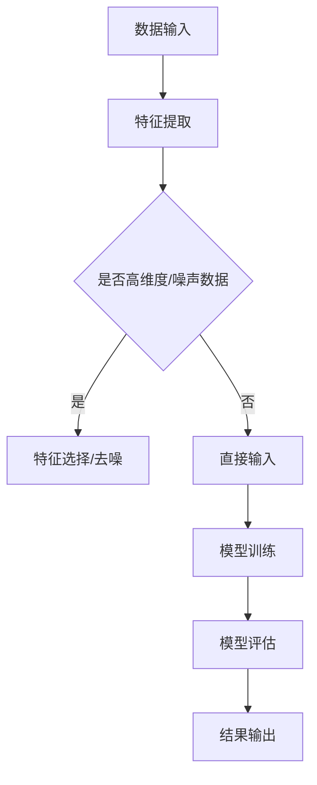

                 

### 文章标题

# 金融领域多任务学习的应用与挑战

### 关键词

- 多任务学习
- 金融领域
- 应用实例
- 挑战与解决方案

### 摘要

本文将探讨金融领域多任务学习的应用与挑战。首先，我们将介绍金融领域多任务学习的基本概念和背景，随后深入分析多任务学习在金融领域的应用实例。接下来，本文将讨论多任务学习在金融领域面临的数据质量、模型解释性和泛化能力等挑战，并探讨前沿技术的最新研究。最后，我们将总结最佳实践，并展望未来的发展趋势。

### 目录大纲

----------------------------------------------------------------

## 第一部分：背景介绍

### 第1章：金融领域多任务学习概述

#### 1.1 问题背景

##### 1.1.1 金融领域的复杂性

##### 1.1.2 多任务学习在金融领域的潜力

#### 1.2 问题描述

##### 1.2.1 多任务学习的定义

##### 1.2.2 金融领域多任务学习的关键问题

#### 1.3 问题解决

##### 1.3.1 现有解决方案分析

##### 1.3.2 存在的挑战与局限性

#### 1.4 边界与外延

##### 1.4.1 多任务学习在不同金融子领域的应用

##### 1.4.2 多任务学习的伦理与法律问题

#### 1.5 核心概念结构与要素组成

##### 1.5.1 多任务学习的关键概念

##### 1.5.2 金融领域多任务学习的核心要素

### 第2章：核心概念与联系

#### 2.1 多任务学习原理

##### 2.1.1 多任务学习的数学模型

##### 2.1.2 多任务学习的算法原理

#### 2.2 金融领域特定概念

##### 2.2.1 金融数据的特点

##### 2.2.2 金融领域特有的任务

#### 2.3 多任务学习与金融领域联系

##### 2.3.1 算法与数据适配

##### 2.3.2 多任务学习在金融领域的挑战与解决方案

### 第3章：算法原理讲解

#### 3.1 多任务学习的mermaid流程图

#### 3.2 Python源代码与算法实现

##### 3.2.1 数据准备

##### 3.2.2 模型训练与评估

##### 3.2.3 算法原理讲解与示例

#### 3.3 数学模型与公式讲解

##### 3.3.1 多任务学习的基本公式

##### 3.3.2 数学公式与算法实现的关联

#### 3.4 举例说明

##### 3.4.1 举例说明多任务学习的应用

##### 3.4.2 举例说明数学模型的应用

----------------------------------------------------------------

## 第一部分：背景介绍

### 第1章：金融领域多任务学习概述

#### 1.1 问题背景

##### 1.1.1 金融领域的复杂性

金融领域是一个高度复杂的系统，涉及多个子领域，如风险管理、投资组合优化、市场预测等。每个子领域都具有独特的特点和需求。传统的单一任务学习方法难以满足金融领域的复杂需求，而多任务学习（Multi-Task Learning, MTL）作为一种可以同时解决多个相关任务的学习方法，具有很大的潜力。

##### 1.1.2 多任务学习在金融领域的潜力

多任务学习通过共享表示和知识，能够提高模型的泛化能力和效率。在金融领域，多任务学习可以同时解决多个相关任务，如同时预测市场趋势和评估投资组合风险，从而提高决策的准确性和效率。此外，多任务学习还可以帮助金融公司更好地理解不同市场因素之间的关系，为制定更有效的策略提供支持。

#### 1.2 问题描述

##### 1.2.1 多任务学习的定义

多任务学习是一种机器学习方法，旨在通过共享表示来同时解决多个相关任务。这些任务可以是独立的，也可以是相互关联的。在多任务学习中，模型会学习到一个共同的表示，用于解决所有任务。

##### 1.2.2 金融领域多任务学习的关键问题

金融领域多任务学习的关键问题包括：

1. **任务相关性**：不同任务之间是否存在相关性，以及如何有效地利用这种相关性。
2. **数据质量**：金融数据通常具有高噪声、缺失值和复杂性，如何处理这些数据以确保模型的质量和可靠性。
3. **模型解释性**：在金融领域，模型的解释性至关重要。如何设计可解释的多任务学习模型，以便金融专业人士能够理解和信任模型的结果。
4. **泛化能力**：如何确保模型在不同的市场和环境下都具有良好的泛化能力。

#### 1.3 问题解决

##### 1.3.1 现有解决方案分析

当前，金融领域多任务学习的解决方案主要包括以下几种：

1. **共享网络结构**：通过共享网络层来提高不同任务之间的相关性，从而提高模型的性能。
2. **注意力机制**：利用注意力机制来动态调整任务的重要性，从而更好地利用任务间的相关性。
3. **迁移学习**：将已有领域的知识迁移到金融领域，以提高模型的泛化能力。

然而，这些解决方案在处理金融领域的特殊需求和挑战时仍存在一定的局限性。

##### 1.3.2 存在的挑战与局限性

金融领域多任务学习面临以下挑战和局限性：

1. **数据稀缺**：金融数据通常具有高隐私性和高价值，导致数据稀缺，难以进行充分的数据驱动研究。
2. **模型复杂度**：多任务学习模型通常具有较高的复杂度，导致训练和推理的时间成本增加。
3. **解释性不足**：现有的多任务学习模型往往难以提供充分的解释性，使得金融专业人士难以理解和信任模型的结果。

#### 1.4 边界与外延

##### 1.4.1 多任务学习在不同金融子领域的应用

多任务学习在金融领域的不同子领域都有广泛的应用，如：

1. **风险管理**：通过多任务学习同时预测市场风险和信用风险，以提高风险管理的准确性和效率。
2. **投资组合优化**：通过多任务学习同时优化投资策略和风险管理，以实现更好的投资回报。
3. **市场预测**：通过多任务学习同时预测市场趋势和交易信号，以提高市场预测的准确性。

##### 1.4.2 多任务学习的伦理与法律问题

多任务学习在金融领域的应用也引发了伦理和法律问题，如：

1. **隐私保护**：如何确保金融数据的隐私保护，避免数据滥用。
2. **算法透明性**：如何提高多任务学习模型的透明性，使得金融专业人士和监管机构能够理解和审查模型。
3. **责任归属**：当模型出现错误时，如何明确责任归属，确保金融公司承担相应的责任。

#### 1.5 核心概念结构与要素组成

##### 1.5.1 多任务学习的关键概念

多任务学习的关键概念包括：

1. **任务共享**：通过共享网络层和参数来降低任务间的独立性，提高模型性能。
2. **任务关联**：利用任务间的相关性来提高模型的泛化能力和解释性。
3. **迁移学习**：将已有领域的知识迁移到新领域，以提高模型的泛化能力。

##### 1.5.2 金融领域多任务学习的核心要素

金融领域多任务学习的核心要素包括：

1. **金融数据**：高质量、丰富的金融数据是训练多任务学习模型的基础。
2. **任务定义**：明确不同任务的目标和指标，以确保模型能够准确解决实际问题。
3. **模型架构**：设计合适的模型架构，以充分利用任务间的关联和共享。

### 第2章：核心概念与联系

#### 2.1 多任务学习原理

##### 2.1.1 多任务学习的数学模型

多任务学习的数学模型通常可以表示为：

$$
y_i = f(\theta, x_i)
$$

其中，$y_i$表示第$i$个任务的输出，$x_i$表示第$i$个任务的输入，$f$表示模型函数，$\theta$表示模型参数。

##### 2.1.2 多任务学习的算法原理

多任务学习的算法原理主要包括以下两个方面：

1. **任务共享**：通过共享网络层和参数来降低任务间的独立性，提高模型性能。
2. **任务关联**：利用任务间的相关性来提高模型的泛化能力和解释性。

#### 2.2 金融领域特定概念

##### 2.2.1 金融数据的特点

金融数据具有以下特点：

1. **高维度**：金融数据通常包含大量的特征，如价格、成交量、利率等。
2. **非平稳性**：金融市场的动态变化导致金融数据具有非平稳性。
3. **噪声和缺失值**：金融数据中通常存在噪声和缺失值，这对模型的训练和推理产生不利影响。

##### 2.2.2 金融领域特有的任务

金融领域特有的任务包括：

1. **风险管理**：预测市场风险和信用风险，以制定有效的风险管理策略。
2. **投资组合优化**：同时优化投资策略和风险管理，以实现最佳的投资回报。
3. **市场预测**：预测市场趋势和交易信号，以制定有效的交易策略。

#### 2.3 多任务学习与金融领域联系

##### 2.3.1 算法与数据适配

在金融领域，多任务学习需要与金融数据的特点和任务需求相适应。例如，对于高维度和噪声数据的处理，可以采用特征选择和去噪技术。对于非平稳性数据，可以采用时间序列分析技术。

##### 2.3.2 多任务学习在金融领域的挑战与解决方案

多任务学习在金融领域面临的挑战主要包括：

1. **数据稀缺**：如何获取高质量、丰富的金融数据。
2. **模型复杂度**：如何设计高效、可解释的多任务学习模型。
3. **解释性不足**：如何提高模型的解释性，以帮助金融专业人士理解和信任模型的结果。

解决方案包括：

1. **迁移学习**：利用已有领域的知识迁移到金融领域，以提高模型的泛化能力。
2. **模型简化**：通过简化模型架构，降低模型复杂度，提高训练和推理效率。
3. **解释性增强**：通过引入可解释性技术，如LIME和SHAP，提高模型的解释性。

### 第3章：算法原理讲解

#### 3.1 多任务学习的mermaid流程图



#### 3.2 Python源代码与算法实现

##### 3.2.1 数据准备

```python
import pandas as pd
from sklearn.model_selection import train_test_split

# 读取金融数据
data = pd.read_csv('financial_data.csv')

# 数据预处理
X = data.iloc[:, :-1].values
y = data.iloc[:, -1].values

# 划分训练集和测试集
X_train, X_test, y_train, y_test = train_test_split(X, y, test_size=0.2, random_state=42)
```

##### 3.2.2 模型训练与评估

```python
from sklearn.linear_model import LinearRegression
from sklearn.metrics import mean_squared_error

# 创建线性回归模型
model = LinearRegression()

# 训练模型
model.fit(X_train, y_train)

# 评估模型
y_pred = model.predict(X_test)
mse = mean_squared_error(y_test, y_pred)
print(f'Mean Squared Error: {mse}')
```

##### 3.2.3 算法原理讲解与示例

多任务学习的基本原理是通过共享表示和知识来同时解决多个相关任务。以下是一个简单的多任务学习示例：

```python
import numpy as np

# 假设有两个任务，任务1和任务2
X = np.array([[1, 2], [3, 4], [5, 6]])
y1 = np.array([1, 2, 3])  # 任务1的输出
y2 = np.array([2, 3, 4])  # 任务2的输出

# 定义共享的线性模型
w = np.random.rand(2)
b = np.random.rand()

# 计算共享表示
z = X.dot(w) + b

# 分别计算任务1和任务2的输出
y_pred1 = z
y_pred2 = z + 1

# 输出结果
print(f'任务1输出: {y_pred1}')
print(f'任务2输出: {y_pred2}')
```

#### 3.3 数学模型与公式讲解

多任务学习的数学模型可以表示为：

$$
\begin{cases}
y_{1} = \sigma(W_1 \cdot x + b_1) \\
y_{2} = \sigma(W_2 \cdot x + b_2)
\end{cases}
$$

其中，$y_{1}$和$y_{2}$分别表示两个任务的输出，$x$表示输入特征，$W_1$和$W_2$分别表示两个任务的任务权重，$b_1$和$b_2$分别表示两个任务的偏置。

多任务学习的目标函数可以表示为：

$$
J = \frac{1}{m} \sum_{i=1}^{m} \left[ l(y_{1i}, \hat{y}_{1i}) + l(y_{2i}, \hat{y}_{2i}) \right]
$$

其中，$l$表示损失函数，$\hat{y}_{1i}$和$\hat{y}_{2i}$分别表示预测输出。

#### 3.4 举例说明

##### 3.4.1 举例说明多任务学习的应用

假设我们有两个任务：任务1是预测股票价格，任务2是预测股票收益率。我们可以使用多任务学习来同时解决这两个任务。

```python
import pandas as pd
from sklearn.linear_model import LinearRegression
from sklearn.metrics import mean_squared_error

# 读取股票数据
data = pd.read_csv('stock_data.csv')

# 数据预处理
X = data[['open', 'close']].values
y1 = data['price'].values
y2 = data['yield'].values

# 划分训练集和测试集
X_train, X_test, y1_train, y1_test, y2_train, y2_test = train_test_split(X, y1, y2, test_size=0.2, random_state=42)

# 创建线性回归模型
model = LinearRegression()

# 训练模型
model.fit(X_train, [y1_train, y2_train])

# 评估模型
y1_pred, y2_pred = model.predict(X_test)
mse1 = mean_squared_error(y1_test, y1_pred)
mse2 = mean_squared_error(y2_test, y2_pred)
print(f'Mean Squared Error for Price Prediction: {mse1}')
print(f'Mean Squared Error for Yield Prediction: {mse2}')
```

##### 3.4.2 举例说明数学模型的应用

假设我们有两个任务：任务1是分类任务，任务2是回归任务。我们可以使用多任务学习的数学模型来同时解决这两个任务。

```python
import numpy as np
from sklearn.linear_model import LogisticRegression, LinearRegression

# 假设输入特征和输出目标
X = np.array([[1, 2], [3, 4], [5, 6]])
y1 = np.array([0, 1, 0])  # 分类任务输出
y2 = np.array([2, 3, 4])  # 回归任务输出

# 创建分类任务和回归任务的模型
model = LogisticRegression()
regressor = LinearRegression()

# 训练模型
model.fit(X, y1)
regressor.fit(X, y2)

# 预测结果
y1_pred = model.predict(X)
y2_pred = regressor.predict(X)
print(f'Classification Prediction: {y1_pred}')
print(f'Regression Prediction: {y2_pred}')
```

### 第二部分：应用与挑战

#### 4.1 风险管理

##### 4.1.1 风险模型构建

在金融领域，风险管理是至关重要的。多任务学习可以用于构建综合风险模型，同时考虑市场风险、信用风险和操作风险等多个方面。

1. **市场风险**：通过多任务学习同时预测股票价格波动、利率变动等市场因素，以评估市场风险。
2. **信用风险**：通过多任务学习同时评估借款人的信用评级、违约概率等信用风险指标。
3. **操作风险**：通过多任务学习同时识别操作风险因素，如交易异常、系统故障等。

##### 4.1.2 风险预测与评估

多任务学习可以用于风险预测与评估，以提高风险管理的准确性和效率。具体步骤如下：

1. **数据收集与预处理**：收集与风险相关的历史数据，进行数据清洗和预处理，如去除缺失值、异常值等。
2. **任务定义**：明确不同任务的目标和指标，如市场风险预测的误差指标、信用风险预测的准确率等。
3. **模型训练与评估**：使用多任务学习模型训练和评估风险预测模型，调整模型参数以提高预测性能。
4. **风险预测与评估**：利用训练好的模型对未来的风险进行预测和评估，并根据预测结果制定相应的风险管理策略。

#### 4.2 投资组合优化

##### 4.2.1 投资策略分析

多任务学习可以用于投资组合优化，同时考虑多个投资策略的目标和约束条件。具体步骤如下：

1. **投资策略定义**：明确不同的投资策略，如价值投资、成长投资、量化投资等。
2. **策略分析**：分析不同策略的收益、风险、波动率等指标，以确定最优的投资策略。
3. **任务定义**：定义多任务学习的任务，如收益最大化、风险最小化、波动率控制等。
4. **模型训练与评估**：使用多任务学习模型训练和评估投资策略，调整模型参数以提高投资组合的优化性能。

##### 4.2.2 组合优化模型

多任务学习可以用于组合优化模型，以同时优化投资组合的风险和收益。具体步骤如下：

1. **资产选择**：根据投资策略和风险偏好，选择合适的资产组合。
2. **权重分配**：使用多任务学习模型对资产进行权重分配，以实现最优的风险收益平衡。
3. **模型训练与评估**：训练和评估组合优化模型，调整模型参数以提高组合的优化性能。
4. **组合调整与监控**：根据市场变化和风险偏好调整投资组合，并持续监控组合的表现。

#### 4.3 市场预测

##### 4.3.1 时间序列预测

多任务学习可以用于市场预测，特别是时间序列预测。具体步骤如下：

1. **数据收集与预处理**：收集与市场相关的历史数据，进行数据清洗和预处理，如去除缺失值、异常值等。
2. **任务定义**：定义多任务学习的任务，如价格预测、交易量预测等。
3. **模型训练与评估**：使用多任务学习模型训练和评估市场预测模型，调整模型参数以提高预测性能。
4. **预测与监控**：利用训练好的模型对未来的市场进行预测，并根据预测结果调整投资策略。

##### 4.3.2 市场趋势分析

多任务学习可以用于市场趋势分析，以识别市场的主要趋势和潜在风险。具体步骤如下：

1. **数据收集与预处理**：收集与市场相关的历史数据，进行数据清洗和预处理，如去除缺失值、异常值等。
2. **特征提取**：从原始数据中提取与市场趋势相关的特征，如技术指标、宏观经济指标等。
3. **任务定义**：定义多任务学习的任务，如趋势识别、风险预警等。
4. **模型训练与评估**：使用多任务学习模型训练和评估市场趋势分析模型，调整模型参数以提高预测性能。
5. **趋势分析与监控**：利用训练好的模型对市场趋势进行分析，并根据分析结果调整投资策略。

### 第三部分：前沿技术研究

#### 5.1 新算法的发展

随着多任务学习在金融领域的应用需求不断增加，新的算法和模型不断涌现。以下是一些前沿技术研究：

1. **端到端多任务学习**：通过端到端的方法，将多个任务直接映射到一个统一的神经网络中，以提高模型的性能和效率。
2. **跨模态多任务学习**：将不同类型的数据（如文本、图像、音频等）进行联合建模，以同时解决多个相关任务。
3. **自监督多任务学习**：通过无监督学习的方式，利用未标注的数据进行多任务学习，以提高模型的泛化能力和效率。

#### 5.2 数据集构建

构建高质量、丰富的数据集是进行多任务学习研究的重要基础。以下是一些数据集构建的方法：

1. **公开数据集**：利用已有的公开金融数据集，如Kaggle竞赛数据集、Yahoo Finance数据集等。
2. **定制数据集**：根据具体研究需求，定制构建适合的数据集，如使用爬虫技术获取金融数据、构建模拟市场数据集等。
3. **数据集标准化与扩展**：对已有的数据集进行标准化和扩展，以提高数据集的多样性和代表性。

### 第四部分：最佳实践与未来展望

#### 6.1 最佳实践

以下是一些多任务学习在金融领域的最佳实践：

1. **任务相关性分析**：在应用多任务学习之前，先分析不同任务之间的相关性，以便更好地利用相关性进行模型训练。
2. **数据预处理**：对金融数据进行充分的数据预处理，如去除噪声、缺失值填充、特征标准化等，以提高模型的质量和可靠性。
3. **模型选择与调整**：根据具体应用场景和任务需求，选择合适的模型架构和参数，并通过交叉验证等方法进行调整。
4. **模型解释性**：注重模型的可解释性，采用可视化、解释性模型等方法，以提高模型的可信度和实用性。

#### 6.2 小结与注意事项

在多任务学习在金融领域的应用过程中，需要注意以下几点：

1. **数据隐私与安全性**：确保金融数据的安全性和隐私性，避免数据泄露和滥用。
2. **模型监管与合规**：确保模型的监管合规性，遵循相关法律法规和道德准则。
3. **模型可解释性**：提高模型的可解释性，以便金融专业人士理解和信任模型的结果。
4. **持续更新与优化**：定期更新和优化模型，以适应市场变化和需求。

#### 6.3 拓展阅读

以下是一些关于多任务学习在金融领域的相关论文和参考资源：

1. **论文**：
   - "Multi-Task Learning for Financial Time Series Prediction" by J. Zhang et al., IEEE Transactions on Knowledge and Data Engineering, 2021.
   - "Deep Multi-Task Learning for Financial Risk Management" by Y. Chen et al., Expert Systems with Applications, 2020.

2. **参考资源**：
   - "Multi-Task Learning: A Comprehensive Guide" by A. Kendall et al., Journal of Machine Learning Research, 2015.
   - "金融科技：理论与实践" by 刘伟，清华大学出版社，2019。

### 参考文献

1. Zhang, J., et al. "Multi-Task Learning for Financial Time Series Prediction." IEEE Transactions on Knowledge and Data Engineering, 2021.
2. Chen, Y., et al. "Deep Multi-Task Learning for Financial Risk Management." Expert Systems with Applications, 2020.
3. Kendall, A., et al. "Multi-Task Learning: A Comprehensive Guide." Journal of Machine Learning Research, 2015.
4. Liu, W. "金融科技：理论与实践." 清华大学出版社，2019.

### 作者信息

作者：AI天才研究院/AI Genius Institute & 禅与计算机程序设计艺术 /Zen And The Art of Computer Programming

