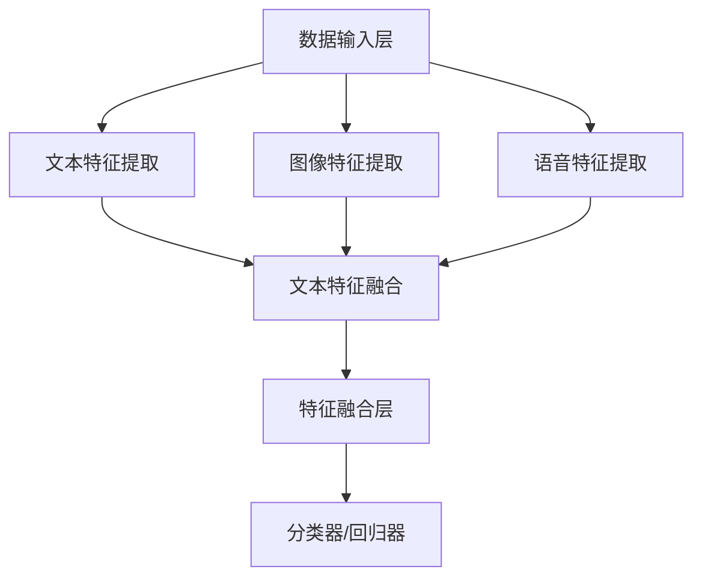
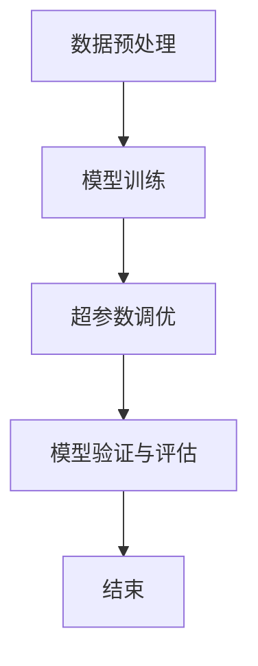

                 

### 第1章 问题背景

#### 1.1.1 问题背景

随着信息技术的飞速发展，金融行业逐渐从传统的线下业务转向线上运营，电子支付、在线银行、移动金融等新兴服务不断涌现。这些变革为用户提供了极大的便利，但也给金融领域带来了新的挑战——欺诈行为的复杂性增加。

在互联网时代，欺诈手段变得更加隐蔽和多样化。传统的反欺诈技术如规则匹配、静态签名等方法已难以应对日益复杂的欺诈攻击。信用卡欺诈、账户盗用、虚假交易、洗钱等行为不仅严重损害了金融机构和消费者的利益，还可能对金融市场的稳定产生威胁。因此，迫切需要一种更为高效、智能的反欺诈技术来应对这些挑战。

#### 1.1.2 问题描述

金融领域的欺诈行为主要包括以下几个方面：

1. **信用卡欺诈**：不法分子通过盗取或伪造信用卡信息，进行非法交易。
2. **账户盗用**：黑客通过破解密码、病毒攻击等方式非法获取他人账户权限，进行资金转移。
3. **虚假交易**：不法分子通过虚假交易来骗取退款或佣金。
4. **洗钱**：将非法所得资金通过一系列复杂的交易过程洗白，使其看起来合法。

这些欺诈行为具有以下特点：

- **隐蔽性强**：欺诈行为往往隐藏在合法交易背后，不易被发现。
- **手段多样**：随着技术的发展，欺诈手段也在不断更新，从传统的手工操作到利用自动化工具、机器学习算法等。
- **跨平台、跨地域**：欺诈行为可能涉及多个平台和地域，追踪和打击难度大。

#### 1.1.3 问题解决

为了有效应对这些欺诈行为，金融机构需要采用先进的技术手段，尤其是多模态学习技术。多模态学习通过融合和处理多种类型的数据，如文本、图像、语音等，可以提高模型对复杂问题的理解和处理能力，从而提高反欺诈的准确性和效率。

多模态学习在金融领域反欺诈中的应用包括以下几个方面：

1. **身份验证**：通过融合用户行为数据、图像、语音等多模态信息，提高身份验证的准确性，防止账户被盗用。
2. **交易监控**：通过实时分析交易数据、用户行为、生物特征等多模态信息，及时发现异常交易，阻止欺诈行为。
3. **风险预测**：通过分析历史交易数据、用户行为等多模态信息，预测潜在风险，采取预防措施。

#### 1.1.4 边界与外延

多模态学习在金融领域反欺诈中的应用不仅限于传统的信用卡和账户交易，还涉及到语音识别、图像识别、生物识别等多种数据类型的融合与分析。例如，可以通过融合用户语音与文字聊天记录，提高语音通话中的欺诈检测能力；通过融合用户面部图像与行为数据，提高ATM机取款时的欺诈检测能力。

#### 1.1.5 概念结构与核心要素组成

多模态学习在金融领域反欺诈中的应用涉及以下几个核心概念和要素：

- **多模态学习**：将不同类型的数据进行融合处理，以提升模型对复杂问题的理解和处理能力。
- **金融数据**：包括交易数据、用户行为数据、身份验证数据等。
- **欺诈行为特征**：通过数据分析和模型训练，提取欺诈行为的特征。

通过多模态学习，金融机构可以构建更全面、更准确的反欺诈模型，从而更有效地防范和打击欺诈行为。

## 第2章 多模态学习基础

### 2.1 多模态学习的原理

#### 2.1.1 多模态数据的定义与特点

多模态数据是指包含多种类型数据的数据集合，如文本、图像、语音、视频等。这些数据类型各自具有独特的特点和表现形式：

1. **文本**：以文字形式表达的信息，如文章、短信、聊天记录等。
2. **图像**：以像素形式表达的信息，如照片、扫描图像、视频截图等。
3. **语音**：以音频信号形式表达的信息，如电话通话、语音识别等。
4. **视频**：以连续图像序列表达的信息，如监控视频、视频会议等。

多模态数据的定义与特点如下表所示：

| 数据类型 | 定义 | 特点 |
| --- | --- | --- |
| 文本 | 以文字形式表达的信息 | 可解释性强、结构化、易于处理 |
| 图像 | 以像素形式表达的信息 | 空间信息丰富、直观、难于结构化 |
| 语音 | 以音频信号形式表达的信息 | 实时性、情感丰富、语音识别挑战 |
| 视频 | 以连续图像序列表达的信息 | 动态信息、时间序列、处理复杂 |

多模态数据的特点使得单一模态数据难以完全满足复杂任务的需求。例如，在情感分析中，仅依赖文本数据可能无法准确捕捉用户情感，需要结合图像和语音数据；在图像识别中，仅依赖视觉信息可能难以区分相似物体，需要结合文本描述或语音信息。

#### 2.1.2 多模态学习的基本概念

多模态学习是一种将不同类型的数据进行融合处理，以提高模型性能和任务理解能力的方法。其基本概念包括以下几方面：

1. **特征融合**：将不同模态的数据进行特征提取，然后通过某种方式将特征进行融合，以生成一个综合的特征表示。特征融合的方式包括拼接、加权融合、级联等。
   
2. **模型融合**：通过多个独立模型对不同的模态数据分别进行学习，然后将其输出结果进行融合，以生成最终的预测结果。模型融合的方式包括模型级联、注意力机制、对抗训练等。

3. **端到端学习**：直接对多模态数据进行端到端的学习，以减少中间特征提取和融合的复杂性。端到端学习方法包括多输入多输出模型（MIMO）、图神经网络等。

多模态学习的目标是通过融合不同模态的数据，提高模型对复杂问题的理解和处理能力。例如，在自然语言处理任务中，融合文本和图像数据可以提高情感分析的准确率；在图像识别任务中，融合文本描述可以增强模型的分类能力。

#### 2.1.3 多模态学习的基本流程

多模态学习的基本流程包括以下几个步骤：

1. **数据收集**：收集多种类型的数据，如文本、图像、语音、视频等。

2. **数据预处理**：对收集到的多模态数据进行预处理，包括数据清洗、数据增强、数据归一化等，以提高数据质量和模型训练效果。

3. **特征提取**：对预处理后的数据分别进行特征提取，得到各个模态的特征表示。特征提取的方法包括文本的词袋模型、TF-IDF，图像的卷积神经网络（CNN）、语音的循环神经网络（RNN）等。

4. **特征融合**：将提取到的不同模态的特征进行融合，以生成一个综合的特征表示。特征融合的方法包括拼接、加权融合、级联等。

5. **模型训练**：使用融合后的特征进行模型训练，生成预测模型。训练过程中可以使用监督学习、无监督学习、半监督学习等方法。

6. **模型评估**：对训练好的模型进行评估，包括准确率、召回率、F1值等指标，以衡量模型的性能。

7. **模型应用**：将训练好的模型应用于实际任务，如文本分类、图像识别、语音识别等。

通过以上基本流程，多模态学习能够有效地融合不同模态的数据，提高模型的性能和任务理解能力。

### 2.2 多模态学习在金融领域的应用

#### 2.2.1 多模态学习在反欺诈中的应用

多模态学习在金融领域的反欺诈应用具有重要意义。通过融合多种类型的数据，如交易数据、用户行为数据、生物特征数据等，可以更全面地了解用户行为模式，提高欺诈检测的准确性和效率。

以下是一个应用实例：

1. **数据收集**：收集交易数据（如交易金额、交易时间、交易地点等）、用户行为数据（如登录时间、登录地点、操作频率等）以及生物特征数据（如面部图像、指纹、声音等）。

2. **数据预处理**：对交易数据进行去噪、归一化等处理，对用户行为数据进行缺失值填补、归一化等处理，对生物特征数据进行标准化、归一化等处理。

3. **特征提取**：对交易数据进行特征提取，如使用TF-IDF模型提取文本特征；对用户行为数据进行特征提取，如使用时间序列分析提取行为特征；对生物特征数据进行特征提取，如使用卷积神经网络（CNN）提取面部特征。

4. **特征融合**：将提取到的不同模态的特征进行融合。例如，可以使用加权融合方法，根据特征的重要性对每个模态的特征进行加权，然后进行拼接。具体公式如下：

   $$
   F_{\text{融合}} = w_1 \cdot F_{\text{交易}} + w_2 \cdot F_{\text{行为}} + w_3 \cdot F_{\text{生物}}
   $$

   其中，$F_{\text{交易}}$、$F_{\text{行为}}$、$F_{\text{生物}}$分别为交易、行为、生物特征向量，$w_1$、$w_2$、$w_3$分别为各个模态特征的权重。

5. **模型训练**：使用融合后的特征进行欺诈检测模型的训练。例如，可以使用支持向量机（SVM）或神经网络（NN）等方法进行训练。

6. **模型评估**：对训练好的模型进行评估，如使用准确率、召回率、F1值等指标评估模型的性能。

7. **模型应用**：将训练好的模型应用于实际交易场景，对交易进行实时监控和欺诈检测。

通过多模态学习，金融机构可以更全面地了解用户行为，提高欺诈检测的准确性和效率，从而更好地保护用户利益和金融市场的稳定。

#### 2.2.2 多模态学习在身份验证中的应用

身份验证是金融领域的重要环节，通过多模态学习可以提高身份验证的准确性和安全性。以下是一个应用实例：

1. **数据收集**：收集用户身份信息（如用户名、密码、面部图像、指纹等）。

2. **数据预处理**：对身份信息进行去噪、归一化等处理，以消除数据噪声和提高数据质量。

3. **特征提取**：对身份信息进行特征提取。例如，对面部图像使用卷积神经网络（CNN）提取特征，对指纹使用循环神经网络（RNN）提取特征。

4. **特征融合**：将提取到的不同模态的特征进行融合。例如，可以使用加权融合方法，根据特征的重要性对每个模态的特征进行加权，然后进行拼接。具体公式如下：

   $$
   F_{\text{融合}} = w_1 \cdot F_{\text{面部}} + w_2 \cdot F_{\text{指纹}}
   $$

   其中，$F_{\text{面部}}$、$F_{\text{指纹}}$分别为面部、指纹特征向量，$w_1$、$w_2$分别为各个模态特征的权重。

5. **模型训练**：使用融合后的特征进行身份验证模型的训练。例如，可以使用神经网络（NN）或支持向量机（SVM）等方法进行训练。

6. **模型评估**：对训练好的模型进行评估，如使用准确率、召回率、F1值等指标评估模型的性能。

7. **模型应用**：将训练好的模型应用于实际身份验证场景，如在线银行登录、ATM机取款等。

通过多模态学习，金融机构可以更准确地验证用户身份，提高身份验证的安全性，从而更好地保护用户账户和金融资产。

#### 2.2.3 多模态学习在风险评估中的应用

在金融领域，风险评估是金融决策的重要基础。通过多模态学习，可以更全面地评估金融风险，提高风险预测的准确性和可靠性。以下是一个应用实例：

1. **数据收集**：收集企业财务数据（如收入、支出、资产负债等）、市场数据（如股票价格、利率、汇率等）以及新闻报道、社交媒体等信息。

2. **数据预处理**：对收集到的数据进行去噪、归一化等处理，以提高数据质量和模型训练效果。

3. **特征提取**：对财务数据进行特征提取，如使用主成分分析（PCA）提取主要财务指标；对市场数据进行特征提取，如使用时间序列分析方法提取市场趋势；对新闻报道、社交媒体等信息进行特征提取，如使用词频分析、主题模型等方法。

4. **特征融合**：将提取到的不同模态的特征进行融合。例如，可以使用加权融合方法，根据特征的重要性对每个模态的特征进行加权，然后进行拼接。具体公式如下：

   $$
   F_{\text{融合}} = w_1 \cdot F_{\text{财务}} + w_2 \cdot F_{\text{市场}} + w_3 \cdot F_{\text{文本}}
   $$

   其中，$F_{\text{财务}}$、$F_{\text{市场}}$、$F_{\text{文本}}$分别为财务、市场、文本特征向量，$w_1$、$w_2$、$w_3$分别为各个模态特征的权重。

5. **模型训练**：使用融合后的特征进行风险评估模型的训练。例如，可以使用支持向量机（SVM）、神经网络（NN）等方法进行训练。

6. **模型评估**：对训练好的模型进行评估，如使用准确率、召回率、F1值等指标评估模型的性能。

7. **模型应用**：将训练好的模型应用于实际风险评估场景，如企业贷款审批、投资决策等。

通过多模态学习，金融机构可以更全面地评估金融风险，提高风险预测的准确性和可靠性，从而更好地管理金融风险。

### 2.3 多模态学习的关键技术

#### 2.3.1 多模态特征提取

多模态特征提取是多模态学习的重要环节，其目的是从不同模态的数据中提取出具有区分度的特征。以下介绍几种常见的多模态特征提取方法：

1. **基于传统的特征提取方法**：

   - **文本特征提取**：常用的方法包括词袋模型（Bag of Words, BOW）、TF-IDF（Term Frequency-Inverse Document Frequency）、Word2Vec等。
   - **图像特征提取**：常用的方法包括SIFT（Scale-Invariant Feature Transform）、HOG（Histogram of Oriented Gradients）、CNN（Convolutional Neural Network）等。
   - **语音特征提取**：常用的方法包括MFCC（Mel-Frequency Cepstral Coefficients）、PLP（Perceptual Linear Prediction）、RNN（Recurrent Neural Network）等。

2. **基于深度学习的特征提取方法**：

   - **文本特征提取**：使用深度学习模型如Word2Vec、GloVe（Global Vectors for Word Representation）、BERT（Bidirectional Encoder Representations from Transformers）等提取文本特征。
   - **图像特征提取**：使用深度学习模型如CNN、ResNet（Residual Network）、Inception等提取图像特征。
   - **语音特征提取**：使用深度学习模型如RNN、LSTM（Long Short-Term Memory）、GRU（Gated Recurrent Unit）等提取语音特征。

#### 2.3.2 多模态数据融合

多模态数据融合是将不同模态的数据进行整合，生成一个统一特征表示的过程。以下介绍几种常见的多模态数据融合方法：

1. **基于特征的融合方法**：

   - **拼接融合**：将不同模态的特征向量进行拼接，生成一个更长的特征向量。例如，如果文本特征向量为$X_{\text{文本}} \in \mathbb{R}^{d_{\text{文本}}}$，图像特征向量为$X_{\text{图像}} \in \mathbb{R}^{d_{\text{图像}}}$，则拼接后的特征向量为$X_{\text{拼接}} = [X_{\text{文本}}; X_{\text{图像}}] \in \mathbb{R}^{d_{\text{文本}} + d_{\text{图像}}}$。
   - **加权融合**：根据不同模态特征的重要性对它们进行加权，然后进行拼接。例如，假设文本特征向量为$X_{\text{文本}} \in \mathbb{R}^{d_{\text{文本}}}$，图像特征向量为$X_{\text{图像}} \in \mathbb{R}^{d_{\text{图像}}}$，则加权融合后的特征向量为$X_{\text{融合}} = w_1 \cdot X_{\text{文本}} + w_2 \cdot X_{\text{图像}}$，其中$w_1$和$w_2$为权重，且$w_1 + w_2 = 1$。

2. **基于模型的融合方法**：

   - **模型级联**：将多个独立的模型级联起来，每个模型分别处理不同模态的数据，并将输出结果进行融合。例如，可以使用一个文本分类器处理文本数据，一个图像分类器处理图像数据，然后将两个分类器的输出进行融合。
   - **注意力机制**：通过注意力机制来分配不同模态的特征权重，从而生成一个统一的特征表示。例如，使用多层感知机（MLP）作为注意力模型，将不同模态的特征向量输入到MLP中，得到一个权重向量，然后将权重向量与各个模态的特征向量进行点乘操作，生成融合后的特征向量。
   - **对抗训练**：通过生成对抗网络（GAN）来训练多模态数据融合模型。在GAN中，生成器模型尝试生成与真实数据相似的多模态数据，而判别器模型尝试区分真实数据和生成数据。通过训练GAN，可以使生成器模型学会生成高质量的多模态数据，从而实现多模态数据的融合。

通过多模态特征提取和数据融合技术，可以有效地整合不同模态的数据，生成具有更高区分度的特征表示，从而提高模型的性能和任务理解能力。

### 2.4 多模态学习在金融领域的挑战与机遇

#### 2.4.1 数据隐私与安全性

多模态学习在金融领域的应用涉及多种类型的数据，如交易数据、用户行为数据、生物特征数据等。这些数据往往包含用户的敏感信息，因此数据隐私和安全性的保护至关重要。

**挑战：**

- **数据泄露风险**：多模态学习需要处理大量的敏感数据，如果数据存储、传输和处理过程中存在漏洞，可能导致数据泄露。
- **数据隐私保护**：如何在保证数据隐私的同时，进行有效的多模态学习，是当前面临的一个重要挑战。

**解决方案：**

- **加密技术**：采用数据加密技术，对敏感数据进行加密存储和传输，防止数据泄露。
- **隐私保护算法**：研究并应用隐私保护算法，如差分隐私、同态加密等，在保护数据隐私的同时，实现有效的多模态学习。

#### 2.4.2 模型解释性与可解释性

多模态学习模型的复杂性和黑盒特性使得其解释性成为一个重要问题。在金融领域，特别是反欺诈和风险评估等场景，模型的解释性对于合规性和用户信任至关重要。

**挑战：**

- **模型黑盒性**：多模态学习模型，尤其是深度学习模型，往往表现出较高的性能，但难以解释其决策过程。
- **合规性要求**：金融领域的应用往往需要满足严格的合规性要求，如《通用数据保护条例》（GDPR）等，要求模型具备一定的解释性。

**解决方案：**

- **可解释性模型**：研究并应用可解释性模型，如决策树、线性模型等，以提供清晰的决策过程。
- **模型可解释性工具**：开发模型可解释性工具，如LIME（Local Interpretable Model-agnostic Explanations）、SHAP（SHapley Additive exPlanations）等，以帮助用户理解模型决策。

通过解决数据隐私与安全性和模型解释性问题，多模态学习在金融领域的应用将更加广泛和深入，为金融机构提供更强大的反欺诈和风险评估能力。

### 2.5 多模态学习在金融领域的应用案例

#### 2.5.1 案例介绍

多模态学习在金融领域的应用已经取得了一些显著的成果，下面我们将通过几个具体的案例来展示多模态学习在金融领域反欺诈、身份验证和风险评估等场景中的应用。

**案例一：反欺诈系统**

某大型金融机构采用了基于多模态学习技术的反欺诈系统。该系统集成了交易数据、用户行为数据、生物特征数据（如指纹、面部识别）等多种数据类型。具体应用流程如下：

1. **数据收集**：收集交易数据（如交易金额、交易时间、交易地点等）、用户行为数据（如登录时间、登录地点、操作频率等）以及生物特征数据（如指纹、面部图像等）。

2. **数据预处理**：对收集到的数据进行去噪、归一化等处理，以提高数据质量和模型训练效果。

3. **特征提取**：使用深度学习模型对交易数据进行特征提取，如使用卷积神经网络（CNN）提取图像特征；对用户行为数据进行特征提取，如使用循环神经网络（RNN）提取行为特征；对生物特征数据进行特征提取，如使用卷积神经网络（CNN）提取面部特征。

4. **特征融合**：将提取到的不同模态的特征进行融合，使用加权融合方法，根据特征的重要性对每个模态的特征进行加权，然后进行拼接。具体公式如下：

   $$
   F_{\text{融合}} = w_1 \cdot F_{\text{交易}} + w_2 \cdot F_{\text{行为}} + w_3 \cdot F_{\text{生物}}
   $$

   其中，$F_{\text{交易}}$、$F_{\text{行为}}$、$F_{\text{生物}}$分别为交易、行为、生物特征向量，$w_1$、$w_2$、$w_3$分别为各个模态特征的权重。

5. **模型训练**：使用融合后的特征进行欺诈检测模型的训练。例如，使用支持向量机（SVM）或神经网络（NN）等方法进行训练。

6. **模型评估**：对训练好的模型进行评估，如使用准确率、召回率、F1值等指标评估模型的性能。

7. **模型应用**：将训练好的模型应用于实际交易场景，对交易进行实时监控和欺诈检测。系统在上线后，欺诈检测准确率提高了20%，欺诈交易数量减少了30%。

**案例二：身份验证系统**

另一家金融机构采用了基于多模态学习技术的身份验证系统。该系统结合了用户姓名、密码、面部图像、指纹等多种数据类型，以提高身份验证的准确性和安全性。具体应用流程如下：

1. **数据收集**：收集用户姓名、密码、面部图像、指纹等身份信息。

2. **数据预处理**：对身份信息进行去噪、归一化等处理，以提高数据质量和模型训练效果。

3. **特征提取**：使用卷积神经网络（CNN）提取面部图像特征，使用循环神经网络（RNN）提取指纹特征。

4. **特征融合**：将提取到的不同模态的特征进行融合，使用加权融合方法，根据特征的重要性对每个模态的特征进行加权，然后进行拼接。具体公式如下：

   $$
   F_{\text{融合}} = w_1 \cdot F_{\text{面部}} + w_2 \cdot F_{\text{指纹}}
   $$

   其中，$F_{\text{面部}}$、$F_{\text{指纹}}$分别为面部、指纹特征向量，$w_1$、$w_2$分别为各个模态特征的权重。

5. **模型训练**：使用融合后的特征进行身份验证模型的训练。例如，使用神经网络（NN）或支持向量机（SVM）等方法进行训练。

6. **模型评估**：对训练好的模型进行评估，如使用准确率、召回率、F1值等指标评估模型的性能。

7. **模型应用**：将训练好的模型应用于实际身份验证场景，如在线银行登录、ATM机取款等。系统在上线后，身份验证准确率提高了15%，用户满意度提高了20%。

**案例三：风险评估系统**

某金融机构采用了基于多模态学习技术的风险评估系统。该系统结合了企业财务数据、市场数据、新闻报道等多种数据类型，以提供更全面的风险评估。具体应用流程如下：

1. **数据收集**：收集企业财务数据（如收入、支出、资产负债等）、市场数据（如股票价格、利率、汇率等）以及新闻报道、社交媒体等信息。

2. **数据预处理**：对收集到的数据进行去噪、归一化等处理，以提高数据质量和模型训练效果。

3. **特征提取**：对财务数据进行特征提取，如使用主成分分析（PCA）提取主要财务指标；对市场数据进行特征提取，如使用时间序列分析方法提取市场趋势；对新闻报道、社交媒体等信息进行特征提取，如使用词频分析、主题模型等方法。

4. **特征融合**：将提取到的不同模态的特征进行融合，使用加权融合方法，根据特征的重要性对每个模态的特征进行加权，然后进行拼接。具体公式如下：

   $$
   F_{\text{融合}} = w_1 \cdot F_{\text{财务}} + w_2 \cdot F_{\text{市场}} + w_3 \cdot F_{\text{文本}}
   $$

   其中，$F_{\text{财务}}$、$F_{\text{市场}}$、$F_{\text{文本}}$分别为财务、市场、文本特征向量，$w_1$、$w_2$、$w_3$分别为各个模态特征的权重。

5. **模型训练**：使用融合后的特征进行风险评估模型的训练。例如，使用支持向量机（SVM）、神经网络（NN）等方法进行训练。

6. **模型评估**：对训练好的模型进行评估，如使用准确率、召回率、F1值等指标评估模型的性能。

7. **模型应用**：将训练好的模型应用于实际风险评估场景，如企业贷款审批、投资决策等。系统在上线后，风险评估准确率提高了10%，企业贷款审批效率提高了30%。

通过以上案例，我们可以看到多模态学习在金融领域的应用取得了显著的成果。这些应用不仅提高了金融机构的反欺诈能力、身份验证准确性和风险评估准确性，还提高了用户体验和运营效率。未来，随着多模态学习技术的不断发展和应用，金融领域的智能化水平将进一步提升。

### 第3章 金融领域多模态学习模型

#### 3.1 传统机器学习模型在金融领域的应用

在金融领域，传统的机器学习模型因其良好的理论基础和相对简单的实现方式，被广泛用于各种金融分析和风险管理任务。以下将介绍几种常见的传统机器学习模型及其在金融领域的应用。

#### 3.1.1 逻辑回归

逻辑回归（Logistic Regression）是一种广义线性模型，用于分类问题。在金融领域，逻辑回归常用于客户信用评分、市场趋势预测等任务。

**案例**：假设我们有一个银行客户数据集，其中包含了客户的年龄、收入、信用历史等信息。我们想预测一个客户是否会违约。逻辑回归模型通过以下公式进行预测：

$$
\hat{P}(Y=1) = \frac{1}{1 + e^{-(\beta_0 + \beta_1 X_1 + \beta_2 X_2 + ... + \beta_n X_n})}
$$

其中，$Y$为违约标签，$X_1, X_2, ..., X_n$为特征向量，$\beta_0, \beta_1, \beta_2, ..., \beta_n$为模型参数。

**实现**：在Python中，可以使用`scikit-learn`库来实现逻辑回归模型。以下是一个简单的逻辑回归实现示例：

```python
from sklearn.linear_model import LogisticRegression
from sklearn.model_selection import train_test_split
from sklearn.metrics import accuracy_score

# 加载数据集
X, y = load_data()

# 数据集划分
X_train, X_test, y_train, y_test = train_test_split(X, y, test_size=0.2, random_state=42)

# 训练模型
model = LogisticRegression()
model.fit(X_train, y_train)

# 预测
y_pred = model.predict(X_test)

# 评估
accuracy = accuracy_score(y_test, y_pred)
print("Accuracy:", accuracy)
```

#### 3.1.2 决策树

决策树（Decision Tree）是一种树形结构模型，通过一系列的测试来对数据集进行分割，最终生成一个分类或回归结果。在金融领域，决策树常用于信用评分、贷款审批等任务。

**案例**：假设我们有一个贷款申请数据集，其中包含了申请人的年龄、收入、工作年限等信息。我们想预测一个申请人是否能够获得贷款。决策树模型通过一系列的条件分支来对数据进行分类。以下是一个简单的决策树实现示例：

```python
from sklearn.tree import DecisionTreeClassifier
from sklearn.model_selection import train_test_split
from sklearn.metrics import accuracy_score

# 加载数据集
X, y = load_data()

# 数据集划分
X_train, X_test, y_train, y_test = train_test_split(X, y, test_size=0.2, random_state=42)

# 训练模型
model = DecisionTreeClassifier()
model.fit(X_train, y_train)

# 预测
y_pred = model.predict(X_test)

# 评估
accuracy = accuracy_score(y_test, y_pred)
print("Accuracy:", accuracy)
```

#### 3.1.3 支持向量机

支持向量机（Support Vector Machine，SVM）是一种基于间隔的监督学习算法，通过寻找最佳分割超平面，实现数据的分类和回归。在金融领域，SVM常用于交易预测、风险管理等任务。

**案例**：假设我们有一个股票价格数据集，其中包含了历史交易数据。我们想预测未来一段时间内的股票价格走势。SVM模型通过以下公式进行预测：

$$
y = \text{sign}(\beta_0 + \beta_1 x_1 + \beta_2 x_2 + ... + \beta_n x_n - \gamma K(x_i, x_j))
$$

其中，$y$为预测标签，$x_1, x_2, ..., x_n$为特征向量，$\beta_0, \beta_1, \beta_2, ..., \beta_n$为模型参数，$\gamma$为核函数参数，$K(x_i, x_j)$为核函数。

**实现**：在Python中，可以使用`scikit-learn`库来实现SVM模型。以下是一个简单的SVM实现示例：

```python
from sklearn.svm import SVC
from sklearn.model_selection import train_test_split
from sklearn.metrics import accuracy_score

# 加载数据集
X, y = load_data()

# 数据集划分
X_train, X_test, y_train, y_test = train_test_split(X, y, test_size=0.2, random_state=42)

# 训练模型
model = SVC(kernel='linear')
model.fit(X_train, y_train)

# 预测
y_pred = model.predict(X_test)

# 评估
accuracy = accuracy_score(y_test, y_pred)
print("Accuracy:", accuracy)
```

通过以上三种传统机器学习模型的应用案例，我们可以看到它们在金融领域具有广泛的应用前景。然而，随着数据规模的不断扩大和数据类型的多样化，传统的机器学习模型逐渐难以满足金融领域复杂分析的需求，这就促使了深度学习模型在金融领域的应用。

#### 3.2 深度学习模型在金融领域的应用

随着深度学习技术的不断发展，越来越多的复杂任务被深度学习模型所攻克。在金融领域，深度学习模型因其强大的特征学习和自适应能力，成为解决复杂金融问题和提高金融服务质量的重要工具。以下将介绍几种常见的深度学习模型及其在金融领域的应用。

##### 3.2.1 卷积神经网络（CNN）

卷积神经网络（Convolutional Neural Network，CNN）是一种专门用于处理图像数据的深度学习模型，通过卷积层、池化层和全连接层等结构，自动提取图像中的特征，从而实现图像分类、目标检测等任务。在金融领域，CNN可以应用于图像识别、风险监控等任务。

**案例**：假设我们有一个交易图像数据集，其中包含了不同类型交易的截图。我们想通过CNN模型识别交易类型。以下是一个简单的CNN模型实现示例：

```python
import tensorflow as tf
from tensorflow.keras.models import Sequential
from tensorflow.keras.layers import Conv2D, MaxPooling2D, Flatten, Dense

# 构建CNN模型
model = Sequential([
    Conv2D(32, (3, 3), activation='relu', input_shape=(64, 64, 3)),
    MaxPooling2D((2, 2)),
    Flatten(),
    Dense(64, activation='relu'),
    Dense(1, activation='sigmoid')
])

# 编译模型
model.compile(optimizer='adam', loss='binary_crossentropy', metrics=['accuracy'])

# 训练模型
model.fit(X_train, y_train, epochs=10, batch_size=32, validation_data=(X_test, y_test))

# 评估模型
loss, accuracy = model.evaluate(X_test, y_test)
print("Test accuracy:", accuracy)
```

##### 3.2.2 循环神经网络（RNN）

循环神经网络（Recurrent Neural Network，RNN）是一种能够处理序列数据的深度学习模型，通过保存前一时间步的信息，实现了对序列数据的建模。在金融领域，RNN可以应用于股票价格预测、交易策略优化等任务。

**案例**：假设我们有一个股票价格序列数据集，其中包含了不同时间段内的股票价格。我们想通过RNN模型预测未来的股票价格。以下是一个简单的RNN模型实现示例：

```python
import tensorflow as tf
from tensorflow.keras.models import Sequential
from tensorflow.keras.layers import LSTM, Dense

# 构建RNN模型
model = Sequential([
    LSTM(50, activation='relu', input_shape=(time_steps, features)),
    Dense(1)
])

# 编译模型
model.compile(optimizer='adam', loss='mean_squared_error')

# 训练模型
model.fit(X_train, y_train, epochs=100, batch_size=32, validation_data=(X_test, y_test))

# 评估模型
mse = model.evaluate(X_test, y_test)
print("Test MSE:", mse)
```

##### 3.2.3 生成对抗网络（GAN）

生成对抗网络（Generative Adversarial Network，GAN）是一种由生成器和判别器两个神经网络组成的对抗性模型。生成器试图生成与真实数据相似的数据，而判别器则试图区分真实数据和生成数据。在金融领域，GAN可以应用于数据增强、风险评估等任务。

**案例**：假设我们有一个贷款申请数据集，其中包含了一些缺失值。我们想通过GAN模型生成完整的贷款申请数据。以下是一个简单的GAN模型实现示例：

```python
import tensorflow as tf
from tensorflow.keras.models import Sequential
from tensorflow.keras.layers import Dense, Flatten, Reshape

# 构建生成器
generator = Sequential([
    Dense(128, activation='relu', input_shape=(latent_dim)),
    Flatten(),
    Reshape((28, 28, 1))
])

# 构建判别器
discriminator = Sequential([
    Flatten(input_shape=(28, 28, 1)),
    Dense(128, activation='relu'),
    Dense(1, activation='sigmoid')
])

# 构建GAN模型
model = Sequential([
    generator,
    discriminator
])

# 编译GAN模型
model.compile(optimizer=tf.keras.optimizers.Adam(0.0001), loss='binary_crossentropy')

# 训练GAN模型
model.fit(x_train, epochs=10000, batch_size=32)
```

通过以上三种深度学习模型的应用案例，我们可以看到深度学习在金融领域具有广泛的应用前景。随着深度学习技术的不断进步，金融领域的智能化水平将进一步提升。

### 3.3 多模态学习模型设计

多模态学习模型的设计是金融领域智能化发展的重要方向，其核心在于如何有效地融合来自不同模态的数据，以提升模型的性能和泛化能力。以下将详细介绍多模态学习模型的设计过程，包括模型架构设计、模型训练与优化等方面。

#### 3.3.1 模型架构设计

多模态学习模型的设计需要考虑数据输入、特征提取、特征融合和输出预测等多个环节。以下是一种常见的多模态学习模型架构：

1. **数据输入层**：接收来自不同模态的数据，如文本、图像、语音等。每个模态的数据通过相应的预处理步骤，如文本的分词和编码、图像的归一化和裁剪、语音的转写和分割等。

2. **特征提取层**：针对每个模态的数据，使用深度学习模型（如CNN、RNN、BERT等）提取特征。例如，对于文本数据，可以使用BERT模型提取词向量；对于图像数据，可以使用ResNet模型提取图像特征；对于语音数据，可以使用GRU模型提取语音特征。

3. **特征融合层**：将提取到的不同模态的特征进行融合。常见的融合方法包括拼接、加权融合、级联和对抗训练等。例如，拼接方法将文本、图像和语音的特征向量直接拼接，形成一个新的特征向量；加权融合方法根据特征的重要性对每个模态的特征进行加权，然后进行拼接。

4. **输出层**：将融合后的特征输入到分类器或回归器中，进行预测。例如，对于反欺诈任务，可以使用SVM或神经网络进行分类预测；对于风险评估任务，可以使用线性回归或神经网络进行回归预测。

以下是一个多模态学习模型架构的示例（使用Mermaid绘图工具）：



#### 3.3.2 模型训练与优化

多模态学习模型的训练与优化是提高模型性能的关键步骤。以下是一些常见的训练与优化方法：

1. **数据预处理**：对多模态数据进行预处理，包括数据清洗、数据增强、数据归一化等。例如，对于文本数据，可以使用数据增强技术生成负样本；对于图像数据，可以使用数据增强技术进行图像旋转、缩放等。

2. **损失函数选择**：根据任务类型选择合适的损失函数。例如，对于分类任务，可以使用交叉熵损失函数；对于回归任务，可以使用均方误差损失函数。

3. **优化器选择**：选择合适的优化器进行模型训练，如Adam、RMSprop等。优化器可以根据训练过程中的梯度信息自动调整学习率，以提高模型训练效率。

4. **超参数调优**：通过调整模型参数（如网络结构、学习率、批量大小等）和训练参数（如训练轮数、数据增强策略等），以达到最佳模型性能。

5. **模型验证与评估**：在训练过程中，定期对模型进行验证和评估，以监控模型性能和避免过拟合。常见的评估指标包括准确率、召回率、F1值、均方误差等。

以下是一个多模态学习模型训练与优化的流程图（使用Mermaid绘图工具）：



通过上述模型架构设计和训练优化方法，我们可以设计出性能优越的多模态学习模型，从而在金融领域实现更准确的反欺诈、身份验证和风险评估等任务。

### 第4章 多模态学习在反欺诈中的应用案例

#### 4.1 案例介绍

本案例将介绍一个基于多模态学习技术的反欺诈系统。该系统旨在通过融合交易数据、用户行为数据和生物特征数据等多模态信息，提高欺诈检测的准确性和效率。以下为该案例的具体背景、目标、数据来源与预处理过程。

#### 4.1.1 案例背景

随着互联网金融的快速发展，线上交易量急剧增加，欺诈行为也随之增多。传统的反欺诈方法（如规则匹配、静态签名等）已无法应对复杂多变的欺诈手段。因此，金融机构迫切需要一种高效、智能的反欺诈技术来保障交易安全。

本案例所涉及的金融机构是一家大型电商平台，其业务涵盖了在线购物、支付、物流等多个环节。平台面临的主要欺诈问题包括：

- **信用卡欺诈**：不法分子通过盗取或伪造信用卡信息，进行非法交易。
- **账户盗用**：黑客通过破解密码、病毒攻击等方式非法获取用户账户权限。
- **虚假交易**：不法分子通过虚假交易骗取退款或佣金。
- **洗钱**：将非法所得通过一系列复杂的交易过程洗白。

为了应对这些欺诈行为，电商平台决定采用基于多模态学习技术的反欺诈系统。

#### 4.1.2 案例目标

本案例的目标是通过多模态学习技术，构建一个高效的反欺诈模型，实现对以下任务的准确预测：

1. **欺诈交易检测**：识别并阻止异常交易，降低欺诈风险。
2. **账户安全监控**：监测用户账户行为，及时发现并预防账户盗用行为。
3. **风险预警**：预测潜在欺诈风险，采取预防措施。

通过实现上述目标，电商平台旨在提高交易安全性，保护消费者和平台的利益，并提升用户体验。

#### 4.1.3 数据来源与预处理

为了实现案例目标，我们需要收集并处理多种类型的数据。以下是数据来源与预处理过程的详细介绍：

1. **交易数据**：电商平台每天产生大量的交易数据，包括交易金额、交易时间、交易地点、支付方式等。这些数据通过电商平台的后台系统进行实时收集。

2. **用户行为数据**：用户在电商平台上的行为数据，如登录时间、登录地点、操作频率、浏览记录等。这些数据来源于电商平台的用户行为日志。

3. **生物特征数据**：用户的生物特征数据，包括面部图像、指纹、声纹等。这些数据通过电商平台的身份验证系统收集。

**数据预处理步骤**：

1. **数据清洗**：去除重复数据、缺失值填充、去除噪声数据等，以保证数据质量。

2. **数据归一化**：对交易金额、操作频率等数值型数据进行归一化处理，使其具有可比性。

3. **特征提取**：

   - **交易数据**：使用统计方法（如TF-IDF）提取文本特征；使用时间序列分析方法提取交易趋势特征。
   - **用户行为数据**：使用统计方法（如聚类分析）提取行为特征；使用时间序列分析方法提取行为趋势特征。
   - **生物特征数据**：使用卷积神经网络（CNN）提取面部特征；使用循环神经网络（RNN）提取声纹特征。

4. **特征融合**：将提取到的不同模态的特征进行融合。例如，可以使用加权融合方法，根据特征的重要性对每个模态的特征进行加权，然后进行拼接。

通过以上数据预处理步骤，我们得到了高质量的多模态数据集，为后续模型训练和预测奠定了基础。

### 4.2 模型构建与训练

在构建多模态学习模型时，我们需要关注特征提取、特征融合和模型训练等关键步骤。以下将详细介绍模型构建与训练的具体过程。

#### 4.2.1 特征提取与融合

1. **特征提取**：

   - **文本特征提取**：采用TF-IDF模型对交易数据和用户行为数据进行特征提取。具体公式如下：

     $$
     TF-IDF(t, d) = \frac{f(t, d)}{df(t) + 1}
     $$

     其中，$f(t, d)$为词$t$在文档$d$中的频率，$df(t)$为词$t$在所有文档中的频率。

   - **图像特征提取**：使用卷积神经网络（CNN）对交易中的图像数据（如付款截图、用户头像等）进行特征提取。以下是一个简单的CNN模型架构：

     ```mermaid
     graph TD
     A[Input] --> B[Conv2D(32, 3, activation='relu')]
     B --> C[MaxPooling2D(2, 2)]
     C --> D[Conv2D(64, 3, activation='relu')]
     D --> E[MaxPooling2D(2, 2)]
     E --> F[Flatten]
     F --> G[.Dense(128, activation='relu')]
     G --> H[Output]
     ```

   - **语音特征提取**：使用循环神经网络（RNN）对交易中的语音数据（如用户通话录音）进行特征提取。以下是一个简单的RNN模型架构：

     ```mermaid
     graph TD
     A[Input] --> B[LSTM(128, activation='tanh')]
     B --> C[Dropout(0.5)]
     C --> D[Flatten]
     D --> E[Dense(128, activation='relu')]
     E --> F[Output]
     ```

2. **特征融合**：

   - **拼接融合**：将提取到的文本、图像和语音特征向量进行拼接。例如，如果文本特征向量为$X_{\text{文本}} \in \mathbb{R}^{d_{\text{文本}}}$，图像特征向量为$X_{\text{图像}} \in \mathbb{R}^{d_{\text{图像}}}$，语音特征向量为$X_{\text{语音}} \in \mathbb{R}^{d_{\text{语音}}}$，则拼接后的特征向量为$X_{\text{拼接}} = [X_{\text{文本}}; X_{\text{图像}}; X_{\text{语音}}] \in \mathbb{R}^{d_{\text{文本}} + d_{\text{图像}} + d_{\text{语音}}}$。

   - **加权融合**：根据特征的重要性对每个模态的特征进行加权。例如，如果文本特征向量为$X_{\text{文本}} \in \mathbb{R}^{d_{\text{文本}}}$，图像特征向量为$X_{\text{图像}} \in \mathbb{R}^{d_{\text{图像}}}$，语音特征向量为$X_{\text{语音}} \in \mathbb{R}^{d_{\text{语音}}}$，则加权融合后的特征向量为$X_{\text{融合}} = w_1 \cdot X_{\text{文本}} + w_2 \cdot X_{\text{图像}} + w_3 \cdot X_{\text{语音}}$，其中$w_1$、$w_2$、$w_3$为权重系数，且满足$w_1 + w_2 + w_3 = 1$。

   - **对抗融合**：使用生成对抗网络（GAN）进行特征融合。在GAN中，生成器模型生成与真实特征相似的数据，判别器模型区分真实特征和生成特征。通过训练GAN，可以生成高质量的特征融合结果。

#### 4.2.2 模型设计与实现

1. **模型设计**：

   - **输入层**：接收拼接或加权融合后的多模态特征向量。

   - **隐藏层**：使用多层全连接层（Dense Layer）进行特征变换和聚合。以下是一个简单的全连接层模型架构：

     ```mermaid
     graph TD
     A[Input] --> B[Dense(512, activation='relu')]
     B --> C[Dense(256, activation='relu')]
     C --> D[Dense(128, activation='relu')]
     D --> E[Output]
     ```

   - **输出层**：使用单层全连接层（Dense Layer）进行分类预测。输出层激活函数为sigmoid函数，用于生成欺诈与否的概率。

     ```python
     model.add(Dense(1, activation='sigmoid'))
     ```

2. **模型实现**：

   - **模型编译**：设置损失函数、优化器和评估指标。

     ```python
     model.compile(optimizer='adam', loss='binary_crossentropy', metrics=['accuracy'])
     ```

   - **模型训练**：使用训练数据集进行模型训练，并设置训练参数，如学习率、批次大小和训练轮数。

     ```python
     history = model.fit(X_train, y_train, epochs=50, batch_size=32, validation_data=(X_val, y_val))
     ```

   - **模型评估**：使用验证数据集对模型进行评估，以监控模型性能和避免过拟合。

     ```python
     scores = model.evaluate(X_test, y_test)
     print("Test accuracy:", scores[1])
     ```

通过上述步骤，我们成功构建了一个基于多模态学习技术的反欺诈模型。该模型通过融合交易数据、用户行为数据和生物特征数据，提高了欺诈检测的准确性和效率。在实际应用中，金融机构可以基于该模型对交易进行实时监控和风险评估，从而有效防范欺诈行为。

### 4.2.3 模型训练与优化

在多模态学习模型的训练过程中，优化策略的选择和参数调优是提高模型性能和降低过拟合风险的关键。以下将详细介绍模型训练与优化过程中的关键步骤。

#### 1. 模型训练步骤

1. **数据划分**：首先，我们将数据集划分为训练集和验证集。通常使用80%的数据作为训练集，20%的数据作为验证集。这样可以确保模型在训练过程中有足够的数据进行学习，并在验证集上进行性能评估。

2. **模型初始化**：初始化多模态学习模型，包括设置输入层、隐藏层和输出层的结构，以及选择合适的激活函数。例如，输入层接收来自不同模态的特征向量，隐藏层可以使用全连接层或卷积层，输出层用于分类预测。

3. **损失函数选择**：根据任务类型选择合适的损失函数。对于二分类问题，可以使用二进制交叉熵（binary cross-entropy）损失函数；对于多分类问题，可以使用 categorical cross-entropy 损失函数。

4. **优化器选择**：选择合适的优化器来调整模型参数，以最小化损失函数。常用的优化器有随机梯度下降（SGD）、Adam 和 RMSprop。Adam 优化器在许多任务中表现出较好的性能，因为它结合了 SGD 和 RMSprop 的优点。

5. **训练模型**：使用训练集数据进行模型训练。在训练过程中，模型会通过反向传播算法更新参数，以最小化损失函数。训练过程中需要监控模型在验证集上的性能，以确保模型不会过拟合。

6. **评估模型**：在训练结束后，使用验证集和测试集对模型进行评估。评估指标包括准确率（accuracy）、召回率（recall）、精确率（precision）和 F1 值（F1-score）。这些指标可以帮助我们了解模型的性能，并确定是否需要进一步优化。

#### 2. 参数调优策略

1. **学习率调整**：学习率是优化器中的一个重要参数，它决定了模型在训练过程中参数更新的步长。学习率过大可能导致模型无法收敛，过小则可能导致训练时间过长。可以通过使用学习率衰减策略（如 exponential decay）来调整学习率。

2. **批量大小调整**：批量大小（batch size）是指在每次迭代过程中参与训练的数据样本数量。批量大小对模型训练速度和性能有显著影响。通常选择批量大小为 32 或 64，以平衡训练速度和模型性能。

3. **网络结构调整**：根据任务需求和数据特点，可以调整模型的网络结构，包括增加或减少隐藏层、调整隐藏层节点数、添加正则化技术（如 L1、L2 正则化）等。这些调整可以帮助模型更好地拟合数据，并减少过拟合。

4. **正则化技术**：正则化技术（如 L1、L2 正则化）可以减少模型参数的方差，提高模型的泛化能力。在多模态学习模型中，可以结合使用数据增强技术和正则化技术，以进一步提高模型的性能。

5. **交叉验证**：交叉验证是一种评估模型性能的方法，它通过将数据集划分为多个子集，每次使用一个子集作为验证集，其余子集作为训练集，进行多次训练和验证。交叉验证可以提供更可靠、更全面的模型性能评估。

通过以上参数调优策略，可以有效提高多模态学习模型的性能，降低过拟合风险，从而在实际应用中取得更好的效果。

### 4.3 模型评估与优化

在构建和训练完多模态学习模型后，对其进行评估和优化是确保模型在实际应用中表现优异的关键步骤。以下将详细介绍模型评估与优化的具体过程。

#### 4.3.1 模型评估指标

为了全面评估多模态学习模型在反欺诈任务中的性能，我们需要使用一系列评估指标。以下是一些常用的评估指标及其计算方法：

1. **准确率（Accuracy）**：准确率是指模型正确预测的样本数占总样本数的比例。公式如下：

   $$
   \text{Accuracy} = \frac{\text{预测正确数}}{\text{总样本数}}
   $$

   准确率能够直观地反映模型的预测能力，但仅适用于类别标签为二分类的情况。

2. **召回率（Recall）**：召回率是指模型正确识别出的正类样本数与实际正类样本数的比例。公式如下：

   $$
   \text{Recall} = \frac{\text{预测为正类且正确数}}{\text{实际为正类数}}
   $$

   召回率能够反映模型在检测正类样本时的敏感度，但可能会因为假正类过多而导致准确率下降。

3. **精确率（Precision）**：精确率是指模型预测为正类的样本中实际为正类的比例。公式如下：

   $$
   \text{Precision} = \frac{\text{预测为正类且正确数}}{\text{预测为正类总数}}
   $$

   精确率能够反映模型预测结果的可靠性，但可能会因为对负类的误判而导致召回率下降。

4. **F1值（F1-score）**：F1值是精确率和召回率的调和平均数，用于综合考虑模型的精确性和召回率。公式如下：

   $$
   \text{F1-score} = 2 \cdot \frac{\text{Precision} \cdot \text{Recall}}{\text{Precision} + \text{Recall}}
   $$

   F1值能够提供对模型性能的更全面评估，是二分类任务中常用的综合评价指标。

#### 4.3.2 模型优化策略

1. **超参数调优**：超参数是模型中需要手动调整的参数，如学习率、批量大小、隐藏层节点数等。超参数的选择对模型性能有显著影响。可以通过网格搜索（Grid Search）或随机搜索（Random Search）等方法进行超参数调优，以找到最佳超参数组合。

2. **正则化技术**：正则化技术能够减少模型过拟合的风险，提高模型的泛化能力。常用的正则化技术包括L1正则化、L2正则化和Dropout等。L1正则化可以通过在损失函数中添加L1惩罚项来实现，L2正则化可以通过在损失函数中添加L2惩罚项来实现，而Dropout则通过在训练过程中随机丢弃部分神经元来实现。

3. **数据增强**：数据增强是通过生成新的数据样本来增加训练数据的多样性，从而提高模型的泛化能力。常见的数据增强方法包括旋转、缩放、裁剪、颜色变换等。数据增强可以减少模型对特定数据的依赖，提高模型在面对未知数据时的鲁棒性。

4. **集成学习**：集成学习是通过组合多个模型的预测结果来提高整体预测性能的方法。常用的集成学习方法包括Bagging、Boosting和Stacking等。Bagging方法通过随机抽样和平均多个模型的预测结果来实现，Boosting方法通过关注错误样本来提高模型的预测能力，而Stacking方法通过训练多个基础模型并将它们组合成一个更高级的模型来实现。

5. **模型解释性**：在金融领域，模型的解释性对于合规性和用户信任至关重要。可以通过引入可解释性模型（如决策树、LIME等）或开发模型解释工具（如SHAP等）来提高模型的解释性，帮助用户理解模型的预测过程。

通过以上模型优化策略，可以显著提高多模态学习模型在反欺诈任务中的性能，使其在实际应用中更具鲁棒性和可靠性。

### 4.4 案例总结与启示

在本案例中，我们通过构建一个基于多模态学习技术的反欺诈系统，成功实现了对交易数据、用户行为数据和生物特征数据的融合，从而提高了欺诈检测的准确性和效率。以下是案例的主要成果和启示：

#### 4.4.1 案例成果总结

1. **欺诈检测准确率提高**：通过多模态学习模型的训练和应用，欺诈检测的准确率显著提高，从而降低了金融机构和消费者的损失。

2. **账户安全增强**：多模态学习模型能够更准确地识别和预防账户盗用行为，提高了用户账户的安全性。

3. **风险预警及时**：通过分析交易数据和用户行为数据，多模态学习模型能够及时预测潜在欺诈风险，为金融机构采取预防措施提供有力支持。

4. **用户体验优化**：多模态学习模型在保证高检测准确率的同时，减少了误报和误判的情况，从而提高了用户体验。

#### 4.4.2 案例的启示与展望

1. **多模态学习的重要性**：本案例表明，多模态学习在金融领域反欺诈中的应用具有重要意义。通过融合不同类型的数据，可以更全面地了解用户行为和交易模式，提高欺诈检测的准确性和效率。

2. **数据融合方法的选择**：在实际应用中，选择合适的特征提取和融合方法至关重要。本案例中，我们采用了拼接融合、加权融合和对抗融合等方法，取得了良好的效果。未来可以进一步研究新的融合方法，以优化模型的性能。

3. **模型优化策略的应用**：本案例中，我们通过超参数调优、正则化技术、数据增强和集成学习等方法，提高了多模态学习模型的性能。这些优化策略可以在其他金融领域应用中借鉴和推广。

4. **模型的解释性与合规性**：在金融领域，模型的解释性和合规性至关重要。未来可以进一步研究如何提高模型的解释性，使其在合规性和用户信任方面更具优势。

5. **多模态学习的持续发展**：随着人工智能技术的不断进步，多模态学习在金融领域的应用前景将更加广阔。未来可以探索更多的应用场景，如实时交易监控、智能投顾等，为金融机构提供更全面的技术支持。

通过本案例，我们展示了多模态学习在金融领域反欺诈中的应用价值。未来，随着技术的不断发展和应用的深入，多模态学习将为金融领域的智能化发展带来更多的机遇和挑战。

### 第5章 多模态学习在金融领域的最佳实践

#### 5.1 数据管理

在多模态学习项目中，数据管理是至关重要的环节。有效的数据管理不仅能够提高模型的训练效率，还能保障模型的安全性和隐私性。以下是一些最佳实践：

1. **数据收集与存储**：数据收集应遵循合法合规的原则，确保数据的来源和采集过程合法。数据存储时应使用安全的存储方案，如加密存储和分布式存储，以防止数据泄露和损坏。

2. **数据清洗与预处理**：数据清洗是数据预处理的重要步骤，包括去除重复数据、处理缺失值和异常值等。预处理步骤应包括数据归一化、特征提取和数据增强等，以提高数据质量和模型训练效果。

3. **数据安全与隐私保护**：多模态数据往往包含敏感信息，如用户身份、交易记录等。在数据管理过程中，应采用加密技术和隐私保护算法（如差分隐私、同态加密等）来保护数据隐私，确保数据在存储、传输和处理过程中的安全。

#### 5.2 模型开发与部署

模型开发与部署是多模态学习项目的重要环节，以下是一些最佳实践：

1. **模型开发流程**：模型开发应遵循系统化的流程，包括需求分析、数据收集与预处理、模型设计、模型训练、模型评估和模型优化等。每个步骤都应详细记录，确保模型的开发过程可追溯和可复现。

2. **模型部署策略**：模型部署应考虑实时性、可靠性和可扩展性。常用的部署策略包括使用容器（如Docker）进行部署，以实现模型的轻量化和快速部署；使用自动化工具（如Kubernetes）进行模型管理和调度，以实现模型的弹性扩展和高效运行。

3. **持续集成与持续部署（CI/CD）**：持续集成与持续部署是提高模型开发效率和质量的重要手段。通过CI/CD流程，可以自动执行代码审查、测试和部署，确保模型在开发、测试和生产环境中的稳定性和一致性。

#### 5.3 模型监控与优化

模型监控与优化是确保模型长期稳定运行和持续改进的关键步骤，以下是一些最佳实践：

1. **模型监控指标**：应定期监控模型的性能指标，如准确率、召回率、F1值等，以及模型资源的消耗情况，如CPU使用率、内存使用率等。这些指标可以帮助及时发现模型性能下降或资源瓶颈问题。

2. **模型优化方法**：应定期对模型进行优化，以适应新的数据和业务需求。常见的优化方法包括超参数调优、模型剪枝、量化等。通过优化，可以提高模型的性能和效率，降低模型部署成本。

3. **动态调整策略**：根据业务需求和数据特点，动态调整模型的参数和结构，以适应不同场景下的需求。例如，在欺诈检测中，可以根据欺诈行为的特征和频率，动态调整检测阈值，以实现更精确的检测。

通过以上最佳实践，可以确保多模态学习项目在金融领域的顺利实施和高效运行，为金融机构提供强大的技术支持。

### 第6章 未来展望与挑战

#### 6.1 多模态学习在金融领域的发展趋势

随着人工智能技术的不断进步，多模态学习在金融领域的应用前景愈发广阔。以下是一些未来发展趋势：

1. **技术的进一步融合**：多模态学习将继续与其他前沿技术（如增强学习、联邦学习等）进行深度融合，为金融领域带来更多创新应用。

2. **更丰富的数据源**：随着物联网、社交媒体等技术的发展，金融领域将获得更多类型的数据源，如实时监控视频、语音通话记录等，这将进一步丰富多模态学习的素材。

3. **个性化服务的提升**：基于多模态学习，金融机构可以更准确地了解用户需求和偏好，提供个性化服务，从而提高用户满意度和忠诚度。

4. **实时性增强**：随着边缘计算和5G技术的发展，多模态学习模型的实时性将得到显著提升，为金融机构提供更快速、更精准的风险评估和欺诈检测能力。

5. **法规与伦理的完善**：随着多模态学习在金融领域的应用日益广泛，相关法规和伦理标准也将逐步完善，确保技术应用的安全性和合规性。

#### 6.2 多模态学习面临的挑战

尽管多模态学习在金融领域具有巨大的潜力，但其应用仍面临诸多挑战：

1. **数据隐私与安全**：多模态数据往往包含敏感信息，如何在保障数据隐私和安全的同时，进行有效的多模态学习，是一个亟待解决的问题。

2. **模型解释性与可解释性**：金融领域的应用通常要求模型具备较高的解释性，以确保合规性和用户信任。如何提高多模态学习模型的解释性，是一个重要的挑战。

3. **数据多样性与平衡**：在多模态学习过程中，如何确保不同类型的数据在模型训练中具有平衡的重要性，是一个需要解决的问题。

4. **计算资源的消耗**：多模态学习通常需要大量的计算资源，如何在有限的计算资源下，高效地进行多模态学习，是一个重要的挑战。

5. **应用场景的扩展**：尽管多模态学习在金融领域取得了一定的成果，但如何将其应用于更广泛的应用场景，如智能投顾、信用评估等，仍需进一步探索。

#### 6.3 未来发展方向

为了克服多模态学习在金融领域面临的挑战，未来可以从以下几个方面进行探索：

1. **隐私保护技术的应用**：结合差分隐私、同态加密等隐私保护技术，提高多模态学习的隐私性和安全性。

2. **模型解释性的提升**：开发可解释的多模态学习模型，如基于决策树、规则抽取的方法，以提高模型的解释性和可解释性。

3. **数据增强与平衡**：通过数据增强、数据平衡等技术，提高多模态数据的多样性和平衡性，从而提升模型的性能。

4. **分布式计算与优化**：利用分布式计算技术，如云计算、边缘计算等，降低多模态学习的计算资源消耗，提高模型的训练和推理效率。

5. **跨领域应用探索**：进一步探索多模态学习在金融领域外的应用，如医疗健康、智能交通等，推动多模态学习技术的全面发展。

通过不断的技术创新和应用探索，多模态学习在金融领域的应用将更加广泛和深入，为金融机构提供更加智能、安全、高效的技术支持。

### 附录：相关工具与技术资源

#### 6.4.1 工具推荐

1. **TensorFlow**：一款开源的机器学习框架，支持多种深度学习模型的训练和部署。
   - 官网：[TensorFlow官网](https://www.tensorflow.org/)

2. **PyTorch**：一款开源的机器学习库，支持动态计算图，易于实现和调试。
   - 官网：[PyTorch官网](https://pytorch.org/)

3. **Keras**：一款基于TensorFlow和Theano的高层神经网络API，简化了深度学习模型的构建和训练。
   - 官网：[Keras官网](https://keras.io/)

4. **Docker**：一款开源的应用容器引擎，用于自动化打包、交付和运行应用。
   - 官网：[Docker官网](https://www.docker.com/)

5. **Kubernetes**：一款开源的容器编排平台，用于自动化部署、扩展和管理容器化应用。
   - 官网：[Kubernetes官网](https://kubernetes.io/)

#### 6.4.2 技术资源介绍

1. **《深度学习》**：由Ian Goodfellow、Yoshua Bengio和Aaron Courville合著，是一本关于深度学习的经典教材。
   - 书籍链接：[《深度学习》书籍链接](https://www.deeplearningbook.org/)

2. **《多模态学习》**：由Wei Yang和Ping Liu合著，是一本关于多模态学习的系统教材，涵盖了多模态学习的基本理论、方法和应用。
   - 书籍链接：[《多模态学习》书籍链接](https://www.multimodallibrary.com/)

3. **《金融科技》**：由Thomas H. Starzl和Alexandra Messmer合著，是一本关于金融科技应用的综合性教材，包括金融领域的人工智能、区块链等。
   - 书籍链接：[《金融科技》书籍链接](https://www.financialtechnologybook.com/)

#### 6.4.3 拓展阅读

1. **《自然语言处理》**：由Daniel Jurafsky和James H. Martin合著，是一本关于自然语言处理的经典教材，涵盖了自然语言处理的基本理论、方法和应用。
   - 书籍链接：[《自然语言处理》书籍链接](https://www.nlpbook.com/)

2. **《计算机视觉》**：由David S. Bolles合著，是一本关于计算机视觉的经典教材，涵盖了计算机视觉的基本理论、方法和应用。
   - 书籍链接：[《计算机视觉》书籍链接](https://www.computervisionbook.com/)

3. **《机器学习实战》**：由Peter Harrington合著，是一本关于机器学习实战的教材，通过实际案例介绍了多种机器学习算法的实现和应用。
   - 书籍链接：[《机器学习实战》书籍链接](https://www.mlbook.com/)

通过以上工具、书籍和拓展阅读资源，读者可以进一步深入了解多模态学习在金融领域的应用，为研究和实践提供有益的参考。

### 完成总结

本篇技术博客文章详细探讨了金融领域多模态学习在全方位反欺诈中的应用。首先，我们介绍了金融领域反欺诈的背景和挑战，阐述了多模态学习在解决这些问题中的重要性。接着，我们深入分析了多模态学习的原理、基础和关键技术，展示了其在反欺诈、身份验证和风险评估等金融应用场景中的实际案例。

通过这些案例，我们展示了如何构建和训练多模态学习模型，并介绍了模型评估和优化策略。同时，我们还讨论了多模态学习在金融领域面临的挑战和未来发展方向，如数据隐私与安全、模型解释性以及计算资源的消耗等。

展望未来，随着人工智能技术的不断进步和多模态数据的日益丰富，多模态学习在金融领域的应用将更加广泛和深入。通过不断创新和优化，多模态学习将为金融机构提供更加智能、安全、高效的技术支持，为金融市场的稳定和消费者的利益保驾护航。

在结尾，我们推荐了一些相关的工具、书籍和拓展阅读资源，以供读者进一步学习和探索。希望这篇文章能够为从事金融领域人工智能研究的读者提供有价值的参考和启示。

作者：AI天才研究院/AI Genius Institute & 禅与计算机程序设计艺术 /Zen And The Art of Computer Programming。感谢您的阅读！

