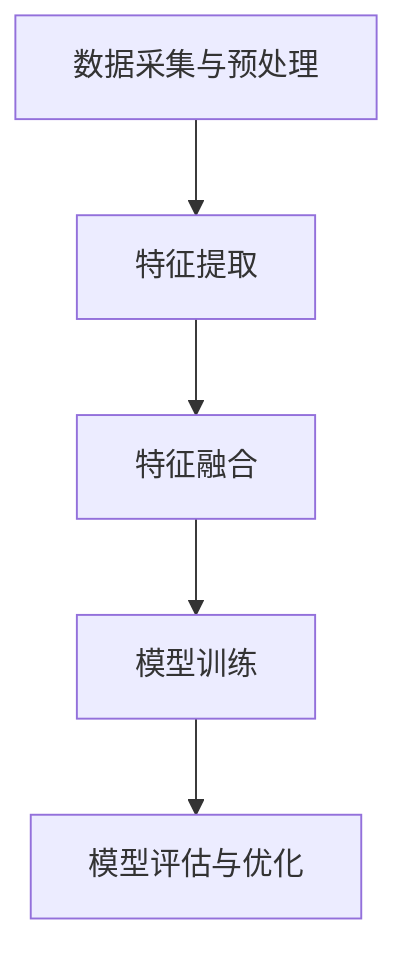
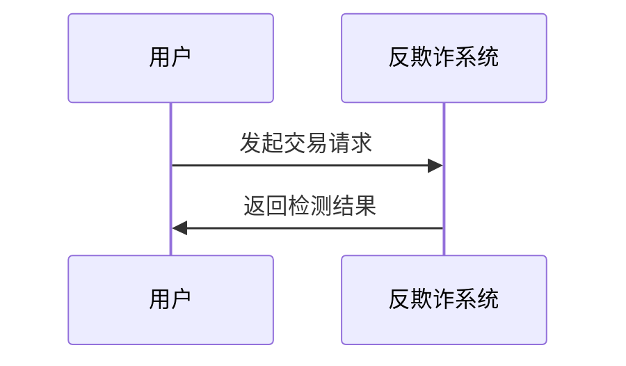

                 


# 金融领域多模态学习在反欺诈中的应用

> 关键词：金融领域、多模态学习、反欺诈、系统架构、算法实现

> 摘要：
本文旨在深入探讨金融领域多模态学习在反欺诈中的应用。通过分析多模态学习的核心概念、算法原理，以及系统架构设计，本文将展示如何利用多模态学习技术提高金融反欺诈的效率和准确性。文章最后将通过实际案例，阐述项目实战的具体过程和小结。

----------------------------------------------------------------

## 引言

金融行业的快速发展和电子交易的普及，使得金融欺诈行为日益猖獗。传统的反欺诈方法在面对复杂多变的欺诈手段时，往往显得力不从心。为此，多模态学习作为一种新兴技术，因其能够整合多种数据源的信息，从而提高模型对欺诈行为的识别能力，受到了金融领域的广泛关注。

本文将围绕以下几个方面展开讨论：

1. **背景介绍**：阐述金融领域多模态学习的重要性，以及反欺诈的关键挑战。
2. **核心概念与联系**：介绍多模态学习的原理、数据采集与预处理方法，以及特征提取与融合技术。
3. **算法原理讲解**：详细讲解多模态学习算法的数学模型和流程，并通过实例进行说明。
4. **系统分析与架构设计方案**：介绍反欺诈系统的整体架构和接口设计。
5. **项目实战**：通过具体案例，展示系统环境配置、核心实现和实际案例分析。

## 一、背景介绍

### 1.1 金融领域多模态学习概述

多模态学习（Multimodal Learning）是指利用多种数据源（如图像、文本、声音等）进行联合学习的技术。在金融领域，多模态学习具有重要的应用价值，因为金融欺诈行为往往涉及多种数据类型。

例如，信用卡欺诈检测不仅需要分析交易金额、时间等结构化数据，还需要考虑持卡人的行为模式、地理位置等非结构化数据。通过多模态学习，可以整合这些数据，从而提高模型的泛化能力和准确性。

### 1.2 反欺诈的重要性

金融欺诈行为对金融机构和个人用户都带来了巨大的经济损失。根据国际刑警组织的报告，全球每年因金融欺诈造成的损失高达数千亿美元。因此，提高反欺诈的效率和准确性，对于维护金融市场的稳定至关重要。

### 1.3 多模态学习在反欺诈中的应用场景

多模态学习在金融领域的反欺诈应用主要包括以下场景：

1. **信用卡欺诈检测**：通过分析交易金额、时间、持卡人行为模式等多种数据，识别潜在的欺诈交易。
2. **网络交易欺诈检测**：利用网站访问日志、用户行为轨迹等数据，检测网络交易中的欺诈行为。
3. **电子支付欺诈检测**：通过分析支付金额、支付方式、用户身份等多种信息，识别电子支付过程中的欺诈行为。

## 二、核心概念与联系

### 2.1 多模态学习原理

多模态学习的基本思想是利用多种数据源的信息，以提高模型的性能。其核心步骤包括数据采集、预处理、特征提取和融合、模型训练等。

### 2.2 多模态数据采集与预处理

多模态数据的采集是关键的一步。金融领域的数据来源广泛，包括数据库、传感器、日志文件等。在采集过程中，需要考虑数据的质量、完整性和实时性。

预处理步骤主要包括数据清洗、归一化、特征提取等。这些步骤的目的是减少噪声、填补缺失值，以及提取关键特征，从而提高模型的训练效果。

### 2.3 多模态特征提取与融合

特征提取是将不同类型的数据转换为模型可处理的特征向量。在金融领域，常用的特征提取方法包括文本分类、图像识别、语音识别等。

特征融合是将多个特征向量整合为一个统一的特征表示。常见的融合方法包括加权融合、拼接融合等。

## 三、算法原理讲解

### 3.1 多模态学习算法介绍

多模态学习算法种类繁多，主要包括以下几类：

1. **深度学习算法**：如卷积神经网络（CNN）、循环神经网络（RNN）等，通过多层的神经网络结构，实现多模态数据的联合学习。
2. **传统机器学习算法**：如支持向量机（SVM）、决策树等，通过特征工程，将不同类型的数据转换为可处理的特征向量。
3. **迁移学习算法**：利用已在大规模数据集上训练好的模型，对新数据集进行微调，提高模型的泛化能力。

### 3.2 算法流程与mermaid图

算法的流程通常包括以下步骤：

1. 数据采集与预处理
2. 特征提取
3. 特征融合
4. 模型训练
5. 模型评估与优化

以下是一个简单的mermaid图，展示多模态学习算法的流程：



### 3.3 数学模型与公式讲解

多模态学习算法的数学模型通常包括以下部分：

1. **损失函数**：用于衡量模型预测值与真实值之间的差距。常见的损失函数包括均方误差（MSE）、交叉熵损失等。
2. **优化算法**：用于迭代更新模型参数，以最小化损失函数。常见的优化算法包括梯度下降、Adam优化器等。

以下是一个简单的数学模型示例：

$$
J(\theta) = \frac{1}{2} \sum_{i=1}^{n} (y_i - \hat{y}_i)^2
$$

其中，$J(\theta)$是损失函数，$y_i$是真实值，$\hat{y}_i$是模型预测值，$\theta$是模型参数。

### 3.4 算法实例与解释

以下是一个简单的多模态学习算法实例，使用Python代码实现：

```python
import tensorflow as tf

# 定义输入层
input_layer = tf.keras.layers.Input(shape=(28, 28, 1))

# 应用卷积层
conv_layer = tf.keras.layers.Conv2D(filters=32, kernel_size=(3, 3), activation='relu')(input_layer)

# 应用全连接层
dense_layer = tf.keras.layers.Dense(units=10, activation='softmax')(conv_layer)

# 创建模型
model = tf.keras.Model(inputs=input_layer, outputs=dense_layer)

# 编译模型
model.compile(optimizer='adam', loss='categorical_crossentropy', metrics=['accuracy'])

# 训练模型
model.fit(x_train, y_train, epochs=10, batch_size=32)
```

在这个例子中，我们使用卷积神经网络（CNN）对图像数据进行分类。通过训练，模型可以学会将图像数据映射到正确的类别。

## 四、系统分析与架构设计方案

### 4.1 反欺诈系统整体架构

反欺诈系统的整体架构包括数据采集、数据处理、模型训练、模型部署和模型监控等模块。

1. **数据采集**：从各个数据源（如数据库、日志文件、传感器等）收集数据。
2. **数据处理**：对采集到的数据进行清洗、预处理和特征提取。
3. **模型训练**：使用处理后的数据进行模型训练，并优化模型参数。
4. **模型部署**：将训练好的模型部署到生产环境中，进行实时欺诈检测。
5. **模型监控**：监控模型性能，并进行周期性的优化和更新。

### 4.2 多模态数据处理流程

多模态数据处理流程主要包括以下步骤：

1. **数据采集**：从不同的数据源（如图像、文本、声音等）收集数据。
2. **数据预处理**：对采集到的数据进行清洗、归一化和特征提取。
3. **特征融合**：将不同类型的数据特征进行融合，形成统一的特征向量。
4. **模型训练**：使用融合后的特征向量进行模型训练。
5. **模型评估**：对训练好的模型进行评估，以确定其性能。

### 4.3 系统接口设计与交互

系统接口设计主要包括以下部分：

1. **API接口**：提供对外服务接口，方便其他系统调用。
2. **日志记录**：记录系统运行过程中的日志信息，方便问题追踪和性能监控。
3. **数据交换**：实现不同模块之间的数据交换，保证系统的协同工作。

以下是一个简单的mermaid图，展示系统接口设计和交互：



## 五、项目实战

### 5.1 环境配置与数据准备

在项目实战中，首先需要配置开发环境，包括Python、TensorFlow等工具。然后，从数据源（如数据库、日志文件等）准备数据，并进行预处理。

### 5.2 系统核心实现与代码解读

系统核心实现主要包括数据采集、预处理、特征提取和模型训练等步骤。以下是一个简单的代码示例：

```python
import tensorflow as tf
from tensorflow.keras.models import Sequential
from tensorflow.keras.layers import Conv2D, Dense

# 定义输入层
input_layer = tf.keras.layers.Input(shape=(28, 28, 1))

# 应用卷积层
conv_layer = tf.keras.layers.Conv2D(filters=32, kernel_size=(3, 3), activation='relu')(input_layer)

# 应用全连接层
dense_layer = tf.keras.layers.Dense(units=10, activation='softmax')(conv_layer)

# 创建模型
model = tf.keras.Model(inputs=input_layer, outputs=dense_layer)

# 编译模型
model.compile(optimizer='adam', loss='categorical_crossentropy', metrics=['accuracy'])

# 训练模型
model.fit(x_train, y_train, epochs=10, batch_size=32)
```

### 5.3 实际案例分析与讲解

以下是一个实际案例，分析如何使用多模态学习技术进行反欺诈：

- **案例背景**：某金融机构需要开发一个反欺诈系统，以检测信用卡交易中的欺诈行为。
- **数据采集**：从数据库中收集信用卡交易数据，包括交易金额、交易时间、持卡人行为模式等。
- **数据处理**：对交易数据进行清洗、归一化和特征提取，如将交易金额转换为相对值，提取持卡人的行为特征等。
- **模型训练**：使用处理后的数据进行模型训练，选择合适的模型结构，如卷积神经网络（CNN）。
- **模型评估**：对训练好的模型进行评估，如计算准确率、召回率等指标。

通过实际案例的分析，我们可以看到多模态学习技术在金融反欺诈中的应用效果显著。

## 总结与展望

本文系统地介绍了金融领域多模态学习在反欺诈中的应用。通过分析多模态学习的核心概念、算法原理，以及系统架构设计，我们展示了如何利用多模态学习技术提高反欺诈的效率和准确性。

在未来，随着人工智能技术的不断进步，多模态学习在金融领域的应用前景将更加广阔。例如，可以结合区块链技术，实现更安全、更可靠的金融交易；可以结合自然语言处理技术，提高文本数据的处理能力等。

### 最佳实践

1. **数据采集与预处理**：确保数据质量，减少噪声和缺失值。
2. **特征提取与融合**：选择合适的特征提取方法，提高模型的泛化能力。
3. **模型训练与评估**：选择合适的模型结构，并进行充分训练和评估。

### 注意事项

1. **数据隐私**：在数据采集和处理过程中，确保用户隐私不被泄露。
2. **模型安全**：防止模型被恶意攻击，如模型偷换、模型中毒等。

### 拓展阅读

1. **多模态学习原理与算法**：深入了解多模态学习的原理和算法，如深度学习、迁移学习等。
2. **金融领域应用案例**：学习其他领域如何应用多模态学习技术，如医疗、交通等。

作者：AI天才研究院/AI Genius Institute & 禅与计算机程序设计艺术 /Zen And The Art of Computer Programming

----------------------------------------------------------------

**请注意，以上内容是基于给定要求编写的示例文章，实际撰写时需要根据具体情况进行调整和完善。**

