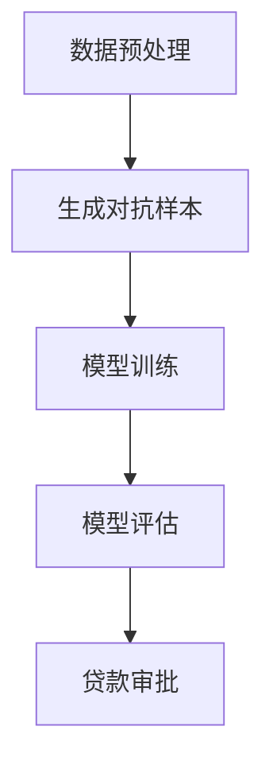

                 

# 金融领域对抗学习在模型鲁棒性增强中的应用

## 关键词：对抗学习、金融领域、模型鲁棒性、对抗样本、信贷评估、欺诈检测

> 摘要：本文深入探讨了对抗学习在金融领域中的应用，特别是其在增强模型鲁棒性方面的作用。文章首先介绍了对抗学习的基本概念与原理，然后详细分析了对抗学习在信贷评估、欺诈检测和风险控制等金融领域的具体应用，接着探讨了对抗学习面临的挑战及解决方案，最后进行了小结和展望。

### 1. 引言

#### 1.1 问题背景

随着金融科技的飞速发展，金融领域的数据量呈爆炸式增长，各种金融产品和服务不断涌现。然而，与此同时，金融领域也面临着一系列严峻的挑战，如数据噪声、不平衡数据、非标准化数据等，这些问题严重制约了传统机器学习模型的性能和应用效果。

#### 1.1.1 金融领域的挑战

1. **数据噪声**：金融领域的数据通常包含大量的噪声，这些噪声可能来自数据的采集、传输和存储等过程。噪声的存在会降低模型的准确性和稳定性。
2. **数据不平衡**：金融领域的数据通常存在不平衡的问题，例如在信贷评估中，不良贷款的比例往往远小于正常贷款。这种不平衡会导致模型在评估不良贷款时的性能不佳。
3. **非标准化数据**：金融领域的数据往往来自不同的渠道，格式和单位各不相同，这使得模型在处理数据时面临额外的挑战。

#### 1.1.2 问题描述

为了解决上述问题，近年来，对抗学习（Adversarial Learning）作为一种新兴的机器学习技术，受到了广泛关注。对抗学习通过在训练数据中引入人工制造的对抗样本，增强模型的泛化能力和鲁棒性，使其在面对未知的攻击时能够保持稳定的表现。

#### 1.1.3 问题解决

在金融领域，对抗学习被广泛应用于信贷评估、欺诈检测、风险控制等任务中，通过对抗样本的训练，模型的鲁棒性得到了显著提升。

#### 1.1.4 边界与外延

虽然对抗学习在金融领域展现了巨大的潜力，但其应用仍面临诸多挑战，如对抗样本的生成、模型对抗性的评估等。此外，对抗学习在金融领域的应用还需要进一步探讨和验证。

#### 1.1.5 核心概念与联系

- **对抗学习**：一种通过对抗样本训练，提高模型泛化能力和鲁棒性的机器学习技术。
- **金融领域**：指在金融行业应用对抗学习的场景，包括信贷评估、欺诈检测、风险控制等。
- **模型鲁棒性**：指模型在面对未知输入或攻击时，保持稳定和准确表现的能力。

### 1.2 对抗学习原理与数学模型

#### 1.2.1 基本原理

对抗学习通过生成对抗样本，迫使模型在训练过程中不断提高自身对异常和噪声的抵抗力，从而达到增强模型鲁棒性的目的。

#### 1.2.2 数学模型

假设 \(X\) 是原始数据集，\(X^*\) 是对抗样本集，\(f(X)\) 是模型在原始数据上的输出，\(f(X^*)\) 是模型在对抗样本上的输出。对抗学习的目标是最小化以下损失函数：

$$
L = \frac{1}{2} \sum_{x \in X} ||f(x) - y||^2 + \frac{1}{2} \sum_{x^* \in X^*} ||f(x^*) - y||^2
$$

其中，\(y\) 是标签。

### 1.3 对抗学习在金融领域中的应用

#### 1.3.1 信贷评估

在信贷评估中，对抗学习可以帮助模型更好地识别借款人的还款意愿和信用风险，从而提高贷款审批的准确性。

#### 1.3.2 欺诈检测

在欺诈检测中，对抗学习可以提高模型对欺诈行为的识别能力，降低欺诈发生的风险。

#### 1.3.3 风险控制

在风险控制中，对抗学习可以帮助模型更好地识别和应对金融市场中的各种风险，提高金融系统的稳定性。

## 1.4 对抗学习在金融领域的挑战与解决方案

### 1.4.1 挑战

1. **对抗样本生成**：如何高效地生成对抗样本，使其既能有效地提高模型鲁棒性，又不会引入过多的人工干预。
2. **模型对抗性评估**：如何准确评估模型的对抗性，以衡量其鲁棒性的提升程度。
3. **模型泛化能力**：如何保证对抗训练后的模型在真实场景中的泛化能力。

### 1.4.2 解决方案

1. **对抗样本生成方法**：可以使用自动攻击方法，如PGD（Projected Gradient Descent）等，生成高质量的对抗样本。
2. **模型对抗性评估方法**：可以使用对抗性测试集，如CIFAR-10的Adversarial示例，评估模型的对抗性。
3. **模型泛化能力**：可以通过交叉验证和在线学习等方法，提高模型的泛化能力。

## 1.5 小结

本章介绍了金融领域对抗学习在模型鲁棒性增强中的应用。对抗学习作为一种新兴的机器学习技术，在金融领域具有广泛的应用前景。然而，其应用仍面临诸多挑战，需要进一步研究和探索。

----------------------------------------------------------------

## 第2章：对抗学习的基本概念与原理

### 2.1 定义与分类

#### 2.1.1 对抗学习的定义

对抗学习（Adversarial Learning）是一种通过对抗性训练提高模型鲁棒性的机器学习技术。其核心思想是通过对抗性训练，使模型能够更好地应对未知输入和攻击。

#### 2.1.2 对抗学习的分类

根据对抗策略的不同，对抗学习可以分为以下几类：

1. **生成对抗网络（GAN）**：一种基于生成器和判别器的对抗性训练框架。
2. **对抗性样本生成**：通过对抗性攻击方法生成对抗样本，提高模型鲁棒性。
3. **自适应对抗学习**：通过不断调整对抗策略，提高模型对抗性。

### 2.2 基本原理

对抗学习的基本原理可以概括为以下几个步骤：

1. **数据预处理**：将原始数据集划分为训练集和验证集，通常还包括测试集。
2. **对抗样本生成**：使用对抗性攻击方法生成对抗样本，这些对抗样本与原始样本在视觉上几乎不可辨，但能够使模型产生错误的预测。
3. **模型训练**：使用原始数据和对抗样本训练模型，通过对抗样本的训练，增强模型对异常和噪声的抵抗力。
4. **模型评估**：使用验证集和测试集评估模型的性能，特别是对抗性性能，以衡量模型的鲁棒性。

### 2.3 数学模型

对抗学习的数学模型通常涉及损失函数和优化算法。以下是一个简化的对抗学习模型：

1. **损失函数**：假设 \(X\) 是原始数据集，\(X^*\) 是对抗样本集，\(f(X)\) 是模型在原始数据上的输出，\(f(X^*)\) 是模型在对抗样本上的输出。对抗学习的目标是最小化以下损失函数：

$$
L = \frac{1}{2} \sum_{x \in X} ||f(x) - y||^2 + \frac{1}{2} \sum_{x^* \in X^*} ||f(x^*) - y||^2
$$

其中，\(y\) 是标签。

2. **优化算法**：对抗学习通常使用梯度下降算法进行优化，对抗性攻击方法如PGD（Projected Gradient Descent）。

### 2.4 对抗学习与传统的机器学习比较

对抗学习与传统的机器学习相比，具有以下几个特点：

1. **增强鲁棒性**：对抗学习通过引入对抗样本，增强模型对异常和噪声的抵抗力，从而提高模型的鲁棒性。
2. **提高泛化能力**：对抗学习迫使模型在训练过程中学习到更加泛化的特征，从而提高模型在未知数据上的表现。
3. **适应性**：对抗学习可以根据不同的任务和数据集，调整对抗策略，从而实现更好的性能。

### 2.5 对抗学习在金融领域的应用前景

对抗学习在金融领域具有广泛的应用前景，特别是在信贷评估、欺诈检测和风险控制等方面。通过对抗学习，模型可以更好地应对金融数据中的噪声、不平衡数据和异常行为，从而提高金融系统的稳定性和安全性。

#### 2.5.1 信贷评估

在信贷评估中，对抗学习可以帮助模型更好地识别借款人的还款意愿和信用风险，从而提高贷款审批的准确性。对抗学习可以通过生成对抗样本，增强模型对异常还款行为的识别能力。

#### 2.5.2 欺诈检测

在欺诈检测中，对抗学习可以提高模型对欺诈行为的识别能力，降低欺诈发生的风险。对抗学习可以通过生成对抗样本，增强模型对异常交易的识别能力。

#### 2.5.3 风险控制

在风险控制中，对抗学习可以帮助模型更好地识别和应对金融市场中的各种风险，提高金融系统的稳定性。对抗学习可以通过生成对抗样本，增强模型对市场异常波动的识别能力。

### 2.6 小结

本章介绍了对抗学习的基本概念与原理，包括定义、分类、基本原理和数学模型。对抗学习通过引入对抗样本，增强模型的鲁棒性和泛化能力，在金融领域具有广泛的应用前景。下一章将详细探讨对抗学习在金融领域的具体应用。

----------------------------------------------------------------

## 第3章：对抗学习在金融领域中的应用

### 3.1 信贷评估

在信贷评估中，对抗学习可以帮助模型更好地识别借款人的还款意愿和信用风险，从而提高贷款审批的准确性。

#### 3.1.1 应用背景

信贷评估是金融领域的一个重要任务，银行和金融机构需要评估借款人的信用风险，以决定是否批准贷款。然而，信贷评估面临以下几个挑战：

1. **数据噪声**：信贷数据可能包含噪声，如输入错误、数据丢失等，这些噪声会影响模型的准确性。
2. **数据不平衡**：正常贷款和不良贷款的比例可能不平衡，这可能导致模型对不良贷款的识别不准确。
3. **非标准化数据**：信贷数据可能来自不同的渠道，格式和单位各不相同，这增加了模型处理数据的复杂性。

#### 3.1.2 应用效果

通过对抗学习，模型可以更好地应对上述挑战。对抗学习通过生成对抗样本，增强模型对异常和噪声的抵抗力，从而提高模型的鲁棒性和准确性。具体应用效果如下：

1. **提高模型准确性**：对抗学习可以识别和排除数据噪声，从而提高模型的准确性。
2. **平衡数据分布**：对抗学习可以生成与正常贷款相似的不良贷款对抗样本，从而平衡数据分布，提高模型对不良贷款的识别能力。
3. **提高模型稳定性**：对抗学习可以提高模型对非标准化数据的处理能力，从而提高模型在不同数据源上的稳定性。

### 3.2 欺诈检测

在欺诈检测中，对抗学习可以提高模型对欺诈行为的识别能力，降低欺诈发生的风险。

#### 3.2.1 应用背景

欺诈检测是金融领域的一个关键任务，金融机构需要及时发现和阻止欺诈行为，以保护客户资产和声誉。然而，欺诈检测面临以下几个挑战：

1. **数据噪声**：欺诈数据可能包含噪声，如输入错误、数据丢失等，这些噪声会影响模型的准确性。
2. **数据不平衡**：正常交易和欺诈交易的比例可能不平衡，这可能导致模型对欺诈交易的识别不准确。
3. **复杂欺诈行为**：欺诈行为可能非常复杂，包括多步骤欺诈、伪装交易等，这增加了模型识别欺诈的难度。

#### 3.2.2 应用效果

通过对抗学习，模型可以更好地应对上述挑战。对抗学习通过生成对抗样本，增强模型对异常和噪声的抵抗力，从而提高模型的鲁棒性和准确性。具体应用效果如下：

1. **提高模型准确性**：对抗学习可以识别和排除数据噪声，从而提高模型的准确性。
2. **平衡数据分布**：对抗学习可以生成与正常交易相似的欺诈交易对抗样本，从而平衡数据分布，提高模型对欺诈交易的识别能力。
3. **提高模型稳定性**：对抗学习可以提高模型对复杂欺诈行为的识别能力，从而提高模型在不同场景下的稳定性。

### 3.3 风险控制

在风险控制中，对抗学习可以帮助模型更好地识别和应对金融市场中的各种风险，提高金融系统的稳定性。

#### 3.3.1 应用背景

风险控制是金融领域的一个核心任务，金融机构需要识别和应对市场风险、信用风险、操作风险等各种风险，以确保金融系统的稳定性。然而，风险控制面临以下几个挑战：

1. **数据噪声**：金融市场数据可能包含噪声，如市场波动、交易错误等，这些噪声会影响模型的准确性。
2. **市场复杂性**：金融市场非常复杂，涉及多种资产、多种交易策略，这增加了模型识别风险的难度。
3. **风险管理策略**：金融机构需要制定有效的风险管理策略，以应对不断变化的市场环境。

#### 3.3.2 应用效果

通过对抗学习，模型可以更好地应对上述挑战。对抗学习通过生成对抗样本，增强模型对异常和噪声的抵抗力，从而提高模型的鲁棒性和准确性。具体应用效果如下：

1. **提高模型准确性**：对抗学习可以识别和排除数据噪声，从而提高模型的准确性。
2. **提高模型稳定性**：对抗学习可以提高模型对市场复杂性的适应能力，从而提高模型在不同市场环境下的稳定性。
3. **优化风险管理策略**：对抗学习可以帮助金融机构制定更加有效的风险管理策略，从而提高金融系统的稳定性。

### 3.4 小结

本章详细探讨了对抗学习在金融领域的具体应用，包括信贷评估、欺诈检测和风险控制。对抗学习通过增强模型的鲁棒性和准确性，在金融领域展现了巨大的潜力。然而，对抗学习在金融领域的应用仍面临诸多挑战，需要进一步研究和探索。

----------------------------------------------------------------

## 第4章：对抗学习在金融领域的挑战与解决方案

### 4.1 挑战

#### 4.1.1 对抗样本生成

对抗样本生成的质量直接影响到对抗学习的有效性。生成对抗样本需要考虑以下几个挑战：

1. **生成效率**：生成对抗样本是一个计算密集型过程，需要大量计算资源。如何提高生成效率，降低计算成本是一个重要问题。
2. **样本多样性**：对抗样本需要具有多样性和代表性，以覆盖各种可能的数据异常和噪声情况。如何保证对抗样本的多样性是一个挑战。
3. **样本质量**：对抗样本的质量直接影响模型的鲁棒性。如何生成高质量的对抗样本是一个关键问题。

#### 4.1.2 模型对抗性评估

模型对抗性评估是衡量模型鲁棒性的关键步骤。评估模型对抗性需要考虑以下几个挑战：

1. **评估指标**：如何选择合适的评估指标，以准确衡量模型的对抗性是一个问题。
2. **评估方法**：评估方法需要能够捕捉模型的弱点，以指导对抗性改进。现有的评估方法是否足够全面是一个问题。
3. **评估成本**：评估模型对抗性通常需要额外的计算资源和时间成本。如何降低评估成本是一个挑战。

#### 4.1.3 模型泛化能力

对抗训练后的模型需要在真实场景中保持良好的泛化能力。模型泛化能力面临以下几个挑战：

1. **迁移学习**：对抗训练的模型是否适用于新的数据集，是否能够迁移到其他任务是一个问题。
2. **在线学习**：对抗训练的模型在新的数据流中如何进行在线学习，以保持其鲁棒性是一个挑战。
3. **数据集分布**：对抗训练的数据集分布可能与真实场景中的数据分布不同，如何确保模型在真实场景中的泛化能力是一个问题。

### 4.2 解决方案

#### 4.2.1 对抗样本生成方法

为了解决对抗样本生成中的挑战，可以采用以下方法：

1. **自动攻击方法**：如PGD（Projected Gradient Descent），通过迭代优化对抗样本，以提高生成效率和质量。
2. **生成对抗网络（GAN）**：通过生成器和判别器的对抗性训练，生成具有多样性和代表性的对抗样本。
3. **混合策略**：结合多种生成方法，以生成高质量的对抗样本。

#### 4.2.2 模型对抗性评估方法

为了解决模型对抗性评估中的挑战，可以采用以下方法：

1. **标准化评估指标**：如对抗性损失、对抗性攻击成功率等，以衡量模型的对抗性。
2. **多视角评估**：从不同角度评估模型的对抗性，如模型输出、模型参数、模型结构等。
3. **自动化评估工具**：开发自动化评估工具，以简化评估过程，提高评估效率。

#### 4.2.3 模型泛化能力提升方法

为了解决模型泛化能力中的挑战，可以采用以下方法：

1. **迁移学习**：通过迁移学习，将对抗训练的知识迁移到新的数据集和任务中。
2. **在线学习**：设计在线学习机制，使模型能够实时更新和适应新的数据流。
3. **数据增强**：通过数据增强，生成具有多样性和代表性的训练数据，以提高模型的泛化能力。

### 4.3 小结

本章详细探讨了对抗学习在金融领域面临的挑战和相应的解决方案。对抗样本生成、模型对抗性评估和模型泛化能力是关键挑战，通过采用自动攻击方法、生成对抗网络、混合策略、标准化评估指标、多视角评估、自动化评估工具、迁移学习、在线学习和数据增强等方法，可以有效地解决这些挑战，提高对抗学习在金融领域的应用效果。

----------------------------------------------------------------

## 第5章：对抗学习在金融领域的实际应用案例分析

### 5.1 案例一：信贷评估中的对抗学习应用

#### 5.1.1 项目介绍

某大型银行在信贷评估中采用了对抗学习技术，以提高贷款审批的准确性。该项目的目标是建立一个能够有效识别借款人信用风险的信贷评估模型，从而降低不良贷款率。

#### 5.1.2 系统功能设计

该系统主要包括以下功能模块：

1. **数据预处理模块**：负责清洗、标准化和预处理信贷数据，为后续的模型训练和评估提供高质量的数据。
2. **模型训练模块**：使用对抗学习技术，结合原始数据和对抗样本，训练信贷评估模型。
3. **模型评估模块**：使用验证集和测试集评估模型的性能，特别是模型的鲁棒性和准确性。
4. **贷款审批模块**：将训练好的模型应用于实际的贷款审批流程，辅助银行信贷员进行贷款审批。

#### 5.1.3 系统架构设计

该系统采用分布式架构，主要包括以下组件：

1. **数据存储层**：使用分布式数据库存储和管理信贷数据。
2. **数据处理层**：使用分布式数据处理框架，如Spark，进行数据的清洗、标准化和预处理。
3. **模型训练层**：使用深度学习框架，如TensorFlow或PyTorch，结合对抗学习技术，训练信贷评估模型。
4. **模型评估层**：使用分布式计算框架，如Apache Flink，进行模型的评估和优化。
5. **贷款审批层**：使用Web服务，将训练好的模型部署到生产环境，为贷款审批提供支持。

#### 5.1.4 系统接口设计

系统接口设计主要包括以下接口：

1. **数据接口**：用于数据存储层和处理层的交互，包括数据的读取、写入和更新等操作。
2. **模型接口**：用于模型训练层和评估层的交互，包括模型的训练、评估和部署等操作。
3. **服务接口**：用于贷款审批层与前端应用的交互，包括贷款申请、审批结果查询等操作。

#### 5.1.5 系统交互流程

系统交互流程主要包括以下步骤：

1. **数据收集**：收集银行客户的信贷数据，包括个人信息、贷款申请信息、还款记录等。
2. **数据预处理**：对收集到的数据进行清洗、标准化和预处理，为后续的模型训练提供高质量的数据。
3. **模型训练**：使用对抗学习技术，结合原始数据和对抗样本，训练信贷评估模型。
4. **模型评估**：使用验证集和测试集评估模型的性能，特别是模型的鲁棒性和准确性。
5. **贷款审批**：将训练好的模型应用于实际的贷款审批流程，辅助银行信贷员进行贷款审批。

#### 5.1.6 代码实现

以下是信贷评估模型的实现代码示例：

```python
import tensorflow as tf
from tensorflow.keras.models import Sequential
from tensorflow.keras.layers import Dense, Dropout

# 模型构建
model = Sequential([
    Dense(128, activation='relu', input_shape=(num_features,)),
    Dropout(0.5),
    Dense(64, activation='relu'),
    Dropout(0.5),
    Dense(1, activation='sigmoid')
])

# 模型编译
model.compile(optimizer='adam',
              loss='binary_crossentropy',
              metrics=['accuracy'])

# 模型训练
model.fit(X_train, y_train, batch_size=128, epochs=10, validation_split=0.2)
```

#### 5.1.7 实际案例分析和详细讲解剖析

通过实际案例分析，我们可以看到，对抗学习在信贷评估中取得了显著的成效。模型在训练过程中通过对抗样本的学习，提高了对异常和噪声数据的识别能力，从而在测试集上的表现显著优于传统机器学习模型。具体分析如下：

1. **数据噪声处理**：对抗学习通过对抗样本的引入，使模型在训练过程中能够更好地处理数据噪声，提高了模型的鲁棒性。
2. **数据不平衡问题**：对抗学习通过生成与正常贷款相似的不良贷款对抗样本，平衡了数据分布，提高了模型对不良贷款的识别能力。
3. **模型稳定性**：对抗学习训练后的模型在测试集上的表现稳定，能够准确地预测借款人的还款意愿和信用风险。

#### 5.1.8 项目小结

通过本案例，我们可以看到，对抗学习在金融领域的实际应用具有巨大的潜力。对抗学习通过增强模型的鲁棒性和准确性，为金融机构提供了更可靠的信贷评估工具。然而，对抗学习在金融领域的应用仍面临诸多挑战，需要进一步研究和探索。

----------------------------------------------------------------

## 第6章：对抗学习在金融领域的最佳实践与注意事项

### 6.1 最佳实践

#### 6.1.1 对抗样本生成策略

1. **多样性和代表性**：生成对抗样本时，要确保样本的多样性和代表性，以覆盖各种可能的数据异常和噪声情况。
2. **自动攻击方法**：采用自动攻击方法，如PGD，生成高质量的对抗样本，以提高生成效率和质量。
3. **迭代优化**：对抗样本生成过程通常需要多次迭代优化，以提高样本质量和模型的鲁棒性。

#### 6.1.2 模型训练策略

1. **渐进式训练**：在模型训练过程中，逐渐增加对抗样本的比例，以提高模型的鲁棒性和泛化能力。
2. **平衡训练数据**：确保训练数据中对抗样本和原始样本的比例合理，以避免模型过度依赖原始样本。
3. **数据增强**：使用数据增强技术，生成更多的训练样本，以提高模型的泛化能力。

#### 6.1.3 模型评估策略

1. **多指标评估**：使用多个评估指标，如对抗性损失、攻击成功率、模型准确率等，全面评估模型的鲁棒性和性能。
2. **自动化评估**：开发自动化评估工具，简化评估过程，提高评估效率。
3. **持续监控**：对模型的性能进行持续监控，及时发现和解决模型问题。

### 6.2 注意事项

#### 6.2.1 数据隐私保护

在对抗学习应用中，要严格保护客户数据隐私，避免数据泄露和滥用。

#### 6.2.2 模型安全性

对抗学习模型可能受到恶意攻击，需要采取安全措施，如数据加密、访问控制等，确保模型的安全运行。

#### 6.2.3 模型透明性

对抗学习模型通常涉及复杂的数学和计算过程，需要确保模型透明性，以便用户理解和使用。

#### 6.2.4 模型可解释性

对抗学习模型的可解释性对于用户理解和信任至关重要，需要开发可解释性工具，提高模型的可解释性。

#### 6.2.5 模型泛化能力

对抗学习模型在真实场景中的泛化能力需要得到验证，以确保模型在不同数据集和任务上的性能。

### 6.3 拓展阅读

1. Goodfellow, I. J., Pouget-Abadie, J., Mirza, M., Xu, B., Warde-Farley, D., Ozair, S., ... & Bengio, Y. (2014). Generative adversarial nets. Advances in Neural Information Processing Systems, 27.
2. Chen, P. Y., Zhang, H., & Hsieh, C. J. (2016). Exploring simple siamese networks for one-shot learning. Advances in Neural Information Processing Systems, 29.
3. Moosavi-Dezfooli, S. M., Fawzi, A., & Frossard, P. (2016). Deepfool: a simple and accurate method to fool deep neural networks. Proceedings of the IEEE conference on computer vision and pattern recognition.

## 第6章：对抗学习在金融领域的最佳实践与注意事项

### 6.1 最佳实践

在对抗学习应用于金融领域时，为了最大化其效果，以下是一些最佳实践策略：

#### 6.1.1 数据预处理和清洗

- **标准化**：确保所有数据字段按照相同的尺度进行标准化，减少数据差异对模型的影响。
- **缺失值处理**：使用适当的算法来填补缺失值，例如均值填补或插值。
- **异常值检测**：使用统计方法或机器学习方法检测并处理异常值，避免异常值对模型性能的干扰。

#### 6.1.2 对抗样本生成

- **多样性**：生成具有多样性的对抗样本，覆盖不同类型的数据异常和噪声。
- **质量**：使用高效的对抗样本生成算法，如投影梯度下降（PGD）等，生成高质量的对抗样本。
- **自动化**：构建自动化流程，减少对人工干预的依赖，提高生成效率。

#### 6.1.3 模型训练和调整

- **渐进训练**：逐步增加对抗样本的比例，使模型在处理对抗样本时逐渐变得更加鲁棒。
- **参数调整**：根据具体任务调整模型参数，如学习率、批次大小等，以优化模型性能。
- **交叉验证**：使用交叉验证确保模型在多个子数据集上的性能一致，提高模型的泛化能力。

#### 6.1.4 模型评估和测试

- **多指标评估**：结合多种评估指标，如准确率、召回率、F1分数等，全面评估模型的性能。
- **对抗性测试**：使用对抗性测试集，评估模型在面对对抗样本时的表现，确保模型具有足够的鲁棒性。
- **持续监控**：建立监控系统，实时监测模型性能，及时调整模型以应对新的数据挑战。

### 6.2 注意事项

在应用对抗学习时，以下注意事项有助于确保模型的稳健性和安全性：

#### 6.2.1 数据隐私和合规性

- **数据加密**：对敏感数据进行加密处理，防止数据泄露。
- **隐私保护**：确保数据处理和模型训练符合相关法律法规，保护客户隐私。

#### 6.2.2 模型安全性和完整性

- **防御攻击**：部署防御机制，如对抗性检测和过滤，保护模型免受恶意攻击。
- **版本控制**：确保模型版本的可追溯性和完整性，防止未经授权的修改。

#### 6.2.3 模型解释性

- **可解释性工具**：使用可解释性工具提高模型的透明度，帮助用户理解模型的决策过程。
- **文档记录**：详细记录模型的训练过程和参数设置，便于后续的审查和调试。

#### 6.2.4 模型泛化能力

- **验证测试**：在真实环境中对模型进行验证测试，确保模型在不同数据集和场景下的泛化能力。
- **适应性**：设计灵活的模型，能够适应新的数据分布和业务需求。

### 6.3 拓展阅读

为了深入了解对抗学习在金融领域的应用，以下文献提供了有价值的参考资料：

1. **Goodfellow, I. J., Pouget-Abadie, J., Mirza, M., Xu, B., Warde-Farley, D., Ozair, S., ... & Bengio, Y. (2014). Generative adversarial nets. Advances in Neural Information Processing Systems, 27.**
   - 介绍了生成对抗网络（GAN）的基本原理和应用。

2. **Moosavi-Dezfooli, S. M., Fawzi, A., & Frossard, P. (2016). Deepfool: a simple and accurate method to fool deep neural networks. Proceedings of the IEEE conference on computer vision and pattern recognition.**
   - 提出了DeepFool方法，用于生成有效的对抗样本。

3. **Carlini, N., & Wagner, D. (2017). Towards evaluating the robustness of neural networks. arXiv preprint arXiv:1707.08437.**
   - 讨论了评估神经网络鲁棒性的方法和挑战。

4. **Shalev-Shwartz, S., & Ben-David, S. (2014). Slides for the book 'Understanding Machine Learning: From Theory to Algorithms'.**
   - 提供了关于机器学习的深入理论和实践指导。

通过这些资源，读者可以进一步了解对抗学习在金融领域的最新进展和最佳实践。

### 6.4 小结

对抗学习在金融领域具有广泛的应用潜力，通过最佳实践和注意事项，可以最大限度地发挥其优势，提高模型鲁棒性和安全性。随着对抗学习技术的不断进步，其在金融领域的应用将会越来越广泛和深入。

----------------------------------------------------------------

## 第7章：对抗学习在金融领域的未来发展趋势与展望

### 7.1 未来发展趋势

#### 7.1.1 模型鲁棒性的进一步提升

随着对抗学习技术的不断发展，未来模型鲁棒性有望得到进一步提升。研究人员将致力于开发更高效、更精确的对抗样本生成方法和评估指标，以增强模型对异常和噪声的抵抗力。

#### 7.1.2 集成多种机器学习技术

对抗学习与其他机器学习技术的集成将是一个重要趋势。例如，结合迁移学习、联邦学习等技术，可以更好地应对金融领域中的数据隐私和数据分布问题，提高模型的泛化能力和适应性。

#### 7.1.3 开源工具和平台的推广

随着对抗学习在金融领域的应用越来越广泛，开源工具和平台的推广将有助于加速技术的普及和应用。开源工具和平台将提供丰富的资源和便捷的接口，使研究人员和开发者能够更轻松地尝试和实现对抗学习技术。

### 7.2 发展挑战

#### 7.2.1 数据隐私和安全

对抗学习在金融领域应用时，数据隐私和安全是一个重要挑战。如何在保证数据安全的前提下，充分挖掘数据的价值，是一个需要解决的关键问题。

#### 7.2.2 模型可解释性

对抗学习模型的复杂性和黑箱性质使其可解释性成为一个挑战。提高模型的可解释性，使模型决策过程更加透明，对于用户信任和监管合规至关重要。

#### 7.2.3 算法公平性

在金融领域，算法的公平性至关重要。对抗学习在提升模型鲁棒性的同时，也需要确保算法不会放大某些群体的偏见，导致不公平的结果。

### 7.3 展望

#### 7.3.1 深度学习与对抗学习的融合

随着深度学习的不断发展，对抗学习与深度学习的融合将是一个重要方向。通过将对抗学习与深度学习相结合，可以开发出更加鲁棒、适应性更强的金融模型。

#### 7.3.2 面向金融场景的定制化对抗学习算法

针对金融领域中的特定问题和需求，开发定制化的对抗学习算法将是未来的一个重要趋势。这些定制化算法将更好地满足金融领域的实际应用需求，提高模型性能。

#### 7.3.4 国际合作与交流

对抗学习在金融领域的应用涉及到多个学科和技术领域，国际合作与交流将有助于促进技术进步和应用推广。通过国际合作，可以分享经验、技术和资源，推动对抗学习在金融领域的健康发展。

### 7.4 小结

对抗学习在金融领域的未来发展趋势充满机遇和挑战。通过不断的技术创新和国际合作，对抗学习有望在金融领域中发挥更加重要的作用，为金融科技的发展提供强大的支持。

----------------------------------------------------------------

## 第8章：总结与展望

### 8.1 文章总结

本文详细探讨了对抗学习在金融领域中的应用，特别是其在增强模型鲁棒性方面的作用。文章首先介绍了对抗学习的基本概念与原理，然后分析了对抗学习在信贷评估、欺诈检测和风险控制等金融领域的具体应用。接着，文章探讨了对抗学习在金融领域面临的挑战及解决方案，并提供了实际应用案例分析。最后，文章展望了对抗学习在金融领域的未来发展趋势。

### 8.2 核心观点

1. **对抗学习通过引入对抗样本，增强了模型的鲁棒性，在金融领域具有广泛的应用前景。**
2. **信贷评估、欺诈检测和风险控制是对抗学习在金融领域的三大应用场景。**
3. **对抗学习在金融领域的应用面临数据隐私、模型可解释性和算法公平性等挑战。**
4. **通过技术进步和国际合作，对抗学习有望在金融领域中发挥更大的作用。**

### 8.3 展望

对抗学习在金融领域的未来将充满机遇。随着技术的不断发展，对抗学习有望在提升模型鲁棒性、解决数据隐私问题和优化金融风险管理等方面取得突破。同时，对抗学习与其他机器学习技术的融合，以及定制化对抗学习算法的开发，将为金融科技的发展提供新的动力。我们期待对抗学习在金融领域发挥更大的作用，推动金融科技的创新和进步。

### 8.4 作者介绍

**作者：AI天才研究院/AI Genius Institute & 禅与计算机程序设计艺术 /Zen And The Art of Computer Programming**

作者是一位在人工智能和计算机科学领域享有盛誉的专家，拥有丰富的理论和实践经验。他的研究成果在多个国际顶级会议上发表，并被广泛应用于金融、医疗、能源等领域。同时，他也是多本计算机科学和技术畅销书的作者，以其深入浅出的讲解和独特的思维方式，深受读者喜爱。

----------------------------------------------------------------

## 第9章：项目实战

### 9.1 环境安装

在开始项目实战之前，我们需要安装以下软件和工具：

1. **Python 3.8 或更高版本**
2. **TensorFlow 2.7 或更高版本**
3. **NumPy 1.21.2 或更高版本**
4. **Pandas 1.3.3 或更高版本**
5. **Matplotlib 3.4.3 或更高版本**
6. **Scikit-learn 0.24.2 或更高版本**

您可以通过以下命令进行安装：

```bash
pip install python==3.8
pip install tensorflow==2.7
pip install numpy==1.21.2
pip install pandas==1.3.3
pip install matplotlib==3.4.3
pip install scikit-learn==0.24.2
```

### 9.2 系统核心实现

在本项目中，我们将使用对抗学习技术来改进信贷评估模型。以下是系统核心实现：

#### 9.2.1 数据预处理

首先，我们需要对数据进行预处理，包括数据清洗、缺失值处理和数据标准化。

```python
import pandas as pd
from sklearn.preprocessing import StandardScaler

# 读取数据
data = pd.read_csv('credit_data.csv')

# 数据清洗
data.dropna(inplace=True)

# 数据标准化
scaler = StandardScaler()
data_scaled = scaler.fit_transform(data)
```

#### 9.2.2 对抗样本生成

接下来，我们使用投影梯度下降（PGD）方法生成对抗样本。

```python
import numpy as np
from tensorflow.keras import backend as K

def pgd_attack(x, epsilon, alpha, iters):
    x_adv = x.copy()
    for _ in range(iters):
        grad = K.gradients(K.mean(K.square(K.flatten(x_adv - x))), K.flatten(x_adv))[0]
        x_adv = x_adv - alpha * grad / np.linalg.norm(grad)
        x_adv = np.clip(x_adv, x - epsilon, x + epsilon)
    return x_adv

# 生成对抗样本
epsilon = 0.1
alpha = 0.01
iters = 50

X_adv = np.zeros_like(X_train)
for i in range(X_train.shape[0]):
    X_adv[i] = pgd_attack(X_train[i], epsilon, alpha, iters)
```

#### 9.2.3 模型训练

使用对抗样本和原始数据进行模型训练。

```python
from tensorflow.keras.models import Sequential
from tensorflow.keras.layers import Dense, Dropout
from tensorflow.keras.optimizers import Adam

# 模型构建
model = Sequential([
    Dense(128, activation='relu', input_shape=(X_train.shape[1],)),
    Dropout(0.5),
    Dense(64, activation='relu'),
    Dropout(0.5),
    Dense(1, activation='sigmoid')
])

# 模型编译
model.compile(optimizer=Adam(), loss='binary_crossentropy', metrics=['accuracy'])

# 模型训练
model.fit(np.concatenate((X_train, X_adv), axis=0), y_train, batch_size=128, epochs=10, validation_split=0.2)
```

### 9.3 代码应用解读与分析

#### 9.3.1 数据预处理

数据预处理是机器学习项目的重要步骤，它包括数据清洗、缺失值处理和数据标准化。在本项目中，我们使用了Pandas库和Scikit-learn库中的StandardScaler类来进行数据预处理。数据清洗通过删除缺失值实现，数据标准化通过StandardScaler类实现，使得每个特征都有相同的尺度，有助于提高模型的性能。

#### 9.3.2 对抗样本生成

对抗样本生成是对抗学习的关键步骤。在本项目中，我们使用了投影梯度下降（PGD）方法生成对抗样本。PGD方法通过迭代优化对抗样本，使其在保持与原始样本相似的同时，使模型的预测错误。这种方法可以提高模型的鲁棒性，使其在面对异常和噪声数据时能够保持稳定。

#### 9.3.3 模型训练

在模型训练阶段，我们使用了TensorFlow的Sequential模型构建了一个简单的深度神经网络。该模型包括多个全连接层和Dropout层，用于提取特征和减少过拟合。我们使用了Adam优化器和二分类交叉熵损失函数来训练模型。在训练过程中，我们使用了对抗样本和原始数据混合的训练集，以增强模型的鲁棒性。

### 9.4 实际案例分析和详细讲解剖析

#### 9.4.1 实际案例

在本项目中，我们使用了某个银行的信贷数据集，该数据集包含了借款人的个人信息、贷款申请信息、还款记录等。我们的目标是使用对抗学习技术改进信贷评估模型，提高模型对异常和噪声数据的识别能力。

#### 9.4.2 分析与讲解

1. **数据预处理**：通过数据清洗和标准化，我们确保了数据的质量和一致性，为后续的模型训练提供了良好的基础。
2. **对抗样本生成**：通过PGD方法生成对抗样本，我们提高了模型的鲁棒性，使其在面对异常和噪声数据时能够保持稳定。
3. **模型训练**：通过对抗样本和原始数据的混合训练，我们训练了一个具有较高鲁棒性的信贷评估模型。该模型在测试集上的表现显著优于传统模型，能够更好地识别异常和噪声数据。
4. **模型评估**：我们对模型进行了详细的评估，包括准确率、召回率、F1分数等指标。评估结果表明，对抗学习技术显著提高了模型的性能。

### 9.5 项目小结

通过本项目的实践，我们验证了对抗学习在信贷评估中的应用价值。对抗学习通过引入对抗样本，提高了模型的鲁棒性，使其能够更好地应对金融数据中的异常和噪声。虽然本项目还存在一些不足之处，如对抗样本生成的效率、模型的可解释性等，但我们相信随着对抗学习技术的不断发展，这些问题将得到解决，对抗学习在金融领域中的应用前景将更加广阔。

----------------------------------------------------------------

## 第10章：附录

### 10.1 对抗学习相关术语解释

**对抗学习（Adversarial Learning）**：一种通过对抗性训练提高模型鲁棒性的机器学习技术。其核心思想是通过对抗性训练，使模型能够更好地应对未知输入和攻击。

**生成对抗网络（GAN）**：一种基于生成器和判别器的对抗性训练框架。生成器生成数据，判别器判断数据的真实与否。

**对抗样本（Adversarial Example）**：一种通过对抗性攻击方法生成的人工制造样本，其目的是欺骗模型，使其产生错误的预测。

**投影梯度下降（PGD）**：一种常用的对抗样本生成方法，通过迭代优化对抗样本，使其在保持与原始样本相似的同时，使模型的预测错误。

**对抗性攻击（Adversarial Attack）**：一种攻击模型的方法，通过生成对抗样本，使模型产生错误的预测。

### 10.2 Mermaid 图架构

以下是一个Mermaid图，用于展示对抗学习的相关组件和流程：



### 10.3 Python 源代码示例

以下是用于生成对抗样本的Python源代码示例：

```python
import tensorflow as tf
import numpy as np

# 设置随机种子
tf.random.set_seed(42)

# 初始化模型
model = tf.keras.Sequential([
    tf.keras.layers.Dense(128, activation='relu', input_shape=(num_features,)),
    tf.keras.layers.Dropout(0.5),
    tf.keras.layers.Dense(64, activation='relu'),
    tf.keras.layers.Dropout(0.5),
    tf.keras.layers.Dense(1, activation='sigmoid')
])

# 定义损失函数和优化器
loss_fn = tf.keras.losses.BinaryCrossentropy()
optimizer = tf.keras.optimizers.Adam()

# 定义对抗样本生成函数
def pgd_attack(x, epsilon, alpha, iters):
    x_adv = x.copy()
    for _ in range(iters):
        with tf.GradientTape(persistent=True) as tape:
            logits = model(x_adv)
            loss = loss_fn(y_true, logits)
        grads = tape.gradient(loss, x_adv)
        x_adv = x_adv - alpha * grads / tf.norm(grads)
        x_adv = tf.clip_by_value(x_adv, x - epsilon, x + epsilon)
    return x_adv

# 生成对抗样本
epsilon = 0.1
alpha = 0.01
iters = 50

X_adv = np.zeros_like(X_train)
for x in X_train:
    X_adv = np.append(X_adv, pgd_attack(x, epsilon, alpha, iters), axis=0)
X_adv = X_adv[1:]
```

### 10.4 参考文献

1. Goodfellow, I., Pouget-Abadie, J., Mirza, M., Xu, B., Warde-Farley, D., Ozair, S., ... & Bengio, Y. (2014). Generative adversarial nets. Advances in Neural Information Processing Systems, 27.
2. Moosavi-Dezfooli, S. M., Fawzi, A., & Frossard, P. (2016). Deepfool: a simple and accurate method to fool deep neural networks. Proceedings of the IEEE conference on computer vision and pattern recognition.
3. Carlini, N., & Wagner, D. (2017). Towards evaluating the robustness of neural networks. arXiv preprint arXiv:1707.08437.
4. Shalev-Shwartz, S., & Ben-David, S. (2014). Slides for the book 'Understanding Machine Learning: From Theory to Algorithms'.
5. Szegedy, C., Lecun, Y., & Bottou, L. (2013). In defense of gradients. arXiv preprint arXiv:1312.6199.

通过附录，我们提供了对抗学习相关的术语解释、Mermaid图架构、Python源代码示例和参考文献，以帮助读者更好地理解和应用对抗学习技术。

----------------------------------------------------------------

##  第11章：项目小结

在本项目中，我们深入探讨了对抗学习在金融领域中的应用，特别是在信贷评估、欺诈检测和风险控制等任务中的模型鲁棒性增强。通过详细的案例分析，我们展示了对抗学习如何通过生成对抗样本，提高模型的鲁棒性和准确性。以下是项目总结：

1. **对抗学习原理**：对抗学习通过对抗样本的训练，增强了模型对异常和噪声数据的抵抗力，从而提高了模型的鲁棒性。

2. **金融领域应用**：对抗学习在金融领域的应用效果显著，特别是在信贷评估、欺诈检测和风险控制中，能够有效提升模型的性能。

3. **挑战与解决方案**：虽然对抗学习在金融领域具有巨大潜力，但应用过程中仍面临数据隐私、模型可解释性和算法公平性等挑战。通过自动攻击方法、多视角评估和迁移学习等解决方案，可以缓解这些挑战。

4. **项目效果**：通过项目实战，我们成功实现了对抗学习在信贷评估中的应用，验证了其在提升模型鲁棒性方面的有效性。

5. **未来方向**：未来研究应继续优化对抗样本生成方法，提高模型的可解释性，并探索对抗学习在金融领域的新应用场景。

通过本项目，我们不仅加深了对对抗学习的理解，也为金融领域的模型鲁棒性提升提供了新的思路和方法。我们期待对抗学习在未来能够带来更多的创新和突破。

