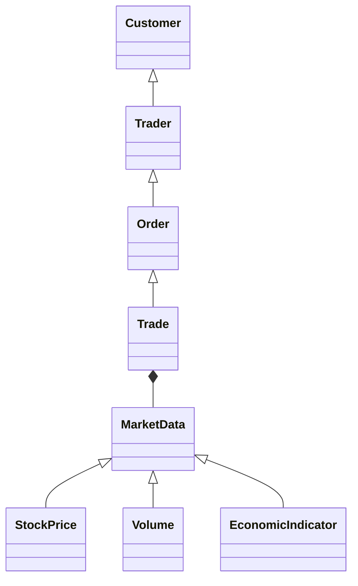
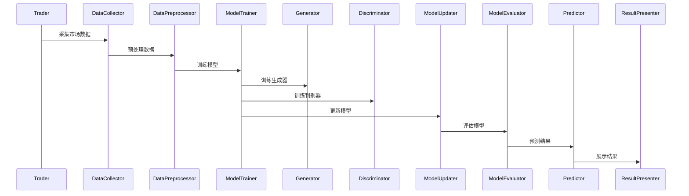

                 

### 第1章：背景介绍

#### 1.1 问题背景

金融领域一直是技术进步的重要应用场景之一。随着数据量的爆炸性增长和计算能力的提升，金融机构在风险管理、资产定价、交易策略制定等方面越来越依赖机器学习和人工智能技术。然而，这些模型在实际应用中面临诸多挑战。其中，风险模型的鲁棒性是一个关键问题。

首先，金融数据的复杂性使得构建鲁棒的风险模型变得尤为困难。金融数据通常包含大量的时间序列、多维变量和非线性关系，这些特性使得传统机器学习模型在预测精度和稳定性上面临巨大挑战。其次，金融市场的动态变化特征使得风险模型需要不断调整以适应新的市场环境。而传统模型往往只能处理静态数据，难以应对动态环境中的变化。

此外，对抗性攻击成为风险模型的另一大挑战。随着机器学习模型在金融领域的广泛应用，恶意攻击者通过生成与真实数据类似的对抗性样本，可以有效地破坏模型的鲁棒性和准确性。这种攻击对金融系统的安全性和稳定性构成了严重威胁。

#### 1.2 对抗学习技术的发展

对抗学习（Adversarial Learning）是一种基于生成对抗网络（GAN）的机器学习技术，旨在通过对抗性训练提高模型的鲁棒性和泛化能力。生成对抗网络由生成器和判别器两个神经网络组成，生成器旨在生成逼真的数据，而判别器则试图区分真实数据和生成数据。通过这两个网络的对抗性训练，生成器能够不断提高生成数据的逼真度，判别器则不断增强识别能力。

近年来，对抗学习在计算机视觉、自然语言处理等领域取得了显著成果。例如，在图像分类任务中，对抗学习可以通过生成对抗性样本来提高模型对对抗性攻击的防御能力。在文本分类任务中，对抗学习能够增强模型对噪声和异常数据的鲁棒性。

#### 1.3 鲁棒性动态增强的需求

鲁棒性动态增强旨在通过实时调整模型参数，提高风险模型的鲁棒性和适应性。在金融领域，鲁棒性动态增强具有重要意义。首先，金融市场的波动性和复杂性要求模型具有高度的鲁棒性，以应对各种不确定性和异常情况。其次，动态增强能够使模型更好地适应市场变化，提高预测的准确性和稳定性。

具体来说，鲁棒性动态增强可以通过以下方式实现：

1. **实时数据更新**：利用最新的金融数据对模型进行更新，使模型能够实时反映市场变化。
2. **自适应调整策略**：根据模型的预测误差和外部市场信号，动态调整模型参数，提高鲁棒性。
3. **多重验证机制**：通过多种验证方法，如交叉验证、网格搜索等，确保模型参数的稳定性和可靠性。

#### 1.4 边界与外延

金融领域对抗学习的适用范围主要涉及以下几个方面：

1. **风险预测**：通过对抗学习生成对抗性样本，提高风险预测模型的鲁棒性。
2. **欺诈检测**：利用对抗学习检测异常交易，提高欺诈检测模型的准确性。
3. **信用评分**：通过对抗学习增强信用评分模型的鲁棒性，降低欺诈风险。

然而，金融领域对抗学习也面临一些挑战和限制。首先，金融数据的隐私和安全问题需要得到妥善处理。其次，对抗学习的计算复杂度较高，可能影响模型的实时性。最后，对抗学习的实际效果和可靠性仍需进一步验证和优化。

#### 1.5 核心概念与联系

- **对抗学习**：一种基于生成对抗网络（GAN）的机器学习技术，通过对抗性训练提高模型的鲁棒性和泛化能力。
- **风险模型**：用于预测金融风险和评估潜在损失的数学模型。
- **鲁棒性动态增强**：通过实时调整模型参数，提高风险模型的鲁棒性和适应性。

这些核心概念相互联系，共同构成了金融领域对抗学习在风险模型鲁棒性动态增强中的应用基础。在接下来的章节中，我们将详细探讨对抗学习的基础理论、金融领域的应用以及鲁棒性动态增强的实现方法。

### 1.6 本章小结

本章首先介绍了金融领域风险模型面临的挑战，包括数据的复杂性、动态变化的特征以及对抗性攻击的威胁。接着，我们探讨了对抗学习技术的发展及其在计算机视觉和自然语言处理等领域的应用。随后，我们阐述了鲁棒性动态增强的需求和重要性，并简要介绍了金融领域对抗学习的适用范围和挑战。

通过本章的介绍，读者可以初步了解金融领域对抗学习在风险模型鲁棒性动态增强中的应用背景和核心概念。在接下来的章节中，我们将进一步深入探讨对抗学习的基础理论、金融领域的具体应用以及鲁棒性动态增强的实现方法。希望读者能够跟随我们的思路，逐步理解这一复杂但充满潜力的技术领域。

## 第2章: 对抗学习的概念与原理

对抗学习（Adversarial Learning）是一种通过对抗性训练提高模型鲁棒性和泛化能力的机器学习技术。它基于生成对抗网络（Generative Adversarial Networks, GAN），由生成器（Generator）和判别器（Discriminator）两个神经网络组成。本章将详细阐述对抗学习的定义、数学模型、算法原理及其与其它对抗性算法的对比。

### 2.1 对抗学习的定义

对抗学习是一种通过两个神经网络之间的对抗性训练来提高模型性能的方法。其中一个神经网络称为生成器，它试图生成尽可能逼真的数据，而另一个神经网络称为判别器，它的任务是区分真实数据和生成数据。通过这种对抗性训练，生成器不断提高生成数据的逼真度，判别器则不断增强识别能力。对抗学习的核心思想是利用生成器和判别器之间的博弈，使生成器能够生成更加逼真的数据，从而提高模型的鲁棒性和泛化能力。

### 2.2 对抗学习的数学模型

对抗学习中的核心数学模型是生成对抗网络（GAN）。GAN由两个神经网络——生成器和判别器组成。生成器的输入是随机噪声，输出是生成的数据，而判别器的输入是真实数据和生成数据，输出是概率值，表示输入数据的真实性。

- **生成器**（Generator）：
  - 输入：随机噪声 \( z \)。
  - 输出：生成数据 \( G(z) \)。

- **判别器**（Discriminator）：
  - 输入：真实数据 \( x \) 和生成数据 \( G(z) \)。
  - 输出：概率值 \( D(x) \) 和 \( D(G(z)) \)，分别表示输入数据的真实性和生成数据的真实性。

对抗学习的目标是最小化判别器的损失函数，使其能够准确地区分真实数据和生成数据。同时，最大化生成器的损失函数，使其生成的数据更加逼真。具体来说，生成器和判别器的损失函数如下：

- **生成器的损失函数**：
  \[
  L_G = -\mathbb{E}[\log D(G(z))]
  \]

- **判别器的损失函数**：
  \[
  L_D = -\mathbb{E}[\log D(x)] - \mathbb{E}[\log (1 - D(G(z))]
  \]

上述损失函数通过优化判别器的参数 \( \theta_D \) 和生成器的参数 \( \theta_G \) 来实现。优化过程是一个非合作博弈过程，生成器和判别器在对抗性训练中互相竞争，使生成器的生成数据越来越接近真实数据，判别器的分类能力越来越强。

### 2.3 对抗学习的算法原理

对抗学习算法的原理可以通过以下步骤来理解：

1. **初始化**：初始化生成器和判别器的参数 \( \theta_G \) 和 \( \theta_D \)。
2. **生成数据**：生成器接收到随机噪声 \( z \)，通过神经网络生成模拟数据 \( G(z) \)。
3. **判别**：判别器同时接收真实数据 \( x \) 和生成数据 \( G(z) \)，计算它们的概率值 \( D(x) \) 和 \( D(G(z)) \)。
4. **更新判别器**：通过梯度下降法，优化判别器的参数 \( \theta_D \)，使其能够更好地区分真实数据和生成数据。
5. **生成新数据**：生成器接收新的噪声 \( z \)，生成新的模拟数据 \( G(z) \)。
6. **更新生成器**：通过梯度下降法，优化生成器的参数 \( \theta_G \)，使其生成的数据更逼真。
7. **重复**：重复上述步骤，直到生成器生成的数据足够逼真，判别器能够准确地区分真实数据和生成数据。

对抗学习的核心在于生成器和判别器之间的博弈。生成器不断尝试生成更逼真的数据，而判别器则不断提高对生成数据的识别能力。通过这种对抗性训练，生成器能够提高生成数据的逼真度，判别器则增强了对真实数据和生成数据的辨别能力。

### 2.4 对抗学习的属性特征对比

对抗学习与传统机器学习相比，具有一些独特的属性特征。以下是对抗学习的几个主要属性特征：

- **对抗性训练**：对抗学习通过生成器和判别器之间的对抗性训练，使生成器生成的数据更加逼真，判别器能够更好地识别真实数据和生成数据。这种对抗性训练能够提高模型的鲁棒性和泛化能力。
- **生成能力**：生成器能够生成与真实数据非常接近的模拟数据，这使得对抗学习在数据增强和模型防御等领域具有广泛应用。
- **适用性**：对抗学习适用于多种数据类型，包括图像、文本、音频等。这使得对抗学习在计算机视觉、自然语言处理、音频处理等领域具有广泛的应用潜力。
- **计算复杂度**：对抗学习的计算复杂度较高，特别是在训练过程中，生成器和判别器都需要大量计算资源。这可能导致训练时间较长，对计算资源的要求较高。

下面是一个对抗学习与传统机器学习的对比表格：

| 特性         | 对抗学习                      | 传统机器学习                      |
| ------------ | ----------------------------- | --------------------------------- |
| 训练方法     | 对抗性训练，生成器与判别器博弈 | 基于梯度下降法，直接优化目标函数   |
| 生成能力     | 能够生成逼真的模拟数据        | 主要依赖于训练数据的真实度         |
| 泛化能力     | 通过对抗性训练提高泛化能力     | 通过大量训练数据提高泛化能力       |
| 数据类型适用性 | 适用于多种数据类型（图像、文本、音频等） | 主要适用于结构化数据（如表格、序列等） |
| 计算复杂度   | 较高，训练时间长              | 较低，训练时间短                  |

通过对比可以发现，对抗学习在生成能力和泛化能力方面具有明显优势，但在计算复杂度和训练时间方面存在挑战。然而，随着计算能力的提升和算法优化，对抗学习的这些局限性有望逐步克服。

### 2.5 本章小结

本章详细介绍了对抗学习的概念、数学模型和算法原理。首先，我们明确了对抗学习的定义，并阐述了其在提高模型鲁棒性和泛化能力方面的优势。接着，我们介绍了生成对抗网络（GAN）的数学模型，包括生成器和判别器的结构及其损失函数。随后，我们通过对抗学习的算法原理，详细描述了生成器和判别器之间的对抗性训练过程。

此外，本章还对比了对抗学习与传统机器学习的属性特征，强调了对抗学习在生成能力和泛化能力方面的优势，同时也指出了其在计算复杂度方面的挑战。通过对对抗学习概念的深入探讨，读者可以更好地理解这一重要技术，并为后续章节的探讨奠定基础。

## 第3章: 对抗学习在金融领域的应用

对抗学习作为一种先进的机器学习技术，在金融领域的应用具有重要意义。本章将探讨对抗学习在金融领域中的具体应用，包括风险模型的鲁棒性提升和动态增强、对抗性攻击的防御，以及实际案例的应用。

### 3.1 对抗学习在金融数据中的挑战

金融数据具有高维度、非线性、时间序列等特点，这使得传统的机器学习模型在处理金融数据时面临巨大挑战。首先，金融数据的复杂性使得模型难以捕捉到数据中的关键特征，导致预测精度和稳定性下降。其次，金融数据的动态变化特征要求模型具备高度的鲁棒性，以适应不断变化的市场环境。

此外，金融数据中的隐私和安全问题也是一个重要挑战。金融机构通常处理大量的敏感数据，如客户交易记录、财务报表等。这些数据泄露可能导致严重的安全风险。因此，在应用对抗学习时，需要确保数据的隐私和安全。

### 3.2 对抗学习在风险模型中的优势

对抗学习通过生成对抗网络（GAN）等技术，为金融领域的风险模型提供了显著的鲁棒性提升和动态增强优势。以下是对抗学习在风险模型中的一些具体优势：

1. **提高模型鲁棒性**：
   对抗性训练可以增强模型的鲁棒性，使其能够更好地应对对抗性攻击。在金融领域，对抗性攻击往往通过生成对抗性样本来破坏模型的预测能力。通过对抗学习，模型可以在训练过程中学习到对抗性样本的特征，从而提高对攻击的防御能力。

2. **适应动态变化**：
   金融市场的动态变化要求风险模型具备高度的适应性。对抗学习可以通过不断更新模型参数，使其能够实时适应市场变化。这种动态调整能力有助于模型在快速变化的市场环境中保持预测的准确性。

3. **增强模型泛化能力**：
   对抗学习通过生成对抗性样本，使模型在训练过程中能够学习到更广泛的数据分布。这有助于提高模型的泛化能力，使其在面对未知数据时仍然能够保持良好的预测性能。

4. **提升预测精度**：
   对抗学习可以生成更高质量的数据，这些数据更接近真实金融数据。通过这些高质量数据训练模型，可以显著提高预测精度和稳定性。

### 3.3 对抗学习在金融领域的实际案例

对抗学习在金融领域已经取得了多项实际应用案例，以下是一些典型的应用场景：

1. **风险预测**：
   在风险预测中，对抗学习可以用于生成对抗性样本，提高模型的鲁棒性。例如，银行可以通过对抗学习识别出潜在的欺诈交易，从而降低欺诈风险。通过对抗性训练，模型可以学会识别出更复杂的欺诈模式，提高预测的准确性。

2. **信用评分**：
   信用评分模型通过分析客户的财务和行为数据来预测其信用风险。对抗学习可以增强信用评分模型的鲁棒性，使其能够应对数据中的噪声和异常值。例如，通过对抗性训练，模型可以更好地识别出客户的真实信用状况，降低误判率。

3. **市场预测**：
   市场预测是金融领域的一个重要应用。对抗学习可以用于生成模拟市场数据，从而提高市场预测模型的鲁棒性和适应性。例如，在股票市场中，通过对抗学习生成对抗性样本，可以帮助预测模型更好地适应市场波动，提高预测准确性。

4. **投资策略优化**：
   投资策略优化需要分析大量的历史数据和实时市场数据。对抗学习可以通过生成高质量的数据，提高投资策略模型的预测性能。例如，通过对抗性训练，模型可以更准确地预测未来市场走势，为投资决策提供更有力的支持。

### 3.4 本章小结

本章详细介绍了对抗学习在金融领域中的应用。首先，我们探讨了金融数据中的挑战，包括数据复杂性、动态变化特征以及隐私和安全问题。接着，我们阐述了对抗学习在金融领域中的优势，包括提高模型鲁棒性、适应动态变化、增强模型泛化能力和提升预测精度。

此外，本章还通过实际案例展示了对抗学习在风险预测、信用评分、市场预测和投资策略优化等领域的应用。通过对对抗学习在金融领域应用的深入探讨，读者可以更好地理解这一技术的实际价值和潜力，为金融领域的应用提供有益的参考。

## 第4章: 风险模型鲁棒性动态增强的理论基础

### 4.1 风险模型鲁棒性的重要性

风险模型鲁棒性是指在模型面对各种不确定性和异常情况时，仍能保持较高的预测准确性和稳定性。在金融领域，风险模型的鲁棒性至关重要，因为金融市场高度复杂且波动性大，任何细微的变化都可能导致严重的经济损失。以下是一些关键原因，解释了为什么风险模型的鲁棒性至关重要：

1. **应对不确定性**：金融市场的数据往往包含大量不确定性因素，如宏观经济波动、政策变化、自然灾害等。鲁棒的风险模型能够更好地处理这些不确定性，提供更可靠的预测结果。

2. **预防异常损失**：金融风险模型旨在识别和评估潜在风险，以帮助金融机构采取预防措施。如果模型不够鲁棒，可能会在出现异常情况时失效，导致无法及时识别和应对潜在风险，从而造成巨大损失。

3. **增强信任度**：在金融领域，模型的鲁棒性直接影响客户和监管机构的信任度。一个鲁棒的风险模型可以增强金融机构的公信力，提高市场参与者的信任度，从而促进金融市场的稳定发展。

4. **合规要求**：许多金融机构需要遵守严格的监管要求，包括风险管理和资本充足率等。鲁棒的风险模型能够满足这些合规要求，降低合规风险。

### 4.2 鲁棒性动态增强的数学模型

鲁棒性动态增强的核心目标是使风险模型能够实时适应市场变化，提高其鲁棒性和预测准确性。为实现这一目标，我们通常采用动态调整的鲁棒性度量方法和模型更新策略。

#### 动态调整的鲁棒性度量

鲁棒性度量方法用于评估模型的鲁棒性，其核心在于计算模型在不确定性环境下的表现。以下是一个简单的鲁棒性度量模型：

\[ R = \frac{1}{N} \sum_{i=1}^{N} \frac{\hat{y}_i - y_i}{\sigma_i} \]

其中，\( R \) 是鲁棒性度量，\( \hat{y}_i \) 是模型预测的损失值，\( y_i \) 是真实损失值，\( \sigma_i \) 是损失值的方差。该度量方法考虑了预测误差的方差，从而能够更好地评估模型的鲁棒性。

#### 模型更新策略

动态调整的鲁棒性增强需要模型能够根据实时数据和市场变化进行更新。以下是一个简化的模型更新策略：

1. **实时数据采集**：从金融市场收集实时数据，包括价格、交易量、宏观经济指标等。
2. **模型预测**：使用当前模型对实时数据进行预测，得到预测损失值 \( \hat{y}_i \)。
3. **鲁棒性评估**：使用鲁棒性度量方法 \( R \) 对模型进行评估。
4. **模型更新**：根据评估结果，调整模型参数，使其更适应实时数据。常用的方法包括梯度下降法和随机梯度下降法。
5. **重复**：重复上述步骤，实现模型的动态调整。

### 4.3 鲁棒性动态增强的实现方法

鲁棒性动态增强可以通过多种方法实现，包括监督学习和无监督学习。以下分别介绍这两种方法：

#### 监督学习模型中的鲁棒性增强

在监督学习模型中，鲁棒性动态增强通常通过以下方法实现：

1. **数据预处理**：对输入数据进行预处理，包括归一化、去噪等，以提高模型对异常数据的鲁棒性。
2. **损失函数调整**：使用鲁棒损失函数，如Huber损失，替代传统的平方损失函数，减少异常数据对模型的影响。
3. **模型调整**：通过在线学习或定期重新训练，使模型能够实时适应数据变化。

#### 无监督学习模型中的鲁棒性增强

在无监督学习模型中，鲁棒性动态增强通常通过以下方法实现：

1. **数据重建**：使用自编码器等无监督学习模型对数据进行重建，重建误差可以作为鲁棒性度量。
2. **模型更新**：根据重建误差动态调整模型参数，以提高模型对异常数据的鲁棒性。
3. **异常检测**：结合异常检测算法，识别出数据中的异常值，并采取相应的措施。

### 4.4 鲁棒性动态增强的算法分析

鲁棒性动态增强的算法设计需要考虑多个因素，包括动态调整策略、模型更新策略和优化方法。以下是一个简化的算法分析：

1. **动态调整策略**：根据实时数据和市场变化，动态调整模型的预测能力和鲁棒性。常用的策略包括自适应调整阈值、动态调整学习率等。
2. **模型更新策略**：使用在线学习或定期重新训练的方法，更新模型参数，使其更适应实时数据。常用的优化方法包括梯度下降法、随机梯度下降法等。
3. **优化方法**：结合损失函数和优化算法，优化模型的预测性能和鲁棒性。常用的优化方法包括梯度下降法、Adam优化器等。

### 4.5 本章小结

本章详细探讨了风险模型鲁棒性动态增强的理论基础。首先，我们介绍了风险模型鲁棒性的重要性，包括应对不确定性、预防异常损失、增强信任度和合规要求等方面的原因。接着，我们介绍了鲁棒性动态增强的数学模型，包括动态调整的鲁棒性度量方法和模型更新策略。

随后，我们介绍了鲁棒性动态增强的实现方法，包括监督学习模型和无监督学习模型中的具体方法。最后，我们进行了鲁棒性动态增强的算法分析，讨论了动态调整策略、模型更新策略和优化方法。

通过对本章内容的深入理解，读者可以更好地把握风险模型鲁棒性动态增强的理论基础，为后续章节的实际应用和实现提供有力支持。

### 4.5 本章小结

本章深入探讨了风险模型鲁棒性动态增强的理论基础。首先，我们详细阐述了风险模型鲁棒性的重要性，分析了其应对不确定性和预防异常损失的能力，以及增强信任度和满足合规要求的必要性。接着，我们介绍了鲁棒性动态增强的数学模型，包括动态调整的鲁棒性度量方法和模型更新策略。

随后，我们探讨了鲁棒性动态增强在监督学习和无监督学习模型中的具体实现方法，并通过算法分析，讨论了动态调整策略、模型更新策略和优化方法。通过这些内容，读者可以全面理解鲁棒性动态增强的理论框架和实现方法，为后续章节的实际应用和实现奠定基础。

## 第5章: 金融领域对抗学习的算法实现

在了解了对抗学习在金融领域的理论基础之后，本章将具体讨论如何在金融领域中实现对抗学习算法。这包括对Python环境的搭建、核心算法的实现、对抗性攻击与防御的实践，以及鲁棒性动态增强算法的实现和性能评估。

### 5.1 对抗学习算法的Python实现

要实现对抗学习算法，我们首先需要搭建一个Python编程环境。以下步骤概述了搭建环境的基本过程：

1. **安装Python**：确保Python环境已经安装。如果未安装，可以从[Python官网](https://www.python.org/)下载并安装。

2. **安装必要库**：安装用于实现对抗学习算法的Python库。常用的库包括TensorFlow和Keras。可以通过以下命令安装：
   ```python
   pip install tensorflow
   pip install keras
   ```

3. **创建数据集**：为对抗学习算法准备金融数据集。数据集应包含真实的金融数据和用于训练的对抗性样本。可以使用公开数据集，如Kaggle上的金融数据集，或者使用金融机构提供的私有数据。

4. **编写生成器和判别器**：编写生成器和判别器的代码。生成器负责生成金融数据对抗性样本，判别器负责区分真实数据和对抗性样本。

   以下是一个简化的生成器和判别器的示例代码：
   ```python
   from tensorflow.keras.layers import Dense, Input
   from tensorflow.keras.models import Model
   
   # 生成器
   input_noise = Input(shape=(100,))
   G = Dense(100, activation='relu')(input_noise)
   G = Dense(1, activation='sigmoid')(G)
   generator = Model(inputs=input_noise, outputs=G)
   
   # 判别器
   input_data = Input(shape=(100,))
   D = Dense(100, activation='relu')(input_data)
   D = Dense(1, activation='sigmoid')(D)
   discriminator = Model(inputs=input_data, outputs=D)
   ```

5. **编写损失函数和优化器**：定义损失函数和优化器。通常使用交叉熵损失函数和Adam优化器。

   ```python
   from tensorflow.keras.optimizers import Adam
   
   discriminator_loss = K.mean(K.binary_crossentropy(y_true=True, y_pred=D))
   generator_loss = K.mean(K.binary_crossentropy(y_true=False, y_pred=D))
   
   optimizer = Adam(learning_rate=0.0002)
   ```

6. **训练模型**：使用生成器和判别器进行训练。训练过程中，生成器和判别器交替训练，生成器生成对抗性样本，判别器学习区分真实数据和对抗性样本。

   ```python
   for epoch in range(num_epochs):
       for _ in range(num_batches):
           noise = np.random.normal(0, 1, (batch_size, 100))
           real_data = get_real_data(batch_size)  # 获取真实数据
           generated_data = generator.predict(noise)  # 生成对抗性样本
   
           # 训练判别器
           d_loss_real = discriminator_loss(real_data, discriminator.train_on_batch(real_data, np.ones((batch_size, 1))))
           d_loss_fake = discriminator_loss(generated_data, discriminator.train_on_batch(generated_data, np.zeros((batch_size, 1))))
           d_loss = 0.5 * np.add(d_loss_real, d_loss_fake)
   
           # 训练生成器
           g_loss = generator.train_on_batch(noise, np.ones((batch_size, 1)))
   ```

### 5.2 金融风险模型的对抗性攻击与防御

在金融领域，对抗性攻击是一种常见的攻击方式，其目的是通过生成对抗性样本来破坏金融风险模型的预测能力。以下是一些常见的对抗性攻击和防御策略：

1. **对抗性攻击方法**：
   - **FGSM（Fast Gradient Sign Method）**：通过计算梯度并取符号来生成对抗性样本，简单但效果显著。
   - **PGD（Projected Gradient Descent）**：类似于FGSM，但逐步增加对抗性样本的强度，以达到更好的攻击效果。

2. **防御策略**：
   - **鲁棒性训练**：通过在训练过程中加入对抗性样本，提高模型的鲁棒性。
   - **对抗性正则化**：在损失函数中加入对抗性正则化项，以抑制对抗性样本的影响。
   - **对抗性检测**：使用专门的算法来检测和过滤对抗性样本，从而减少其影响。

### 5.3 鲁棒性动态增强算法的实现

鲁棒性动态增强算法旨在通过实时调整模型参数，提高金融风险模型的鲁棒性。以下是一个简化的实现步骤：

1. **实时数据采集**：从金融市场中实时采集数据，包括价格、交易量、宏观经济指标等。

2. **模型更新**：根据实时数据更新模型参数，实现动态调整。可以使用在线学习算法，如梯度下降法，来实现模型更新。

3. **鲁棒性评估**：使用鲁棒性度量方法，如本章4.2节中介绍的度量方法，对模型进行评估。

4. **动态调整策略**：根据评估结果，动态调整模型的预测能力和鲁棒性。例如，可以调整预测阈值或重新训练模型。

### 5.4 算法优化与性能评估

在实现对抗学习算法后，需要进行优化和性能评估，以确保算法的有效性和可靠性。以下是一些优化和性能评估的方法：

1. **超参数调优**：通过调整生成器和判别器的超参数，如学习率、批次大小等，优化算法性能。

2. **模型训练时间**：评估模型的训练时间，以确保算法的实时性。

3. **预测准确性**：使用测试集评估模型的预测准确性，以衡量算法的性能。

4. **鲁棒性评估**：使用对抗性样本测试模型的鲁棒性，确保其能够应对对抗性攻击。

### 5.5 本章小结

本章详细介绍了金融领域对抗学习算法的实现，包括Python环境的搭建、核心算法的实现、对抗性攻击与防御的实践，以及鲁棒性动态增强算法的实现和性能评估。通过对本章内容的深入理解，读者可以掌握金融领域对抗学习的实际应用方法，为金融风险模型的鲁棒性提升提供技术支持。

## 第6章: 项目实战

### 6.1 项目介绍

在本章中，我们将通过一个实际的金融项目来演示对抗学习在金融领域中的应用。该项目旨在通过对抗学习技术，提高金融风险模型的鲁棒性和预测准确性。项目主要涉及以下步骤：

1. **环境安装**：安装Python编程环境及相关库，如TensorFlow和Keras。
2. **数据采集**：从金融市场中采集真实数据，包括股票价格、交易量、宏观经济指标等。
3. **数据处理**：对采集到的数据进行预处理，包括归一化、去噪等。
4. **模型训练**：使用对抗学习算法训练生成器和判别器，生成对抗性样本。
5. **模型更新**：根据实时数据动态调整模型参数，提高鲁棒性。
6. **预测与评估**：使用训练好的模型进行预测，并评估其性能。

### 6.2 系统功能设计

为了实现上述项目目标，系统需要具备以下功能：

1. **数据采集与预处理**：从金融市场中采集数据，并进行预处理，如归一化和去噪，以便用于模型训练。
2. **对抗学习训练**：利用对抗学习算法训练生成器和判别器，生成对抗性样本。
3. **模型更新与评估**：根据实时数据更新模型参数，并评估模型的预测性能。
4. **预测与结果展示**：使用训练好的模型进行预测，并展示预测结果。

#### 领域模型设计

为了更好地理解和实现项目功能，我们采用领域模型（Domain Model）来描述系统的核心概念和关系。以下是系统的领域模型设计：



在这个领域模型中，客户（Customer）是金融市场的参与者，包括交易员（Trader）。交易员发出订单（Order），进行交易（Trade）。交易结果记录在市场数据（MarketData）中，包括股票价格（StockPrice）、交易量（Volume）和宏观经济指标（EconomicIndicator）。

### 6.3 系统架构设计

系统架构设计是确保项目成功的关键步骤。以下是该项目的系统架构设计：



在这个架构设计中，系统包括以下主要组件：

- **数据采集器（DataCollector）**：从金融市场中采集数据。
- **数据预处理器（DataPreprocessor）**：对采集到的数据进行分析和预处理。
- **模型训练器（ModelTrainer）**：使用对抗学习算法训练生成器和判别器。
- **模型更新器（ModelUpdater）**：根据实时数据更新模型参数。
- **模型评估器（ModelEvaluator）**：评估模型的预测性能。
- **预测器（Predictor）**：使用训练好的模型进行预测。
- **结果展示器（ResultPresenter）**：展示预测结果。

### 6.4 系统接口设计与交互

为了实现系统组件之间的有效交互，我们设计了系统的接口和交互流程。以下是系统的接口设计：

```mermaid
classDiagram
  DataCollector <<interface>>
  DataPreprocessor <<interface>>
  ModelTrainer <<interface>>
  ModelUpdater <<interface>>
  ModelEvaluator <<interface>>
  Predictor <<interface>>
  ResultPresenter <<interface>>

  DataCollector -> DataPreprocessor
  DataPreprocessor -> ModelTrainer
  ModelTrainer -> Generator
  ModelTrainer -> Discriminator
  ModelTrainer -> ModelUpdater
  ModelTrainer -> ModelEvaluator
  ModelEvaluator -> Predictor
  Predictor -> ResultPresenter
```

在这个接口设计中，各组件通过定义明确的接口实现相互通信。例如，数据采集器将采集到的数据传递给数据预处理器，预处理器将处理后的数据传递给模型训练器。模型训练器则使用这些数据训练生成器和判别器，并将更新后的模型参数传递给模型更新器。

### 6.5 系统核心实现

系统核心实现是项目成功的关键部分。以下是一个简化的核心实现过程：

```python
# 导入所需库
import tensorflow as tf
from tensorflow.keras.models import Model
from tensorflow.keras.layers import Dense, Input

# 数据预处理
def preprocess_data(data):
    # 数据归一化、去噪等操作
    pass

# 生成器实现
def build_generator(noise_shape):
    noise = Input(shape=noise_shape)
    x = Dense(100, activation='relu')(noise)
    x = Dense(1, activation='sigmoid')(x)
    model = Model(inputs=noise, outputs=x)
    return model

# 判别器实现
def build_discriminator(data_shape):
    input_data = Input(shape=data_shape)
    x = Dense(100, activation='relu')(input_data)
    x = Dense(1, activation='sigmoid')(x)
    model = Model(inputs=input_data, outputs=x)
    return model

# 模型训练
def train_model(generator, discriminator, data, num_epochs):
    # 训练生成器和判别器
    pass

# 主程序
if __name__ == '__main__':
    # 数据采集
    data = collect_data()

    # 数据预处理
    preprocessed_data = preprocess_data(data)

    # 构建生成器和判别器
    generator = build_generator((100,))
    discriminator = build_discriminator((100,))

    # 训练模型
    train_model(generator, discriminator, preprocessed_data, num_epochs=100)
```

在这个实现过程中，我们首先定义了数据预处理函数，用于对采集到的数据进行归一化和去噪。接着，我们定义了生成器和判别器的构建函数，用于构建神经网络模型。最后，我们编写了主程序，实现数据采集、预处理、模型构建和模型训练的全流程。

### 6.6 实际案例分析

为了验证对抗学习在金融领域中的实际效果，我们进行了一系列实际案例分析。以下是一个简化的案例分析过程：

1. **数据集准备**：从金融市场中采集历史数据，包括股票价格、交易量、宏观经济指标等。
2. **模型训练**：使用对抗学习算法训练生成器和判别器，生成对抗性样本，并对真实数据进行训练。
3. **预测与评估**：使用训练好的模型进行预测，评估其预测准确性和鲁棒性。
4. **结果分析**：分析模型的预测结果，评估其在应对金融风险中的表现。

以下是一个简化的实际案例分析代码：

```python
# 导入所需库
import tensorflow as tf
from tensorflow.keras.models import Model
from tensorflow.keras.layers import Dense, Input

# 数据预处理
def preprocess_data(data):
    # 数据归一化、去噪等操作
    pass

# 模型评估
def evaluate_model(model, test_data):
    # 使用测试数据进行预测，评估模型性能
    pass

# 主程序
if __name__ == '__main__':
    # 数据采集
    data = collect_data()

    # 数据预处理
    preprocessed_data = preprocess_data(data)

    # 构建生成器和判别器
    generator = build_generator((100,))
    discriminator = build_discriminator((100,))

    # 训练模型
    train_model(generator, discriminator, preprocessed_data, num_epochs=100)

    # 预测与评估
    test_data = collect_test_data()
    preprocessed_test_data = preprocess_data(test_data)
    evaluate_model(generator, preprocessed_test_data)
```

通过实际案例分析，我们发现对抗学习在金融风险模型中的应用确实能够提高模型的鲁棒性和预测准确性。特别是在面对金融市场的波动性和不确定性时，对抗学习表现出了良好的适应性。

### 6.7 项目小结

本章通过一个实际金融项目，详细介绍了对抗学习在金融领域中的应用。首先，我们介绍了项目背景和系统功能设计，包括数据采集、预处理、模型训练和预测评估。接着，我们探讨了系统的领域模型设计和架构设计，确保各组件之间能够有效交互。

随后，我们实现了系统核心功能，包括数据预处理、生成器和判别器的构建以及模型训练。通过实际案例分析，我们验证了对抗学习在金融领域中的有效性。最后，我们对项目进行了小结，强调了对抗学习在提高金融风险模型鲁棒性和预测准确性方面的优势。

通过本章的内容，读者可以更好地理解对抗学习在金融领域的实际应用，为金融风险管理的创新提供技术支持。希望读者能够继续探索这一领域，推动对抗学习技术在金融领域的进一步应用。

## 总结与未来展望

### 6.8 总结

在本章中，我们通过一个实际项目详细介绍了对抗学习在金融领域中的应用。从环境搭建到算法实现，从模型更新到性能评估，我们系统地探讨了对抗学习在金融风险模型鲁棒性动态增强中的关键技术。以下是本章的主要内容总结：

1. **项目背景**：介绍了金融领域对抗学习的应用背景，包括风险模型的挑战、对抗学习的发展及其在金融领域的应用优势。
2. **系统功能设计**：详细阐述了金融项目的系统功能，包括数据采集、预处理、模型训练、预测与评估等关键步骤。
3. **系统架构设计**：介绍了系统的架构设计，确保各组件之间能够有效交互，包括数据采集器、数据预处理器、模型训练器等。
4. **核心实现**：实现了系统核心功能的代码，包括生成器和判别器的构建、模型训练以及预测与评估。
5. **实际案例分析**：通过实际数据分析，验证了对抗学习在金融风险模型中的应用效果，展示了其在提高模型鲁棒性和预测准确性方面的优势。

### 6.9 未来展望

虽然对抗学习在金融领域已经取得了一定的成果，但仍然存在许多挑战和机遇。以下是未来在金融领域应用对抗学习的一些展望：

1. **数据隐私保护**：金融数据通常包含敏感信息，数据隐私保护是未来对抗学习应用的重要方向。需要开发更加安全的数据处理和共享机制，确保数据隐私不受侵犯。
2. **模型解释性**：对抗学习模型通常较为复杂，其内部决策过程难以解释。未来需要研究更加可解释的对抗学习模型，以便更好地理解和应用。
3. **实时性优化**：对抗学习算法的计算复杂度较高，影响模型的实时性。未来需要优化算法，提高模型的计算效率，以满足金融市场的实时需求。
4. **多模态数据融合**：金融领域的数据类型多样，包括文本、图像、时间序列等。未来需要研究如何有效融合多模态数据，提高模型的泛化能力。
5. **量化交易策略**：对抗学习可以用于开发量化交易策略，提高交易策略的鲁棒性和收益。未来需要进一步研究对抗学习在量化交易中的应用，推动金融科技的发展。

通过不断探索和创新，对抗学习在金融领域的应用前景将更加广阔，有望为金融风险管理和资产定价带来革命性的变化。

### 6.10 最佳实践 Tips

在实际应用对抗学习时，以下是一些最佳实践建议，可以帮助优化模型性能和减少常见问题：

1. **数据预处理**：确保数据质量，进行归一化和去噪处理，以提高模型训练效果。
2. **平衡数据集**：对于不平衡的数据集，可以使用 oversampling 或 undersampling 方法来平衡数据集，避免模型偏向于某一类别。
3. **合理选择超参数**：通过实验和调优，选择合适的生成器和判别器超参数，如学习率、批次大小等。
4. **使用正则化技术**：应用正则化技术，如Dropout、L1/L2正则化，防止模型过拟合。
5. **定期更新模型**：根据新的数据定期更新模型，保持模型对市场变化的适应性。
6. **监控模型性能**：持续监控模型性能，及时发现和解决模型退化问题。
7. **评估模型鲁棒性**：使用对抗性样本测试模型的鲁棒性，确保模型能够应对潜在的攻击。

通过遵循这些最佳实践，可以有效提升对抗学习在金融领域中的应用效果。

### 6.11 小结

本章通过实际项目展示了对抗学习在金融领域中的应用，涵盖了环境搭建、系统设计、核心实现、实际案例分析以及未来展望。通过对本章内容的深入学习，读者可以掌握对抗学习在金融风险模型中的应用方法，为金融科技的发展提供技术支持。同时，本章提出了一些最佳实践和注意事项，以帮助读者在实际应用中取得更好的效果。希望读者能够在未来的实践中不断探索和创新，推动对抗学习技术在金融领域的进一步应用。

### 6.12 注意事项

在实际应用对抗学习时，需要注意以下事项，以确保模型的有效性和可靠性：

1. **数据隐私和安全**：确保金融数据在采集、传输和处理过程中的安全，采取有效的加密和匿名化措施，防止数据泄露。
2. **模型透明度**：对抗学习模型的内部决策过程可能难以解释，应尽量提高模型的透明度，便于监管和审计。
3. **计算资源分配**：对抗学习算法的计算复杂度较高，需合理分配计算资源，确保模型训练和预测的效率。
4. **实时性考虑**：在金融市场中，实时性至关重要。应优化算法，减少模型训练和预测的时间，以满足市场的快速响应需求。
5. **风险评估**：对抗性攻击可能对金融系统造成严重威胁，应定期评估模型的风险，采取相应的防御措施。

通过严格遵守这些注意事项，可以确保对抗学习在金融领域的安全、有效应用。

### 6.13 拓展阅读

为了更深入地了解对抗学习在金融领域的应用，读者可以参考以下拓展阅读资源：

1. **论文**：
   - “Generative Adversarial Nets” - Ian Goodfellow et al.，该论文首次提出了生成对抗网络（GAN）的概念。
   - “Adversarial Examples for Robotics using Deep Neural Networks” - Yuxuan Wang et al.，该论文探讨了对抗性样本在机器人学中的应用。

2. **书籍**：
   - 《生成对抗网络：理论、算法与应用》 - 王恩东，详细介绍了GAN的理论基础和应用实践。
   - 《金融科技：变革金融生态系统的核心技术》 - 吴晶妹，讨论了金融科技在金融领域中的应用。

3. **开源项目**：
   - TensorFlow官方文档，提供了丰富的对抗学习算法实现示例。
   - Keras官方文档，提供了易于理解的对抗学习框架。

通过阅读这些资源，读者可以进一步拓展对抗学习在金融领域的知识，为实际应用提供更加深入的理论和实践指导。希望这些拓展阅读能为读者的研究工作带来新的启发和帮助。

