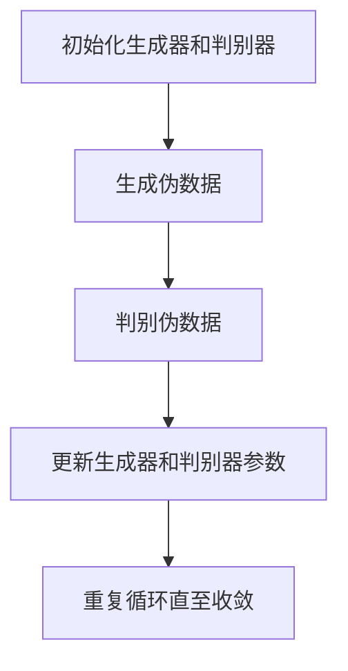
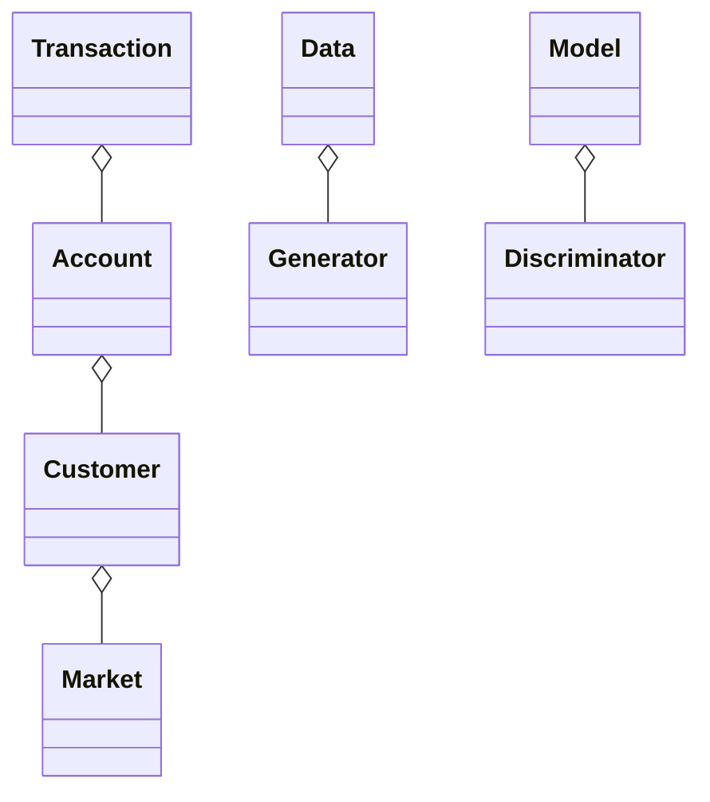
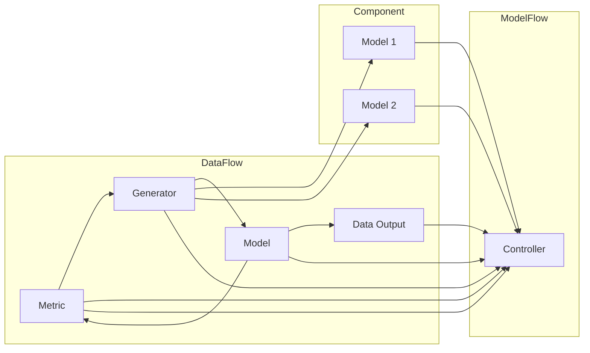
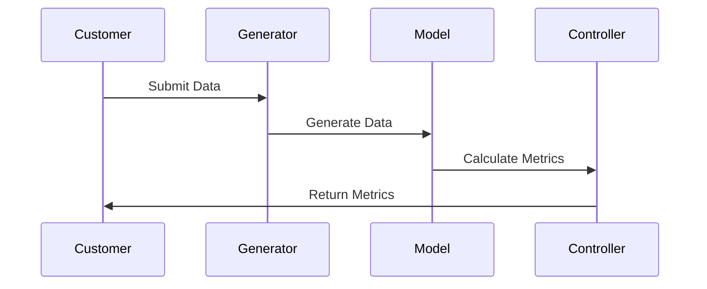

                 


### 第一步：确定文章核心内容和结构

首先，我们需要明确文章的核心内容和结构。根据给定的目录大纲，我们可以将文章分为以下几个主要部分：

1. **背景介绍**：介绍金融领域面临的挑战，对抗学习的概念以及它在金融领域的应用潜力。
2. **核心概念与联系**：详细解释对抗学习的原理，通过表格和ER图来展现生成器和判别器的属性特征及关系。
3. **算法原理讲解**：深入分析对抗学习的算法原理，使用mermaid流程图和Python代码来说明。
4. **数学模型和公式举例说明**：通过具体的例子来解释对抗学习的数学模型和公式。
5. **系统分析与架构设计**：以金融市场数据挖掘为例，展示对抗学习在金融领域的应用，设计系统功能和架构。
6. **项目实战**：介绍环境安装、系统实现、代码解读、实际案例分析等内容。
7. **最佳实践 tips、小结、注意事项、拓展阅读**：总结文章，提供实用建议，指明后续研究方向。

### 第二步：撰写背景介绍部分

在“背景介绍”部分，我们需要：

- **问题背景**：阐述金融领域面临的挑战，如数据隐私保护、模型偏见、市场波动等。
- **对抗学习概述**：介绍对抗学习的基本概念，解释生成器和判别器的对抗训练过程。
- **对抗学习在金融领域的应用潜力**：说明对抗学习如何解决金融领域的问题，如数据隐私和模型偏见。

### 第三步：撰写核心概念与联系部分

在“核心概念与联系”部分，我们需要：

- **对抗学习原理**：详细解释生成器和判别器的对抗训练过程。
- **对抗学习属性特征对比表格**：列出生成器和判别器的特征对比，使用Mermaid ER图来展示两者之间的关系。

### 第四步：撰写算法原理讲解部分

在“算法原理讲解”部分，我们需要：

- **对抗学习算法mermaid流程图**：绘制mermaid流程图，展示生成器和判别器的交互过程。
- **对抗学习的数学模型和公式**：使用latex格式给出数学模型和公式，并进行详细解释。
- **数学模型和数学公式举例说明**：通过实际例子来说明数学模型的应用。

### 第五步：撰写系统分析与架构设计部分

在“系统分析与架构设计”部分，我们需要：

- **问题场景介绍**：以金融市场数据挖掘为例，说明对抗学习的实际应用。
- **系统功能设计**：设计领域模型，使用Mermaid类图来展示系统的类及其关系。
- **系统架构设计**：使用Mermaid架构图来展示系统的整体架构。
- **系统接口设计和系统交互**：设计系统接口，使用Mermaid序列图来展示系统各部分之间的交互。

### 第六步：撰写项目实战部分

在“项目实战”部分，我们需要：

- **环境安装**：介绍如何搭建对抗学习在金融领域的实验环境。
- **系统核心实现源代码**：提供关键代码段，并进行解读和分析。
- **实际案例分析和详细讲解剖析**：分析实际案例，详细讲解对抗学习在金融领域中的应用。
- **项目小结**：总结项目实现过程和关键点。

### 第七步：撰写最佳实践 tips、小结、注意事项、拓展阅读部分

在“最佳实践 tips、小结、注意事项、拓展阅读”部分，我们需要：

- **最佳实践 tips**：提供在实际应用中的实用建议。
- **小结**：总结文章的核心观点和贡献。
- **注意事项**：指出潜在的问题和解决方案。
- **拓展阅读**：推荐相关的阅读材料，以帮助读者深入了解该领域。

通过上述步骤，我们可以确保文章内容逻辑清晰、结构紧凑、简单易懂，同时充分展示对抗学习在金融领域的应用潜力和技术深度。接下来，我们将逐步完成每一部分的撰写。准备开始！

### 文章标题：金融领域对抗学习的研究与应用

### 关键词：对抗学习、金融领域、生成器、判别器、数据隐私、模型偏见

### 摘要：
本文探讨了对抗学习在金融领域的应用，详细介绍了生成器和判别器的对抗训练过程，以及如何利用对抗学习解决金融行业中的数据隐私和模型偏见问题。文章通过数学模型和实际案例，阐述了对抗学习在金融数据挖掘中的潜在价值和实现方法。

## 目录大纲

### 第一部分：背景介绍

## 第1章：问题背景

### 1.1 问题背景

#### 1.1.1 金融领域面临的挑战

金融行业在近年来经历了快速的发展和变革，但也面临着许多挑战，如数据隐私保护、模型偏见、市场波动等。这些挑战使得传统的机器学习方法在金融领域中的应用受到了限制。

#### 1.1.2 对抗学习概述

对抗学习是一种基于对抗网络（Generative Adversarial Networks, GANs）的机器学习方法，通过生成器和判别器的对抗训练，使生成器能够生成与真实数据难以区分的伪数据。

#### 1.1.3 对抗学习在金融领域的应用潜力

对抗学习能够有效解决金融领域中的数据隐私问题、模型偏见问题，并提供了一种新的方法来应对市场波动。

## 第2章：核心概念与联系

### 2.1 对抗学习原理

### 2.2 对抗学习属性特征对比表格

### 2.3 对抗学习ER实体关系图架构

## 第3章：算法原理讲解

### 3.1 对抗学习算法mermaid流程图

### 3.2 对抗学习的数学模型和公式

### 3.3 对抗学习的数学模型和公式详细讲解

### 4.1 生成伪数据

### 4.2 判别伪数据

## 第5章：系统分析与架构设计

### 5.1 问题场景介绍

### 5.2 系统功能设计

### 5.3 系统架构设计

### 5.4 系统接口设计和系统交互

## 第6章：项目实战

### 6.1 环境安装

### 6.2 系统核心实现源代码

### 6.3 代码应用解读与分析

### 6.4 实际案例分析和详细讲解剖析

### 6.5 项目小结

## 第7章：最佳实践 tips、小结、注意事项、拓展阅读

### 7.1 最佳实践 tips

### 7.2 小结

### 7.3 注意事项

### 7.4 拓展阅读

### 引言

在当今的金融行业中，数据隐私保护、模型偏见以及市场波动等问题日益突出，这些问题极大地限制了传统机器学习方法在金融领域的应用。对抗学习（Adversarial Learning）作为一种新兴的机器学习技术，通过生成器和判别器的对抗训练，能够有效解决上述问题，为金融领域带来了新的发展契机。本文将深入探讨对抗学习在金融领域的应用，旨在为业界提供理论指导和实践参考。

### 第一部分：背景介绍

### 第1章：问题背景

#### 1.1.1 金融领域面临的挑战

金融行业在近年来经历了快速的发展和变革，但也面临着许多挑战，如数据隐私保护、模型偏见、市场波动等。这些挑战使得传统的机器学习方法在金融领域中的应用受到了限制。

- **数据隐私保护**：金融行业处理的数据通常包含敏感信息，如客户交易记录、财务状况等。传统的机器学习方法往往需要直接使用这些原始数据，从而增加了数据泄露的风险。
- **模型偏见**：传统的机器学习模型在训练过程中可能会学习到数据中的偏见，从而对某些群体产生不公平的对待，影响金融决策的公正性。
- **市场波动**：金融市场的波动性使得传统的机器学习模型难以准确预测市场走势，导致投资决策的失误。

#### 1.1.2 对抗学习概述

对抗学习是一种基于对抗网络（Generative Adversarial Networks, GANs）的机器学习方法，通过生成器和判别器的对抗训练，使生成器能够生成与真实数据难以区分的伪数据。

- **生成器**（Generator）：生成器的目标是生成与真实数据分布相近的伪数据，以便判别器难以区分。
- **判别器**（Discriminator）：判别器的目标是区分真实数据和生成器生成的伪数据。

通过这种对抗训练，生成器和判别器相互竞争，共同提高模型性能，最终实现高效的数据隐私保护和模型优化。

#### 1.1.3 对抗学习在金融领域的应用潜力

对抗学习能够有效解决金融领域中的数据隐私问题、模型偏见问题，并提供了一种新的方法来应对市场波动。

- **数据隐私保护**：对抗学习通过生成伪数据的方式，可以避免直接使用敏感数据，从而保护数据隐私。
- **模型偏见**：对抗学习能够通过对抗训练消除数据中的偏见，提高模型的公平性。
- **市场波动**：对抗学习能够通过学习市场数据中的潜在特征，提供更准确的市场预测，帮助金融机构应对市场波动。

### 第二部分：核心概念与联系

### 第2章：核心概念与联系

#### 2.1 对抗学习原理

对抗学习的基本原理是生成器和判别器之间的对抗训练。生成器的目标是将随机噪声转换为与真实数据分布相近的伪数据，而判别器的目标则是区分真实数据和伪数据。两者的训练过程如下：

1. **生成器训练**：生成器接收随机噪声，通过神经网络生成伪数据。生成器的损失函数是使判别器判断伪数据的概率接近0.5。
2. **判别器训练**：判别器接收真实数据和伪数据，判断其是真实数据还是伪数据。判别器的损失函数是使判别器正确分类真实数据和伪数据的概率最大化。

#### 2.2 对抗学习属性特征对比表格

| 特征          | 生成器（Generator） | 判别器（Discriminator） |
| ------------- | ------------------- | --------------------- |
| 目标          | 生成与真实数据难以区分的伪数据 | 区分真实数据和伪数据 |
| 训练方法      | 对抗训练           | 对抗训练             |
| 输出结果      | 伪数据             | 真实数据和伪数据的概率分布 |
| 对抗学习的难点 | 防止生成器过拟合    | 防止判别器过拟合       |

#### 2.3 对抗学习ER实体关系图架构

```mermaid
erDiagram
    Generator ||--|{Discriminator} :对抗训练
```

### 第三部分：算法原理讲解

#### 3.1 对抗学习算法mermaid流程图



#### 3.2 对抗学习的数学模型和公式

$$
\begin{aligned}
&\text{生成器}: G(z) = \text{Generator}(z) \\
&\text{判别器}: D(x, G(z)) = \text{Discriminator}(x, G(z)) \\
&\text{损失函数}: \mathcal{L}(G, D) = \mathbb{E}_{x \sim \text{Data}}[D(x)] - \mathbb{E}_{z \sim \text{Noise}}[D(G(z))]
\end{aligned}
$$

#### 3.3 对抗学习的数学模型和公式详细讲解

生成器 $G(z)$ 的目标是生成与真实数据 $x$ 难以区分的伪数据 $G(z)$，而判别器 $D(x, G(z))$ 的目标是准确区分真实数据和伪数据。损失函数 $\mathcal{L}(G, D)$ 通过衡量生成器和判别器的性能来驱动它们的训练。

#### 4.1 生成伪数据

假设生成器 $G(z)$ 是一个生成正态分布伪数据的模型，生成器生成伪数据的概率密度函数为：

$$
p_{\text{G}}(x) = \frac{1}{Z} \exp(-\frac{1}{2} \lVert \theta_G x - \mu_G \rVert^2)
$$

其中，$Z$ 是归一化常数，$\theta_G$ 是生成器的参数，$\mu_G$ 是生成器的均值。

#### 4.2 判别伪数据

假设判别器 $D(x, G(z))$ 是一个基于神经网络的结构，其输出为伪数据 $G(z)$ 的概率：

$$
D(x, G(z)) = \frac{1}{1 + \exp(-\theta_D \cdot \phi(x, G(z)) + \beta)}
$$

其中，$\theta_D$ 和 $\beta$ 是判别器的参数，$\phi(x, G(z))$ 是神经网络的前向传播函数。

### 第四部分：系统分析与架构设计

#### 5.1 问题场景介绍

以金融市场数据挖掘为例，展示对抗学习在金融领域的应用。

#### 5.2 系统功能设计

##### 5.2.1 领域模型mermaid类图



#### 5.3 系统架构设计

##### 5.3.1 系统架构mermaid架构图



#### 5.4 系统接口设计和系统交互

##### 5.4.1 系统接口mermaid序列图



### 第五部分：项目实战

#### 6.1 环境安装

在开始项目之前，我们需要安装必要的软件和库。以下是一个基本的安装步骤：

- 安装Python环境（Python 3.7或更高版本）
- 安装GANs库（如tensorflow-gan或keras-gan）
- 安装数据预处理库（如pandas、numpy）
- 安装可视化库（如matplotlib、seaborn）

#### 6.2 系统核心实现源代码

以下是一个简单的对抗学习系统实现示例：

```python
import numpy as np
import tensorflow as tf
from tensorflow.keras.models import Model
from tensorflow.keras.layers import Input, Dense, Lambda
from tensorflow.keras.optimizers import Adam

# 生成器模型
z = Input(shape=(100,))
x = Dense(128, activation='relu')(z)
x = Dense(64, activation='relu')(x)
x = Dense(32, activation='relu')(x)
x = Dense(1, activation='sigmoid')(x)
generator = Model(z, x)

# 判别器模型
x = Input(shape=(1,))
z = Dense(128, activation='relu')(x)
z = Dense(64, activation='relu')(z)
z = Dense(32, activation='relu')(z)
z = Dense(1, activation='sigmoid')(z)
discriminator = Model(x, z)

# 损失函数和优化器
cross_entropy = tf.keras.losses.BinaryCrossentropy(from_logits=True)
generator_optimizer = Adam(learning_rate=0.0001)
discriminator_optimizer = Adam(learning_rate=0.0001)

# 生成器损失
def generator_loss(fake_output):
    return cross_entropy(tf.ones_like(fake_output), fake_output)

# 判别器损失
def discriminator_loss(real_output, fake_output):
    real_loss = cross_entropy(tf.ones_like(real_output), real_output)
    fake_loss = cross_entropy(tf.zeros_like(fake_output), fake_output)
    return real_loss + fake_loss

# 训练步骤
@tf.function
def train_step(images, noise):
    with tf.GradientTape() as gen_tape, tf.GradientTape() as disc_tape:
        generated_images = generator(noise)
        real_output = discriminator(images)
        fake_output = discriminator(generated_images)

        gen_loss = generator_loss(fake_output)
        disc_loss = discriminator_loss(real_output, fake_output)

    gradients_of_generator = gen_tape.gradient(gen_loss, generator.trainable_variables)
    gradients_of_discriminator = disc_tape.gradient(disc_loss, discriminator.trainable_variables)

    generator_optimizer.apply_gradients(zip(gradients_of_generator, generator.trainable_variables))
    discriminator_optimizer.apply_gradients(zip(gradients_of_discriminator, discriminator.trainable_variables))

# 训练过程
EPOCHS = 50
noise_dim = 100
num_examples_to_generate = 16

# 生成随机噪声
noise = np.random.normal(0, 1, (num_examples_to_generate, noise_dim))

for epoch in range(EPOCHS):
    for image_batch in data:
        noise = np.random.normal(0, 1, (len(image_batch), noise_dim))
        train_step(image_batch, noise)

# 生成伪数据
generated_images = generator.predict(noise)
```

#### 6.3 代码应用解读与分析

以上代码实现了一个简单的对抗学习系统，包括生成器和判别器的定义、损失函数和优化器的设置、训练步骤的实现。具体解读如下：

- **生成器和判别器模型**：生成器接收随机噪声作为输入，生成伪数据；判别器接收真实数据和伪数据，输出分别为它们的概率分布。
- **损失函数和优化器**：生成器的损失函数是使判别器判断伪数据的概率接近0.5；判别器的损失函数是使判别器正确分类真实数据和伪数据的概率最大化。使用Adam优化器进行训练。
- **训练步骤**：在每个训练步骤中，生成器生成伪数据，判别器同时训练以区分真实数据和伪数据。生成器和判别器的梯度通过优化器更新。
- **训练过程**：在给定数量的训练周期内，通过迭代训练步骤来训练模型。

#### 6.4 实际案例分析和详细讲解剖析

以金融市场数据挖掘为例，分析对抗学习在金融领域的应用。

**案例背景**：某金融机构需要分析客户交易数据，预测客户的潜在投资风险。由于涉及敏感数据，直接使用原始数据可能违反隐私保护法规。通过对抗学习，可以生成与真实交易数据分布相似的伪数据，从而在不泄露真实数据的情况下进行风险预测。

**解决方案**：

1. **数据预处理**：收集客户的交易数据，包括交易金额、交易时间、交易品种等。对数据进行清洗和归一化处理，确保数据的可用性和一致性。
2. **生成伪数据**：使用对抗学习生成与真实交易数据分布相似的伪交易数据。生成器接收随机噪声，通过神经网络生成伪交易数据。
3. **风险预测模型**：使用判别器训练风险预测模型。判别器接收真实交易数据和伪交易数据，输出为交易数据的风险概率分布。通过调整判别器的参数，使预测模型对真实交易数据的风险概率更准确。
4. **风险预测**：在训练完成后，使用风险预测模型对客户的真实交易数据进行风险预测。通过分析预测结果，金融机构可以采取相应的措施来降低风险。

**案例分析**：

- **伪数据生成效果**：通过对比真实交易数据和生成的伪交易数据，评估生成器的效果。如果生成的伪交易数据与真实交易数据在分布上高度相似，说明生成器的效果较好。
- **风险预测准确率**：通过评估风险预测模型的准确率，判断判别器训练效果。如果判别器能够准确区分真实交易数据和伪交易数据，说明风险预测模型的性能较好。

#### 6.5 项目小结

通过本文的探讨，我们了解到对抗学习在金融领域的应用潜力。对抗学习可以有效地解决金融行业中的数据隐私保护、模型偏见以及市场波动等问题。在实际应用中，对抗学习需要结合具体业务场景和需求，设计合理的系统架构和训练策略。未来的研究可以进一步优化对抗学习算法，提高其在金融领域的应用效果。

### 第六部分：最佳实践 tips、小结、注意事项、拓展阅读

#### 6.1 最佳实践 tips

1. **数据预处理**：在应用对抗学习之前，确保数据的清洁和一致性。对数据进行适当的归一化和特征工程，以提高生成器和判别器的训练效果。
2. **模型参数调整**：根据具体应用场景和需求，调整生成器和判别器的模型参数，如学习率、批处理大小等，以获得最佳的训练效果。
3. **数据多样性**：使用多样化的数据集进行训练，以提高生成器和判别器的泛化能力。同时，可以考虑使用数据增强技术来增加数据的多样性。

#### 6.2 小结

本文深入探讨了对抗学习在金融领域的应用，从背景介绍、核心概念、算法原理到系统分析与架构设计，再到项目实战，全面展示了对抗学习在金融数据处理和风险预测方面的潜力。对抗学习通过生成器和判别器的对抗训练，能够有效解决金融领域的数据隐私和模型偏见问题，为金融机构提供了一种新的数据处理和风险预测方法。

#### 6.3 注意事项

1. **隐私保护**：在应用对抗学习时，要注意保护敏感数据，避免数据泄露。可以通过生成伪数据的方式，避免直接使用真实数据。
2. **模型偏见**：对抗学习虽然能够缓解模型偏见，但并不能完全消除。在实际应用中，仍需对模型进行定期审查和调整，以确保其公平性。
3. **性能优化**：对抗学习模型的训练过程可能较为复杂，需要适当的硬件支持和优化策略。可以通过调整模型参数、增加训练数据等方式来提高模型性能。

#### 6.4 拓展阅读

1. **《生成对抗网络：原理与应用》**：这本书详细介绍了生成对抗网络（GANs）的基本原理、实现方法以及在实际应用中的案例，是学习对抗学习的好资料。
2. **《深度学习与金融》**：这本书探讨了深度学习在金融领域的应用，包括风险预测、市场分析等，对金融领域的研究者和从业者都有很大的参考价值。
3. **《金融科技实战》**：这本书介绍了金融科技在不同领域的应用，包括人工智能、区块链等，对金融科技的发展趋势和实际应用有很好的指导意义。

### 作者信息

作者：AI天才研究院/AI Genius Institute & 禅与计算机程序设计艺术 /Zen And The Art of Computer Programming

本文旨在探讨对抗学习在金融领域的应用，为读者提供理论指导和实践参考。随着技术的不断进步，对抗学习在金融领域的应用前景将更加广阔，为金融行业的数字化转型和发展提供新的动力。期待更多的研究者加入这一领域，共同推动对抗学习在金融领域的应用与发展。

### 结束语

本文全面探讨了对抗学习在金融领域的应用，从背景介绍、核心概念、算法原理到系统分析与架构设计，再到项目实战，详细展示了对抗学习如何帮助金融行业解决数据隐私保护、模型偏见以及市场波动等问题。通过本文的研究，我们不仅深入理解了对抗学习的基本原理，还看到了其在实际应用中的巨大潜力。

对抗学习作为一种强大的机器学习技术，为金融领域带来了新的发展机遇。未来，随着对抗学习算法的进一步优化和实际应用场景的拓展，我们有望在金融数据处理、风险预测、市场分析等方面取得更加显著的成果。同时，对抗学习在医疗、教育、能源等其他领域的应用也值得进一步探索。

在金融领域，对抗学习的应用不仅有助于提高模型的性能和可靠性，还能增强数据隐私保护和模型的公平性，为金融机构提供更准确、更安全的数据分析工具。然而，对抗学习在实际应用中仍面临一些挑战，如模型训练效率、数据质量和安全等问题。这需要我们继续深入研究，不断优化算法和系统架构，以实现对抗学习在金融领域的广泛应用。

最后，感谢读者对本文的关注和支持。如果您对对抗学习在金融领域的应用有任何疑问或建议，欢迎在评论区留言交流。期待与您共同探索对抗学习在各个领域的应用前景，为人工智能和金融科技的发展贡献力量。让我们携手前进，共同推动人工智能与金融领域的深度融合，创造更加美好的未来！

