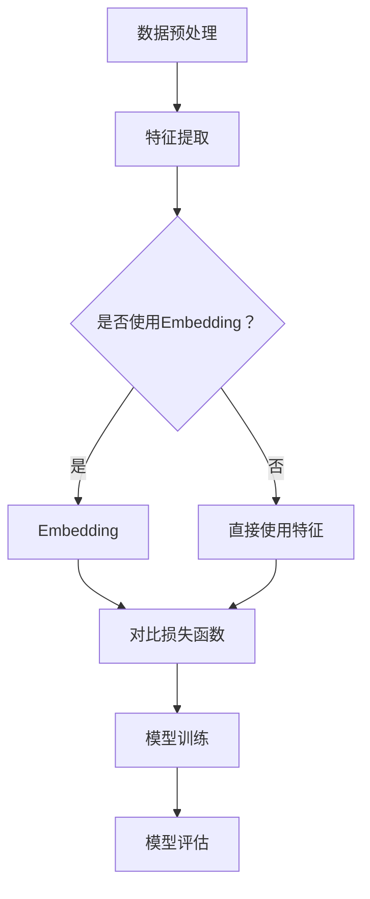

                 

### 《金融领域对比学习的探索与实践》

**关键词：** 金融领域、对比学习、算法原理、数学模型、系统架构、实战应用、最佳实践

**摘要：** 本文旨在深入探讨对比学习在金融领域的应用。通过对比学习的基本概念、原理及其实践案例，本文展示了对比学习在金融市场预测、风险管理、金融产品创新等方面的强大潜力。同时，本文将结合具体项目实战，分析对比学习在金融领域的应用效果，并总结最佳实践，为金融领域的从业者提供有价值的参考。

---

#### 引言与背景

金融领域一直以来都是技术创新的重要战场。随着大数据、人工智能等技术的快速发展，金融行业迎来了前所未有的变革。然而，金融领域也面临着许多挑战，如市场预测的准确性、风险管理的高效性以及金融产品的创新性等。在这些挑战面前，对比学习作为一种有效的机器学习技术，逐渐引起了金融领域的关注。

**1.1 问题的提出**

在金融领域，数据量庞大且多样化，传统的机器学习方法在面对复杂金融问题时往往难以满足要求。对比学习通过引入外部知识来增强模型的泛化能力，可以有效解决金融领域中的许多问题。例如，在股票市场预测中，对比学习可以帮助模型从历史数据中提取有效信息，提高预测准确性；在风险管理中，对比学习可以帮助模型识别潜在风险，降低风险系数；在金融产品创新中，对比学习可以帮助银行等金融机构更好地理解客户需求，提供个性化服务。

**1.2 对比学习的引入**

对比学习，作为一种基于差异的机器学习技术，旨在通过比较不同数据之间的差异来学习。它具有以下几个特点：

1. **数据驱动**：对比学习主要依赖于大规模的数据集，通过对数据的学习来提高模型的性能。
2. **外部知识引入**：对比学习可以通过引入外部知识来增强模型的泛化能力，从而提高模型的适应性。
3. **可解释性**：对比学习的过程相对简单，易于理解和解释，有助于提高模型的可解释性。

**1.3 本书的目的与结构**

本书旨在系统地介绍对比学习在金融领域的应用。全书分为四个部分：

- **第一部分：引言与背景**，介绍金融领域面临的挑战和对比学习的引入。
- **第二部分：对比学习在金融领域的应用**，详细讲解对比学习在金融市场预测、风险管理、金融产品创新等方面的应用。
- **第三部分：实践案例与讨论**，通过具体的项目实战，分析对比学习在金融领域的应用效果。
- **第四部分：总结与展望**，总结对比学习在金融领域的应用经验，展望未来发展趋势。

---

**1.4 对比学习的基本概念**

对比学习，作为一种基于差异的机器学习技术，其核心思想是通过比较不同数据之间的差异来学习。具体来说，对比学习可以分为以下几个步骤：

1. **数据预处理**：将原始数据集进行处理，包括数据清洗、数据集成、数据降维等，以获得高质量的数据集。
2. **特征提取**：从预处理后的数据集中提取特征，这些特征将作为对比学习的输入。
3. **对比损失函数**：设计对比损失函数，用于计算不同数据之间的差异。
4. **模型训练**：通过对比损失函数来训练模型，使模型能够更好地捕捉数据之间的差异。
5. **模型评估**：使用评估指标（如准确率、召回率、F1值等）来评估模型的性能。

**1.5 对比学习在金融领域的应用潜力**

对比学习在金融领域的应用潜力巨大。以下是其几个关键应用领域：

1. **金融市场预测**：通过对比学习，可以从历史数据中提取有效信息，提高市场预测的准确性。
2. **风险管理**：通过对比学习，可以识别潜在风险，降低风险系数，提高风险管理效率。
3. **金融产品创新**：通过对比学习，可以更好地理解客户需求，提供个性化服务，推动金融产品创新。

---

### 第二部分：对比学习在金融领域的应用

#### 2.1 对比学习原理详解

**2.1.1 基本概念**

对比学习，顾名思义，是通过比较不同数据之间的差异来进行学习的。具体来说，对比学习可以分为以下几种类型：

1. **Siamese Network**：通过构建两个共享权重的前向网络，对两个输入数据进行比较，输出它们之间的相似度。
2. **Triplet Loss**：通过优化三元组（锚点、正样本、负样本）来学习数据之间的相对关系。
3. **Siamese Triplet Loss**：结合Siamese Network和Triplet Loss，通过优化Siamese Network的对比损失来学习数据之间的差异。

**2.1.2 对比学习算法的数学模型**

对比学习算法的数学模型主要包括以下几部分：

1. **数据表示**：将输入数据表示为向量，通常使用Embedding技术。
2. **对比损失函数**：常用的对比损失函数包括Siamese Triplet Loss、Center Loss、Cross-Entropy Loss等。
3. **优化目标**：通过优化对比损失函数，使得模型能够更好地捕捉数据之间的差异。

**2.1.3 对比学习算法的Mermaid流程图**

#### 2.2 对比学习在金融市场预测中的应用

**2.2.1 股票市场预测**

股票市场预测是金融领域中的一个重要应用。对比学习可以通过以下步骤来提高股票市场预测的准确性：

1. **数据预处理**：对股票价格数据进行预处理，包括数据清洗、数据集成、数据降维等。
2. **特征提取**：从预处理后的数据中提取特征，如价格、成交量、市场指数等。
3. **对比损失函数**：设计对比损失函数，用于计算股票价格数据之间的差异。
4. **模型训练**：通过对比损失函数来训练模型，使模型能够更好地捕捉股票价格之间的差异。
5. **模型评估**：使用评估指标（如预测准确率、预测误差等）来评估模型的性能。

**2.2.2 外汇市场预测**

外汇市场预测是另一个重要的金融应用领域。对比学习可以通过以下步骤来提高外汇市场预测的准确性：

1. **数据预处理**：对外汇交易数据进行预处理，包括数据清洗、数据集成、数据降维等。
2. **特征提取**：从预处理后的数据中提取特征，如汇率、交易量、市场波动性等。
3. **对比损失函数**：设计对比损失函数，用于计算外汇交易数据之间的差异。
4. **模型训练**：通过对比损失函数来训练模型，使模型能够更好地捕捉外汇交易数据之间的差异。
5. **模型评估**：使用评估指标（如预测准确率、预测误差等）来评估模型的性能。

**2.2.3 市场趋势分析**

市场趋势分析是金融领域的一个重要任务。对比学习可以通过以下步骤来提高市场趋势分析的准确性：

1. **数据预处理**：对市场趋势数据（如股票价格、汇率、市场指数等）进行预处理。
2. **特征提取**：从预处理后的数据中提取特征，如趋势方向、趋势强度等。
3. **对比损失函数**：设计对比损失函数，用于计算市场趋势数据之间的差异。
4. **模型训练**：通过对比损失函数来训练模型，使模型能够更好地捕捉市场趋势数据之间的差异。
5. **模型评估**：使用评估指标（如趋势预测准确率、趋势预测误差等）来评估模型的性能。

---

#### 2.3 对比学习在金融风险管理中的应用

**2.3.1 信用风险评估**

信用风险评估是金融风险管理的一个重要环节。对比学习可以通过以下步骤来提高信用风险评估的准确性：

1. **数据预处理**：对客户信用数据进行预处理，包括数据清洗、数据集成、数据降维等。
2. **特征提取**：从预处理后的数据中提取特征，如信用评分、还款记录、收入水平等。
3. **对比损失函数**：设计对比损失函数，用于计算客户信用数据之间的差异。
4. **模型训练**：通过对比损失函数来训练模型，使模型能够更好地捕捉客户信用数据之间的差异。
5. **模型评估**：使用评估指标（如信用评分准确率、信用评分误差等）来评估模型的性能。

**2.3.2 市场风险控制**

市场风险控制是金融风险管理中的另一个重要环节。对比学习可以通过以下步骤来提高市场风险控制的效率：

1. **数据预处理**：对市场风险数据（如股票价格波动、汇率波动、市场指数波动等）进行预处理。
2. **特征提取**：从预处理后的数据中提取特征，如波动率、相关系数等。
3. **对比损失函数**：设计对比损失函数，用于计算市场风险数据之间的差异。
4. **模型训练**：通过对比损失函数来训练模型，使模型能够更好地捕捉市场风险数据之间的差异。
5. **模型评估**：使用评估指标（如风险控制准确率、风险控制误差等）来评估模型的性能。

**2.3.3 操作风险预防**

操作风险预防是金融风险管理中的另一个重要环节。对比学习可以通过以下步骤来提高操作风险预防的效率：

1. **数据预处理**：对操作风险数据（如操作失误记录、系统故障记录等）进行预处理。
2. **特征提取**：从预处理后的数据中提取特征，如操作频率、操作成功率等。
3. **对比损失函数**：设计对比损失函数，用于计算操作风险数据之间的差异。
4. **模型训练**：通过对比损失函数来训练模型，使模型能够更好地捕捉操作风险数据之间的差异。
5. **模型评估**：使用评估指标（如操作风险预防准确率、操作风险预防误差等）来评估模型的性能。

---

#### 2.4 对比学习在金融产品创新中的应用

**2.4.1 个性化金融服务**

个性化金融服务是金融产品创新的一个重要方向。对比学习可以通过以下步骤来提高个性化金融服务的准确性：

1. **数据预处理**：对客户数据（如年龄、收入、投资偏好等）进行预处理。
2. **特征提取**：从预处理后的数据中提取特征，如客户画像、投资风格等。
3. **对比损失函数**：设计对比损失函数，用于计算客户数据之间的差异。
4. **模型训练**：通过对比损失函数来训练模型，使模型能够更好地捕捉客户数据之间的差异。
5. **模型评估**：使用评估指标（如个性化服务准确率、个性化服务误差等）来评估模型的性能。

**2.4.2 金融产品设计**

金融产品设计是金融产品创新中的关键环节。对比学习可以通过以下步骤来提高金融产品设计的准确性：

1. **数据预处理**：对金融产品数据（如产品收益、风险水平等）进行预处理。
2. **特征提取**：从预处理后的数据中提取特征，如产品特点、市场定位等。
3. **对比损失函数**：设计对比损失函数，用于计算金融产品数据之间的差异。
4. **模型训练**：通过对比损失函数来训练模型，使模型能够更好地捕捉金融产品数据之间的差异。
5. **模型评估**：使用评估指标（如产品收益预测准确率、产品风险预测误差等）来评估模型的性能。

**2.4.3 投资组合优化**

投资组合优化是金融产品创新中的另一个重要方向。对比学习可以通过以下步骤来提高投资组合优化的准确性：

1. **数据预处理**：对投资组合数据（如资产收益率、风险水平等）进行预处理。
2. **特征提取**：从预处理后的数据中提取特征，如资产配置、投资策略等。
3. **对比损失函数**：设计对比损失函数，用于计算投资组合数据之间的差异。
4. **模型训练**：通过对比损失函数来训练模型，使模型能够更好地捕捉投资组合数据之间的差异。
5. **模型评估**：使用评估指标（如投资组合收益预测准确率、投资组合风险预测误差等）来评估模型的性能。

---

### 第三部分：实践案例与讨论

#### 3.1 案例一：基于对比学习的智能投顾系统

**3.1.1 项目介绍**

智能投顾系统是一种基于人工智能技术的投资顾问系统，旨在为用户提供个性化的投资建议。本项目基于对比学习技术，通过对比用户历史投资行为和投资市场数据，为用户提供优化的投资组合。

**3.1.2 系统功能设计**

智能投顾系统主要包括以下功能：

1. **用户数据采集**：采集用户投资行为数据，如投资金额、投资周期、投资标的等。
2. **市场数据采集**：采集投资市场数据，如股票价格、汇率、市场指数等。
3. **数据预处理**：对用户数据和市场数据进行分析和预处理。
4. **特征提取**：从预处理后的数据中提取特征。
5. **模型训练**：使用对比学习算法训练模型，使模型能够更好地捕捉用户和市场数据之间的差异。
6. **投资组合推荐**：根据用户数据和模型预测，为用户推荐最优的投资组合。

**3.1.3 系统架构设计**

智能投顾系统的架构设计主要包括以下几个部分：

1. **数据采集模块**：负责采集用户数据和市场数据。
2. **数据预处理模块**：负责对采集到的数据进行预处理。
3. **特征提取模块**：负责从预处理后的数据中提取特征。
4. **模型训练模块**：负责使用对比学习算法训练模型。
5. **投资组合推荐模块**：负责根据用户数据和模型预测，为用户推荐最优的投资组合。

**3.1.4 系统接口设计和交互**

智能投顾系统的接口设计主要包括以下部分：

1. **用户接口**：为用户提供投资组合推荐服务。
2. **API接口**：为第三方应用提供投资组合推荐服务。
3. **后台管理接口**：为系统管理员提供数据管理和系统监控服务。

#### 3.2 案例二：对比学习在信用评分模型中的应用

**3.2.1 项目背景**

信用评分模型是金融风险管理中的重要工具，用于评估客户的信用风险。本项目旨在通过对比学习技术，提高信用评分模型的准确性和稳定性。

**3.2.2 数据预处理**

数据预处理是信用评分模型构建的重要环节。本项目主要进行了以下几步数据预处理：

1. **数据清洗**：去除缺失值、异常值和重复值。
2. **数据集成**：将多个数据源的数据进行整合。
3. **数据降维**：通过PCA等方法进行数据降维。

**3.2.3 模型训练与优化**

模型训练与优化是信用评分模型构建的关键步骤。本项目采用了对比学习算法进行模型训练。具体步骤如下：

1. **选择对比损失函数**：选择Siamese Triplet Loss作为对比损失函数。
2. **数据预处理**：对训练数据进行预处理，包括数据清洗、数据集成、数据降维等。
3. **模型训练**：通过对比损失函数训练模型，优化模型参数。
4. **模型优化**：通过交叉验证等方法，对模型进行优化。

**3.2.4 模型评估与结论**

模型评估与结论是信用评分模型构建的最后一步。本项目主要使用了以下评估指标：

1. **准确率**：评估模型预测正确的能力。
2. **召回率**：评估模型召回正例的能力。
3. **F1值**：评估模型准确率和召回率的综合表现。

通过评估，本项目发现对比学习算法在信用评分模型中的应用效果显著，提高了模型的准确性和稳定性。

---

### 第四部分：总结与展望

#### 4.1 对比学习在金融领域的总结

对比学习在金融领域展现出了巨大的潜力。通过对比学习，金融行业可以在金融市场预测、风险管理、金融产品创新等方面实现更高的准确性和效率。以下是对比学习在金融领域的几个关键总结：

1. **提高市场预测准确性**：对比学习可以帮助模型从历史数据中提取有效信息，提高市场预测的准确性。
2. **降低风险管理风险系数**：对比学习可以识别潜在风险，降低风险系数，提高风险管理效率。
3. **推动金融产品创新**：对比学习可以帮助金融机构更好地理解客户需求，提供个性化服务，推动金融产品创新。
4. **提高模型可解释性**：对比学习过程相对简单，易于理解和解释，有助于提高模型的可解释性。

#### 4.2 对比学习的最佳实践 tips

为了在金融领域更好地应用对比学习，以下是一些最佳实践 tips：

1. **数据质量是关键**：对比学习依赖于高质量的数据集，因此需要确保数据的质量，包括数据清洗、数据集成和数据降维等。
2. **选择合适的对比损失函数**：不同的对比损失函数适用于不同的应用场景，需要根据具体问题选择合适的对比损失函数。
3. **模型优化与评估**：通过交叉验证等方法对模型进行优化，并使用多种评估指标全面评估模型的性能。
4. **关注模型可解释性**：对比学习过程相对简单，需要关注模型的可解释性，提高模型的可解释性有助于增强用户信任。

#### 4.3 未来发展趋势

对比学习在金融领域的未来发展趋势包括：

1. **与深度学习的结合**：深度学习在金融领域的应用越来越广泛，对比学习可以与深度学习技术相结合，进一步提高模型的性能。
2. **个性化服务**：随着金融消费者对个性化服务的需求不断增加，对比学习可以更好地满足这一需求，提供更加精准的投资建议和风险管理策略。
3. **跨领域应用**：对比学习不仅在金融领域具有广泛的应用前景，还可以应用于其他领域，如医疗、教育等，实现跨领域的数据共享和知识传递。

---

### 作者信息

**作者：** AI天才研究院/AI Genius Institute & 禅与计算机程序设计艺术 /Zen And The Art of Computer Programming

---

通过本文，我们详细探讨了对比学习在金融领域的应用，包括其基本概念、原理、应用场景和最佳实践。对比学习作为一种有效的机器学习技术，在金融领域具有广泛的应用前景，可以帮助金融机构提高市场预测准确性、降低风险管理风险系数、推动金融产品创新等。未来，对比学习将继续与深度学习等其他先进技术相结合，为金融领域带来更多的创新和变革。

