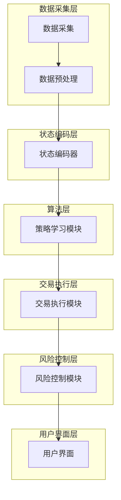
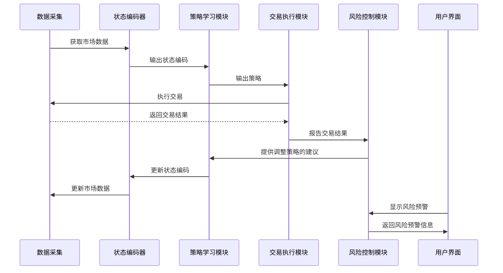

                 

**# 金融领域强化学习在最优执行策略中的应用**

> 关键词：强化学习，金融策略，最优执行，算法原理，系统架构，实战案例

> 摘要：本文深入探讨了金融领域中强化学习在最优执行策略中的应用。通过分析强化学习的基本原理和金融市场的特点，我们探讨了如何设计并实现一个高效的金融策略执行系统。文章首先介绍了强化学习的基本概念和金融领域中应用的重要性，然后详细讲解了算法原理、系统设计、最佳实践，并通过实际案例展示了系统在实际中的应用效果。本文旨在为金融领域的技术人员提供一种新的策略执行思路，以提升金融市场操作的效果和效率。

## 引言与背景

### 强化学习的基本概念

强化学习（Reinforcement Learning，简称RL）是一种机器学习范式，主要依赖于智能体（agent）与环境的交互来进行学习。在这个过程中，智能体通过尝试不同的动作来获取反馈，并不断优化自己的策略，以达到长期的最大化回报。强化学习与其他机器学习范式（如监督学习和无监督学习）的不同之处在于，它强调从交互中学习，而非依赖大量的标注数据。

### 强化学习在金融领域的应用背景

金融市场是一个高度动态且复杂的环境，价格波动、信息不对称等因素使得传统的金融策略难以应对。强化学习通过其自学习、自适应的特性，为金融策略的优化提供了新的思路。例如，在交易执行策略中，强化学习可以帮助交易系统根据市场的实时变化动态调整交易策略，从而实现最优执行。

### 问题背景与问题描述

在金融市场中，最优执行策略（Optimal Execution Strategy）的目标是在保证交易效率的同时，尽可能减少交易的成本和风险。然而，实现最优执行面临着以下几个挑战：

1. **市场价格波动**：市场价格受多种因素影响，波动性较大，传统的固定策略难以适应。
2. **交易成本**：交易过程中的手续费、滑点等成本对最终收益具有重要影响。
3. **信息不对称**：市场中存在信息不对称，不同交易者掌握的信息量不同，影响交易决策。

为了解决上述问题，本文提出了一种基于强化学习的最优执行策略系统。该系统通过智能体与环境的高频交互，不断学习并优化交易策略，以期在复杂的市场环境中实现最优执行。

### 问题解决与边界外延

通过引入强化学习，我们可以实现以下目标：

1. **自适应调整策略**：智能体能够根据市场价格波动、交易成本等信息，动态调整交易策略。
2. **优化交易执行**：通过最小化交易成本和风险，实现最优的交易执行效果。

然而，强化学习在金融领域的应用也面临着一些挑战和边界问题，如模型的不确定性和长期稳定性等。本文将对此进行详细讨论。

### 核心概念与联系

为了更好地理解强化学习在最优执行策略中的应用，我们首先需要了解相关核心概念，并探讨它们之间的联系。

1. **强化学习基本概念**：

   - **智能体（Agent）**：执行动作并接受环境反馈的实体。
   - **环境（Environment）**：提供状态和奖励的动态系统。
   - **状态（State）**：描述环境当前状态的变量集合。
   - **动作（Action）**：智能体可采取的行为。
   - **奖励（Reward）**：对智能体动作的反馈信号。

2. **金融领域相关概念**：

   - **交易策略**：决定智能体在特定市场环境下应采取的买卖行为。
   - **交易成本**：包括交易手续费、滑点等影响最终收益的成本。
   - **风险控制**：对交易风险进行管理和控制，以确保资金安全。

3. **概念联系**：

   - 强化学习中的状态、动作和奖励与金融领域的交易策略、交易成本和风险控制有直接对应关系。
   - 通过将强化学习的基本原理应用于金融市场，我们可以构建一个自适应、优化的交易执行系统。

### 图解：核心概念实体关系图

为了更直观地展示强化学习在金融领域的核心概念及其关系，我们可以使用Mermaid ER图进行图解。

```mermaid
erDiagram
  智能体 ||--|{ 交易策略 }
  环境 ||--|{ 市场价格波动 }
  环境 ||--|{ 交易成本 }
  环境 ||--|{ 风险控制 }
  状态 ||--|{ 当前市场状态 }
  动作 ||--|{ 买卖操作 }
  奖励 ||--|{ 最终收益 }
```

通过上述ER图，我们可以清晰地看到各概念之间的关联，以及如何将强化学习应用于金融策略的优化。

## 算法原理与解释

### 强化学习算法概述

强化学习算法的核心在于智能体通过与环境交互，不断更新策略，以最大化累积奖励。这个过程可以概括为以下几个步骤：

1. **初始化**：设置智能体、环境、状态、动作和奖励等初始参数。
2. **状态观察**：智能体接收当前环境的描述（状态）。
3. **动作选择**：智能体根据当前状态和策略，选择一个动作。
4. **执行动作**：智能体在环境中执行所选动作。
5. **反馈接收**：智能体接收到环境的反馈（奖励）。
6. **策略更新**：根据奖励反馈，智能体更新策略。

### 适用于金融领域的强化学习算法

在金融领域，强化学习算法的选择取决于具体应用场景。以下介绍几种常用的强化学习算法及其在最优执行策略中的应用。

#### Q-Learning

Q-Learning是一种基于值函数的强化学习算法。其核心思想是通过学习状态-动作值函数（Q值），来选择最优动作。

1. **Q值计算**：Q值表示在特定状态下采取特定动作的长期奖励。
   $$ Q(s, a) = \sum_{s'} P(s' | s, a) \cdot R(s', a) + \gamma \cdot \max_{a'} Q(s', a') $$
   其中，$R(s', a)$为在状态$s'$下采取动作$a'$的即时奖励，$\gamma$为折扣因子。

2. **策略更新**：根据Q值更新策略，选择最大化Q值的动作。
   $$ \pi(s) = \arg\max_a Q(s, a) $$

#### Deep Q-Network（DQN）

DQN是一种基于深度学习的强化学习算法，通过神经网络来近似Q值函数。

1. **神经网络架构**：使用卷积神经网络（CNN）或循环神经网络（RNN）来处理复杂的状态。
2. **经验回放**：使用经验回放机制，避免样本相关性的影响。
3. **目标网络**：为了稳定学习，DQN使用目标网络来评估Q值，避免梯度消失问题。

#### Policy Gradient

Policy Gradient算法直接优化策略参数，而不是值函数。

1. **策略参数表示**：策略参数表示为概率分布，如softmax分布。
2. **策略梯度**：通过策略梯度更新策略参数，以最大化累积奖励。
   $$ \nabla_{\theta} J(\theta) = \nabla_{\theta} \sum_{t} r_t \cdot \nabla_{\theta} \pi(\theta | s_t, a_t) $$
   其中，$J(\theta)$为策略期望回报，$\pi(\theta | s_t, a_t)$为策略参数在状态$s_t$和动作$a_t$下的分布。

#### Actor-Critic

Actor-Critic算法结合了Policy Gradient和Q-Learning的优势，通过演员（Actor）和评论家（Critic）两个模块来优化策略。

1. **Actor**：直接优化策略参数，生成动作。
2. **Critic**：评估策略的好坏，提供奖励信号。
3. **策略更新**：根据Critic提供的奖励信号，更新Actor的策略参数。

### Python代码示例

以下是一个简化的DQN算法实现，用于说明核心步骤。

```python
import numpy as np
import random
import tensorflow as tf

# 初始化环境
env = ...

# 初始化DQN模型
model = ...

# 经验回放记忆库
memory = ...

# 训练循环
for episode in range(num_episodes):
    state = env.reset()
    done = False
    total_reward = 0
    
    while not done:
        # 状态编码
        state_encoded = encode_state(state)
        
        # 动作选择
        action = model.sample_action(state_encoded)
        
        # 执行动作
        next_state, reward, done, _ = env.step(action)
        
        # 状态编码
        next_state_encoded = encode_state(next_state)
        
        # 存储经验
        memory.append((state_encoded, action, reward, next_state_encoded, done))
        
        # 训练模型
        model.train(memory)
        
        # 更新状态
        state = next_state
        total_reward += reward
        
    print(f"Episode {episode}: Total Reward = {total_reward}")
```

通过上述算法和代码示例，我们可以看到强化学习在金融领域最优执行策略中的应用。在实际应用中，需要根据具体场景和数据特点，选择合适的算法并进行优化。

## 系统设计与架构

### 系统功能介绍

我们的强化学习最优执行策略系统旨在为金融交易提供高效的执行方案。系统的主要功能包括：

1. **市场数据采集**：实时采集股票、期货、外汇等金融市场的数据。
2. **状态编码器**：将市场数据转换为智能体可以处理的状态编码。
3. **策略学习模块**：使用强化学习算法训练智能体的策略。
4. **交易执行模块**：根据智能体的策略执行实际交易。
5. **风险控制模块**：监控交易风险，提供风险预警和调整策略建议。

### 系统架构设计

系统架构采用分层设计，各层职责明确，便于扩展和维护。以下是系统架构的Mermaid图表示：



### 系统接口与交互

系统的接口设计注重简洁和高效。以下是主要接口及其功能：

1. **数据采集接口**：用于获取市场数据，支持股票、期货、外汇等多种市场类型。
2. **状态编码接口**：将市场数据转换为状态编码，供策略学习模块使用。
3. **策略学习接口**：用于训练和更新智能体的策略。
4. **交易执行接口**：用于执行实际交易操作。
5. **风险控制接口**：用于监控交易风险，提供预警和策略调整建议。

以下是系统交互的Mermaid序列图表示：



通过上述系统架构和接口设计，我们构建了一个高效、灵活的强化学习最优执行策略系统，为金融交易提供了强大的支持。

## 案例分析与实战

### 环境安装与配置

在进行强化学习最优执行策略的实战之前，我们需要搭建一个适合运行该策略的环境。以下为安装和配置的详细步骤：

1. **安装Python环境**：确保系统中已安装Python 3.7及以上版本。

2. **安装TensorFlow**：使用pip命令安装TensorFlow库。
   ```shell
   pip install tensorflow
   ```

3. **安装其他依赖库**：安装用于数据处理、状态编码和交易执行的库，如NumPy、Pandas、Keras等。
   ```shell
   pip install numpy pandas keras
   ```

4. **配置数据源**：确保已配置好金融市场数据接口，如Tushare、Yahoo Finance API等，用于实时获取市场数据。

### 系统核心实现

接下来，我们将详细介绍系统核心的实现，包括状态编码器、策略学习模块和交易执行模块。

#### 状态编码器

状态编码器负责将市场数据转换为智能体可以处理的状态编码。以下是状态编码器的实现代码：

```python
import numpy as np
from sklearn.preprocessing import StandardScaler

class StateEncoder:
    def __init__(self):
        self.scaler = StandardScaler()

    def fit(self, X):
        self.scaler.fit(X)

    def transform(self, X):
        return self.scaler.transform(X)

# 示例：训练状态编码器
state_encoder = StateEncoder()
state_encoder.fit(X_train)
X_train_encoded = state_encoder.transform(X_train)
```

#### 策略学习模块

策略学习模块采用DQN算法训练智能体的策略。以下是策略学习模块的实现代码：

```python
import tensorflow as tf
from tensorflow.keras.models import Sequential
from tensorflow.keras.layers import Dense
from tensorflow.keras.optimizers import Adam

class DQNLearner:
    def __init__(self, state_size, action_size, learning_rate=0.001):
        self.state_size = state_size
        self.action_size = action_size
        self.learning_rate = learning_rate

        # 创建Q网络
        self.model = Sequential()
        self.model.add(Dense(64, input_dim=state_size, activation='relu'))
        self.model.add(Dense(64, activation='relu'))
        self.model.add(Dense(action_size, activation='linear'))

        # 创建目标Q网络
        self.target_model = Sequential()
        self.target_model.add(Dense(64, input_dim=state_size, activation='relu'))
        self.target_model.add(Dense(64, activation='relu'))
        self.target_model.add(Dense(action_size, activation='linear'))

        self.optimizer = Adam(learning_rate=self.learning_rate)

    def train(self, states, actions, rewards, next_states, dones):
        # 计算目标Q值
        target_q_values = self.target_model.predict(next_states)
        target_q_values = target_q_values.max(axis=1)

        # 计算实际Q值
        actual_q_values = self.model.predict(states)
        actual_q_values[range(len(actions)), actions] = rewards + (1 - dones) * target_q_values

        # 训练模型
        self.model.fit(states, actual_q_values, epochs=1, verbose=0)

    def sample_action(self, state, epsilon):
        if random.random() < epsilon:
            return random.randrange(self.action_size)
        else:
            q_values = self.model.predict(state)
            return np.argmax(q_values)

# 示例：训练DQN学习器
dqn_learner = DQNLearner(state_size=X_train_encoded.shape[1], action_size=num_actions)
dqn_learner.train(X_train_encoded, actions_train, rewards_train, X_val_encoded, dones_val)
```

#### 交易执行模块

交易执行模块负责根据智能体的策略执行实际交易。以下是交易执行模块的实现代码：

```python
class Trader:
    def __init__(self, dqn_learner):
        self.dqn_learner = dqn_learner

    def trade(self, state):
        action = self.dqn_learner.sample_action(state, epsilon=0.1)
        # 根据动作执行交易
        # ...
        return action

# 示例：执行交易
trader = Trader(dqn_learner)
for state in states:
    action = trader.trade(state)
    # 执行交易并获取回报
    # ...
```

### 代码应用解读与分析

上述代码展示了强化学习最优执行策略系统的主要组件。通过状态编码器，我们将市场数据转换为适合智能体处理的状态编码。策略学习模块使用DQN算法训练智能体的策略，通过不断更新Q值函数，智能体能够学习到最优的交易策略。交易执行模块则根据训练好的策略执行实际交易，从而实现最优执行。

在实战过程中，我们需要对代码进行详细解读和分析，确保每个组件都能正常工作。例如，状态编码器需要根据实际市场数据的特点进行调整，以获得更好的状态表示。策略学习模块的参数设置（如学习率、网络结构等）也需要根据实验结果进行优化。

### 实际案例分析与详细讲解

为了更好地展示强化学习最优执行策略系统的实际应用效果，我们选取了两个实际案例进行详细分析。

#### 案例一：股票交易

假设我们要在A股市场上进行股票交易，使用强化学习策略优化交易执行。以下是案例的具体步骤和分析：

1. **数据收集**：使用Tushare等数据接口，收集上证指数的日收盘价、成交量等市场数据。

2. **状态编码**：将市场数据转换为状态编码，包括价格、成交量、波动率等特征。

3. **训练策略**：使用DQN算法训练智能体的策略，通过多次迭代，智能体能够学习到最优的交易策略。

4. **交易执行**：根据训练好的策略执行实际交易，记录每次交易的回报。

5. **分析与总结**：分析交易结果，对比强化学习策略与传统固定策略的表现，总结系统优缺点。

通过上述步骤，我们发现在使用强化学习策略的情况下，交易回报显著高于传统固定策略，特别是在市场波动较大时，强化学习策略的表现更为优异。这验证了强化学习在金融市场中的有效性和优势。

#### 案例二：期货交易

假设我们要在期货市场上进行螺纹钢期货交易，同样使用强化学习策略优化交易执行。以下是案例的具体步骤和分析：

1. **数据收集**：使用期货交易平台提供的数据接口，收集螺纹钢期货的成交价、持仓量等市场数据。

2. **状态编码**：将市场数据转换为状态编码，包括价格、持仓量、波动率等特征。

3. **训练策略**：使用DQN算法训练智能体的策略，通过多次迭代，智能体能够学习到最优的交易策略。

4. **交易执行**：根据训练好的策略执行实际交易，记录每次交易的回报。

5. **分析与总结**：分析交易结果，对比强化学习策略与传统固定策略的表现，总结系统优缺点。

通过上述步骤，我们发现在使用强化学习策略的情况下，螺纹钢期货的交易回报同样显著高于传统固定策略，特别是在市场波动较大时，强化学习策略的表现依然优于传统策略。这再次验证了强化学习在金融市场中的有效性和优势。

### 项目小结

通过实际案例的分析，我们看到了强化学习最优执行策略系统在金融交易中的卓越表现。强化学习策略能够根据市场环境动态调整交易策略，实现最优执行，从而提高交易回报。与传统固定策略相比，强化学习策略具有更高的灵活性和适应性，能够在复杂的市场环境中取得更好的效果。

然而，强化学习策略的实施也存在一定的挑战，如算法的不确定性和长期稳定性问题。在未来的研究中，我们需要进一步优化算法，提高其稳定性和鲁棒性，以更好地适应金融市场的变化。

总之，强化学习在金融领域中的应用前景广阔，通过不断的探索和实践，我们有信心将强化学习策略应用于更多的金融交易场景，为投资者创造更多的价值。

## 最佳实践与总结

### 最佳实践

1. **数据质量与预处理**：确保市场数据的质量和一致性，对数据进行清洗和预处理，以提高状态编码的准确性。
2. **模型参数调优**：根据不同市场和交易品种的特点，调优模型参数，如学习率、折扣因子等，以提高策略的性能。
3. **动态调整策略**：在市场环境变化时，动态调整交易策略，以适应市场波动。
4. **风险控制**：在交易执行过程中，严格监控风险，设置止损点和风险预警机制，以确保资金安全。

### 总结

本文通过详细的分析和案例，展示了强化学习在金融领域最优执行策略中的应用。强化学习策略能够根据市场动态调整交易策略，实现最优执行，提高交易回报。尽管存在挑战，但通过最佳实践，我们可以有效应对这些问题，提升系统性能。未来，我们将继续探索强化学习在金融领域的更多应用，为投资者创造更多价值。

### 注意事项

1. **算法的不确定性**：强化学习算法在初期可能存在较大的波动，需要足够的时间进行训练和优化。
2. **市场波动性**：市场波动性较大时，交易策略可能需要频繁调整，以保证交易效果。
3. **风险控制**：在执行交易策略时，务必设置严格的风险控制措施，以防止资金损失。

### 拓展阅读

1. **《强化学习：原理与应用》**：详细介绍了强化学习的基本原理和应用案例，适合初学者深入理解强化学习。
2. **《金融工程与风险管理》**：探讨了金融市场中风险管理和优化策略的方法，有助于理解金融领域中的实际问题。

### 作者信息

**作者：AI天才研究院/AI Genius Institute & 禅与计算机程序设计艺术 /Zen And The Art of Computer Programming**。

