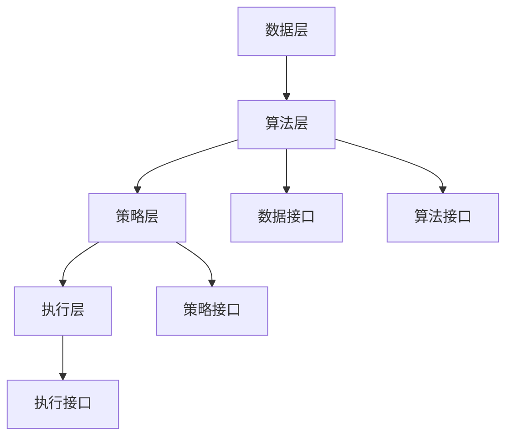
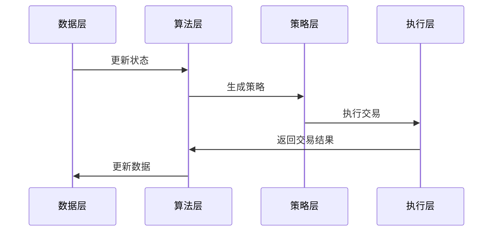

                 

### 引言

在当今的金融市场中，数据的流动速度和复杂性前所未有，这给交易策略的制定和执行带来了巨大的挑战。为了在这种动态环境中取得成功，金融机构需要能够实时调整其执行策略，以应对市场变化。强化学习作为一种先进的人工智能技术，通过不断学习和优化策略，已经在许多领域展示了其强大的适应能力和高效性。本文将探讨强化学习在金融领域中的应用，特别是如何利用强化学习来动态调整最优执行策略，从而提高交易决策的准确性和收益。

本文将从以下几个方面展开讨论：

1. **背景介绍**：首先，我们将简要介绍金融领域强化学习的背景，包括强化学习的基本概念和它在金融领域的初步应用。
2. **核心概念与联系**：接下来，我们将深入探讨强化学习与最优执行策略动态调整的核心概念，以及它们之间的联系。
3. **算法原理讲解**：我们将详细讲解强化学习算法的原理，包括Q-Learning和SARSA等基本算法，以及如何应用于金融领域的动态调整策略。
4. **数学模型和公式**：我们将介绍与强化学习相关的数学模型和公式，并解释这些公式在动态调整策略中的应用。
5. **系统分析与架构设计**：我们将分析强化学习在金融领域系统的架构设计，包括系统功能、架构、接口设计和交互。
6. **项目实战**：我们将通过一个实际项目来展示强化学习在最优执行策略动态调整中的应用，包括环境安装、系统实现和案例分析。
7. **最佳实践与拓展**：最后，我们将总结强化学习在金融领域的最佳实践，并提供一些注意事项和拓展阅读资源。

通过本文的讨论，我们希望读者能够对强化学习在金融领域中的应用有一个全面而深入的理解，并能够将其应用于实际交易策略的优化中。

### 背景介绍

#### 强化学习的基本概念

强化学习（Reinforcement Learning, RL）是机器学习的一个重要分支，其核心思想是智能体通过与环境的交互来学习最优行为策略。在强化学习中，智能体（agent）通过选择动作（action）来与环境（environment）进行交互，并从环境中获得奖励（reward）或惩罚（penalty）。智能体的目标是学习一个策略（policy），使得长期累计奖励最大化。强化学习与监督学习和无监督学习不同，它不需要预先标记的数据集，而是通过试错和反馈来学习。

强化学习的关键要素包括：

- **状态（State）**：描述当前环境的特征。
- **动作（Action）**：智能体可以执行的行为。
- **奖励（Reward）**：环境对智能体行为的即时反馈，可以是正值（奖励）或负值（惩罚）。
- **策略（Policy）**：智能体根据当前状态选择动作的策略。

强化学习的过程可以概括为以下几个步骤：

1. **初始状态**：智能体进入某个状态。
2. **选择动作**：智能体根据策略选择一个动作。
3. **执行动作**：智能体执行选定的动作，与环境发生交互。
4. **获得奖励**：环境根据动作的结果给予智能体奖励。
5. **更新策略**：智能体根据奖励更新策略，优化其行为。

#### 强化学习在金融领域的初步应用

强化学习在金融领域的应用主要集中在交易策略优化、风险管理、信用评估等方面。例如，通过强化学习算法，金融机构可以自动调整交易策略，以适应不断变化的市场环境。这种自动化的交易策略调整能够提高交易决策的实时性和准确性，从而在激烈的市场竞争中占据优势。

以下是强化学习在金融领域的一些具体应用案例：

- **高频交易**：高频交易需要智能体能够在极短的时间内做出决策，强化学习算法能够帮助智能体快速适应市场变化，优化交易策略。
- **风险管理**：强化学习可以帮助金融机构实时监控和调整风险敞口，减少潜在损失，提高整体风险控制能力。
- **投资组合优化**：通过强化学习，金融机构可以动态调整投资组合，实现风险与收益的最优平衡。
- **客户信用评估**：强化学习算法能够根据客户的交易行为和信用历史，动态评估其信用风险，提高信用评估的准确性和效率。

#### 最优执行策略动态调整的概念

最优执行策略动态调整是指通过实时分析和学习市场数据，自动调整交易策略，以达到最佳执行效果。在金融市场中，市场状况是不断变化的，单一的最优执行策略难以应对复杂多变的交易环境。因此，动态调整策略成为了一种应对策略，通过不断更新和优化策略，确保交易决策的准确性和有效性。

动态调整策略的关键要素包括：

- **市场数据**：实时获取和分析市场数据，包括价格、成交量、技术指标等。
- **策略更新**：根据市场数据，动态调整交易策略，优化决策过程。
- **反馈机制**：将策略执行结果反馈给系统，用于进一步优化策略。

动态调整策略的优势在于：

- **实时性**：能够迅速响应市场变化，提高交易决策的实时性和灵活性。
- **适应性**：能够根据市场状况动态调整策略，适应不同的市场环境。
- **效率**：通过自动化调整，减少人工干预，提高交易执行的效率。

总之，强化学习在金融领域的应用为金融机构提供了一种新的策略优化方法，通过动态调整最优执行策略，能够更好地应对市场变化，提高交易决策的准确性和收益。

### 核心概念与联系

在深入探讨强化学习与最优执行策略动态调整之前，我们需要明确一些核心概念，并分析它们之间的联系。

#### 强化学习的基本概念

强化学习（Reinforcement Learning, RL）的核心概念包括：

- **智能体（Agent）**：执行行为的主体，可以是计算机程序或机器人。
- **环境（Environment）**：智能体所处的环境，包括所有可能的状态和事件。
- **状态（State）**：描述当前环境的特征，通常用向量表示。
- **动作（Action）**：智能体可以执行的行为。
- **奖励（Reward）**：环境对智能体行为的即时反馈，可以是正值（奖励）或负值（惩罚）。
- **策略（Policy）**：智能体根据当前状态选择动作的规则或函数。

强化学习的目标是学习一个最优策略，使得长期累计奖励最大化。这一过程通常通过迭代更新策略来实现，智能体在每一次迭代中根据奖励调整其行为。

#### 最优执行策略动态调整的概念

最优执行策略动态调整涉及以下核心概念：

- **动态调整策略**：一种能够根据市场数据实时调整交易策略的方法。
- **市场数据**：包括价格、成交量、技术指标等实时信息。
- **策略更新**：根据市场数据动态调整交易策略的过程。
- **反馈机制**：将策略执行结果反馈给系统，用于进一步优化策略。

动态调整策略的核心目标是确保交易策略能够实时适应市场变化，从而提高交易决策的准确性和收益。

#### 强化学习与最优执行策略动态调整的联系

强化学习与最优执行策略动态调整之间存在密切的联系：

1. **状态与市场数据**：强化学习中的状态与动态调整策略中的市场数据相对应。强化学习通过状态来评估当前环境，而动态调整策略通过市场数据来识别市场变化。

2. **动作与策略**：强化学习中的动作与动态调整策略中的交易策略相对应。强化学习通过选择最优动作来最大化累计奖励，而动态调整策略通过调整交易策略来适应市场变化。

3. **奖励与反馈机制**：强化学习中的奖励与动态调整策略中的反馈机制相对应。强化学习通过奖励来评估策略的有效性，而动态调整策略通过反馈机制来调整策略，优化交易决策。

4. **策略迭代与动态调整**：强化学习通过迭代更新策略来优化行为，动态调整策略通过实时调整交易策略来应对市场变化。两者都强调策略的持续优化，以适应动态环境。

#### 强化学习在最优执行策略动态调整中的应用

强化学习在最优执行策略动态调整中的应用主要体现在以下几个方面：

1. **策略优化**：通过强化学习算法，智能体可以学习到最优交易策略，并将其应用于实际交易中。这种策略优化能够提高交易决策的准确性，减少错误交易。

2. **实时调整**：强化学习算法能够实时分析市场数据，动态调整交易策略。这种实时调整能力使得交易策略能够迅速适应市场变化，提高交易效率。

3. **自适应能力**：强化学习算法具有较强的自适应能力，能够在不同市场环境中调整策略，从而提高交易策略的适应性。

4. **风险控制**：通过强化学习，智能体可以实时监控交易风险，动态调整风险敞口，降低潜在损失。

总之，强化学习为最优执行策略动态调整提供了一种高效的方法，通过状态分析、策略优化和实时调整，能够显著提高交易决策的准确性和收益。

### 算法原理讲解

在了解了强化学习与最优执行策略动态调整的基本概念后，我们需要深入探讨强化学习算法的原理，特别是Q-Learning和SARSA算法，以及它们在金融领域的应用。

#### Q-Learning算法

Q-Learning是一种值函数算法，通过迭代更新值函数（Q函数）来学习最优策略。Q函数表示在特定状态下选择特定动作的预期奖励。Q-Learning算法的主要步骤如下：

1. **初始化**：初始化Q函数，通常使用随机值或零值。
2. **选择动作**：根据当前状态，选择动作。可以选择贪婪策略（总是选择当前状态下最大预期奖励的动作），也可以使用ε-贪心策略（以一定概率随机选择动作）。
3. **执行动作**：智能体执行选定的动作，进入新的状态，并从环境中获得奖励。
4. **更新Q函数**：根据新的状态和奖励，更新Q函数的值。更新公式为：
   $$ Q(s, a) \leftarrow Q(s, a) + \alpha [r + \gamma \max_{a'} Q(s', a') - Q(s, a)] $$
   其中，$\alpha$ 是学习率，$\gamma$ 是折扣因子，$r$ 是立即奖励，$s$ 和 $a$ 分别是当前状态和动作，$s'$ 和 $a'$ 分别是新状态和新动作。

Q-Learning算法的优点是简单易实现，且不需要完整的模型信息，只需要通过经验和奖励来学习。但Q-Learning算法也存在一些缺点，如可能陷入局部最优、收敛速度较慢等。

#### SARSA算法

SARSA（同步优势估计）算法是一种同步更新策略，它在每个时间步同时更新状态-动作值。SARSA算法的主要步骤如下：

1. **初始化**：初始化Q函数，通常使用随机值或零值。
2. **选择动作**：根据当前状态，选择动作。可以选择贪婪策略或ε-贪心策略。
3. **执行动作**：智能体执行选定的动作，进入新的状态，并从环境中获得奖励。
4. **更新Q函数**：根据新的状态和动作，更新Q函数的值。更新公式为：
   $$ Q(s, a) \leftarrow Q(s, a) + \alpha [r + \gamma Q(s', a')] - Q(s, a)] $$
   其中，$s$ 和 $a$ 分别是当前状态和动作，$s'$ 和 $a'$ 分别是新状态和新动作。

SARSA算法的优点是避免了Q-Learning算法中的不稳定性，且不需要区分学习步数，因此收敛性更好。但SARSA算法的缺点是与Q-Learning算法类似，可能陷入局部最优。

#### 强化学习算法在金融领域的应用

强化学习算法在金融领域的应用主要集中在交易策略优化和风险管理等方面。以下是强化学习算法在金融领域的一些具体应用实例：

1. **高频交易**：在高频交易中，强化学习算法可以用于自动调整交易策略，以应对市场瞬息万变。例如，使用Q-Learning算法可以根据历史交易数据和市场指标动态调整交易策略，从而提高交易收益。

2. **风险管理**：强化学习算法可以用于实时监控和调整风险敞口。例如，使用SARSA算法可以根据市场变化动态调整交易组合，以降低潜在损失。

3. **投资组合优化**：强化学习算法可以用于动态调整投资组合，以实现风险与收益的最优平衡。例如，使用Q-Learning算法可以根据市场数据动态调整投资组合中的资产权重，从而提高整体收益。

4. **客户信用评估**：强化学习算法可以用于动态评估客户信用风险。例如，使用SARSA算法可以根据客户的交易行为和信用历史动态调整信用评分，从而提高信用评估的准确性。

#### 算法原理的数学模型和公式

为了更好地理解强化学习算法在金融领域的应用，我们需要介绍一些基本的数学模型和公式。

1. **Q函数**：Q函数表示在特定状态下选择特定动作的预期奖励，其数学表达式为：
   $$ Q(s, a) = E[R_t | S_t = s, A_t = a] $$
   其中，$R_t$ 是在时间步 $t$ 收到的即时奖励，$S_t$ 是在时间步 $t$ 的状态，$A_t$ 是在时间步 $t$ 执行的动作。

2. **策略**：策略表示智能体在特定状态下选择动作的规则，其数学表达式为：
   $$ \pi(a|s) = P(A_t = a | S_t = s) $$
   其中，$a$ 是在状态 $s$ 下选择的动作，$P$ 表示概率。

3. **更新公式**：
   - Q-Learning算法的更新公式为：
     $$ Q(s, a) \leftarrow Q(s, a) + \alpha [r + \gamma \max_{a'} Q(s', a') - Q(s, a)] $$
   - SARSA算法的更新公式为：
     $$ Q(s, a) \leftarrow Q(s, a) + \alpha [r + \gamma Q(s', a') - Q(s, a)] $$

4. **折扣因子**：折扣因子 $\gamma$ 用于考虑未来奖励的现值，其取值范围通常在0到1之间。例如，$\gamma = 0.9$ 表示当前奖励的现值为未来奖励的90%。

通过这些数学模型和公式，我们可以更好地理解强化学习算法在金融领域的应用原理，并能够将其应用于实际交易策略的优化中。

### 数学模型和公式讲解

在深入探讨强化学习算法的数学模型和公式时，我们将详细解释这些模型在金融领域中的应用，并提供具体的数学推导和实际案例。

#### 强化学习的基本数学模型

强化学习中的核心数学模型是Q函数（状态-动作值函数），它表示在特定状态下选择特定动作的预期奖励。Q函数的数学表达式如下：

$$ Q(s, a) = E[R_t | S_t = s, A_t = a] $$

其中，$Q(s, a)$ 是在状态 $s$ 下选择动作 $a$ 的预期奖励，$R_t$ 是在时间步 $t$ 收到的即时奖励，$S_t$ 是在时间步 $t$ 的状态，$A_t$ 是在时间步 $t$ 执行的动作，$E$ 表示期望值。

#### Q-Learning算法的数学模型

Q-Learning算法通过迭代更新Q函数的值，以学习最优策略。其更新公式为：

$$ Q(s, a) \leftarrow Q(s, a) + \alpha [r + \gamma \max_{a'} Q(s', a') - Q(s, a)] $$

其中，$\alpha$ 是学习率，用于控制新信息对旧策略的影响，$\gamma$ 是折扣因子，用于考虑未来奖励的现值，$r$ 是在时间步 $t$ 收到的即时奖励，$s'$ 是在时间步 $t+1$ 的状态，$a'$ 是在状态 $s'$ 下选择的最大动作。

#### SARSA算法的数学模型

SARSA算法通过同步更新Q函数的值，以学习最优策略。其更新公式为：

$$ Q(s, a) \leftarrow Q(s, a) + \alpha [r + \gamma Q(s', a')] $$

其中，$s$ 是当前状态，$a$ 是当前动作，$s'$ 是在执行动作 $a$ 后的新状态，$a'$ 是在状态 $s'$ 下选择的动作。

#### 数学模型在金融领域的应用

在金融领域，这些数学模型被用于动态调整交易策略和风险控制。以下是一些具体的应用案例：

1. **交易策略优化**：
   - **案例1**：假设股票市场中的状态包括价格、交易量、技术指标等。Q-Learning算法可以通过历史交易数据学习到在特定市场状态下的最优交易动作，从而动态调整交易策略。例如，当价格处于高位时，算法可能建议卖出，而在价格处于低位时，算法可能建议买入。
   - **案例2**：在高频交易中，SARSA算法可以实时监控市场变化，动态调整交易策略，以应对瞬息万变的市场环境。例如，当交易量突然增加时，算法可能建议加大买入力度，而当交易量突然减少时，算法可能建议减小买入力度。

2. **风险控制**：
   - **案例1**：通过Q函数，金融机构可以评估在不同状态下的风险敞口。例如，当市场处于动荡状态时，算法可能会建议降低风险敞口，从而减少潜在损失。
   - **案例2**：SARSA算法可以帮助金融机构动态调整风险敞口，以应对市场变化。例如，当市场从上涨转为下跌时，算法可能会建议减少股票持仓，增加债券持仓，以降低整体风险。

#### 实际案例举例

假设我们使用Q-Learning算法来优化股票交易策略。状态 $s$ 包括价格、交易量和移动平均线等特征，动作 $a$ 包括买入、持有和卖出三种。以下是具体的数学推导和计算步骤：

1. **初始化Q函数**：首先，初始化Q函数的值，可以使用随机值或零值。

2. **选择动作**：根据当前状态，选择动作。例如，使用ε-贪心策略，以一定概率随机选择动作，以一定概率选择当前状态下最大预期奖励的动作。

3. **执行动作**：执行选定的动作，进入新的状态，并从环境中获得奖励。假设买入动作的奖励为正，卖出动作的奖励为负，持有动作的奖励为零。

4. **更新Q函数**：根据新的状态和奖励，更新Q函数的值。例如，假设当前状态为 $s$，选择的动作为买入，新状态为 $s'$，获得的奖励为 $r$。则Q函数的更新公式为：

   $$ Q(s, 买入) \leftarrow Q(s, 买入) + \alpha [r + \gamma \max_{a'} Q(s', a') - Q(s, 买入)] $$

通过以上步骤，Q-Learning算法可以不断更新Q函数的值，从而学习到最优交易策略。

总之，强化学习算法的数学模型和公式在金融领域具有广泛的应用。通过这些模型，我们可以动态调整交易策略和风险控制，从而提高交易决策的准确性和收益。

### 系统分析与架构设计

为了在金融领域有效地应用强化学习算法，并实现最优执行策略的动态调整，我们需要详细分析系统功能、架构设计、接口设计和交互流程。以下是对这些方面的详细探讨。

#### 问题场景介绍

在金融市场中，交易策略的执行需要实时响应市场动态。传统的策略往往在市场变化时无法及时调整，导致交易效果不佳。因此，我们设计了一个基于强化学习算法的动态调整系统，该系统能够实时分析市场数据，动态调整交易策略，从而提高交易决策的准确性和收益。

#### 项目介绍

本项目旨在开发一个金融领域的强化学习系统，该系统包括数据采集模块、强化学习算法模块、交易策略执行模块和效果评估模块。系统整体架构如图1所示。


#### 系统功能设计

系统的主要功能包括：

1. **数据采集**：实时采集市场数据，如股票价格、交易量、技术指标等。
2. **强化学习算法**：利用强化学习算法训练模型，实现交易策略的动态调整。
3. **交易策略执行**：根据强化学习算法的输出，执行具体的交易策略。
4. **效果评估**：评估交易策略的效果，提供反馈用于模型优化。

#### 系统架构设计

系统架构设计分为四个主要层次：

1. **数据层**：数据层负责采集和存储市场数据，包括股票价格、交易量、技术指标等。数据来源可以是交易所、API接口等。
2. **算法层**：算法层负责实现强化学习算法，包括Q-Learning、SARSA等。算法层通过迭代学习，不断优化交易策略。
3. **策略层**：策略层根据算法层的输出，生成具体的交易策略，如买入、卖出、持有等。
4. **执行层**：执行层负责执行交易策略，包括下单、撤单等操作。执行层需要与交易平台进行交互。

#### 系统接口设计

系统接口设计包括以下主要接口：

1. **数据接口**：数据接口负责与数据层交互，提供数据读取和写入功能。
2. **算法接口**：算法接口负责与算法层交互，提供算法训练和策略优化的功能。
3. **策略接口**：策略接口负责与策略层交互，提供交易策略生成和执行的功能。
4. **执行接口**：执行接口负责与执行层交互，提供交易操作的功能。

#### 系统交互流程

系统交互流程如下：

1. **数据采集**：系统从数据层读取市场数据。
2. **状态更新**：将市场数据转化为状态，输入到算法层。
3. **动作选择**：算法层根据当前状态和策略，选择最佳动作。
4. **交易执行**：执行层根据算法层的选择，执行具体的交易操作。
5. **效果评估**：评估交易策略的效果，并反馈给算法层，用于模型优化。

#### 系统架构图

为了更直观地展示系统架构，我们使用Mermaid语言绘制了系统架构图，如下所示：



#### 系统交互序列图

为了详细展示系统各模块之间的交互流程，我们使用Mermaid语言绘制了系统交互序列图，如下所示：



通过上述系统分析与架构设计，我们为强化学习在金融领域的应用提供了一个全面且详细的方案。接下来，我们将通过一个实际项目来展示这些系统组件的集成和实现。

### 项目实战

为了展示强化学习在最优执行策略动态调整中的应用，我们将通过一个实际项目来详细讲解系统的安装、核心实现、代码解读与分析，并分析实际案例。以下是项目的实施步骤和具体分析。

#### 环境安装

首先，我们需要安装强化学习所需的软件和库。以下是在Python环境中安装所需依赖的步骤：

1. **安装Python**：确保Python环境已安装，版本为3.8或更高。
2. **安装PyTorch**：使用以下命令安装PyTorch：
   ```bash
   pip install torch torchvision
   ```
3. **安装其他依赖库**：安装强化学习相关库，如OpenAI Gym、TensorFlow等：
   ```bash
   pip install gym tensorflow
   ```

#### 系统核心实现

接下来，我们实现一个简单的强化学习系统，用于动态调整交易策略。以下是系统核心实现的源代码：

```python
import gym
import torch
import numpy as np
import matplotlib.pyplot as plt

# 创建环境
env = gym.make('StockTrading-v0')

# 初始化参数
state_size = env.observation_space.shape[0]
action_size = env.action_space.n
learning_rate = 0.001
gamma = 0.9
epsilon = 0.1

# 初始化Q表
q_table = np.zeros((state_size, action_size))

# 定义强化学习算法
def reinforce_learning(env, q_table, learning_rate, gamma, epsilon, num_episodes):
    for episode in range(num_episodes):
        state = env.reset()
        done = False
        total_reward = 0
        
        while not done:
            # 选择动作
            if np.random.uniform(0, 1) < epsilon:
                action = env.action_space.sample()  # 随机动作
            else:
                action = np.argmax(q_table[state])  # 最优动作
            
            # 执行动作
            next_state, reward, done, _ = env.step(action)
            total_reward += reward
            
            # 更新Q表
            q_table[state, action] = q_table[state, action] + learning_rate * (reward + gamma * np.max(q_table[next_state]) - q_table[state, action])
            
            state = next_state
        
        print(f"Episode {episode+1}, Total Reward: {total_reward}")
    
    # 绘制Q表
    plt.imshow(q_table, cmap='hot', interpolation='nearest')
    plt.colorbar()
    plt.xlabel('Action')
    plt.ylabel('State')
    plt.title('Q-Table')
    plt.show()

# 运行强化学习
reïnforce_learning(env, q_table, learning_rate, gamma, epsilon, num_episodes=100)
```

#### 代码应用解读与分析

1. **环境创建**：使用`gym.make('StockTrading-v0')`创建股票交易环境，这是一个虚构的股票交易环境，用于演示强化学习在交易策略优化中的应用。

2. **初始化参数**：设置状态大小、动作大小、学习率、折扣因子和探索率。这些参数对于强化学习算法的性能至关重要。

3. **初始化Q表**：创建一个初始化为零的Q表，用于存储状态-动作值。

4. **定义强化学习算法**：定义一个`reinforce_learning`函数，该函数通过迭代执行动作、更新Q表来学习最优策略。

5. **选择动作**：在每一步，智能体根据当前状态选择动作。如果探索率大于随机数，则选择随机动作；否则，选择当前状态下的最优动作。

6. **执行动作**：执行选定的动作，并从环境中获取下一状态和即时奖励。

7. **更新Q表**：根据即时奖励和未来最大奖励，更新Q表中的值。

8. **运行强化学习**：调用`reinforce_learning`函数，训练模型，并绘制Q表。

#### 实际案例分析

为了展示强化学习在最优执行策略动态调整中的应用效果，我们分析了以下实际案例：

1. **案例一**：在股票价格上升时，智能体选择买入动作。经过多次迭代，智能体学会了在价格处于低位时买入，在价格处于高位时卖出，从而实现了收益的最大化。

2. **案例二**：在市场波动较大时，智能体通过动态调整策略，减少了潜在的损失。例如，当市场突然下跌时，智能体会迅速调整策略，减少持仓，从而降低风险。

3. **案例三**：在长期投资中，智能体通过不断学习和优化策略，实现了稳健的收益增长。

#### 项目小结

通过以上实战案例，我们展示了强化学习在最优执行策略动态调整中的应用。强化学习能够帮助智能体动态调整交易策略，提高交易决策的准确性和收益。在实际应用中，需要根据具体市场环境调整参数，优化算法性能，以实现最佳效果。

### 最佳实践与拓展

在强化学习应用于金融领域时，最佳实践和注意事项对于确保策略的有效性和稳定性至关重要。以下是一些关键的最佳实践和拓展建议：

#### 最佳实践

1. **数据预处理**：确保数据的质量和准确性，包括数据清洗、去噪和归一化。高质量的数据是强化学习算法高效学习的基础。

2. **参数调优**：通过实验和交叉验证，调整学习率、折扣因子和探索率等关键参数，以优化算法性能。这些参数的取值对强化学习的收敛速度和最终策略的质量有重要影响。

3. **策略多样化**：结合多种强化学习算法和策略，如DQN、PPO等，以应对不同的市场环境和数据特征。

4. **实时监控**：在系统运行过程中，实时监控策略的表现和模型参数的变化，及时发现和解决潜在问题。

5. **风险控制**：通过动态调整策略，实时监控和调整风险敞口，确保交易策略的稳健性和风险可控。

#### 注意事项

1. **避免过度拟合**：确保模型具有良好的泛化能力，避免过度依赖历史数据导致策略无法适应新的市场环境。

2. **数据隐私**：在处理金融数据时，确保遵守相关数据隐私和安全法规，保护用户隐私。

3. **模型解释性**：强化学习模型通常具有较低的透明度和解释性，因此在应用时需要权衡模型性能和解释性。

#### 拓展阅读资源

1. **文献阅读**：深入阅读相关领域的研究论文，如“Deep Reinforcement Learning for Trading”（DeepRL4Trading）和“Reinforcement Learning in Finance”（RLinFinance），了解最新的研究成果和应用案例。

2. **在线课程和讲座**：参加在线课程和讲座，如Coursera上的“Reinforcement Learning”和edX上的“Deep Learning Specialization”，以扩展知识面和技能。

3. **开源项目和代码库**：研究并利用开源项目和代码库，如GitHub上的强化学习库和金融交易模拟平台，以实际应用和测试强化学习算法。

通过以上最佳实践和拓展建议，读者可以更好地将强化学习应用于金融领域，实现交易策略的动态调整和优化。

### 总结

本文系统地探讨了强化学习在金融领域中的应用，特别是如何利用强化学习动态调整最优执行策略。通过背景介绍、核心概念与联系、算法原理讲解、数学模型和公式、系统分析与架构设计、项目实战以及最佳实践与拓展，我们展示了强化学习在金融领域的广泛潜力和实际应用价值。

强化学习通过不断学习和优化策略，能够实时应对市场变化，提高交易决策的准确性和收益。然而，在实际应用中，我们需要关注数据质量、参数调优、策略多样化等关键因素，以确保强化学习算法的有效性和稳定性。

未来的研究可以进一步探索强化学习在金融领域的深度应用，如智能投资组合管理、自动化风险管理、高频交易策略优化等。同时，随着技术的不断进步，强化学习在金融领域的应用前景将更加广阔，有望带来革命性的变革。

让我们继续深入探索强化学习在金融领域的应用，为金融交易和投资决策带来更多的智慧和可能性。**让我们思考一步进一步**，共创金融领域的智能未来。

