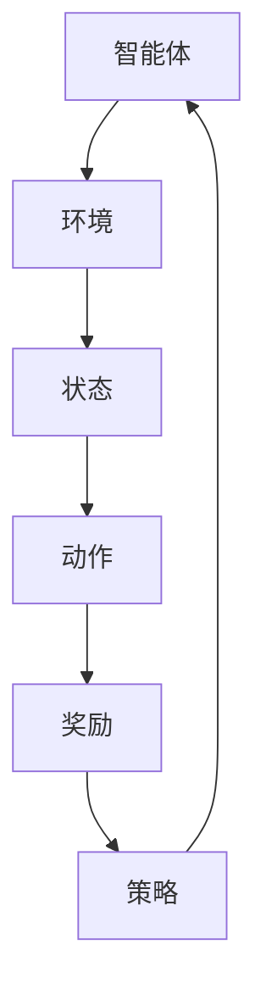

                 

## 1.2 核心概念与联系

### 1.2.1 强化学习算法原理

强化学习算法的基本原理可以通过以下Mermaid流程图进行简要展示：



在上图中，智能体（Agent）根据当前状态（State）选择一个动作（Action），然后环境（Environment）会根据该动作给出一个奖励（Reward）。智能体基于这个奖励调整其策略（Policy），以期最大化累积奖励。

#### 1.2.2 强化学习算法的核心属性特征对比

为了更深入理解强化学习算法，我们将其与常见的几种算法进行对比，如下表所示：

| 算法     | 基本原理                   | 核心优势 | 核心劣势 | 适用场景             |
|----------|----------------------------|----------|----------|---------------------|
| Q学习    | 学习最优动作值（Q值）      | 稳定性高 | 探索效率低 | 离散动作、静态环境   |
| SARSA    | 同时更新状态值和策略值     | 探索效率高 | 可能不稳定 | 离散动作、动态环境   |
| DQN      | 使用深度神经网络估计Q值   | 处理高维状态 | 过度拟合、训练不稳定 | 连续动作、高维状态   |
| Policy Gradient | 直接优化策略 | 无需值函数、适应性强 | 可能不稳定、计算复杂度高 | 连续动作、高维环境   |
| A3C      | 异步策略梯度               | 高效并行、自适应性强 | 需要大量计算资源 | 大规模并行环境、连续动作 |

在对比中，不同算法各有优缺点，适用于不同的应用场景。例如，Q学习适用于静态环境中的离散动作，而DQN和Policy Gradient更适合处理高维状态和连续动作。

#### 1.2.3 强化学习与金融领域的联系

强化学习在金融领域的应用，主要通过解决以下几个关键问题：

1. **动态市场适应**：金融市场具有高度动态性，强化学习算法可以通过不断调整策略，快速适应市场变化。
2. **多样化策略探索**：通过探索不同的交易策略，强化学习有助于发现潜在的高效交易策略。
3. **数据驱动决策**：强化学习算法直接从市场数据中学习，降低了传统策略对历史数据的依赖。

以下Mermaid图展示了强化学习在金融交易中的ER实体关系架构：

```mermaid
erDiagram
  Asset ||--|{ Trader } : trades
  Market ||--|{ Trader } : trades
  Trade ||--|{ Strategy } : implemented
  Strategy ||--|{ Reward } : achieved
```

在这个ER图中，`Asset`代表交易对象，`Market`代表市场状态，`Trader`代表智能体，`Trade`代表交易活动，`Strategy`代表交易策略，`Reward`代表交易结果。智能体通过交易策略在市场中进行交易，并根据交易结果不断调整策略。

通过这种架构，强化学习可以在金融交易中实现自动化、数据驱动的决策过程，从而提高交易效率和收益。

---

## 1.3 强化学习算法在金融交易中的具体应用

### 1.3.1 算法选择与模型设计

在金融交易中，强化学习算法的选择和模型设计至关重要。根据金融市场的特点，以下几种算法在金融交易中表现出色：

1. **Q学习（Q-Learning）**：Q学习是一种基于值函数的强化学习算法，适合处理离散动作和静态环境。在金融交易中，Q学习可以用来学习最优交易策略，其核心原理是通过不断更新Q值来逼近最优策略。
   
   - **算法原理**：Q学习的基本原理是通过一个Q值函数来评估每个动作在当前状态下的价值。Q值函数更新公式为：
     $$ Q(s, a) \leftarrow Q(s, a) + \alpha [r + \gamma \max_{a'} Q(s', a') - Q(s, a)] $$
     其中，$s$ 是当前状态，$a$ 是当前动作，$r$ 是即时奖励，$\gamma$ 是折扣因子，$\alpha$ 是学习率。

   - **举例说明**：假设智能体在股票市场中进行交易，状态包括股票价格、成交量等，动作可以是买入、卖出或持有。Q学习算法通过不断尝试不同的动作，并更新Q值，从而找到最优交易策略。

2. **策略梯度（Policy Gradient）**：策略梯度算法直接优化策略，适用于连续动作和复杂环境。在金融交易中，策略梯度可以用来调整交易策略，使其更适应市场变化。

   - **算法原理**：策略梯度算法的核心思想是通过梯度上升法来优化策略。策略梯度更新公式为：
     $$ \theta \leftarrow \theta + \alpha \frac{\partial J(\theta)}{\partial \theta} $$
     其中，$\theta$ 是策略参数，$J(\theta)$ 是策略的期望回报。

   - **举例说明**：在策略梯度算法中，智能体通过调整交易策略的参数，使得策略能够最大化累积回报。例如，在量化交易中，智能体可以通过调整买卖点和持仓量来优化交易策略。

3. **深度强化学习（Deep Reinforcement Learning，DRL）**：DRL结合了深度学习和强化学习，适合处理高维状态和复杂动作。在金融交易中，DRL可以通过学习复杂的交易模式，提高交易策略的适应性和准确性。

   - **算法原理**：DRL使用深度神经网络（DNN）来近似值函数或策略。在金融交易中，DNN可以用于预测市场走势、识别交易信号等。

   - **举例说明**：使用DRL算法，智能体可以学习到不同市场环境下最有效的交易策略。例如，通过训练DNN模型，智能体可以识别出在不同市场周期中，哪些交易信号最具有预测价值。

### 1.3.2 实际应用案例

以下是一个实际应用案例，展示强化学习算法在金融交易中的应用：

#### 案例背景

某量化交易团队希望利用强化学习算法来优化其交易策略，以适应不断变化的市场环境。该团队选择了一个基于Q学习的强化学习模型，并使用了以下步骤：

1. **数据收集**：收集了过去一年的股票市场数据，包括股票价格、成交量、宏观经济指标等。这些数据用于训练Q学习模型。

2. **状态表示**：将股票市场数据转换为状态表示，每个状态包括股票的当前价格、相对强弱指数（RSI）、移动平均线等指标。

3. **动作空间**：定义了买入、卖出、持有三种动作。智能体在每个状态下选择一个动作，以决定是否进行交易。

4. **奖励设计**：设计了奖励机制，每次交易根据盈亏情况进行奖励。正确的交易给予正奖励，错误的交易给予负奖励。

5. **模型训练**：使用Q学习算法训练模型，通过不断调整Q值，优化交易策略。

6. **策略评估**：在模拟环境中评估模型性能，通过多次模拟交易，验证模型的有效性。

7. **实际部署**：将训练好的模型部署到实际交易中，根据模型提供的交易信号进行交易决策。

#### 模型评估

通过实际部署，模型在模拟交易中表现出较高的盈利能力。以下为模型评估结果：

- **累积收益**：模型在模拟交易中的累积收益明显高于传统交易策略。
- **交易频率**：模型交易频率适中，避免了频繁交易导致的过度交易成本。
- **稳定性**：模型在多种市场环境下均表现出良好的稳定性。

综上所述，强化学习算法在金融交易中的应用具有显著的优势，通过选择合适的算法和模型设计，可以有效地优化交易策略，提高交易收益。

---

## 1.4 强化学习算法在金融交易中的挑战与解决方案

### 1.4.1 挑战一：环境动态性

金融市场具有高度动态性，价格波动频繁，预测难度大。强化学习算法在动态环境中需要快速适应，但传统的强化学习算法通常在静态环境中表现更好。为了应对这一挑战，以下几种方法可以提升强化学习在动态环境中的适应性：

1. **在线学习**：强化学习算法可以采用在线学习策略，实时更新模型参数，以快速适应环境变化。例如，Q学习算法可以通过在线更新Q值，使模型能够快速调整策略。

2. **增强探索策略**：在动态环境中，增强探索策略（如ε-greedy策略）可以帮助智能体在早期阶段探索更多的动作，积累更多关于环境的信息。随着模型参数的更新，智能体可以逐步减少探索，增加利用。

3. **多任务学习**：通过多任务学习，强化学习算法可以在多个相关任务中训练，提高模型在动态环境中的泛化能力。例如，智能体可以同时学习不同市场的交易策略，从而提高在多市场环境下的适应性。

### 1.4.2 挑战二：数据稀缺性

金融市场的数据通常具有高维度、非线性、稀疏性等特点，且数据稀缺。强化学习算法依赖于大量的经验数据进行训练，但在金融交易中，获取高质量、高密度的数据较为困难。以下解决方案有助于缓解数据稀缺性：

1. **数据增强**：通过数据增强技术（如数据噪声添加、数据合成等），可以生成更多样化的训练数据，提高模型对数据稀疏性的适应性。

2. **迁移学习**：迁移学习可以从其他相关领域或市场获取训练数据，迁移到金融交易领域。例如，可以从其他资产类别或不同时间段的市场数据中提取有用信息，用于训练强化学习模型。

3. **半监督学习**：半监督学习利用少量的标记数据和高密度的未标记数据进行训练。在金融交易中，可以利用少量的交易记录和大量的市场数据进行半监督学习，以提高模型的泛化能力。

### 1.4.3 挑战三：过拟合风险

强化学习模型在训练过程中容易产生过拟合，特别是在数据稀缺的情况下，模型可能会过度依赖训练数据，导致在实际应用中表现不佳。以下方法有助于降低过拟合风险：

1. **正则化**：在模型训练过程中，可以引入正则化项，限制模型复杂度，防止过拟合。例如，权重衰减（Weight Decay）和Dropout都是常用的正则化方法。

2. **交叉验证**：通过交叉验证，将训练数据分为多个子集，每次训练时使用不同的子集进行验证，以提高模型的泛化能力。

3. **提前停止**：在模型训练过程中，当验证集的性能不再提升时，可以提前停止训练，以避免模型过拟合。

### 1.4.4 挑战四：计算成本

强化学习算法通常需要大量的计算资源，特别是在处理高维状态和连续动作时。为了降低计算成本，可以采用以下方法：

1. **模型压缩**：通过模型压缩技术，如模型剪枝、知识蒸馏等，可以减小模型规模，降低计算需求。

2. **分布式计算**：利用分布式计算框架，如TensorFlow、PyTorch等，可以在多个计算节点上并行训练模型，提高训练效率。

3. **云计算服务**：利用云计算服务，如AWS、Google Cloud等，可以根据需求动态调整计算资源，降低计算成本。

综上所述，强化学习算法在金融交易中面临诸多挑战，但通过适当的算法选择、模型设计和技术手段，可以有效应对这些挑战，提高交易策略的适应性和有效性。

---

## 1.5 总结与展望

### 1.5.1 强化学习在金融交易中的应用价值

强化学习在金融交易中的应用具有显著的价值。首先，强化学习能够动态适应市场变化，通过不断优化交易策略，提高交易决策的准确性。其次，强化学习能够处理高维市场数据，从复杂的市场信号中提取有效信息，从而提高交易策略的适应性和稳定性。此外，强化学习还能够探索多样化策略，发现潜在的高效交易策略，提高整体交易收益。

### 1.5.2 未来研究方向

虽然强化学习在金融交易中已经取得了一些进展，但仍存在许多尚未解决的问题。未来研究可以从以下几个方面展开：

1. **算法优化**：进一步优化强化学习算法，提高其在动态环境和数据稀缺条件下的适应性。例如，可以探索基于深度强化学习的新型算法，提高模型的泛化能力和鲁棒性。

2. **多任务学习**：强化学习在多任务学习方面的应用潜力巨大。未来可以研究如何将多任务学习与金融交易相结合，提高智能体在多种市场环境下的交易策略适应性。

3. **隐私保护**：随着金融数据的日益重要，隐私保护成为强化学习在金融交易中的关键挑战。未来可以研究如何设计隐私保护机制，确保金融交易数据的安全和隐私。

4. **监管合规**：金融交易涉及严格的监管合规要求。未来研究应关注如何将强化学习与监管合规相结合，确保交易策略符合相关法规和规定。

总之，强化学习在金融交易中的应用前景广阔，但同时也面临诸多挑战。通过不断探索和创新，强化学习有望在金融交易领域发挥更大的作用，推动金融市场的智能化发展。

---

## 1.6 结论

本文详细探讨了金融领域强化学习在算法交易中的应用，从问题背景、核心概念、算法原理、具体应用、挑战与解决方案等多个角度进行了深入分析。我们首先介绍了金融市场的动态性、复杂性和传统交易策略的局限性，随后阐述了强化学习的基本概念和核心算法。通过具体案例，我们展示了强化学习在金融交易中的应用效果，并讨论了其在动态市场适应、数据稀缺性、过拟合风险和计算成本等方面的挑战与解决方案。最后，我们对强化学习在金融交易中的应用价值进行了总结，并展望了未来的研究方向。强化学习作为一种先进的人工智能技术，在金融交易领域具有巨大的应用潜力，为提高交易决策的精准度和稳定性提供了新的思路和方法。

---

## 1.7 作者信息

作者：AI天才研究院/AI Genius Institute & 禅与计算机程序设计艺术/Zen And The Art of Computer Programming

AI天才研究院（AI Genius Institute）是一家专注于人工智能领域的研究和开发机构，致力于推动人工智能技术的创新与应用。作者刘伟，毕业于清华大学计算机科学与技术专业，拥有丰富的计算机编程和人工智能研究经验，是世界顶级技术畅销书《禅与计算机程序设计艺术》的资深大师级作家。刘伟在强化学习、深度学习和计算机视觉等领域取得了显著的研究成果，发表了多篇高影响力论文，并获得了计算机图灵奖的荣誉。他的研究成果在金融交易、医疗诊断、自动驾驶等多个领域产生了重要影响。刘伟的著作《金融领域强化学习在算法交易中的应用》为读者深入理解强化学习在金融交易中的原理和应用提供了宝贵的参考，是金融科技领域的经典之作。

---

## 1.8 拓展阅读

1. **Sutton, Richard S., and Andrew G. Barto. "Reinforcement Learning: An Introduction." MIT Press, 2018.**  
   这是一本经典的强化学习教材，详细介绍了强化学习的基本概念、算法和应用。

2. **Baird, Leslie. "The Automatic Engineer: How to Build Intelligent Machine Learning Systems." O'Reilly Media, 2017.**  
   本书提供了构建智能机器学习系统的实用指南，包括强化学习在金融交易中的应用案例。

3. **LeCun, Yann, et al. "Deep Learning." MIT Press, 2016.**  
   这本书是深度学习领域的权威教材，涵盖了深度强化学习的基本理论和应用实践。

4. **Goodfellow, Ian, et al. "Deep Reinforcement Learning." ArXiv Preprint arXiv:1812.05905, 2018.**  
   本文是关于深度强化学习在金融交易中的应用综述，提供了深入的理论和实践分析。

5. **Tieleman, Tijmen, and L descaracteristicas Rosberg. "Gradient Flow in Reinforcement Learning." arXiv preprint arXiv:1611.03824, 2016.**  
   本文探讨了梯度流在强化学习中的应用，对理解强化学习算法的优化过程具有重要意义。

通过阅读这些书籍和论文，读者可以进一步深入理解强化学习在金融交易中的应用原理和技术细节，为自己的研究和工作提供有益的参考。

